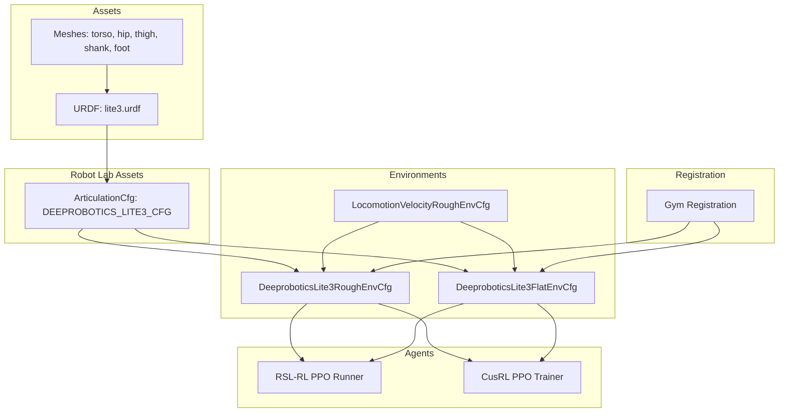
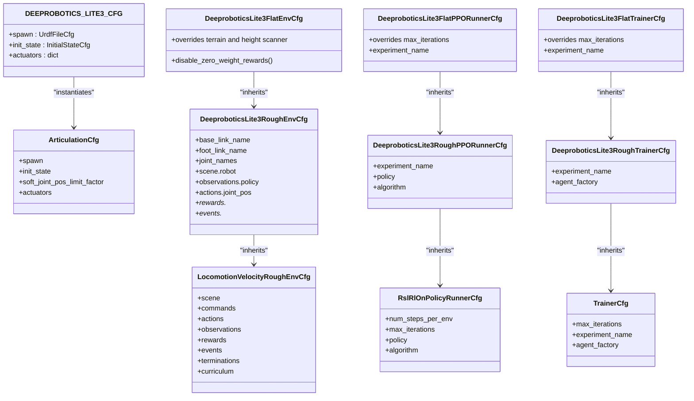
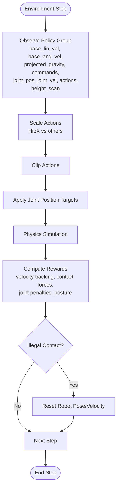
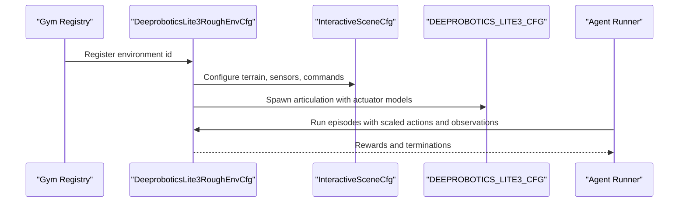
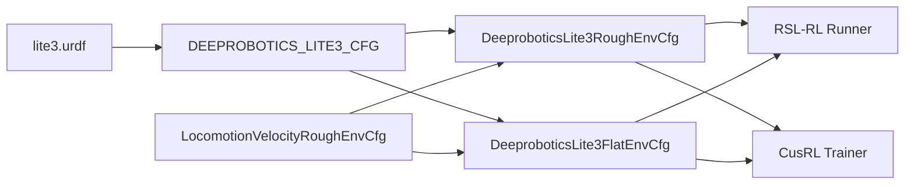

# Deeprobotics Lite3 Quadruped

<cite>
**Referenced Files in This Document**
- [README.md](file://README.md)
- [deeprobotics.py](file://source/robot_lab/robot_lab/assets/deeprobotics.py)
- [lite3.urdf](file://source/robot_lab/data/Robots/deeprobotics/lite3_description/urdf/lite3.urdf)
- [rough_env_cfg.py](file://source/robot_lab/robot_lab/tasks/manager_based/locomotion/velocity/config/quadruped/deeprobotics_lite3/rough_env_cfg.py)
- [flat_env_cfg.py](file://source/robot_lab/robot_lab/tasks/manager_based/locomotion/velocity/config/quadruped/deeprobotics_lite3/flat_env_cfg.py)
- [velocity_env_cfg.py](file://source/robot_lab/robot_lab/tasks/manager_based/locomotion/velocity/velocity_env_cfg.py)
- [rsl_rl_ppo_cfg.py](file://source/robot_lab/robot_lab/tasks/manager_based/locomotion/velocity/config/quadruped/deeprobotics_lite3/agents/rsl_rl_ppo_cfg.py)
- [cusrl_ppo_cfg.py](file://source/robot_lab/robot_lab/tasks/manager_based/locomotion/velocity/config/quadruped/deeprobotics_lite3/agents/cusrl_ppo_cfg.py)
- [__init__.py](file://source/robot_lab/robot_lab/tasks/manager_based/locomotion/velocity/config/quadruped/deeprobotics_lite3/__init__.py)
</cite>

## Table of Contents
1. [Introduction](#introduction)
2. [Project Structure](#project-structure)
3. [Core Components](#core-components)
4. [Architecture Overview](#architecture-overview)
5. [Detailed Component Analysis](#detailed-component-analysis)
6. [Dependency Analysis](#dependency-analysis)
7. [Performance Considerations](#performance-considerations)
8. [Troubleshooting Guide](#troubleshooting-guide)
9. [Conclusion](#conclusion)
10. [Appendices](#appendices)

## Introduction
This document describes the Deeprobotics Lite3 quadruped configuration within the Robot Lab framework. It explains the robot’s kinematic structure, actuator specifications, simulation parameters, and integration into the locomotion velocity environments. It also provides guidance for training scenarios, environment suitability, and reinforcement learning considerations tailored to the Lite3’s lightweight and efficient design.

## Project Structure
The Lite3 configuration is organized under the Robot Lab extension and integrates with the Isaac Lab ecosystem. The key elements are:
- URDF model and meshes for the Lite3 robot
- Articulation configuration that defines spawning, initial state, and actuator models
- Environment configurations for flat and rough terrains
- Agent runner configurations for RSL-RL and CusRL
- Gym environment registration

**Diagram sources**
- [deeprobotics.py](file://source/robot_lab/robot_lab/assets/deeprobotics.py#L10-L63)
- [lite3.urdf](file://source/robot_lab/data/Robots/deeprobotics/lite3_description/urdf/lite3.urdf#L1-L565)
- [rough_env_cfg.py](file://source/robot_lab/robot_lab/tasks/manager_based/locomotion/velocity/config/quadruped/deeprobotics_lite3/rough_env_cfg.py#L14-L162)
- [flat_env_cfg.py](file://source/robot_lab/robot_lab/tasks/manager_based/locomotion/velocity/config/quadruped/deeprobotics_lite3/flat_env_cfg.py#L9-L30)
- [velocity_env_cfg.py](file://source/robot_lab/robot_lab/tasks/manager_based/locomotion/velocity/velocity_env_cfg.py#L42-L95)
- [rsl_rl_ppo_cfg.py](file://source/robot_lab/robot_lab/tasks/manager_based/locomotion/velocity/config/quadruped/deeprobotics_lite3/agents/rsl_rl_ppo_cfg.py#L9-L46)
- [cusrl_ppo_cfg.py](file://source/robot_lab/robot_lab/tasks/manager_based/locomotion/velocity/config/quadruped/deeprobotics_lite3/agents/cusrl_ppo_cfg.py#L10-L49)
- [__init__.py](file://source/robot_lab/robot_lab/tasks/manager_based/locomotion/velocity/config/quadruped/deeprobotics_lite3/__init__.py#L12-L32)

**Section sources**
- [README.md](file://README.md#L11-L50)
- [__init__.py](file://source/robot_lab/robot_lab/tasks/manager_based/locomotion/velocity/config/quadruped/deeprobotics_lite3/__init__.py#L12-L32)

## Core Components
- Robot model: Lite3 quadruped with four legs, each containing HipX, HipY, and Knee joints.
- Actuation: Separate DC-motor models for Hip and Knee actuators with per-joint effort/velocity limits and PD gains.
- Initial pose: Defined in the articulation configuration with default joint positions and zero velocities.
- Simulation properties: Gravity enabled, contact sensors activated, and solver iteration counts tuned for stability.
- Environments: Flat and rough terrains derived from the base velocity locomotion configuration, with reward shaping and action scaling tailored for the Lite3.

**Section sources**
- [deeprobotics.py](file://source/robot_lab/robot_lab/assets/deeprobotics.py#L10-L63)
- [lite3.urdf](file://source/robot_lab/data/Robots/deeprobotics/lite3_description/urdf/lite3.urdf#L1-L565)
- [rough_env_cfg.py](file://source/robot_lab/robot_lab/tasks/manager_based/locomotion/velocity/config/quadruped/deeprobotics_lite3/rough_env_cfg.py#L14-L162)
- [flat_env_cfg.py](file://source/robot_lab/robot_lab/tasks/manager_based/locomotion/velocity/config/quadruped/deeprobotics_lite3/flat_env_cfg.py#L9-L30)

## Architecture Overview
The Lite3 configuration composes the URDF-based robot model into an ArticulationCfg, which is then embedded into environment configurations. The environments inherit from the base velocity locomotion configuration and customize observations, actions, rewards, and events. Agents (RSL-RL and CusRL) are configured with runner/trainer settings.

**Diagram sources**
- [deeprobotics.py](file://source/robot_lab/robot_lab/assets/deeprobotics.py#L10-L63)
- [rough_env_cfg.py](file://source/robot_lab/robot_lab/tasks/manager_based/locomotion/velocity/config/quadruped/deeprobotics_lite3/rough_env_cfg.py#L14-L162)
- [flat_env_cfg.py](file://source/robot_lab/robot_lab/tasks/manager_based/locomotion/velocity/config/quadruped/deeprobotics_lite3/flat_env_cfg.py#L9-L30)
- [velocity_env_cfg.py](file://source/robot_lab/robot_lab/tasks/manager_based/locomotion/velocity/velocity_env_cfg.py#L42-L95)
- [rsl_rl_ppo_cfg.py](file://source/robot_lab/robot_lab/tasks/manager_based/locomotion/velocity/config/quadruped/deeprobotics_lite3/agents/rsl_rl_ppo_cfg.py#L9-L46)
- [cusrl_ppo_cfg.py](file://source/robot_lab/robot_lab/tasks/manager_based/locomotion/velocity/config/quadruped/deeprobotics_lite3/agents/cusrl_ppo_cfg.py#L10-L49)

## Detailed Component Analysis

### Kinematic Structure and Physical Characteristics
- Body segments: Torso with inertial properties and collision primitives; four identical legs (front-left, front-right, back-left, back-right).
- Joints per leg: HipX (provides lateral movement), HipY (flexion/extension), Knee (extension/flexion).
- Foot model: Fixed spherical contact points for compliant ground interaction.
- Geometry and collisions: Box and cylinder approximations for collision shapes; STL meshes for visuals.

Key kinematic and inertial properties are defined in the URDF, including:
- Torso mass and inertia
- Hip, thigh, shank, and foot inertial properties
- Joint effort and velocity limits
- Contact parameters for friction and damping

**Section sources**
- [lite3.urdf](file://source/robot_lab/data/Robots/deeprobotics/lite3_description/urdf/lite3.urdf#L9-L36)
- [lite3.urdf](file://source/robot_lab/data/Robots/deeprobotics/lite3_description/urdf/lite3.urdf#L40-L61)
- [lite3.urdf](file://source/robot_lab/data/Robots/deeprobotics/lite3_description/urdf/lite3.urdf#L69-L97)
- [lite3.urdf](file://source/robot_lab/data/Robots/deeprobotics/lite3_description/urdf/lite3.urdf#L98-L132)
- [lite3.urdf](file://source/robot_lab/data/Robots/deeprobotics/lite3_description/urdf/lite3.urdf#L134-L168)
- [lite3.urdf](file://source/robot_lab/data/Robots/deeprobotics/lite3_description/urdf/lite3.urdf#L171-L192)
- [lite3.urdf](file://source/robot_lab/data/Robots/deeprobotics/lite3_description/urdf/lite3.urdf#L201-L230)
- [lite3.urdf](file://source/robot_lab/data/Robots/deeprobotics/lite3_description/urdf/lite3.urdf#L231-L265)
- [lite3.urdf](file://source/robot_lab/data/Robots/deeprobotics/lite3_description/urdf/lite3.urdf#L267-L294)
- [lite3.urdf](file://source/robot_lab/data/Robots/deeprobotics/lite3_description/urdf/lite3.urdf#L304-L325)
- [lite3.urdf](file://source/robot_lab/data/Robots/deeprobotics/lite3_description/urdf/lite3.urdf#L333-L361)
- [lite3.urdf](file://source/robot_lab/data/Robots/deeprobotics/lite3_description/urdf/lite3.urdf#L362-L396)
- [lite3.urdf](file://source/robot_lab/data/Robots/deeprobotics/lite3_description/urdf/lite3.urdf#L398-L432)
- [lite3.urdf](file://source/robot_lab/data/Robots/deeprobotics/lite3_description/urdf/lite3.urdf#L435-L456)
- [lite3.urdf](file://source/robot_lab/data/Robots/deeprobotics/lite3_description/urdf/lite3.urdf#L464-L492)
- [lite3.urdf](file://source/robot_lab/data/Robots/deeprobotics/lite3_description/urdf/lite3.urdf#L493-L527)
- [lite3.urdf](file://source/robot_lab/data/Robots/deeprobotics/lite3_description/urdf/lite3.urdf#L529-L563)

### Actuator Specifications and Control Strategy
- Actuator groups:
  - Hip actuators: controlled via DCMotorCfg with effort limit, velocity limit, stiffness, damping, and friction parameters.
  - Knee actuators: controlled via DCMotorCfg with distinct effort and velocity limits.
- Joint-level PD gains are disabled in the URDF conversion, relying on motor models for torque control.
- Action scaling in environments reduces the range for HipX vs. other joints to improve stability and learning dynamics.

**Diagram sources**
- [velocity_env_cfg.py](file://source/robot_lab/robot_lab/tasks/manager_based/locomotion/velocity/velocity_env_cfg.py#L130-L200)
- [rough_env_cfg.py](file://source/robot_lab/robot_lab/tasks/manager_based/locomotion/velocity/config/quadruped/deeprobotics_lite3/rough_env_cfg.py#L46-L51)
- [deeprobotics.py](file://source/robot_lab/robot_lab/assets/deeprobotics.py#L43-L62)

**Section sources**
- [deeprobotics.py](file://source/robot_lab/robot_lab/assets/deeprobotics.py#L43-L62)
- [rough_env_cfg.py](file://source/robot_lab/robot_lab/tasks/manager_based/locomotion/velocity/config/quadruped/deeprobotics_lite3/rough_env_cfg.py#L46-L51)

### Simulation Parameters and Initial Pose Setup
- Spawn configuration:
  - Fix base to false for free-floating simulation.
  - Merge fixed joints enabled.
  - Contact sensors activated.
  - Rigid body properties: gravity enabled, damping zero, high max velocities.
  - Articulation solver iterations tuned for position accuracy.
- Initial state:
  - Position: (0, 0, 0.35) to place the robot near its default standing height.
  - Joint positions: HipX near zero, HipY around -0.8 rad, Knee around 1.6 rad per leg.
  - Joint velocities: zero for all joints.

**Section sources**
- [deeprobotics.py](file://source/robot_lab/robot_lab/assets/deeprobotics.py#L10-L42)

### Environment Integration and Reward Shaping
- Base environment:
  - Terrain: rough generator with configurable material properties.
  - Sensors: height scanners and contact sensors.
  - Commands: base velocity with configurable ranges.
- Lite3-specific overrides:
  - Base link and foot link naming conventions.
  - Joint names list for policy observations and actions.
  - Observation scaling for base linear/angular velocities, joint positions, and velocities.
  - Action scaling: reduced range for HipX joints compared to other joints.
  - Rewards emphasize velocity tracking, contact forces, joint torques/accelerations, mirror symmetries, and posture; several terrain-related terms are disabled for simplicity.
  - Events include randomized base pose/velocity and randomized mass/inertia/com position.
  - Terrain curriculum disabled in Lite3 environments.

**Diagram sources**
- [__init__.py](file://source/robot_lab/robot_lab/tasks/manager_based/locomotion/velocity/config/quadruped/deeprobotics_lite3/__init__.py#L12-L32)
- [rough_env_cfg.py](file://source/robot_lab/robot_lab/tasks/manager_based/locomotion/velocity/config/quadruped/deeprobotics_lite3/rough_env_cfg.py#L27-L34)
- [velocity_env_cfg.py](file://source/robot_lab/robot_lab/tasks/manager_based/locomotion/velocity/velocity_env_cfg.py#L42-L95)
- [deeprobotics.py](file://source/robot_lab/robot_lab/assets/deeprobotics.py#L10-L42)

**Section sources**
- [rough_env_cfg.py](file://source/robot_lab/robot_lab/tasks/manager_based/locomotion/velocity/config/quadruped/deeprobotics_lite3/rough_env_cfg.py#L14-L162)
- [flat_env_cfg.py](file://source/robot_lab/robot_lab/tasks/manager_based/locomotion/velocity/config/quadruped/deeprobotics_lite3/flat_env_cfg.py#L9-L30)
- [velocity_env_cfg.py](file://source/robot_lab/robot_lab/tasks/manager_based/locomotion/velocity/velocity_env_cfg.py#L42-L95)

### Reinforcement Learning Configurations
- RSL-RL PPO:
  - On-policy updates with 24 steps per environment.
  - Actor/Critic MLP architectures with ELU activations.
  - PPO algorithm with adaptive KL control and gradient clipping.
- CusRL PPO:
  - Similar hyperparameters with hook-based training pipeline.
- Flat vs. rough:
  - Flat environment disables terrain and height scanning, and sets fewer iterations for quicker convergence.

**Section sources**
- [rsl_rl_ppo_cfg.py](file://source/robot_lab/robot_lab/tasks/manager_based/locomotion/velocity/config/quadruped/deeprobotics_lite3/agents/rsl_rl_ppo_cfg.py#L9-L46)
- [cusrl_ppo_cfg.py](file://source/robot_lab/robot_lab/tasks/manager_based/locomotion/velocity/config/quadruped/deeprobotics_lite3/agents/cusrl_ppo_cfg.py#L10-L49)
- [flat_env_cfg.py](file://source/robot_lab/robot_lab/tasks/manager_based/locomotion/velocity/config/quadruped/deeprobotics_lite3/flat_env_cfg.py#L15-L29)

## Dependency Analysis
The Lite3 configuration depends on:
- URDF model and meshes for geometry and inertial properties.
- ArticulationCfg to define spawning and actuator models.
- Environment base classes for terrain, sensors, commands, and MDP terms.
- Agent runners for training and evaluation.

**Diagram sources**
- [lite3.urdf](file://source/robot_lab/data/Robots/deeprobotics/lite3_description/urdf/lite3.urdf#L1-L565)
- [deeprobotics.py](file://source/robot_lab/robot_lab/assets/deeprobotics.py#L10-L63)
- [rough_env_cfg.py](file://source/robot_lab/robot_lab/tasks/manager_based/locomotion/velocity/config/quadruped/deeprobotics_lite3/rough_env_cfg.py#L14-L162)
- [flat_env_cfg.py](file://source/robot_lab/robot_lab/tasks/manager_based/locomotion/velocity/config/quadruped/deeprobotics_lite3/flat_env_cfg.py#L9-L30)
- [velocity_env_cfg.py](file://source/robot_lab/robot_lab/tasks/manager_based/locomotion/velocity/velocity_env_cfg.py#L42-L95)
- [rsl_rl_ppo_cfg.py](file://source/robot_lab/robot_lab/tasks/manager_based/locomotion/velocity/config/quadruped/deeprobotics_lite3/agents/rsl_rl_ppo_cfg.py#L9-L46)
- [cusrl_ppo_cfg.py](file://source/robot_lab/robot_lab/tasks/manager_based/locomotion/velocity/config/quadruped/deeprobotics_lite3/agents/cusrl_ppo_cfg.py#L10-L49)

**Section sources**
- [__init__.py](file://source/robot_lab/robot_lab/tasks/manager_based/locomotion/velocity/config/quadruped/deeprobotics_lite3/__init__.py#L12-L32)

## Performance Considerations
- Lightweight design: Low inertia and compact dimensions support fast accelerations and agile gaits.
- Joint limits and actuator ratings: Ensure actions remain within effort/velocity bounds to avoid saturation and numerical instability.
- Solver tuning: Position iteration count optimized for stability; consider adjusting for higher fidelity simulations.
- Reward balance: Emphasis on velocity tracking and contact forces encourages dynamic gaits; reduce penalties if stability is prioritized.
- Training efficiency: Flat environments converge faster; use them for early-stage training, then transition to rough terrain.

## Troubleshooting Guide
Common issues and resolutions:
- Excessive joint torques or oscillations:
  - Reduce action scale for HipX joints.
  - Increase damping or decrease stiffness in actuator models.
- Poor contact detection:
  - Verify foot collision geometry and contact parameters.
  - Confirm contact sensor configuration and body names.
- Instability at start-up:
  - Adjust initial pose to avoid extreme joint angles.
  - Enable small compliance in PD gains if needed.
- Training divergence:
  - Lower learning rate or adjust KL target.
  - Normalize observations if not already enabled.
  - Reduce action ranges and increase exploration noise initially.

**Section sources**
- [rough_env_cfg.py](file://source/robot_lab/robot_lab/tasks/manager_based/locomotion/velocity/config/quadruped/deeprobotics_lite3/rough_env_cfg.py#L46-L51)
- [deeprobotics.py](file://source/robot_lab/robot_lab/assets/deeprobotics.py#L43-L62)

## Conclusion
The Deeprobotics Lite3 configuration in Robot Lab provides a compact, efficient quadruped platform suitable for reinforcement learning research. Its URDF-based structure, explicit actuator models, and environment customization enable rapid prototyping and robust training across flat and rough terrains. The provided configurations offer a solid baseline for locomotion tasks, with clear pathways to tune control strategies and reward structures for specific scenarios.

## Appendices

### Technical Specifications Summary
- Mass and inertia:
  - Torso mass and inertia defined in the URDF.
  - Segment masses and inertias for hips, thighs, shanks, and feet.
- Dimensions:
  - Collision boxes and cylinders approximate leg geometry.
  - Foot contact spheres define ground interaction points.
- Joint limits:
  - HipX: ±0.523 rad
  - HipY: -2.67 to 0.314 rad
  - Knee: 0.524 to 2.792 rad
- Actuator ratings:
  - Hip motors: effort 24 N⋅m, velocity 26.2 rad/s
  - Knee motors: effort 36 N⋅m, velocity 17.3 rad/s
- Initial pose:
  - Z position ~0.35 m; HipY approximately -0.8 rad; Knee approximately 1.6 rad per leg.

**Section sources**
- [lite3.urdf](file://source/robot_lab/data/Robots/deeprobotics/lite3_description/urdf/lite3.urdf#L10-L13)
- [lite3.urdf](file://source/robot_lab/data/Robots/deeprobotics/lite3_description/urdf/lite3.urdf#L62-L68)
- [lite3.urdf](file://source/robot_lab/data/Robots/deeprobotics/lite3_description/urdf/lite3.urdf#L91-L97)
- [lite3.urdf](file://source/robot_lab/data/Robots/deeprobotics/lite3_description/urdf/lite3.urdf#L126-L132)
- [deeprobotics.py](file://source/robot_lab/robot_lab/assets/deeprobotics.py#L33-L41)

### Training Scenarios and Environment Suitability
- Recommended progression:
  - Start with flat terrain to learn basic gaits and stabilize control.
  - Transition to rough terrain to improve robustness and adaptability.
- Suitable tasks:
  - Velocity tracking on flat surfaces.
  - Terrain adaptation and obstacle negotiation on rough terrain.
- Integration tips:
  - Use Gym ids for environment selection.
  - Choose agent runner based on preference (RSL-RL or CusRL).
  - Adjust curriculum and reward weights according to task difficulty.

**Section sources**
- [README.md](file://README.md#L17-L31)
- [__init__.py](file://source/robot_lab/robot_lab/tasks/manager_based/locomotion/velocity/config/quadruped/deeprobotics_lite3/__init__.py#L12-L32)
- [flat_env_cfg.py](file://source/robot_lab/robot_lab/tasks/manager_based/locomotion/velocity/config/quadruped/deeprobotics_lite3/flat_env_cfg.py#L15-L29)
- [rough_env_cfg.py](file://source/robot_lab/robot_lab/tasks/manager_based/locomotion/velocity/config/quadruped/deeprobotics_lite3/rough_env_cfg.py#L152-L162)