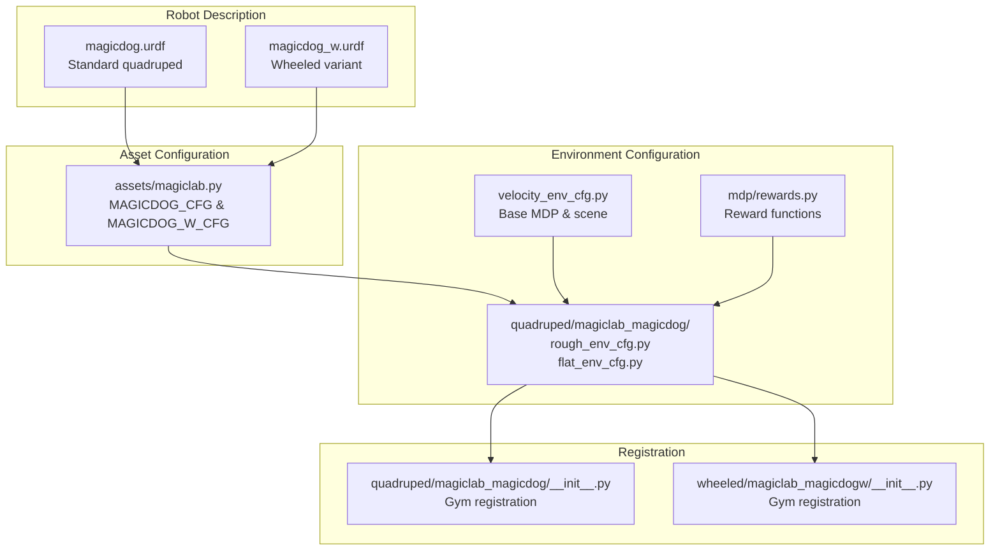
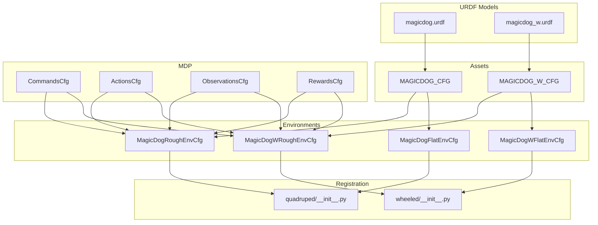
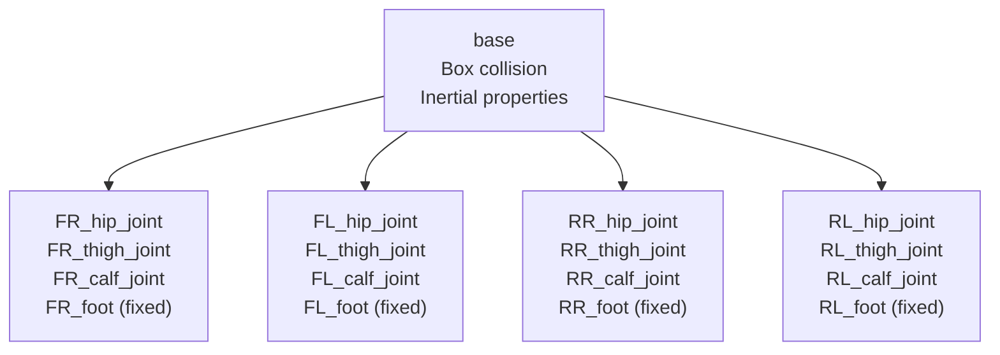
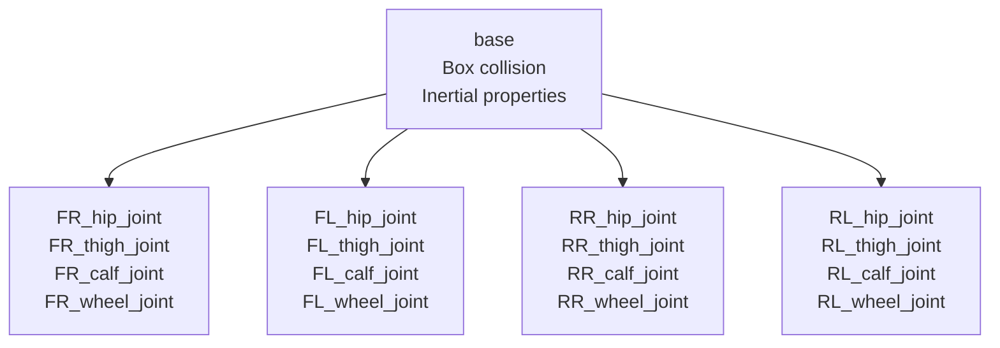
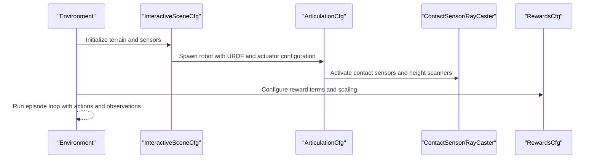
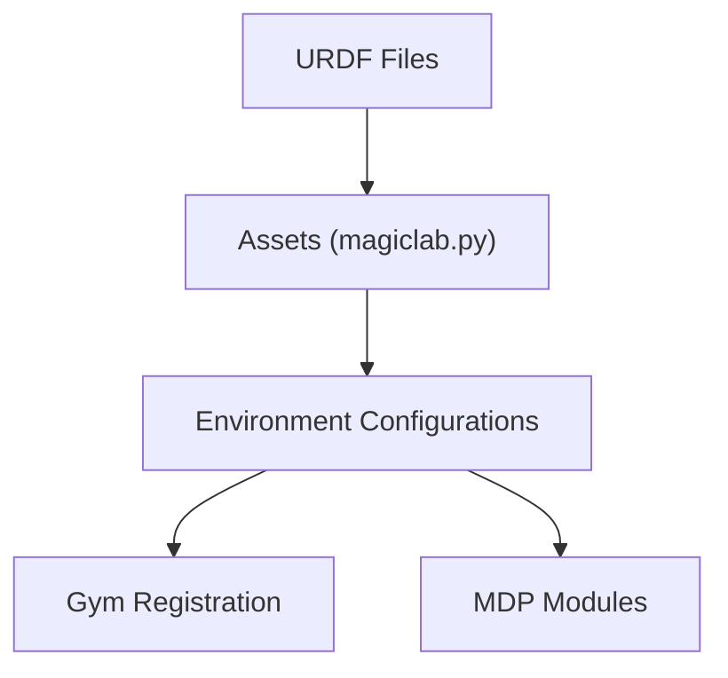

# MagicLab MagicDog Quadruped

<cite>
**Referenced Files in This Document**
- [magicdog.urdf](file://source/robot_lab/data/Robots/magiclab/magicdog/urdf/magicdog.urdf)
- [magicdog_w.urdf](file://source/robot_lab/data/Robots/magiclab/magicdog_w/urdf/magicdog_w.urdf)
- [magiclab.py](file://source/robot_lab/robot_lab/assets/magiclab.py)
- [rough_env_cfg.py](file://source/robot_lab/robot_lab/tasks/manager_based/locomotion/velocity/config/quadruped/magiclab_magicdog/rough_env_cfg.py)
- [flat_env_cfg.py](file://source/robot_lab/robot_lab/tasks/manager_based/locomotion/velocity/config/quadruped/magiclab_magicdog/flat_env_cfg.py)
- [velocity_env_cfg.py](file://source/robot_lab/robot_lab/tasks/manager_based/locomotion/velocity/velocity_env_cfg.py)
- [rewards.py](file://source/robot_lab/robot_lab/tasks/manager_based/locomotion/velocity/mdp/rewards.py)
- [README.md](file://README.md)
</cite>

## Table of Contents
1. [Introduction](#introduction)
2. [Project Structure](#project-structure)
3. [Core Components](#core-components)
4. [Architecture Overview](#architecture-overview)
5. [Detailed Component Analysis](#detailed-component-analysis)
6. [Dependency Analysis](#dependency-analysis)
7. [Performance Considerations](#performance-considerations)
8. [Troubleshooting Guide](#troubleshooting-guide)
9. [Conclusion](#conclusion)

## Introduction
This document provides comprehensive technical documentation for the MagicLab MagicDog quadruped robot configuration within the robot_lab project. It covers the distinctive design features, actuator specifications, kinematic structure, joint configurations, physical characteristics, simulation integration, initial pose configurations, solver settings, and training methodologies optimized for both the standard quadruped MagicDog and the wheeled variant MagicDog-W. Practical guidance is included for environment setup and reinforcement learning training workflows.

## Project Structure
The MagicLab MagicDog configuration is organized across three primary areas:
- Robot description: URDF files defining geometry, inertial properties, and kinematic joints for both standard and wheeled variants.
- Asset configuration: Articulation definitions specifying spawn parameters, initial states, actuator models, and solver settings.
- Environment configuration: Gym environment registration and task-specific configurations for flat and rough terrains, including observations, actions, rewards, and curriculum settings.

**Diagram sources**
- [magicdog.urdf](file://source/robot_lab/data/Robots/magiclab/magicdog/urdf/magicdog.urdf#L1-L509)
- [magicdog_w.urdf](file://source/robot_lab/data/Robots/magiclab/magicdog_w/urdf/magicdog_w.urdf#L1-L532)
- [magiclab.py](file://source/robot_lab/robot_lab/assets/magiclab.py#L190-L295)
- [rough_env_cfg.py](file://source/robot_lab/robot_lab/tasks/manager_based/locomotion/velocity/config/quadruped/magiclab_magicdog/rough_env_cfg.py#L1-L164)
- [flat_env_cfg.py](file://source/robot_lab/robot_lab/tasks/manager_based/locomotion/velocity/config/quadruped/magiclab_magicdog/flat_env_cfg.py#L1-L30)
- [velocity_env_cfg.py](file://source/robot_lab/robot_lab/tasks/manager_based/locomotion/velocity/velocity_env_cfg.py#L1-L200)
- [rewards.py](file://source/robot_lab/robot_lab/tasks/manager_based/locomotion/velocity/mdp/rewards.py#L1-L200)
- [README.md](file://README.md#L15-L42)

**Section sources**
- [README.md](file://README.md#L15-L42)

## Core Components
This section outlines the key components that define the MagicLab MagicDog platform.

- Standard MagicDog (quadruped)
  - Robot model: magicdog.urdf
  - Actuation: DCMotorCfg for leg joints
  - Initial pose: default joint positions for hips/thighs/calfs
  - Solver: ArticulationRootProperties with position/velocity iteration counts

- MagicDog-W (wheeled)
  - Robot model: magicdog_w.urdf
  - Actuation: DCMotorCfg for leg joints and ImplicitActuatorCfg for wheel joints
  - Initial pose: includes wheel joints at zero position
  - Solver: Similar articulation solver settings

- Environment setup
  - Gym registration for flat and rough terrains
  - Scene configuration with terrain, height scanners, and contact sensors
  - Reward engineering tailored for quadruped gaits and stability

**Section sources**
- [magicdog.urdf](file://source/robot_lab/data/Robots/magiclab/magicdog/urdf/magicdog.urdf#L1-L509)
- [magicdog_w.urdf](file://source/robot_lab/data/Robots/magiclab/magicdog_w/urdf/magicdog_w.urdf#L1-L532)
- [magiclab.py](file://source/robot_lab/robot_lab/assets/magiclab.py#L190-L295)
- [rough_env_cfg.py](file://source/robot_lab/robot_lab/tasks/manager_based/locomotion/velocity/config/quadruped/magiclab_magicdog/rough_env_cfg.py#L1-L164)
- [flat_env_cfg.py](file://source/robot_lab/robot_lab/tasks/manager_based/locomotion/velocity/config/quadruped/magiclab_magicdog/flat_env_cfg.py#L1-L30)
- [velocity_env_cfg.py](file://source/robot_lab/robot_lab/tasks/manager_based/locomotion/velocity/velocity_env_cfg.py#L40-L95)

## Architecture Overview
The MagicDog configuration integrates URDF-based robot models with asset and environment configurations to form a complete simulation pipeline for reinforcement learning.

**Diagram sources**
- [magicdog.urdf](file://source/robot_lab/data/Robots/magiclab/magicdog/urdf/magicdog.urdf#L1-L509)
- [magicdog_w.urdf](file://source/robot_lab/data/Robots/magiclab/magicdog_w/urdf/magicdog_w.urdf#L1-L532)
- [magiclab.py](file://source/robot_lab/robot_lab/assets/magiclab.py#L190-L295)
- [rough_env_cfg.py](file://source/robot_lab/robot_lab/tasks/manager_based/locomotion/velocity/config/quadruped/magiclab_magicdog/rough_env_cfg.py#L1-L164)
- [flat_env_cfg.py](file://source/robot_lab/robot_lab/tasks/manager_based/locomotion/velocity/config/quadruped/magiclab_magicdog/flat_env_cfg.py#L1-L30)
- [velocity_env_cfg.py](file://source/robot_lab/robot_lab/tasks/manager_based/locomotion/velocity/velocity_env_cfg.py#L100-L200)
- [README.md](file://README.md#L15-L42)

## Detailed Component Analysis

### Standard MagicDog (Quadruped) Configuration
The standard MagicDog uses a four-legged kinematic chain per side with hip, thigh, and calf joints. Each leg has fixed foot links for collision representation.

Key kinematic and actuator characteristics:
- Base link: box collision geometry with defined inertial properties
- Leg joints: revolute with effort and velocity limits
- Foot joints: fixed for collision modeling
- Actuators: DCMotorCfg applied to all joints with stiffness and damping parameters
- Initial pose: default joint positions for stable stance

**Diagram sources**
- [magicdog.urdf](file://source/robot_lab/data/Robots/magiclab/magicdog/urdf/magicdog.urdf#L34-L506)

Technical specifications derived from URDF:
- Base mass and inertia: see inertial block for base
- Joint effort and velocity limits: defined per joint limit tag
- Link inertial properties: distributed across hip, thigh, calf, and foot components

Initial pose configuration:
- Default joint positions for stable quadruped stance
- Joint velocities initialized to zero

Solver settings:
- Articulation solver position iteration count: 4
- Articulation solver velocity iteration count: 0
- Joint drive stiffness/damping set to PD gains suitable for simulation

**Section sources**
- [magicdog.urdf](file://source/robot_lab/data/Robots/magiclab/magicdog/urdf/magicdog.urdf#L34-L506)
- [magiclab.py](file://source/robot_lab/robot_lab/assets/magiclab.py#L190-L236)

### Wheeled MagicDog (MagicDog-W) Configuration
The wheeled variant replaces the distal joints with compliant knee structures and adds wheel joints for locomotion.

Key kinematic and actuator characteristics:
- Knee links: modified collision geometry and inertial properties
- Wheel joints: implicit actuators with effort and velocity limits
- Actuator split: separate DCMotorCfg for legs and ImplicitActuatorCfg for wheels
- Initial pose: includes wheel joints at zero position

**Diagram sources**
- [magicdog_w.urdf](file://source/robot_lab/data/Robots/magiclab/magicdog_w/urdf/magicdog_w.urdf#L34-L531)

Actuator setup:
- Legs: DCMotorCfg with effort limit 37.5 N⋅m, velocity limit 15 rad/s
- Wheels: ImplicitActuatorCfg with effort limit 15 N⋅m, velocity limit 35 rad/s

Initial pose configuration:
- Default joint positions include wheel joints at zero
- Joint velocities initialized to zero

Solver settings:
- Same articulation solver configuration as standard variant

**Section sources**
- [magicdog_w.urdf](file://source/robot_lab/data/Robots/magiclab/magicdog_w/urdf/magicdog_w.urdf#L34-L531)
- [magiclab.py](file://source/robot_lab/robot_lab/assets/magiclab.py#L239-L295)

### Environment Configuration and Training Setup
The environment configuration defines the MDP components, including commands, actions, observations, rewards, and terminations. Two variants are provided: flat terrain and rough terrain.

Common environment components:
- Scene: terrain, height scanners, contact sensors, lighting
- Commands: base velocity with configurable ranges
- Actions: joint position actions with scaling and clipping
- Observations: base linear/angular velocity, projected gravity, joint positions/velocities, height scans
- Rewards: velocity tracking, orientation penalties, joint torques/accelerations, contact forces, gait synchronization
- Terminations: illegal contacts disabled; optional termination criteria

**Diagram sources**
- [velocity_env_cfg.py](file://source/robot_lab/robot_lab/tasks/manager_based/locomotion/velocity/velocity_env_cfg.py#L40-L95)
- [rough_env_cfg.py](file://source/robot_lab/robot_lab/tasks/manager_based/locomotion/velocity/config/quadruped/magiclab_magicdog/rough_env_cfg.py#L14-L164)
- [flat_env_cfg.py](file://source/robot_lab/robot_lab/tasks/manager_based/locomotion/velocity/config/quadruped/magiclab_magicdog/flat_env_cfg.py#L9-L30)

Training methodologies:
- Flat vs rough terrains: flat environment disables terrain curriculum and height scanning
- Reward engineering: emphasizes velocity tracking, stability, and gait synchronization
- Action scaling: reduced scaling for non-hip joints to improve learning stability

**Section sources**
- [rough_env_cfg.py](file://source/robot_lab/robot_lab/tasks/manager_based/locomotion/velocity/config/quadruped/magiclab_magicdog/rough_env_cfg.py#L14-L164)
- [flat_env_cfg.py](file://source/robot_lab/robot_lab/tasks/manager_based/locomotion/velocity/config/quadruped/magiclab_magicdog/flat_env_cfg.py#L9-L30)
- [velocity_env_cfg.py](file://source/robot_lab/robot_lab/tasks/manager_based/locomotion/velocity/velocity_env_cfg.py#L100-L200)
- [rewards.py](file://source/robot_lab/robot_lab/tasks/manager_based/locomotion/velocity/mdp/rewards.py#L22-L150)

## Dependency Analysis
The MagicDog configuration exhibits clear separation of concerns across modules, with dependencies flowing from URDF definitions to asset configurations and then to environment setups.

**Diagram sources**
- [magicdog.urdf](file://source/robot_lab/data/Robots/magiclab/magicdog/urdf/magicdog.urdf#L1-L509)
- [magicdog_w.urdf](file://source/robot_lab/data/Robots/magiclab/magicdog_w/urdf/magicdog_w.urdf#L1-L532)
- [magiclab.py](file://source/robot_lab/robot_lab/assets/magiclab.py#L190-L295)
- [rough_env_cfg.py](file://source/robot_lab/robot_lab/tasks/manager_based/locomotion/velocity/config/quadruped/magiclab_magicdog/rough_env_cfg.py#L1-L164)
- [flat_env_cfg.py](file://source/robot_lab/robot_lab/tasks/manager_based/locomotion/velocity/config/quadruped/magiclab_magicdog/flat_env_cfg.py#L1-L30)
- [README.md](file://README.md#L15-L42)

**Section sources**
- [README.md](file://README.md#L15-L42)

## Performance Considerations
- Solver settings: Position iteration count 4 and velocity iteration count 0 balance accuracy and speed for quadruped dynamics.
- Actuator limits: Effort and velocity limits are chosen to reflect realistic hardware constraints while ensuring stable simulation.
- Reward shaping: Emphasis on velocity tracking and stability prevents excessive energy expenditure and promotes efficient gaits.
- Observation scaling: Proper normalization of observations improves training convergence.

[No sources needed since this section provides general guidance]

## Troubleshooting Guide
Common issues and resolutions:
- Incorrect gym environment registration: Ensure environment names match the registered IDs in the initialization files.
- Joint limit violations: Adjust action scaling or reward penalties to prevent illegal joint configurations.
- Instability in training: Reduce action scaling for non-hip joints and increase reward weights for stability terms.
- Sensor misalignment: Verify height scanner and contact sensor prim paths align with the base link and foot links.

**Section sources**
- [rough_env_cfg.py](file://source/robot_lab/robot_lab/tasks/manager_based/locomotion/velocity/config/quadruped/magiclab_magicdog/rough_env_cfg.py#L52-L164)
- [flat_env_cfg.py](file://source/robot_lab/robot_lab/tasks/manager_based/locomotion/velocity/config/quadruped/magiclab_magicdog/flat_env_cfg.py#L10-L30)
- [velocity_env_cfg.py](file://source/robot_lab/robot_lab/tasks/manager_based/locomotion/velocity/velocity_env_cfg.py#L40-L95)

## Conclusion
The MagicLab MagicDog quadruped configuration provides a robust foundation for quadrupedal locomotion research within the robot_lab framework. The standard and wheeled variants offer complementary capabilities for studying traditional legged gaits and hybrid locomotion strategies. With carefully tuned actuator limits, solver settings, and reward engineering, the platform supports efficient reinforcement learning training on both flat and rough terrains.