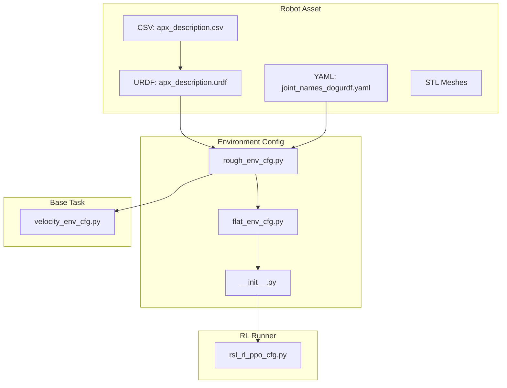
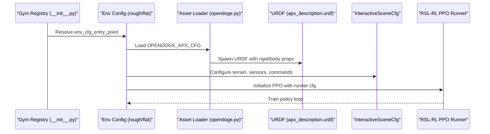
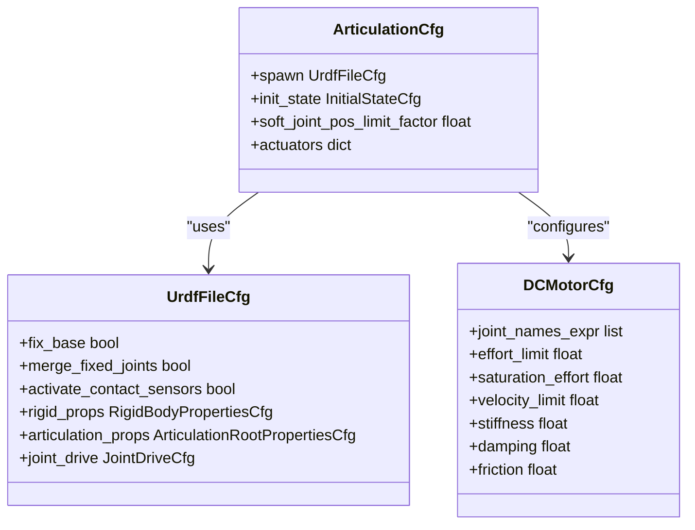
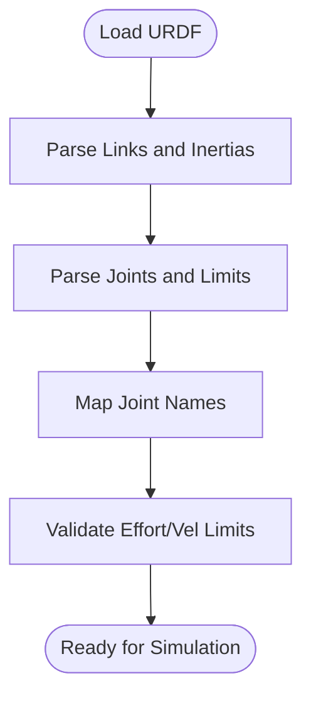
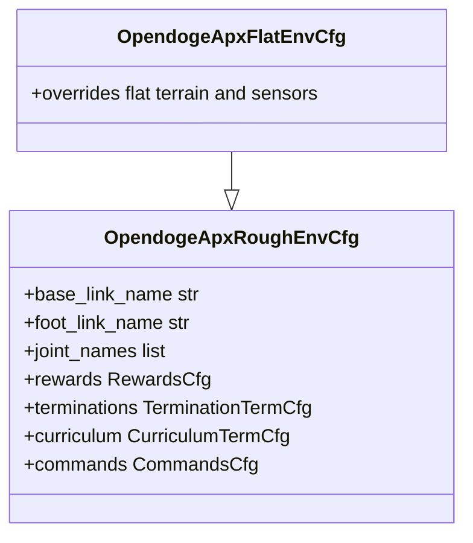
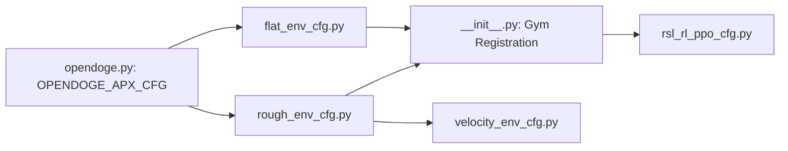

# OpenDoge APX Quadruped

<cite>
**Referenced Files in This Document**
- [README.md](file://README.md)
- [opendoge.py](file://source/robot_lab/robot_lab/assets/opendoge.py)
- [apx_description.urdf](file://source/robot_lab/data/Robots/opendoge/apx_description/urdf/apx_description.urdf)
- [apx_description.csv](file://source/robot_lab/data/Robots/opendoge/apx_description/urdf/apx_description.csv)
- [joint_names_dogurdf.yaml](file://source/robot_lab/data/Robots/opendoge/apx_description/config/joint_names_dogurdf.yaml)
- [rough_env_cfg.py](file://source/robot_lab/robot_lab/tasks/manager_based/locomotion/velocity/config/quadruped/opendoge_apx/rough_env_cfg.py)
- [flat_env_cfg.py](file://source/robot_lab/robot_lab/tasks/manager_based/locomotion/velocity/config/quadruped/opendoge_apx/flat_env_cfg.py)
- [__init__.py](file://source/robot_lab/robot_lab/tasks/manager_based/locomotion/velocity/config/quadruped/opendoge_apx/__init__.py)
- [rsl_rl_ppo_cfg.py](file://source/robot_lab/robot_lab/tasks/manager_based/locomotion/velocity/config/quadruped/opendoge_apx/agents/rsl_rl_ppo_cfg.py)
- [velocity_env_cfg.py](file://source/robot_lab/robot_lab/tasks/manager_based/locomotion/velocity/velocity_env_cfg.py)
</cite>

## Table of Contents
1. [Introduction](#introduction)
2. [Project Structure](#project-structure)
3. [Core Components](#core-components)
4. [Architecture Overview](#architecture-overview)
5. [Detailed Component Analysis](#detailed-component-analysis)
6. [Dependency Analysis](#dependency-analysis)
7. [Performance Considerations](#performance-considerations)
8. [Troubleshooting Guide](#troubleshooting-guide)
9. [Conclusion](#conclusion)

## Introduction
This document describes the OpenDoge APX quadruped robot configuration within the Robot Lab ecosystem. It covers actuator specifications, kinematic structure, simulation parameters, physical properties, joint arrangements, initial pose setup, and integration details for training environments and reinforcement learning applications. It also highlights unique aspects of the OpenDoge platform compared to other quadrupeds in the framework.

## Project Structure
The OpenDoge APX is organized as a URDF-based robot asset with environment configurations and training runners. The key elements are:
- Robot asset and URDF: URDF and inertial/mesh data
- Joint naming configuration
- Environment configurations for flat and rough terrains
- RL training runner configuration
- Environment registration for Gym

**Diagram sources**
- [apx_description.urdf](file://source/robot_lab/data/Robots/opendoge/apx_description/urdf/apx_description.urdf#L1-L519)
- [apx_description.csv](file://source/robot_lab/data/Robots/opendoge/apx_description/urdf/apx_description.csv#L1-L19)
- [joint_names_dogurdf.yaml](file://source/robot_lab/data/Robots/opendoge/apx_description/config/joint_names_dogurdf.yaml#L1-L2)
- [rough_env_cfg.py](file://source/robot_lab/robot_lab/tasks/manager_based/locomotion/velocity/config/quadruped/opendoge_apx/rough_env_cfg.py#L1-L186)
- [flat_env_cfg.py](file://source/robot_lab/robot_lab/tasks/manager_based/locomotion/velocity/config/quadruped/opendoge_apx/flat_env_cfg.py#L1-L30)
- [__init__.py](file://source/robot_lab/robot_lab/tasks/manager_based/locomotion/velocity/config/quadruped/opendoge_apx/__init__.py#L1-L31)
- [rsl_rl_ppo_cfg.py](file://source/robot_lab/robot_lab/tasks/manager_based/locomotion/velocity/config/quadruped/opendoge_apx/agents/rsl_rl_ppo_cfg.py#L1-L45)
- [velocity_env_cfg.py](file://source/robot_lab/robot_lab/tasks/manager_based/locomotion/velocity/velocity_env_cfg.py#L1-L200)

**Section sources**
- [README.md](file://README.md#L1-L501)
- [opendoge.py](file://source/robot_lab/robot_lab/assets/opendoge.py#L1-L85)
- [apx_description.urdf](file://source/robot_lab/data/Robots/opendoge/apx_description/urdf/apx_description.urdf#L1-L519)
- [apx_description.csv](file://source/robot_lab/data/Robots/opendoge/apx_description/urdf/apx_description.csv#L1-L19)
- [joint_names_dogurdf.yaml](file://source/robot_lab/data/Robots/opendoge/apx_description/config/joint_names_dogurdf.yaml#L1-L2)
- [rough_env_cfg.py](file://source/robot_lab/robot_lab/tasks/manager_based/locomotion/velocity/config/quadruped/opendoge_apx/rough_env_cfg.py#L1-L186)
- [flat_env_cfg.py](file://source/robot_lab/robot_lab/tasks/manager_based/locomotion/velocity/config/quadruped/opendoge_apx/flat_env_cfg.py#L1-L30)
- [__init__.py](file://source/robot_lab/robot_lab/tasks/manager_based/locomotion/velocity/config/quadruped/opendoge_apx/__init__.py#L1-L31)
- [rsl_rl_ppo_cfg.py](file://source/robot_lab/robot_lab/tasks/manager_based/locomotion/velocity/config/quadruped/opendoge_apx/agents/rsl_rl_ppo_cfg.py#L1-L45)
- [velocity_env_cfg.py](file://source/robot_lab/robot_lab/tasks/manager_based/locomotion/velocity/velocity_env_cfg.py#L1-L200)

## Core Components
- Robot asset configuration: Defines URDF path, rigid body properties, solver settings, and initial conditions.
- Actuator configuration: Uses DC motors with effort/velocity limits and PD gains aligned with joint limits.
- Environment configuration: Provides flat and rough terrain variants with reward shaping and termination settings.
- RL runner: Specifies PPO hyperparameters and network architectures for training.

Key implementation references:
- Robot asset and actuator configuration: [opendoge.py](file://source/robot_lab/robot_lab/assets/opendoge.py#L14-L83)
- Environment registration and task configuration: [__init__.py](file://source/robot_lab/robot_lab/tasks/manager_based/locomotion/velocity/config/quadruped/opendoge_apx/__init__.py#L12-L30)
- Flat environment overrides: [flat_env_cfg.py](file://source/robot_lab/robot_lab/tasks/manager_based/locomotion/velocity/config/quadruped/opendoge_apx/flat_env_cfg.py#L9-L29)
- Rough environment rewards/commands: [rough_env_cfg.py](file://source/robot_lab/robot_lab/tasks/manager_based/locomotion/velocity/config/quadruped/opendoge_apx/rough_env_cfg.py#L14-L186)
- RL runner configuration: [rsl_rl_ppo_cfg.py](file://source/robot_lab/robot_lab/tasks/manager_based/locomotion/velocity/config/quadruped/opendoge_apx/agents/rsl_rl_ppo_cfg.py#L8-L44)

**Section sources**
- [opendoge.py](file://source/robot_lab/robot_lab/assets/opendoge.py#L14-L83)
- [__init__.py](file://source/robot_lab/robot_lab/tasks/manager_based/locomotion/velocity/config/quadruped/opendoge_apx/__init__.py#L12-L30)
- [flat_env_cfg.py](file://source/robot_lab/robot_lab/tasks/manager_based/locomotion/velocity/config/quadruped/opendoge_apx/flat_env_cfg.py#L9-L29)
- [rough_env_cfg.py](file://source/robot_lab/robot_lab/tasks/manager_based/locomotion/velocity/config/quadruped/opendoge_apx/rough_env_cfg.py#L14-L186)
- [rsl_rl_ppo_cfg.py](file://source/robot_lab/robot_lab/tasks/manager_based/locomotion/velocity/config/quadruped/opendoge_apx/agents/rsl_rl_ppo_cfg.py#L8-L44)

## Architecture Overview
The OpenDoge APX integrates with Robot Lab’s Manager-Based RL environment. The asset loader spawns the URDF, the environment applies terrain and sensor configurations, and the RL runner trains policies using PPO.

**Diagram sources**
- [__init__.py](file://source/robot_lab/robot_lab/tasks/manager_based/locomotion/velocity/config/quadruped/opendoge_apx/__init__.py#L12-L30)
- [rough_env_cfg.py](file://source/robot_lab/robot_lab/tasks/manager_based/locomotion/velocity/config/quadruped/opendoge_apx/rough_env_cfg.py#L14-L31)
- [opendoge.py](file://source/robot_lab/robot_lab/assets/opendoge.py#L14-L36)
- [apx_description.urdf](file://source/robot_lab/data/Robots/opendoge/apx_description/urdf/apx_description.urdf#L1-L519)
- [velocity_env_cfg.py](file://source/robot_lab/robot_lab/tasks/manager_based/locomotion/velocity/velocity_env_cfg.py#L42-L95)
- [rsl_rl_ppo_cfg.py](file://source/robot_lab/robot_lab/tasks/manager_based/locomotion/velocity/config/quadruped/opendoge_apx/agents/rsl_rl_ppo_cfg.py#L8-L44)

## Detailed Component Analysis

### Robot Asset and Actuator Configuration
- URDF path and spawning: The asset loads the APX URDF with contact sensors enabled and specific rigid body properties.
- Initial state: Robot starts at a fixed height with default joint positions for hip/thigh/calf joints.
- Actuator model: DC motors are used for all legs. Effort and saturation limits are set per joint group; velocity limit and PD gains are tuned consistently across joints.

References:
- Asset and actuator configuration: [opendoge.py](file://source/robot_lab/robot_lab/assets/opendoge.py#L14-L83)

**Diagram sources**
- [opendoge.py](file://source/robot_lab/robot_lab/assets/opendoge.py#L14-L83)

**Section sources**
- [opendoge.py](file://source/robot_lab/robot_lab/assets/opendoge.py#L14-L83)

### Kinematic Structure and Physical Specifications
- Joint layout: Four legs with hip/thigh/calf joints per side; foot links are fixed to calf.
- Joint limits and effort/velocity ratings are defined in the URDF for each revolute joint.
- Inertial properties: Center of mass, mass, and inertia tensors are defined for base and limbs.

References:
- Joint definitions and limits: [apx_description.urdf](file://source/robot_lab/data/Robots/opendoge/apx_description/urdf/apx_description.urdf#L55-L123), [apx_description.urdf](file://source/robot_lab/data/Robots/opendoge/apx_description/urdf/apx_description.urdf#L178-L244), [apx_description.urdf](file://source/robot_lab/data/Robots/opendoge/apx_description/urdf/apx_description.urdf#L299-L367), [apx_description.urdf](file://source/robot_lab/data/Robots/opendoge/apx_description/urdf/apx_description.urdf#L422-L488)
- Inertial data: [apx_description.urdf](file://source/robot_lab/data/Robots/opendoge/apx_description/urdf/apx_description.urdf#L8-L11), [apx_description.urdf](file://source/robot_lab/data/Robots/opendoge/apx_description/urdf/apx_description.urdf#L32-L37), [apx_description.urdf](file://source/robot_lab/data/Robots/opendoge/apx_description/urdf/apx_description.urdf#L64-L69), [apx_description.urdf](file://source/robot_lab/data/Robots/opendoge/apx_description/urdf/apx_description.urdf#L94-L99), [apx_description.urdf](file://source/robot_lab/data/Robots/opendoge/apx_description/urdf/apx_description.urdf#L125-L130)
- CSV mapping of joints and limits: [apx_description.csv](file://source/robot_lab/data/Robots/opendoge/apx_description/urdf/apx_description.csv#L1-L19)

**Diagram sources**
- [apx_description.urdf](file://source/robot_lab/data/Robots/opendoge/apx_description/urdf/apx_description.urdf#L55-L123)
- [apx_description.urdf](file://source/robot_lab/data/Robots/opendoge/apx_description/urdf/apx_description.urdf#L178-L244)
- [apx_description.urdf](file://source/robot_lab/data/Robots/opendoge/apx_description/urdf/apx_description.urdf#L299-L367)
- [apx_description.urdf](file://source/robot_lab/data/Robots/opendoge/apx_description/urdf/apx_description.urdf#L422-L488)
- [apx_description.csv](file://source/robot_lab/data/Robots/opendoge/apx_description/urdf/apx_description.csv#L1-L19)

**Section sources**
- [apx_description.urdf](file://source/robot_lab/data/Robots/opendoge/apx_description/urdf/apx_description.urdf#L55-L123)
- [apx_description.urdf](file://source/robot_lab/data/Robots/opendoge/apx_description/urdf/apx_description.urdf#L178-L244)
- [apx_description.urdf](file://source/robot_lab/data/Robots/opendoge/apx_description/urdf/apx_description.urdf#L299-L367)
- [apx_description.urdf](file://source/robot_lab/data/Robots/opendoge/apx_description/urdf/apx_description.urdf#L422-L488)
- [apx_description.csv](file://source/robot_lab/data/Robots/opendoge/apx_description/urdf/apx_description.csv#L1-L19)

### Simulation Parameters and Solver Configuration
- Rigid body properties: Gravity enabled, damping disabled, high max velocities, small penetration velocity.
- Articulation solver: Position iterations tuned; velocity iterations minimal.
- Joint drive: PD gains set to zero, relying on actuator control.

References:
- Simulation properties: [opendoge.py](file://source/robot_lab/robot_lab/assets/opendoge.py#L21-L35)

**Section sources**
- [opendoge.py](file://source/robot_lab/robot_lab/assets/opendoge.py#L21-L35)

### Initial Pose Setup
- Initial position: Robot spawned at a nominal height above ground.
- Joint positions: Hip joints centered, thigh joints extended forward, calves flexed backward.
- Joint velocities: All joints initialized to zero.

References:
- Initial state: [opendoge.py](file://source/robot_lab/robot_lab/assets/opendoge.py#L37-L45)

**Section sources**
- [opendoge.py](file://source/robot_lab/robot_lab/assets/opendoge.py#L37-L45)

### Environment Integration and Control Characteristics
- Environment selection: Flat vs rough terrains; both share the same asset and joint names.
- Rewards and terminations: Tailored for stability and gait synchronization; illegal contact termination disabled.
- Commands: Velocity commands with symmetric ranges across axes.

References:
- Flat environment overrides: [flat_env_cfg.py](file://source/robot_lab/robot_lab/tasks/manager_based/locomotion/velocity/config/quadruped/opendoge_apx/flat_env_cfg.py#L9-L29)
- Rough environment specifics: [rough_env_cfg.py](file://source/robot_lab/robot_lab/tasks/manager_based/locomotion/velocity/config/quadruped/opendoge_apx/rough_env_cfg.py#L14-L186)
- Base task scene and observations: [velocity_env_cfg.py](file://source/robot_lab/robot_lab/tasks/manager_based/locomotion/velocity/velocity_env_cfg.py#L42-L95)

**Diagram sources**
- [rough_env_cfg.py](file://source/robot_lab/robot_lab/tasks/manager_based/locomotion/velocity/config/quadruped/opendoge_apx/rough_env_cfg.py#L14-L31)
- [flat_env_cfg.py](file://source/robot_lab/robot_lab/tasks/manager_based/locomotion/velocity/config/quadruped/opendoge_apx/flat_env_cfg.py#L9-L29)

**Section sources**
- [flat_env_cfg.py](file://source/robot_lab/robot_lab/tasks/manager_based/locomotion/velocity/config/quadruped/opendoge_apx/flat_env_cfg.py#L9-L29)
- [rough_env_cfg.py](file://source/robot_lab/robot_lab/tasks/manager_based/locomotion/velocity/config/quadruped/opendoge_apx/rough_env_cfg.py#L14-L186)
- [velocity_env_cfg.py](file://source/robot_lab/robot_lab/tasks/manager_based/locomotion/velocity/velocity_env_cfg.py#L42-L95)

### Reinforcement Learning Configuration
- Runner: PPO with configurable hidden sizes, activation, learning rate schedule, and KL divergence target.
- Experiment names: Separate experiments for flat and rough terrains.
- Environment registration: Gym entries for flat and rough variants.

References:
- Runner configuration: [rsl_rl_ppo_cfg.py](file://source/robot_lab/robot_lab/tasks/manager_based/locomotion/velocity/config/quadruped/opendoge_apx/agents/rsl_rl_ppo_cfg.py#L8-L44)
- Environment registration: [__init__.py](file://source/robot_lab/robot_lab/tasks/manager_based/locomotion/velocity/config/quadruped/opendoge_apx/__init__.py#L12-L30)

**Section sources**
- [rsl_rl_ppo_cfg.py](file://source/robot_lab/robot_lab/tasks/manager_based/locomotion/velocity/config/quadruped/opendoge_apx/agents/rsl_rl_ppo_cfg.py#L8-L44)
- [__init__.py](file://source/robot_lab/robot_lab/tasks/manager_based/locomotion/velocity/config/quadruped/opendoge_apx/__init__.py#L12-L30)

## Dependency Analysis
The OpenDoge APX depends on the Robot Lab base task configuration and environment registration. The asset configuration is injected into the environment, which then builds the scene and applies RL-specific settings.

**Diagram sources**
- [opendoge.py](file://source/robot_lab/robot_lab/assets/opendoge.py#L14-L31)
- [rough_env_cfg.py](file://source/robot_lab/robot_lab/tasks/manager_based/locomotion/velocity/config/quadruped/opendoge_apx/rough_env_cfg.py#L14-L31)
- [flat_env_cfg.py](file://source/robot_lab/robot_lab/tasks/manager_based/locomotion/velocity/config/quadruped/opendoge_apx/flat_env_cfg.py#L9-L13)
- [__init__.py](file://source/robot_lab/robot_lab/tasks/manager_based/locomotion/velocity/config/quadruped/opendoge_apx/__init__.py#L12-L30)
- [velocity_env_cfg.py](file://source/robot_lab/robot_lab/tasks/manager_based/locomotion/velocity/velocity_env_cfg.py#L42-L95)
- [rsl_rl_ppo_cfg.py](file://source/robot_lab/robot_lab/tasks/manager_based/locomotion/velocity/config/quadruped/opendoge_apx/agents/rsl_rl_ppo_cfg.py#L8-L44)

**Section sources**
- [opendoge.py](file://source/robot_lab/robot_lab/assets/opendoge.py#L14-L31)
- [rough_env_cfg.py](file://source/robot_lab/robot_lab/tasks/manager_based/locomotion/velocity/config/quadruped/opendoge_apx/rough_env_cfg.py#L14-L31)
- [flat_env_cfg.py](file://source/robot_lab/robot_lab/tasks/manager_based/locomotion/velocity/config/quadruped/opendoge_apx/flat_env_cfg.py#L9-L13)
- [__init__.py](file://source/robot_lab/robot_lab/tasks/manager_based/locomotion/velocity/config/quadruped/opendoge_apx/__init__.py#L12-L30)
- [velocity_env_cfg.py](file://source/robot_lab/robot_lab/tasks/manager_based/locomotion/velocity/velocity_env_cfg.py#L42-L95)
- [rsl_rl_ppo_cfg.py](file://source/robot_lab/robot_lab/tasks/manager_based/locomotion/velocity/config/quadruped/opendoge_apx/agents/rsl_rl_ppo_cfg.py#L8-L44)

## Performance Considerations
- Solver iteration counts: Position iterations are set to a modest value; velocity iterations are low, which can improve stability and speed for this lightweight robot.
- Contact sensing: Enabled to support force feedback and event-driven behaviors.
- Observation normalization: Disabled in the runner configuration; ensure action scaling and reward shaping compensate for unnormalized inputs.
- Iteration budgets: Flat terrain uses fewer iterations than rough terrain, reducing training time.

[No sources needed since this section provides general guidance]

## Troubleshooting Guide
- Environment registration: Ensure the Gym entries are loaded and visible via the environment listing script.
- Asset path: Confirm the URDF path resolves correctly within the assets data directory.
- Joint naming: Verify controller joint names align with the environment’s joint list.
- Training instability: Adjust PPO KL divergence threshold or learning rate; consider enabling observation normalization.

**Section sources**
- [__init__.py](file://source/robot_lab/robot_lab/tasks/manager_based/locomotion/velocity/config/quadruped/opendoge_apx/__init__.py#L12-L30)
- [opendoge.py](file://source/robot_lab/robot_lab/assets/opendoge.py#L19-L20)
- [joint_names_dogurdf.yaml](file://source/robot_lab/data/Robots/opendoge/apx_description/config/joint_names_dogurdf.yaml#L1-L2)
- [rsl_rl_ppo_cfg.py](file://source/robot_lab/robot_lab/tasks/manager_based/locomotion/velocity/config/quadruped/opendoge_apx/agents/rsl_rl_ppo_cfg.py#L22-L35)

## Conclusion
The OpenDoge APX is a compact, four-legged robot configured for fast simulation and efficient reinforcement learning training in Robot Lab. Its URDF defines precise inertial and kinematic properties, while the environment and runner configurations tailor rewards, commands, and training schedules for stable locomotion. Compared to other quadrupeds in the framework, the APX emphasizes simplicity and quick iteration cycles suitable for research and education.