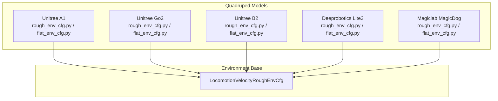
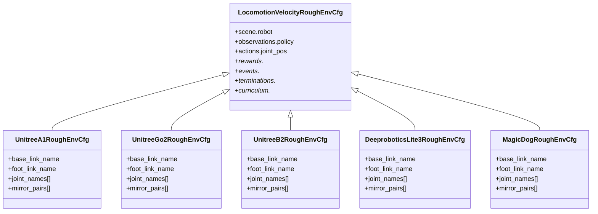
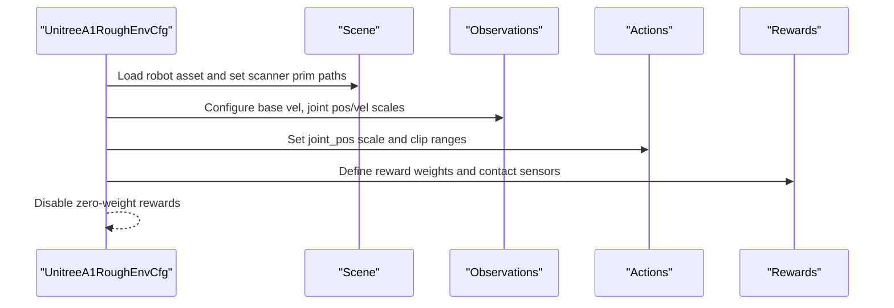
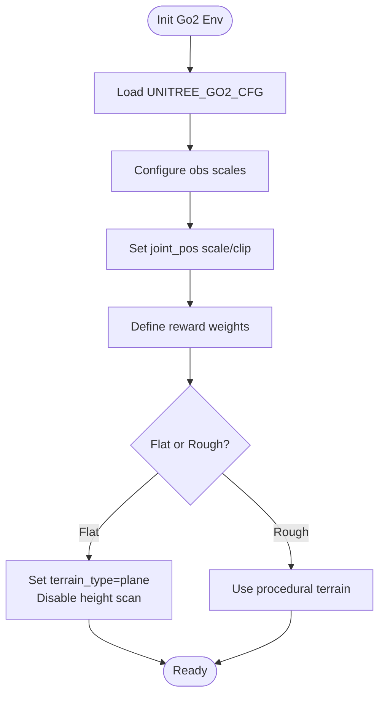
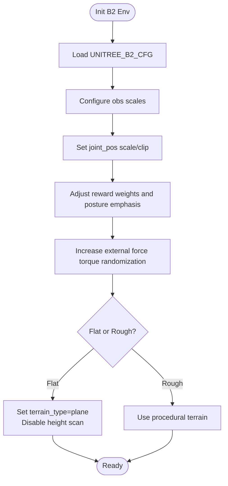
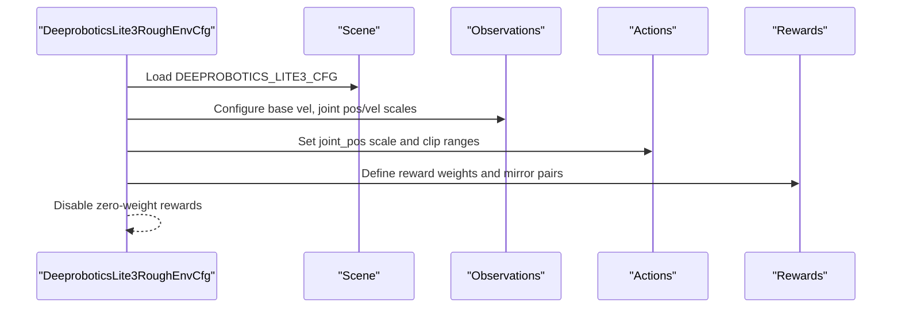
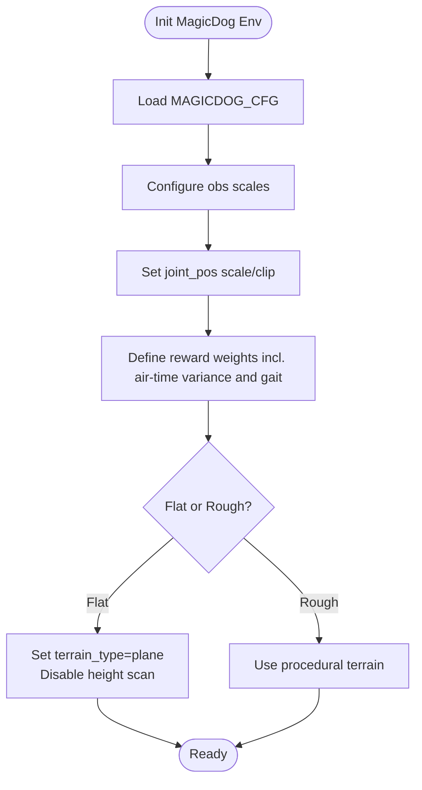
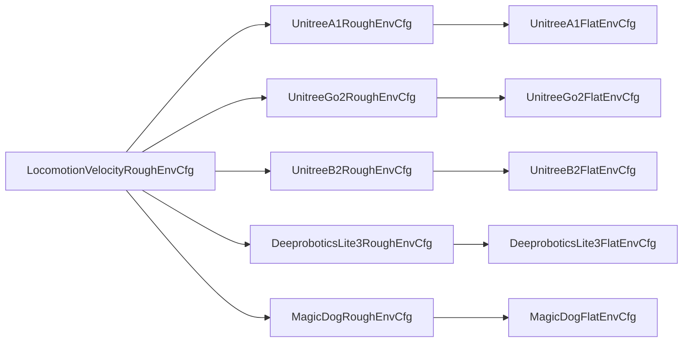

# Quadruped Robots

<cite>
**Referenced Files in This Document**
- [README.md](file://README.md)
- [unitree_a1/rough_env_cfg.py](file://source/robot_lab/robot_lab/tasks/manager_based/locomotion/velocity/config/quadruped/unitree_a1/rough_env_cfg.py)
- [unitree_a1/flat_env_cfg.py](file://source/robot_lab/robot_lab/tasks/manager_based/locomotion/velocity/config/quadruped/unitree_a1/flat_env_cfg.py)
- [unitree_go2/rough_env_cfg.py](file://source/robot_lab/robot_lab/tasks/manager_based/locomotion/velocity/config/quadruped/unitree_go2/rough_env_cfg.py)
- [unitree_go2/flat_env_cfg.py](file://source/robot_lab/robot_lab/tasks/manager_based/locomotion/velocity/config/quadruped/unitree_go2/flat_env_cfg.py)
- [unitree_b2/rough_env_cfg.py](file://source/robot_lab/robot_lab/tasks/manager_based/locomotion/velocity/config/quadruped/unitree_b2/rough_env_cfg.py)
- [unitree_b2/flat_env_cfg.py](file://source/robot_lab/robot_lab/tasks/manager_based/locomotion/velocity/config/quadruped/unitree_b2/flat_env_cfg.py)
- [deeprobotics_lite3/rough_env_cfg.py](file://source/robot_lab/robot_lab/tasks/manager_based/locomotion/velocity/config/quadruped/deeprobotics_lite3/rough_env_cfg.py)
- [deeprobotics_lite3/flat_env_cfg.py](file://source/robot_lab/robot_lab/tasks/manager_based/locomotion/velocity/config/quadruped/deeprobotics_lite3/flat_env_cfg.py)
- [magiclab_magicdog/rough_env_cfg.py](file://source/robot_lab/robot_lab/tasks/manager_based/locomotion/velocity/config/quadruped/magiclab_magicdog/rough_env_cfg.py)
- [magiclab_magicdog/flat_env_cfg.py](file://source/robot_lab/robot_lab/tasks/manager_based/locomotion/velocity/config/quadruped/magiclab_magicdog/flat_env_cfg.py)
</cite>

## Table of Contents
1. [Introduction](#introduction)
2. [Project Structure](#project-structure)
3. [Core Components](#core-components)
4. [Architecture Overview](#architecture-overview)
5. [Detailed Component Analysis](#detailed-component-analysis)
6. [Dependency Analysis](#dependency-analysis)
7. [Performance Considerations](#performance-considerations)
8. [Troubleshooting Guide](#troubleshooting-guide)
9. [Conclusion](#conclusion)

## Introduction
This document covers the quadruped robot category in the repository, focusing on supported four-legged platforms and their reinforcement learning environments. It documents the Unitree A1, Unitree Go2 series (standard and wheeled variants), Unitree B2 series (B2 and B2W), Deeprobotics Lite3, and Magiclab MagicDog configurations. For each model, we summarize joint specifications, locomotion reward shaping, and environment setup. We compare actuator configurations, control strategies, and physical characteristics across models, and highlight suitable use cases for reinforcement learning tasks such as velocity tracking and terrain adaptation.

## Project Structure
The quadruped category is organized under the locomotion velocity task with separate directories per model. Each model defines:
- A rough environment configuration that sets up the robot asset, observations, actions, rewards, events, terminations, and curriculum.
- A flat environment variant that inherits from the rough configuration and switches to a flat terrain and disables certain sensors/curricula.

**Diagram sources**
- [unitree_a1/rough_env_cfg.py](file://source/robot_lab/robot_lab/tasks/manager_based/locomotion/velocity/config/quadruped/unitree_a1/rough_env_cfg.py#L18-L32)
- [unitree_go2/rough_env_cfg.py](file://source/robot_lab/robot_lab/tasks/manager_based/locomotion/velocity/config/quadruped/unitree_go2/rough_env_cfg.py#L18-L32)
- [unitree_b2/rough_env_cfg.py](file://source/robot_lab/robot_lab/tasks/manager_based/locomotion/velocity/config/quadruped/unitree_b2/rough_env_cfg.py#L15-L31)
- [deeprobotics_lite3/rough_env_cfg.py](file://source/robot_lab/robot_lab/tasks/manager_based/locomotion/velocity/config/quadruped/deeprobotics_lite3/rough_env_cfg.py#L15-L31)
- [magiclab_magicdog/rough_env_cfg.py](file://source/robot_lab/robot_lab/tasks/manager_based/locomotion/velocity/config/quadruped/magiclab_magicdog/rough_env_cfg.py#L15-L31)

**Section sources**
- [README.md](file://README.md#L17-L31)

## Core Components
- Environment registration and naming: The repository registers quadruped locomotion environments with consistent naming conventions, including “Flat” and “Rough” variants. See the environment table and registration patterns in the repository documentation.
- Asset configuration: Each model’s configuration imports a predefined robot asset definition and places it into the simulation scene.
- Observation pipeline: Observations include base linear/angular velocities, joint positions/velocities, and optionally height scanning depending on the environment variant.
- Actions: Joint position targets are scaled differently for hip joints versus others, with clipping applied.
- Rewards: Reward terms emphasize velocity tracking, contact forces, joint penalties, and posture, with zero-weight terms disabled in the final configuration.
- Terrain: Rough environments use a procedural terrain; Flat environments switch to a plane and remove height scanning and terrain curriculum.

**Section sources**
- [README.md](file://README.md#L17-L31)
- [unitree_a1/rough_env_cfg.py](file://source/robot_lab/robot_lab/tasks/manager_based/locomotion/velocity/config/quadruped/unitree_a1/rough_env_cfg.py#L30-L54)
- [unitree_go2/rough_env_cfg.py](file://source/robot_lab/robot_lab/tasks/manager_based/locomotion/velocity/config/quadruped/unitree_go2/rough_env_cfg.py#L30-L53)
- [unitree_b2/rough_env_cfg.py](file://source/robot_lab/robot_lab/tasks/manager_based/locomotion/velocity/config/quadruped/unitree_b2/rough_env_cfg.py#L27-L50)
- [deeprobotics_lite3/rough_env_cfg.py](file://source/robot_lab/robot_lab/tasks/manager_based/locomotion/velocity/config/quadruped/deeprobotics_lite3/rough_env_cfg.py#L27-L50)
- [magiclab_magicdog/rough_env_cfg.py](file://source/robot_lab/robot_lab/tasks/manager_based/locomotion/velocity/config/quadruped/magiclab_magicdog/rough_env_cfg.py#L27-L50)

## Architecture Overview
The quadruped locomotion environments share a common base class and differ primarily in:
- Joint naming and mirror pairs for symmetry enforcement.
- Target base height for stabilization.
- Reward term weights tailored to each robot’s dynamics.
- Optional terrain and sensor configuration differences between Flat and Rough variants.

**Diagram sources**
- [unitree_a1/rough_env_cfg.py](file://source/robot_lab/robot_lab/tasks/manager_based/locomotion/velocity/config/quadruped/unitree_a1/rough_env_cfg.py#L18-L28)
- [unitree_go2/rough_env_cfg.py](file://source/robot_lab/robot_lab/tasks/manager_based/locomotion/velocity/config/quadruped/unitree_go2/rough_env_cfg.py#L18-L28)
- [unitree_b2/rough_env_cfg.py](file://source/robot_lab/robot_lab/tasks/manager_based/locomotion/velocity/config/quadruped/unitree_b2/rough_env_cfg.py#L15-L25)
- [deeprobotics_lite3/rough_env_cfg.py](file://source/robot_lab/robot_lab/tasks/manager_based/locomotion/velocity/config/quadruped/deeprobotics_lite3/rough_env_cfg.py#L15-L25)
- [magiclab_magicdog/rough_env_cfg.py](file://source/robot_lab/robot_lab/tasks/manager_based/locomotion/velocity/config/quadruped/magiclab_magicdog/rough_env_cfg.py#L15-L25)

## Detailed Component Analysis

### Unitree A1
- Robot asset: Imported from the Unitree A1 asset definition and placed into the scene.
- Joints and symmetry: 12 degrees-of-freedom arranged as front-left, front-right, rear-left, rear-right legs. Mirror pairs enforced for symmetry.
- Observations: Base linear/angular velocities and joint position/velocity scaled; optional height scanning disabled in Flat variant.
- Actions: Joint position targets with reduced scaling for hip joints and broader scaling for knee joints; wide clipping range.
- Rewards: Emphasizes velocity tracking, contact forces, joint torques/accelerations, and posture; base height target tuned for stability.
- Terrain: Rough variant uses procedural terrain; Flat variant uses a plane and disables height scanning and terrain curriculum.

**Diagram sources**
- [unitree_a1/rough_env_cfg.py](file://source/robot_lab/robot_lab/tasks/manager_based/locomotion/velocity/config/quadruped/unitree_a1/rough_env_cfg.py#L30-L54)

**Section sources**
- [unitree_a1/rough_env_cfg.py](file://source/robot_lab/robot_lab/tasks/manager_based/locomotion/velocity/config/quadruped/unitree_a1/rough_env_cfg.py#L18-L54)
- [unitree_a1/flat_env_cfg.py](file://source/robot_lab/robot_lab/tasks/manager_based/locomotion/velocity/config/quadruped/unitree_a1/flat_env_cfg.py#L10-L29)

### Unitree Go2
- Robot asset: Imported from the Unitree Go2 asset definition.
- Joints and symmetry: Identical 12-DOF layout and mirror pairs as A1.
- Observations and actions: Same scaling and clipping as A1.
- Rewards: Similar structure to A1 with tuned base height target and contact force weighting.
- Terrain: Rough vs Flat switching identical to A1.

**Diagram sources**
- [unitree_go2/rough_env_cfg.py](file://source/robot_lab/robot_lab/tasks/manager_based/locomotion/velocity/config/quadruped/unitree_go2/rough_env_cfg.py#L30-L53)

**Section sources**
- [unitree_go2/rough_env_cfg.py](file://source/robot_lab/robot_lab/tasks/manager_based/locomotion/velocity/config/quadruped/unitree_go2/rough_env_cfg.py#L18-L53)
- [unitree_go2/flat_env_cfg.py](file://source/robot_lab/robot_lab/tasks/manager_based/locomotion/velocity/config/quadruped/unitree_go2/flat_env_cfg.py#L10-L29)

### Unitree B2
- Robot asset: Imported from the Unitree B2 asset definition.
- Joints and symmetry: Same 12-DOF layout and mirror pairs.
- Observations and actions: Same scaling and clipping as A1/Go2.
- Rewards: Slightly different base height target and posture reward emphasis; external disturbance randomization increased.
- Terrain: Rough vs Flat switching identical to A1/Go2.

**Diagram sources**
- [unitree_b2/rough_env_cfg.py](file://source/robot_lab/robot_lab/tasks/manager_based/locomotion/velocity/config/quadruped/unitree_b2/rough_env_cfg.py#L27-L78)

**Section sources**
- [unitree_b2/rough_env_cfg.py](file://source/robot_lab/robot_lab/tasks/manager_based/locomotion/velocity/config/quadruped/unitree_b2/rough_env_cfg.py#L15-L78)
- [unitree_b2/flat_env_cfg.py](file://source/robot_lab/robot_lab/tasks/manager_based/locomotion/velocity/config/quadruped/unitree_b2/flat_env_cfg.py#L10-L29)

### Deeprobotics Lite3
- Robot asset: Imported from the Deeprobotics Lite3 asset definition.
- Joints and symmetry: 12 degrees-of-freedom with a distinct naming scheme (HipX/HipY/Knee); mirror pairs reflect this naming.
- Observations and actions: Same scaling and clipping patterns as other quadrupeds.
- Rewards: Emphasizes velocity tracking and contact forces; posture and joint penalties similar to other models.
- Terrain: Rough vs Flat switching identical to other models.

**Diagram sources**
- [deeprobotics_lite3/rough_env_cfg.py](file://source/robot_lab/robot_lab/tasks/manager_based/locomotion/velocity/config/quadruped/deeprobotics_lite3/rough_env_cfg.py#L27-L50)

**Section sources**
- [deeprobotics_lite3/rough_env_cfg.py](file://source/robot_lab/robot_lab/tasks/manager_based/locomotion/velocity/config/quadruped/deeprobotics_lite3/rough_env_cfg.py#L15-L50)
- [deeprobotics_lite3/flat_env_cfg.py](file://source/robot_lab/robot_lab/tasks/manager_based/locomotion/velocity/config/quadruped/deeprobotics_lite3/flat_env_cfg.py#L10-L29)

### Magiclab MagicDog
- Robot asset: Imported from the Magiclab MagicDog asset definition.
- Joints and symmetry: 12 degrees-of-freedom with mirror pairs aligned to front-left/front-right and rear-left/rear-right.
- Observations and actions: Same scaling and clipping patterns as other quadrupeds.
- Rewards: Emphasizes velocity tracking and contact forces; includes air-time variance and gait reward terms.
- Terrain: Rough vs Flat switching identical to other models.

**Diagram sources**
- [magiclab_magicdog/rough_env_cfg.py](file://source/robot_lab/robot_lab/tasks/manager_based/locomotion/velocity/config/quadruped/magiclab_magicdog/rough_env_cfg.py#L27-L50)

**Section sources**
- [magiclab_magicdog/rough_env_cfg.py](file://source/robot_lab/robot_lab/tasks/manager_based/locomotion/velocity/config/quadruped/magiclab_magicdog/rough_env_cfg.py#L15-L50)
- [magiclab_magicdog/flat_env_cfg.py](file://source/robot_lab/robot_lab/tasks/manager_based/locomotion/velocity/config/quadruped/magiclab_magicdog/flat_env_cfg.py#L10-L29)

## Dependency Analysis
- Shared base class: All quadruped configurations inherit from the same base environment class, ensuring consistent behavior across models.
- Asset imports: Each model imports its respective asset definition and applies it to the scene.
- Observation/action/reward parity: Joint naming and mirror pair definitions align across models to support symmetric control and reward shaping.
- Terrain and curriculum: Flat variants uniformly switch to a plane and remove height scanning and terrain curriculum.

**Diagram sources**
- [unitree_a1/rough_env_cfg.py](file://source/robot_lab/robot_lab/tasks/manager_based/locomotion/velocity/config/quadruped/unitree_a1/rough_env_cfg.py#L18-L32)
- [unitree_go2/rough_env_cfg.py](file://source/robot_lab/robot_lab/tasks/manager_based/locomotion/velocity/config/quadruped/unitree_go2/rough_env_cfg.py#L18-L32)
- [unitree_b2/rough_env_cfg.py](file://source/robot_lab/robot_lab/tasks/manager_based/locomotion/velocity/config/quadruped/unitree_b2/rough_env_cfg.py#L15-L31)
- [deeprobotics_lite3/rough_env_cfg.py](file://source/robot_lab/robot_lab/tasks/manager_based/locomotion/velocity/config/quadruped/deeprobotics_lite3/rough_env_cfg.py#L15-L31)
- [magiclab_magicdog/rough_env_cfg.py](file://source/robot_lab/robot_lab/tasks/manager_based/locomotion/velocity/config/quadruped/magiclab_magicdog/rough_env_cfg.py#L15-L31)

**Section sources**
- [unitree_a1/flat_env_cfg.py](file://source/robot_lab/robot_lab/tasks/manager_based/locomotion/velocity/config/quadruped/unitree_a1/flat_env_cfg.py#L10-L29)
- [unitree_go2/flat_env_cfg.py](file://source/robot_lab/robot_lab/tasks/manager_based/locomotion/velocity/config/quadruped/unitree_go2/flat_env_cfg.py#L10-L29)
- [unitree_b2/flat_env_cfg.py](file://source/robot_lab/robot_lab/tasks/manager_based/locomotion/velocity/config/quadruped/unitree_b2/flat_env_cfg.py#L10-L29)
- [deeprobotics_lite3/flat_env_cfg.py](file://source/robot_lab/robot_lab/tasks/manager_based/locomotion/velocity/config/quadruped/deeprobotics_lite3/flat_env_cfg.py#L10-L29)
- [magiclab_magicdog/flat_env_cfg.py](file://source/robot_lab/robot_lab/tasks/manager_based/locomotion/velocity/config/quadruped/magiclab_magicdog/flat_env_cfg.py#L10-L29)

## Performance Considerations
- Reward balance: All models emphasize velocity tracking and contact forces while penalizing excessive joint torques/accelerations and undesired contacts. Some models disable zero-weight terms to reduce computational overhead.
- Action scaling: Hip joints receive smaller action scales to improve stability; knee joints receive larger scales for agility.
- Terrain adaptation: Rough environments introduce variability; Flat environments simplify learning by removing terrain and height scanning.
- Symmetry enforcement: Mirror pairs ensure balanced gaits and reduce asymmetry-induced instabilities.

[No sources needed since this section provides general guidance]

## Troubleshooting Guide
- Zero-weight rewards: The configuration disables rewards with zero weights to avoid unnecessary computation.
- Terrain mismatch: Ensure the Flat variant is selected when expecting a plane terrain and no height scanning.
- Joint naming mismatches: Confirm joint names and mirror pairs match the robot asset; incorrect names cause symmetry enforcement failures.
- External disturbances: For B2, increased randomization of external forces/torques can destabilize training; adjust event parameters if needed.

**Section sources**
- [unitree_a1/rough_env_cfg.py](file://source/robot_lab/robot_lab/tasks/manager_based/locomotion/velocity/config/quadruped/unitree_a1/rough_env_cfg.py#L147-L149)
- [unitree_go2/rough_env_cfg.py](file://source/robot_lab/robot_lab/tasks/manager_based/locomotion/velocity/config/quadruped/unitree_go2/rough_env_cfg.py#L149-L151)
- [unitree_b2/rough_env_cfg.py](file://source/robot_lab/robot_lab/tasks/manager_based/locomotion/velocity/config/quadruped/unitree_b2/rough_env_cfg.py#L146-L148)
- [deeprobotics_lite3/rough_env_cfg.py](file://source/robot_lab/robot_lab/tasks/manager_based/locomotion/velocity/config/quadruped/deeprobotics_lite3/rough_env_cfg.py#L144-L146)
- [magiclab_magicdog/rough_env_cfg.py](file://source/robot_lab/robot_lab/tasks/manager_based/locomotion/velocity/config/quadruped/magiclab_magicdog/rough_env_cfg.py#L146-L148)

## Conclusion
The quadruped category in the repository provides a consistent framework for training four-legged robots with shared base configurations and model-specific adjustments. Unitree A1, Go2, and B2 share similar joint layouts and reward structures, with tuned base heights and disturbance randomization. Deeprobotics Lite3 introduces a distinct naming scheme while maintaining comparable control patterns. Magiclab MagicDog adds specialized reward terms for air-time and gait. Flat and Rough variants offer controlled difficulty for reinforcement learning, with Flat simplifying environments by removing terrain and height scanning.

[No sources needed since this section summarizes without analyzing specific files]