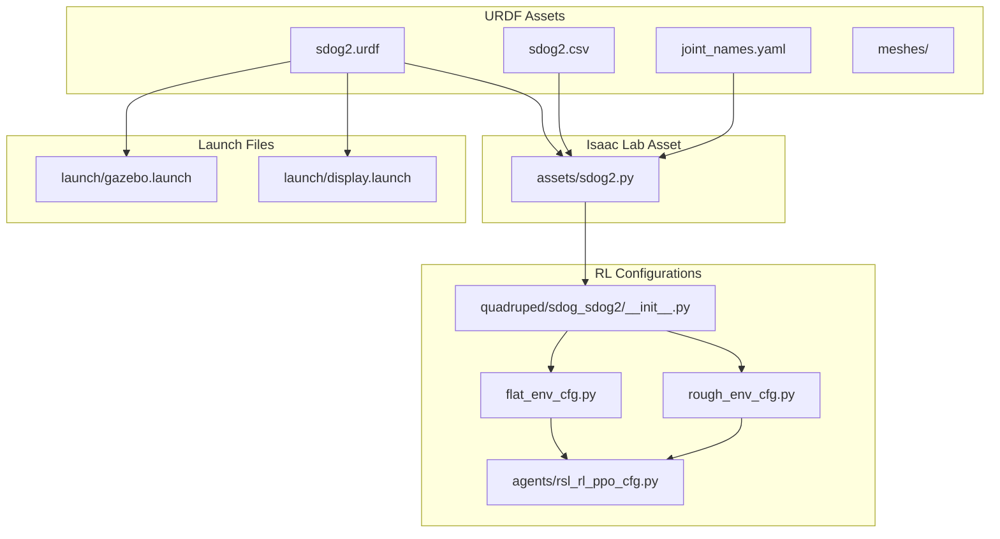
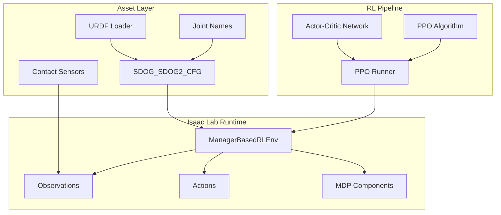
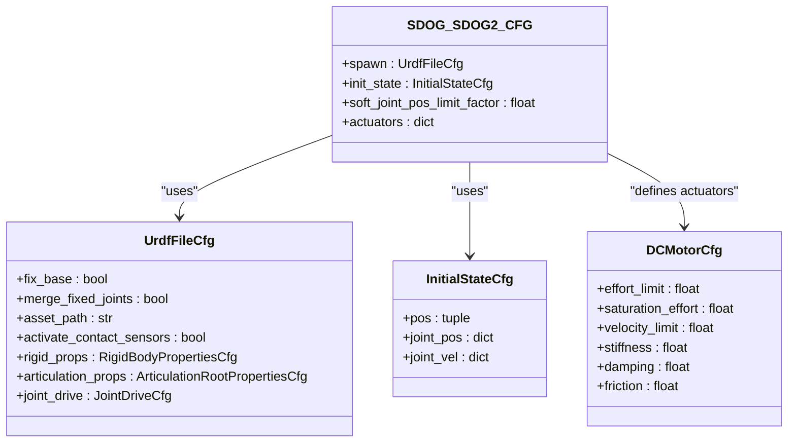
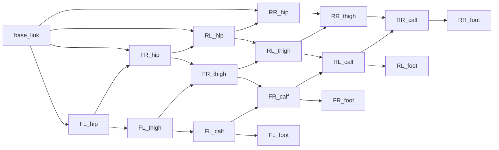
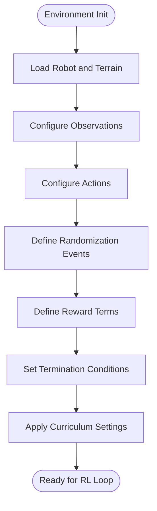
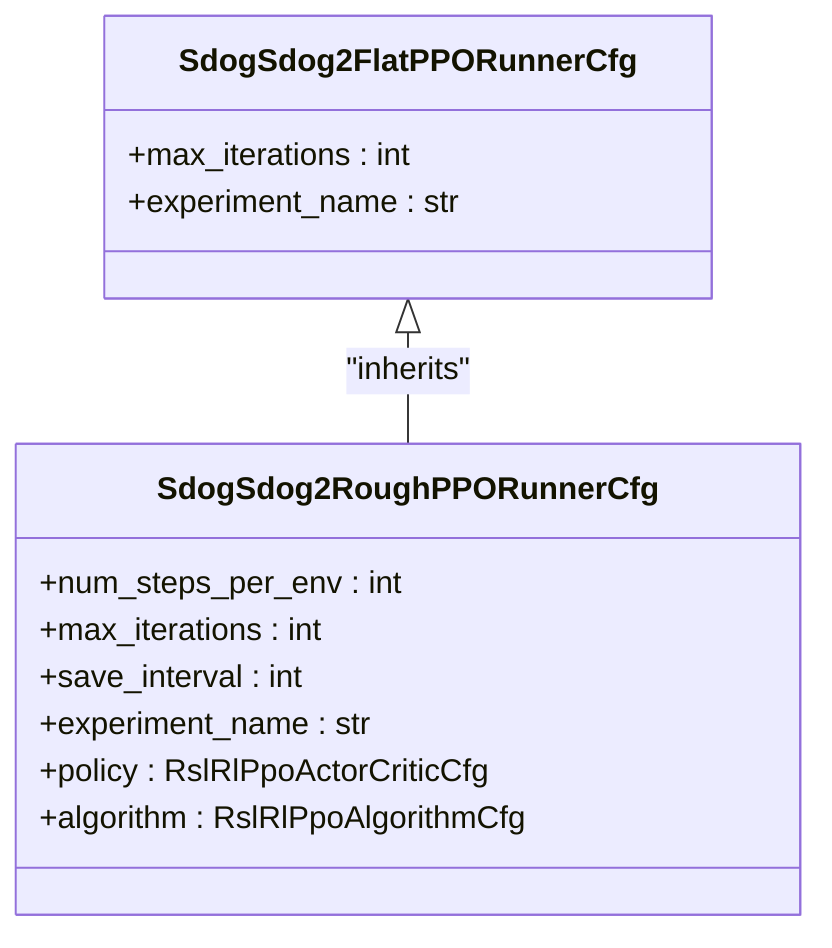
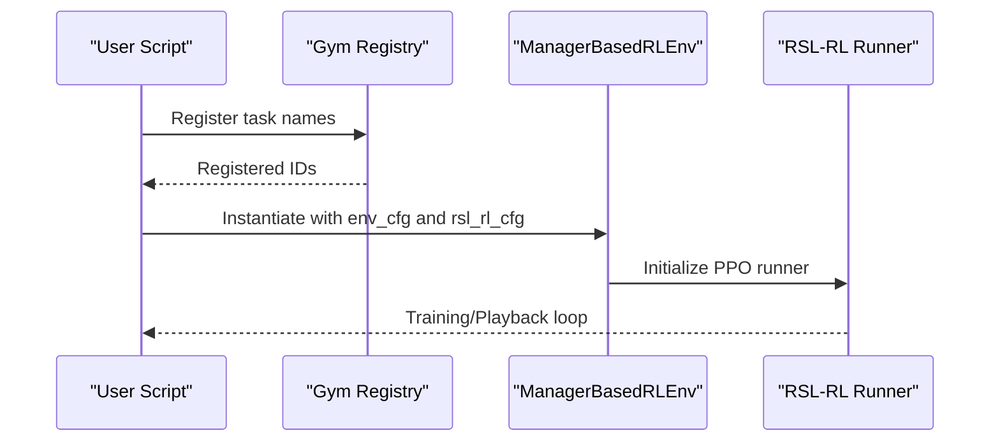
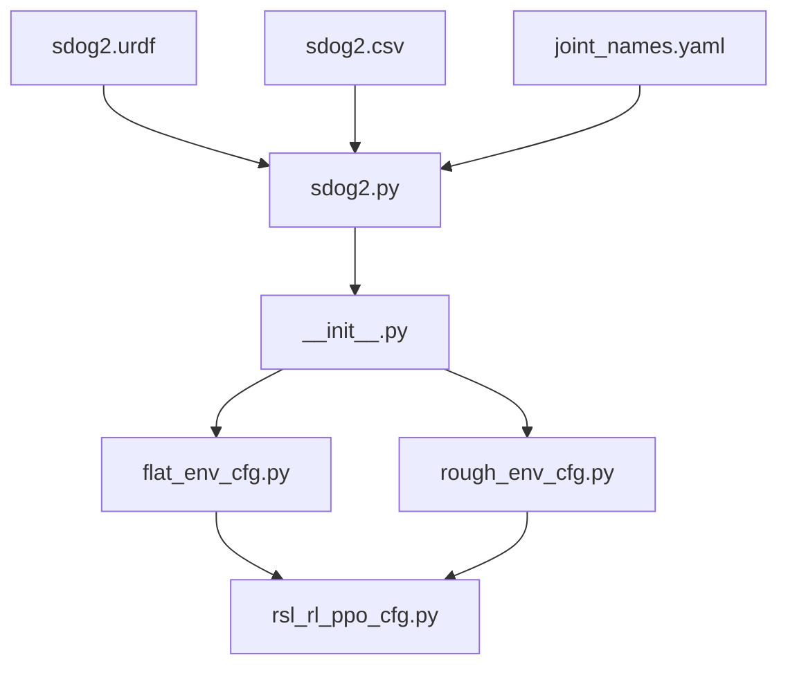

# Sdog-Sdog2 Quadruped

<cite>
**Referenced Files in This Document**
- [README.md](file://README.md)
- [sdog2.py](file://source/robot_lab/robot_lab/assets/sdog2.py)
- [sdog2.urdf](file://source/robot_lab/data/Robots/sdog/sdog2_description/urdf/sdog2.urdf)
- [sdog2.csv](file://source/robot_lab/data/Robots/sdog/sdog2_description/urdf/sdog2.csv)
- [joint_names.yaml](file://source/robot_lab/data/Robots/sdog/sdog2_description/config/joint_names_S-DOG-V2.01-URDF V1.0 20251117.yaml)
- [gazebo.launch](file://source/robot_lab/data/Robots/sdog/sdog2_description/launch/gazebo.launch)
- [display.launch](file://source/robot_lab/data/Robots/sdog/sdog2_description/launch/display.launch)
- [rsl_rl_ppo_cfg.py](file://source/robot_lab/robot_lab/tasks/manager_based/locomotion/velocity/config/quadruped/sdog_sdog2/agents/rsl_rl_ppo_cfg.py)
- [flat_env_cfg.py](file://source/robot_lab/robot_lab/tasks/manager_based/locomotion/velocity/config/quadruped/sdog_sdog2/flat_env_cfg.py)
- [rough_env_cfg.py](file://source/robot_lab/robot_lab/tasks/manager_based/locomotion/velocity/config/quadruped/sdog_sdog2/rough_env_cfg.py)
- [__init__.py](file://source/robot_lab/robot_lab/tasks/manager_based/locomotion/velocity/config/quadruped/sdog_sdog2/__init__.py)
</cite>

## Table of Contents
1. [Introduction](#introduction)
2. [Project Structure](#project-structure)
3. [Core Components](#core-components)
4. [Architecture Overview](#architecture-overview)
5. [Detailed Component Analysis](#detailed-component-analysis)
6. [Dependency Analysis](#dependency-analysis)
7. [Performance Considerations](#performance-considerations)
8. [Troubleshooting Guide](#troubleshooting-guide)
9. [Conclusion](#conclusion)

## Introduction
This document describes the Sdog-Sdog2 quadruped robot implementation within the robot_lab project. It covers the robot's URDF model, actuator configuration, environment setup for reinforcement learning, and training configurations. The Sdog-Sdog2 is a four-legged robot designed for locomotion research, with articulated legs per side and contact sensors enabled for ground interaction feedback.

## Project Structure
The Sdog-Sdog2 implementation is organized into three primary areas:
- URDF and mesh assets for the robot model
- Actuator and robot configuration for Isaac Lab
- Reinforcement learning environments and training configurations

**Diagram sources**
- [sdog2.urdf](file://source/robot_lab/data/Robots/sdog/sdog2_description/urdf/sdog2.urdf#L1-L990)
- [sdog2.csv](file://source/robot_lab/data/Robots/sdog/sdog2_description/urdf/sdog2.csv#L1-L19)
- [joint_names.yaml](file://source/robot_lab/data/Robots/sdog/sdog2_description/config/joint_names_S-DOG-V2.01-URDF V1.0 20251117.yaml#L1-L2)
- [sdog2.py](file://source/robot_lab/robot_lab/assets/sdog2.py#L1-L84)
- [__init__.py](file://source/robot_lab/robot_lab/tasks/manager_based/locomotion/velocity/config/quadruped/sdog_sdog2/__init__.py#L1-L31)
- [flat_env_cfg.py](file://source/robot_lab/robot_lab/tasks/manager_based/locomotion/velocity/config/quadruped/sdog_sdog2/flat_env_cfg.py#L1-L32)
- [rough_env_cfg.py](file://source/robot_lab/robot_lab/tasks/manager_based/locomotion/velocity/config/quadruped/sdog_sdog2/rough_env_cfg.py#L1-L179)
- [rsl_rl_ppo_cfg.py](file://source/robot_lab/robot_lab/tasks/manager_based/locomotion/velocity/config/quadruped/sdog_sdog2/agents/rsl_rl_ppo_cfg.py#L1-L45)
- [gazebo.launch](file://source/robot_lab/data/Robots/sdog/sdog2_description/launch/gazebo.launch#L1-L20)
- [display.launch](file://source/robot_lab/data/Robots/sdog/sdog2_description/launch/display.launch#L1-L26)

**Section sources**
- [README.md](file://README.md#L1-L512)
- [sdog2.py](file://source/robot_lab/robot_lab/assets/sdog2.py#L1-L84)
- [sdog2.urdf](file://source/robot_lab/data/Robots/sdog/sdog2_description/urdf/sdog2.urdf#L1-L990)
- [sdog2.csv](file://source/robot_lab/data/Robots/sdog/sdog2_description/urdf/sdog2.csv#L1-L19)
- [joint_names.yaml](file://source/robot_lab/data/Robots/sdog/sdog2_description/config/joint_names_S-DOG-V2.01-URDF V1.0 20251117.yaml#L1-L2)
- [gazebo.launch](file://source/robot_lab/data/Robots/sdog/sdog2_description/launch/gazebo.launch#L1-L20)
- [display.launch](file://source/robot_lab/data/Robots/sdog/sdog2_description/launch/display.launch#L1-L26)
- [__init__.py](file://source/robot_lab/robot_lab/tasks/manager_based/locomotion/velocity/config/quadruped/sdog_sdog2/__init__.py#L1-L31)
- [flat_env_cfg.py](file://source/robot_lab/robot_lab/tasks/manager_based/locomotion/velocity/config/quadruped/sdog_sdog2/flat_env_cfg.py#L1-L32)
- [rough_env_cfg.py](file://source/robot_lab/robot_lab/tasks/manager_based/locomotion/velocity/config/quadruped/sdog_sdog2/rough_env_cfg.py#L1-L179)
- [rsl_rl_ppo_cfg.py](file://source/robot_lab/robot_lab/tasks/manager_based/locomotion/velocity/config/quadruped/sdog_sdog2/agents/rsl_rl_ppo_cfg.py#L1-L45)

## Core Components
- Robot URDF and inertial properties define the physical structure and dynamics.
- Joint limits and actuator groups configure torque and velocity constraints for realistic simulation.
- Environment configurations specify observations, actions, rewards, and curriculum for training.
- Launch files enable quick visualization and simulation initialization.

Key implementation references:
- Robot configuration and actuator mapping: [sdog2.py](file://source/robot_lab/robot_lab/assets/sdog2.py#L14-L81)
- URDF structure and joint definitions: [sdog2.urdf](file://source/robot_lab/data/Robots/sdog/sdog2_description/urdf/sdog2.urdf#L1-L990)
- CSV metadata for inertial and kinematic parameters: [sdog2.csv](file://source/robot_lab/data/Robots/sdog/sdog2_description/urdf/sdog2.csv#L1-L19)
- Joint naming convention for actuator assignment: [joint_names.yaml](file://source/robot_lab/data/Robots/sdog/sdog2_description/config/joint_names_S-DOG-V2.01-URDF V1.0 20251117.yaml#L1-L2)
- Environment registration and task names: [__init__.py](file://source/robot_lab/robot_lab/tasks/manager_based/locomotion/velocity/config/quadruped/sdog_sdog2/__init__.py#L12-L30)
- Flat terrain environment overrides: [flat_env_cfg.py](file://source/robot_lab/robot_lab/tasks/manager_based/locomotion/velocity/config/quadruped/sdog_sdog2/flat_env_cfg.py#L12-L31)
- Rough terrain environment and reward engineering: [rough_env_cfg.py](file://source/robot_lab/robot_lab/tasks/manager_based/locomotion/velocity/config/quadruped/sdog_sdog2/rough_env_cfg.py#L15-L179)
- PPO hyperparameters for training: [rsl_rl_ppo_cfg.py](file://source/robot_lab/robot_lab/tasks/manager_based/locomotion/velocity/config/quadruped/sdog_sdog2/agents/rsl_rl_ppo_cfg.py#L9-L44)

**Section sources**
- [sdog2.py](file://source/robot_lab/robot_lab/assets/sdog2.py#L14-L81)
- [sdog2.urdf](file://source/robot_lab/data/Robots/sdog/sdog2_description/urdf/sdog2.urdf#L1-L990)
- [sdog2.csv](file://source/robot_lab/data/Robots/sdog/sdog2_description/urdf/sdog2.csv#L1-L19)
- [joint_names.yaml](file://source/robot_lab/data/Robots/sdog/sdog2_description/config/joint_names_S-DOG-V2.01-URDF V1.0 20251117.yaml#L1-L2)
- [__init__.py](file://source/robot_lab/robot_lab/tasks/manager_based/locomotion/velocity/config/quadruped/sdog_sdog2/__init__.py#L12-L30)
- [flat_env_cfg.py](file://source/robot_lab/robot_lab/tasks/manager_based/locomotion/velocity/config/quadruped/sdog_sdog2/flat_env_cfg.py#L12-L31)
- [rough_env_cfg.py](file://source/robot_lab/robot_lab/tasks/manager_based/locomotion/velocity/config/quadruped/sdog_sdog2/rough_env_cfg.py#L15-L179)
- [rsl_rl_ppo_cfg.py](file://source/robot_lab/robot_lab/tasks/manager_based/locomotion/velocity/config/quadruped/sdog_sdog2/agents/rsl_rl_ppo_cfg.py#L9-L44)

## Architecture Overview
The Sdog-Sdog2 system integrates a URDF-based robot model with an Isaac Lab environment and a reinforcement learning pipeline. The asset loader spawns the robot from URDF, applies actuator configurations, and exposes observations/actions to the RL algorithm. Environments are registered for both flat and rough terrains, with distinct reward shaping and curriculum settings.

**Diagram sources**
- [sdog2.py](file://source/robot_lab/robot_lab/assets/sdog2.py#L14-L81)
- [__init__.py](file://source/robot_lab/robot_lab/tasks/manager_based/locomotion/velocity/config/quadruped/sdog_sdog2/__init__.py#L12-L30)
- [flat_env_cfg.py](file://source/robot_lab/robot_lab/tasks/manager_based/locomotion/velocity/config/quadruped/sdog_sdog2/flat_env_cfg.py#L12-L31)
- [rough_env_cfg.py](file://source/robot_lab/robot_lab/tasks/manager_based/locomotion/velocity/config/quadruped/sdog_sdog2/rough_env_cfg.py#L15-L179)
- [rsl_rl_ppo_cfg.py](file://source/robot_lab/robot_lab/tasks/manager_based/locomotion/velocity/config/quadruped/sdog_sdog2/agents/rsl_rl_ppo_cfg.py#L9-L44)

## Detailed Component Analysis

### Robot Asset Configuration
The Sdog-Sdog2 asset configuration defines:
- URDF spawn parameters and collision/contact sensor activation
- Initial pose and joint positions for stable starts
- Actuator groups for hip/thigh and calf joints with torque/velocity limits
- Soft joint limit factor and solver settings for stability

**Diagram sources**
- [sdog2.py](file://source/robot_lab/robot_lab/assets/sdog2.py#L14-L81)

**Section sources**
- [sdog2.py](file://source/robot_lab/robot_lab/assets/sdog2.py#L14-L81)

### URDF and Joint Structure
The URDF defines the robot's links and joints, including:
- Base link with inertial properties and visual/collision meshes
- Four legs (front-left, front-right, rear-left, rear-right) with hip, thigh, and calf segments
- Fixed foot joints at the end of each leg
- Joint limits for revolute joints and effort/velocity bounds

**Diagram sources**
- [sdog2.urdf](file://source/robot_lab/data/Robots/sdog/sdog2_description/urdf/sdog2.urdf#L1-L990)

**Section sources**
- [sdog2.urdf](file://source/robot_lab/data/Robots/sdog/sdog2_description/urdf/sdog2.urdf#L1-L990)
- [sdog2.csv](file://source/robot_lab/data/Robots/sdog/sdog2_description/urdf/sdog2.csv#L1-L19)
- [joint_names.yaml](file://source/robot_lab/data/Robots/sdog/sdog2_description/config/joint_names_S-DOG-V2.01-URDF V1.0 20251117.yaml#L1-L2)

### Environment Configuration and Reward Engineering
Environment configurations customize:
- Scene robot instantiation and height scanner placement
- Observation scaling for base velocity, angular velocity, joint positions, and velocities
- Action scaling per joint group (hip vs non-hip) and clipping ranges
- Event randomizations for mass, center of mass, and external forces
- Reward terms for orientation, torques, joint penalties, contact forces, and gait synchronization
- Termination conditions and curriculum settings

**Diagram sources**
- [rough_env_cfg.py](file://source/robot_lab/robot_lab/tasks/manager_based/locomotion/velocity/config/quadruped/sdog_sdog2/rough_env_cfg.py#L28-L179)
- [flat_env_cfg.py](file://source/robot_lab/robot_lab/tasks/manager_based/locomotion/velocity/config/quadruped/sdog_sdog2/flat_env_cfg.py#L12-L31)

**Section sources**
- [rough_env_cfg.py](file://source/robot_lab/robot_lab/tasks/manager_based/locomotion/velocity/config/quadruped/sdog_sdog2/rough_env_cfg.py#L15-L179)
- [flat_env_cfg.py](file://source/robot_lab/robot_lab/tasks/manager_based/locomotion/velocity/config/quadruped/sdog_sdog2/flat_env_cfg.py#L12-L31)

### Training Configuration (PPO)
Training hyperparameters include:
- Policy network architecture with hidden layers and activation
- PPO algorithm settings: clipping, entropy bonus, KL divergence target
- Learning rate scheduling and gradient clipping
- Experiment naming and iteration counts for flat and rough terrains

**Diagram sources**
- [rsl_rl_ppo_cfg.py](file://source/robot_lab/robot_lab/tasks/manager_based/locomotion/velocity/config/quadruped/sdog_sdog2/agents/rsl_rl_ppo_cfg.py#L9-L44)

**Section sources**
- [rsl_rl_ppo_cfg.py](file://source/robot_lab/robot_lab/tasks/manager_based/locomotion/velocity/config/quadruped/sdog_sdog2/agents/rsl_rl_ppo_cfg.py#L9-L44)

### Environment Registration and Usage
Environments are registered with Gym under specific names for flat and rough terrains. Users can train or play policies using the provided scripts with the registered task identifiers.

**Diagram sources**
- [__init__.py](file://source/robot_lab/robot_lab/tasks/manager_based/locomotion/velocity/config/quadruped/sdog_sdog2/__init__.py#L12-L30)

**Section sources**
- [__init__.py](file://source/robot_lab/robot_lab/tasks/manager_based/locomotion/velocity/config/quadruped/sdog_sdog2/__init__.py#L12-L30)
- [README.md](file://README.md#L193-L227)

## Dependency Analysis
The Sdog-Sdog2 implementation depends on:
- URDF and CSV for geometry and inertial data
- Asset loader for spawning and actuator mapping
- Environment configurations for observation/action/reward setup
- RL runner for training and evaluation

**Diagram sources**
- [sdog2.urdf](file://source/robot_lab/data/Robots/sdog/sdog2_description/urdf/sdog2.urdf#L1-L990)
- [sdog2.csv](file://source/robot_lab/data/Robots/sdog/sdog2_description/urdf/sdog2.csv#L1-L19)
- [joint_names.yaml](file://source/robot_lab/data/Robots/sdog/sdog2_description/config/joint_names_S-DOG-V2.01-URDF V1.0 20251117.yaml#L1-L2)
- [sdog2.py](file://source/robot_lab/robot_lab/assets/sdog2.py#L14-L81)
- [__init__.py](file://source/robot_lab/robot_lab/tasks/manager_based/locomotion/velocity/config/quadruped/sdog_sdog2/__init__.py#L12-L30)
- [flat_env_cfg.py](file://source/robot_lab/robot_lab/tasks/manager_based/locomotion/velocity/config/quadruped/sdog_sdog2/flat_env_cfg.py#L12-L31)
- [rough_env_cfg.py](file://source/robot_lab/robot_lab/tasks/manager_based/locomotion/velocity/config/quadruped/sdog_sdog2/rough_env_cfg.py#L15-L179)
- [rsl_rl_ppo_cfg.py](file://source/robot_lab/robot_lab/tasks/manager_based/locomotion/velocity/config/quadruped/sdog_sdog2/agents/rsl_rl_ppo_cfg.py#L9-L44)

**Section sources**
- [sdog2.py](file://source/robot_lab/robot_lab/assets/sdog2.py#L14-L81)
- [__init__.py](file://source/robot_lab/robot_lab/tasks/manager_based/locomotion/velocity/config/quadruped/sdog_sdog2/__init__.py#L12-L30)
- [rough_env_cfg.py](file://source/robot_lab/robot_lab/tasks/manager_based/locomotion/velocity/config/quadruped/sdog_sdog2/rough_env_cfg.py#L15-L179)
- [flat_env_cfg.py](file://source/robot_lab/robot_lab/tasks/manager_based/locomotion/velocity/config/quadruped/sdog_sdog2/flat_env_cfg.py#L12-L31)
- [rsl_rl_ppo_cfg.py](file://source/robot_lab/robot_lab/tasks/manager_based/locomotion/velocity/config/quadruped/sdog_sdog2/agents/rsl_rl_ppo_cfg.py#L9-L44)

## Performance Considerations
- Solver settings and joint drive parameters influence simulation stability and responsiveness.
- Observation scaling and action clipping help maintain numerical stability during training.
- Reward engineering balances locomotion performance with energy efficiency and safety.
- Curriculum settings can accelerate learning by gradually increasing task difficulty.

## Troubleshooting Guide
- If the robot falls through terrain or exhibits unstable behavior, verify joint limits and actuator torque/velocity limits in the asset configuration.
- For incorrect joint naming or actuator assignment, confirm the joint names list and actuator group mappings.
- If contact sensors are not reporting expected forces, ensure contact sensors are activated in the URDF spawn configuration.
- For environment registration errors, confirm the Gym registration entries and task names match the expected identifiers.

**Section sources**
- [sdog2.py](file://source/robot_lab/robot_lab/assets/sdog2.py#L14-L81)
- [joint_names.yaml](file://source/robot_lab/data/Robots/sdog/sdog2_description/config/joint_names_S-DOG-V2.01-URDF V1.0 20251117.yaml#L1-L2)
- [rough_env_cfg.py](file://source/robot_lab/robot_lab/tasks/manager_based/locomotion/velocity/config/quadruped/sdog_sdog2/rough_env_cfg.py#L54-L77)

## Conclusion
The Sdog-Sdog2 quadruped implementation provides a complete pipeline from URDF modeling to reinforcement learning training. Its modular design enables easy customization of actuator parameters, environment configurations, and training hyperparameters. The provided launch files and Gym registrations simplify integration into broader robotics workflows.