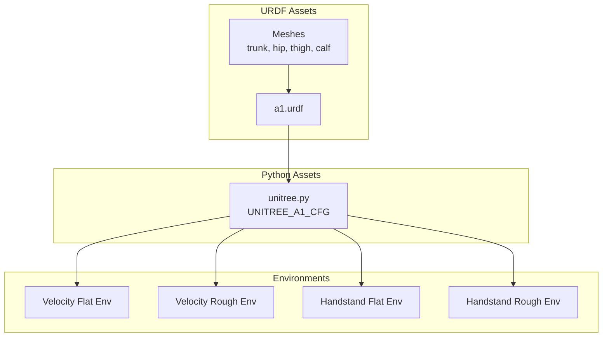
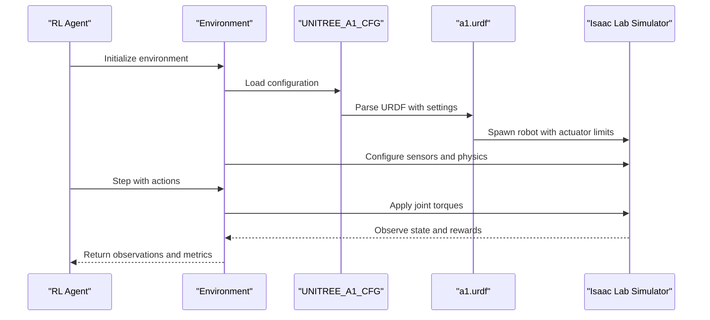
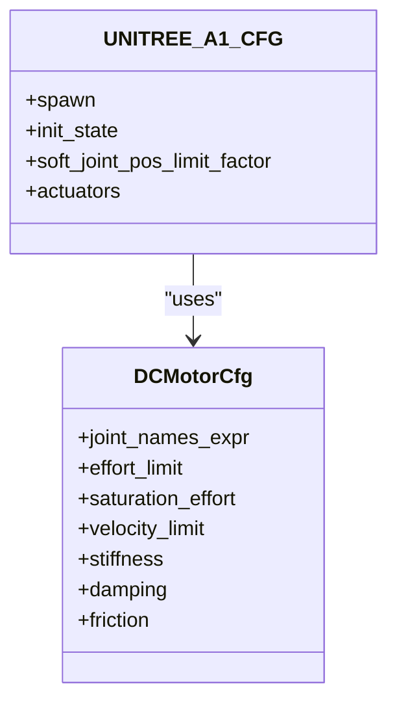
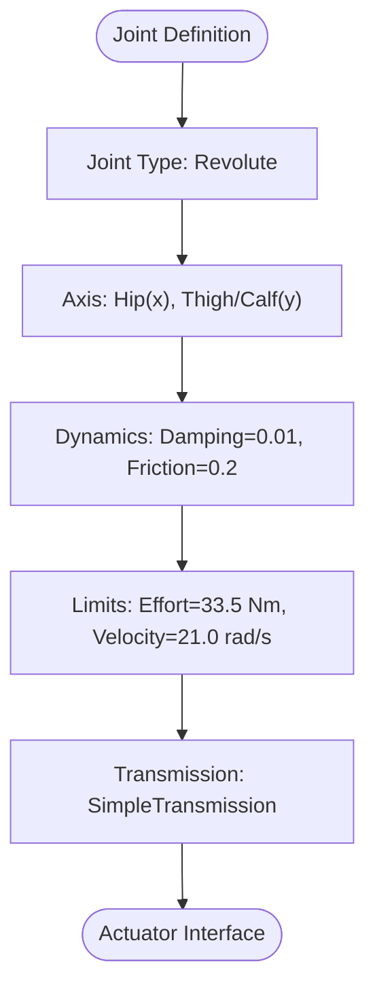
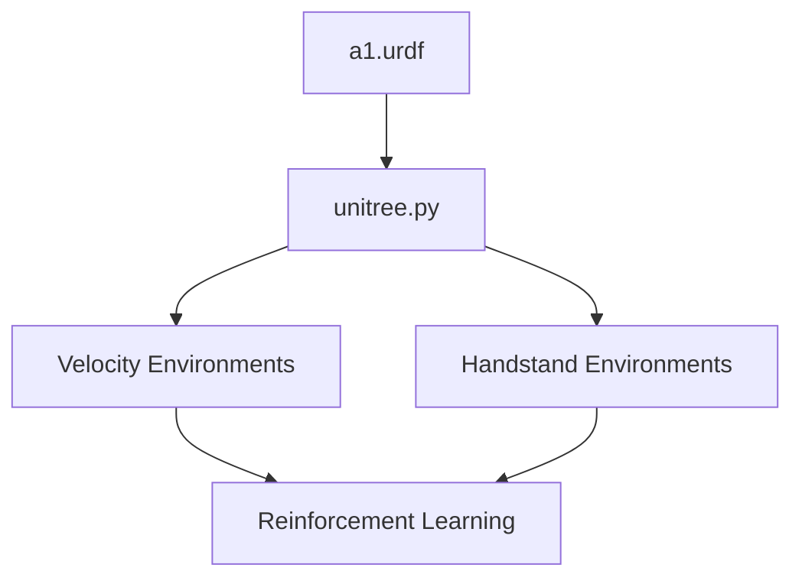

# Unitree A1 Quadruped

<cite>
**Referenced Files in This Document**
- [a1.urdf](file://source/robot_lab/data/Robots/unitree/a1_description/urdf/a1.urdf)
- [unitree.py](file://source/robot_lab/robot_lab/assets/unitree.py)
- [README.md](file://README.md)
- [flat_env_cfg.py](file://source/robot_lab/robot_lab/tasks/manager_based/locomotion/velocity/config/quadruped/unitree_a1/flat_env_cfg.py)
- [rough_env_cfg.py](file://source/robot_lab/robot_lab/tasks/manager_based/locomotion/velocity/config/quadruped/unitree_a1/rough_env_cfg.py)
- [flat_env_cfg.py](file://source/robot_lab/robot_lab/tasks/manager_based/locomotion/velocity/config/others/unitree_a1_handstand/flat_env_cfg.py)
- [rough_env_cfg.py](file://source/robot_lab/robot_lab/tasks/manager_based/locomotion/velocity/config/others/unitree_a1_handstand/rough_env_cfg.py)
</cite>

## Table of Contents
1. [Introduction](#introduction)
2. [Project Structure](#project-structure)
3. [Core Components](#core-components)
4. [Architecture Overview](#architecture-overview)
5. [Detailed Component Analysis](#detailed-component-analysis)
6. [Dependency Analysis](#dependency-analysis)
7. [Performance Considerations](#performance-considerations)
8. [Troubleshooting Guide](#troubleshooting-guide)
9. [Conclusion](#conclusion)
10. [Appendices](#appendices)

## Introduction
This document provides comprehensive technical documentation for the Unitree A1 quadruped robot configuration within the robot_lab ecosystem. It covers the DC motor actuator setup, physical specifications, initial pose configuration, simulation parameters, URDF model details, and practical training scenarios. The goal is to help researchers and practitioners configure and deploy the A1 robot for reinforcement learning tasks in Isaac Lab environments.

## Project Structure
The A1 configuration spans several modules:
- URDF model definition and mesh assets
- Python asset configuration for Isaac Lab
- Environment configurations for locomotion and specialized tasks
- Training and evaluation scripts

**Diagram sources**
- [a1.urdf](file://source/robot_lab/data/Robots/unitree/a1_description/urdf/a1.urdf#L1-L974)
- [unitree.py](file://source/robot_lab/robot_lab/assets/unitree.py#L19-L65)
- [flat_env_cfg.py](file://source/robot_lab/robot_lab/tasks/manager_based/locomotion/velocity/config/quadruped/unitree_a1/flat_env_cfg.py#L1-L30)
- [rough_env_cfg.py](file://source/robot_lab/robot_lab/tasks/manager_based/locomotion/velocity/config/quadruped/unitree_a1/rough_env_cfg.py#L1-L162)
- [flat_env_cfg.py](file://source/robot_lab/robot_lab/tasks/manager_based/locomotion/velocity/config/others/unitree_a1_handstand/flat_env_cfg.py#L1-L30)
- [rough_env_cfg.py](file://source/robot_lab/robot_lab/tasks/manager_based/locomotion/velocity/config/others/unitree_a1_handstand/rough_env_cfg.py#L1-L213)

**Section sources**
- [README.md](file://README.md#L1-L501)

## Core Components
This section documents the key components that define the A1 robot configuration.

### DC Motor Actuator Setup
The A1 uses DC motor actuators with the following specifications:
- Effort limit: 33.5 Nm
- Velocity limit: 21.0 rad/s
- Stiffness: 20.0 Nm/rad
- Damping: 0.5 Nm/rad/s
- Friction: 0.0 Nm
- Joint names expression: matches all revolute joints

These parameters are defined in the Python asset configuration and align with the URDF joint limits.

**Section sources**
- [unitree.py](file://source/robot_lab/robot_lab/assets/unitree.py#L54-L65)
- [a1.urdf](file://source/robot_lab/data/Robots/unitree/a1_description/urdf/a1.urdf#L363-L370)
- [a1.urdf](file://source/robot_lab/data/Robots/unitree/a1_description/urdf/a1.urdf#L405-L412)
- [a1.urdf](file://source/robot_lab/data/Robots/unitree/a1_description/urdf/a1.urdf#L433-L440)
- [a1.urdf](file://source/robot_lab/data/Robots/unitree/a1_description/urdf/a1.urdf#L515-L522)
- [a1.urdf](file://source/robot_lab/data/Robots/unitree/a1_description/urdf/a1.urdf#L557-L564)
- [a1.urdf](file://source/robot_lab/data/Robots/unitree/a1_description/urdf/a1.urdf#L585-L592)
- [a1.urdf](file://source/robot_lab/data/Robots/unitree/a1_description/urdf/a1.urdf#L667-L674)
- [a1.urdf](file://source/robot_lab/data/Robots/unitree/a1_description/urdf/a1.urdf#L709-L716)
- [a1.urdf](file://source/robot_lab/data/Robots/unitree/a1_description/urdf/a1.urdf#L737-L744)
- [a1.urdf](file://source/robot_lab/data/Robots/unitree/a1_description/urdf/a1.urdf#L819-L826)
- [a1.urdf](file://source/robot_lab/data/Robots/unitree/a1_description/urdf/a1.urdf#L861-L868)
- [a1.urdf](file://source/robot_lab/data/Robots/unitree/a1_description/urdf/a1.urdf#L889-L896)

### Physical Specifications
The A1 robot has the following physical characteristics:
- Mass: 6.0 kg (trunk link)
- Dimensions: Trunk box geometry 0.267 x 0.194 x 0.114 meters
- Joint configurations:
  - Hip joints: Front-right (FR), Front-left (FL), Rear-right (RR), Rear-left (RL)
  - Thigh joints: Same four legs as hip joints
  - Calf joints: Same four legs as hip joints
  - Foot links: Spherical collision geometry with radius 0.02 meters

These specifications are defined in the URDF model and inertial properties.

**Section sources**
- [a1.urdf](file://source/robot_lab/data/Robots/unitree/a1_description/urdf/a1.urdf#L332-L336)
- [a1.urdf](file://source/robot_lab/data/Robots/unitree/a1_description/urdf/a1.urdf#L326-L331)
- [a1.urdf](file://source/robot_lab/data/Robots/unitree/a1_description/urdf/a1.urdf#L466-L484)
- [a1.urdf](file://source/robot_lab/data/Robots/unitree/a1_description/urdf/a1.urdf#L618-L636)
- [a1.urdf](file://source/robot_lab/data/Robots/unitree/a1_description/urdf/a1.urdf#L770-L788)
- [a1.urdf](file://source/robot_lab/data/Robots/unitree/a1_description/urdf/a1.urdf#L922-L940)

### Initial Pose Setup
The initial configuration places the robot in a stable stance:
- Base position: z = 0.38 meters
- Joint positions:
  - Hip joints: 0.0 radians (all legs)
  - Thigh joints: 0.8 radians (front legs), 0.8 radians (rear legs)
  - Calf joints: -1.5 radians (all legs)
- Joint velocities: 0.0 radians/second for all joints

This initialization ensures the robot starts in a balanced quadruped stance.

**Section sources**
- [unitree.py](file://source/robot_lab/robot_lab/assets/unitree.py#L42-L52)

### Simulation Parameters
Key simulation settings for the A1:
- URDF file path: `${ISAACLAB_ASSETS_DATA_DIR}/Robots/unitree/a1_description/urdf/a1.urdf`
- Merge fixed joints: Enabled
- Replace cylinders with capsules: Disabled
- Activate contact sensors: Enabled
- Rigid body properties:
  - Disable gravity: False
  - Linear damping: 0.0
  - Angular damping: 0.0
  - Max linear velocity: 1000.0 m/s
  - Max angular velocity: 1000.0 rad/s
  - Max depenetration velocity: 1.0 m/s
- Articulation root properties:
  - Enabled self collisions: False
  - Solver position iteration count: 4
  - Solver velocity iteration count: 0
- Joint drive PD gains: stiffness = 0, damping = 0

These settings optimize simulation stability and performance for quadruped locomotion.

**Section sources**
- [unitree.py](file://source/robot_lab/robot_lab/assets/unitree.py#L20-L41)

### URDF Model Details
The URDF model includes:
- Gazebo plugins for control and visualization
- IMU sensor with high update rate
- Contact sensors on each foot link
- Material definitions and friction coefficients
- Transmission definitions for each joint

The model supports both Gazebo simulation and Isaac Lab integration.

**Section sources**
- [a1.urdf](file://source/robot_lab/data/Robots/unitree/a1_description/urdf/a1.urdf#L47-L52)
- [a1.urdf](file://source/robot_lab/data/Robots/unitree/a1_description/urdf/a1.urdf#L81-L99)
- [a1.urdf](file://source/robot_lab/data/Robots/unitree/a1_description/urdf/a1.urdf#L100-L165)
- [a1.urdf](file://source/robot_lab/data/Robots/unitree/a1_description/urdf/a1.urdf#L166-L293)

## Architecture Overview
The A1 configuration integrates URDF assets with Python-based environment setups for reinforcement learning.

**Diagram sources**
- [unitree.py](file://source/robot_lab/robot_lab/assets/unitree.py#L19-L65)
- [a1.urdf](file://source/robot_lab/data/Robots/unitree/a1_description/urdf/a1.urdf#L1-L974)
- [rough_env_cfg.py](file://source/robot_lab/robot_lab/tasks/manager_based/locomotion/velocity/config/quadruped/unitree_a1/rough_env_cfg.py#L35-L37)

## Detailed Component Analysis

### Actuator Configuration
The DCMotorCfg defines the actuator behavior for all A1 joints:
- Joint names expression: matches all joints ending with "_joint"
- Effort and saturation effort: 33.5 Nm
- Velocity limit: 21.0 rad/s
- Stiffness: 20.0 Nm/rad
- Damping: 0.5 Nm/rad/s
- Friction: 0.0 Nm

**Diagram sources**
- [unitree.py](file://source/robot_lab/robot_lab/assets/unitree.py#L54-L65)
- [unitree.py](file://source/robot_lab/robot_lab/assets/unitree.py#L19-L65)

**Section sources**
- [unitree.py](file://source/robot_lab/robot_lab/assets/unitree.py#L54-L65)

### Joint Limits and Dynamics
Each joint in the URDF defines:
- Joint type: revolute
- Axis: hip uses x-axis, thigh and calf use y-axis
- Dynamics: damping = 0.01, friction = 0.2
- Limits: effort = 33.5 Nm, velocity = 21.0 rad/s
- Transmissions: SimpleTransmission with effort joint interface

**Diagram sources**
- [a1.urdf](file://source/robot_lab/data/Robots/unitree/a1_description/urdf/a1.urdf#L363-L370)
- [a1.urdf](file://source/robot_lab/data/Robots/unitree/a1_description/urdf/a1.urdf#L405-L412)
- [a1.urdf](file://source/robot_lab/data/Robots/unitree/a1_description/urdf/a1.urdf#L433-L440)

**Section sources**
- [a1.urdf](file://source/robot_lab/data/Robots/unitree/a1_description/urdf/a1.urdf#L363-L370)
- [a1.urdf](file://source/robot_lab/data/Robots/unitree/a1_description/urdf/a1.urdf#L405-L412)
- [a1.urdf](file://source/robot_lab/data/Robots/unitree/a1_description/urdf/a1.urdf#L433-L440)

### Environment Configurations
The A1 supports two primary environment types:

#### Velocity Locomotion Environments
- Flat terrain: Plane terrain with no height scanner
- Rough terrain: Procedural terrain with height scanning and curriculum
- Reward structure emphasizes velocity tracking, contact forces, and joint penalties
- Action scaling varies by joint group (hip vs non-hip)

#### Handstand Training Environment
- Specialized reward terms for maintaining inverted posture
- Air-time and orientation rewards for unsupported feet
- Reduced event randomization compared to locomotion

**Section sources**
- [flat_env_cfg.py](file://source/robot_lab/robot_lab/tasks/manager_based/locomotion/velocity/config/quadruped/unitree_a1/flat_env_cfg.py#L1-L30)
- [rough_env_cfg.py](file://source/robot_lab/robot_lab/tasks/manager_based/locomotion/velocity/config/quadruped/unitree_a1/rough_env_cfg.py#L1-L162)
- [flat_env_cfg.py](file://source/robot_lab/robot_lab/tasks/manager_based/locomotion/velocity/config/others/unitree_a1_handstand/flat_env_cfg.py#L1-L30)
- [rough_env_cfg.py](file://source/robot_lab/robot_lab/tasks/manager_based/locomotion/velocity/config/others/unitree_a1_handstand/rough_env_cfg.py#L1-L213)

## Dependency Analysis
The A1 configuration depends on:
- URDF model for geometric and dynamic definitions
- Python asset configuration for simulation parameters
- Environment configurations for reward shaping and training scenarios
- Isaac Lab simulator for physics and rendering

**Diagram sources**
- [a1.urdf](file://source/robot_lab/data/Robots/unitree/a1_description/urdf/a1.urdf#L1-L974)
- [unitree.py](file://source/robot_lab/robot_lab/assets/unitree.py#L19-L65)
- [rough_env_cfg.py](file://source/robot_lab/robot_lab/tasks/manager_based/locomotion/velocity/config/quadruped/unitree_a1/rough_env_cfg.py#L35-L37)

**Section sources**
- [unitree.py](file://source/robot_lab/robot_lab/assets/unitree.py#L19-L65)
- [rough_env_cfg.py](file://source/robot_lab/robot_lab/tasks/manager_based/locomotion/velocity/config/quadruped/unitree_a1/rough_env_cfg.py#L35-L37)

## Performance Considerations
- Joint limits: The 33.5 Nm effort and 21.0 rad/s velocity limits ensure safe torque and speed profiles for the A1 motors.
- Solver configuration: Position iterations set to 4 and velocity iterations to 0 balance accuracy and performance.
- Contact sensors: Enabled contact detection improves stability feedback during locomotion.
- Self-collisions: Disabled for improved simulation speed; can be enabled for more realistic interactions.

## Troubleshooting Guide
Common issues and resolutions:
- Simulation instability: Reduce solver iterations or adjust damping parameters.
- Contact sensor noise: Verify sensor activation and collision geometries.
- Joint limit violations: Ensure actions respect effort and velocity limits.
- Environment registration: Confirm environment names match the registry entries.

**Section sources**
- [unitree.py](file://source/robot_lab/robot_lab/assets/unitree.py#L35-L41)
- [rough_env_cfg.py](file://source/robot_lab/robot_lab/tasks/manager_based/locomotion/velocity/config/quadruped/unitree_a1/rough_env_cfg.py#L151-L153)

## Conclusion
The Unitree A1 quadruped configuration provides a robust foundation for reinforcement learning research in Isaac Lab. With precise actuator limits, comprehensive URDF modeling, and flexible environment configurations, the A1 supports diverse training scenarios from basic locomotion to advanced skills like handstands. The modular design enables easy customization for specific research objectives.

## Appendices

### Practical Training Scenarios
- Basic locomotion: Use velocity environments for flat or rough terrains
- Advanced skills: Handstand environment for inverted posture training
- Curriculum learning: Gradual terrain difficulty progression
- Multi-agent scenarios: Extend configurations for team-based tasks

### Environment Registration
The environments are registered with specific names for easy access:
- RobotLab-Isaac-Velocity-Flat-Unitree-A1-v0
- RobotLab-Isaac-Velocity-Rough-Unitree-A1-v0
- RobotLab-Isaac-Velocity-Flat-HandStand-Unitree-A1-v0

**Section sources**
- [README.md](file://README.md#L21-L22)
- [README.md](file://README.md#L281-L289)