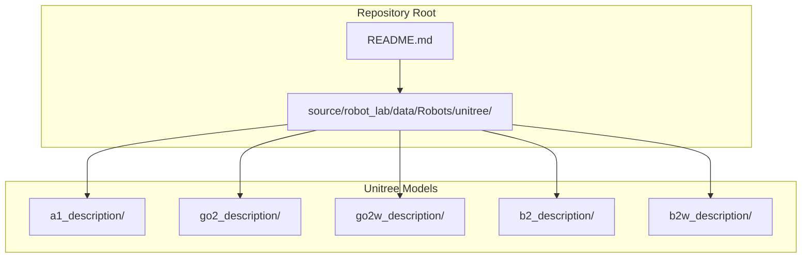
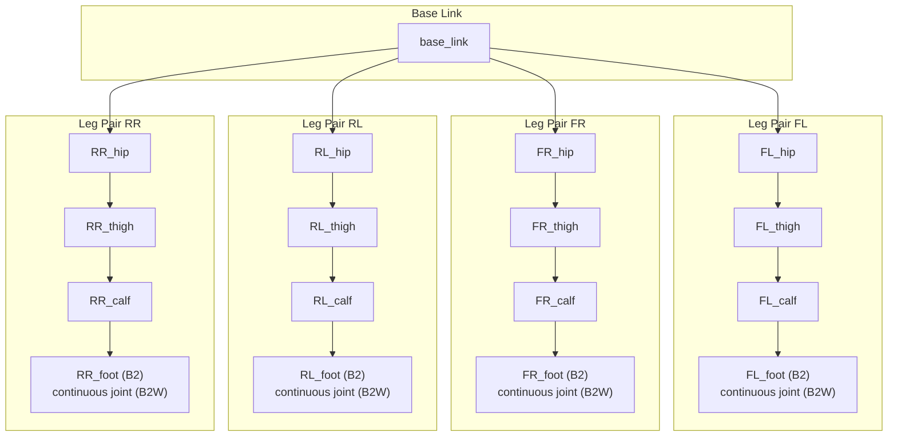
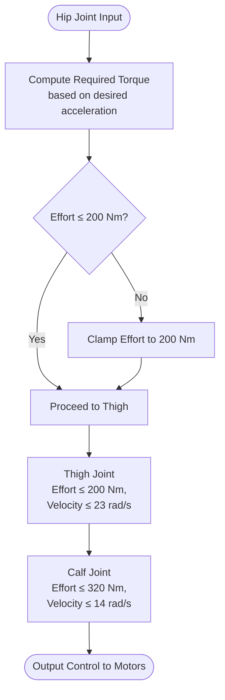
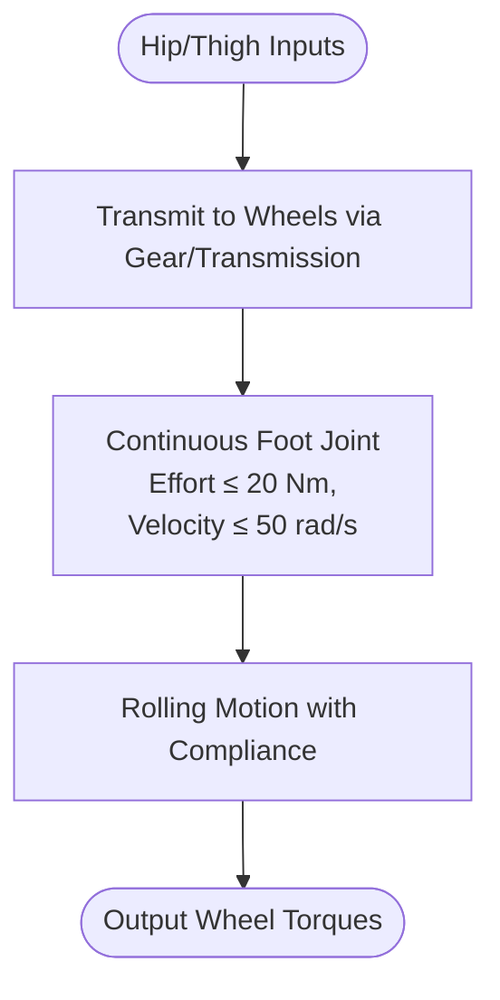
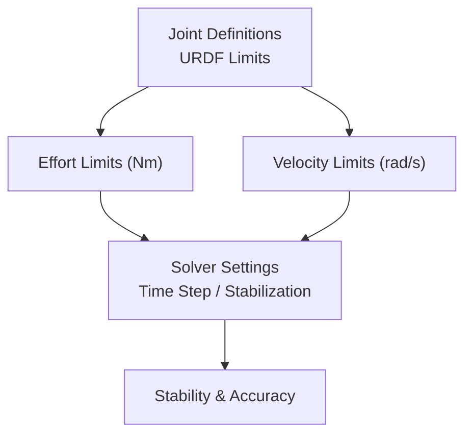
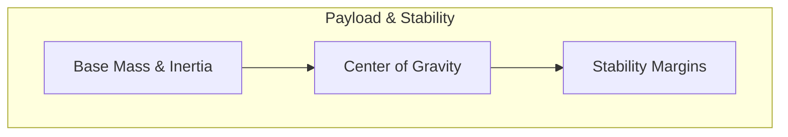
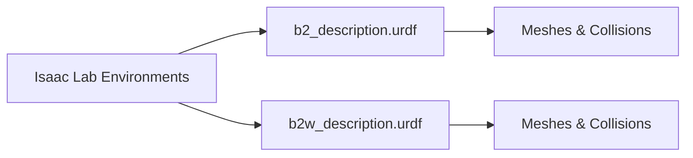

# Unitree B2 Series

<cite>
**Referenced Files in This Document**
- [README.md](file://README.md)
- [b2_description.urdf](file://source/robot_lab/data/Robots/unitree/b2_description/urdf/b2_description.urdf)
- [b2w_description.urdf](file://source/robot_lab/data/Robots/unitree/b2w_description/urdf/b2w_description.urdf)
- [unitree_b2.png](file://docs/imgs/unitree_b2.png)
- [unitree_b2w.png](file://docs/imgs/unitree_b2w.png)
</cite>

## Table of Contents
1. [Introduction](#introduction)
2. [Project Structure](#project-structure)
3. [Core Components](#core-components)
4. [Architecture Overview](#architecture-overview)
5. [Detailed Component Analysis](#detailed-component-analysis)
6. [Dependency Analysis](#dependency-analysis)
7. [Performance Considerations](#performance-considerations)
8. [Troubleshooting Guide](#troubleshooting-guide)
9. [Conclusion](#conclusion)
10. [Appendices](#appendices)

## Introduction
This document provides comprehensive technical documentation for the Unitree B2 series, focusing on the B2 and B2W variants. It explains the segmented actuator system with separate hip, thigh, and calf motor configurations, highlights the high-torque specifications per actuator group, and details the enhanced payload capacity and stability features of the B2 platform. The B2W variant integrates wheel actuators with foot joint configurations, increasing overall height compared to the legged B2. The document also covers joint limit factors, simulation solver parameters, and guidance on choosing B2 over A1 or Go2 variants based on payload and stability requirements.

## Project Structure
The repository organizes robot assets and environments for Isaac Lab. The B2 and B2W models are provided as URDF descriptions with associated mesh assets. The README enumerates supported quadruped and wheeled environments, including B2 and B2W variants.

**Diagram sources**
- [README.md](file://README.md#L17-L31)
- [b2_description.urdf](file://source/robot_lab/data/Robots/unitree/b2_description/urdf/b2_description.urdf#L1-L20)
- [b2w_description.urdf](file://source/robot_lab/data/Robots/unitree/b2w_description/urdf/b2w_description.urdf#L1-L20)

**Section sources**
- [README.md](file://README.md#L17-L31)

## Core Components
- B2 (legged variant)
  - Segmented actuator system: hip, thigh, and calf joints per leg.
  - Joint torque and velocity limits are defined per revolute joint in the URDF.
  - Payload capacity and stability enhancements are reflected in the model’s mass distribution and geometry.
- B2W (wheeled variant)
  - Integrates wheel actuators with foot joint configurations.
  - Foot joints are modeled as continuous joints with low-inertia links and friction limits.
  - Increased height compared to B2, affecting center of gravity and stability.

Key technical indicators derived from the URDFs:
- Hip motors: effort limit 200 Nm, velocity limit 23 rad/s.
- Thigh motors: effort limit 200 Nm, velocity limit 23 rad/s.
- Calf motors: effort limit 320 Nm, velocity limit 14 rad/s.
- Foot actuators (B2W): effort limit 20 Nm, velocity limit 50 rad/s.

**Section sources**
- [b2_description.urdf](file://source/robot_lab/data/Robots/unitree/b2_description/urdf/b2_description.urdf#L138-L144)
- [b2_description.urdf](file://source/robot_lab/data/Robots/unitree/b2_description/urdf/b2_description.urdf#L183-L189)
- [b2_description.urdf](file://source/robot_lab/data/Robots/unitree/b2_description/urdf/b2_description.urdf#L246-L252)
- [b2w_description.urdf](file://source/robot_lab/data/Robots/unitree/b2w_description/urdf/b2w_description.urdf#L138-L144)
- [b2w_description.urdf](file://source/robot_lab/data/Robots/unitree/b2w_description/urdf/b2w_description.urdf#L164-L170)
- [b2w_description.urdf](file://source/robot_lab/data/Robots/unitree/b2w_description/urdf/b2w_description.urdf#L190-L196)
- [b2w_description.urdf](file://source/robot_lab/data/Robots/unitree/b2w_description/urdf/b2w_description.urdf#L216-L222)
- [b2w_description.urdf](file://source/robot_lab/data/Robots/unitree/b2w_description/urdf/b2w_description.urdf#L320-L326)
- [b2w_description.urdf](file://source/robot_lab/data/Robots/unitree/b2w_description/urdf/b2w_description.urdf#L424-L430)
- [b2w_description.urdf](file://source/robot_lab/data/Robots/unitree/b2w_description/urdf/b2w_description.urdf#L528-L534)

## Architecture Overview
The B2 series employs a modular quadruped design with three-segment legs (hip, thigh, calf). Each leg is articulated with revolute joints, enabling precise control of stance and swing phases. The B2W variant replaces the foot segment with a wheel-foot assembly, allowing omnidirectional mobility while retaining joint compliance at the knee and ankle.

**Diagram sources**
- [b2_description.urdf](file://source/robot_lab/data/Robots/unitree/b2_description/urdf/b2_description.urdf#L119-L290)
- [b2_description.urdf](file://source/robot_lab/data/Robots/unitree/b2_description/urdf/b2_description.urdf#L290-L500)
- [b2_description.urdf](file://source/robot_lab/data/Robots/unitree/b2_description/urdf/b2_description.urdf#L500-L800)
- [b2w_description.urdf](file://source/robot_lab/data/Robots/unitree/b2w_description/urdf/b2w_description.urdf#L119-L222)
- [b2w_description.urdf](file://source/robot_lab/data/Robots/unitree/b2w_description/urdf/b2w_description.urdf#L222-L430)
- [b2w_description.urdf](file://source/robot_lab/data/Robots/unitree/b2w_description/urdf/b2w_description.urdf#L430-L534)

## Detailed Component Analysis

### B2 Legged Actuator Groups
- Hip joints (FL_H, FR_H, RL_H, RR_H)
  - Limits: effort 200 Nm, velocity 23 rad/s.
  - Role: lateral and longitudinal positioning; primary stability contributor.
- Thigh joints (FL_T, FR_T, RL_T, RR_T)
  - Limits: effort 200 Nm, velocity 23 rad/s.
  - Role: hip-to-calf power transmission; swing phase control.
- Calf joints (FL_C, FR_C, RL_C, RR_C)
  - Limits: effort 320 Nm, velocity 14 rad/s.
  - Role: ankle-like motion; ground contact and compliance.

**Diagram sources**
- [b2_description.urdf](file://source/robot_lab/data/Robots/unitree/b2_description/urdf/b2_description.urdf#L138-L144)
- [b2_description.urdf](file://source/robot_lab/data/Robots/unitree/b2_description/urdf/b2_description.urdf#L183-L189)
- [b2_description.urdf](file://source/robot_lab/data/Robots/unitree/b2_description/urdf/b2_description.urdf#L246-L252)

**Section sources**
- [b2_description.urdf](file://source/robot_lab/data/Robots/unitree/b2_description/urdf/b2_description.urdf#L138-L144)
- [b2_description.urdf](file://source/robot_lab/data/Robots/unitree/b2_description/urdf/b2_description.urdf#L183-L189)
- [b2_description.urdf](file://source/robot_lab/data/Robots/unitree/b2_description/urdf/b2_description.urdf#L246-L252)

### B2W Wheeled Actuator Groups
- Hip and Thigh joints mirror B2 specifications.
- Calf joints retain similar torque limits but integrate a compliant foot/foot-ring subsystem.
- Foot joints (continuous) in B2W:
  - Limits: effort 20 Nm, velocity 50 rad/s.
  - Purpose: fine-scale foot orientation and rolling compliance.

**Diagram sources**
- [b2w_description.urdf](file://source/robot_lab/data/Robots/unitree/b2w_description/urdf/b2w_description.urdf#L138-L144)
- [b2w_description.urdf](file://source/robot_lab/data/Robots/unitree/b2w_description/urdf/b2w_description.urdf#L164-L170)
- [b2w_description.urdf](file://source/robot_lab/data/Robots/unitree/b2w_description/urdf/b2w_description.urdf#L190-L196)
- [b2w_description.urdf](file://source/robot_lab/data/Robots/unitree/b2w_description/urdf/b2w_description.urdf#L216-L222)
- [b2w_description.urdf](file://source/robot_lab/data/Robots/unitree/b2w_description/urdf/b2w_description.urdf#L320-L326)
- [b2w_description.urdf](file://source/robot_lab/data/Robots/unitree/b2w_description/urdf/b2w_description.urdf#L424-L430)
- [b2w_description.urdf](file://source/robot_lab/data/Robots/unitree/b2w_description/urdf/b2w_description.urdf#L528-L534)

**Section sources**
- [b2w_description.urdf](file://source/robot_lab/data/Robots/unitree/b2w_description/urdf/b2w_description.urdf#L138-L144)
- [b2w_description.urdf](file://source/robot_lab/data/Robots/unitree/b2w_description/urdf/b2w_description.urdf#L164-L170)
- [b2w_description.urdf](file://source/robot_lab/data/Robots/unitree/b2w_description/urdf/b2w_description.urdf#L190-L196)
- [b2w_description.urdf](file://source/robot_lab/data/Robots/unitree/b2w_description/urdf/b2w_description.urdf#L216-L222)
- [b2w_description.urdf](file://source/robot_lab/data/Robots/unitree/b2w_description/urdf/b2w_description.urdf#L320-L326)
- [b2w_description.urdf](file://source/robot_lab/data/Robots/unitree/b2w_description/urdf/b2w_description.urdf#L424-L430)
- [b2w_description.urdf](file://source/robot_lab/data/Robots/unitree/b2w_description/urdf/b2w_description.urdf#L528-L534)

### Joint Limit Factors and Simulation Solver Parameters
- Joint limits in the URDF define:
  - Effort limits (Nm) for each revolute joint.
  - Velocity limits (rad/s) constraining actuator speed.
- Continuous joints for foot rotation in B2W introduce additional friction and damping considerations in simulation.
- Solver parameters (time step, stabilization, contact models) should align with these torque/velocity limits to avoid numerical instability.

**Diagram sources**
- [b2_description.urdf](file://source/robot_lab/data/Robots/unitree/b2_description/urdf/b2_description.urdf#L138-L144)
- [b2w_description.urdf](file://source/robot_lab/data/Robots/unitree/b2w_description/urdf/b2w_description.urdf#L216-L222)

**Section sources**
- [b2_description.urdf](file://source/robot_lab/data/Robots/unitree/b2_description/urdf/b2_description.urdf#L138-L144)
- [b2w_description.urdf](file://source/robot_lab/data/Robots/unitree/b2w_description/urdf/b2w_description.urdf#L216-L222)

### Enhanced Payload Capacity and Stability Features
- Mass and inertia distributions in the base link and appendages contribute to payload capacity and dynamic stability.
- Increased height in B2W affects center of gravity; simulation setups should adjust terrain and controller gains accordingly.

[No sources needed since this diagram shows conceptual workflow, not actual code structure]

## Dependency Analysis
The B2/B2W models depend on:
- URDF definitions for kinematic and dynamic properties.
- Mesh assets for visualization and collision geometry.
- Environment configurations in Isaac Lab for locomotion tasks.

**Diagram sources**
- [b2_description.urdf](file://source/robot_lab/data/Robots/unitree/b2_description/urdf/b2_description.urdf#L1-L20)
- [b2w_description.urdf](file://source/robot_lab/data/Robots/unitree/b2w_description/urdf/b2w_description.urdf#L1-L20)
- [README.md](file://README.md#L17-L31)

**Section sources**
- [README.md](file://README.md#L17-L31)

## Performance Considerations
- Torque and velocity limits directly constrain acceleration and responsiveness; tune controllers to respect these bounds.
- B2W’s continuous foot joints reduce computational overhead compared to multi-body feet but require careful friction modeling.
- Simulation solver settings should match joint limits to prevent clipping and improve convergence.

[No sources needed since this section provides general guidance]

## Troubleshooting Guide
- Symptom: Excessive joint torques causing instability
  - Action: Verify applied efforts against URDF limits; reduce desired accelerations or increase gear ratios.
- Symptom: Foot slippage in B2W
  - Action: Increase surface friction coefficients and adjust foot joint damping.
- Symptom: Numerical oscillations near joint limits
  - Action: Tighten solver tolerances and ensure joint limit padding in controllers.

[No sources needed since this section provides general guidance]

## Conclusion
The B2 series leverages a segmented actuator design with high-torque hip and thigh actuators and powerful calf motors to achieve robust locomotion. The B2W variant extends this platform with integrated wheels and compliant foot joints, increasing operational versatility. By respecting joint limits and adjusting simulation parameters, users can optimize payload capacity and stability for diverse applications.

[No sources needed since this section summarizes without analyzing specific files]

## Appendices

### Height and Center of Gravity Impacts
- B2 height: 0.58 m.
- B2W height: 0.65 m.
- Increased height raises center of gravity; stability margins should be re-evaluated in simulations and real-world deployments.

**Section sources**
- [b2_description.urdf](file://source/robot_lab/data/Robots/unitree/b2_description/urdf/b2_description.urdf#L1-L20)
- [b2w_description.urdf](file://source/robot_lab/data/Robots/unitree/b2w_description/urdf/b2w_description.urdf#L1-L20)

### Choosing Between B2, A1, and Go2 Variants
- Choose B2 when:
  - Higher payload capacity and enhanced stability on varied terrain are required.
  - Segmented actuator control (hip/thigh/calf) is beneficial for agility and terrain adaptation.
- Choose A1 or Go2 when:
  - Lower cost, simpler maintenance, or compact footprint is prioritized.
  - Reduced torque requirements and lighter weight suffice for the mission profile.

[No sources needed since this section provides general guidance]