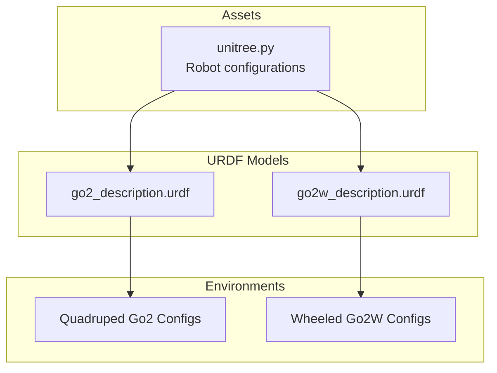
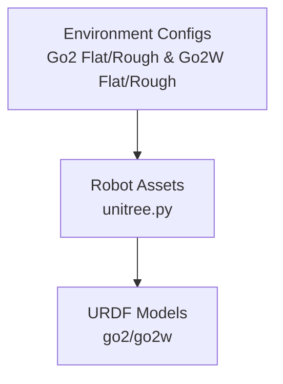
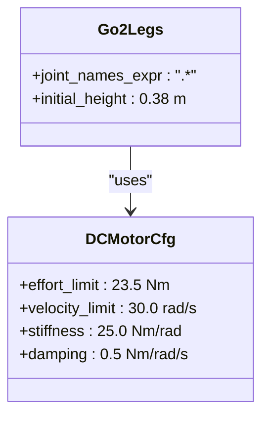
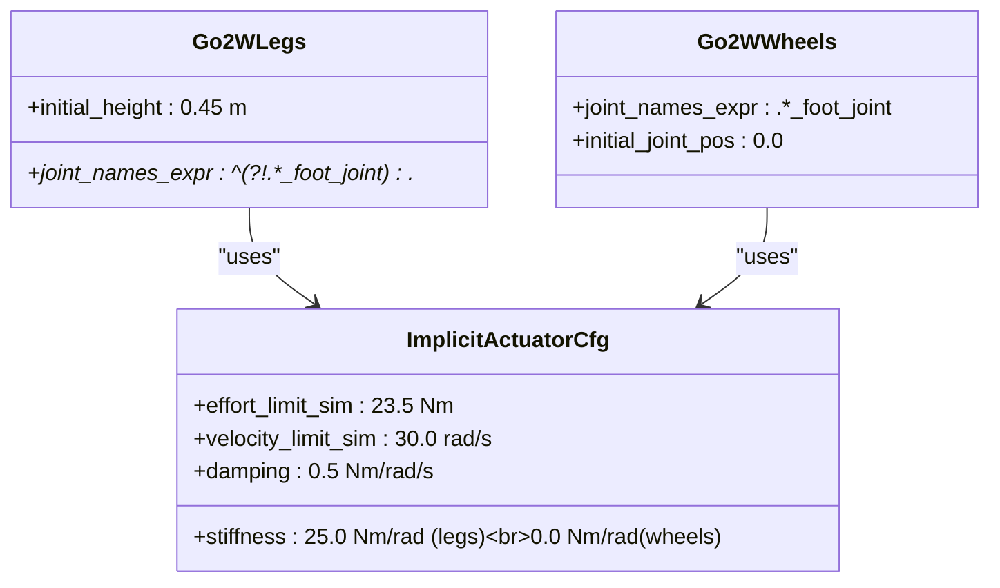
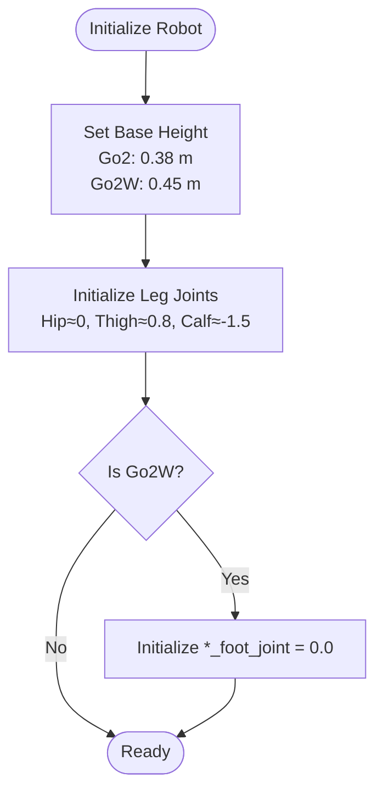
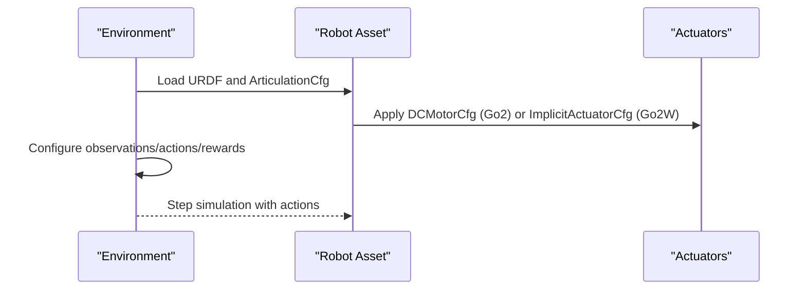
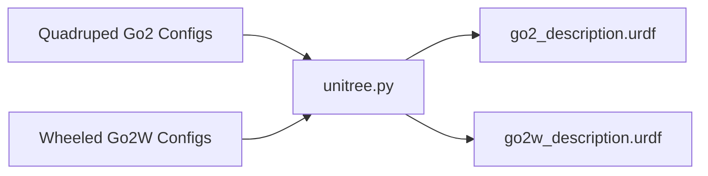

# Unitree Go2 Series

<cite>
**Referenced Files in This Document**
- [README.md](file://README.md)
- [unitree.py](file://source/robot_lab/robot_lab/assets/unitree.py)
- [go2_description.urdf](file://source/robot_lab/data/Robots/unitree/go2_description/urdf/go2_description.urdf)
- [go2w_description.urdf](file://source/robot_lab/data/Robots/unitree/go2w_description/urdf/go2w_description.urdf)
- [flat_env_cfg.py (Go2 Flat)](file://source/robot_lab/robot_lab/tasks/manager_based/locomotion/velocity/config/quadruped/unitree_go2/flat_env_cfg.py)
- [rough_env_cfg.go2](file://source/robot_lab/robot_lab/tasks/manager_based/locomotion/velocity/config/quadruped/unitree_go2/rough_env_cfg.py)
- [flat_env_cfg.py (Go2W Flat)](file://source/robot_lab/robot_lab/tasks/manager_based/locomotion/velocity/config/wheeled/unitree_go2w/flat_env_cfg.py)
- [rough_env_cfg.go2w](file://source/robot_lab/robot_lab/tasks/manager_based/locomotion/velocity/config/wheeled/unitree_go2w/rough_env_cfg.py)
</cite>

## Table of Contents
1. [Introduction](#introduction)
2. [Project Structure](#project-structure)
3. [Core Components](#core-components)
4. [Architecture Overview](#architecture-overview)
5. [Detailed Component Analysis](#detailed-component-analysis)
6. [Dependency Analysis](#dependency-analysis)
7. [Performance Considerations](#performance-considerations)
8. [Troubleshooting Guide](#troubleshooting-guide)
9. [Conclusion](#conclusion)
10. [Appendices](#appendices)

## Introduction
This document provides comprehensive technical documentation for the Unitree Go2 series, covering both the standard quadruped Go2 and the wheeled Go2W variants. It explains motor configurations, actuator distributions, joint setups, initial poses, simulation parameters, and environment configurations used in reinforcement learning tasks. It also compares the two variants and offers selection guidance based on terrain and mobility requirements.

## Project Structure
The repository integrates the Go2 and Go2W robots into the Isaac Lab ecosystem. The robot assets and URDF definitions are located under the data directory, while the robot configurations and environment setups are defined in the assets and task configuration modules.

**Diagram sources**
- [unitree.py](file://source/robot_lab/robot_lab/assets/unitree.py#L71-L177)
- [go2_description.urdf](file://source/robot_lab/data/Robots/unitree/go2_description/urdf/go2_description.urdf#L1-L761)
- [go2w_description.urdf](file://source/robot_lab/data/Robots/unitree/go2w_description/urdf/go2w_description.urdf#L1-L764)
- [rough_env_cfg.go2](file://source/robot_lab/robot_lab/tasks/manager_based/locomotion/velocity/config/quadruped/unitree_go2/rough_env_cfg.py#L18-L38)
- [rough_env_cfg.go2w](file://source/robot_lab/robot_lab/tasks/manager_based/locomotion/velocity/config/wheeled/unitree_go2w/rough_env_cfg.py#L52-L78)

**Section sources**
- [README.md](file://README.md#L18-L31)
- [unitree.py](file://source/robot_lab/robot_lab/assets/unitree.py#L71-L177)

## Core Components
- Robot configurations:
  - Standard Go2: Uses DCMotorCfg for all leg joints.
  - Go2W: Uses ImplicitActuatorCfg for legs and ImplicitActuatorCfg for wheels.
- Simulation parameters:
  - Effort limits, velocity limits, stiffness, and damping are defined per actuator group.
  - Initial heights differ between variants (Go2: 0.38 m; Go2W: 0.45 m).
- Environment configurations:
  - Separate flat and rough environments for both variants.
  - Observation/action scaling and reward shaping tuned for locomotion tasks.

**Section sources**
- [unitree.py](file://source/robot_lab/robot_lab/assets/unitree.py#L107-L116)
- [unitree.py](file://source/robot_lab/robot_lab/assets/unitree.py#L157-L174)
- [rough_env_cfg.go2](file://source/robot_lab/robot_lab/tasks/manager_based/locomotion/velocity/config/quadruped/unitree_go2/rough_env_cfg.py#L18-L38)
- [rough_env_cfg.go2w](file://source/robot_lab/robot_lab/tasks/manager_based/locomotion/velocity/config/wheeled/unitree_go2w/rough_env_cfg.py#L52-L70)

## Architecture Overview
The system architecture connects environment configurations to robot assets and actuators. The environment defines observations, actions, rewards, and terminations, while the assets module provides robot-specific configurations and URDF definitions.

**Diagram sources**
- [rough_env_cfg.go2](file://source/robot_lab/robot_lab/tasks/manager_based/locomotion/velocity/config/quadruped/unitree_go2/rough_env_cfg.py#L34-L35)
- [rough_env_cfg.go2w](file://source/robot_lab/robot_lab/tasks/manager_based/locomotion/velocity/config/wheeled/unitree_go2w/rough_env_cfg.py#L76-L77)
- [unitree.py](file://source/robot_lab/robot_lab/assets/unitree.py#L71-L177)

## Detailed Component Analysis

### DC Motor Configuration (Go2)
- Actuator type: DCMotorCfg applied to all leg joints.
- Limits:
  - Effort limit: 23.5 Nm
  - Velocity limit: 30.0 rad/s
  - Stiffness: 25.0 Nm/rad
  - Damping: 0.5 Nm/rad/s
- Initial pose:
  - Base position Z: 0.38 m
  - Joint positions: hip ~0, thigh ~0.8, calf ~-1.5

**Diagram sources**
- [unitree.py](file://source/robot_lab/robot_lab/assets/unitree.py#L107-L116)

**Section sources**
- [unitree.py](file://source/robot_lab/robot_lab/assets/unitree.py#L107-L116)
- [go2_description.urdf](file://source/robot_lab/data/Robots/unitree/go2_description/urdf/go2_description.urdf#L79-L84)

### Wheeled Actuator Distribution (Go2W)
- Actuator groups:
  - Legs: ImplicitActuatorCfg with identical limits to Go2 motors.
  - Wheels: ImplicitActuatorCfg with zero stiffness and nonzero damping.
- Joint configuration:
  - Foot joints are continuous (rotational) and named *_foot_joint.
- Initial pose:
  - Base position Z: 0.45 m
  - Includes *_foot_joint in initial joint positions.

**Diagram sources**
- [unitree.py](file://source/robot_lab/robot_lab/assets/unitree.py#L157-L174)

**Section sources**
- [unitree.py](file://source/robot_lab/robot_lab/assets/unitree.py#L157-L174)
- [go2w_description.urdf](file://source/robot_lab/data/Robots/unitree/go2w_description/urdf/go2w_description.urdf#L222-L229)
- [go2w_description.urdf](file://source/robot_lab/data/Robots/unitree/go2w_description/urdf/go2w_description.urdf#L392-L398)
- [go2w_description.urdf](file://source/robot_lab/data/Robots/unitree/go2w_description/urdf/go2w_description.urdf#L562-L568)
- [go2w_description.urdf](file://source/robot_lab/data/Robots/unitree/go2w_description/urdf/go2w_description.urdf#L731-L737)

### Joint Configurations and Initial Poses
- Joint naming:
  - Leg joints: FR/FL/RR/RL hip/thigh/calf.
  - Wheel joints: *_foot_joint.
- Initial pose:
  - Go2: Base Z = 0.38 m; leg joints initialized as described.
  - Go2W: Base Z = 0.45 m; includes *_foot_joint initialization.

**Diagram sources**
- [unitree.py](file://source/robot_lab/robot_lab/assets/unitree.py#L94-L104)
- [unitree.py](file://source/robot_lab/robot_lab/assets/unitree.py#L144-L155)

**Section sources**
- [unitree.py](file://source/robot_lab/robot_lab/assets/unitree.py#L94-L104)
- [unitree.py](file://source/robot_lab/robot_lab/assets/unitree.py#L144-L155)

### Simulation Parameters and Environment Setup
- Observation/action scaling and reward shaping are defined per environment.
- Go2:
  - Rewards emphasize velocity tracking and stability; base height target adjusted accordingly.
- Go2W:
  - Separate action channels for leg joint positions and wheel joint velocities.
  - Rewards tailored to minimize wheel torques and accelerations while maintaining locomotion performance.

**Diagram sources**
- [rough_env_cfg.go2](file://source/robot_lab/robot_lab/tasks/manager_based/locomotion/velocity/config/quadruped/unitree_go2/rough_env_cfg.py#L34-L53)
- [rough_env_cfg.go2w](file://source/robot_lab/robot_lab/tasks/manager_based/locomotion/velocity/config/wheeled/unitree_go2w/rough_env_cfg.py#L76-L106)
- [unitree.py](file://source/robot_lab/robot_lab/assets/unitree.py#L71-L177)

**Section sources**
- [flat_env_cfg.go2](file://source/robot_lab/robot_lab/tasks/manager_based/locomotion/velocity/config/quadruped/unitree_go2/flat_env_cfg.py#L10-L25)
- [rough_env_cfg.go2](file://source/robot_lab/robot_lab/tasks/manager_based/locomotion/velocity/config/quadruped/unitree_go2/rough_env_cfg.py#L30-L80)
- [flat_env_cfg.go2w](file://source/robot_lab/robot_lab/tasks/manager_based/locomotion/velocity/config/wheeled/unitree_go2w/flat_env_cfg.py#L9-L25)
- [rough_env_cfg.go2w](file://source/robot_lab/robot_lab/tasks/manager_based/locomotion/velocity/config/wheeled/unitree_go2w/rough_env_cfg.py#L72-L133)

## Dependency Analysis
- Environment configurations depend on robot assets for spawning and actuator definitions.
- Go2W introduces a dual-actuator strategy: implicit actuators for legs and wheels, altering dynamics compared to pure DC motors.

**Diagram sources**
- [rough_env_cfg.go2](file://source/robot_lab/robot_lab/tasks/manager_based/locomotion/velocity/config/quadruped/unitree_go2/rough_env_cfg.py#L34-L35)
- [rough_env_cfg.go2w](file://source/robot_lab/robot_lab/tasks/manager_based/locomotion/velocity/config/wheeled/unitree_go2w/rough_env_cfg.py#L76-L77)
- [unitree.py](file://source/robot_lab/robot_lab/assets/unitree.py#L71-L177)

**Section sources**
- [rough_env_cfg.go2](file://source/robot_lab/robot_lab/tasks/manager_based/locomotion/velocity/config/quadruped/unitree_go2/rough_env_cfg.py#L34-L35)
- [rough_env_cfg.go2w](file://source/robot_lab/robot_lab/tasks/manager_based/locomotion/velocity/config/wheeled/unitree_go2w/rough_env_cfg.py#L76-L77)

## Performance Considerations
- Motor limits:
  - Both variants share identical effort/velocity/stiffness/damping limits for comparable torque and speed capabilities.
- Height differences:
  - Go2W’s higher center of mass (0.45 m vs 0.38 m) affects stability and energy consumption; reward targets and penalties reflect this.
- Actuator modeling:
  - Go2W’s wheels use implicit actuators with zero stiffness, emphasizing compliant rolling contact and reduced control complexity for wheel joints.

[No sources needed since this section provides general guidance]

## Troubleshooting Guide
- Validation of motor limits:
  - Confirm effort and velocity limits match expectations for both Go2 and Go2W actuators.
- Initial pose issues:
  - Ensure base height and joint positions align with configuration files for the chosen variant.
- Environment mismatch:
  - Verify the environment registration and configuration correspond to the intended variant (Go2 vs Go2W).

**Section sources**
- [unitree.py](file://source/robot_lab/robot_lab/assets/unitree.py#L107-L116)
- [unitree.py](file://source/robot_lab/robot_lab/assets/unitree.py#L157-L174)
- [rough_env_cfg.go2](file://source/robot_lab/robot_lab/tasks/manager_based/locomotion/velocity/config/quadruped/unitree_go2/rough_env_cfg.py#L34-L35)
- [rough_env_cfg.go2w](file://source/robot_lab/robot_lab/tasks/manager_based/locomotion/velocity/config/wheeled/unitree_go2w/rough_env_cfg.py#L76-L77)

## Conclusion
The Unitree Go2 series integrates seamlessly with the Isaac Lab RL framework. Go2 relies on DC motors across all joints, while Go2W employs implicit actuators for legs and wheels, reflecting distinct locomotion strategies. The documented configurations, limits, and environment parameters enable reproducible simulations and informed selection between variants depending on terrain and mobility requirements.

## Appendices

### Selection Guidance: Go2 vs Go2W
- Choose Go2 when:
  - Terrain requires robust foothold adaptability and dynamic balance.
  - Emphasis on bipedal-like legged locomotion with articulated feet.
- Choose Go2W when:
  - Smooth, efficient transport on relatively flat surfaces is prioritized.
  - Reduced actuator count for wheels lowers control complexity and power consumption.
- Comparison highlights:
  - Effort/velocity/stiffness/damping limits are consistent between variants for fair comparisons.
  - Go2W’s higher center of mass improves ground clearance but may increase overturning risk on uneven terrain.

[No sources needed since this section provides general guidance]