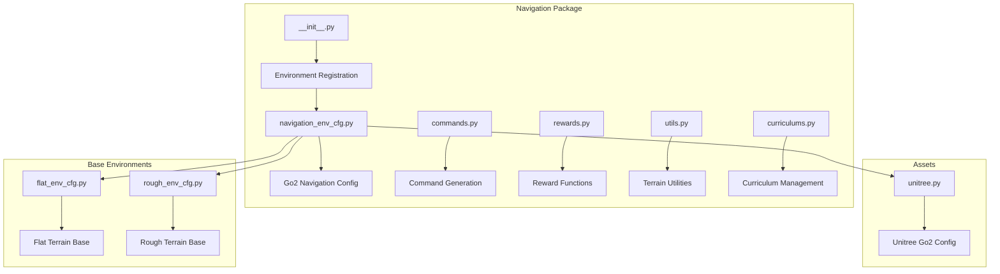
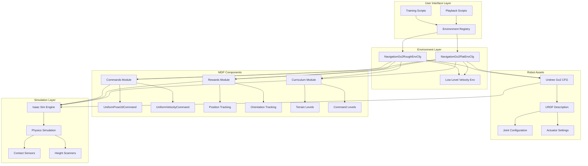
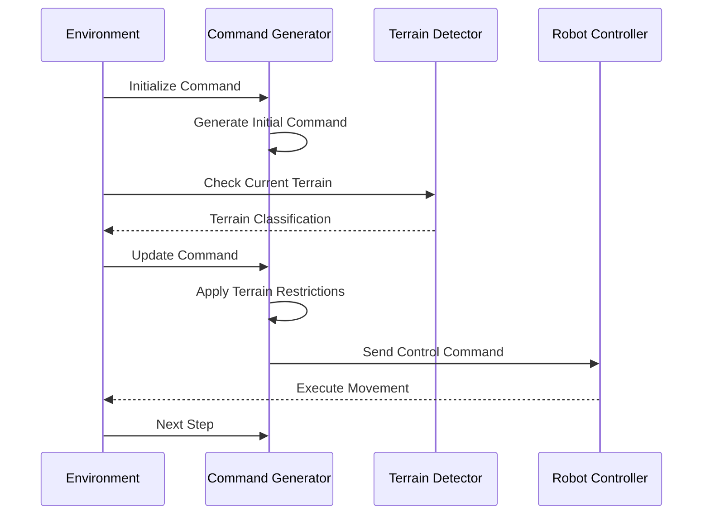
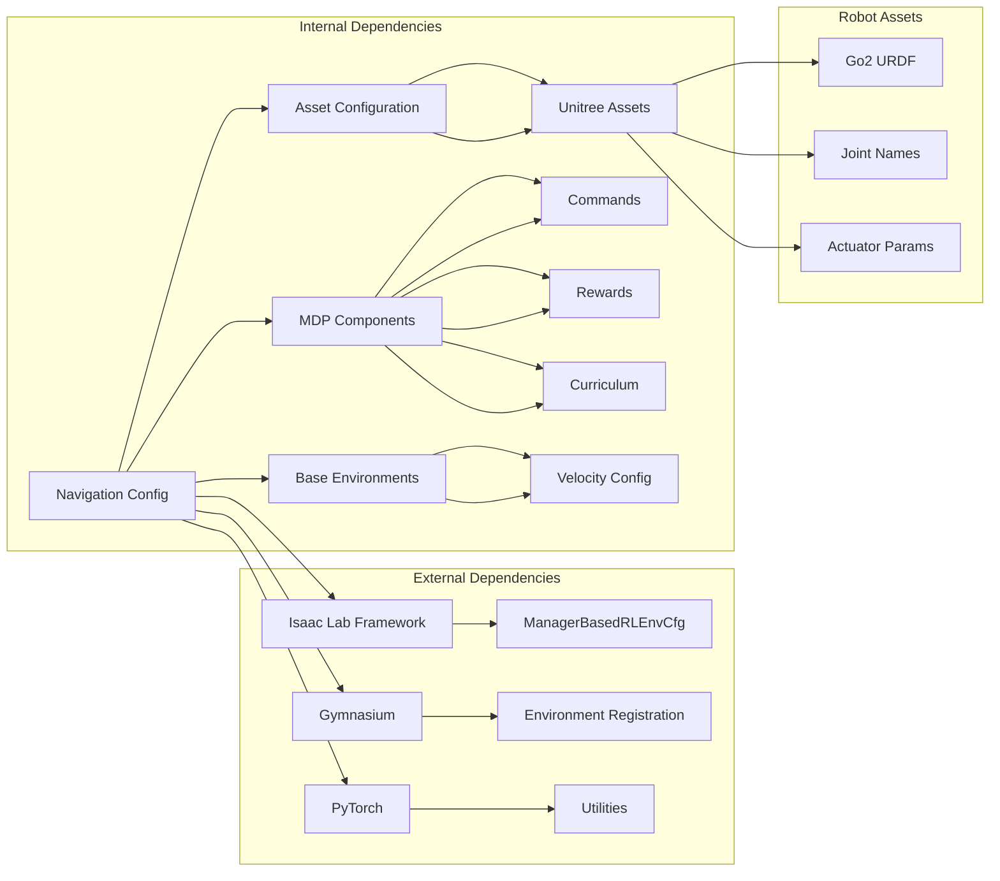

# Unitree Go2 Navigation

<cite>
**Referenced Files in This Document**
- [README.md](file://README.md)
- [navigation_env_cfg.py](file://source/robot_lab/robot_lab/tasks/manager_based/navigation/config/go2/navigation_env_cfg.py)
- [unitree.py](file://source/robot_lab/robot_lab/assets/unitree.py)
- [commands.py](file://source/robot_lab/robot_lab/tasks/manager_based/navigation/mdp/commands.py)
- [rewards.py](file://source/robot_lab/robot_lab/tasks/manager_based/navigation/mdp/rewards.py)
- [utils.py](file://source/robot_lab/robot_lab/tasks/manager_based/navigation/mdp/utils.py)
- [curriculums.py](file://source/robot_lab/robot_lab/tasks/manager_based/navigation/mdp/curriculums.py)
- [__init__.py](file://source/robot_lab/robot_lab/tasks/manager_based/navigation/config/go2/__init__.py)
- [flat_env_cfg.py](file://source/robot_lab/robot_lab/tasks/manager_based/locomotion/velocity/config/quadruped/unitree_go2/flat_env_cfg.py)
- [rough_env_cfg.py](file://source/robot_lab/robot_lab/tasks/manager_based/locomotion/velocity/config/quadruped/unitree_go2/rough_env_cfg.py)
</cite>

## Table of Contents
1. [Introduction](#introduction)
2. [Project Structure](#project-structure)
3. [Core Components](#core-components)
4. [Architecture Overview](#architecture-overview)
5. [Detailed Component Analysis](#detailed-component-analysis)
6. [Dependency Analysis](#dependency-analysis)
7. [Performance Considerations](#performance-considerations)
8. [Troubleshooting Guide](#troubleshooting-guide)
9. [Conclusion](#conclusion)

## Introduction
This document provides a comprehensive analysis of the Unitree Go2 navigation system within the robot_lab repository. The navigation module enables reinforcement learning-based navigation for the Unitree Go2 quadruped robot in both flat and rough terrains. The system integrates with Isaac Lab's Manager-Based Reinforcement Learning framework and leverages modular MDP components for commands, rewards, and curriculum management.

Key capabilities include:
- Pose-based navigation with SE(2) command generation
- Terrain-aware navigation with curriculum progression
- Modular reward engineering for position and orientation tracking
- Support for both flat and rough terrain environments
- Integration with pre-trained policies for hierarchical control

## Project Structure
The navigation system is organized within the robot_lab repository under the manager-based navigation framework. The structure follows a modular design with clear separation of concerns:

**Diagram sources**
- [navigation_env_cfg.py:1-875](file://source/robot_lab/robot_lab/tasks/manager_based/navigation/config/go2/navigation_env_cfg.py#L1-L875)
- [unitree.py:71-117](file://source/robot_lab/robot_lab/assets/unitree.py#L71-L117)

**Section sources**
- [README.md:15-42](file://README.md#L15-L42)
- [navigation_env_cfg.py:1-875](file://source/robot_lab/robot_lab/tasks/manager_based/navigation/config/go2/navigation_env_cfg.py#L1-L875)

## Core Components
The navigation system consists of several interconnected components that work together to enable robust quadruped navigation:

### Environment Configuration
The NavigationGo2RoughEnvCfg serves as the primary configuration class, inheriting from the ManagerBasedRLEnvCfg and implementing comprehensive environment settings for Unitree Go2 navigation.

### Command Management
The system implements sophisticated command generation through UniformPose2dCommandCfg and UniformVelocityCommandCfg, supporting both pose-based navigation and velocity-based locomotion.

### Reward Engineering
Custom reward functions provide specialized navigation performance measurement, including position tracking with tanh kernels and orientation error penalties.

### Terrain Awareness
Advanced terrain detection utilities enable robots to adapt behavior based on ground conditions, particularly useful for navigating challenging terrains.

**Section sources**
- [navigation_env_cfg.py:644-875](file://source/robot_lab/robot_lab/tasks/manager_based/navigation/config/go2/navigation_env_cfg.py#L644-L875)
- [commands.py:31-98](file://source/robot_lab/robot_lab/tasks/manager_based/navigation/mdp/commands.py#L31-L98)
- [rewards.py:15-28](file://source/robot_lab/robot_lab/tasks/manager_based/navigation/mdp/rewards.py#L15-L28)

## Architecture Overview
The navigation architecture follows a layered approach with clear separation between environment configuration, MDP components, and robot assets:

**Diagram sources**
- [navigation_env_cfg.py:27-875](file://source/robot_lab/robot_lab/tasks/manager_based/navigation/config/go2/navigation_env_cfg.py#L27-L875)
- [unitree.py:71-117](file://source/robot_lab/robot_lab/assets/unitree.py#L71-L117)

## Detailed Component Analysis

### Navigation Environment Configuration
The NavigationGo2RoughEnvCfg implements a comprehensive environment configuration with carefully tuned parameters for stable quadruped navigation:

#### Key Configuration Elements
- **Robot Definition**: Uses UNITREE_GO2_CFG with precise joint naming patterns
- **Observation Scaling**: Optimized scaling factors for different observation types
- **Action Constraints**: Hierarchical scaling based on joint categories (hip vs non-hip joints)
- **Event Randomization**: Comprehensive randomization for robust policy generalization

#### Environment Post-Initialization
The __post_init__ method establishes critical simulation parameters:
- Physics timestep: 0.005 seconds
- Decimation factor: 4 for computational efficiency
- Episode duration: 20.0 seconds
- GPU patch count: 10 × 2^15 for large-scale simulations

**Section sources**
- [navigation_env_cfg.py:644-730](file://source/robot_lab/robot_lab/tasks/manager_based/navigation/config/go2/navigation_env_cfg.py#L644-L730)
- [navigation_env_cfg.py:691-710](file://source/robot_lab/robot_lab/tasks/manager_based/navigation/config/go2/navigation_env_cfg.py#L691-L710)

### Command Generation System
The command system provides flexible navigation control through multiple command types:

#### Pose-Based Commands
UniformPose2dCommandCfg generates 2D pose commands with configurable ranges and resampling intervals, enabling precise position control in navigation tasks.

#### Velocity-Based Commands
UniformVelocityCommandCfg supports SE(2) velocity commands with optional heading control, allowing for dynamic locomotion patterns.

#### Terrain-Aware Adaptation
The UniformThresholdVelocityCommand extends basic velocity commands with terrain-aware restrictions, particularly useful for navigating challenging terrains like pits.

**Diagram sources**
- [commands.py:53-97](file://source/robot_lab/robot_lab/tasks/manager_based/navigation/mdp/commands.py#L53-L97)

**Section sources**
- [commands.py:31-98](file://source/robot_lab/robot_lab/tasks/manager_based/navigation/mdp/commands.py#L31-L98)

### Reward Function Architecture
The reward system implements specialized navigation performance metrics:

#### Position Tracking Rewards
position_command_error_tanh provides smooth position tracking with tanh kernel, offering better gradient behavior than traditional quadratic penalties.

#### Orientation Control
heading_command_error_abs penalizes orientation tracking errors, maintaining stability during navigation tasks.

#### Locomotion Integration
The system integrates with locomotion-specific rewards through inheritance from velocity MDP components, ensuring coherent behavior across navigation and movement tasks.

**Section sources**
- [rewards.py:15-28](file://source/robot_lab/robot_lab/tasks/manager_based/navigation/mdp/rewards.py#L15-L28)
- [navigation_env_cfg.py:296-311](file://source/robot_lab/robot_lab/tasks/manager_based/navigation/config/go2/navigation_env_cfg.py#L296-L311)

### Terrain Awareness System
Advanced utilities enable robots to detect and respond to terrain characteristics:

#### Terrain Detection
is_robot_on_terrain identifies which terrain type a robot is currently standing on by analyzing terrain grid cell assignments.

#### Column Range Calculation
_get_terrain_column_range computes appropriate column ranges for different terrain types within the terrain generator configuration.

#### Dynamic Adaptation
The system supports dynamic adaptation of robot behavior based on detected terrain conditions, enabling robust navigation across diverse environments.

**Section sources**
- [utils.py:73-128](file://source/robot_lab/robot_lab/tasks/manager_based/navigation/mdp/utils.py#L73-L128)

### Curriculum Management
The curriculum system provides adaptive difficulty progression:

#### Terrain Level Progression
terrain_levels_vel increases terrain difficulty when robots demonstrate sufficient locomotion capability, measured by traveled distance.

#### Command Range Adaptation
command_levels_lin_vel and command_levels_ang_vel adjust command ranges based on achieved tracking performance, gradually increasing navigation challenge.

#### Performance-Based Scaling
The curriculum system uses performance metrics to dynamically adjust task difficulty, ensuring optimal learning progression.

**Section sources**
- [curriculums.py:144-175](file://source/robot_lab/robot_lab/tasks/manager_based/navigation/mdp/curriculums.py#L144-L175)

## Dependency Analysis
The navigation system exhibits well-managed dependencies that support modularity and maintainability:

**Diagram sources**
- [navigation_env_cfg.py:20-26](file://source/robot_lab/robot_lab/tasks/manager_based/navigation/config/go2/navigation_env_cfg.py#L20-L26)
- [unitree.py:71-117](file://source/robot_lab/robot_lab/assets/unitree.py#L71-L117)

**Section sources**
- [navigation_env_cfg.py:20-26](file://source/robot_lab/robot_lab/tasks/manager_based/navigation/config/go2/navigation_env_cfg.py#L20-L26)
- [__init__.py:14-34](file://source/robot_lab/robot_lab/tasks/manager_based/navigation/config/go2/__init__.py#L14-L34)

## Performance Considerations
The navigation system incorporates several performance optimization strategies:

### Computational Efficiency
- **Hierarchical Scaling**: Different action scales for hip vs non-hip joints reduce computational overhead
- **Optimized Observation Processing**: Carefully tuned observation scaling improves training stability
- **Efficient Terrain Detection**: Vectorized terrain checking operations minimize computational cost

### Memory Management
- **Modular Design**: Separate modules enable selective loading and reduced memory footprint
- **Configurable Complexity**: Environment configurations can be adjusted for different computational requirements

### Training Stability
- **Reward Engineering**: Smooth reward functions and appropriate scaling improve training convergence
- **Curriculum Progression**: Gradual difficulty increase prevents training instability

## Troubleshooting Guide

### Common Issues and Solutions

#### Environment Registration Problems
Ensure proper environment registration in the __init__.py file. Verify that environment IDs match the expected naming convention and that all required dependencies are properly imported.

#### Asset Loading Failures
Verify that URDF files are accessible and properly formatted. Check joint naming consistency with the configuration parameters.

#### Training Instability
Monitor reward scaling and observation normalization. Adjust reward weights and observation scaling factors if training becomes unstable.

#### Performance Degradation
Check GPU memory usage and adjust batch sizes or environment counts accordingly. Monitor physics simulation parameters for optimal performance.

**Section sources**
- [__init__.py:14-34](file://source/robot_lab/robot_lab/tasks/manager_based/navigation/config/go2/__init__.py#L14-L34)
- [navigation_env_cfg.py:678-684](file://source/robot_lab/robot_lab/tasks/manager_based/navigation/config/go2/navigation_env_cfg.py#L678-L684)

## Conclusion
The Unitree Go2 navigation system represents a sophisticated implementation of reinforcement learning-based quadruped navigation within the robot_lab framework. The system demonstrates excellent modularity, with clear separation between environment configuration, MDP components, and robot assets. Key strengths include:

- **Comprehensive Environment Design**: Well-tuned simulation parameters and observation scaling
- **Flexible Command System**: Multiple command generation approaches supporting different navigation scenarios
- **Terrain Awareness**: Advanced utilities for terrain detection and adaptation
- **Performance Optimization**: Careful reward engineering and computational efficiency measures
- **Extensible Architecture**: Modular design enabling easy customization and extension

The system provides a solid foundation for advanced quadruped navigation research and development, with clear pathways for extending functionality and adapting to new robot platforms.