# Unitree Go2 Series

<cite>
**Referenced Files in This Document**
- [README.md](file://README.md)
- [unitree.py](file://source/robot_lab/robot_lab/assets/unitree.py)
- [go2_description.urdf](file://source/robot_lab/data/Robots/unitree/go2_description/urdf/go2_description.urdf)
- [go2w_description.urdf](file://source/robot_lab/data/Robots/unitree/go2w_description/urdf/go2w_description.urdf)
- [flat_env_cfg.py (Go2 Flat)](file://source/robot_lab/robot_lab/tasks/manager_based/locomotion/velocity/config/quadruped/unitree_go2/flat_env_cfg.py)
- [rough_env_cfg.go2](file://source/robot_lab/robot_lab/tasks/manager_based/locomotion/velocity/config/quadruped/unitree_go2/rough_env_cfg.py)
- [flat_env_cfg.py (Go2W Flat)](file://source/robot_lab/robot_lab/tasks/manager_based/locomotion/velocity/config/wheeled/unitree_go2w/flat_env_cfg.py)
- [rough_env_cfg.go2w](file://source/robot_lab/robot_lab/tasks/manager_based/locomotion/velocity/config/wheeled/unitree_go2w/rough_env_cfg.py)
- [actor_critic_scan.py](file://source/robot_lab/robot_lab/tasks/manager_based/locomotion/velocity/config/quadruped/unitree_go2_parkour/agents/actor_critic_scan.py)
- [rsl_rl_ppo_cfg.py](file://source/robot_lab/robot_lab/tasks/manager_based/locomotion/velocity/config/quadruped/unitree_go2_parkour/agents/rsl_rl_ppo_cfg.py)
- [observations.py](file://source/robot_lab/robot_lab/tasks/manager_based/locomotion/velocity/config/quadruped/unitree_go2_parkour/mdp/observations.py)
- [rewards.py](file://source/robot_lab/robot_lab/tasks/manager_based/locomotion/velocity/config/quadruped/unitree_go2_parkour/mdp/rewards.py)
- [terrains_cfg.py](file://source/robot_lab/robot_lab/tasks/manager_based/locomotion/velocity/config/quadruped/unitree_go2_parkour/terrains_cfg.py)
- [mesh_terrains.py](file://source/robot_lab/robot_lab/tasks/manager_based/locomotion/velocity/config/quadruped/unitree_go2_parkour/mesh_terrains.py)
- [utils.py](file://source/robot_lab/robot_lab/tasks/manager_based/locomotion/velocity/config/quadruped/unitree_go2_parkour/utils.py)
- [navigation_env_cfg.py (Go2 Navigation)](file://source/robot_lab/robot_lab/tasks/manager_based/navigation/config/go2/navigation_env_cfg.py)
- [rsl_rl_ppo_cfg.py (Go2 Navigation Agents)](file://source/robot_lab/robot_lab/tasks/manager_based/navigation/config/go2/agents/rsl_rl_ppo_cfg.py)
- [skrl_flat_ppo_cfg.yaml (Go2 Navigation Agents)](file://source/robot_lab/robot_lab/tasks/manager_based/navigation/config/go2/agents/skrl_flat_ppo_cfg.yaml)
- [rewards.py (Navigation MDP)](file://source/robot_lab/robot_lab/tasks/manager_based/navigation/mdp/rewards.py)
- [commands.py (Navigation MDP)](file://source/robot_lab/robot_lab/tasks/manager_based/navigation/mdp/commands.py)
- [curriculums.py (Navigation MDP)](file://source/robot_lab/robot_lab/tasks/manager_based/navigation/mdp/curriculums.py)
</cite>

## Update Summary
**Changes Made**
- Added comprehensive navigation training capabilities for Unitree Go2 robots
- Integrated navigation environments with pose command tracking and terrain curriculum support
- Added specialized navigation reward functions and command generators
- Included navigation-specific agent configurations for both rough and flat terrains
- Enhanced documentation with navigation training system architecture and capabilities

## Table of Contents
1. [Introduction](#introduction)
2. [Project Structure](#project-structure)
3. [Core Components](#core-components)
4. [Architecture Overview](#architecture-overview)
5. [Detailed Component Analysis](#detailed-component-analysis)
6. [Go2 Parkour Training System](#go2-parkour-training-system)
7. [Enhanced Terrain Curriculum System](#enhanced-terrain-curriculum-system)
8. [Improved Observation System](#improved-observation-system)
9. [Navigation Training Capabilities](#navigation-training-capabilities)
10. [Navigation Environment Configuration](#navigation-environment-configuration)
11. [Navigation Reward System](#navigation-reward-system)
12. [Navigation Agent Configurations](#navigation-agent-configurations)
13. [Dependency Analysis](#dependency-analysis)
14. [Performance Considerations](#performance-considerations)
15. [Troubleshooting Guide](#troubleshooting-guide)
16. [Conclusion](#conclusion)
17. [Appendices](#appendices)

## Introduction
This document provides comprehensive technical documentation for the Unitree Go2 series, covering both the standard quadruped Go2 and the wheeled Go2W variants. It explains motor configurations, actuator distributions, joint setups, initial poses, simulation parameters, and environment configurations used in reinforcement learning tasks. The document now includes the newly enhanced Go2 parkour training system with advanced neural network architecture, terrain-level curriculum support, and improved observation system documentation with detailed dimensional characteristics. Additionally, it covers the newly added navigation training capabilities that enable pose command tracking and terrain navigation with curriculum support. The document compares the two variants and offers selection guidance based on terrain and mobility requirements.

## Project Structure
The repository integrates the Go2 and Go2W robots into the Isaac Lab ecosystem. The robot assets and URDF definitions are located under the data directory, while the robot configurations and environment setups are defined in the assets and task configuration modules. The enhanced Go2 parkour system is organized as a self-contained package with custom RL configuration, advanced neural network architecture, and comprehensive terrain generation capabilities with curriculum support. The newly added navigation training system provides pose command tracking capabilities with terrain-level curriculum support.

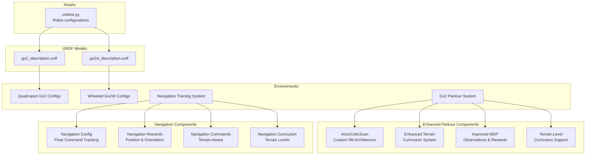

**Diagram sources**
- [unitree.py:71-177](file://source/robot_lab/robot_lab/assets/unitree.py#L71-L177)
- [go2_description.urdf:1-761](file://source/robot_lab/data/Robots/unitree/go2_description/urdf/go2_description.urdf#L1-L761)
- [go2w_description.urdf:1-764](file://source/robot_lab/data/Robots/unitree/go2w_description/urdf/go2w_description.urdf#L1-L764)
- [actor_critic_scan.py:20-133](file://source/robot_lab/robot_lab/tasks/manager_based/locomotion/velocity/config/quadruped/unitree_go2_parkour/agents/actor_critic_scan.py#L20-L133)
- [terrains_cfg.py:22-384](file://source/robot_lab/robot_lab/tasks/manager_based/locomotion/velocity/config/quadruped/unitree_go2_parkour/terrains_cfg.py#L22-L384)
- [navigation_env_cfg.go2:644-875](file://source/robot_lab/robot_lab/tasks/manager_based/navigation/config/go2/navigation_env_cfg.py#L644-L875)

**Section sources**
- [README.md:18-31](file://README.md#L18-L31)
- [unitree.py:71-177](file://source/robot_lab/robot_lab/assets/unitree.py#L71-L177)

## Core Components
- Robot configurations:
  - Standard Go2: Uses DCMotorCfg for all leg joints.
  - Go2W: Uses ImplicitActuatorCfg for legs and ImplicitActuatorCfg for wheels.
- Simulation parameters:
  - Effort limits, velocity limits, stiffness, and damping are defined per actuator group.
  - Initial heights differ between variants (Go2: 0.38 m; Go2W: 0.45 m).
- Environment configurations:
  - Separate flat and rough environments for both variants.
  - Observation/action scaling and reward shaping tuned for locomotion tasks.
- **Enhanced**: Go2 Parkour System:
  - Custom ActorCriticScan neural network with scan and privileged observation encoders.
  - Advanced terrain generation with 15+ different terrain types and curriculum-based difficulty progression.
  - Specialized MDP observations and rewards for parkour training with detailed dimensional characteristics.
  - Enhanced curriculum parameter specifications for terrain generation.
- **New**: Navigation Training System:
  - Pose command tracking with position and orientation error minimization.
  - Terrain-level curriculum support for progressive navigation difficulty.
  - Specialized reward functions for navigation tasks with curriculum adaptation.
  - Terrain-aware command generators with pit terrain restrictions.

**Section sources**
- [unitree.py:107-116](file://source/robot_lab/robot_lab/assets/unitree.py#L107-L116)
- [unitree.py:157-174](file://source/robot_lab/robot_lab/assets/unitree.py#L157-L174)
- [actor_critic_scan.py:20-133](file://source/robot_lab/robot_lab/tasks/manager_based/locomotion/velocity/config/quadruped/unitree_go2_parkour/agents/actor_critic_scan.py#L20-L133)
- [terrains_cfg.py:22-384](file://source/robot_lab/robot_lab/tasks/manager_based/locomotion/velocity/config/quadruped/unitree_go2_parkour/terrains_cfg.py#L22-L384)
- [navigation_env_cfg.go2:644-875](file://source/robot_lab/robot_lab/tasks/manager_based/navigation/config/go2/navigation_env_cfg.py#L644-L875)

## Architecture Overview
The system architecture connects environment configurations to robot assets and actuators. The environment defines observations, actions, rewards, and terminations, while the assets module provides robot-specific configurations and URDF definitions. The enhanced Go2 parkour system introduces a self-contained package with custom RL configuration, advanced neural network architecture, and comprehensive terrain generation capabilities with curriculum support. The newly added navigation training system provides pose command tracking capabilities with terrain-level curriculum support and specialized reward functions.

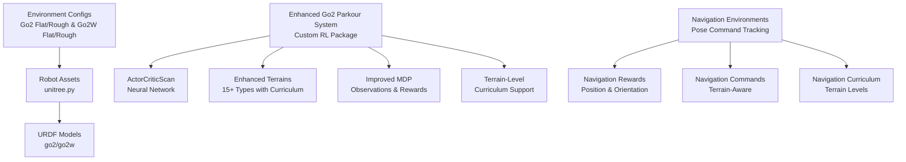

**Diagram sources**
- [rough_env_cfg.go2:34-35](file://source/robot_lab/robot_lab/tasks/manager_based/locomotion/velocity/config/quadruped/unitree_go2/rough_env_cfg.py#L34-L35)
- [rough_env_cfg.go2w:76-77](file://source/robot_lab/robot_lab/tasks/manager_based/locomotion/velocity/config/wheeled/unitree_go2w/rough_env_cfg.py#L76-L77)
- [unitree.py:71-177](file://source/robot_lab/robot_lab/assets/unitree.py#L71-L177)
- [rsl_rl_ppo_cfg.go2_parkour:128-193](file://source/robot_lab/robot_lab/tasks/manager_based/locomotion/velocity/config/quadruped/unitree_go2_parkour/agents/rsl_rl_ppo_cfg.py#L128-L193)
- [navigation_env_cfg.go2:644-875](file://source/robot_lab/robot_lab/tasks/manager_based/navigation/config/go2/navigation_env_cfg.py#L644-L875)

## Detailed Component Analysis

### DC Motor Configuration (Go2)
- Actuator type: DCMotorCfg applied to all leg joints.
- Limits:
  - Effort limit: 23.5 Nm
  - Velocity limit: 30.0 rad/s
  - Stiffness: 25.0 Nm/rad
  - Damping: 0.5 Nm/rad/s
- Initial pose:
  - Base position Z: 0.38 m
  - Joint positions: hip ~0, thigh ~0.8, calf ~-1.5

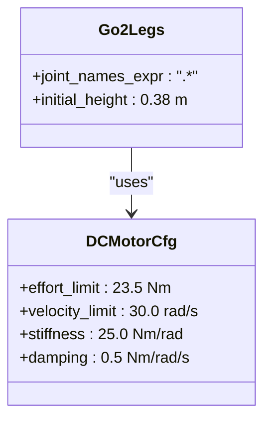

**Diagram sources**
- [unitree.py:107-116](file://source/robot_lab/robot_lab/assets/unitree.py#L107-L116)

**Section sources**
- [unitree.py:107-116](file://source/robot_lab/robot_lab/assets/unitree.py#L107-L116)
- [go2_description.urdf:79-84](file://source/robot_lab/data/Robots/unitree/go2_description/urdf/go2_description.urdf#L79-L84)

### Wheeled Actuator Distribution (Go2W)
- Actuator groups:
  - Legs: ImplicitActuatorCfg with identical limits to Go2 motors.
  - Wheels: ImplicitActuatorCfg with zero stiffness and nonzero damping.
- Joint configuration:
  - Foot joints are continuous (rotational) and named *_foot_joint.
- Initial pose:
  - Base position Z: 0.45 m
  - Includes *_foot_joint in initial joint positions.

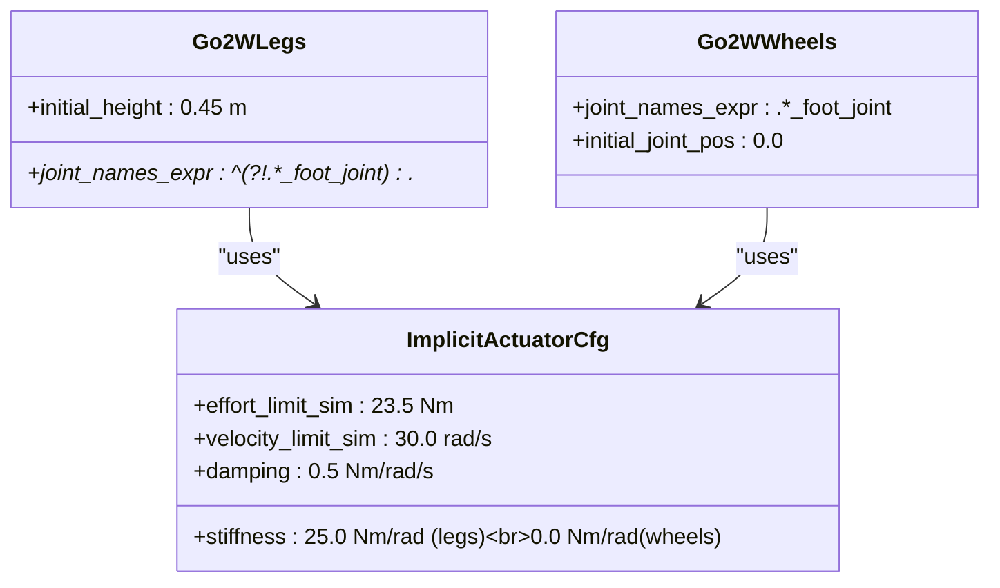

**Diagram sources**
- [unitree.py:157-174](file://source/robot_lab/robot_lab/assets/unitree.py#L157-L174)

**Section sources**
- [unitree.py:157-174](file://source/robot_lab/robot_lab/assets/unitree.py#L157-L174)
- [go2w_description.urdf:222-229](file://source/robot_lab/data/Robots/unitree/go2w_description/urdf/go2w_description.urdf#L222-L229)
- [go2w_description.urdf:392-398](file://source/robot_lab/data/Robots/unitree/go2w_description/urdf/go2w_description.urdf#L392-L398)
- [go2w_description.urdf:562-568](file://source/robot_lab/data/Robots/unitree/go2w_description/urdf/go2w_description.urdf#L562-L568)
- [go2w_description.urdf:731-737](file://source/robot_lab/data/Robots/unitree/go2w_description/urdf/go2w_description.urdf#L731-L737)

### Joint Configurations and Initial Poses
- Joint naming:
  - Leg joints: FR/FL/RR/RL hip/thigh/calf.
  - Wheel joints: *_foot_joint.
- Initial pose:
  - Go2: Base Z = 0.38 m; leg joints initialized as described.
  - Go2W: Base Z = 0.45 m; includes *_foot_joint initialization.

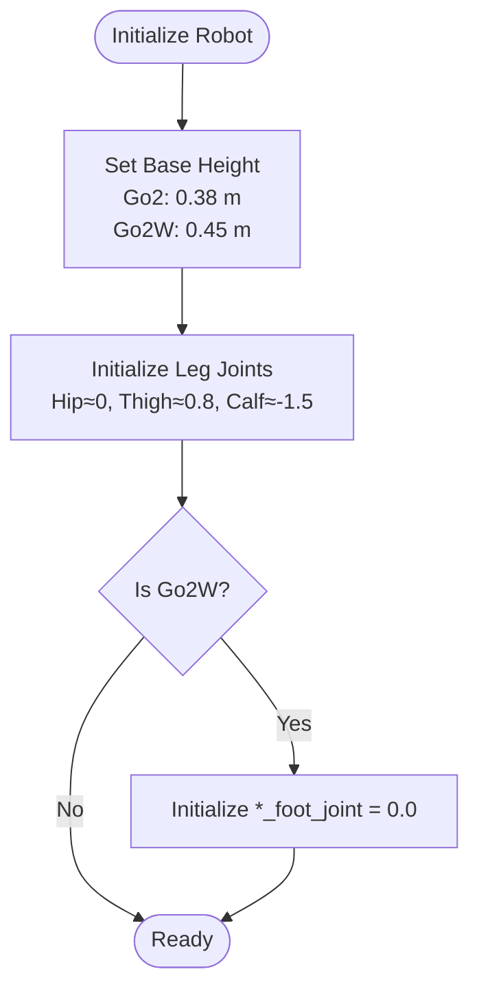

**Diagram sources**
- [unitree.py:94-104](file://source/robot_lab/robot_lab/assets/unitree.py#L94-L104)
- [unitree.py:144-155](file://source/robot_lab/robot_lab/assets/unitree.py#L144-L155)

**Section sources**
- [unitree.py:94-104](file://source/robot_lab/robot_lab/assets/unitree.py#L94-L104)
- [unitree.py:144-155](file://source/robot_lab/robot_lab/assets/unitree.py#L144-L155)

### Simulation Parameters and Environment Setup
- Observation/action scaling and reward shaping are defined per environment.
- Go2:
  - Rewards emphasize velocity tracking and stability; base height target adjusted accordingly.
- Go2W:
  - Separate action channels for leg joint positions and wheel joint velocities.
  - Rewards tailored to minimize wheel torques and accelerations while maintaining locomotion performance.

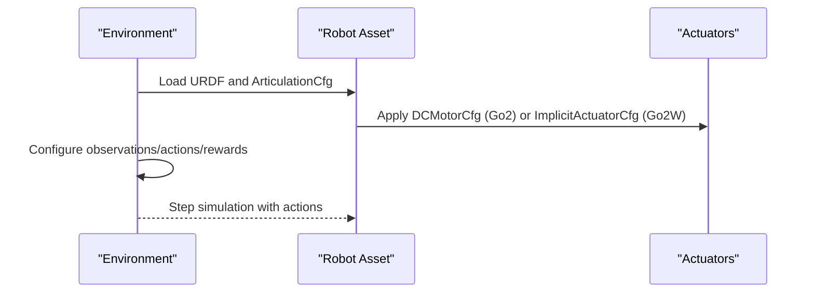

**Diagram sources**
- [rough_env_cfg.go2:34-53](file://source/robot_lab/robot_lab/tasks/manager_based/locomotion/velocity/config/quadruped/unitree_go2/rough_env_cfg.py#L34-L53)
- [rough_env_cfg.go2w:76-106](file://source/robot_lab/robot_lab/tasks/manager_based/locomotion/velocity/config/wheeled/unitree_go2w/rough_env_cfg.py#L76-L106)
- [unitree.py:71-177](file://source/robot_lab/robot_lab/assets/unitree.py#L71-L177)

**Section sources**
- [flat_env_cfg.go2:10-25](file://source/robot_lab/robot_lab/tasks/manager_based/locomotion/velocity/config/quadruped/unitree_go2/flat_env_cfg.py#L10-L25)
- [rough_env_cfg.go2:30-80](file://source/robot_lab/robot_lab/tasks/manager_based/locomotion/velocity/config/quadruped/unitree_go2/rough_env_cfg.py#L30-L80)
- [flat_env_cfg.go2w:9-25](file://source/robot_lab/robot_lab/tasks/manager_based/locomotion/velocity/config/wheeled/unitree_go2w/flat_env_cfg.py#L9-L25)
- [rough_env_cfg.go2w:72-133](file://source/robot_lab/robot_lab/tasks/manager_based/locomotion/velocity/config/wheeled/unitree_go2w/rough_env_cfg.py#L72-L133)

## Go2 Parkour Training System

### Enhanced Neural Network Architecture
The Go2 parkour system introduces a sophisticated custom neural network architecture called ActorCriticScan, designed specifically for complex parkour locomotion tasks with enhanced observation processing capabilities.

**Updated** Enhanced with improved observation dimension handling and curriculum-aware architecture

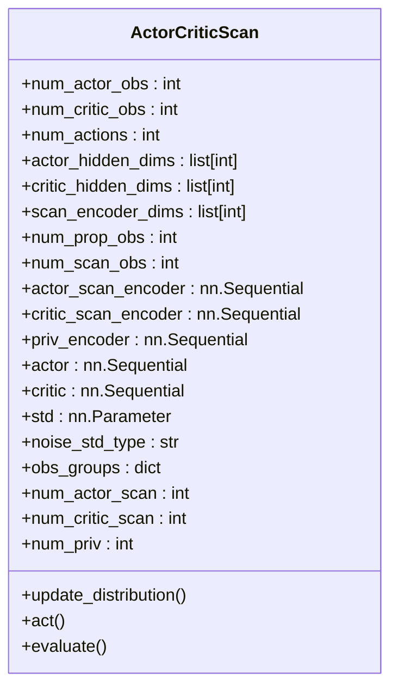

**Diagram sources**
- [actor_critic_scan.py:20-280](file://source/robot_lab/robot_lab/tasks/manager_based/locomotion/velocity/config/quadruped/unitree_go2_parkour/agents/actor_critic_scan.py#L20-L280)

### Advanced Terrain Generation Capabilities
The system provides comprehensive terrain generation with 15+ different terrain types and enhanced curriculum support for progressive difficulty scaling.

**Updated** Enhanced with terrain-level curriculum support and improved parameter specifications

#### Available Terrain Types with Curriculum Support
- **Basic Terrains**: Plane, Pyramid Stairs, Inverted Pyramid Stairs
- **Grid Systems**: Random Grid, Repeated Objects (Cylinders, Boxes, Pyramids) with curriculum parameters
- **Obstacle Courses**: Rails, Pit, Box Terrain, Gap Terrain
- **Linear Obstacles**: Gap Strip, Hurdle Strip, Stairs Strip
- **Parkour-Specific**: Parkour Step, Floating Ring, Star Pattern, Debris Field

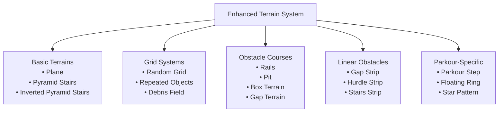

**Diagram sources**
- [terrains_cfg.py:22-384](file://source/robot_lab/robot_lab/tasks/manager_based/locomotion/velocity/config/quadruped/unitree_go2_parkour/terrains_cfg.py#L22-L384)

### Enhanced Custom MDP Observations and Rewards
The parkour system includes specialized observations and rewards tailored for complex locomotion tasks with detailed dimensional characteristics.

**Updated** Improved documentation with comprehensive comments explaining sensor input dimensions

#### Enhanced Custom Observations with Dimensional Characteristics
- **Foot Contacts**: Binary contact flags from contact sensors, shape: (num_envs, num_feet)
- **Physical Properties**: Base mass, center of mass, friction coefficients
- **Control Parameters**: P-gain and D-gain scaling factors

#### Enhanced Custom Rewards with Dimensional Specifications
- **Mechanical Work**: Positive mechanical work with regeneration clamping, shape: (num_envs,)
- **Joint Deviations**: L2 penalty on joint positions from defaults
- **Stumble Detection**: Penalizes horizontal forces dominating vertical forces
- **Torque Sum**: Sum of applied joint torques, shape: (num_envs,)
- **Stop Penalties**: Exponential penalties for linear and angular velocity

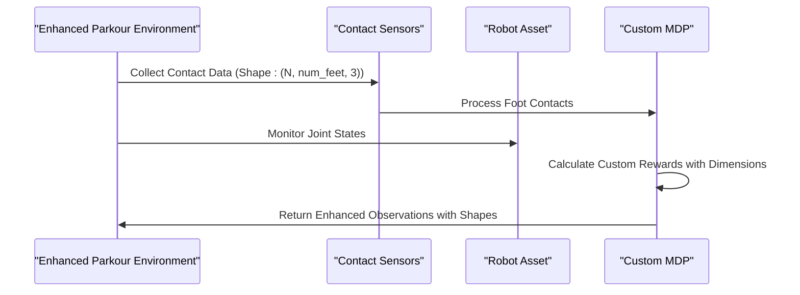

**Diagram sources**
- [observations.py:33-111](file://source/robot_lab/robot_lab/tasks/manager_based/locomotion/velocity/config/quadruped/unitree_go2_parkour/mdp/observations.py#L33-L111)
- [rewards.py:35-131](file://source/robot_lab/robot_lab/tasks/manager_based/locomotion/velocity/config/quadruped/unitree_go2_parkour/mdp/rewards.py#L35-L131)

### Enhanced Ablation Study Configurations
The system supports comprehensive ablation studies with multiple runner configurations and enhanced curriculum parameter specifications:

- **Baseline**: Standard ActorCritic network
- **Scan Encoder Ablations**: Different scan encoder configurations
- **Privileged Observation Ablations**: Various privileged observation setups
- **Training Variants**: Flat vs Rough terrain training with curriculum support
- **Curriculum Parameter Ablations**: Enhanced difficulty progression controls

**Section sources**
- [actor_critic_scan.py:20-280](file://source/robot_lab/robot_lab/tasks/manager_based/locomotion/velocity/config/quadruped/unitree_go2_parkour/agents/actor_critic_scan.py#L20-L280)
- [rsl_rl_ppo_cfg.go2_parkour:128-242](file://source/robot_lab/robot_lab/tasks/manager_based/locomotion/velocity/config/quadruped/unitree_go2_parkour/agents/rsl_rl_ppo_cfg.py#L128-L242)
- [terrains_cfg.py:22-384](file://source/robot_lab/robot_lab/tasks/manager_based/locomotion/velocity/config/quadruped/unitree_go2_parkour/terrains_cfg.py#L22-L384)
- [observations.py:33-111](file://source/robot_lab/robot_lab/tasks/manager_based/locomotion/velocity/config/quadruped/unitree_go2_parkour/mdp/observations.py#L33-L111)
- [rewards.py:35-131](file://source/robot_lab/robot_lab/tasks/manager_based/locomotion/velocity/config/quadruped/unitree_go2_parkour/mdp/rewards.py#L35-L131)

## Enhanced Terrain Curriculum System

### Terrain-Level Curriculum Support
The enhanced terrain system provides progressive difficulty scaling with comprehensive parameter specifications for each terrain type.

**Updated** Added terrain-level curriculum support with detailed parameter explanations

#### Curriculum Parameter Specifications
- **Difficulty Range**: 0.0 to 1.0 representing minimum to maximum difficulty
- **Parameter Interpolation**: Linear interpolation between start and end parameters based on difficulty
- **Terrain-Specific Parameters**: Each terrain type defines its own difficulty-dependent parameters

#### Enhanced Terrain Configuration Classes
- **MeshPyramidStairsTerrainCfg**: step_height_range, step_width, platform_width
- **MeshRandomGridTerrainCfg**: grid_width, grid_height_range, platform_width
- **MeshRepeatedObjectsTerrainCfg**: object_type, object_params_start/end, height noise parameters
- **MeshParkourStepTerrainCfg**: step_height_range, step_length_base_range, steps

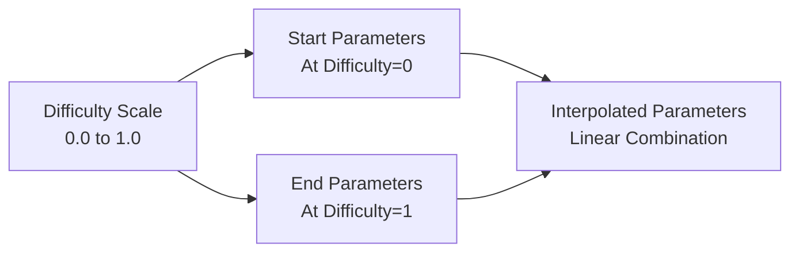

**Diagram sources**
- [terrains_cfg.py:76-87](file://source/robot_lab/robot_lab/tasks/manager_based/locomotion/velocity/config/quadruped/unitree_go2_parkour/terrains_cfg.py#L76-L87)
- [terrains_cfg.py:264-277](file://source/robot_lab/robot_lab/tasks/manager_based/locomotion/velocity/config/quadruped/unitree_go2_parkour/terrains_cfg.py#L264-L277)

**Section sources**
- [terrains_cfg.py:22-384](file://source/robot_lab/robot_lab/tasks/manager_based/locomotion/velocity/config/quadruped/unitree_go2_parkour/terrains_cfg.py#L22-L384)
- [mesh_terrains.py:74-81](file://source/robot_lab/robot_lab/tasks/manager_based/locomotion/velocity/config/quadruped/unitree_go2_parkour/mesh_terrains.py#L74-L81)

## Improved Observation System

### Enhanced Observation Dimension Documentation
The observation system now includes comprehensive comments explaining the dimensional characteristics of sensor inputs and processing pipeline.

**Updated** Added detailed dimensional characteristics documentation for sensor inputs

#### Observation Pipeline with Dimensional Characteristics
- **Proprioceptive Observations**: Shape (num_envs, num_prop_obs)
- **Scan Observations**: Shape (num_envs, num_scan_obs) processed through scan encoders
- **Privileged Observations**: Shape (num_envs, num_priv_obs) processed through privileged encoders
- **Combined Observations**: Concatenated tensors with explicit dimension calculations

#### Enhanced Sensor Input Documentation
- **Contact Sensors**: Net forces with shape (num_envs, num_feet, 3)
- **Articulation Sensors**: Joint positions, velocities, torques with shape (num_envs, num_joints)
- **IMU Sensors**: Orientation, angular velocity, linear acceleration with shape (num_envs, 10)

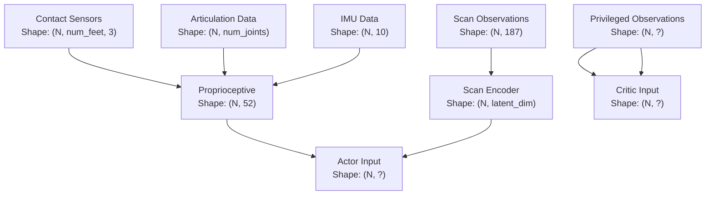

**Diagram sources**
- [actor_critic_scan.py:62-71](file://source/robot_lab/robot_lab/tasks/manager_based/locomotion/velocity/config/quadruped/unitree_go2_parkour/agents/actor_critic_scan.py#L62-L71)
- [observations.py:33-47](file://source/robot_lab/robot_lab/tasks/manager_based/locomotion/velocity/config/quadruped/unitree_go2_parkour/mdp/observations.py#L33-L47)

**Section sources**
- [actor_critic_scan.py:54-71](file://source/robot_lab/robot_lab/tasks/manager_based/locomotion/velocity/config/quadruped/unitree_go2_parkour/agents/actor_critic_scan.py#L54-L71)
- [observations.py:33-111](file://source/robot_lab/robot_lab/tasks/manager_based/locomotion/velocity/config/quadruped/unitree_go2_parkour/mdp/observations.py#L33-L111)

## Navigation Training Capabilities

### Navigation Environment Architecture
The navigation training system provides comprehensive pose command tracking capabilities for Unitree Go2 robots with terrain-level curriculum support. The system integrates seamlessly with the existing locomotion infrastructure while providing specialized navigation rewards and command generators.

**Updated** Added comprehensive navigation training system with pose command tracking and terrain curriculum support

#### Navigation Environment Configuration
- **Pose Command Tracking**: Position tracking with tanh kernel and orientation error penalization
- **Terrain Curriculum**: Progressive difficulty scaling based on navigation performance
- **Terrain-Aware Commands**: Specialized command generators with pit terrain restrictions
- **Reward Shaping**: Balanced navigation rewards with curriculum adaptation

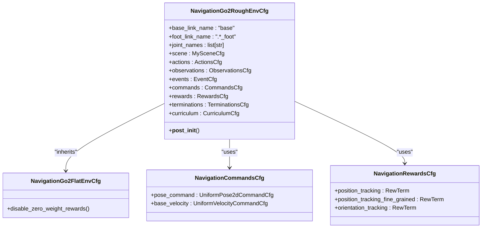

**Diagram sources**
- [navigation_env_cfg.go2:644-875](file://source/robot_lab/robot_lab/tasks/manager_based/navigation/config/go2/navigation_env_cfg.py#L644-L875)

### Navigation Reward System
The navigation system implements specialized reward functions for pose command tracking with curriculum support and terrain-aware adaptations.

**Updated** Enhanced with navigation-specific reward functions and curriculum integration

#### Position Tracking Rewards
- **position_tracking**: Tanh-based position error with configurable standard deviation
- **position_tracking_fine_grained**: High-resolution position tracking for precise navigation
- **orientation_tracking**: Absolute heading error penalization for orientation control

#### Terrain-Aware Reward Adaptations
- **Base Height Control**: Target height adjustment for navigation stability
- **Contact Force Management**: Foot contact optimization for navigation tasks
- **Action Rate Penalties**: Smooth navigation with action rate regularization

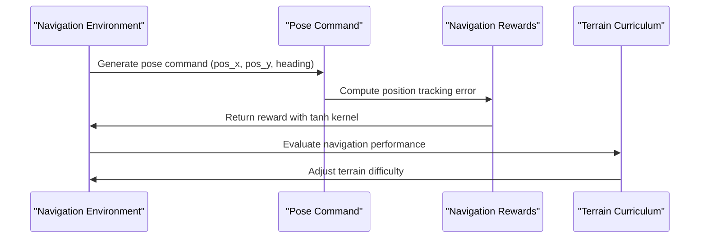

**Diagram sources**
- [rewards.py:15-28](file://source/robot_lab/robot_lab/tasks/manager_based/navigation/mdp/rewards.py#L15-L28)
- [curriculums.py:144-175](file://source/robot_lab/robot_lab/tasks/manager_based/navigation/mdp/curriculums.py#L144-L175)

**Section sources**
- [navigation_env_cfg.go2:296-482](file://source/robot_lab/robot_lab/tasks/manager_based/navigation/config/go2/navigation_env_cfg.py#L296-L482)
- [rewards.py:15-28](file://source/robot_lab/robot_lab/tasks/manager_based/navigation/mdp/rewards.py#L15-L28)
- [curriculums.py:144-175](file://source/robot_lab/robot_lab/tasks/manager_based/navigation/mdp/curriculums.py#L144-L175)

### Navigation Command Generators
The navigation system provides specialized command generators with terrain-aware adaptations and pit terrain restrictions for safe navigation.

**Updated** Added terrain-aware command generators with pit terrain detection and restrictions

#### Pose Command Generator
- **UniformPose2dCommandCfg**: 2D pose commands with configurable ranges and resampling intervals
- **Simple Heading Control**: Optional simplified heading command for basic navigation
- **Debug Visualization**: Interactive command visualization in Isaac Sim

#### Terrain-Aware Velocity Commands
- **UniformThresholdVelocityCommand**: Velocity commands with terrain restrictions
- **Pit Terrain Detection**: Real-time pit terrain detection and command restriction
- **Forward-Only Movement**: Restricted movement patterns for safe navigation on challenging terrain

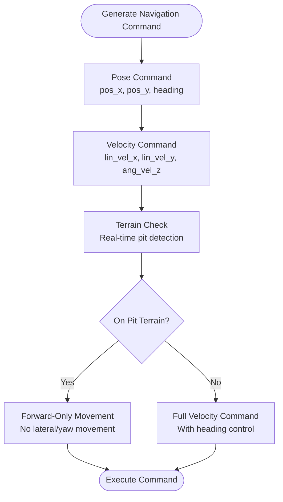

**Diagram sources**
- [commands.py:31-98](file://source/robot_lab/robot_lab/tasks/manager_based/navigation/mdp/commands.py#L31-L98)

**Section sources**
- [commands.py:31-98](file://source/robot_lab/robot_lab/tasks/manager_based/navigation/mdp/commands.py#L31-L98)
- [navigation_env_cfg.go2:573-594](file://source/robot_lab/robot_lab/tasks/manager_based/navigation/config/go2/navigation_env_cfg.py#L573-L594)

### Navigation Curriculum System
The navigation curriculum system provides progressive difficulty scaling based on navigation performance with terrain-level adaptation.

**Updated** Enhanced with terrain-level curriculum support for navigation tasks

#### Command Curriculum System
- **command_levels_lin_vel**: Progressive linear velocity command scaling
- **command_levels_ang_vel**: Angular velocity command adaptation
- **Range Multiplier**: Configurable difficulty progression parameters

#### Terrain Curriculum System
- **terrain_levels_vel**: Terrain difficulty adaptation based on navigation distance
- **Performance-Based Scaling**: Terrain complexity adjustment based on robot performance
- **Episode-Based Updates**: Curriculum updates at episode boundaries

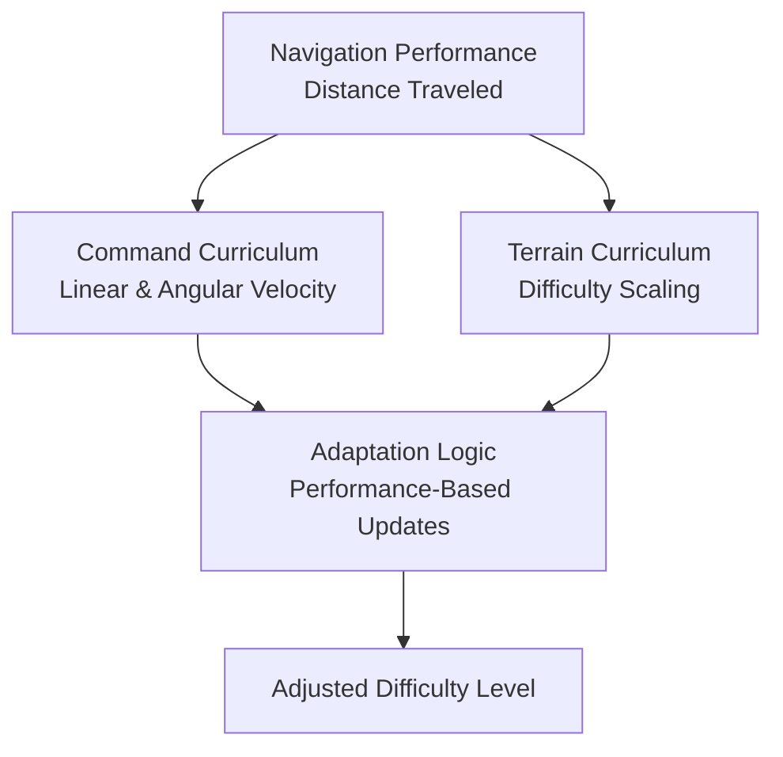

**Diagram sources**
- [curriculums.py:24-106](file://source/robot_lab/robot_lab/tasks/manager_based/navigation/mdp/curriculums.py#L24-L106)
- [curriculums.py:144-175](file://source/robot_lab/robot_lab/tasks/manager_based/navigation/mdp/curriculums.py#L144-L175)

**Section sources**
- [curriculums.py:24-106](file://source/robot_lab/robot_lab/tasks/manager_based/navigation/mdp/curriculums.py#L24-L106)
- [curriculums.py:144-175](file://source/robot_lab/robot_lab/tasks/manager_based/navigation/mdp/curriculums.py#L144-L175)

## Navigation Environment Configuration

### Environment Setup and Parameters
The navigation environments provide comprehensive configuration options for both flat and rough terrain navigation with specialized parameters for pose command tracking.

**Updated** Enhanced with navigation-specific environment parameters and curriculum integration

#### Environment Parameters
- **Simulation Settings**: Decimation, episode length, and physics parameters
- **Scene Configuration**: Environment spacing and terrain setup
- **Observation Scaling**: Specialized scaling for navigation tasks
- **Action Clipping**: Joint position action scaling and clipping

#### Navigation-Specific Parameters
- **Pose Command Ranges**: Configurable position and heading command ranges
- **Velocity Command Ranges**: Linear and angular velocity command specifications
- **Reward Weighting**: Navigation-specific reward function weights
- **Termination Conditions**: Terrain bounds and contact sensor termination

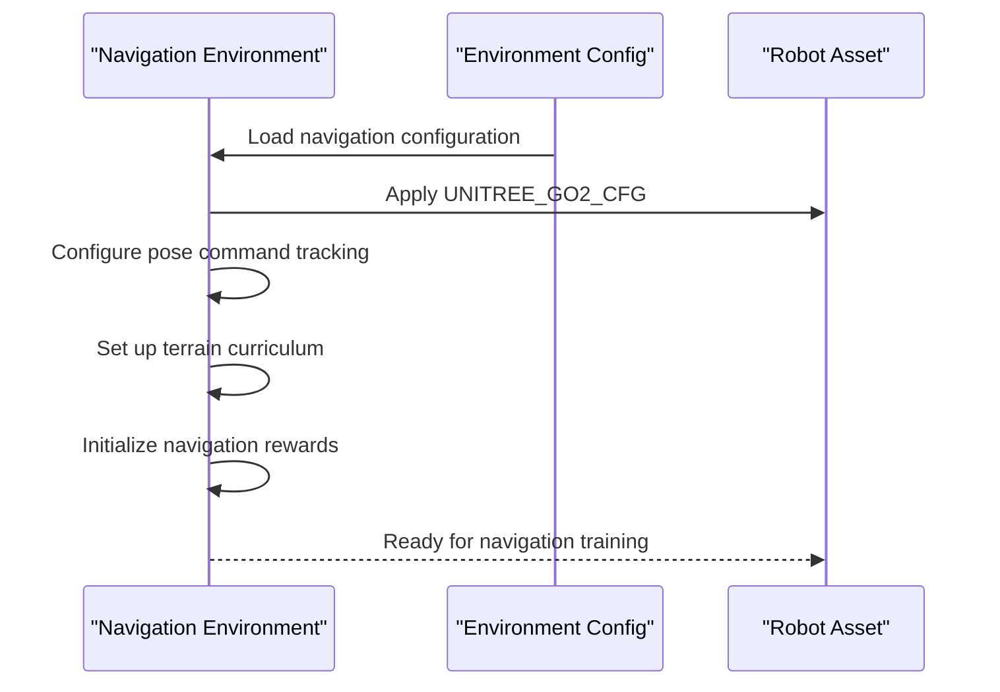

**Diagram sources**
- [navigation_env_cfg.go2:669-730](file://source/robot_lab/robot_lab/tasks/manager_based/navigation/config/go2/navigation_env_cfg.py#L669-L730)

**Section sources**
- [navigation_env_cfg.go2:669-730](file://source/robot_lab/robot_lab/tasks/manager_based/navigation/config/go2/navigation_env_cfg.py#L669-L730)
- [navigation_env_cfg.go2:738-822](file://source/robot_lab/robot_lab/tasks/manager_based/navigation/config/go2/navigation_env_cfg.py#L738-L822)

### Flat vs Rough Terrain Navigation
The navigation system provides both flat and rough terrain configurations with specialized adaptations for each environment type.

**Updated** Enhanced with flat terrain navigation configuration and curriculum disabling

#### Flat Terrain Configuration
- **Plane Terrain**: Simple flat surface navigation
- **Height Scanner Disabled**: No height scanning for flat terrain
- **Terrain Curriculum Disabled**: No terrain difficulty progression
- **Navigation Rewards Emphasis**: Pure pose command tracking without locomotion rewards

#### Rough Terrain Configuration
- **Complex Terrain**: Multi-level terrain with obstacles
- **Height Scanning Enabled**: Height scanner for terrain navigation
- **Terrain Curriculum Active**: Progressive difficulty scaling
- **Hybrid Rewards**: Combined navigation and locomotion rewards

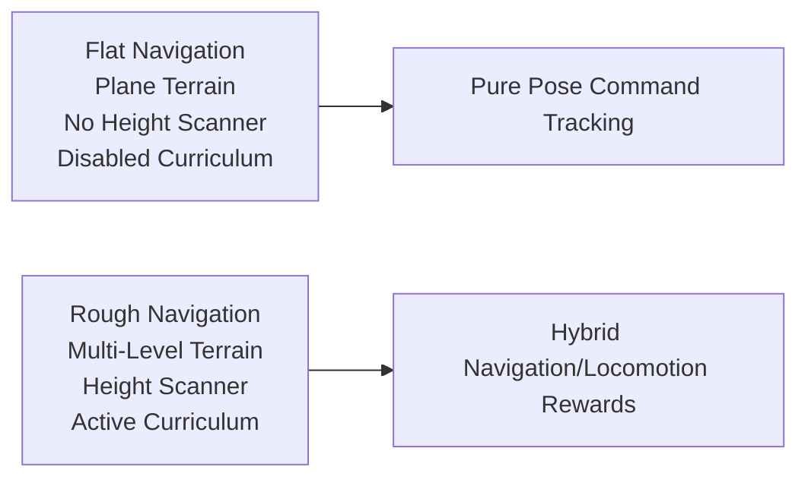

**Diagram sources**
- [navigation_env_cfg.go2:837-875](file://source/robot_lab/robot_lab/tasks/manager_based/navigation/config/go2/navigation_env_cfg.py#L837-L875)

**Section sources**
- [navigation_env_cfg.go2:837-875](file://source/robot_lab/robot_lab/tasks/manager_based/navigation/config/go2/navigation_env_cfg.py#L837-L875)

## Navigation Agent Configurations

### Reinforcement Learning Agent Setup
The navigation system provides specialized agent configurations for both RSL-RL and SKRL frameworks with different training approaches and hyperparameters.

**Updated** Added comprehensive agent configurations for navigation training

#### RSL-RL PPO Configuration
- **Actor-Critic Architecture**: Custom hidden dimensions (512, 256, 128)
- **Learning Hyperparameters**: Adaptive learning rate, KL divergence control
- **Training Iterations**: 20,000 iterations for rough terrain, 5,000 for flat terrain
- **Experiment Naming**: Unitree Go2 navigation experiments

#### SKRL PPO Configuration
- **Model Architecture**: Gaussian policy with deterministic value network
- **Network Layers**: Two-layer MLP with ELU activations
- **Training Parameters**: Sequential trainer with configurable timesteps
- **Memory Management**: Random memory with automatic sizing

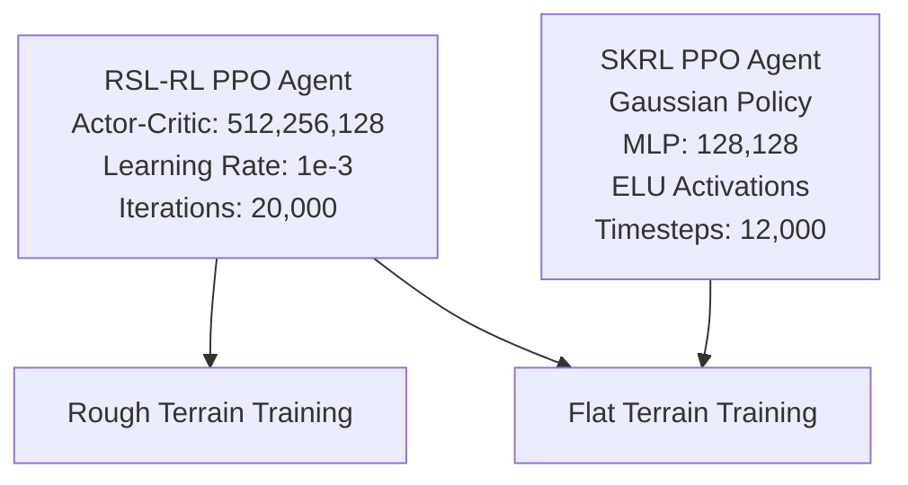

**Diagram sources**
- [rsl_rl_ppo_cfg.go2:11-47](file://source/robot_lab/robot_lab/tasks/manager_based/navigation/config/go2/agents/rsl_rl_ppo_cfg.py#L11-L47)
- [skrl_flat_ppo_cfg.yaml:11-86](file://source/robot_lab/robot_lab/tasks/manager_based/navigation/config/go2/agents/skrl_flat_ppo_cfg.yaml#L11-L86)

**Section sources**
- [rsl_rl_ppo_cfg.go2:11-47](file://source/robot_lab/robot_lab/tasks/manager_based/navigation/config/go2/agents/rsl_rl_ppo_cfg.py#L11-L47)
- [skrl_flat_ppo_cfg.yaml:11-86](file://source/robot_lab/robot_lab/tasks/manager_based/navigation/config/go2/agents/skrl_flat_ppo_cfg.yaml#L11-L86)

## Dependency Analysis
- Environment configurations depend on robot assets for spawning and actuator definitions.
- Go2W introduces a dual-actuator strategy: implicit actuators for legs and wheels, altering dynamics compared to pure DC motors.
- **Enhanced Dependencies**: Go2 parkour system introduces dependencies on custom neural networks, terrain generation utilities, specialized MDP components, and curriculum parameter systems.
- **New Dependencies**: Navigation training system depends on pose command generators, terrain-aware reward functions, and curriculum adaptation modules.

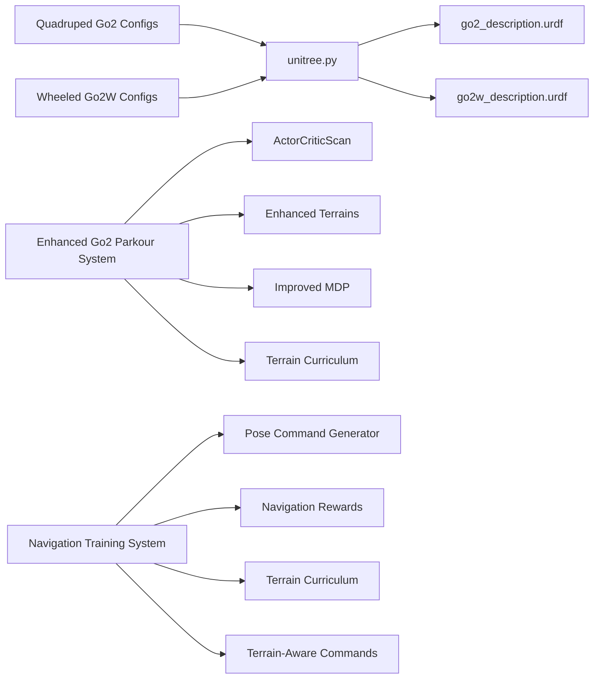

**Diagram sources**
- [rough_env_cfg.go2:34-35](file://source/robot_lab/robot_lab/tasks/manager_based/locomotion/velocity/config/quadruped/unitree_go2/rough_env_cfg.py#L34-L35)
- [rough_env_cfg.go2w:76-77](file://source/robot_lab/robot_lab/tasks/manager_based/locomotion/velocity/config/wheeled/unitree_go2w/rough_env_cfg.py#L76-L77)
- [unitree.py:71-177](file://source/robot_lab/robot_lab/assets/unitree.py#L71-L177)
- [rsl_rl_ppo_cfg.go2_parkour:21-22](file://source/robot_lab/robot_lab/tasks/manager_based/locomotion/velocity/config/quadruped/unitree_go2_parkour/agents/rsl_rl_ppo_cfg.py#L21-L22)
- [navigation_env_cfg.go2:644-875](file://source/robot_lab/robot_lab/tasks/manager_based/navigation/config/go2/navigation_env_cfg.py#L644-L875)

**Section sources**
- [rough_env_cfg.go2:34-35](file://source/robot_lab/robot_lab/tasks/manager_based/locomotion/velocity/config/quadruped/unitree_go2/rough_env_cfg.py#L34-L35)
- [rough_env_cfg.go2w:76-77](file://source/robot_lab/robot_lab/tasks/manager_based/locomotion/velocity/config/wheeled/unitree_go2w/rough_env_cfg.py#L76-L77)

## Performance Considerations
- Motor limits:
  - Both variants share identical effort/velocity/stiffness/damping limits for comparable torque and speed capabilities.
- Height differences:
  - Go2W's higher center of mass (0.45 m vs 0.38 m) affects stability and energy consumption; reward targets and penalties reflect this.
- Actuator modeling:
  - Go2W's wheels use implicit actuators with zero stiffness, emphasizing compliant rolling contact and reduced control complexity for wheel joints.
- **Enhanced Considerations**: Go2 parkour system requires additional computational resources for custom neural networks, terrain generation, and curriculum management, but enables more sophisticated training scenarios with progressive difficulty scaling.
- **New Considerations**: Navigation training system provides efficient pose command tracking with specialized reward functions and terrain-aware adaptations, suitable for both flat and rough terrain navigation tasks.

## Troubleshooting Guide
- Validation of motor limits:
  - Confirm effort and velocity limits match expectations for both Go2 and Go2W actuators.
- Initial pose issues:
  - Ensure base height and joint positions align with configuration files for the chosen variant.
- Environment mismatch:
  - Verify the environment registration and configuration correspond to the intended variant (Go2 vs Go2W).
- **Enhanced Issues**: For Go2 parkour system:
  - Ensure custom neural network dependencies are properly installed.
  - Verify terrain generation parameters are within valid ranges and curriculum specifications are correct.
  - Check ablation study configurations for proper parameter combinations and observation dimension compatibility.
  - Validate observation dimension calculations and tensor shape compatibility in the neural network architecture.
- **New Issues**: For navigation training system:
  - Verify pose command ranges and terrain curriculum parameters are properly configured.
  - Check terrain-aware command generators for pit terrain detection accuracy.
  - Ensure navigation reward weights are balanced between position tracking and orientation control.
  - Validate agent configuration compatibility with chosen RL framework (RSL-RL vs SKRL).

**Section sources**
- [unitree.py:107-116](file://source/robot_lab/robot_lab/assets/unitree.py#L107-L116)
- [unitree.py:157-174](file://source/robot_lab/robot_lab/assets/unitree.py#L157-L174)
- [rough_env_cfg.go2:34-35](file://source/robot_lab/robot_lab/tasks/manager_based/locomotion/velocity/config/quadruped/unitree_go2/rough_env_cfg.py#L34-L35)
- [rough_env_cfg.go2w:76-77](file://source/robot_lab/robot_lab/tasks/manager_based/locomotion/velocity/config/wheeled/unitree_go2w/rough_env_cfg.py#L76-L77)

## Conclusion
The Unitree Go2 series integrates seamlessly with the Isaac Lab RL framework. Go2 relies on DC motors across all joints, while Go2W employs implicit actuators for legs and wheels, reflecting distinct locomotion strategies. The enhanced Go2 parkour training system provides a comprehensive self-contained package with custom RL configuration, advanced neural network architecture, enhanced terrain generation capabilities with curriculum support, and improved observation system documentation with detailed dimensional characteristics. The newly added navigation training system enables pose command tracking with terrain-level curriculum support, specialized reward functions, and terrain-aware command generators. The documented configurations, limits, and environment parameters enable reproducible simulations and informed selection between variants depending on terrain and mobility requirements.

## Appendices

### Selection Guidance: Go2 vs Go2W vs Enhanced Go2 Parkour vs Navigation System
- Choose Go2 when:
  - Terrain requires robust foothold adaptability and dynamic balance.
  - Emphasis on bipedal-like legged locomotion with articulated feet.
- Choose Go2W when:
  - Smooth, efficient transport on relatively flat surfaces is prioritized.
  - Reduced actuator count for wheels lowers control complexity and power consumption.
- Choose Enhanced Go2 Parkour when:
  - Complex parkour and obstacle navigation training is required.
  - Advanced neural network architectures with curriculum support are beneficial.
  - Comprehensive ablation studies and enhanced observation system are needed.
  - Progressive difficulty scaling and terrain-level curriculum support are essential.
- Choose Navigation Training System when:
  - Pose command tracking and precise navigation are required.
  - Terrain-level curriculum support for navigation tasks is beneficial.
  - Specialized reward functions for position and orientation control are needed.
  - Terrain-aware command generators with pit terrain restrictions are advantageous.
- **Enhanced Comparison Highlights**:
  - Effort/velocity/stiffness/damping limits are consistent between variants for fair comparisons.
  - Go2W's higher center of mass improves ground clearance but may increase overturning risk on uneven terrain.
  - Enhanced Go2 parkour system provides the most sophisticated training capabilities with curriculum support but requires additional computational resources.
  - Improved observation system documentation enables better debugging and parameter tuning.
  - Terrain-level curriculum support enables progressive skill development with systematic difficulty scaling.
  - Navigation training system provides specialized pose command tracking with terrain-aware adaptations.
  - Navigation curriculum system enables progressive navigation difficulty scaling based on performance.
  - Terrain-aware command generators ensure safe navigation on challenging terrains with pit detection and restrictions.