# Robot Categories and Models

<cite>
**Referenced Files in This Document**
- [README.md](file://README.md)
- [assets/__init__.py](file://source/robot_lab/robot_lab/assets/__init__.py)
- [assets/unitree.py](file://source/robot_lab/robot_lab/assets/unitree.py)
- [assets/zsibot.py](file://source/robot_lab/robot_lab/assets/zsibot.py)
- [assets/booster.py](file://source/robot_lab/robot_lab/assets/booster.py)
- [unitree/go2_description/urdf/go2_description.urdf](file://source/robot_lab/data/Robots/unitree/go2_description/urdf/go2_description.urdf)
- [unitree/a1_description/urdf/a1.urdf](file://source/robot_lab/data/Robots/unitree/a1_description/urdf/a1.urdf)
- [deeprobotics/lite3_description/urdf/lite3.urdf](file://source/robot_lab/data/Robots/deeprobotics/lite3_description/urdf/lite3.urdf)
- [fftai/gr1t1_description/urdf/GR1T1.urdf](file://source/robot_lab/data/Robots/fftai/gr1t1_description/urdf/GR1T1.urdf)
- [magiclab/magicdog/urdf/magicdog.urdf](file://source/robot_lab/data/Robots/magiclab/magicdog/urdf/magicdog.urdf)
- [magiclab/magicdog_w/urdf/magicdog_w.urdf](file://source/robot_lab/data/Robots/magiclab/magicdog_w/urdf/magicdog_w.urdf)
- [zsibot/zsl1_description/urdf/zsl1.urdf](file://source/robot_lab/data/Robots/zsibot/zsl1_description/urdf/zsl1.urdf)
- [zsibot/zsl1w_description/urdf/zsl1w.urdf](file://source/robot_lab/data/Robots/zsibot/zsl1w_description/urdf/zsl1w.urdf)
</cite>

## Table of Contents
1. [Introduction](#introduction)
2. [Project Structure](#project-structure)
3. [Core Components](#core-components)
4. [Architecture Overview](#architecture-overview)
5. [Detailed Component Analysis](#detailed-component-analysis)
6. [Dependency Analysis](#dependency-analysis)
7. [Performance Considerations](#performance-considerations)
8. [Troubleshooting Guide](#troubleshooting-guide)
9. [Conclusion](#conclusion)

## Introduction
This document catalogs the supported robot categories and models in the repository, focusing on quadrupeds, wheeled robots, and humanoids. It explains the physical characteristics, actuator configurations, and simulation parameters derived from URDFs and asset configurations. It also highlights similarities and differences among models, and outlines performance and stability considerations for reinforcement learning applications.

## Project Structure
The repository organizes robot assets and URDFs under a dedicated data directory and exposes robot-specific asset configurations in a Python module. Environments are registered via the Isaac Lab Gym registry and grouped by category and model.

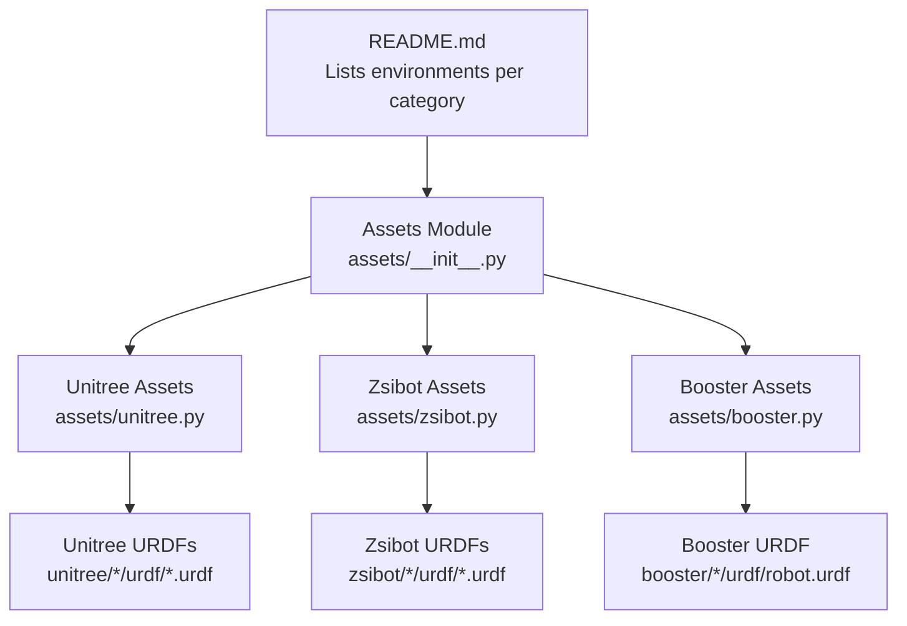

**Diagram sources**
- [README.md](file://README.md#L17-L41)
- [assets/__init__.py](file://source/robot_lab/robot_lab/assets/__init__.py#L18-L30)
- [assets/unitree.py](file://source/robot_lab/robot_lab/assets/unitree.py#L1-L637)
- [assets/zsibot.py](file://source/robot_lab/robot_lab/assets/zsibot.py#L1-L115)
- [assets/booster.py](file://source/robot_lab/robot_lab/assets/booster.py#L1-L110)

**Section sources**
- [README.md](file://README.md#L17-L41)
- [assets/__init__.py](file://source/robot_lab/robot_lab/assets/__init__.py#L18-L30)

## Core Components
- Quadruped robots:
  - Unitree A1, Unitree Go2, Deeprobotics Lite3, Zsibot ZSL1, Magiclab MagicDog
- Wheeled robots:
  - Unitree Go2W, Unitree B2W, Deeprobotics M20, DDTRobot Tita, Zsibot ZSL1W, Magiclab MagicDog-W
- Humanoid robots:
  - Unitree G1, Unitree H1, FFTAI GR1T1/GR1T2, Booster T1, RobotEra Xbot, Openloong Loong, RoboParty ATOM01, Magiclab MagicBot-Gen1/Z1

Environments are registered per model and task (e.g., velocity locomotion on flat or rough terrain), and the repository includes training and evaluation scripts for reinforcement learning.

**Section sources**
- [README.md](file://README.md#L17-L41)

## Architecture Overview
The runtime architecture ties together environment registration, asset configurations, and URDF specifications. Asset configurations define actuator groups and initial poses, while URDFs encode inertial, geometric, and kinematic properties.

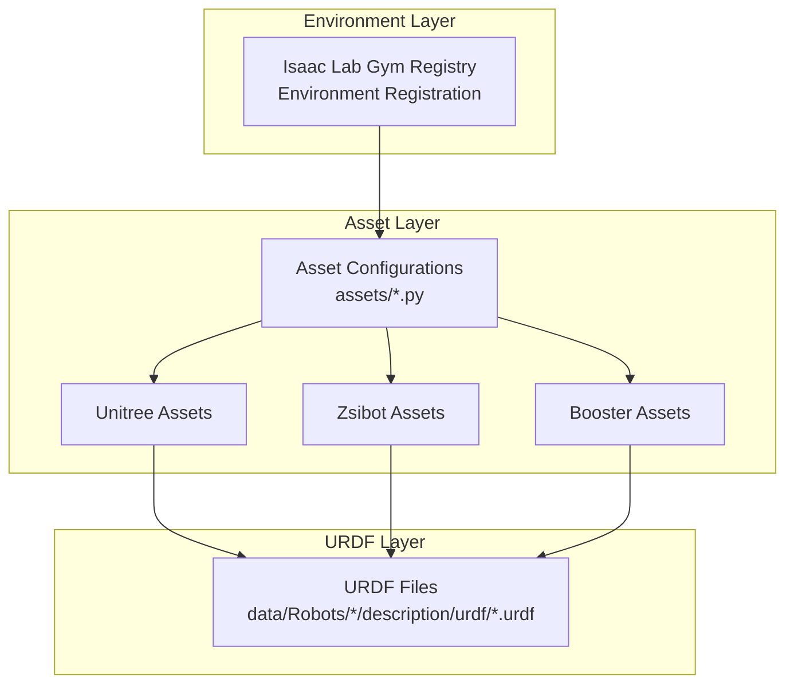

**Diagram sources**
- [README.md](file://README.md#L383-L426)
- [assets/unitree.py](file://source/robot_lab/robot_lab/assets/unitree.py#L1-L637)
- [assets/zsibot.py](file://source/robot_lab/robot_lab/assets/zsibot.py#L1-L115)
- [assets/booster.py](file://source/robot_lab/robot_lab/assets/booster.py#L1-L110)

## Detailed Component Analysis

### Quadruped Robots

#### Unitree A1
- Physical characteristics:
  - Base link with defined mass and inertia.
  - Four legs with hip, thigh, and calf segments; foot contact modeled via collisions.
- Actuator configuration:
  - Single actuator group for legs with effort limit, velocity limit, stiffness, and damping.
- Initial pose:
  - Defined joint positions for ABAD/hip/knee joints and zero joint velocities.
- Simulation parameters:
  - Rigid body properties and solver iteration counts set in asset configuration.
- Notes:
  - URDF includes gazebo plugins for IMU and foot contact visualization.

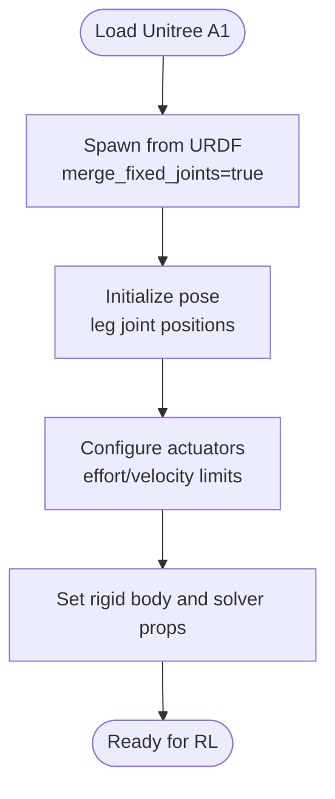

**Diagram sources**
- [assets/unitree.py](file://source/robot_lab/robot_lab/assets/unitree.py#L19-L69)
- [unitree/a1_description/urdf/a1.urdf](file://source/robot_lab/data/Robots/unitree/a1_description/urdf/a1.urdf#L1-L200)

**Section sources**
- [assets/unitree.py](file://source/robot_lab/robot_lab/assets/unitree.py#L19-L69)
- [unitree/a1_description/urdf/a1.urdf](file://source/robot_lab/data/Robots/unitree/a1_description/urdf/a1.urdf#L1-L200)

#### Unitree Go2
- Physical characteristics:
  - Base with mass/inertia; four-legged structure with hip, thigh, and calf links; foot contacts.
- Actuator configuration:
  - Single actuator group for legs with effort/velocity limits and stiffness/damping.
- Initial pose:
  - Defined joint positions for hip/thigh/knee and zero joint velocities.
- Simulation parameters:
  - Rigid body and solver iteration counts set in asset configuration.

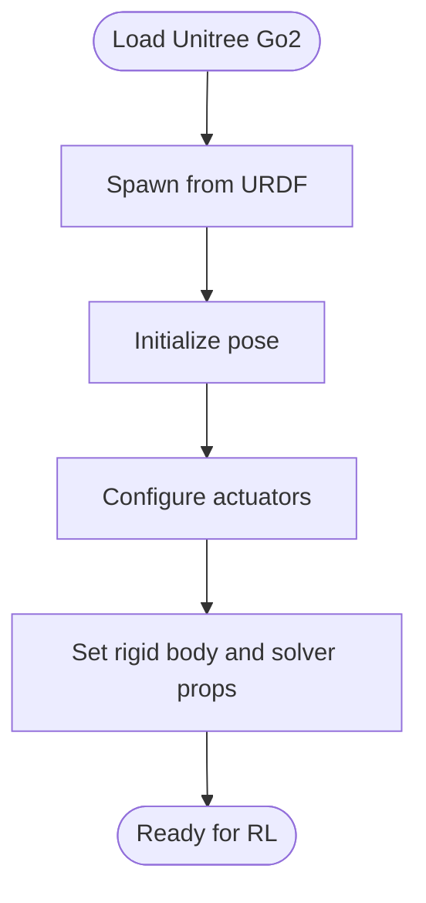

**Diagram sources**
- [assets/unitree.py](file://source/robot_lab/robot_lab/assets/unitree.py#L71-L119)
- [unitree/go2_description/urdf/go2_description.urdf](file://source/robot_lab/data/Robots/unitree/go2_description/urdf/go2_description.urdf#L1-L200)

**Section sources**
- [assets/unitree.py](file://source/robot_lab/robot_lab/assets/unitree.py#L71-L119)
- [unitree/go2_description/urdf/go2_description.urdf](file://source/robot_lab/data/Robots/unitree/go2_description/urdf/go2_description.urdf#L1-L200)

#### Deeprobotics Lite3
- Physical characteristics:
  - Torso with mass/inertia; front-left leg assembly with hip, thigh, shank, and foot.
  - Foot contact modeled via collision spheres.
- Actuator configuration:
  - Effort and velocity limits defined per joint in URDF.
- Simulation parameters:
  - Contact material and friction anchors defined in URDF.

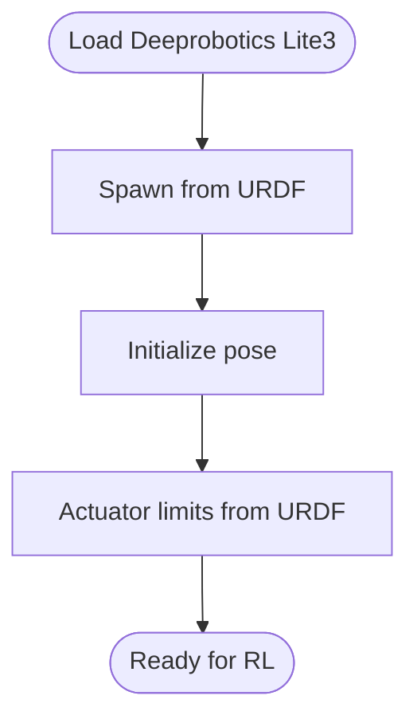

**Diagram sources**
- [deeprobotics/lite3_description/urdf/lite3.urdf](file://source/robot_lab/data/Robots/deeprobotics/lite3_description/urdf/lite3.urdf#L1-L200)

**Section sources**
- [deeprobotics/lite3_description/urdf/lite3.urdf](file://source/robot_lab/data/Robots/deeprobotics/lite3_description/urdf/lite3.urdf#L1-L200)

#### Zsibot ZSL1
- Physical characteristics:
  - Base with mass/inertia; four legs with ABAD/hip/knee joints; foot contact geometry.
- Actuator configuration:
  - Single actuator group for base legs with effort/velocity limits and stiffness/damping.
- Initial pose:
  - Defined joint positions for ABAD/hip/knee and zero joint velocities.

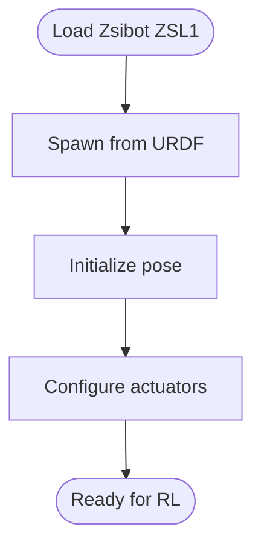

**Diagram sources**
- [assets/zsibot.py](file://source/robot_lab/robot_lab/assets/zsibot.py#L14-L58)
- [zsibot/zsl1_description/urdf/zsl1.urdf](file://source/robot_lab/data/Robots/zsibot/zsl1_description/urdf/zsl1.urdf#L1-L200)

**Section sources**
- [assets/zsibot.py](file://source/robot_lab/robot_lab/assets/zsibot.py#L14-L58)
- [zsibot/zsl1_description/urdf/zsl1.urdf](file://source/robot_lab/data/Robots/zsibot/zsl1_description/urdf/zsl1.urdf#L1-L200)

#### Magiclab MagicDog
- Physical characteristics:
  - Base with mass/inertia; four-legged structure with hip, thigh, calf, and foot links.
  - Head link connected via fixed joint; foot contact modeled via collision geometry.
- Actuator configuration:
  - Effort and velocity limits defined per joint in URDF.
- Initial pose:
  - Defined joint positions for hip/thigh/calf and zero joint velocities.

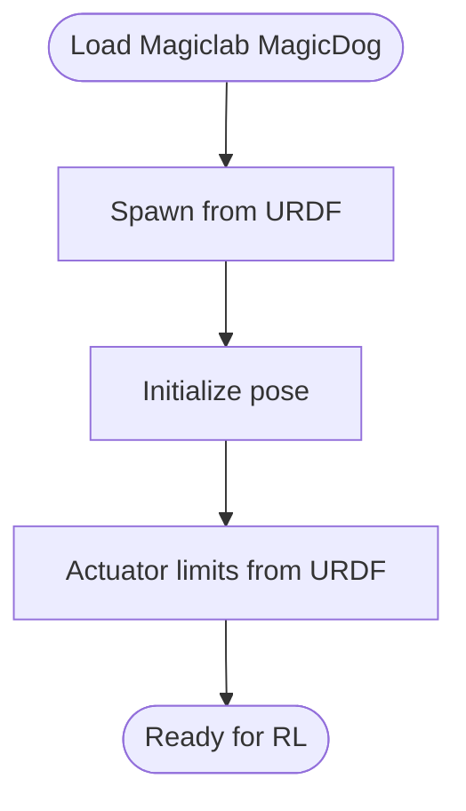

**Diagram sources**
- [magiclab/magicdog/urdf/magicdog.urdf](file://source/robot_lab/data/Robots/magiclab/magicdog/urdf/magicdog.urdf#L1-L200)

**Section sources**
- [magiclab/magicdog/urdf/magicdog.urdf](file://source/robot_lab/data/Robots/magiclab/magicdog/urdf/magicdog.urdf#L1-L200)

#### FFTAI GR1T1
- Physical characteristics:
  - Base with mass/inertia; left-side leg segments including roll/yaw/pitch links; thigh and calf links.
  - Joint limits and visual meshes defined in URDF.
- Actuator configuration:
  - Effort and velocity limits defined per joint in URDF.
- Initial pose:
  - Defined joint positions for hip roll/yaw/pitch and zero joint velocities.

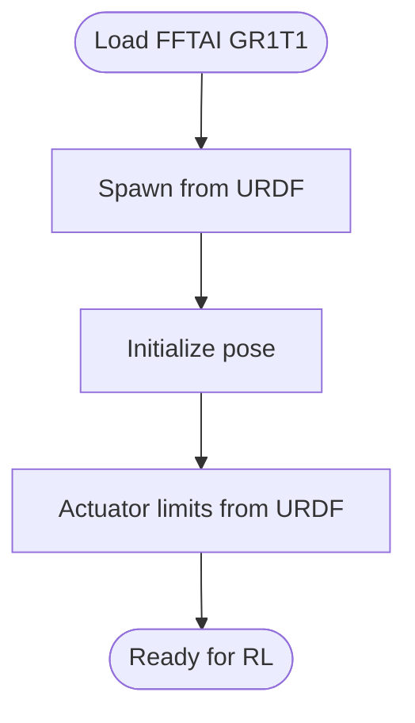

**Diagram sources**
- [fftai/gr1t1_description/urdf/GR1T1.urdf](file://source/robot_lab/data/Robots/fftai/gr1t1_description/urdf/GR1T1.urdf#L1-L200)

**Section sources**
- [fftai/gr1t1_description/urdf/GR1T1.urdf](file://source/robot_lab/data/Robots/fftai/gr1t1_description/urdf/GR1T1.urdf#L1-L200)

### Wheeled Robots

#### Unitree Go2W
- Physical characteristics:
  - Base with mass/inertia; four legs with hip/thigh/knee joints and a foot joint for wheel attachment.
- Actuator configuration:
  - Separate actuator groups for legs and wheels; wheel actuator uses implicit actuator with zero stiffness.
- Initial pose:
  - Defined joint positions for hip/thigh/knee/foot and zero joint velocities.
- Simulation parameters:
  - Solver iteration counts set in asset configuration.

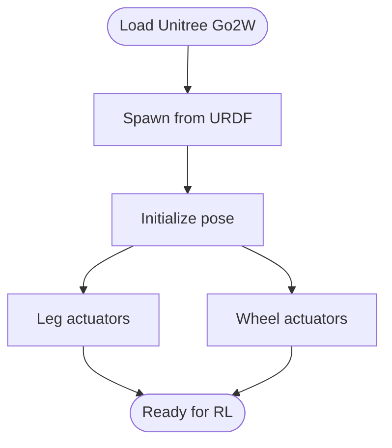

**Diagram sources**
- [assets/unitree.py](file://source/robot_lab/robot_lab/assets/unitree.py#L121-L177)
- [unitree/go2w_description/urdf/go2w_description.urdf](file://source/robot_lab/data/Robots/unitree/go2w_description/urdf/go2w_description.urdf#L1-L200)

**Section sources**
- [assets/unitree.py](file://source/robot_lab/robot_lab/assets/unitree.py#L121-L177)

#### Unitree B2W
- Physical characteristics:
  - Base with mass/inertia; four legs with hip/thigh/knee joints and a foot joint for wheel attachment.
- Actuator configuration:
  - Separate actuator groups for hip/thigh/calf and wheel; wheel actuator uses implicit actuator with zero stiffness.
- Initial pose:
  - Defined joint positions for hip/thigh/knee/foot and zero joint velocities.

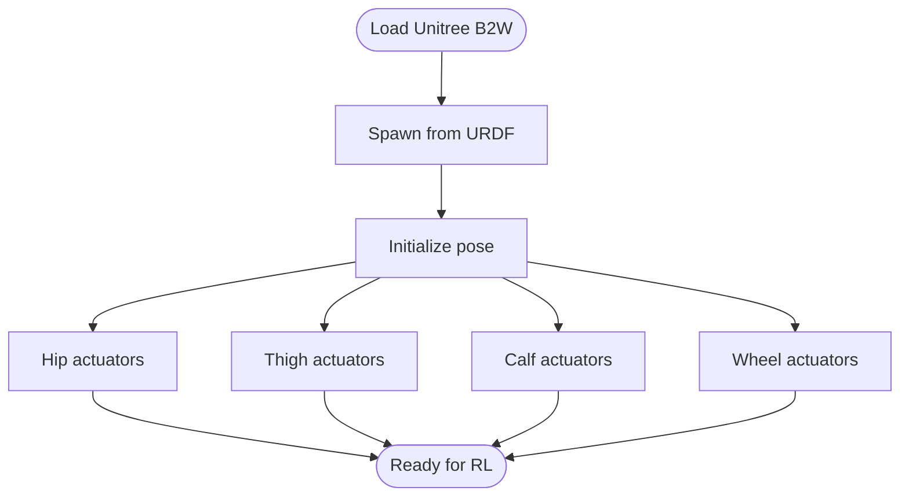

**Diagram sources**
- [assets/unitree.py](file://source/robot_lab/robot_lab/assets/unitree.py#L248-L323)

**Section sources**
- [assets/unitree.py](file://source/robot_lab/robot_lab/assets/unitree.py#L248-L323)

#### Zsibot ZSL1W
- Physical characteristics:
  - Base with mass/inertia; four legs with ABAD/hip/knee joints and a foot joint for wheel attachment.
- Actuator configuration:
  - Separate actuator groups for legs and wheels; wheel actuator uses implicit actuator with zero stiffness.
- Initial pose:
  - Defined joint positions for ABAD/hip/knee/foot and zero joint velocities.

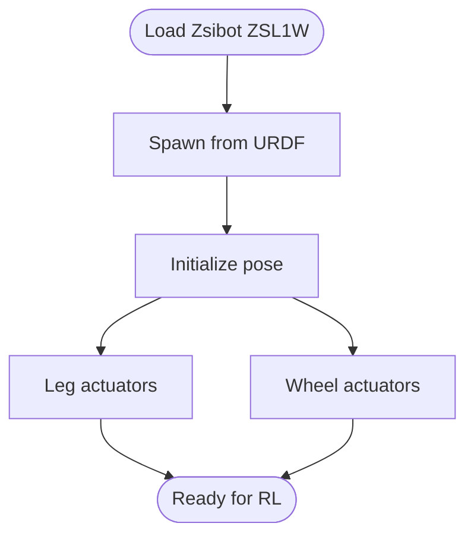

**Diagram sources**
- [assets/zsibot.py](file://source/robot_lab/robot_lab/assets/zsibot.py#L60-L115)
- [zsibot/zsl1w_description/urdf/zsl1w.urdf](file://source/robot_lab/data/Robots/zsibot/zsl1w_description/urdf/zsl1w.urdf#L1-L200)

**Section sources**
- [assets/zsibot.py](file://source/robot_lab/robot_lab/assets/zsibot.py#L60-L115)
- [zsibot/zsl1w_description/urdf/zsl1w.urdf](file://source/robot_lab/data/Robots/zsibot/zsl1w_description/urdf/zsl1w.urdf#L1-L200)

#### Magiclab MagicDog-W
- Physical characteristics:
  - Base with mass/inertia; four-legged structure with hip, thigh, calf, and foot links; foot joint defines wheel.
- Actuator configuration:
  - Effort and velocity limits defined per joint in URDF.
- Initial pose:
  - Defined joint positions for hip/thigh/calf and zero joint velocities.

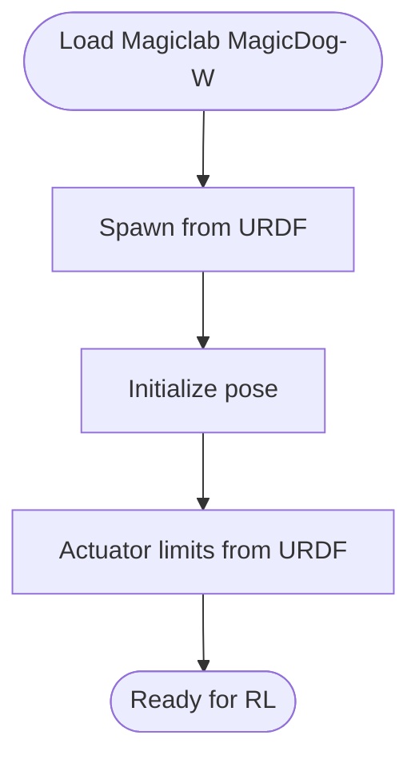

**Diagram sources**
- [magiclab/magicdog_w/urdf/magicdog_w.urdf](file://source/robot_lab/data/Robots/magiclab/magicdog_w/urdf/magicdog_w.urdf#L1-L200)

**Section sources**
- [magiclab/magicdog_w/urdf/magicdog_w.urdf](file://source/robot_lab/data/Robots/magiclab/magicdog_w/urdf/magicdog_w.urdf#L1-L200)

### Humanoid Robots

#### Booster T1
- Physical characteristics:
  - Head, arms, waist, and legs with defined joint positions in initial state.
- Actuator configuration:
  - Separate actuator groups for legs, feet, and arms with per-joint effort/velocity limits and stiffness/damping.
- Initial pose:
  - Defined joint positions for head, shoulders/elbows, waist, hips/roll/yaw/knees/ankles and zero joint velocities.

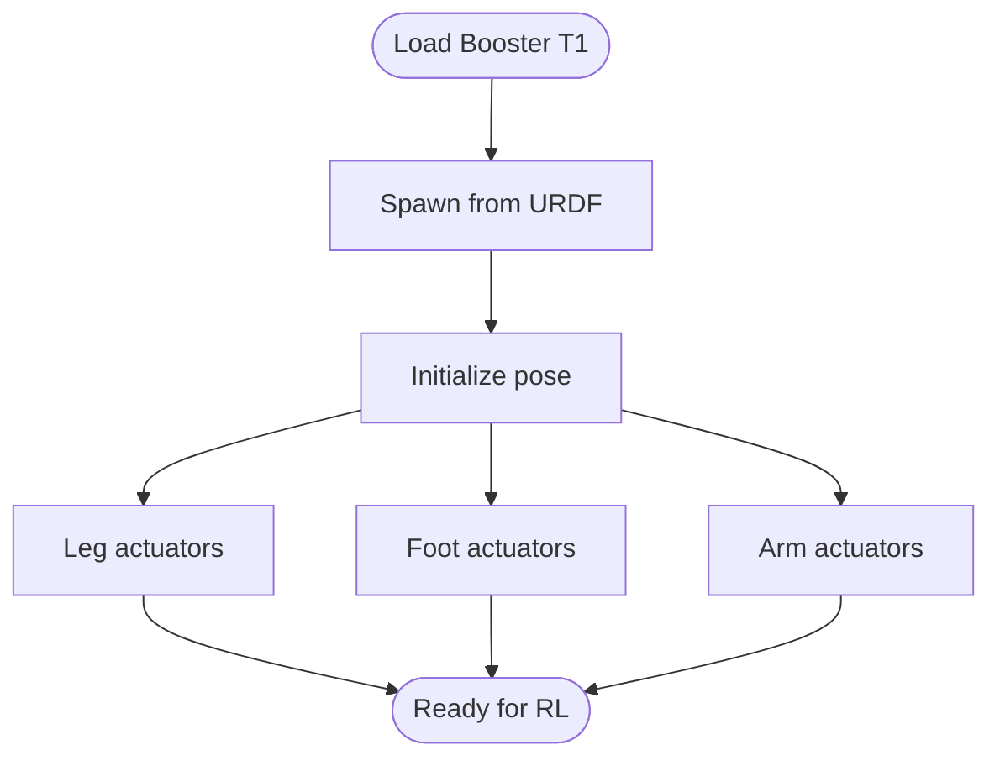

**Diagram sources**
- [assets/booster.py](file://source/robot_lab/robot_lab/assets/booster.py#L10-L110)
- [booster/t1_description/urdf/robot.urdf](file://source/robot_lab/data/Robots/booster/t1_description/urdf/robot.urdf#L1-L200)

**Section sources**
- [assets/booster.py](file://source/robot_lab/robot_lab/assets/booster.py#L10-L110)

## Dependency Analysis
- Asset configurations depend on URDF paths resolved from the extension data directory.
- Environment registration depends on asset configurations and agent runner configurations located alongside environment definitions.

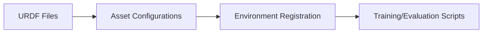

**Diagram sources**
- [assets/__init__.py](file://source/robot_lab/robot_lab/assets/__init__.py#L18-L30)
- [README.md](file://README.md#L383-L426)

**Section sources**
- [assets/__init__.py](file://source/robot_lab/robot_lab/assets/__init__.py#L18-L30)
- [README.md](file://README.md#L383-L426)

## Performance Considerations
- Actuator limits:
  - Effort and velocity limits directly constrain control authority and energy consumption.
  - Stiffness and damping influence stability and response speed; higher stiffness can improve tracking but may increase oscillations.
- Solver iterations:
  - Increased position/velocity iteration counts improve constraint satisfaction but raise computational cost.
- Contact modeling:
  - Friction and contact parameters affect traction and stability on rough terrain.
- Mass and inertia:
  - Larger mass/inertia can improve robustness but may reduce acceleration and agility.

[No sources needed since this section provides general guidance]

## Troubleshooting Guide
- If simulations fail to initialize or exhibit instability:
  - Verify actuator limits and solver iteration counts in asset configurations.
  - Confirm URDF paths and asset resolution in the asset module.
- If contact forces appear unrealistic:
  - Review contact materials and friction parameters in URDFs.
- If environment registration errors occur:
  - Ensure environment registration entries match the expected naming convention and entry points.

**Section sources**
- [assets/__init__.py](file://source/robot_lab/robot_lab/assets/__init__.py#L18-L30)
- [README.md](file://README.md#L383-L426)

## Conclusion
This document mapped the supported robot families to their asset configurations and URDF specifications, highlighting actuator groups, initial poses, and simulation parameters. By understanding these components, users can select appropriate models for reinforcement learning tasks, tune actuator and solver parameters for stability, and leverage the environment registration system for training and evaluation.