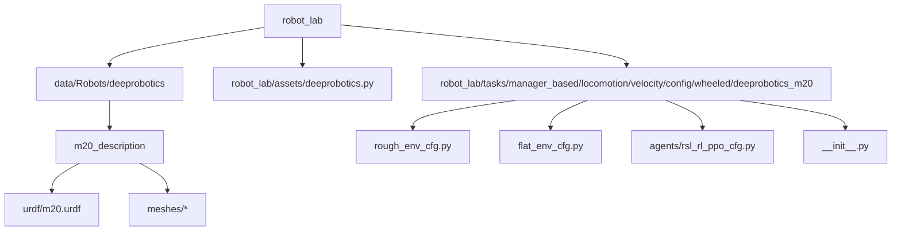
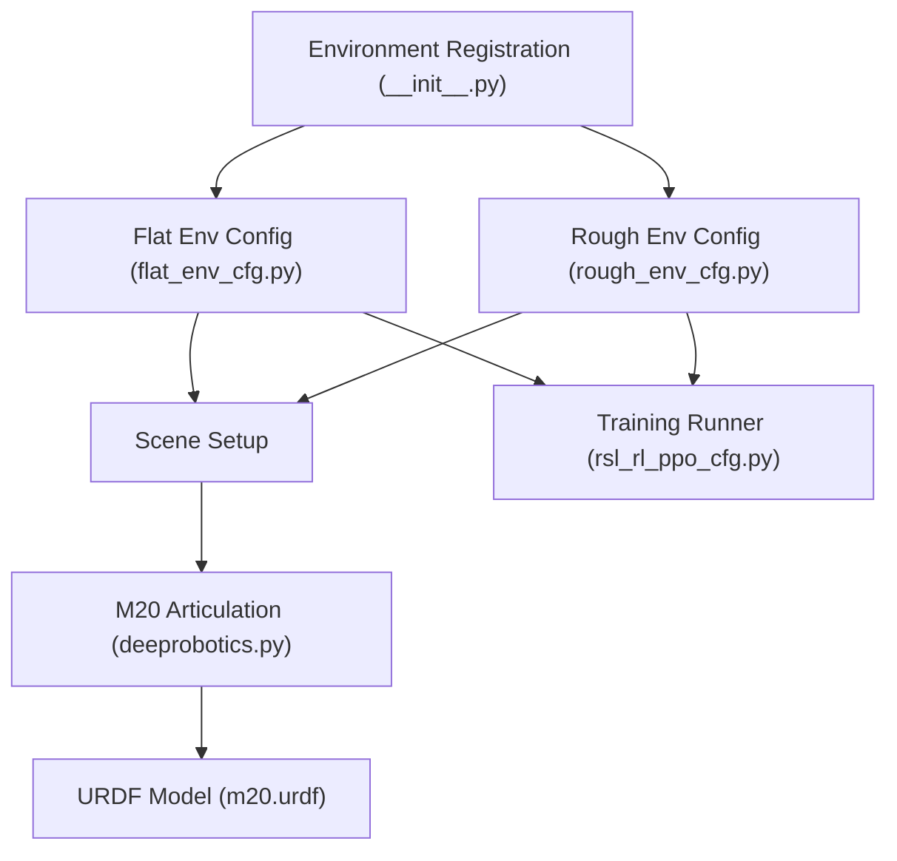
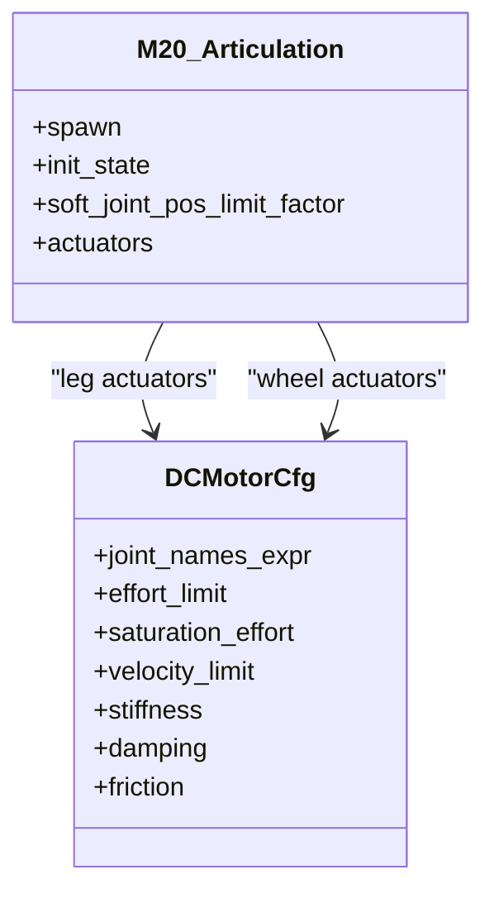
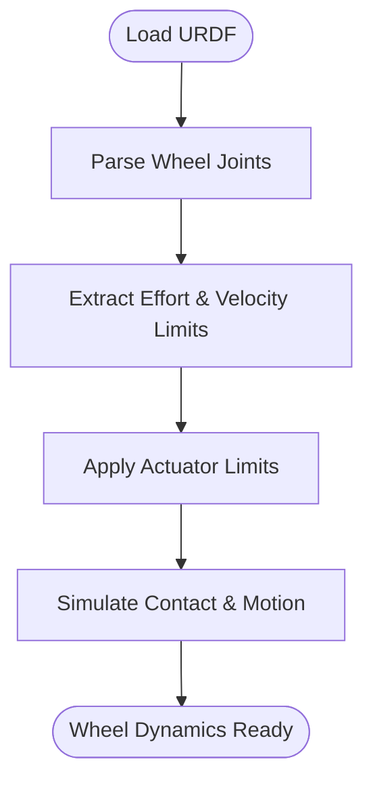
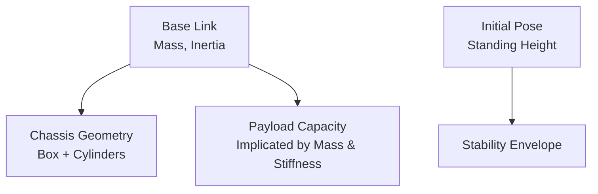
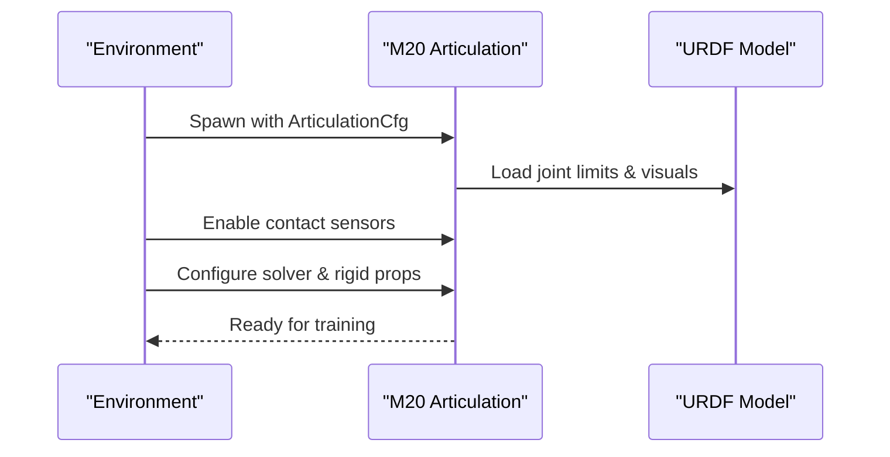
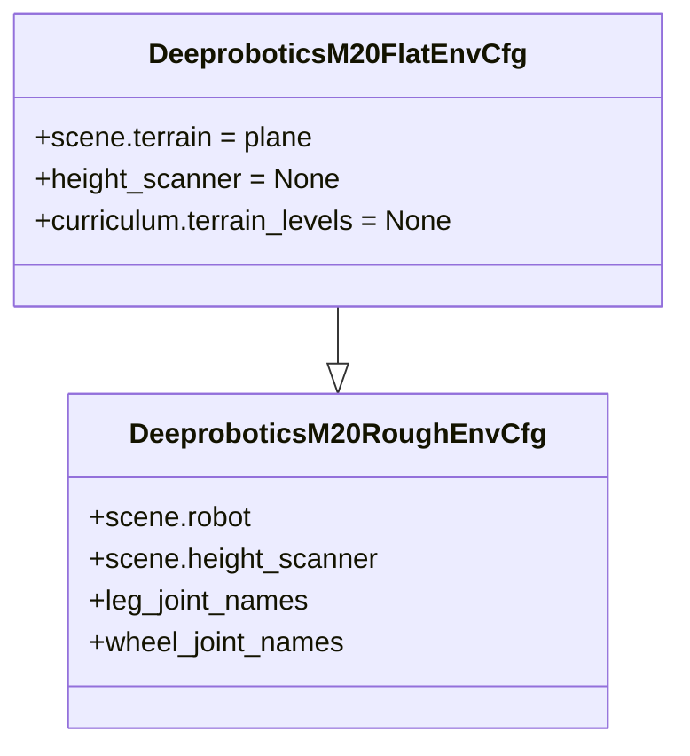
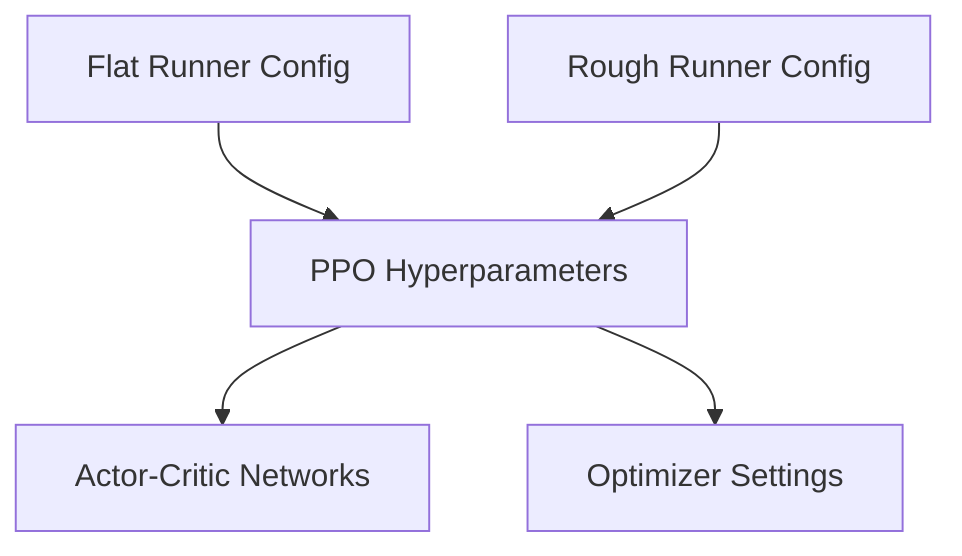
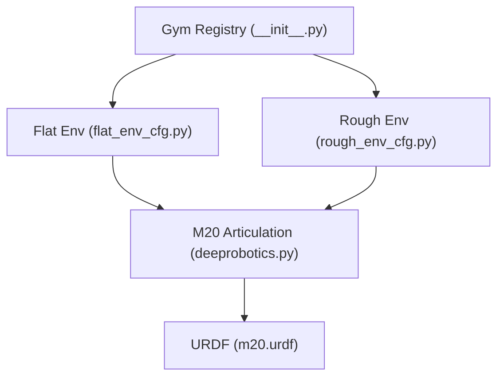

# Deeprobotics M20

<cite>
**Referenced Files in This Document**
- [README.md](file://README.md)
- [deeprobotics.py](file://source/robot_lab/robot_lab/assets/deeprobotics.py)
- [m20.urdf](file://source/robot_lab/data/Robots/deeprobotics/m20_description/urdf/m20.urdf)
- [rough_env_cfg.py](file://source/robot_lab/robot_lab/tasks/manager_based/locomotion/velocity/config/wheeled/deeprobotics_m20/rough_env_cfg.py)
- [flat_env_cfg.py](file://source/robot_lab/robot_lab/tasks/manager_based/locomotion/velocity/config/wheeled/deeprobotics_m20/flat_env_cfg.py)
- [__init__.py](file://source/robot_lab/robot_lab/tasks/manager_based/locomotion/velocity/config/wheeled/deeprobotics_m20/__init__.py)
- [rsl_rl_ppo_cfg.py](file://source/robot_lab/robot_lab/tasks/manager_based/locomotion/velocity/config/wheeled/deeprobotics_m20/agents/rsl_rl_ppo_cfg.py)
</cite>

## Table of Contents
1. [Introduction](#introduction)
2. [Project Structure](#project-structure)
3. [Core Components](#core-components)
4. [Architecture Overview](#architecture-overview)
5. [Detailed Component Analysis](#detailed-component-analysis)
6. [Dependency Analysis](#dependency-analysis)
7. [Performance Considerations](#performance-considerations)
8. [Troubleshooting Guide](#troubleshooting-guide)
9. [Conclusion](#conclusion)
10. [Appendices](#appendices)

## Introduction
This document provides comprehensive documentation for the Deeprobotics M20 wheeled platform within the robot_lab repository. It focuses on the specialized wheel mechanisms and payload capacity, detailing the unique wheel configuration designed for industrial applications, including wheel diameter specifications, torque characteristics, and speed limitations. It explains the actuator mapping and control systems optimized for heavy payloads and extended operation times, and documents the physical dimensions, weight capacity, and operational envelope that distinguish the M20 from other wheeled robots. Simulation parameters tailored for industrial-grade wheel dynamics and contact forces are covered, alongside practical applications such as warehouse automation, cargo transport, and mobile robotics platforms. Training configurations and environment setups optimized for industrial scenarios are also included.

## Project Structure
The M20 is integrated into the robot_lab ecosystem as a wheeled robot with dedicated environment configurations and training runners. The repository organizes assets, URDF definitions, and environment/task configurations by robot category and task type.

**Diagram sources**
- [README.md](file://README.md#L1-L501)
- [deeprobotics.py](file://source/robot_lab/robot_lab/assets/deeprobotics.py#L65-L122)
- [m20.urdf](file://source/robot_lab/data/Robots/deeprobotics/m20_description/urdf/m20.urdf#L1-L555)
- [rough_env_cfg.py](file://source/robot_lab/robot_lab/tasks/manager_based/locomotion/velocity/config/wheeled/deeprobotics_m20/rough_env_cfg.py#L1-L79)
- [flat_env_cfg.py](file://source/robot_lab/robot_lab/tasks/manager_based/locomotion/velocity/config/wheeled/deeprobotics_m20/flat_env_cfg.py#L1-L30)
- [__init__.py](file://source/robot_lab/robot_lab/tasks/manager_based/locomotion/velocity/config/wheeled/deeprobotics_m20/__init__.py#L1-L33)
- [rsl_rl_ppo_cfg.py](file://source/robot_lab/robot_lab/tasks/manager_based/locomotion/velocity/config/wheeled/deeprobotics_m20/agents/rsl_rl_ppo_cfg.py#L1-L46)

**Section sources**
- [README.md](file://README.md#L17-L31)
- [deeprobotics.py](file://source/robot_lab/robot_lab/assets/deeprobotics.py#L65-L122)
- [m20.urdf](file://source/robot_lab/data/Robots/deeprobotics/m20_description/urdf/m20.urdf#L1-L555)
- [rough_env_cfg.py](file://source/robot_lab/robot_lab/tasks/manager_based/locomotion/velocity/config/wheeled/deeprobotics_m20/rough_env_cfg.py#L51-L79)
- [flat_env_cfg.py](file://source/robot_lab/robot_lab/tasks/manager_based/locomotion/velocity/config/wheeled/deeprobotics_m20/flat_env_cfg.py#L9-L30)
- [__init__.py](file://source/robot_lab/robot_lab/tasks/manager_based/locomotion/velocity/config/wheeled/deeprobotics_m20/__init__.py#L12-L32)
- [rsl_rl_ppo_cfg.py](file://source/robot_lab/robot_lab/tasks/manager_based/locomotion/velocity/config/wheeled/deeprobotics_m20/agents/rsl_rl_ppo_cfg.py#L9-L46)

## Core Components
- M20 Articulation Configuration: Defines the robot’s spawn parameters, initial state, actuator mapping, and simulation properties.
- URDF Definition: Provides the physical model, inertial properties, collision geometry, and joint limits for the M20.
- Environment Configurations: Provide two variants—flat and rough—tailored for different terrains and training objectives.
- Training Runners: Configure reinforcement learning hyperparameters for PPO-based training.

Key implementation references:
- M20 articulation configuration and actuator mapping
- URDF joint limits and wheel specifications
- Environment registration and scene setup
- Training runner configurations

**Section sources**
- [deeprobotics.py](file://source/robot_lab/robot_lab/assets/deeprobotics.py#L65-L122)
- [m20.urdf](file://source/robot_lab/data/Robots/deeprobotics/m20_description/urdf/m20.urdf#L65-L170)
- [m20.urdf](file://source/robot_lab/data/Robots/deeprobotics/m20_description/urdf/m20.urdf#L292-L300)
- [m20.urdf](file://source/robot_lab/data/Robots/deeprobotics/m20_description/urdf/m20.urdf#L420-L428)
- [m20.urdf](file://source/robot_lab/data/Robots/deeprobotics/m20_description/urdf/m20.urdf#L548-L555)
- [rough_env_cfg.py](file://source/robot_lab/robot_lab/tasks/manager_based/locomotion/velocity/config/wheeled/deeprobotics_m20/rough_env_cfg.py#L51-L79)
- [flat_env_cfg.py](file://source/robot_lab/robot_lab/tasks/manager_based/locomotion/velocity/config/wheeled/deeprobotics_m20/flat_env_cfg.py#L9-L30)
- [__init__.py](file://source/robot_lab/robot_lab/tasks/manager_based/locomotion/velocity/config/wheeled/deeprobotics_m20/__init__.py#L12-L32)
- [rsl_rl_ppo_cfg.py](file://source/robot_lab/robot_lab/tasks/manager_based/locomotion/velocity/config/wheeled/deeprobotics_m20/agents/rsl_rl_ppo_cfg.py#L9-L46)

## Architecture Overview
The M20 integrates with the Isaac Lab RL framework. The environment registers two Gym environments (flat and rough), each backed by a shared base configuration class. The M20 articulation is spawned into the scene with actuator mappings and simulation properties. The training runners configure PPO hyperparameters for policy optimization.

**Diagram sources**
- [__init__.py](file://source/robot_lab/robot_lab/tasks/manager_based/locomotion/velocity/config/wheeled/deeprobotics_m20/__init__.py#L12-L32)
- [flat_env_cfg.py](file://source/robot_lab/robot_lab/tasks/manager_based/locomotion/velocity/config/wheeled/deeprobotics_m20/flat_env_cfg.py#L9-L30)
- [rough_env_cfg.py](file://source/robot_lab/robot_lab/tasks/manager_based/locomotion/velocity/config/wheeled/deeprobotics_m20/rough_env_cfg.py#L51-L79)
- [deeprobotics.py](file://source/robot_lab/robot_lab/assets/deeprobotics.py#L65-L122)
- [m20.urdf](file://source/robot_lab/data/Robots/deeprobotics/m20_description/urdf/m20.urdf#L1-L555)
- [rsl_rl_ppo_cfg.py](file://source/robot_lab/robot_lab/tasks/manager_based/locomotion/velocity/config/wheeled/deeprobotics_m20/agents/rsl_rl_ppo_cfg.py#L9-L46)

## Detailed Component Analysis

### M20 Actuator Mapping and Control Systems
The M20 uses dual actuator groups:
- Leg joints (hipx, hipy, knee): Controlled with a DCMotorCfg configured for higher torque and moderate velocity.
- Wheel joints: Controlled with a separate DCMotorCfg optimized for wheel dynamics with distinct effort and velocity limits.

Actuator parameters:
- Leg group: effort_limit, saturation_effort, velocity_limit, stiffness, damping
- Wheel group: effort_limit, saturation_effort, velocity_limit, stiffness, damping

Initial joint positions and velocities are set to a stable stance with wheels idle.

**Diagram sources**
- [deeprobotics.py](file://source/robot_lab/robot_lab/assets/deeprobotics.py#L65-L122)

**Section sources**
- [deeprobotics.py](file://source/robot_lab/robot_lab/assets/deeprobotics.py#L101-L120)
- [rough_env_cfg.py](file://source/robot_lab/robot_lab/tasks/manager_based/locomotion/velocity/config/wheeled/deeprobotics_m20/rough_env_cfg.py#L59-L70)

### Wheel Specifications and Dynamics
Wheel diameter and contact geometry:
- Wheel collision geometry is modeled as cylinders with radius and width derived from the URDF.
- Joint limits specify effort and velocity caps for wheel rotation.

Joint limits (example per side):
- Wheel joint: effort limit and velocity limit define torque and rotational speed constraints.

**Diagram sources**
- [m20.urdf](file://source/robot_lab/data/Robots/deeprobotics/m20_description/urdf/m20.urdf#L142-L170)
- [m20.urdf](file://source/robot_lab/data/Robots/deeprobotics/m20_description/urdf/m20.urdf#L270-L298)
- [m20.urdf](file://source/robot_lab/data/Robots/deeprobotics/m20_description/urdf/m20.urdf#L398-L426)
- [m20.urdf](file://source/robot_lab/data/Robots/deeprobotics/m20_description/urdf/m20.urdf#L526-L554)

**Section sources**
- [m20.urdf](file://source/robot_lab/data/Robots/deeprobotics/m20_description/urdf/m20.urdf#L157-L162)
- [m20.urdf](file://source/robot_lab/data/Robots/deeprobotics/m20_description/urdf/m20.urdf#L285-L290)
- [m20.urdf](file://source/robot_lab/data/Robots/deeprobotics/m20_description/urdf/m20.urdf#L413-L418)
- [m20.urdf](file://source/robot_lab/data/Robots/deeprobotics/m20_description/urdf/m20.urdf#L541-L546)

### Physical Dimensions, Weight Capacity, and Operational Envelope
Physical model and mass:
- The base link defines total mass and inertia properties.
- Collision geometry includes box and cylinder primitives approximating the chassis and supporting cylindrical structures.

Operational envelope indicators:
- Initial state sets a standing height suitable for industrial floor navigation.
- Joint position ranges and limits constrain motion to maintain stability and payload-carrying capability.

**Diagram sources**
- [m20.urdf](file://source/robot_lab/data/Robots/deeprobotics/m20_description/urdf/m20.urdf#L9-L42)
- [deeprobotics.py](file://source/robot_lab/robot_lab/assets/deeprobotics.py#L88-L99)

**Section sources**
- [m20.urdf](file://source/robot_lab/data/Robots/deeprobotics/m20_description/urdf/m20.urdf#L9-L42)
- [deeprobotics.py](file://source/robot_lab/robot_lab/assets/deeprobotics.py#L88-L99)

### Simulation Parameters for Industrial-Grade Wheel Dynamics
Simulation properties:
- Rigid body properties disable gravity, set high max velocities, and configure penetration handling.
- Articulation root properties tune solver iteration counts for stability.
- Joint drive PD gains are set to zero, indicating free-motor-style actuation.

Contact sensors are activated to support robust wheel-ground interaction feedback.

**Diagram sources**
- [deeprobotics.py](file://source/robot_lab/robot_lab/assets/deeprobotics.py#L65-L100)
- [m20.urdf](file://source/robot_lab/data/Robots/deeprobotics/m20_description/urdf/m20.urdf#L1-L8)

**Section sources**
- [deeprobotics.py](file://source/robot_lab/robot_lab/assets/deeprobotics.py#L70-L86)
- [m20.urdf](file://source/robot_lab/data/Robots/deeprobotics/m20_description/urdf/m20.urdf#L6-L8)

### Environment Variants: Flat vs. Rough Terrain
- Flat environment replaces terrain with a plane, disables height scanning, and removes terrain curriculum for simplified training.
- Rough environment retains terrain complexity and height scanning for challenging scenarios.

Both inherit a shared base configuration and scene setup.

**Diagram sources**
- [rough_env_cfg.py](file://source/robot_lab/robot_lab/tasks/manager_based/locomotion/velocity/config/wheeled/deeprobotics_m20/rough_env_cfg.py#L51-L79)
- [flat_env_cfg.py](file://source/robot_lab/robot_lab/tasks/manager_based/locomotion/velocity/config/wheeled/deeprobotics_m20/flat_env_cfg.py#L9-L30)

**Section sources**
- [flat_env_cfg.py](file://source/robot_lab/robot_lab/tasks/manager_based/locomotion/velocity/config/wheeled/deeprobotics_m20/flat_env_cfg.py#L10-L30)
- [rough_env_cfg.py](file://source/robot_lab/robot_lab/tasks/manager_based/locomotion/velocity/config/wheeled/deeprobotics_m20/rough_env_cfg.py#L72-L79)

### Training Configurations and Hyperparameters
- PPO runner configurations define network architectures, learning rates, KL divergence targets, and training iterations for both flat and rough variants.
- Experiment names differentiate flat versus rough training runs.

**Diagram sources**
- [rsl_rl_ppo_cfg.py](file://source/robot_lab/robot_lab/tasks/manager_based/locomotion/velocity/config/wheeled/deeprobotics_m20/agents/rsl_rl_ppo_cfg.py#L9-L46)

**Section sources**
- [rsl_rl_ppo_cfg.py](file://source/robot_lab/robot_lab/tasks/manager_based/locomotion/velocity/config/wheeled/deeprobotics_m20/agents/rsl_rl_ppo_cfg.py#L9-L46)

## Dependency Analysis
The M20 environment depends on the shared velocity locomotion base class and registers two Gym environments. The environment configurations depend on the M20 articulation definition and URDF model.

**Diagram sources**
- [__init__.py](file://source/robot_lab/robot_lab/tasks/manager_based/locomotion/velocity/config/wheeled/deeprobotics_m20/__init__.py#L12-L32)
- [flat_env_cfg.py](file://source/robot_lab/robot_lab/tasks/manager_based/locomotion/velocity/config/wheeled/deeprobotics_m20/flat_env_cfg.py#L9-L30)
- [rough_env_cfg.py](file://source/robot_lab/robot_lab/tasks/manager_based/locomotion/velocity/config/wheeled/deeprobotics_m20/rough_env_cfg.py#L51-L79)
- [deeprobotics.py](file://source/robot_lab/robot_lab/assets/deeprobotics.py#L65-L122)
- [m20.urdf](file://source/robot_lab/data/Robots/deeprobotics/m20_description/urdf/m20.urdf#L1-L555)

**Section sources**
- [__init__.py](file://source/robot_lab/robot_lab/tasks/manager_based/locomotion/velocity/config/wheeled/deeprobotics_m20/__init__.py#L12-L32)
- [rough_env_cfg.py](file://source/robot_lab/robot_lab/tasks/manager_based/locomotion/velocity/config/wheeled/deeprobotics_m20/rough_env_cfg.py#L72-L79)

## Performance Considerations
- Actuator limits: The wheel group’s effort and velocity limits directly constrain torque delivery and maximum rotational speed, impacting payload handling and acceleration.
- Solver settings: Low solver velocity iterations and tuned position iterations improve stability for wheel-ground contact simulations.
- Contact sensors: Enabled contact sensors facilitate accurate force feedback and terrain interaction modeling.
- Training iterations: Flat environments reduce training iterations compared to rough terrain, accelerating convergence for basic locomotion tasks.

[No sources needed since this section provides general guidance]

## Troubleshooting Guide
- Environment registration: Ensure the Gym environments are registered correctly and the entry points match the configuration files.
- Articulation spawn: Verify the URDF path and asset availability; incorrect paths prevent robot spawning.
- Actuator mismatches: Confirm actuator names align with joint names in the URDF to avoid control errors.
- Training instability: Adjust PPO hyperparameters or solver settings if simulations exhibit jitter or divergence.

**Section sources**
- [__init__.py](file://source/robot_lab/robot_lab/tasks/manager_based/locomotion/velocity/config/wheeled/deeprobotics_m20/__init__.py#L12-L32)
- [deeprobotics.py](file://source/robot_lab/robot_lab/assets/deeprobotics.py#L65-L100)
- [rsl_rl_ppo_cfg.py](file://source/robot_lab/robot_lab/tasks/manager_based/locomotion/velocity/config/wheeled/deeprobotics_m20/agents/rsl_rl_ppo_cfg.py#L9-L46)

## Conclusion
The Deeprobotics M20 in robot_lab is configured for industrial-grade wheeled locomotion with explicit actuator mapping for leg and wheel systems, precise simulation properties for robust wheel dynamics, and environment variants optimized for both flat and rough terrains. The provided training configurations and environment setups enable efficient development and deployment of policies for applications such as warehouse automation and cargo transport.

[No sources needed since this section summarizes without analyzing specific files]

## Appendices

### Practical Applications
- Warehouse automation: The M20’s wheel configuration and payload-related actuator limits support sustained operation on flat surfaces typical of indoor logistics environments.
- Cargo transport: The articulated leg actuators and wheel actuators can be combined to handle uneven ground and maintain payload stability during transport.
- Mobile robotics platforms: The environment variants and training runners provide a foundation for developing adaptive locomotion policies in structured and unstructured industrial settings.

[No sources needed since this section provides general guidance]