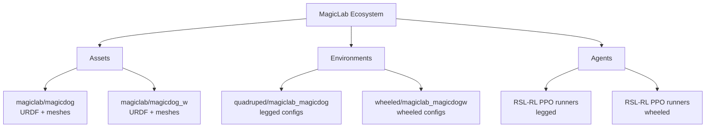
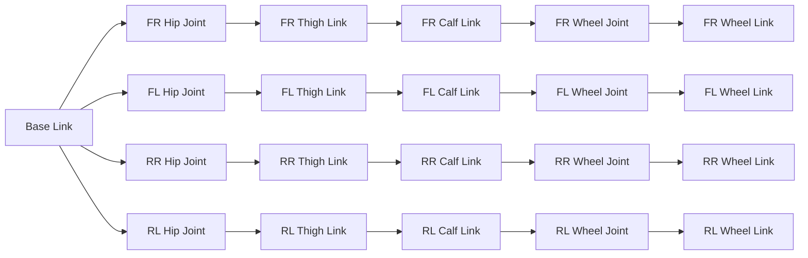
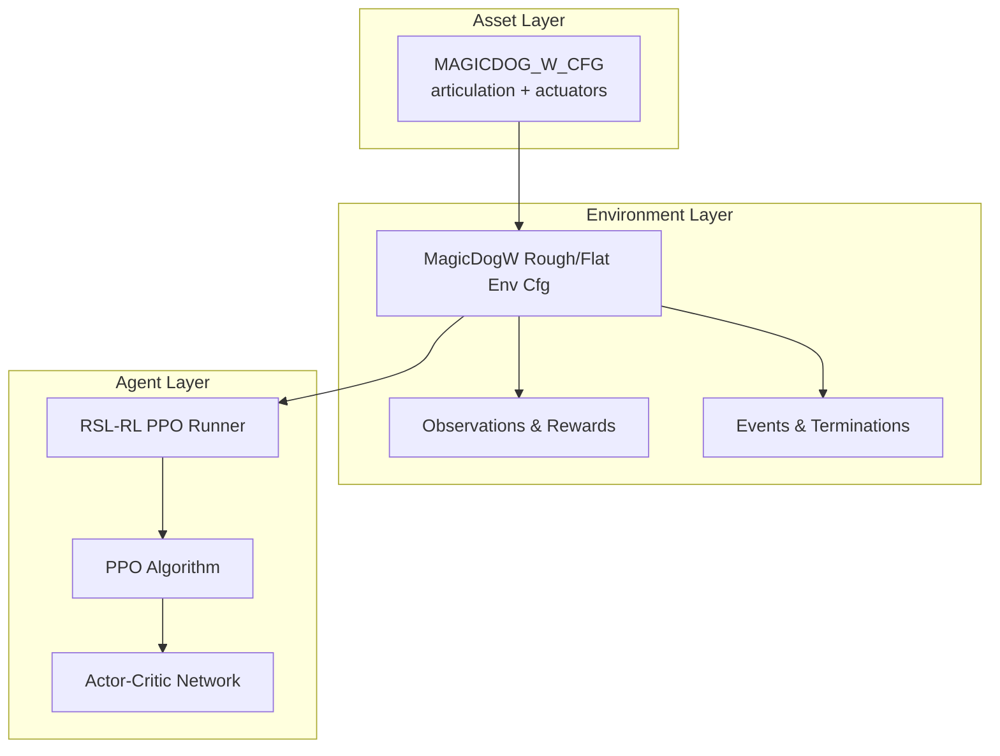
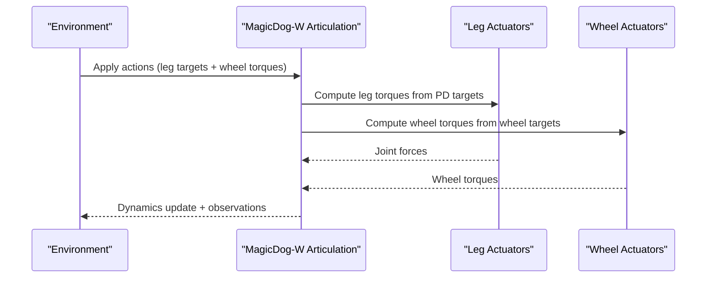
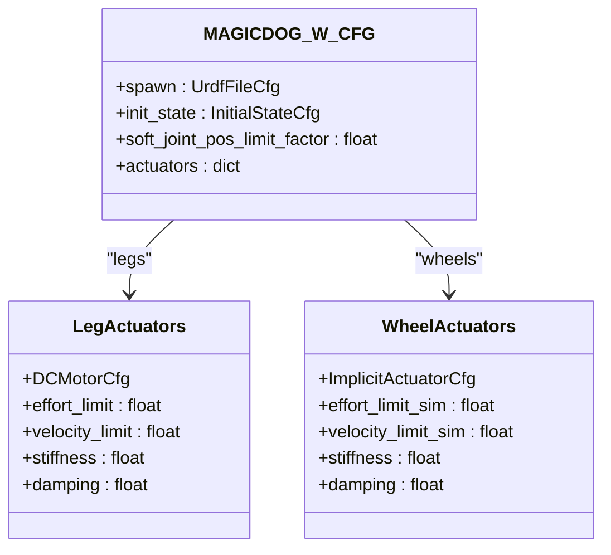
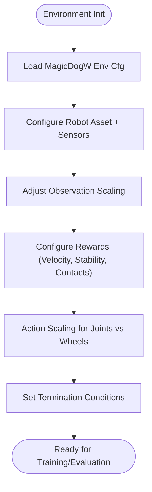
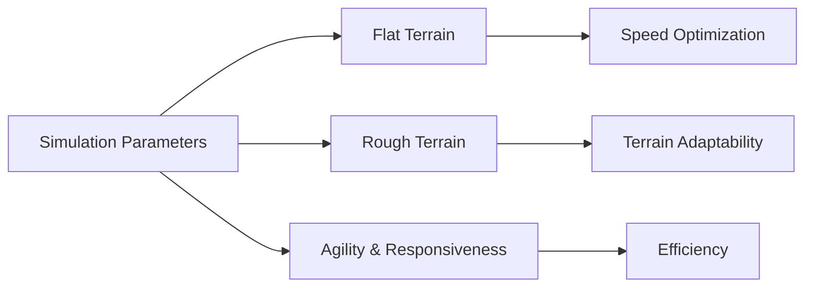
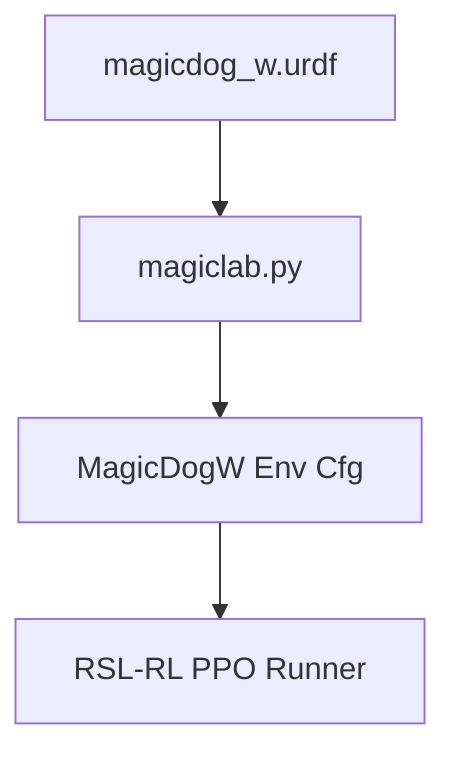

# MagicLab MagicDog-W

<cite>
**Referenced Files in This Document**
- [README.md](file://README.md)
- [magicdog.urdf](file://source/robot_lab/data/Robots/magiclab/magicdog/urdf/magicdog.urdf)
- [magicdog_w.urdf](file://source/robot_lab/data/Robots/magiclab/magicdog_w/urdf/magicdog_w.urdf)
- [magiclab.py](file://source/robot_lab/robot_lab/assets/magiclab.py)
- [rough_env_cfg.py](file://source/robot_lab/robot_lab/tasks/manager_based/locomotion/velocity/config/quadruped/magiclab_magicdog/rough_env_cfg.py)
- [flat_env_cfg.py](file://source/robot_lab/robot_lab/tasks/manager_based/locomotion/velocity/config/quadruped/magiclab_magicdog/flat_env_cfg.py)
- [rsl_rl_ppo_cfg.py](file://source/robot_lab/robot_lab/tasks/manager_based/locomotion/velocity/config/quadruped/magiclab_magicdog/agents/rsl_rl_ppo_cfg.py)
- [magicdog_w rough env cfg.py](file://source/robot_lab/robot_lab/tasks/manager_based/locomotion/velocity/config/wheeled/magiclab_magicdogw/rough_env_cfg.py)
- [magicdog_w flat env cfg.py](file://source/robot_lab/robot_lab/tasks/manager_based/locomotion/velocity/config/wheeled/magiclab_magicdogw/flat_env_cfg.py)
- [magicdog_w rsl_rl ppo cfg.py](file://source/robot_lab/robot_lab/tasks/manager_based/locomotion/velocity/config/wheeled/magiclab_magicdogw/agents/rsl_rl_ppo_cfg.py)
</cite>

## Table of Contents
1. [Introduction](#introduction)
2. [Project Structure](#project-structure)
3. [Core Components](#core-components)
4. [Architecture Overview](#architecture-overview)
5. [Detailed Component Analysis](#detailed-component-analysis)
6. [Dependency Analysis](#dependency-analysis)
7. [Performance Considerations](#performance-considerations)
8. [Troubleshooting Guide](#troubleshooting-guide)
9. [Conclusion](#conclusion)
10. [Appendices](#appendices)

## Introduction
MagicLab MagicDog-W is the wheeled adaptation of the popular MagicLab MagicDog quadruped platform. This document explains how the original four-legged design was transformed into a wheeled variant, focusing on wheel integration methodology, actuator modifications, and control interface adaptations. It also highlights the unique characteristics that distinguish MagicDog-W from other wheeled robots, including wheel placement, torque distribution, and simulation parameters optimized for agility and responsiveness. Practical applications in entertainment robotics, education, and demonstrations are covered, alongside training configurations and environment setups tailored for the MagicLab ecosystem.

## Project Structure
The repository organizes MagicDog and MagicDog-W assets and training configurations under a unified structure:
- Assets: URDF models and mesh files for both legged and wheeled variants
- Environments: Task-specific configuration for locomotion velocity control
- Agents: Reinforcement learning runner configurations for training and evaluation

**Diagram sources**
- [README.md](file://README.md#L17-L41)
- [magicdog.urdf](file://source/robot_lab/data/Robots/magiclab/magicdog/urdf/magicdog.urdf#L1-L509)
- [magicdog_w.urdf](file://source/robot_lab/data/Robots/magiclab/magicdog_w/urdf/magicdog_w.urdf#L1-L532)
- [magiclab.py](file://source/robot_lab/robot_lab/assets/magiclab.py#L190-L295)

**Section sources**
- [README.md](file://README.md#L17-L41)

## Core Components
MagicDog-W integrates wheels into the existing MagicDog kinematic chain while preserving the articulated leg structure for stability and balance. The transformation involves:
- Wheel joints placed at the distal end of the calf segment (knee) to act as rolling joints
- Dedicated wheel actuators with distinct torque and velocity limits from leg actuators
- Updated inertia and mass properties to reflect the new wheel components

Key differences between the legged and wheeled models:
- Legged model uses spherical feet for contact
- Wheeled model replaces distal foot segments with wheel links and introduces revolute wheel joints

**Diagram sources**
- [magicdog_w.urdf](file://source/robot_lab/data/Robots/magiclab/magicdog_w/urdf/magicdog_w.urdf#L162-L189)
- [magicdog_w.urdf](file://source/robot_lab/data/Robots/magiclab/magicdog_w/urdf/magicdog_w.urdf#L276-L283)
- [magicdog_w.urdf](file://source/robot_lab/data/Robots/magiclab/magicdog_w/urdf/magicdog_w.urdf#L390-L397)
- [magicdog_w.urdf](file://source/robot_lab/data/Robots/magiclab/magicdog_w/urdf/magicdog_w.urdf#L504-L511)

**Section sources**
- [magicdog_w.urdf](file://source/robot_lab/data/Robots/magiclab/magicdog_w/urdf/magicdog_w.urdf#L1-L532)

## Architecture Overview
The MagicLab ecosystem composes the robot asset, environment task, and agent trainer to deliver a complete RL development pipeline. For MagicDog-W, the architecture adapts the quadruped locomotion task to accommodate wheel joints and adjust reward shaping and action scaling accordingly.

**Diagram sources**
- [magiclab.py](file://source/robot_lab/robot_lab/assets/magiclab.py#L239-L295)
- [rough_env_cfg.py](file://source/robot_lab/robot_lab/tasks/manager_based/locomotion/velocity/config/quadruped/magiclab_magicdog/rough_env_cfg.py#L14-L164)
- [flat_env_cfg.py](file://source/robot_lab/robot_lab/tasks/manager_based/locomotion/velocity/config/quadruped/magiclab_magicdog/flat_env_cfg.py#L9-L30)
- [rsl_rl_ppo_cfg.py](file://source/robot_lab/robot_lab/tasks/manager_based/locomotion/velocity/config/quadruped/magiclab_magicdog/agents/rsl_rl_ppo_cfg.py#L9-L46)

## Detailed Component Analysis

### Wheel Integration Methodology
MagicDog-W retains the hip/thigh/calf kinematic chain while introducing wheel joints at the knee level. The wheel joints are revolute and located at the distal end of the calf link, allowing the robot to roll forward while maintaining the ability to lift the wheel off the ground for balance and gait transitions.

- Wheel placement: Knee-level attachment to calf links
- Wheel joint limits: Separate from leg joints, with dedicated torque and velocity caps
- Wheel actuation: Independent implicit actuators with low-stiffness damping

**Diagram sources**
- [magicdog_w.urdf](file://source/robot_lab/data/Robots/magiclab/magicdog_w/urdf/magicdog_w.urdf#L162-L189)
- [magicdog_w.urdf](file://source/robot_lab/data/Robots/magiclab/magicdog_w/urdf/magicdog_w.urdf#L276-L283)
- [magiclab.py](file://source/robot_lab/robot_lab/assets/magiclab.py#L275-L294)

**Section sources**
- [magicdog_w.urdf](file://source/robot_lab/data/Robots/magiclab/magicdog_w/urdf/magicdog_w.urdf#L162-L189)
- [magicdog_w.urdf](file://source/robot_lab/data/Robots/magiclab/magicdog_w/urdf/magicdog_w.urdf#L276-L283)
- [magiclab.py](file://source/robot_lab/robot_lab/assets/magiclab.py#L275-L294)

### Actuator Modifications
The wheeled configuration employs dual actuator groups:
- Legs: DC motor actuators controlling hip/thigh/calf joints
- Wheels: Implicit actuators controlling wheel rotation

Actuator parameters differ between leg and wheel groups to match mechanical capabilities and control objectives:
- Leg torque/velocity limits tuned for agility and dynamic maneuvers
- Wheel torque/velocity limits optimized for traction and rolling efficiency
- Wheel actuator stiffness set near zero to emulate free-rolling behavior with minimal compliance

**Diagram sources**
- [magiclab.py](file://source/robot_lab/robot_lab/assets/magiclab.py#L239-L295)

**Section sources**
- [magiclab.py](file://source/robot_lab/robot_lab/assets/magiclab.py#L275-L294)

### Control Interface Adaptations
Training environments for MagicDog-W adapt the standard quadruped locomotion task to handle wheel joints:
- Joint naming and selection: Excludes wheel joints from primary joint control targets
- Reward shaping: Emphasizes velocity tracking and stability while reducing penalties for wheel-ground contact
- Observation scaling: Adjusts scales for joint positions/velocities and base dynamics to account for wheel compliance
- Termination conditions: Removes illegal contact checks that could penalize wheel-ground interactions

**Diagram sources**
- [rough_env_cfg.py](file://source/robot_lab/robot_lab/tasks/manager_based/locomotion/velocity/config/quadruped/magiclab_magicdog/rough_env_cfg.py#L27-L164)
- [flat_env_cfg.py](file://source/robot_lab/robot_lab/tasks/manager_based/locomotion/velocity/config/quadruped/magiclab_magicdog/flat_env_cfg.py#L9-L30)

**Section sources**
- [rough_env_cfg.py](file://source/robot_lab/robot_lab/tasks/manager_based/locomotion/velocity/config/quadruped/magiclab_magicdog/rough_env_cfg.py#L27-L164)
- [flat_env_cfg.py](file://source/robot_lab/robot_lab/tasks/manager_based/locomotion/velocity/config/quadruped/magiclab_magicdog/flat_env_cfg.py#L9-L30)

### Simulation Parameters Optimized for Wheeled Agility
The wheeled configuration maintains the platform’s signature agility and responsiveness through:
- Reduced base height scanning and terrain curriculum for faster convergence on flat surfaces
- Lowered joint velocity limits for the legs to improve stability during high-speed rolling
- Increased wheel velocity limit to support rapid acceleration and deceleration
- Tuned reward weights to encourage efficient rolling while preserving balance

**Diagram sources**
- [flat_env_cfg.py](file://source/robot_lab/robot_lab/tasks/manager_based/locomotion/velocity/config/quadruped/magiclab_magicdog/flat_env_cfg.py#L15-L29)
- [rsl_rl_ppo_cfg.py](file://source/robot_lab/robot_lab/tasks/manager_based/locomotion/velocity/config/quadruped/magiclab_magicdog/agents/rsl_rl_ppo_cfg.py#L9-L46)

**Section sources**
- [flat_env_cfg.py](file://source/robot_lab/robot_lab/tasks/manager_based/locomotion/velocity/config/quadruped/magiclab_magicdog/flat_env_cfg.py#L15-L29)
- [rsl_rl_ppo_cfg.py](file://source/robot_lab/robot_lab/tasks/manager_based/locomotion/velocity/config/quadruped/magiclab_magicdog/agents/rsl_rl_ppo_cfg.py#L9-L46)

### Practical Applications
MagicDog-W is well-suited for:
- Entertainment robotics: Smooth, fast movement in indoor environments
- Education: Demonstrating hybrid locomotion (legged + wheeled) and RL control
- Demonstration systems: Rapid traversal over flat terrains with quick direction changes

[No sources needed since this section provides general guidance]

## Dependency Analysis
The MagicDog-W pipeline depends on:
- Asset definition: URDF and actuator configuration
- Environment: Task configuration and reward shaping
- Agent: Training algorithm and network architecture

**Diagram sources**
- [magicdog_w.urdf](file://source/robot_lab/data/Robots/magiclab/magicdog_w/urdf/magicdog_w.urdf#L1-L532)
- [magiclab.py](file://source/robot_lab/robot_lab/assets/magiclab.py#L239-L295)
- [rough_env_cfg.py](file://source/robot_lab/robot_lab/tasks/manager_based/locomotion/velocity/config/quadruped/magiclab_magicdog/rough_env_cfg.py#L14-L164)
- [rsl_rl_ppo_cfg.py](file://source/robot_lab/robot_lab/tasks/manager_based/locomotion/velocity/config/quadruped/magiclab_magicdog/agents/rsl_rl_ppo_cfg.py#L9-L46)

**Section sources**
- [magiclab.py](file://source/robot_lab/robot_lab/assets/magiclab.py#L239-L295)
- [rough_env_cfg.py](file://source/robot_lab/robot_lab/tasks/manager_based/locomotion/velocity/config/quadruped/magiclab_magicdog/rough_env_cfg.py#L14-L164)
- [rsl_rl_ppo_cfg.py](file://source/robot_lab/robot_lab/tasks/manager_based/locomotion/velocity/config/quadruped/magiclab_magicdog/agents/rsl_rl_ppo_cfg.py#L9-L46)

## Performance Considerations
- Speed: Wheel joints enable higher top speeds on flat surfaces compared to legged gaits
- Efficiency: Rolling reduces energy expenditure versus lifting and placing legs
- Terrain adaptability: Wheels excel on smooth floors; leg joints remain for stability and obstacle negotiation
- Control bandwidth: Separate actuators allow precise coordination between leg-based balance and wheel-based propulsion

[No sources needed since this section provides general guidance]

## Troubleshooting Guide
Common issues and resolutions:
- Wheel slippage: Reduce wheel torque limits or increase friction in wheel collisions
- Instability during turns: Adjust reward weights for angular velocity tracking and lateral stability
- Convergence problems: Start with flat terrain configurations and gradually introduce roughness

[No sources needed since this section provides general guidance]

## Conclusion
MagicDog-W preserves the MagicLab platform’s agility and responsiveness while introducing efficient wheeled locomotion. Through careful wheel integration, dual actuator groups, and environment/task adaptations, it achieves superior speed and efficiency on flat terrains while retaining the capability for dynamic maneuvers. The provided configurations and training setups enable rapid deployment for entertainment, education, and demonstration scenarios.

[No sources needed since this section summarizes without analyzing specific files]

## Appendices

### Appendix A: Environment Names and Screenshots
- MagicLab MagicDog-W environment entry is listed in the project overview with a screenshot reference.

**Section sources**
- [README.md](file://README.md#L17-L41)

### Appendix B: Wheeled Environment Configurations
- MagicDog-W has dedicated rough and flat environment configurations and agent runner settings under the wheeled category.

**Section sources**
- [magicdog_w rough env cfg.py](file://source/robot_lab/robot_lab/tasks/manager_based/locomotion/velocity/config/wheeled/magiclab_magicdogw/rough_env_cfg.py)
- [magicdog_w flat env cfg.py](file://source/robot_lab/robot_lab/tasks/manager_based/locomotion/velocity/config/wheeled/magiclab_magicdogw/flat_env_cfg.py)
- [magicdog_w rsl_rl ppo cfg.py](file://source/robot_lab/robot_lab/tasks/manager_based/locomotion/velocity/config/wheeled/magiclab_magicdogw/agents/rsl_rl_ppo_cfg.py)