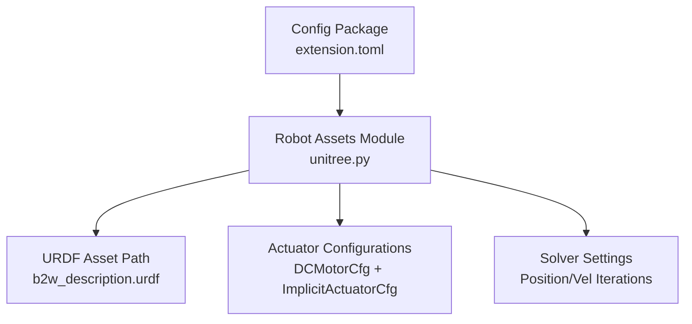
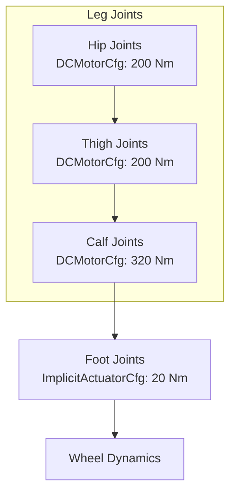
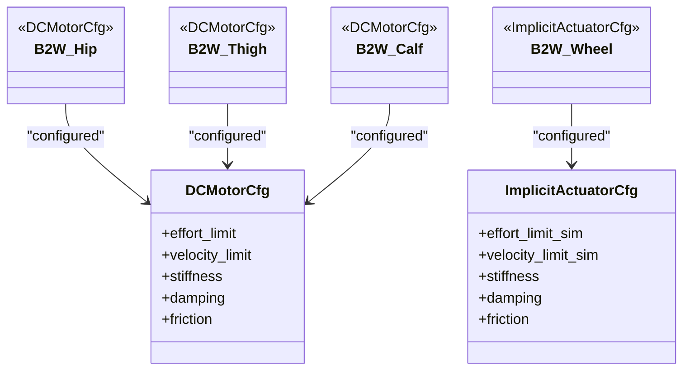
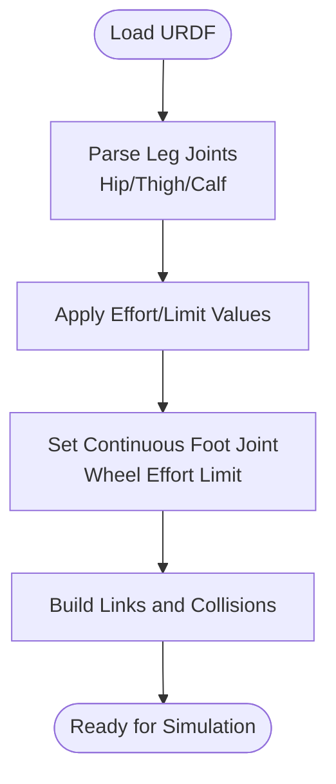
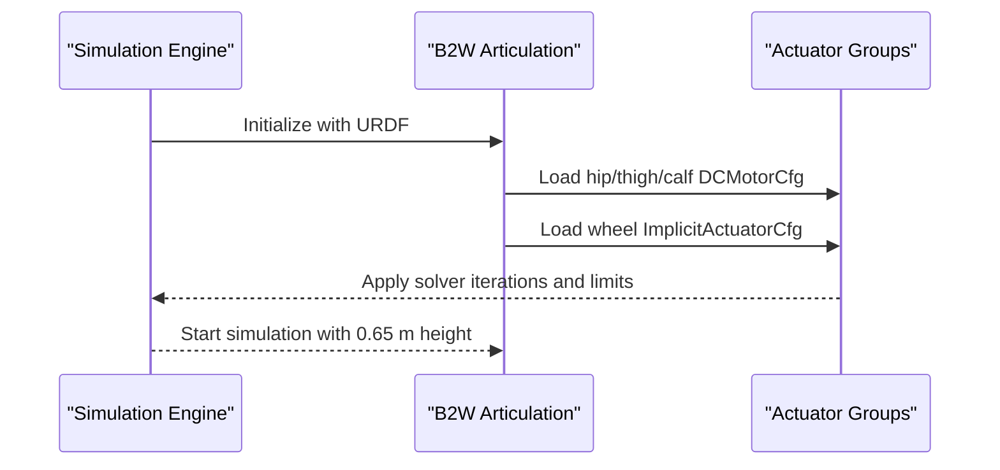
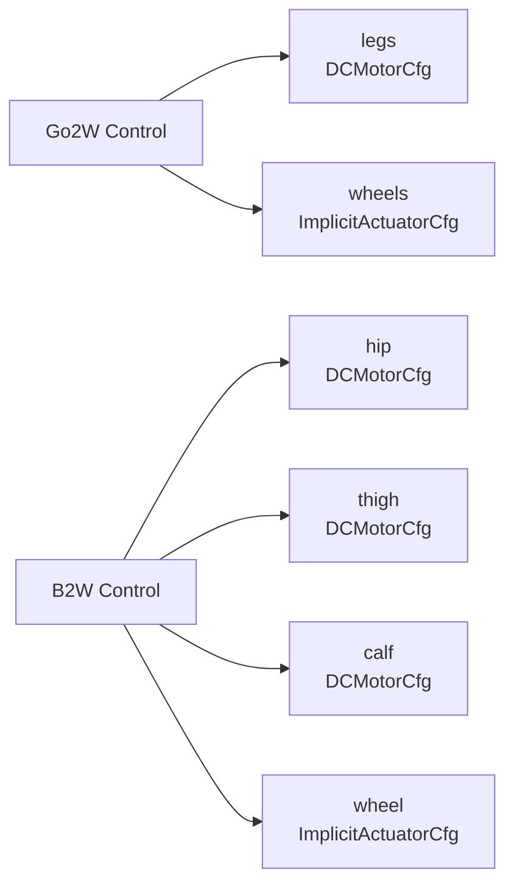
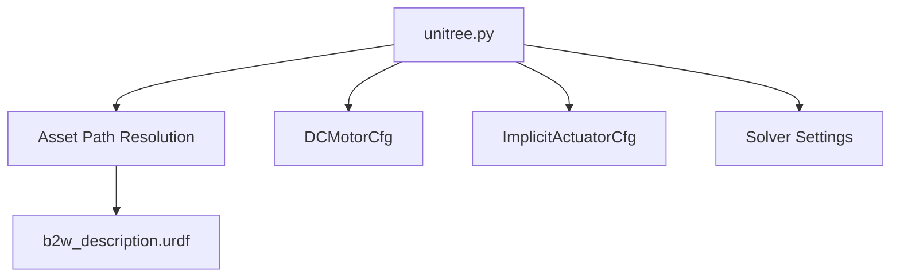

# Unitree B2W

<cite>
**Referenced Files in This Document**
- [b2w_description.urdf](file://source/robot_lab/data/Robots/unitree/b2w_description/urdf/b2w_description.urdf)
- [unitree.py](file://source/robot_lab/robot_lab/assets/unitree.py)
- [extension.toml](file://source/robot_lab/config/extension.toml)
</cite>

## Table of Contents
1. [Introduction](#introduction)
2. [Project Structure](#project-structure)
3. [Core Components](#core-components)
4. [Architecture Overview](#architecture-overview)
5. [Detailed Component Analysis](#detailed-component-analysis)
6. [Dependency Analysis](#dependency-analysis)
7. [Performance Considerations](#performance-considerations)
8. [Troubleshooting Guide](#troubleshooting-guide)
9. [Conclusion](#conclusion)

## Introduction
This document describes the Unitree B2W heavy-duty wheeled quadruped configuration. It explains the enhanced actuator system with separate hip, thigh, and calf motors using DCMotorCfg, plus a dedicated wheel actuator for the foot joint. It details the torque capabilities (hip/thigh at 200.0 Nm, calf at 320.0 Nm, wheel at 20.0 Nm), the height advantage (0.65 m), and simulation optimizations such as solver iteration counts and implicit actuator configuration for wheel dynamics. It contrasts the control architecture with the wheeled Go2W variant and outlines training scenarios suitable for heavy payloads and rough terrain.

## Project Structure
The B2W configuration is defined in the robot assets module and loaded from the URDF description. The configuration references the B2W URDF and sets up actuators and solver parameters for simulation.

**Diagram sources**
- [unitree.py](file://source/robot_lab/robot_lab/assets/unitree.py#L248-L321)
- [b2w_description.urdf](file://source/robot_lab/data/Robots/unitree/b2w_description/urdf/b2w_description.urdf#L1-L574)
- [extension.toml](file://source/robot_lab/config/extension.toml#L1-L36)

**Section sources**
- [unitree.py](file://source/robot_lab/robot_lab/assets/unitree.py#L248-L321)
- [b2w_description.urdf](file://source/robot_lab/data/Robots/unitree/b2w_description/urdf/b2w_description.urdf#L1-L574)
- [extension.toml](file://source/robot_lab/config/extension.toml#L1-L36)

## Core Components
- Robot model: B2W URDF defines four legs, each with hip, thigh, calf, and a dedicated foot (wheel) joint. Joint limits include effort and velocity caps.
- Actuator system:
  - Hip, thigh, and calf joints use DCMotorCfg with high torque limits (200.0 Nm) and moderate velocities.
  - The foot joint uses an ImplicitActuatorCfg configured as a wheel, with a dedicated effort limit of 20.0 Nm and higher velocity limit.
- Simulation settings:
  - Initial height set to 0.65 m.
  - Solver position iteration count is increased compared to other variants to improve stability for the heavy-duty configuration.
- Control architecture difference from Go2W:
  - B2W separates hip/thigh/calf actuators for precise torque distribution and leg kinematics.
  - Go2W uses a single “legs” actuator for the first three joints and a separate “wheels” actuator for the foot joint.

**Section sources**
- [b2w_description.urdf](file://source/robot_lab/data/Robots/unitree/b2w_description/urdf/b2w_description.urdf#L138-L196)
- [b2w_description.urdf](file://source/robot_lab/data/Robots/unitree/b2w_description/urdf/b2w_description.urdf#L216-L222)
- [b2w_description.urdf](file://source/robot_lab/data/Robots/unitree/b2w_description/urdf/b2w_description.urdf#L242-L326)
- [unitree.py](file://source/robot_lab/robot_lab/assets/unitree.py#L248-L321)

## Architecture Overview
The B2W configuration organizes actuators by kinematic role: hip, thigh, calf, and wheel. This enables:
- High torque at the proximal joints (hip/thigh) for payload support.
- Extra torque at the distal joint (calf) for ground interaction.
- Dedicated wheel actuator for low-stiffness rolling dynamics.

**Diagram sources**
- [unitree.py](file://source/robot_lab/robot_lab/assets/unitree.py#L284-L320)
- [b2w_description.urdf](file://source/robot_lab/data/Robots/unitree/b2w_description/urdf/b2w_description.urdf#L138-L196)
- [b2w_description.urdf](file://source/robot_lab/data/Robots/unitree/b2w_description/urdf/b2w_description.urdf#L216-L222)

## Detailed Component Analysis

### Actuator Configuration: Hip, Thigh, Calf, Wheel
- Hip and thigh actuators:
  - Separate DCMotorCfg entries for hip and thigh joints.
  - Effort limit: 200.0 Nm; velocity limit: 23.0 rad/s.
  - Stiffness and damping tuned for robust support and responsiveness.
- Calf actuators:
  - Single DCMotorCfg entry for calf joints.
  - Effort limit: 320.0 Nm; velocity limit: 14.0 rad/s.
  - Higher torque margin for challenging terrain and load handling.
- Wheel actuators:
  - ImplicitActuatorCfg for foot joints.
  - Effort limit: 20.0 Nm; velocity limit: 50.0 rad/s.
  - Zero stiffness and small damping to emulate compliant rolling contact.

**Diagram sources**
- [unitree.py](file://source/robot_lab/robot_lab/assets/unitree.py#L284-L320)

**Section sources**
- [unitree.py](file://source/robot_lab/robot_lab/assets/unitree.py#L284-L320)

### URDF Joint Limits and Geometry
- Hip, thigh, and calf joints define effort and velocity limits consistent with the actuator configurations.
- Foot joints are continuous-type with a dedicated effort limit for wheel-like motion.
- Visual and collision geometry includes leg segments and foot components.

**Diagram sources**
- [b2w_description.urdf](file://source/robot_lab/data/Robots/unitree/b2w_description/urdf/b2w_description.urdf#L138-L196)
- [b2w_description.urdf](file://source/robot_lab/data/Robots/unitree/b2w_description/urdf/b2w_description.urdf#L216-L222)

**Section sources**
- [b2w_description.urdf](file://source/robot_lab/data/Robots/unitree/b2w_description/urdf/b2w_description.urdf#L138-L196)
- [b2w_description.urdf](file://source/robot_lab/data/Robots/unitree/b2w_description/urdf/b2w_description.urdf#L216-L222)

### Simulation Optimizations
- Increased solver position iteration count improves numerical stability for the heavier configuration.
- Implicit actuator configuration for the wheel allows compliant contact while maintaining simulation efficiency.
- Initial configuration raises the base height to 0.65 m to accommodate the increased mass and payload envelope.

**Diagram sources**
- [unitree.py](file://source/robot_lab/robot_lab/assets/unitree.py#L248-L321)

**Section sources**
- [unitree.py](file://source/robot_lab/robot_lab/assets/unitree.py#L248-L321)

### Control Architecture Difference from Go2W
- Go2W uses a unified “legs” actuator for hip/thigh/calf and a separate “wheels” actuator for foot joints.
- B2W splits actuators into “hip,” “thigh,” “calf,” and “wheel,” enabling finer control and higher torque margins per kinematic segment.

**Diagram sources**
- [unitree.py](file://source/robot_lab/robot_lab/assets/unitree.py#L121-L177)
- [unitree.py](file://source/robot_lab/robot_lab/assets/unitree.py#L248-L321)

**Section sources**
- [unitree.py](file://source/robot_lab/robot_lab/assets/unitree.py#L121-L177)
- [unitree.py](file://source/robot_lab/robot_lab/assets/unitree.py#L248-L321)

### Training Scenarios for Heavy Payloads and Rough Terrain
- Payload-focused scenarios:
  - Increase base mass and center of gravity height (0.65 m) to train stability under load.
  - Use high-effort limits (200–320 Nm) to practice carrying weight on slopes and uneven surfaces.
- Terrain adaptation:
  - Train locomotion on rough, uneven terrains to exploit the calf’s extra torque margin.
  - Utilize the wheel actuator’s low-stiffness dynamics for compliant rolling contact.
- Control strategy:
  - Leverage the multi-stage actuator system to balance hip/thigh support with calf-ground interaction and wheel compliance.

[No sources needed since this section provides scenario guidance derived from configuration characteristics]

## Dependency Analysis
The B2W configuration depends on:
- URDF asset path resolution via the assets data directory.
- Actuator types provided by the simulation framework (DCMotorCfg, ImplicitActuatorCfg).
- Solver configuration parameters embedded in the articulation configuration.

**Diagram sources**
- [unitree.py](file://source/robot_lab/robot_lab/assets/unitree.py#L248-L321)
- [b2w_description.urdf](file://source/robot_lab/data/Robots/unitree/b2w_description/urdf/b2w_description.urdf#L1-L574)

**Section sources**
- [unitree.py](file://source/robot_lab/robot_lab/assets/unitree.py#L248-L321)
- [b2w_description.urdf](file://source/robot_lab/data/Robots/unitree/b2w_description/urdf/b2w_description.urdf#L1-L574)

## Performance Considerations
- Torque margins:
  - Hip and thigh motors at 200.0 Nm provide strong support for heavy payloads.
  - Calf motors at 320.0 Nm enable aggressive ground interaction for stability and traction.
  - Wheel actuator at 20.0 Nm ensures compliant rolling without stiction.
- Height and payload implications:
  - 0.65 m initial height accommodates increased mass and payload while maintaining dynamic feasibility.
- Simulation stability:
  - Increased solver iterations help maintain stability during high-torque maneuvers and payload-heavy simulations.

[No sources needed since this section provides general guidance derived from configuration parameters]

## Troubleshooting Guide
- Excessive joint torques:
  - Verify actuator effort limits match expectations; hip/thigh at 200 Nm, calf at 320 Nm, wheel at 20 Nm.
- Foot joint instability:
  - Confirm the wheel actuator uses ImplicitActuatorCfg with zero stiffness and minimal damping.
- Solver convergence issues:
  - Ensure solver position iteration count is sufficient for the heavy-duty configuration.
- Height-related issues:
  - Confirm initial base height is set to 0.65 m to avoid collisions with the ground.

**Section sources**
- [unitree.py](file://source/robot_lab/robot_lab/assets/unitree.py#L248-L321)
- [b2w_description.urdf](file://source/robot_lab/data/Robots/unitree/b2w_description/urdf/b2w_description.urdf#L138-L196)
- [b2w_description.urdf](file://source/robot_lab/data/Robots/unitree/b2w_description/urdf/b2w_description.urdf#L216-L222)

## Conclusion
The Unitree B2W configuration delivers a robust, high-torque, multi-stage actuator system tailored for heavy payloads and demanding terrain. Its separation of hip, thigh, calf, and wheel actuators, combined with simulation optimizations and a raised operational height, enables stable and capable locomotion. Compared to the Go2W architecture, B2W’s explicit actuator grouping provides greater control authority and torque margins per kinematic stage.