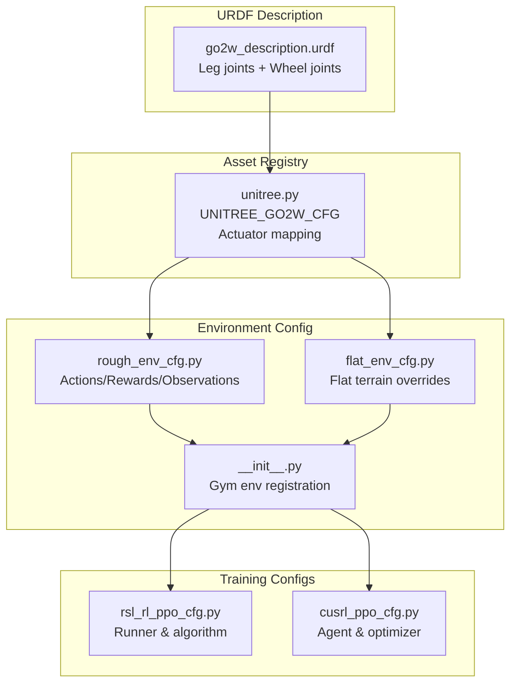
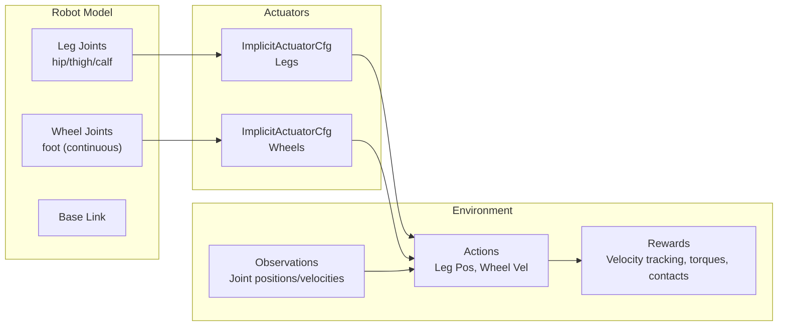
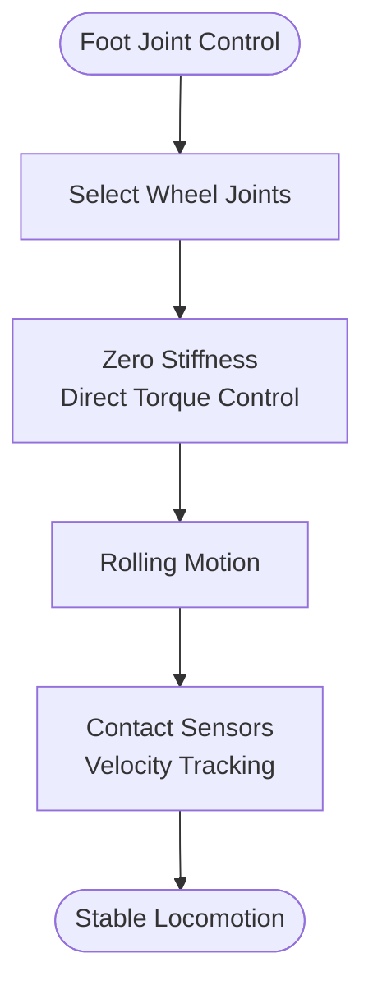
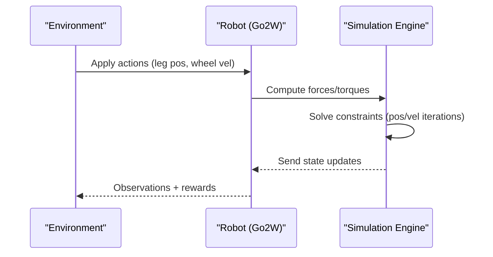
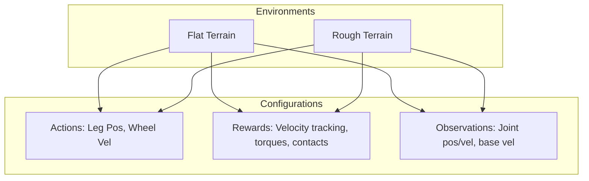
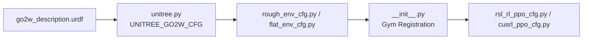

# Unitree Go2W

<cite>
**Referenced Files in This Document**
- [go2w_description.urdf](file://source/robot_lab/data/Robots/unitree/go2w_description/urdf/go2w_description.urdf)
- [unitree.py](file://source/robot_lab/robot_lab/assets/unitree.py)
- [rough_env_cfg.py](file://source/robot_lab/robot_lab/tasks/manager_based/locomotion/velocity/config/wheeled/unitree_go2w/rough_env_cfg.py)
- [flat_env_cfg.py](file://source/robot_lab/robot_lab/tasks/manager_based/locomotion/velocity/config/wheeled/unitree_go2w/flat_env_cfg.py)
- [__init__.py](file://source/robot_lab/robot_lab/tasks/manager_based/locomotion/velocity/config/wheeled/unitree_go2w/__init__.py)
- [rsl_rl_ppo_cfg.py](file://source/robot_lab/robot_lab/tasks/manager_based/locomotion/velocity/config/wheeled/unitree_go2w/agents/rsl_rl_ppo_cfg.py)
- [cusrl_ppo_cfg.py](file://source/robot_lab/robot_lab/tasks/manager_based/locomotion/velocity/config/wheeled/unitree_go2w/agents/cusrl_ppo_cfg.py)
</cite>

## Table of Contents
1. [Introduction](#introduction)
2. [Project Structure](#project-structure)
3. [Core Components](#core-components)
4. [Architecture Overview](#architecture-overview)
5. [Detailed Component Analysis](#detailed-component-analysis)
6. [Dependency Analysis](#dependency-analysis)
7. [Performance Considerations](#performance-considerations)
8. [Troubleshooting Guide](#troubleshooting-guide)
9. [Conclusion](#conclusion)
10. [Appendices](#appendices)

## Introduction
This document describes the Unitree Go2W wheeled quadruped configuration in the RobotLab codebase. It explains the hybrid leg-wheel actuator system, where the robot retains leg joints for compliant locomotion but integrates wheel actuators directly into the foot links for omnidirectional mobility. The document details actuator mapping, physical specifications, simulation parameters, control strategy differences from pure-legged versions, and practical training configurations for both flat and rough terrains.

## Project Structure
The Go2W configuration spans three main areas:
- URDF definition of the robot geometry and joints
- Actuator configuration and initialization in the asset registry
- Environment and training setup for velocity-tracking locomotion



**Diagram sources**
- [go2w_description.urdf](file://source/robot_lab/data/Robots/unitree/go2w_description/urdf/go2w_description.urdf#L1-L764)
- [unitree.py](file://source/robot_lab/robot_lab/assets/unitree.py#L121-L177)
- [rough_env_cfg.py](file://source/robot_lab/robot_lab/tasks/manager_based/locomotion/velocity/config/wheeled/unitree_go2w/rough_env_cfg.py#L52-L235)
- [flat_env_cfg.py](file://source/robot_lab/robot_lab/tasks/manager_based/locomotion/velocity/config/wheeled/unitree_go2w/flat_env_cfg.py#L9-L30)
- [__init__.py](file://source/robot_lab/robot_lab/tasks/manager_based/locomotion/velocity/config/wheeled/unitree_go2w/__init__.py#L12-L32)
- [rsl_rl_ppo_cfg.py](file://source/robot_lab/robot_lab/tasks/manager_based/locomotion/velocity/config/wheeled/unitree_go2w/agents/rsl_rl_ppo_cfg.py#L9-L45)
- [cusrl_ppo_cfg.py](file://source/robot_lab/robot_lab/tasks/manager_based/locomotion/velocity/config/wheeled/unitree_go2w/agents/cusrl_ppo_cfg.py#L10-L48)

**Section sources**
- [go2w_description.urdf](file://source/robot_lab/data/Robots/unitree/go2w_description/urdf/go2w_description.urdf#L1-L764)
- [unitree.py](file://source/robot_lab/robot_lab/assets/unitree.py#L121-L177)
- [rough_env_cfg.py](file://source/robot_lab/robot_lab/tasks/manager_based/locomotion/velocity/config/wheeled/unitree_go2w/rough_env_cfg.py#L52-L235)
- [flat_env_cfg.py](file://source/robot_lab/robot_lab/tasks/manager_based/locomotion/velocity/config/wheeled/unitree_go2w/flat_env_cfg.py#L9-L30)
- [__init__.py](file://source/robot_lab/robot_lab/tasks/manager_based/locomotion/velocity/config/wheeled/unitree_go2w/__init__.py#L12-L32)
- [rsl_rl_ppo_cfg.py](file://source/robot_lab/robot_lab/tasks/manager_based/locomotion/velocity/config/wheeled/unitree_go2w/agents/rsl_rl_ppo_cfg.py#L9-L45)
- [cusrl_ppo_cfg.py](file://source/robot_lab/robot_lab/tasks/manager_based/locomotion/velocity/config/wheeled/unitree_go2w/agents/cusrl_ppo_cfg.py#L10-L48)

## Core Components
- Hybrid actuator mapping:
  - Legs: implicit actuators controlling hip/thigh/calf joints
  - Wheels: implicit actuators controlling continuous foot joints
- Simulation parameters tuned for wheel dynamics:
  - Increased solver velocity iterations for stability
  - Zero stiffness for wheel actuators to enable direct torque control
- Physical specifications embedded in URDF:
  - Wheel diameter derived from collision geometry
  - Torque and velocity limits for leg joints
  - Continuous foot joints enabling omni-directional rolling

Key implementation references:
- Actuator mapping and limits: [unitree.py](file://source/robot_lab/robot_lab/assets/unitree.py#L157-L174)
- Solver and joint drive settings: [unitree.py](file://source/robot_lab/robot_lab/assets/unitree.py#L137-L142)
- Wheel joint definitions and limits: [go2w_description.urdf](file://source/robot_lab/data/Robots/unitree/go2w_description/urdf/go2w_description.urdf#L222-L229), [go2w_description.urdf](file://source/robot_lab/data/Robots/unitree/go2w_description/urdf/go2w_description.urdf#L392-L398), [go2w_description.urdf](file://source/robot_lab/data/Robots/unitree/go2w_description/urdf/go2w_description.urdf#L562-L568), [go2w_description.urdf](file://source/robot_lab/data/Robots/unitree/go2w_description/urdf/go2w_description.urdf#L731-L737)

**Section sources**
- [unitree.py](file://source/robot_lab/robot_lab/assets/unitree.py#L121-L177)
- [go2w_description.urdf](file://source/robot_lab/data/Robots/unitree/go2w_description/urdf/go2w_description.urdf#L222-L229)

## Architecture Overview
The Go2W architecture separates leg and wheel controls via distinct actuator groups. Leg joints use implicit actuators with stiffness/damping for compliant behavior, while wheel joints use implicit actuators with zero stiffness for direct torque control. The environment configuration exposes separate action channels for leg joint positions and wheel joint velocities, aligning with the dual-control strategy.



**Diagram sources**
- [unitree.py](file://source/robot_lab/robot_lab/assets/unitree.py#L157-L174)
- [rough_env_cfg.py](file://source/robot_lab/robot_lab/tasks/manager_based/locomotion/velocity/config/wheeled/unitree_go2w/rough_env_cfg.py#L21-L106)

**Section sources**
- [unitree.py](file://source/robot_lab/robot_lab/assets/unitree.py#L157-L174)
- [rough_env_cfg.py](file://source/robot_lab/robot_lab/tasks/manager_based/locomotion/velocity/config/wheeled/unitree_go2w/rough_env_cfg.py#L21-L106)

## Detailed Component Analysis

### Hybrid Actuator Mapping
- Legs:
  - Controlled via implicit actuators with stiffness and damping for compliance
  - Effort and velocity limits match leg joint capabilities
- Wheels:
  - Controlled via implicit actuators on continuous foot joints
  - Stiffness set to zero to enable direct torque control
  - Effort and velocity limits tailored for wheel dynamics

```mermaid
classDiagram
class UNITREE_GO2W_CFG {
+spawn : UrdfFileCfg
+init_state : InitialStateCfg
+actuators : {"legs" : ImplicitActuatorCfg, "wheels" : ImplicitActuatorCfg}
}
class ImplicitActuatorCfg {
+joint_names_expr
+effort_limit_sim
+velocity_limit_sim
+stiffness
+damping
+friction
}
UNITREE_GO2W_CFG --> ImplicitActuatorCfg : "legs"
UNITREE_GO2W_CFG --> ImplicitActuatorCfg : "wheels"
```

**Diagram sources**
- [unitree.py](file://source/robot_lab/robot_lab/assets/unitree.py#L121-L177)

**Section sources**
- [unitree.py](file://source/robot_lab/robot_lab/assets/unitree.py#L157-L174)

### Wheel Joint Configuration and Dynamics
- Continuous foot joints enable rolling motion around the vertical axis
- Wheel collision geometry defines effective rolling radius
- Joint limits specify torque and velocity bounds consistent with motor capabilities



**Diagram sources**
- [go2w_description.urdf](file://source/robot_lab/data/Robots/unitree/go2w_description/urdf/go2w_description.urdf#L222-L229)
- [go2w_description.urdf](file://source/robot_lab/data/Robots/unitree/go2w_description/urdf/go2w_description.urdf#L392-L398)
- [go2w_description.urdf](file://source/robot_lab/data/Robots/unitree/go2w_description/urdf/go2w_description.urdf#L562-L568)
- [go2w_description.urdf](file://source/robot_lab/data/Robots/unitree/go2w_description/urdf/go2w_description.urdf#L731-L737)

**Section sources**
- [go2w_description.urdf](file://source/robot_lab/data/Robots/unitree/go2w_description/urdf/go2w_description.urdf#L222-L229)
- [go2w_description.urdf](file://source/robot_lab/data/Robots/unitree/go2w_description/urdf/go2w_description.urdf#L392-L398)
- [go2w_description.urdf](file://source/robot_lab/data/Robots/unitree/go2w_description/urdf/go2w_description.urdf#L562-L568)
- [go2w_description.urdf](file://source/robot_lab/data/Robots/unitree/go2w_description/urdf/go2w_description.urdf#L731-L737)

### Simulation Parameters and Stability Tuning
- Solver iteration counts:
  - Position iterations: 4
  - Velocity iterations: 1
- Joint drive configuration:
  - PD gains set to zero for passive compliance
- These settings stabilize wheel dynamics and improve convergence during training



**Diagram sources**
- [unitree.py](file://source/robot_lab/robot_lab/assets/unitree.py#L137-L142)

**Section sources**
- [unitree.py](file://source/robot_lab/robot_lab/assets/unitree.py#L137-L142)

### Control Strategy Differences from Pure Legged Versions
- Legged robots rely on hip/thigh/calf actuation for dynamic gaits
- Go2W augments legged control with wheel actuators for:
  - Omnidirectional movement via wheel rolling
  - Reduced reliance on leg compliance for low-speed maneuvering
  - Separate action channels for leg positioning and wheel velocity

Practical implications:
- Training rewards emphasize velocity tracking and contact forces
- Observations exclude wheel joint positions to avoid redundant state representation

**Section sources**
- [rough_env_cfg.py](file://source/robot_lab/robot_lab/tasks/manager_based/locomotion/velocity/config/wheeled/unitree_go2w/rough_env_cfg.py#L82-L98)
- [rough_env_cfg.py](file://source/robot_lab/robot_lab/tasks/manager_based/locomotion/velocity/config/wheeled/unitree_go2w/rough_env_cfg.py#L101-L106)

### Practical Training Configurations and Environment Setups
- Gym environments registered for flat and rough terrains
- Flat environment removes terrain and height-scan sensors
- Reward and observation configurations tuned for hybrid locomotion



**Diagram sources**
- [__init__.py](file://source/robot_lab/robot_lab/tasks/manager_based/locomotion/velocity/config/wheeled/unitree_go2w/__init__.py#L12-L32)
- [flat_env_cfg.py](file://source/robot_lab/robot_lab/tasks/manager_based/locomotion/velocity/config/wheeled/unitree_go2w/flat_env_cfg.py#L9-L30)
- [rough_env_cfg.py](file://source/robot_lab/robot_lab/tasks/manager_based/locomotion/velocity/config/wheeled/unitree_go2w/rough_env_cfg.py#L52-L235)

**Section sources**
- [__init__.py](file://source/robot_lab/robot_lab/tasks/manager_based/locomotion/velocity/config/wheeled/unitree_go2w/__init__.py#L12-L32)
- [flat_env_cfg.py](file://source/robot_lab/robot_lab/tasks/manager_based/locomotion/velocity/config/wheeled/unitree_go2w/flat_env_cfg.py#L9-L30)
- [rough_env_cfg.py](file://source/robot_lab/robot_lab/tasks/manager_based/locomotion/velocity/config/wheeled/unitree_go2w/rough_env_cfg.py#L52-L235)

## Dependency Analysis
The Go2W configuration depends on:
- URDF geometry and joint limits
- Asset registry for actuator definitions
- Environment manager for actions, observations, and rewards
- RL runner configurations for training



**Diagram sources**
- [go2w_description.urdf](file://source/robot_lab/data/Robots/unitree/go2w_description/urdf/go2w_description.urdf#L1-L764)
- [unitree.py](file://source/robot_lab/robot_lab/assets/unitree.py#L121-L177)
- [rough_env_cfg.py](file://source/robot_lab/robot_lab/tasks/manager_based/locomotion/velocity/config/wheeled/unitree_go2w/rough_env_cfg.py#L52-L235)
- [__init__.py](file://source/robot_lab/robot_lab/tasks/manager_based/locomotion/velocity/config/wheeled/unitree_go2w/__init__.py#L12-L32)
- [rsl_rl_ppo_cfg.py](file://source/robot_lab/robot_lab/tasks/manager_based/locomotion/velocity/config/wheeled/unitree_go2w/agents/rsl_rl_ppo_cfg.py#L9-L45)
- [cusrl_ppo_cfg.py](file://source/robot_lab/robot_lab/tasks/manager_based/locomotion/velocity/config/wheeled/unitree_go2w/agents/cusrl_ppo_cfg.py#L10-L48)

**Section sources**
- [unitree.py](file://source/robot_lab/robot_lab/assets/unitree.py#L121-L177)
- [rough_env_cfg.py](file://source/robot_lab/robot_lab/tasks/manager_based/locomotion/velocity/config/wheeled/unitree_go2w/rough_env_cfg.py#L52-L235)
- [__init__.py](file://source/robot_lab/robot_lab/tasks/manager_based/locomotion/velocity/config/wheeled/unitree_go2w/__init__.py#L12-L32)

## Performance Considerations
- Solver tuning:
  - Higher velocity iterations improve wheel dynamics stability
  - Passive compliance via zero PD gains reduces numerical stiffness
- Actuator selection:
  - Implicit actuators with zero stiffness for wheels enable precise torque control
  - Leg actuators with stiffness/damping balance compliance and responsiveness
- Observation design:
  - Excluding wheel joint positions reduces redundant state information
  - Base velocity scaling improves reward signal strength

[No sources needed since this section provides general guidance]

## Troubleshooting Guide
Common issues and resolutions:
- Wheels not responding:
  - Verify wheel joint names in the actuator mapping and environment actions
  - Confirm zero stiffness for wheel actuators
- Instability during training:
  - Increase solver velocity iterations slightly
  - Reduce action scales for wheel joints
- Poor velocity tracking:
  - Adjust reward weights for velocity tracking and contact forces
  - Calibrate observation scaling factors

**Section sources**
- [unitree.py](file://source/robot_lab/robot_lab/assets/unitree.py#L137-L142)
- [rough_env_cfg.py](file://source/robot_lab/robot_lab/tasks/manager_based/locomotion/velocity/config/wheeled/unitree_go2w/rough_env_cfg.py#L99-L106)

## Conclusion
The Unitree Go2W leverages a hybrid leg-wheel actuator system to achieve both compliant legged locomotion and omnidirectional mobility through wheel actuators integrated into the foot links. The configuration uses implicit actuators with carefully tuned simulation parameters and environment-specific action/reward designs. This enables robust training on both flat and rough terrains, with clear separation between leg and wheel control channels.

[No sources needed since this section summarizes without analyzing specific files]

## Appendices

### Physical Specifications and Limits
- Leg joint torque and velocity limits:
  - Effort limit: 23.5 Nm
  - Velocity limit: 30.0 rad/s
- Wheel joint configuration:
  - Continuous joints with torque/velocity limits aligned to motor capabilities
  - Rolling radius derived from collision geometry

**Section sources**
- [go2w_description.urdf](file://source/robot_lab/data/Robots/unitree/go2w_description/urdf/go2w_description.urdf#L86-L86)
- [go2w_description.urdf](file://source/robot_lab/data/Robots/unitree/go2w_description/urdf/go2w_description.urdf#L112-L112)
- [go2w_description.urdf](file://source/robot_lab/data/Robots/unitree/go2w_description/urdf/go2w_description.urdf#L142-L142)
- [go2w_description.urdf](file://source/robot_lab/data/Robots/unitree/go2w_description/urdf/go2w_description.urdf#L228-L228)
- [go2w_description.urdf](file://source/robot_lab/data/Robots/unitree/go2w_description/urdf/go2w_description.urdf#L397-L397)
- [go2w_description.urdf](file://source/robot_lab/data/Robots/unitree/go2w_description/urdf/go2w_description.urdf#L567-L567)
- [go2w_description.urdf](file://source/robot_lab/data/Robots/unitree/go2w_description/urdf/go2w_description.urdf#L736-L736)

### Training Setup References
- Gym environments:
  - Flat: RobotLab-Isaac-Velocity-Flat-Unitree-Go2W-v0
  - Rough: RobotLab-Isaac-Velocity-Rough-Unitree-Go2W-v0
- Runner configurations:
  - RSL-RL PPO runner and algorithm settings
  - CuSRL PPO agent factory and optimizer settings

**Section sources**
- [__init__.py](file://source/robot_lab/robot_lab/tasks/manager_based/locomotion/velocity/config/wheeled/unitree_go2w/__init__.py#L12-L32)
- [rsl_rl_ppo_cfg.py](file://source/robot_lab/robot_lab/tasks/manager_based/locomotion/velocity/config/wheeled/unitree_go2w/agents/rsl_rl_ppo_cfg.py#L9-L45)
- [cusrl_ppo_cfg.py](file://source/robot_lab/robot_lab/tasks/manager_based/locomotion/velocity/config/wheeled/unitree_go2w/agents/cusrl_ppo_cfg.py#L10-L48)