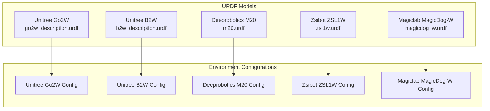
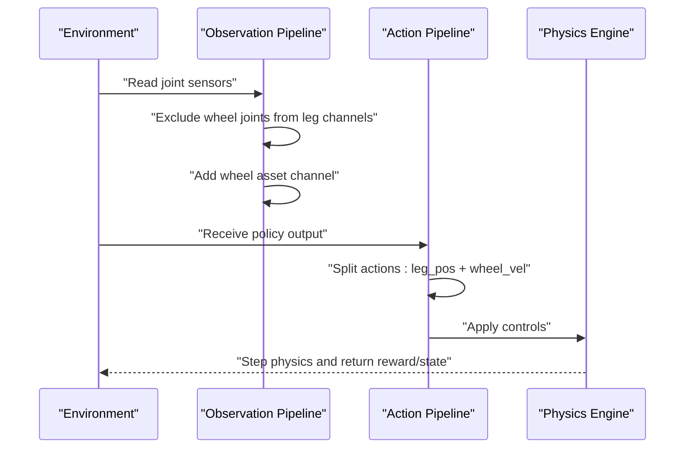
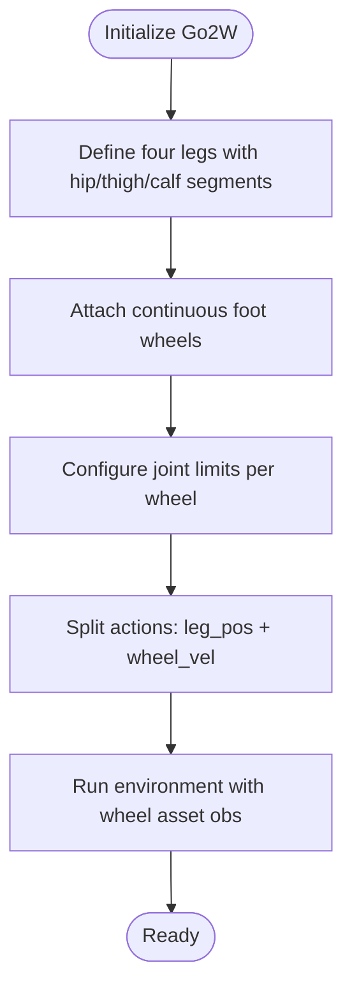
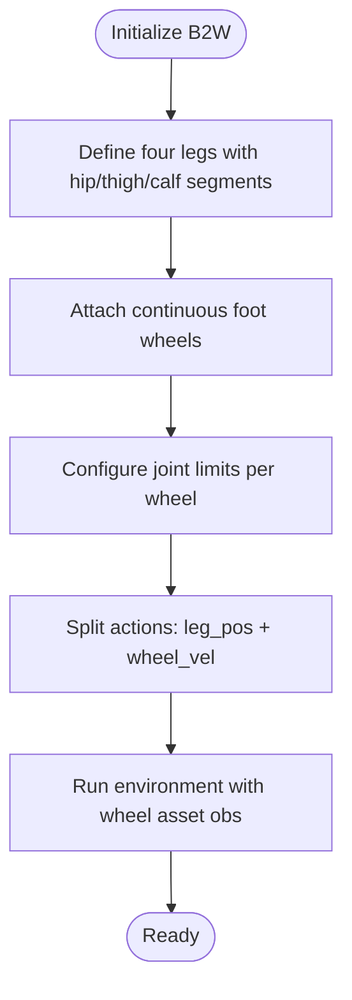
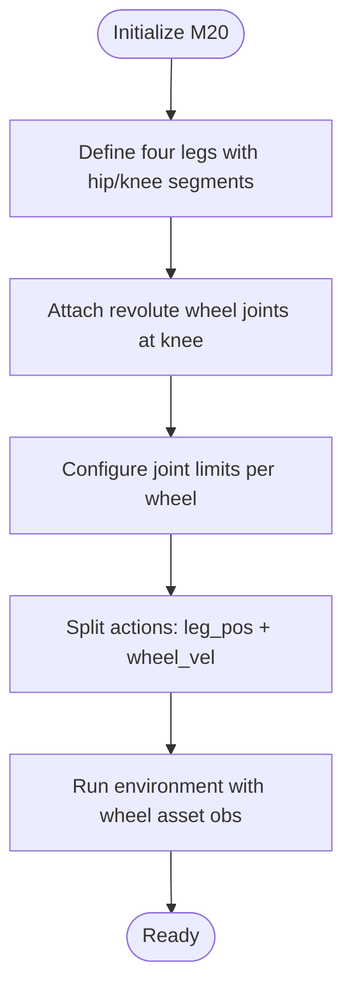
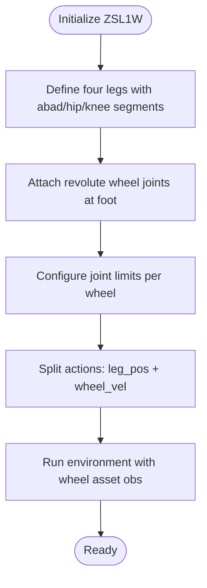
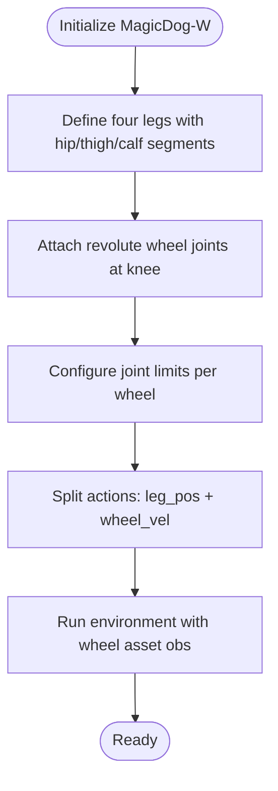
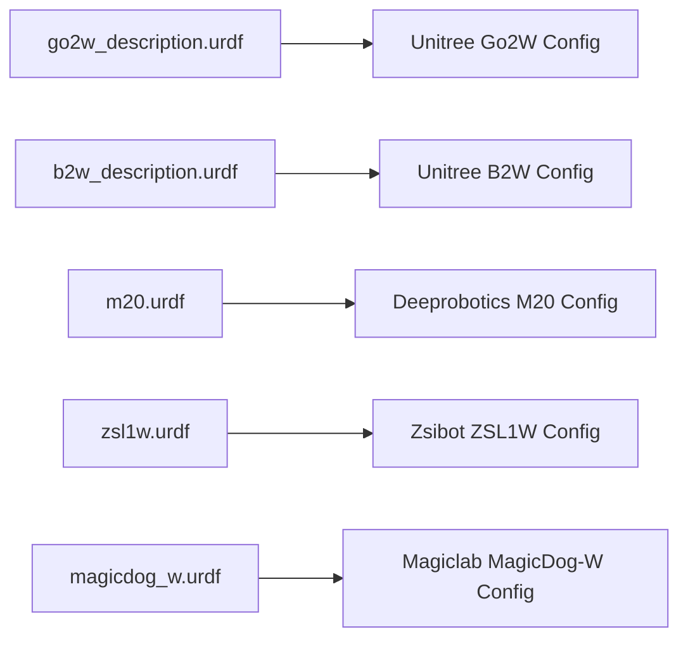

# Wheeled Robots

<cite>
**Referenced Files in This Document**
- [go2w_description.urdf](file://source/robot_lab/data/Robots/unitree/go2w_description/urdf/go2w_description.urdf)
- [b2w_description.urdf](file://source/robot_lab/data/Robots/unitree/b2w_description/urdf/b2w_description.urdf)
- [m20.urdf](file://source/robot_lab/data/Robots/deeprobotics/m20_description/urdf/m20.urdf)
- [zsl1w.urdf](file://source/robot_lab/data/Robots/zsibot/zsl1w_description/urdf/zsl1w.urdf)
- [magicdog_w.urdf](file://source/robot_lab/data/Robots/magiclab/magicdog_w/urdf/magicdog_w.urdf)
- [rough_env_cfg.py (Unitree Go2W)](file://source/robot_lab/robot_lab/tasks/manager_based/locomotion/velocity/config/wheeled/unitree_go2w/rough_env_cfg.py)
- [rough_env_cfg.py (Unitree B2W)](file://source/robot_lab/robot_lab/tasks/manager_based/locomotion/velocity/config/wheeled/unitree_b2w/rough_env_cfg.py)
- [rough_env_cfg.py (Deeprobotics M20)](file://source/robot_lab/robot_lab/tasks/manager_based/locomotion/velocity/config/wheeled/deeprobotics_m20/rough_env_cfg.py)
- [rough_env_cfg.py (Zsibot ZSL1W)](file://source/robot_lab/robot_lab/tasks/manager_based/locomotion/velocity/config/wheeled/zsibot_zsl1w/rough_env_cfg.py)
- [rough_env_cfg.py (Magiclab MagicDog-W)](file://source/robot_lab/robot_lab/tasks/manager_based/locomotion/velocity/config/wheeled/magiclab_magicdogw/rough_env_cfg.py)
- [README.md](file://README.md)
</cite>

## Table of Contents
1. [Introduction](#introduction)
2. [Project Structure](#project-structure)
3. [Core Components](#core-components)
4. [Architecture Overview](#architecture-overview)
5. [Detailed Component Analysis](#detailed-component-analysis)
6. [Dependency Analysis](#dependency-analysis)
7. [Performance Considerations](#performance-considerations)
8. [Troubleshooting Guide](#troubleshooting-guide)
9. [Conclusion](#conclusion)

## Introduction
This document focuses on wheeled and hybrid leg-wheel robotic platforms available in the repository. It covers omnidirectional and differential drive configurations, including:
- Unitree Go2W and B2W: quadruped robots with wheel attachments enabling dual-mode locomotion.
- Deeprobotics M20: a legged platform with specialized wheel mechanisms integrated into knee joints.
- Zsibot ZSL1W: a quadruped variant with wheel integration and lightweight design.
- Magiclab MagicDog-W: a wheeled adaptation of the MagicDog quadruped.

The document explains wheel diameters, motor configurations, torque/velocity limits, actuator mapping between legs and wheels, control strategies for mixed locomotion, and simulation parameters optimized for wheel dynamics. It also compares wheeled locomotion advantages in energy efficiency, speed, and terrain adaptability versus traditional legged robots and outlines control interfaces, action spaces, and suitable applications.

## Project Structure
The wheeled robot assets are defined as URDF models under the Robots data directory, grouped by manufacturer and model. Control configurations for reinforcement learning environments are located under the tasks configuration hierarchy, with environment-specific parameters for observations, actions, and scaling.

**Diagram sources**
- [go2w_description.urdf](file://source/robot_lab/data/Robots/unitree/go2w_description/urdf/go2w_description.urdf#L1-L764)
- [b2w_description.urdf](file://source/robot_lab/data/Robots/unitree/b2w_description/urdf/b2w_description.urdf#L1-L574)
- [m20.urdf](file://source/robot_lab/data/Robots/deeprobotics/m20_description/urdf/m20.urdf#L1-L555)
- [zsl1w.urdf](file://source/robot_lab/data/Robots/zsibot/zsl1w_description/urdf/zsl1w.urdf#L1-L959)
- [magicdog_w.urdf](file://source/robot_lab/data/Robots/magiclab/magicdog_w/urdf/magicdog_w.urdf#L1-L532)

**Section sources**
- [README.md](file://README.md#L15-L41)

## Core Components
This section summarizes the key characteristics of each wheeled/hybrid robot model, derived from their URDF definitions and environment configurations.

- Unitree Go2W
  - Wheel joints: continuous rotation at the foot link for each leg.
  - Wheel diameter: approximately 0.172 meters (cylinder radius ~0.086 m).
  - Joint limits: effort and velocity parameters indicate motor capabilities per wheel joint.
  - Actuator mapping: wheel joints are separate from leg joints; environment configuration treats wheel joints as action targets for velocity control while excluding them from leg-based observations.

- Unitree B2W
  - Wheel joints: continuous rotation at the foot link for each leg.
  - Joint limits: effort and velocity parameters per wheel joint.
  - Actuator mapping: similar to Go2W, with wheel joints controlled independently.

- Deeprobotics M20
  - Wheel joints: continuous rotation at the knee link for each leg.
  - Wheel diameter: approximately 0.18 meters (cylinder radius ~0.09 m).
  - Joint limits: effort and velocity parameters per wheel joint.
  - Actuator mapping: wheels are integrated into the kinematic chain at the knee, enabling compact actuator-to-wheel coupling.

- Zsibot ZSL1W
  - Wheel joints: revolute joints at the foot link for each leg.
  - Joint limits: effort and velocity parameters per wheel joint.
  - Actuator mapping: wheels are part of the leg chain; environment configuration distinguishes leg and wheel joints for observation and action control.

- Magiclab MagicDog-W
  - Wheel joints: revolute joints at the knee link for each leg.
  - Wheel diameter: approximately 0.18 meters (cylinder radius ~0.09 m).
  - Joint limits: effort and velocity parameters per wheel joint.
  - Actuator mapping: wheels are integrated into the leg chain at the knee, similar to M20.

Control interface highlights:
- Observations exclude wheel joint positions/velocities from leg-centric channels and provide dedicated wheel asset channels.
- Actions split between leg joint positions and wheel joint velocities, with per-group scaling and clipping.

**Section sources**
- [go2w_description.urdf](file://source/robot_lab/data/Robots/unitree/go2w_description/urdf/go2w_description.urdf#L222-L229)
- [go2w_description.urdf](file://source/robot_lab/data/Robots/unitree/go2w_description/urdf/go2w_description.urdf#L392-L398)
- [go2w_description.urdf](file://source/robot_lab/data/Robots/unitree/go2w_description/urdf/go2w_description.urdf#L562-L568)
- [go2w_description.urdf](file://source/robot_lab/data/Robots/unitree/go2w_description/urdf/go2w_description.urdf#L731-L737)
- [b2w_description.urdf](file://source/robot_lab/data/Robots/unitree/b2w_description/urdf/b2w_description.urdf#L216-L222)
- [b2w_description.urdf](file://source/robot_lab/data/Robots/unitree/b2w_description/urdf/b2w_description.urdf#L320-L326)
- [b2w_description.urdf](file://source/robot_lab/data/Robots/unitree/b2w_description/urdf/b2w_description.urdf#L424-L430)
- [b2w_description.urdf](file://source/robot_lab/data/Robots/unitree/b2w_description/urdf/b2w_description.urdf#L528-L534)
- [m20.urdf](file://source/robot_lab/data/Robots/deeprobotics/m20_description/urdf/m20.urdf#L164-L170)
- [m20.urdf](file://source/robot_lab/data/Robots/deeprobotics/m20_description/urdf/m20.urdf#L292-L298)
- [m20.urdf](file://source/robot_lab/data/Robots/deeprobotics/m20_description/urdf/m20.urdf#L420-L426)
- [m20.urdf](file://source/robot_lab/data/Robots/deeprobotics/m20_description/urdf/m20.urdf#L548-L554)
- [zsl1w.urdf](file://source/robot_lab/data/Robots/zsibot/zsl1w_description/urdf/zsl1w.urdf#L257-L274)
- [zsl1w.urdf](file://source/robot_lab/data/Robots/zsibot/zsl1w_description/urdf/zsl1w.urdf#L485-L502)
- [zsl1w.urdf](file://source/robot_lab/data/Robots/zsibot/zsl1w_description/urdf/zsl1w.urdf#L713-L730)
- [zsl1w.urdf](file://source/robot_lab/data/Robots/zsibot/zsl1w_description/urdf/zsl1w.urdf#L789-L806)
- [magicdog_w.urdf](file://source/robot_lab/data/Robots/magiclab/magicdog_w/urdf/magicdog_w.urdf#L162-L169)
- [magicdog_w.urdf](file://source/robot_lab/data/Robots/magiclab/magicdog_w/urdf/magicdog_w.urdf#L276-L283)
- [magicdog_w.urdf](file://source/robot_lab/data/Robots/magiclab/magicdog_w/urdf/magicdog_w.urdf#L390-L397)
- [magicdog_w.urdf](file://source/robot_lab/data/Robots/magiclab/magicdog_w/urdf/magicdog_w.urdf#L504-L511)
- [rough_env_cfg.py (Unitree Go2W)](file://source/robot_lab/robot_lab/tasks/manager_based/locomotion/velocity/config/wheeled/unitree_go2w/rough_env_cfg.py#L81-L106)
- [rough_env_cfg.py (Unitree B2W)](file://source/robot_lab/robot_lab/tasks/manager_based/locomotion/velocity/config/wheeled/unitree_b2w/rough_env_cfg.py#L81-L106)
- [rough_env_cfg.py (Deeprobotics M20)](file://source/robot_lab/robot_lab/tasks/manager_based/locomotion/velocity/config/wheeled/deeprobotics_m20/rough_env_cfg.py#L81-L106)
- [rough_env_cfg.py (Zsibot ZSL1W)](file://source/robot_lab/robot_lab/tasks/manager_based/locomotion/velocity/config/wheeled/zsibot_zsl1w/rough_env_cfg.py#L81-L106)
- [rough_env_cfg.py (Magiclab MagicDog-W)](file://source/robot_lab/robot_lab/tasks/manager_based/locomotion/velocity/config/wheeled/magiclab_magicdogw/rough_env_cfg.py#L81-L106)

## Architecture Overview
The wheeled/hybrid platforms share a common control architecture:
- Observation pipeline excludes wheel joints from leg-centric channels and introduces a dedicated wheel asset channel.
- Action pipeline splits controls:
  - Leg joint positions for stance and gait shaping.
  - Wheel joint velocities for locomotion mode switching and speed control.
- Simulation parameters are tuned per model to reflect wheel inertia, friction, and damping characteristics.

**Diagram sources**
- [rough_env_cfg.py (Unitree Go2W)](file://source/robot_lab/robot_lab/tasks/manager_based/locomotion/velocity/config/wheeled/unitree_go2w/rough_env_cfg.py#L81-L106)
- [rough_env_cfg.py (Unitree B2W)](file://source/robot_lab/robot_lab/tasks/manager_based/locomotion/velocity/config/wheeled/unitree_b2w/rough_env_cfg.py#L81-L106)
- [rough_env_cfg.py (Deeprobotics M20)](file://source/robot_lab/robot_lab/tasks/manager_based/locomotion/velocity/config/wheeled/deeprobotics_m20/rough_env_cfg.py#L81-L106)
- [rough_env_cfg.py (Zsibot ZSL1W)](file://source/robot_lab/robot_lab/tasks/manager_based/locomotion/velocity/config/wheeled/zsibot_zsl1w/rough_env_cfg.py#L81-L106)
- [rough_env_cfg.py (Magiclab MagicDog-W)](file://source/robot_lab/robot_lab/tasks/manager_based/locomotion/velocity/config/wheeled/magiclab_magicdogw/rough_env_cfg.py#L81-L106)

## Detailed Component Analysis

### Unitree Go2W
- Wheel mechanism: Continuous rotation foot joints at each leg’s distal segment.
- Wheel diameter: ~0.172 m (radius ~0.086 m).
- Motor configuration: Effort and velocity limits per wheel joint.
- Actuator mapping: Wheel joints are treated separately from leg joints; environment configuration sets wheel joints as action targets for velocity control and removes them from leg-centric observations.

**Diagram sources**
- [go2w_description.urdf](file://source/robot_lab/data/Robots/unitree/go2w_description/urdf/go2w_description.urdf#L222-L229)
- [go2w_description.urdf](file://source/robot_lab/data/Robots/unitree/go2w_description/urdf/go2w_description.urdf#L392-L398)
- [go2w_description.urdf](file://source/robot_lab/data/Robots/unitree/go2w_description/urdf/go2w_description.urdf#L562-L568)
- [go2w_description.urdf](file://source/robot_lab/data/Robots/unitree/go2w_description/urdf/go2w_description.urdf#L731-L737)
- [rough_env_cfg.py (Unitree Go2W)](file://source/robot_lab/robot_lab/tasks/manager_based/locomotion/velocity/config/wheeled/unitree_go2w/rough_env_cfg.py#L81-L106)

**Section sources**
- [go2w_description.urdf](file://source/robot_lab/data/Robots/unitree/go2w_description/urdf/go2w_description.urdf#L222-L229)
- [go2w_description.urdf](file://source/robot_lab/data/Robots/unitree/go2w_description/urdf/go2w_description.urdf#L392-L398)
- [go2w_description.urdf](file://source/robot_lab/data/Robots/unitree/go2w_description/urdf/go2w_description.urdf#L562-L568)
- [go2w_description.urdf](file://source/robot_lab/data/Robots/unitree/go2w_description/urdf/go2w_description.urdf#L731-L737)
- [rough_env_cfg.py (Unitree Go2W)](file://source/robot_lab/robot_lab/tasks/manager_based/locomotion/velocity/config/wheeled/unitree_go2w/rough_env_cfg.py#L81-L106)

### Unitree B2W
- Wheel mechanism: Continuous rotation foot joints at each leg’s distal segment.
- Wheel diameter: ~0.172 m (radius ~0.086 m).
- Motor configuration: Effort and velocity limits per wheel joint.
- Actuator mapping: Similar to Go2W; wheel joints are controlled independently and excluded from leg-centric observations.

**Diagram sources**
- [b2w_description.urdf](file://source/robot_lab/data/Robots/unitree/b2w_description/urdf/b2w_description.urdf#L216-L222)
- [b2w_description.urdf](file://source/robot_lab/data/Robots/unitree/b2w_description/urdf/b2w_description.urdf#L320-L326)
- [b2w_description.urdf](file://source/robot_lab/data/Robots/unitree/b2w_description/urdf/b2w_description.urdf#L424-L430)
- [b2w_description.urdf](file://source/robot_lab/data/Robots/unitree/b2w_description/urdf/b2w_description.urdf#L528-L534)
- [rough_env_cfg.py (Unitree B2W)](file://source/robot_lab/robot_lab/tasks/manager_based/locomotion/velocity/config/wheeled/unitree_b2w/rough_env_cfg.py#L81-L106)

**Section sources**
- [b2w_description.urdf](file://source/robot_lab/data/Robots/unitree/b2w_description/urdf/b2w_description.urdf#L216-L222)
- [b2w_description.urdf](file://source/robot_lab/data/Robots/unitree/b2w_description/urdf/b2w_description.urdf#L320-L326)
- [b2w_description.urdf](file://source/robot_lab/data/Robots/unitree/b2w_description/urdf/b2w_description.urdf#L424-L430)
- [b2w_description.urdf](file://source/robot_lab/data/Robots/unitree/b2w_description/urdf/b2w_description.urdf#L528-L534)
- [rough_env_cfg.py (Unitree B2W)](file://source/robot_lab/robot_lab/tasks/manager_based/locomotion/velocity/config/wheeled/unitree_b2w/rough_env_cfg.py#L81-L106)

### Deeprobotics M20
- Wheel mechanism: Revolute wheel joints integrated into the knee link for each leg.
- Wheel diameter: ~0.18 m (radius ~0.09 m).
- Motor configuration: Effort and velocity limits per wheel joint.
- Actuator mapping: Wheels are part of the leg chain; environment configuration treats wheel joints as action targets for velocity control and excludes them from leg-centric observations.

**Diagram sources**
- [m20.urdf](file://source/robot_lab/data/Robots/deeprobotics/m20_description/urdf/m20.urdf#L164-L170)
- [m20.urdf](file://source/robot_lab/data/Robots/deeprobotics/m20_description/urdf/m20.urdf#L292-L298)
- [m20.urdf](file://source/robot_lab/data/Robots/deeprobotics/m20_description/urdf/m20.urdf#L420-L426)
- [m20.urdf](file://source/robot_lab/data/Robots/deeprobotics/m20_description/urdf/m20.urdf#L548-L554)
- [rough_env_cfg.py (Deeprobotics M20)](file://source/robot_lab/robot_lab/tasks/manager_based/locomotion/velocity/config/wheeled/deeprobotics_m20/rough_env_cfg.py#L81-L106)

**Section sources**
- [m20.urdf](file://source/robot_lab/data/Robots/deeprobotics/m20_description/urdf/m20.urdf#L164-L170)
- [m20.urdf](file://source/robot_lab/data/Robots/deeprobotics/m20_description/urdf/m20.urdf#L292-L298)
- [m20.urdf](file://source/robot_lab/data/Robots/deeprobotics/m20_description/urdf/m20.urdf#L420-L426)
- [m20.urdf](file://source/robot_lab/data/Robots/deeprobotics/m20_description/urdf/m20.urdf#L548-L554)
- [rough_env_cfg.py (Deeprobotics M20)](file://source/robot_lab/robot_lab/tasks/manager_based/locomotion/velocity/config/wheeled/deeprobotics_m20/rough_env_cfg.py#L81-L106)

### Zsibot ZSL1W
- Wheel mechanism: Revolute wheel joints at the foot link for each leg.
- Wheel diameter: ~0.18 m (radius ~0.09 m).
- Motor configuration: Effort and velocity limits per wheel joint.
- Actuator mapping: Wheels are part of the leg chain; environment configuration distinguishes leg and wheel joints for observation and action control.

**Diagram sources**
- [zsl1w.urdf](file://source/robot_lab/data/Robots/zsibot/zsl1w_description/urdf/zsl1w.urdf#L257-L274)
- [zsl1w.urdf](file://source/robot_lab/data/Robots/zsibot/zsl1w_description/urdf/zsl1w.urdf#L485-L502)
- [zsl1w.urdf](file://source/robot_lab/data/Robots/zsibot/zsl1w_description/urdf/zsl1w.urdf#L713-L730)
- [zsl1w.urdf](file://source/robot_lab/data/Robots/zsibot/zsl1w_description/urdf/zsl1w.urdf#L789-L806)
- [rough_env_cfg.py (Zsibot ZSL1W)](file://source/robot_lab/robot_lab/tasks/manager_based/locomotion/velocity/config/wheeled/zsibot_zsl1w/rough_env_cfg.py#L81-L106)

**Section sources**
- [zsl1w.urdf](file://source/robot_lab/data/Robots/zsibot/zsl1w_description/urdf/zsl1w.urdf#L257-L274)
- [zsl1w.urdf](file://source/robot_lab/data/Robots/zsibot/zsl1w_description/urdf/zsl1w.urdf#L485-L502)
- [zsl1w.urdf](file://source/robot_lab/data/Robots/zsibot/zsl1w_description/urdf/zsl1w.urdf#L713-L730)
- [zsl1w.urdf](file://source/robot_lab/data/Robots/zsibot/zsl1w_description/urdf/zsl1w.urdf#L789-L806)
- [rough_env_cfg.py (Zsibot ZSL1W)](file://source/robot_lab/robot_lab/tasks/manager_based/locomotion/velocity/config/wheeled/zsibot_zsl1w/rough_env_cfg.py#L81-L106)

### Magiclab MagicDog-W
- Wheel mechanism: Revolute wheel joints integrated into the knee link for each leg.
- Wheel diameter: ~0.18 m (radius ~0.09 m).
- Motor configuration: Effort and velocity limits per wheel joint.
- Actuator mapping: Wheels are part of the leg chain; environment configuration treats wheel joints as action targets for velocity control and excludes them from leg-centric observations.

**Diagram sources**
- [magicdog_w.urdf](file://source/robot_lab/data/Robots/magiclab/magicdog_w/urdf/magicdog_w.urdf#L162-L169)
- [magicdog_w.urdf](file://source/robot_lab/data/Robots/magiclab/magicdog_w/urdf/magicdog_w.urdf#L276-L283)
- [magicdog_w.urdf](file://source/robot_lab/data/Robots/magiclab/magicdog_w/urdf/magicdog_w.urdf#L390-L397)
- [magicdog_w.urdf](file://source/robot_lab/data/Robots/magiclab/magicdog_w/urdf/magicdog_w.urdf#L504-L511)
- [rough_env_cfg.py (Magiclab MagicDog-W)](file://source/robot_lab/robot_lab/tasks/manager_based/locomotion/velocity/config/wheeled/magiclab_magicdogw/rough_env_cfg.py#L81-L106)

**Section sources**
- [magicdog_w.urdf](file://source/robot_lab/data/Robots/magiclab/magicdog_w/urdf/magicdog_w.urdf#L162-L169)
- [magicdog_w.urdf](file://source/robot_lab/data/Robots/magiclab/magicdog_w/urdf/magicdog_w.urdf#L276-L283)
- [magicdog_w.urdf](file://source/robot_lab/data/Robots/magiclab/magicdog_w/urdf/magicdog_w.urdf#L390-L397)
- [magicdog_w.urdf](file://source/robot_lab/data/Robots/magiclab/magicdog_w/urdf/magicdog_w.urdf#L504-L511)
- [rough_env_cfg.py (Magiclab MagicDog-W)](file://source/robot_lab/robot_lab/tasks/manager_based/locomotion/velocity/config/wheeled/magiclab_magicdogw/rough_env_cfg.py#L81-L106)

## Dependency Analysis
The wheeled robot configurations depend on:
- URDF definitions for geometry, inertial properties, and joint limits.
- Environment configuration files that define observation and action mappings, scaling, and clipping.

**Diagram sources**
- [go2w_description.urdf](file://source/robot_lab/data/Robots/unitree/go2w_description/urdf/go2w_description.urdf#L1-L764)
- [b2w_description.urdf](file://source/robot_lab/data/Robots/unitree/b2w_description/urdf/b2w_description.urdf#L1-L574)
- [m20.urdf](file://source/robot_lab/data/Robots/deeprobotics/m20_description/urdf/m20.urdf#L1-L555)
- [zsl1w.urdf](file://source/robot_lab/data/Robots/zsibot/zsl1w_description/urdf/zsl1w.urdf#L1-L959)
- [magicdog_w.urdf](file://source/robot_lab/data/Robots/magiclab/magicdog_w/urdf/magicdog_w.urdf#L1-L532)
- [rough_env_cfg.py (Unitree Go2W)](file://source/robot_lab/robot_lab/tasks/manager_based/locomotion/velocity/config/wheeled/unitree_go2w/rough_env_cfg.py#L81-L106)
- [rough_env_cfg.py (Unitree B2W)](file://source/robot_lab/robot_lab/tasks/manager_based/locomotion/velocity/config/wheeled/unitree_b2w/rough_env_cfg.py#L81-L106)
- [rough_env_cfg.py (Deeprobotics M20)](file://source/robot_lab/robot_lab/tasks/manager_based/locomotion/velocity/config/wheeled/deeprobotics_m20/rough_env_cfg.py#L81-L106)
- [rough_env_cfg.py (Zsibot ZSL1W)](file://source/robot_lab/robot_lab/tasks/manager_based/locomotion/velocity/config/wheeled/zsibot_zsl1w/rough_env_cfg.py#L81-L106)
- [rough_env_cfg.py (Magiclab MagicDog-W)](file://source/robot_lab/robot_lab/tasks/manager_based/locomotion/velocity/config/wheeled/magiclab_magicdogw/rough_env_cfg.py#L81-L106)

**Section sources**
- [README.md](file://README.md#L15-L41)

## Performance Considerations
- Energy efficiency: Wheeled locomotion reduces energy consumption compared to legged gaits by minimizing vertical motion and contact forces during steady-state movement.
- Speed: Wheels enable higher sustained speeds on smooth surfaces, with acceleration governed by wheel torque limits and friction.
- Terrain adaptability: On rough or uneven terrain, legged modes offer superior traversal capabilities; wheeled modes excel on paved or relatively flat surfaces.
- Simulation tuning: Environment configurations adjust observation scales and action clipping to stabilize training and improve convergence for wheel-driven locomotion.

[No sources needed since this section provides general guidance]

## Troubleshooting Guide
Common issues and resolutions:
- Wheel joint not moving:
  - Verify wheel joint type and limits in the URDF.
  - Confirm environment configuration assigns wheel joints to velocity actions and excludes them from leg-centric observations.
- Excessive oscillation or instability:
  - Reduce action scaling for wheel velocities and leg positions.
  - Adjust observation scales and ensure proper normalization.
- Collision or penetration:
  - Review collision geometries for wheels and update mesh/collision definitions if necessary.

**Section sources**
- [rough_env_cfg.py (Unitree Go2W)](file://source/robot_lab/robot_lab/tasks/manager_based/locomotion/velocity/config/wheeled/unitree_go2w/rough_env_cfg.py#L81-L106)
- [rough_env_cfg.py (Unitree B2W)](file://source/robot_lab/robot_lab/tasks/manager_based/locomotion/velocity/config/wheeled/unitree_b2w/rough_env_cfg.py#L81-L106)
- [rough_env_cfg.py (Deeprobotics M20)](file://source/robot_lab/robot_lab/tasks/manager_based/locomotion/velocity/config/wheeled/deeprobotics_m20/rough_env_cfg.py#L81-L106)
- [rough_env_cfg.py (Zsibot ZSL1W)](file://source/robot_lab/robot_lab/tasks/manager_based/locomotion/velocity/config/wheeled/zsibot_zsl1w/rough_env_cfg.py#L81-L106)
- [rough_env_cfg.py (Magiclab MagicDog-W)](file://source/robot_lab/robot_lab/tasks/manager_based/locomotion/velocity/config/wheeled/magiclab_magicdogw/rough_env_cfg.py#L81-L106)

## Conclusion
The wheeled and hybrid leg-wheel platforms in this repository provide flexible locomotion solutions:
- Unitree Go2W and B2W demonstrate continuous wheel attachment at foot links, enabling efficient differential drive locomotion.
- Deeprobotics M20 and Magiclab MagicDog-W integrate wheels into knee joints, offering compact actuator-to-wheel coupling.
- Zsibot ZSL1W balances lightweight design with wheel integration at foot links.
Environment configurations consistently treat wheel joints as independent actuators, optimizing simulation parameters for wheel dynamics and enabling mixed-mode control strategies.

[No sources needed since this section summarizes without analyzing specific files]