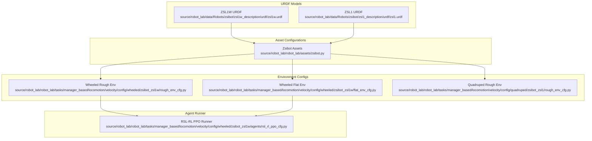
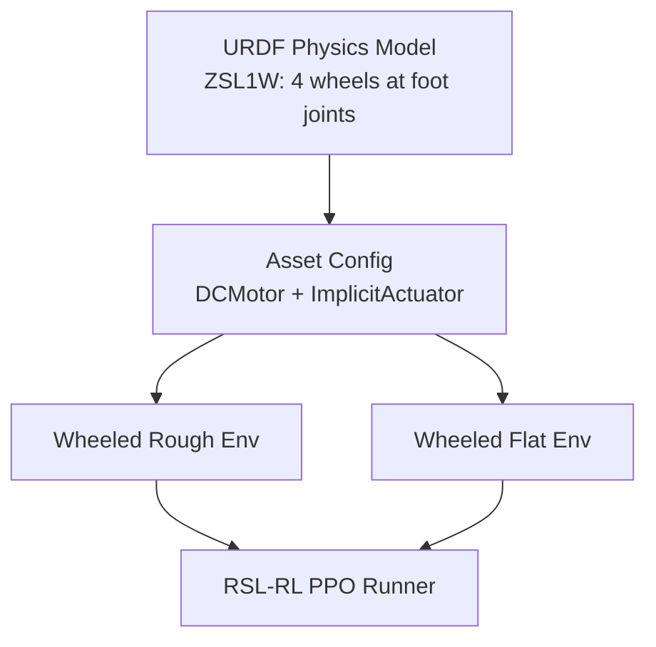
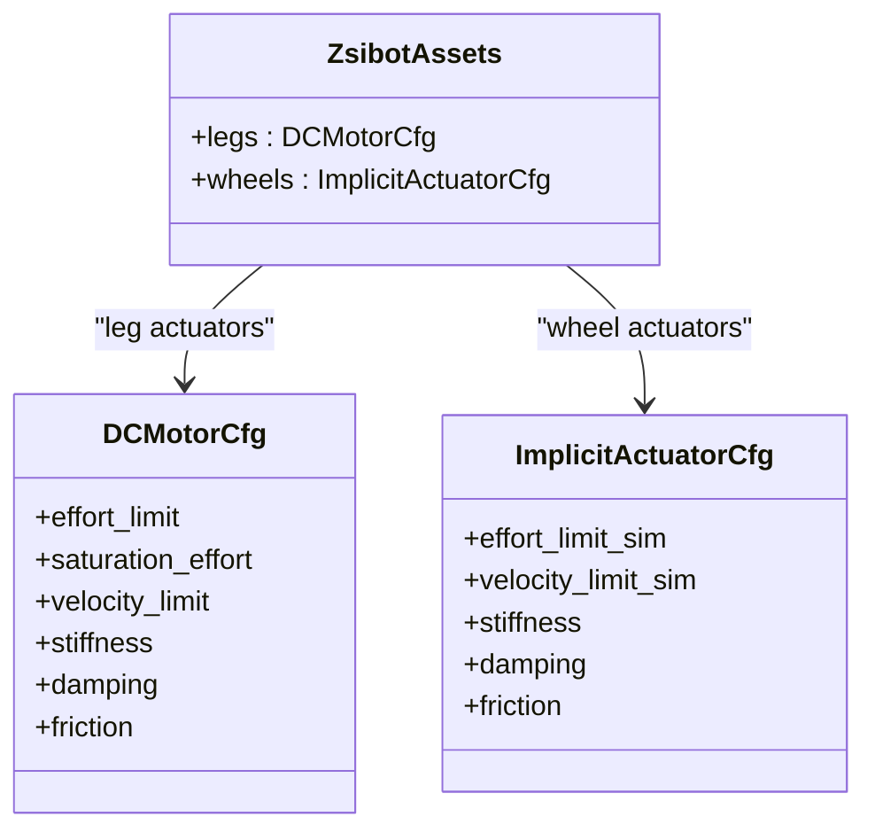
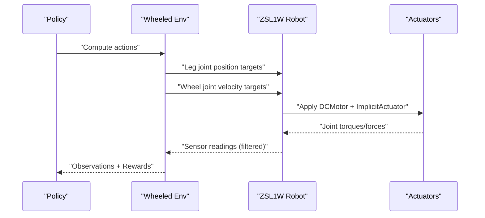
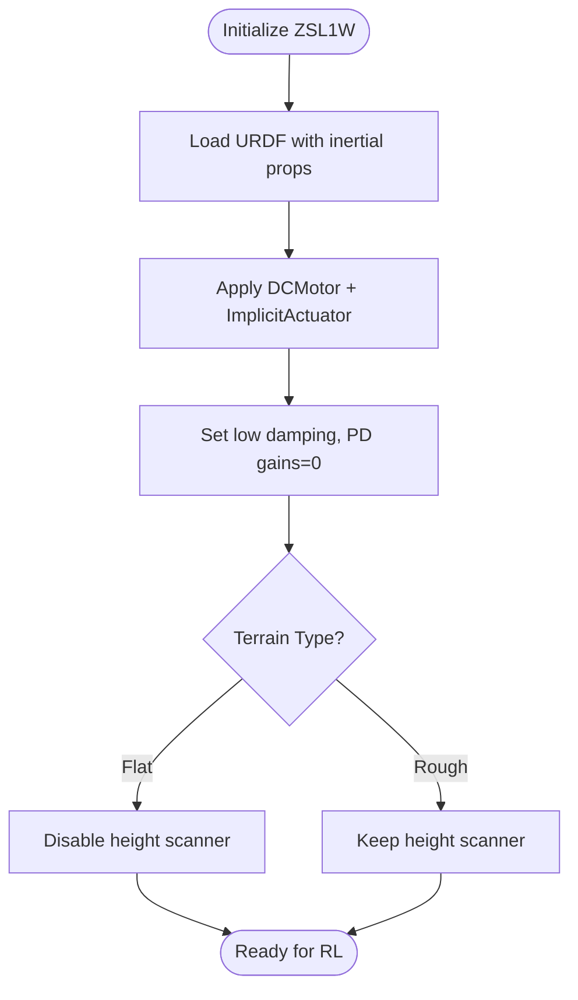
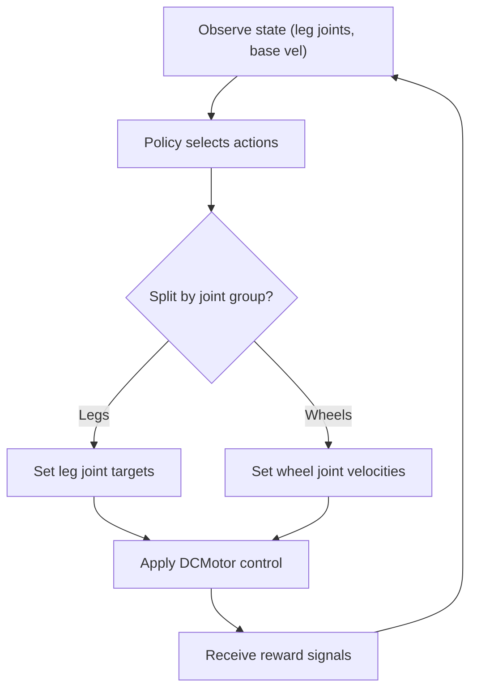
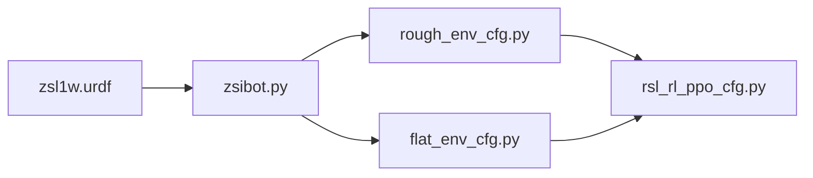

# Zsibot ZSL1W

<cite>
**Referenced Files in This Document**
- [README.md](file://README.md)
- [zsl1w.urdf](file://source/robot_lab/data/Robots/zsibot/zsl1w_description/urdf/zsl1w.urdf)
- [zsibot.py](file://source/robot_lab/robot_lab/assets/zsibot.py)
- [rough_env_cfg.py](file://source/robot_lab/robot_lab/tasks/manager_based/locomotion/velocity/config/wheeled/zsibot_zsl1w/rough_env_cfg.py)
- [flat_env_cfg.py](file://source/robot_lab/robot_lab/tasks/manager_based/locomotion/velocity/config/wheeled/zsibot_zsl1w/flat_env_cfg.py)
- [rsl_rl_ppo_cfg.py](file://source/robot_lab/robot_lab/tasks/manager_based/locomotion/velocity/config/wheeled/zsibot_zsl1w/agents/rsl_rl_ppo_cfg.py)
- [zsl1.urdf](file://source/robot_lab/data/Robots/zsibot/zsl1_description/urdf/zsl1.urdf)
- [zsl1_rough_env_cfg.py](file://source/robot_lab/robot_lab/tasks/manager_based/locomotion/velocity/config/quadruped/zsibot_zsl1/rough_env_cfg.py)
</cite>

## Table of Contents
1. [Introduction](#introduction)
2. [Project Structure](#project-structure)
3. [Core Components](#core-components)
4. [Architecture Overview](#architecture-overview)
5. [Detailed Component Analysis](#detailed-component-analysis)
6. [Dependency Analysis](#dependency-analysis)
7. [Performance Considerations](#performance-considerations)
8. [Troubleshooting Guide](#troubleshooting-guide)
9. [Conclusion](#conclusion)
10. [Appendices](#appendices)

## Introduction
This document describes the Zsibot ZSL1W lightweight wheeled robot configuration within the robot_lab ecosystem. The ZSL1W extends the ZSL1 quadruped platform by integrating wheel actuators at the foot joints, enabling omnidirectional mobility while preserving the ZSL1’s compact, agile design. The configuration emphasizes portability and energy efficiency through:
- Lightweight actuator specifications optimized for reduced mass and torque demands
- Integrated wheel mechanisms that maintain agility for indoor and confined-space operations
- Simulation optimizations tailored to low-inertia dynamics and efficient control
- Reinforcement learning environments designed for precision navigation, tight maneuvering, and energy-aware policies

## Project Structure
The ZSL1W configuration is organized around:
- URDF model defining the physical structure and inertial properties
- Asset configuration mapping joint limits, actuator models, and initial poses
- Environment configurations for flat and rough terrains, including reward shaping and action selection
- Agent runner configuration for reinforcement learning training and evaluation

**Diagram sources**
- [zsl1w.urdf](file://source/robot_lab/data/Robots/zsibot/zsl1w_description/urdf/zsl1w.urdf#L1-L959)
- [zsl1.urdf](file://source/robot_lab/data/Robots/zsibot/zsl1_description/urdf/zsl1.urdf#L1-L959)
- [zsibot.py](file://source/robot_lab/robot_lab/assets/zsibot.py#L1-L115)
- [rough_env_cfg.py](file://source/robot_lab/robot_lab/tasks/manager_based/locomotion/velocity/config/wheeled/zsibot_zsl1w/rough_env_cfg.py#L1-L238)
- [flat_env_cfg.py](file://source/robot_lab/robot_lab/tasks/manager_based/locomotion/velocity/config/wheeled/zsibot_zsl1w/flat_env_cfg.py#L1-L30)
- [zsl1_rough_env_cfg.py](file://source/robot_lab/robot_lab/tasks/manager_based/locomotion/velocity/config/quadruped/zsibot_zsl1/rough_env_cfg.py#L1-L166)
- [rsl_rl_ppo_cfg.py](file://source/robot_lab/robot_lab/tasks/manager_based/locomotion/velocity/config/wheeled/zsibot_zsl1w/agents/rsl_rl_ppo_cfg.py#L1-L46)

**Section sources**
- [README.md](file://README.md#L24-L31)
- [zsl1w.urdf](file://source/robot_lab/data/Robots/zsibot/zsl1w_description/urdf/zsl1w.urdf#L1-L959)
- [zsibot.py](file://source/robot_lab/robot_lab/assets/zsibot.py#L1-L115)
- [rough_env_cfg.py](file://source/robot_lab/robot_lab/tasks/manager_based/locomotion/velocity/config/wheeled/zsibot_zsl1w/rough_env_cfg.py#L1-L238)
- [flat_env_cfg.py](file://source/robot_lab/robot_lab/tasks/manager_based/locomotion/velocity/config/wheeled/zsibot_zsl1w/flat_env_cfg.py#L1-L30)
- [rsl_rl_ppo_cfg.py](file://source/robot_lab/robot_lab/tasks/manager_based/locomotion/velocity/config/wheeled/zsibot_zsl1w/agents/rsl_rl_ppo_cfg.py#L1-L46)
- [zsl1.urdf](file://source/robot_lab/data/Robots/zsibot/zsl1_description/urdf/zsl1.urdf#L1-L959)
- [zsl1_rough_env_cfg.py](file://source/robot_lab/robot_lab/tasks/manager_based/locomotion/velocity/config/quadruped/zsibot_zsl1/rough_env_cfg.py#L1-L166)

## Core Components
- Robot model and actuation
  - ZSL1W integrates four wheel actuators at the foot joints, transforming the ZSL1’s legged locomotion into omnidirectional mobility. The actuator configuration defines:
    - Leg motors: DCMotorCfg with effort limit, velocity limit, stiffness, damping, and friction parameters
    - Wheel actuators: ImplicitActuatorCfg for compliant, low-inertia rolling
  - Joint limits and effort/velocity caps are derived from the URDF and mirrored across the four corners for balanced dynamics
- Environment configurations
  - Wheeled rough and flat environments inherit from a shared base and customize observations, actions, rewards, and terminations for the ZSL1W’s hybrid locomotion
  - Actions are split: leg joint positions for stability and posture; wheel joint velocities for omnidirectional movement
- Reinforcement learning runner
  - PPO hyperparameters tuned for stable, efficient learning on the ZSL1W’s low-mass dynamics

**Section sources**
- [zsibot.py](file://source/robot_lab/robot_lab/assets/zsibot.py#L94-L113)
- [rough_env_cfg.py](file://source/robot_lab/robot_lab/tasks/manager_based/locomotion/velocity/config/wheeled/zsibot_zsl1w/rough_env_cfg.py#L52-L107)
- [rsl_rl_ppo_cfg.py](file://source/robot_lab/robot_lab/tasks/manager_based/locomotion/velocity/config/wheeled/zsibot_zsl1w/agents/rsl_rl_ppo_cfg.py#L9-L46)

## Architecture Overview
The ZSL1W architecture couples a URDF-based physics model with an asset configuration that exposes actuators and joint groups to the simulation and RL training pipeline. Environments define the MDP: observations exclude wheel joint positions to avoid redundant state, actions target leg and wheel groups separately, and rewards emphasize energy efficiency and precise control.

**Diagram sources**
- [zsl1w.urdf](file://source/robot_lab/data/Robots/zsibot/zsl1w_description/urdf/zsl1w.urdf#L1-L959)
- [zsibot.py](file://source/robot_lab/robot_lab/assets/zsibot.py#L60-L113)
- [rough_env_cfg.py](file://source/robot_lab/robot_lab/tasks/manager_based/locomotion/velocity/config/wheeled/zsibot_zsl1w/rough_env_cfg.py#L72-L107)
- [flat_env_cfg.py](file://source/robot_lab/robot_lab/tasks/manager_based/locomotion/velocity/config/wheeled/zsibot_zsl1w/flat_env_cfg.py#L1-L30)
- [rsl_rl_ppo_cfg.py](file://source/robot_lab/robot_lab/tasks/manager_based/locomotion/velocity/config/wheeled/zsibot_zsl1w/agents/rsl_rl_ppo_cfg.py#L9-L46)

## Detailed Component Analysis

### Actuator Specifications and Power Characteristics
- Leg actuators (DCMotor)
  - Effort limit and velocity limit are set to moderate values suitable for lightweight operation
  - Stiffness and damping balance responsiveness and stability
  - Friction set to zero for clean, low-loss actuation
- Wheel actuators (ImplicitActuator)
  - Compliant rolling with zero stiffness and small damping
  - Designed for low inertia and minimal power draw during omnidirectional motion
- Torque and velocity limits
  - Derived from joint limits in the URDF and actuator configurations
  - Effort and velocity caps are uniform across the four wheel joints for balanced control

**Diagram sources**
- [zsibot.py](file://source/robot_lab/robot_lab/assets/zsibot.py#L94-L113)

**Section sources**
- [zsibot.py](file://source/robot_lab/robot_lab/assets/zsibot.py#L94-L113)
- [zsl1w.urdf](file://source/robot_lab/data/Robots/zsibot/zsl1w_description/urdf/zsl1w.urdf#L8-L22)
- [zsl1w.urdf](file://source/robot_lab/data/Robots/zsibot/zsl1w_description/urdf/zsl1w.urdf#L99-L103)
- [zsl1w.urdf](file://source/robot_lab/data/Robots/zsibot/zsl1w_description/urdf/zsl1w.urdf#L156-L160)
- [zsl1w.urdf](file://source/robot_lab/data/Robots/zsibot/zsl1w_description/urdf/zsl1w.urdf#L211-L215)
- [zsl1w.urdf](file://source/robot_lab/data/Robots/zsibot/zsl1w_description/urdf/zsl1w.urdf#L269-L273)
- [zsl1w.urdf](file://source/robot_lab/data/Robots/zsibot/zsl1w_description/urdf/zsl1w.urdf#L327-L331)
- [zsl1w.urdf](file://source/robot_lab/data/Robots/zsibot/zsl1w_description/urdf/zsl1w.urdf#L384-L388)
- [zsl1w.urdf](file://source/robot_lab/data/Robots/zsibot/zsl1w_description/urdf/zsl1w.urdf#L439-L443)
- [zsl1w.urdf](file://source/robot_lab/data/Robots/zsibot/zsl1w_description/urdf/zsl1w.urdf#L497-L501)
- [zsl1w.urdf](file://source/robot_lab/data/Robots/zsibot/zsl1w_description/urdf/zsl1w.urdf#L555-L559)
- [zsl1w.urdf](file://source/robot_lab/data/Robots/zsibot/zsl1w_description/urdf/zsl1w.urdf#L612-L616)
- [zsl1w.urdf](file://source/robot_lab/data/Robots/zsibot/zsl1w_description/urdf/zsl1w.urdf#L667-L671)
- [zsl1w.urdf](file://source/robot_lab/data/Robots/zsibot/zsl1w_description/urdf/zsl1w.urdf#L725-L729)
- [zsl1w.urdf](file://source/robot_lab/data/Robots/zsibot/zsl1w_description/urdf/zsl1w.urdf#L783-L787)
- [zsl1w.urdf](file://source/robot_lab/data/Robots/zsibot/zsl1w_description/urdf/zsl1w.urdf#L840-L844)
- [zsl1w.urdf](file://source/robot_lab/data/Robots/zsibot/zsl1w_description/urdf/zsl1w.urdf#L895-L899)
- [zsl1w.urdf](file://source/robot_lab/data/Robots/zsibot/zsl1w_description/urdf/zsl1w.urdf#L952-L956)

### Wheel Integration and Omnidirectional Mobility
- Wheel placement
  - Four wheels are integrated at the foot joints of all legs, enabling holonomic motion
- Control strategy
  - Wheel joints accept velocity commands independently, allowing strafing and rotation without translation
  - Leg joints remain primarily for stability and posture, with position targets for stance control
- Observation design
  - Wheel joint positions are excluded from policy observations to reduce redundancy and improve generalization
  - Joint velocities for wheels are included to inform control policies

**Diagram sources**
- [rough_env_cfg.py](file://source/robot_lab/robot_lab/tasks/manager_based/locomotion/velocity/config/wheeled/zsibot_zsl1w/rough_env_cfg.py#L82-L106)
- [zsibot.py](file://source/robot_lab/robot_lab/assets/zsibot.py#L94-L113)

**Section sources**
- [rough_env_cfg.py](file://source/robot_lab/robot_lab/tasks/manager_based/locomotion/velocity/config/wheeled/zsibot_zsl1w/rough_env_cfg.py#L59-L106)
- [zsl1w.urdf](file://source/robot_lab/data/Robots/zsibot/zsl1w_description/urdf/zsl1w.urdf#L1-L959)
- [zsibot.py](file://source/robot_lab/robot_lab/assets/zsibot.py#L94-L113)

### Simulation Optimizations for Lightweight Dynamics
- Reduced mass and inertia
  - Base link mass and inertia are modest, supporting rapid accelerations and decelerations
- Minimal damping and gravity considerations
  - Low linear/angular damping and configurable gravity align with lightweight control
- Joint drive settings
  - Zero stiffness/damping PD gains in URDF conversion emphasize implicit actuator control
- Environment simplifications
  - Flat terrain variant removes height scanning and terrain curriculum for faster training

**Diagram sources**
- [zsl1w.urdf](file://source/robot_lab/data/Robots/zsibot/zsl1w_description/urdf/zsl1w.urdf#L8-L22)
- [zsl1w.urdf](file://source/robot_lab/data/Robots/zsibot/zsl1w_description/urdf/zsl1w.urdf#L79-L81)
- [flat_env_cfg.py](file://source/robot_lab/robot_lab/tasks/manager_based/locomotion/velocity/config/wheeled/zsibot_zsl1w/flat_env_cfg.py#L15-L25)

**Section sources**
- [zsl1w.urdf](file://source/robot_lab/data/Robots/zsibot/zsl1w_description/urdf/zsl1w.urdf#L8-L22)
- [zsl1w.urdf](file://source/robot_lab/data/Robots/zsibot/zsl1w_description/urdf/zsl1w.urdf#L67-L81)
- [flat_env_cfg.py](file://source/robot_lab/robot_lab/tasks/manager_based/locomotion/velocity/config/wheeled/zsibot_zsl1w/flat_env_cfg.py#L15-L25)

### Control Strategies and Reward Design
- Action separation
  - Leg joint positions: stabilize posture and gait
  - Wheel joint velocities: achieve omnidirectional motion
- Reward emphasis
  - Energy efficiency via joint torques/accelerations/power penalties
  - Tracking rewards for translational and rotational velocity
  - Contact and orientation penalties to maintain stability
- Environment variants
  - Rough terrain adds uneven ground challenges; flat terrain focuses on precision and energy efficiency

**Diagram sources**
- [rough_env_cfg.py](file://source/robot_lab/robot_lab/tasks/manager_based/locomotion/velocity/config/wheeled/zsibot_zsl1w/rough_env_cfg.py#L82-L106)
- [rough_env_cfg.py](file://source/robot_lab/robot_lab/tasks/manager_based/locomotion/velocity/config/wheeled/zsibot_zsl1w/rough_env_cfg.py#L134-L222)

**Section sources**
- [rough_env_cfg.py](file://source/robot_lab/robot_lab/tasks/manager_based/locomotion/velocity/config/wheeled/zsibot_zsl1w/rough_env_cfg.py#L82-L106)
- [rough_env_cfg.py](file://source/robot_lab/robot_lab/tasks/manager_based/locomotion/velocity/config/wheeled/zsibot_zsl1w/rough_env_cfg.py#L134-L222)

### Training Scenarios and Recommendations
- Precision navigation
  - Use flat terrain environment to train tracking rewards and minimize energy expenditure
  - Focus on wheel velocity actions and leg posture stabilization
- Tight space maneuvering
  - Use rough terrain environment to practice contact-aware control and stability under disturbances
  - Emphasize action-rate penalties and contact force regularization
- Energy-efficient operation
  - Train with joint torque/acceleration/power penalties active
  - Reduce action scales for fine control and smoother trajectories

**Section sources**
- [flat_env_cfg.py](file://source/robot_lab/robot_lab/tasks/manager_based/locomotion/velocity/config/wheeled/zsibot_zsl1w/flat_env_cfg.py#L1-L30)
- [rough_env_cfg.py](file://source/robot_lab/robot_lab/tasks/manager_based/locomotion/velocity/config/wheeled/zsibot_zsl1w/rough_env_cfg.py#L134-L222)
- [rsl_rl_ppo_cfg.py](file://source/robot_lab/robot_lab/tasks/manager_based/locomotion/velocity/config/wheeled/zsibot_zsl1w/agents/rsl_rl_ppo_cfg.py#L9-L46)

## Dependency Analysis
The ZSL1W depends on the asset configuration to expose actuators and joint groups to the environment and RL runner. The environment configurations depend on the asset and MDP utilities to define observations, actions, and rewards.

**Diagram sources**
- [zsl1w.urdf](file://source/robot_lab/data/Robots/zsibot/zsl1w_description/urdf/zsl1w.urdf#L1-L959)
- [zsibot.py](file://source/robot_lab/robot_lab/assets/zsibot.py#L60-L113)
- [rough_env_cfg.py](file://source/robot_lab/robot_lab/tasks/manager_based/locomotion/velocity/config/wheeled/zsibot_zsl1w/rough_env_cfg.py#L72-L107)
- [flat_env_cfg.py](file://source/robot_lab/robot_lab/tasks/manager_based/locomotion/velocity/config/wheeled/zsibot_zsl1w/flat_env_cfg.py#L1-L30)
- [rsl_rl_ppo_cfg.py](file://source/robot_lab/robot_lab/tasks/manager_based/locomotion/velocity/config/wheeled/zsibot_zsl1w/agents/rsl_rl_ppo_cfg.py#L9-L46)

**Section sources**
- [zsibot.py](file://source/robot_lab/robot_lab/assets/zsibot.py#L60-L113)
- [rough_env_cfg.py](file://source/robot_lab/robot_lab/tasks/manager_based/locomotion/velocity/config/wheeled/zsibot_zsl1w/rough_env_cfg.py#L72-L107)
- [flat_env_cfg.py](file://source/robot_lab/robot_lab/tasks/manager_based/locomotion/velocity/config/wheeled/zsibot_zsl1w/flat_env_cfg.py#L1-L30)
- [rsl_rl_ppo_cfg.py](file://source/robot_lab/robot_lab/tasks/manager_based/locomotion/velocity/config/wheeled/zsibot_zsl1w/agents/rsl_rl_ppo_cfg.py#L9-L46)

## Performance Considerations
- Weight and agility
  - Low base mass and minimal damping enable quick response and tight turns, ideal for indoor navigation
- Actuator efficiency
  - Moderate effort/velocity limits prevent excessive power draw while maintaining dynamic range
  - Implicit wheel actuators reduce control complexity and computational overhead
- Training efficiency
  - Flat terrain reduces training variance and accelerates convergence
  - Reduced observation dimensionality (excluding wheel positions) improves policy generalization

[No sources needed since this section provides general guidance]

## Troubleshooting Guide
- Excessive wheel slip or instability
  - Verify wheel joint velocity limits and damping parameters
  - Confirm contact forces and undesired contacts rewards are active
- Poor tracking performance
  - Increase tracking reward weights and adjust action scales
  - Ensure base velocity observations are properly scaled
- Training divergence
  - Reduce learning rate or adjust PPO hyperparameters
  - Check reward term weights and ensure zero-weight terms are disabled appropriately

**Section sources**
- [rough_env_cfg.py](file://source/robot_lab/robot_lab/tasks/manager_based/locomotion/velocity/config/wheeled/zsibot_zsl1w/rough_env_cfg.py#L184-L222)
- [rsl_rl_ppo_cfg.py](file://source/robot_lab/robot_lab/tasks/manager_based/locomotion/velocity/config/wheeled/zsibot_zsl1w/agents/rsl_rl_ppo_cfg.py#L23-L36)

## Conclusion
The Zsibot ZSL1W combines the ZSL1’s compact, agile design with integrated wheel actuators to deliver omnidirectional mobility suited for indoor and confined environments. Its lightweight actuator specifications, simulation optimizations, and environment-specific reward designs support efficient, precise control. Training scenarios emphasize precision navigation, tight maneuvering, and energy-aware policies, leveraging both flat and rough terrains to develop robust behaviors.

[No sources needed since this section summarizes without analyzing specific files]

## Appendices
- Related platforms for comparison
  - ZSL1 quadruped baseline for comparison of leg-only locomotion
  - Other wheeled robots in the repository for contrasting actuator and control strategies

**Section sources**
- [README.md](file://README.md#L24-L31)
- [zsl1_rough_env_cfg.py](file://source/robot_lab/robot_lab/tasks/manager_based/locomotion/velocity/config/quadruped/zsibot_zsl1/rough_env_cfg.py#L1-L166)