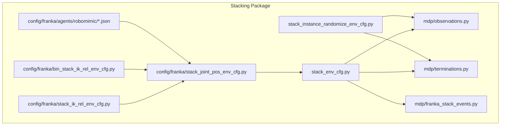
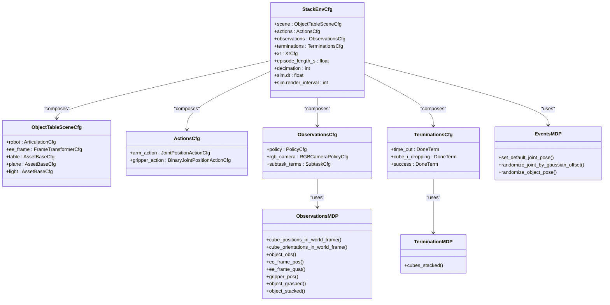
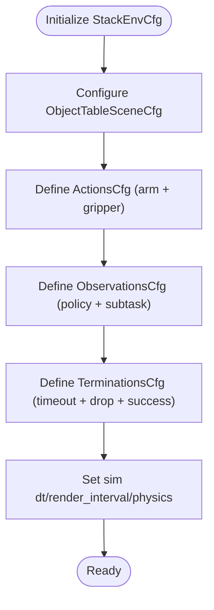
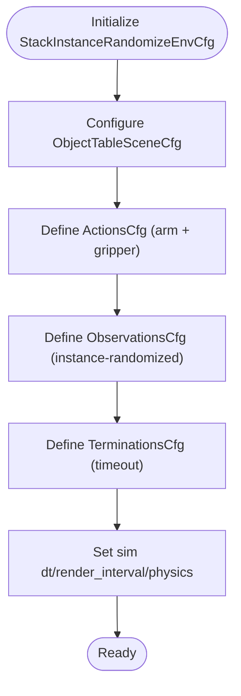
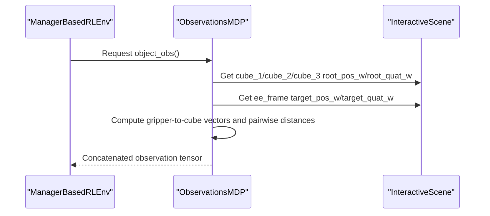
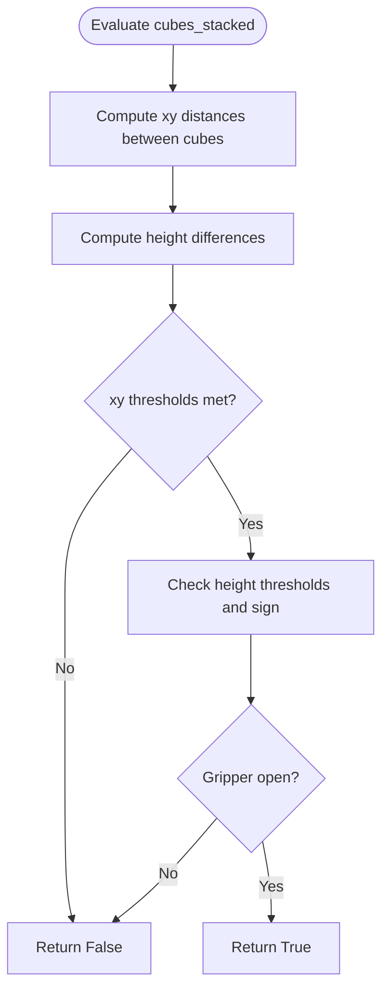
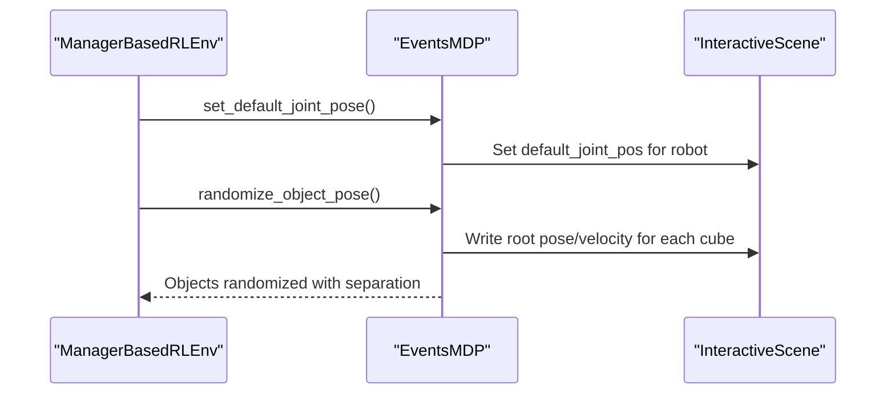
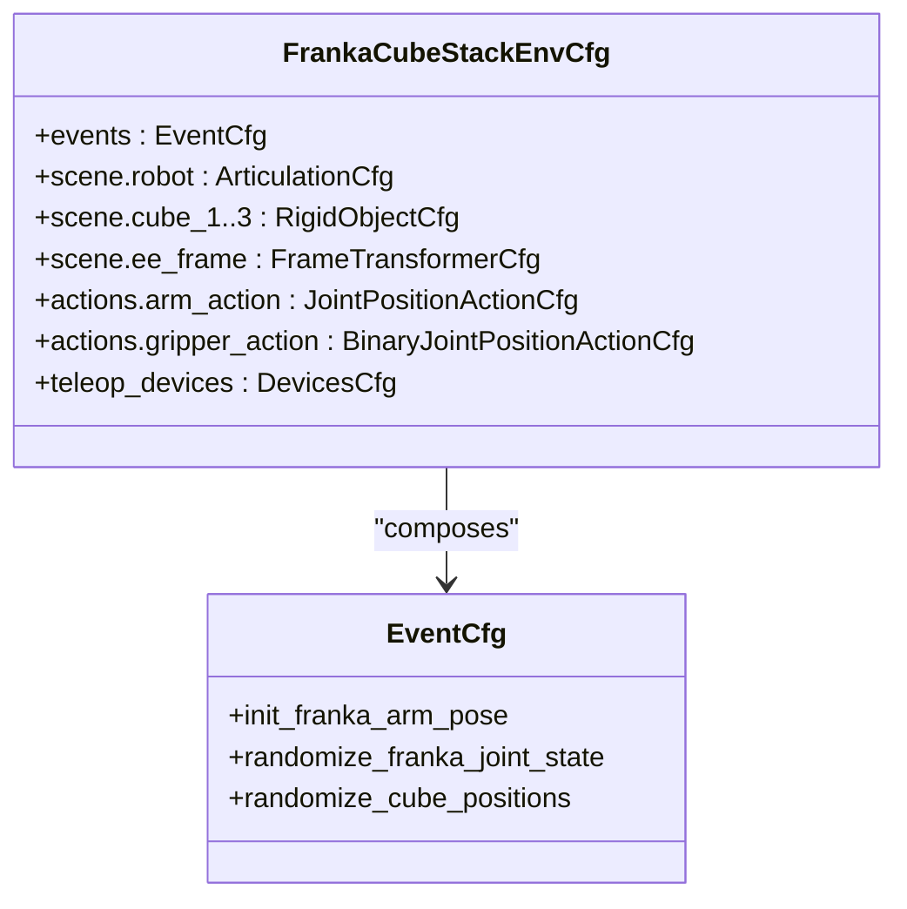
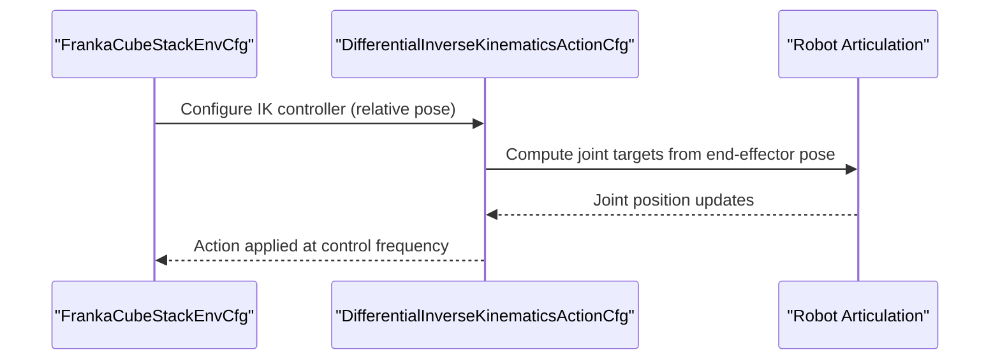
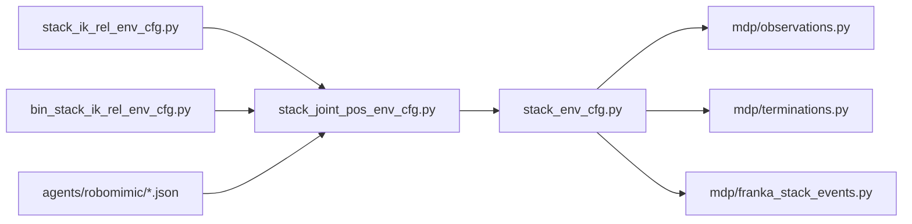

# Stacking Activities

<cite>
**Referenced Files in This Document**
- [stack_env_cfg.py](file://source/robot_lab/robot_lab/tasks/manager_based/manipulation/stack/stack_env_cfg.py)
- [stack_instance_randomize_env_cfg.py](file://source/robot_lab/robot_lab/tasks/manager_based/manipulation/stack/stack_instance_randomize_env_cfg.py)
- [observations.py](file://source/robot_lab/robot_lab/tasks/manager_based/manipulation/stack/mdp/observations.py)
- [terminations.py](file://source/robot_lab/robot_lab/tasks/manager_based/manipulation/stack/mdp/terminations.py)
- [franka_stack_events.py](file://source/robot_lab/robot_lab/tasks/manager_based/manipulation/stack/mdp/franka_stack_events.py)
- [stack_joint_pos_env_cfg.py](file://source/robot_lab/robot_lab/tasks/manager_based/manipulation/stack/config/franka/stack_joint_pos_env_cfg.py)
- [stack_ik_rel_env_cfg.py](file://source/robot_lab/robot_lab/tasks/manager_based/manipulation/stack/config/franka/stack_ik_rel_env_cfg.py)
- [bin_stack_ik_rel_env_cfg.py](file://source/robot_lab/robot_lab/tasks/manager_based/manipulation/stack/config/franka/bin_stack_ik_rel_env_cfg.py)
- [bc_rnn_image_84.json](file://source/robot_lab/robot_lab/tasks/manager_based/manipulation/stack/config/franka/agents/robomimic/bc_rnn_image_84.json)
- [bc_rnn_image_cosmos.json](file://source/robot_lab/robot_lab/tasks/manager_based/manipulation/stack/config/franka/agents/robomimic/bc_rnn_image_cosmos.json)
- [bc_rnn_low_dim.json](file://source/robot_lab/robot_lab/tasks/manager_based/manipulation/stack/config/franka/agents/robomimic/bc_rnn_low_dim.json)
</cite>

## Table of Contents
1. [Introduction](#introduction)
2. [Project Structure](#project-structure)
3. [Core Components](#core-components)
4. [Architecture Overview](#architecture-overview)
5. [Detailed Component Analysis](#detailed-component-analysis)
6. [Dependency Analysis](#dependency-analysis)
7. [Performance Considerations](#performance-considerations)
8. [Troubleshooting Guide](#troubleshooting-guide)
9. [Conclusion](#conclusion)

## Introduction
This document describes the Stacking Activities implementation within the robot lab codebase. It focuses on the environment configuration, MDP components (observations, terminations, and events), and robot-specific configurations for stacking three cubes on a table using manipulator robots. The system supports both joint-position control and differential inverse kinematics for pose control, with optional teleoperation via OpenXR and keyboard devices. Reinforcement learning and imitation learning agents are supported through modular configuration files.

## Project Structure
The stacking functionality is organized under a dedicated package with the following high-level layout:
- Environment configuration base classes and derived configurations
- MDP modules for observations, terminations, and robot-specific events
- Robot-specific configurations for different manipulator platforms
- Agent configurations for imitation learning policies

**Diagram sources**
- [stack_env_cfg.py:164-200](file://source/robot_lab/robot_lab/tasks/manager_based/manipulation/stack/stack_env_cfg.py#L164-L200)
- [stack_instance_randomize_env_cfg.py:105-136](file://source/robot_lab/robot_lab/tasks/manager_based/manipulation/stack/stack_instance_randomize_env_cfg.py#L105-L136)
- [observations.py:1-533](file://source/robot_lab/robot_lab/tasks/manager_based/manipulation/stack/mdp/observations.py#L1-L533)
- [terminations.py:1-93](file://source/robot_lab/robot_lab/tasks/manager_based/manipulation/stack/mdp/terminations.py#L1-L93)
- [franka_stack_events.py:1-315](file://source/robot_lab/robot_lab/tasks/manager_based/manipulation/stack/mdp/franka_stack_events.py#L1-L315)
- [stack_joint_pos_env_cfg.py:61-169](file://source/robot_lab/robot_lab/tasks/manager_based/manipulation/stack/config/franka/stack_joint_pos_env_cfg.py#L61-L169)
- [stack_ik_rel_env_cfg.py:24-70](file://source/robot_lab/robot_lab/tasks/manager_based/manipulation/stack/config/franka/stack_ik_rel_env_cfg.py#L24-L70)
- [bin_stack_ik_rel_env_cfg.py:18-36](file://source/robot_lab/robot_lab/tasks/manager_based/manipulation/stack/config/franka/bin_stack_ik_rel_env_cfg.py#L18-L36)
- [bc_rnn_image_84.json:1-220](file://source/robot_lab/robot_lab/tasks/manager_based/manipulation/stack/config/franka/agents/robomimic/bc_rnn_image_84.json#L1-L220)

**Section sources**
- [stack_env_cfg.py:1-200](file://source/robot_lab/robot_lab/tasks/manager_based/manipulation/stack/stack_env_cfg.py#L1-L200)
- [stack_instance_randomize_env_cfg.py:1-136](file://source/robot_lab/robot_lab/tasks/manager_based/manipulation/stack/stack_instance_randomize_env_cfg.py#L1-L136)

## Core Components
- Environment configuration base: Defines the basic scene, actions, observations, and terminations for stacking.
- Instance-randomized environment: Similar to the base but uses per-environment object selection for robustness.
- Observations MDP: Provides world-frame and base-frame object states, gripper pose, and gripper status.
- Termination MDP: Detects successful stacking and timeouts/falls.
- Robot-specific events: Initializes robot joint poses, randomizes joint states, and randomizes object poses.
- Robot configurations: Define robot assets, gripper actions, cube spawning, and end-effector frame transforms.
- Agent configurations: Provide policy hyperparameters for imitation learning.

Key responsibilities:
- Scene setup: Table, ground plane, lighting, and semantic tagging.
- Robot action specification: Joint position control and gripper binary control; optional differential IK pose control.
- Observation pipeline: Concatenated object positions/quaternions, gripper-to-object distances, and gripper state.
- Termination detection: Stacking success criteria and failure conditions (drop-through, timeout).
- Teleoperation: Optional OpenXR and keyboard devices for interactive control.

**Section sources**
- [stack_env_cfg.py:28-200](file://source/robot_lab/robot_lab/tasks/manager_based/manipulation/stack/stack_env_cfg.py#L28-L200)
- [stack_instance_randomize_env_cfg.py:26-136](file://source/robot_lab/robot_lab/tasks/manager_based/manipulation/stack/stack_instance_randomize_env_cfg.py#L26-L136)
- [observations.py:20-533](file://source/robot_lab/robot_lab/tasks/manager_based/manipulation/stack/mdp/observations.py#L20-L533)
- [terminations.py:24-93](file://source/robot_lab/robot_lab/tasks/manager_based/manipulation/stack/mdp/terminations.py#L24-L93)
- [franka_stack_events.py:24-315](file://source/robot_lab/robot_lab/tasks/manager_based/manipulation/stack/mdp/franka_stack_events.py#L24-L315)
- [stack_joint_pos_env_cfg.py:61-169](file://source/robot_lab/robot_lab/tasks/manager_based/manipulation/stack/config/franka/stack_joint_pos_env_cfg.py#L61-L169)
- [stack_ik_rel_env_cfg.py:24-70](file://source/robot_lab/robot_lab/tasks/manager_based/manipulation/stack/config/franka/stack_ik_rel_env_cfg.py#L24-L70)
- [bin_stack_ik_rel_env_cfg.py:18-36](file://source/robot_lab/robot_lab/tasks/manager_based/manipulation/stack/config/franka/bin_stack_ik_rel_env_cfg.py#L18-L36)

## Architecture Overview
The stacking architecture combines environment configuration with MDP modules and robot-specific settings. The environment defines the scene and managers, while MDP modules compute observations and termination signals. Robot configurations specify assets and actions, and agent configurations define policy parameters.

**Diagram sources**
- [stack_env_cfg.py:28-200](file://source/robot_lab/robot_lab/tasks/manager_based/manipulation/stack/stack_env_cfg.py#L28-L200)
- [observations.py:20-533](file://source/robot_lab/robot_lab/tasks/manager_based/manipulation/stack/mdp/observations.py#L20-L533)
- [terminations.py:24-93](file://source/robot_lab/robot_lab/tasks/manager_based/manipulation/stack/mdp/terminations.py#L24-L93)
- [franka_stack_events.py:24-315](file://source/robot_lab/robot_lab/tasks/manager_based/manipulation/stack/mdp/franka_stack_events.py#L24-L315)

## Detailed Component Analysis

### Environment Configuration Base
Defines the foundational environment for stacking:
- Scene: Table, ground plane, dome light, and environment spacing.
- Actions: Arm joint position action and gripper binary action.
- Observations: Policy, RGB camera, and subtask observation groups.
- Termination: Timeout, drop-through detection for each cube, and success condition.
- Simulation parameters: Physics settings, render interval, and episode length.

**Diagram sources**
- [stack_env_cfg.py:28-200](file://source/robot_lab/robot_lab/tasks/manager_based/manipulation/stack/stack_env_cfg.py#L28-L200)

**Section sources**
- [stack_env_cfg.py:28-200](file://source/robot_lab/robot_lab/tasks/manager_based/manipulation/stack/stack_env_cfg.py#L28-L200)

### Instance-Randomized Environment
Extends the base environment to support per-environment object selection and focused rigid object states, enabling robust training under varying object configurations.

**Diagram sources**
- [stack_instance_randomize_env_cfg.py:26-136](file://source/robot_lab/robot_lab/tasks/manager_based/manipulation/stack/stack_instance_randomize_env_cfg.py#L26-L136)

**Section sources**
- [stack_instance_randomize_env_cfg.py:26-136](file://source/robot_lab/robot_lab/tasks/manager_based/manipulation/stack/stack_instance_randomize_env_cfg.py#L26-L136)

### Observations MDP
Provides observation functions for:
- World-frame positions and orientations of three cubes
- Relative vectors from gripper to each cube and pairwise distances
- End-effector position/quaternion in world/base frames
- Gripper state (binary for parallel jaw grippers or suction gripper state)
- Base-frame absolute object observations

**Diagram sources**
- [observations.py:104-166](file://source/robot_lab/robot_lab/tasks/manager_based/manipulation/stack/mdp/observations.py#L104-L166)

**Section sources**
- [observations.py:20-533](file://source/robot_lab/robot_lab/tasks/manager_based/manipulation/stack/mdp/observations.py#L20-L533)

### Termination MDP
Detects successful stacking by checking:
- Pairwise horizontal and vertical separations between cubes
- Height offset threshold consistent with cube geometry
- Gripper state (open for suction or gripper joints at open value)
- Timeout and drop-through conditions

**Diagram sources**
- [terminations.py:24-93](file://source/robot_lab/robot_lab/tasks/manager_based/manipulation/stack/mdp/terminations.py#L24-L93)

**Section sources**
- [terminations.py:24-93](file://source/robot_lab/robot_lab/tasks/manager_based/manipulation/stack/mdp/terminations.py#L24-L93)

### Robot-Specific Events
Initializes and randomizes robot and object states:
- Sets default joint pose for the robot
- Adds Gaussian noise to joint positions within limits
- Randomizes object poses with minimum separation and Euler ranges
- Supports per-environment focused object selection for robustness

**Diagram sources**
- [franka_stack_events.py:24-315](file://source/robot_lab/robot_lab/tasks/manager_based/manipulation/stack/mdp/franka_stack_events.py#L24-L315)

**Section sources**
- [franka_stack_events.py:24-315](file://source/robot_lab/robot_lab/tasks/manager_based/manipulation/stack/mdp/franka_stack_events.py#L24-L315)

### Robot Configurations (Franka)
Defines robot-specific settings:
- Robot asset: Panda robot with high PD gains for IK tracking
- Gripper actions: Binary joint position control for panda fingers
- Cube spawning: Three colored blocks with rigid body properties
- End-effector frame: Transforms for hand/rightfinger/leftfinger with offsets
- Teleoperation devices: OpenXR and keyboard for interactive control

**Diagram sources**
- [stack_joint_pos_env_cfg.py:61-169](file://source/robot_lab/robot_lab/tasks/manager_based/manipulation/stack/config/franka/stack_joint_pos_env_cfg.py#L61-L169)

**Section sources**
- [stack_joint_pos_env_cfg.py:61-169](file://source/robot_lab/robot_lab/tasks/manager_based/manipulation/stack/config/franka/stack_joint_pos_env_cfg.py#L61-L169)

### Pose Control with Differential IK (Franka)
Extends joint-position control to differential inverse kinematics:
- Uses differential IK controller in relative mode
- Applies body offset for panda hand
- Enables teleoperation via OpenXR and keyboard

**Diagram sources**
- [stack_ik_rel_env_cfg.py:34-41](file://source/robot_lab/robot_lab/tasks/manager_based/manipulation/stack/config/franka/stack_ik_rel_env_cfg.py#L34-L41)

**Section sources**
- [stack_ik_rel_env_cfg.py:24-70](file://source/robot_lab/robot_lab/tasks/manager_based/manipulation/stack/config/franka/stack_ik_rel_env_cfg.py#L24-L70)

### Bin Stacking with IK (Franka)
Provides a variant for bin-style stacking using differential IK:
- Inherits base configuration and overrides robot and action settings
- Suitable for scenarios requiring precise placement within bins

**Section sources**
- [bin_stack_ik_rel_env_cfg.py:18-36](file://source/robot_lab/robot_lab/tasks/manager_based/manipulation/stack/config/franka/bin_stack_ik_rel_env_cfg.py#L18-L36)

### Agent Configurations (Imitation Learning)
Policy hyperparameters for RoboMimic BC with RNN:
- Image-based policies with ResNet backbone and spatial softmax pooling
- Low-dimensional policies conditioned on end-effector pose and gripper state
- GMM modes for action distribution and LSTM RNN structure

**Section sources**
- [bc_rnn_image_84.json:1-220](file://source/robot_lab/robot_lab/tasks/manager_based/manipulation/stack/config/franka/agents/robomimic/bc_rnn_image_84.json#L1-L220)
- [bc_rnn_image_cosmos.json:1-219](file://source/robot_lab/robot_lab/tasks/manager_based/manipulation/stack/config/franka/agents/robomimic/bc_rnn_image_cosmos.json#L1-L219)
- [bc_rnn_low_dim.json:1-102](file://source/robot_lab/robot_lab/tasks/manager_based/manipulation/stack/config/franka/agents/robomimic/bc_rnn_low_dim.json#L1-L102)

## Dependency Analysis
The stacking system exhibits clear modularity:
- Environment configurations depend on MDP modules for observations and terminations.
- Robot-specific configurations inherit from the base environment and override robot and action definitions.
- Events MDP is integrated into robot configurations to initialize and randomize states.
- Agent configurations are decoupled and reference the environment through shared observation/action spaces.

**Diagram sources**
- [stack_env_cfg.py:164-200](file://source/robot_lab/robot_lab/tasks/manager_based/manipulation/stack/stack_env_cfg.py#L164-L200)
- [observations.py:1-533](file://source/robot_lab/robot_lab/tasks/manager_based/manipulation/stack/mdp/observations.py#L1-L533)
- [terminations.py:1-93](file://source/robot_lab/robot_lab/tasks/manager_based/manipulation/stack/mdp/terminations.py#L1-L93)
- [franka_stack_events.py:1-315](file://source/robot_lab/robot_lab/tasks/manager_based/manipulation/stack/mdp/franka_stack_events.py#L1-L315)
- [stack_joint_pos_env_cfg.py:61-169](file://source/robot_lab/robot_lab/tasks/manager_based/manipulation/stack/config/franka/stack_joint_pos_env_cfg.py#L61-L169)
- [stack_ik_rel_env_cfg.py:24-70](file://source/robot_lab/robot_lab/tasks/manager_based/manipulation/stack/config/franka/stack_ik_rel_env_cfg.py#L24-L70)
- [bin_stack_ik_rel_env_cfg.py:18-36](file://source/robot_lab/robot_lab/tasks/manager_based/manipulation/stack/config/franka/bin_stack_ik_rel_env_cfg.py#L18-L36)

**Section sources**
- [stack_env_cfg.py:164-200](file://source/robot_lab/robot_lab/tasks/manager_based/manipulation/stack/stack_env_cfg.py#L164-L200)
- [stack_joint_pos_env_cfg.py:61-169](file://source/robot_lab/robot_lab/tasks/manager_based/manipulation/stack/config/franka/stack_joint_pos_env_cfg.py#L61-L169)

## Performance Considerations
- Simulation fidelity: High PD gains for IK tracking improve pose following accuracy.
- Physics parameters: Adjust bounce thresholds and aggregate pair capacities for stability and performance.
- Render interval: Balances visualization quality and simulation throughput.
- Observation concatenation: Minimizing concatenation overhead improves throughput.
- Teleoperation: OpenXR and keyboard introduce minimal overhead compared to simulation steps.

[No sources needed since this section provides general guidance]

## Troubleshooting Guide
Common issues and resolutions:
- Gripper state mismatches: Ensure gripper joint names and open values match the robot configuration.
- Stacking not detected: Verify thresholds for xy distance, height difference, and gripper open state.
- Object falls through table: Check minimum height threshold and gravity settings.
- IK tracking drift: Increase PD gains or reduce scale factor for differential IK.
- Teleop not responding: Confirm OpenXR device binding and retargeter configuration.

**Section sources**
- [stack_env_cfg.py:142-200](file://source/robot_lab/robot_lab/tasks/manager_based/manipulation/stack/stack_env_cfg.py#L142-L200)
- [terminations.py:24-93](file://source/robot_lab/robot_lab/tasks/manager_based/manipulation/stack/mdp/terminations.py#L24-L93)
- [stack_ik_rel_env_cfg.py:34-41](file://source/robot_lab/robot_lab/tasks/manager_based/manipulation/stack/config/franka/stack_ik_rel_env_cfg.py#L34-L41)

## Conclusion
The Stacking Activities implementation provides a modular, extensible framework for training and evaluating manipulation policies on cube-stacking tasks. It integrates environment configuration, MDP modules, robot-specific settings, and agent configurations to support both joint-position and differential IK control, with optional teleoperation and robust instance-randomization capabilities.