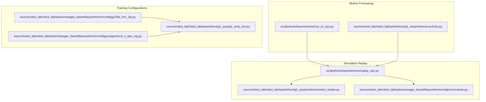
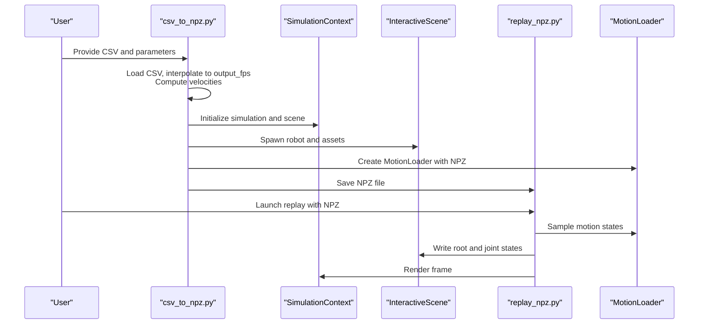
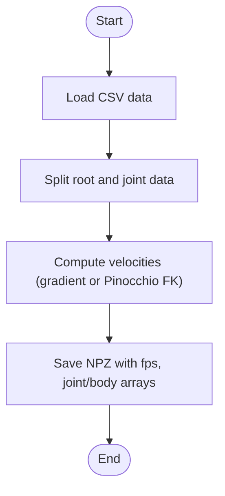
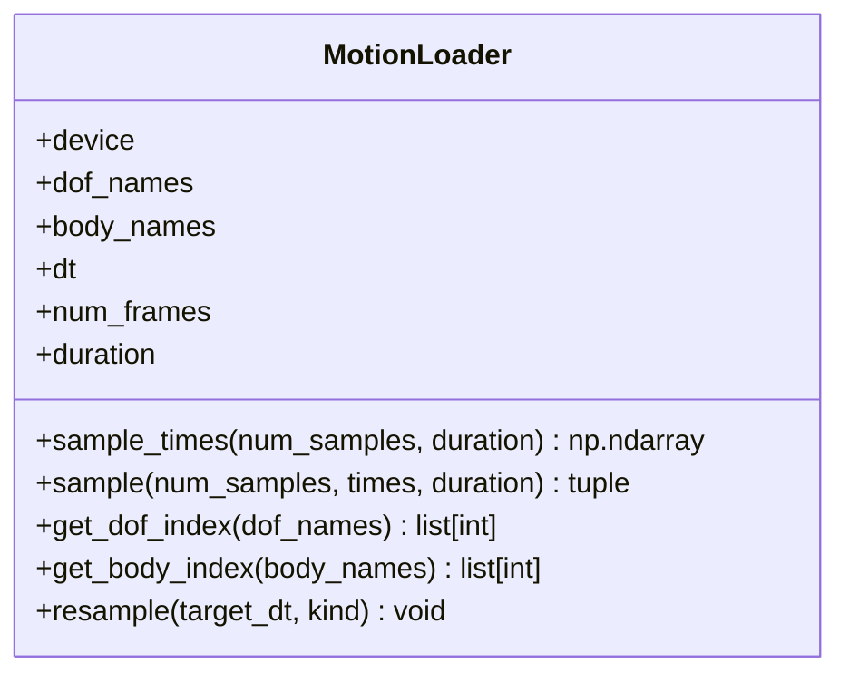
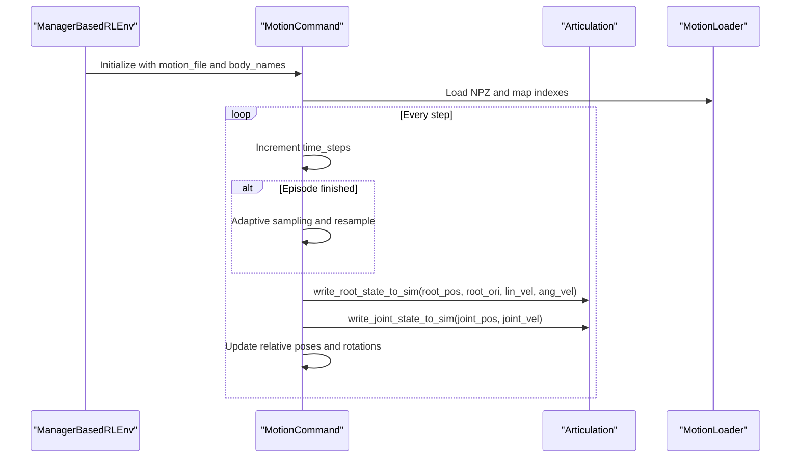
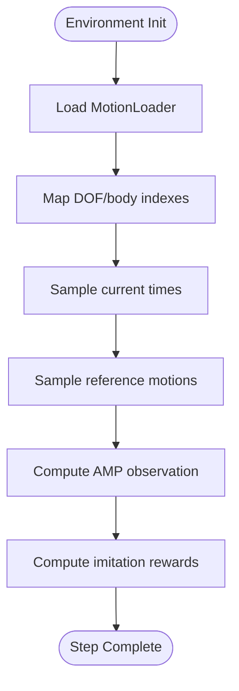
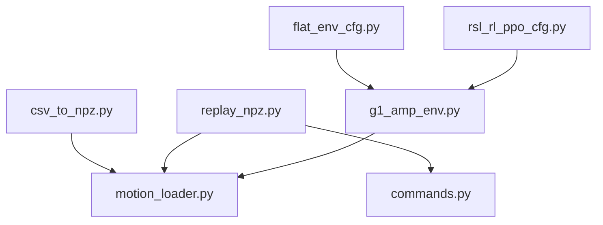

# Beyond Mimic Motion Imitation

<cite>
**Referenced Files in This Document**
- [README.md](file://README.md)
- [csv_to_npz.py](file://scripts/tools/beyondmimic/csv_to_npz.py)
- [replay_npz.py](file://scripts/tools/beyondmimic/replay_npz.py)
- [motion_loader.py](file://source/robot_lab/robot_lab/tasks/direct/g1_amp/motions/motion_loader.py)
- [g1_amp_env.py](file://source/robot_lab/robot_lab/tasks/direct/g1_amp/g1_amp_env.py)
- [commands.py](file://source/robot_lab/robot_lab/tasks/manager_based/beyondmimic/mdp/commands.py)
- [flat_env_cfg.py](file://source/robot_lab/robot_lab/tasks/manager_based/beyondmimic/config/g1/flat_env_cfg.py)
- [rsl_rl_ppo_cfg.py](file://source/robot_lab/robot_lab/tasks/manager_based/beyondmimic/config/g1/agents/rsl_rl_ppo_cfg.py)
- [csv2npz.py](file://source/robot_lab/robot_lab/tasks/direct/g1_amp/motions/csv2npz.py)
</cite>

## Table of Contents
1. [Introduction](#introduction)
2. [Project Structure](#project-structure)
3. [Core Components](#core-components)
4. [Architecture Overview](#architecture-overview)
5. [Detailed Component Analysis](#detailed-component-analysis)
6. [Dependency Analysis](#dependency-analysis)
7. [Performance Considerations](#performance-considerations)
8. [Troubleshooting Guide](#troubleshooting-guide)
9. [Conclusion](#conclusion)
10. [Appendices](#appendices)

## Introduction
Beyond Mimic is a motion imitation system integrated with the Isaac Lab ecosystem for humanoid robots. It enables converting motion capture data from CSV to NPZ format, replaying motions in simulation, and training policies to imitate human-like behaviors. The system supports Unitree G1 humanoid robots and provides tools for motion preprocessing, retargeting, and evaluation.

Key capabilities:
- CSV-to-NPZ conversion with forward kinematics and velocity computation
- Motion replay in simulation with configurable FPS and frame ranges
- Retargeting and alignment of human motion capture data to robot kinematics
- Training environments for imitation learning with reward shaping and adaptive sampling
- Configuration-driven setup for humanoid training including G1 robot

## Project Structure
The repository organizes motion processing, simulation replay, and training configurations across dedicated modules:
- scripts/tools/beyondmimic: Tools for CSV-to-NPZ conversion and motion replay
- source/robot_lab/robot_lab/tasks/direct/g1_amp: Direct imitation environment and motion loader
- source/robot_lab/robot_lab/tasks/manager_based/beyondmimic: Manager-based environment with motion commands and configuration
- README.md: High-level overview, usage instructions, and environment catalog

**Diagram sources**
- [csv_to_npz.py](file://scripts/tools/beyondmimic/csv_to_npz.py#L1-L366)
- [csv2npz.py](file://source/robot_lab/robot_lab/tasks/direct/g1_amp/motions/csv2npz.py#L1-L256)
- [replay_npz.py](file://scripts/tools/beyondmimic/replay_npz.py#L1-L119)
- [motion_loader.py](file://source/robot_lab/robot_lab/tasks/direct/g1_amp/motions/motion_loader.py#L1-L323)
- [commands.py](file://source/robot_lab/robot_lab/tasks/manager_based/beyondmimic/mdp/commands.py#L1-L381)
- [flat_env_cfg.py](file://source/robot_lab/robot_lab/tasks/manager_based/beyondmimic/config/g1/flat_env_cfg.py#L1-L43)
- [rsl_rl_ppo_cfg.py](file://source/robot_lab/robot_lab/tasks/manager_based/beyondmimic/config/g1/agents/rsl_rl_ppo_cfg.py#L1-L37)
- [g1_amp_env.py](file://source/robot_lab/robot_lab/tasks/direct/g1_amp/g1_amp_env.py#L1-L344)

**Section sources**
- [README.md](file://README.md#L1-L501)

## Core Components
- CSV-to-NPZ conversion tools:
  - scripts/tools/beyondmimic/csv_to_npz.py: Loads CSV, interpolates to target FPS, computes velocities, and saves NPZ with joint positions/velocities and body positions/orientations/velocities
  - source/robot_lab/robot_lab/tasks/direct/g1_amp/motions/csv2npz.py: Uses Pinocchio for forward kinematics to compute body positions/orientations and velocities from root and joint data
- Motion loader:
  - source/robot_lab/robot_lab/tasks/direct/g1_amp/motions/motion_loader.py: Loads NPZ data, supports sampling at arbitrary times, interpolation, and resampling to target dt
  - source/robot_lab/robot_lab/tasks/manager_based/beyondmimic/mdp/commands.py: MotionLoader for manager-based environment with body index mapping and time-step handling
- Training environment:
  - source/robot_lab/robot_lab/tasks/direct/g1_amp/g1_amp_env.py: Direct imitation environment integrating motion loader and reward computation
  - source/robot_lab/robot_lab/tasks/manager_based/beyondmimic/config/g1/flat_env_cfg.py: Configuration for G1 humanoid, motion file, anchor body, and episode length
  - source/robot_lab/robot_lab/tasks/manager_based/beyondmimic/config/g1/agents/rsl_rl_ppo_cfg.py: PPO hyperparameters for training
- Simulation replay:
  - scripts/tools/beyondmimic/replay_npz.py: Loads NPZ and replays motion in simulation with camera tracking

**Section sources**
- [csv_to_npz.py](file://scripts/tools/beyondmimic/csv_to_npz.py#L1-L366)
- [csv2npz.py](file://source/robot_lab/robot_lab/tasks/direct/g1_amp/motions/csv2npz.py#L1-L256)
- [motion_loader.py](file://source/robot_lab/robot_lab/tasks/direct/g1_amp/motions/motion_loader.py#L1-L323)
- [commands.py](file://source/robot_lab/robot_lab/tasks/manager_based/beyondmimic/mdp/commands.py#L1-L381)
- [flat_env_cfg.py](file://source/robot_lab/robot_lab/tasks/manager_based/beyondmimic/config/g1/flat_env_cfg.py#L1-L43)
- [rsl_rl_ppo_cfg.py](file://source/robot_lab/robot_lab/tasks/manager_based/beyondmimic/config/g1/agents/rsl_rl_ppo_cfg.py#L1-L37)
- [g1_amp_env.py](file://source/robot_lab/robot_lab/tasks/direct/g1_amp/g1_amp_env.py#L1-L344)
- [replay_npz.py](file://scripts/tools/beyondmimic/replay_npz.py#L1-L119)

## Architecture Overview
Beyond Mimic integrates three primary stages:
1. Data preparation: CSV-to-NPZ conversion with interpolation and velocity computation
2. Simulation replay: Loading NPZ and visualizing motion in simulation
3. Training: Using motion loader to sample reference motions and compute rewards for imitation

**Diagram sources**
- [csv_to_npz.py](file://scripts/tools/beyondmimic/csv_to_npz.py#L226-L366)
- [replay_npz.py](file://scripts/tools/beyondmimic/replay_npz.py#L67-L119)
- [motion_loader.py](file://source/robot_lab/robot_lab/tasks/direct/g1_amp/motions/motion_loader.py#L19-L51)

## Detailed Component Analysis

### CSV-to-NPZ Conversion Pipeline
Two conversion paths are available:
- scripts/tools/beyondmimic/csv_to_npz.py: Converts CSV to NPZ with interpolation and velocity computation, saving joint_pos, joint_vel, body_pos_w, body_quat_w, body_lin_vel_w, body_ang_vel_w, fps
- source/robot_lab/robot_lab/tasks/direct/g1_amp/motions/csv2npz.py: Uses Pinocchio to compute body positions/orientations and velocities from root and joint data

**Diagram sources**
- [csv_to_npz.py](file://scripts/tools/beyondmimic/csv_to_npz.py#L109-L198)
- [csv2npz.py](file://source/robot_lab/robot_lab/tasks/direct/g1_amp/motions/csv2npz.py#L108-L242)

**Section sources**
- [csv_to_npz.py](file://scripts/tools/beyondmimic/csv_to_npz.py#L89-L224)
- [csv2npz.py](file://source/robot_lab/robot_lab/tasks/direct/g1_amp/motions/csv2npz.py#L96-L252)

### Motion Loader and Sampling
The motion loader supports:
- Loading NPZ data and mapping DOF/body names to indices
- Sampling at arbitrary times with linear interpolation for positions/velocities and SLERP for rotations
- Resampling to target dt with cubic/linear interpolation and SLERP for rotations

**Diagram sources**
- [motion_loader.py](file://source/robot_lab/robot_lab/tasks/direct/g1_amp/motions/motion_loader.py#L14-L323)

**Section sources**
- [motion_loader.py](file://source/robot_lab/robot_lab/tasks/direct/g1_amp/motions/motion_loader.py#L180-L308)

### Manager-Based Motion Command and Adaptive Sampling
The manager-based environment defines a MotionCommand that:
- Loads motion NPZ and maps body indexes
- Maintains time steps and bin counts for adaptive sampling
- Computes relative poses and rotations between goal and robot anchors
- Applies joint position noise within soft limits and writes root/joint states

**Diagram sources**
- [commands.py](file://source/robot_lab/robot_lab/tasks/manager_based/beyondmimic/mdp/commands.py#L64-L303)

**Section sources**
- [commands.py](file://source/robot_lab/robot_lab/tasks/manager_based/beyondmimic/mdp/commands.py#L33-L303)

### Direct Imitation Environment and Rewards
The direct environment integrates:
- Motion loader for reference motions
- DOF and body index mapping for imitation
- Reward computation combining joint position/velocity errors and body pose/velocity differences
- AMP observation construction using past motion windows

**Diagram sources**
- [g1_amp_env.py](file://source/robot_lab/robot_lab/tasks/direct/g1_amp/g1_amp_env.py#L44-L344)
- [motion_loader.py](file://source/robot_lab/robot_lab/tasks/direct/g1_amp/motions/motion_loader.py#L200-L229)

**Section sources**
- [g1_amp_env.py](file://source/robot_lab/robot_lab/tasks/direct/g1_amp/g1_amp_env.py#L28-L344)

### Configuration Options for Humanoid Training (G1)
Configuration highlights:
- Robot and actions scaling: flat_env_cfg.py sets robot asset and action scales
- Motion file and anchor body: flat_env_cfg.py defines motion file path and anchor body name
- Episode length: flat_env_cfg.py sets episode duration
- Agent hyperparameters: rsl_rl_ppo_cfg.py defines PPO policy and algorithm settings

**Section sources**
- [flat_env_cfg.py](file://source/robot_lab/robot_lab/tasks/manager_based/beyondmimic/config/g1/flat_env_cfg.py#L12-L43)
- [rsl_rl_ppo_cfg.py](file://source/robot_lab/robot_lab/tasks/manager_based/beyondmimic/config/g1/agents/rsl_rl_ppo_cfg.py#L9-L37)

## Dependency Analysis
Beyond Mimic components depend on:
- Motion loader APIs for sampling and resampling
- Simulation utilities for rendering and scene updates
- Robot assets for G1 humanoid configuration
- Training frameworks for policy optimization

**Diagram sources**
- [csv_to_npz.py](file://scripts/tools/beyondmimic/csv_to_npz.py#L226-L366)
- [replay_npz.py](file://scripts/tools/beyondmimic/replay_npz.py#L67-L119)
- [motion_loader.py](file://source/robot_lab/robot_lab/tasks/direct/g1_amp/motions/motion_loader.py#L1-L323)
- [commands.py](file://source/robot_lab/robot_lab/tasks/manager_based/beyondmimic/mdp/commands.py#L1-L381)
- [g1_amp_env.py](file://source/robot_lab/robot_lab/tasks/direct/g1_amp/g1_amp_env.py#L1-L344)
- [flat_env_cfg.py](file://source/robot_lab/robot_lab/tasks/manager_based/beyondmimic/config/g1/flat_env_cfg.py#L1-L43)
- [rsl_rl_ppo_cfg.py](file://source/robot_lab/robot_lab/tasks/manager_based/beyondmimic/config/g1/agents/rsl_rl_ppo_cfg.py#L1-L37)

**Section sources**
- [README.md](file://README.md#L237-L329)

## Performance Considerations
- Interpolation and resampling:
  - Use appropriate interpolation kinds ("linear" vs "cubic") for smoothness vs computational cost trade-offs
  - SLERP interpolation preserves quaternion norms and avoids gimbal lock
- Velocity computation:
  - Gradient-based computation is efficient but sensitive to noise; consider smoothing if needed
- Simulation FPS:
  - Align output FPS with motion loader dt to minimize interpolation overhead
- Memory footprint:
  - Large episodes increase memory usage; adjust episode_length_s and buffer sizes accordingly

## Troubleshooting Guide
Common issues and resolutions:
- Invalid file path for motion NPZ:
  - Ensure the motion file path exists and matches expected keys (fps, joint_pos, joint_vel, body_pos_w, body_quat_w, body_lin_vel_w, body_ang_vel_w)
- Joint/body name mismatches:
  - Verify DOF/body names in motion loader match robot configuration; use get_dof_index/get_body_index to confirm mappings
- Simulation rendering stalls:
  - Confirm AppLauncher initialization and scene setup; ensure robot asset paths are correct
- Training instability:
  - Adjust PPO hyperparameters (learning rate, batch size, KL divergence) and observation normalization settings

**Section sources**
- [commands.py](file://source/robot_lab/robot_lab/tasks/manager_based/beyondmimic/mdp/commands.py#L33-L46)
- [motion_loader.py](file://source/robot_lab/robot_lab/tasks/direct/g1_amp/motions/motion_loader.py#L19-L51)
- [csv_to_npz.py](file://scripts/tools/beyondmimic/csv_to_npz.py#L344-L366)

## Conclusion
Beyond Mimic provides a complete pipeline for humanoid motion imitation: converting CSV motions to NPZ, replaying in simulation, and training policies to imitate human-like behaviors. The modular design supports flexible configurations, interpolation strategies, and adaptive sampling to improve training robustness. By leveraging motion loaders and manager-based commands, developers can efficiently prepare datasets, validate motions, and train policies for diverse humanoid robots.

## Appendices

### Motion Normalization and Temporal Alignment
- Normalization:
  - Observation normalization settings are configurable in agent configurations; choose per-layer normalization based on stability needs
- Temporal alignment:
  - Use MotionLoader.sample with explicit times to align reference motions with policy timesteps
  - Resample motions to target dt for consistent control frequency

**Section sources**
- [rsl_rl_ppo_cfg.py](file://source/robot_lab/robot_lab/tasks/manager_based/beyondmimic/config/g1/agents/rsl_rl_ppo_cfg.py#L15-L22)
- [motion_loader.py](file://source/robot_lab/robot_lab/tasks/direct/g1_amp/motions/motion_loader.py#L200-L229)

### Retargeting Human Motion Capture Data to Robot Kinematics
- Retargeting steps:
  - Convert CSV to NPZ using Pinocchio forward kinematics for body positions/orientations
  - Align root and joint data to robot DOF names and indexes
  - Replay motions in simulation to validate kinematic feasibility

**Section sources**
- [csv2npz.py](file://source/robot_lab/robot_lab/tasks/direct/g1_amp/motions/csv2npz.py#L181-L227)
- [motion_loader.py](file://source/robot_lab/robot_lab/tasks/direct/g1_amp/motions/motion_loader.py#L231-L265)

### Replay System for Validation and Demonstration
- Replay pipeline:
  - Load NPZ with MotionLoader
  - Write root and joint states to robot articulation
  - Render frames and track camera to the robot root

**Section sources**
- [replay_npz.py](file://scripts/tools/beyondmimic/replay_npz.py#L67-L119)
- [commands.py](file://source/robot_lab/robot_lab/tasks/manager_based/beyondmimic/mdp/commands.py#L73-L96)

### Integration with Motion Datasets and Custom Sequences
- Dataset integration:
  - Place motion files in the environment configuration path and reference them in flat_env_cfg.py
- Custom sequences:
  - Generate NPZ files using csv_to_npz.py with desired frame ranges and output FPS
  - Validate with replay_npz.py before training

**Section sources**
- [flat_env_cfg.py](file://source/robot_lab/robot_lab/tasks/manager_based/beyondmimic/config/g1/flat_env_cfg.py#L19-L20)
- [csv_to_npz.py](file://scripts/tools/beyondmimic/csv_to_npz.py#L19-L44)

### Motion Quality Assessment and Transfer Learning
- Quality assessment:
  - Monitor metrics exposed by MotionCommand (anchor/body/joint position/velocity errors)
  - Use adaptive sampling to focus on challenging segments
- Transfer learning:
  - Adapt motion files to different robot morphologies by aligning DOF/body names and resampling to target dt
  - Evaluate performance by comparing imitation rewards and trajectory fidelity

**Section sources**
- [commands.py](file://source/robot_lab/robot_lab/tasks/manager_based/beyondmimic/mdp/commands.py#L91-L101)
- [motion_loader.py](file://source/robot_lab/robot_lab/tasks/direct/g1_amp/motions/motion_loader.py#L267-L308)

### Guidelines for Dataset Preparation, Filtering, and Evaluation
- Dataset preparation:
  - Ensure CSV includes root pose (position + quaternion) and joint angles
  - Validate column count against robot DOF plus root parameters
- Filtering:
  - Use frame_range to select relevant segments and remove noisy initial/final frames
  - Apply resampling to unify FPS across datasets
- Evaluation:
  - Track error metrics and sampling entropy to assess motion difficulty
  - Adjust episode length and reward weights to balance exploration and imitation fidelity

**Section sources**
- [csv_to_npz.py](file://scripts/tools/beyondmimic/csv_to_npz.py#L23-L34)
- [commands.py](file://source/robot_lab/robot_lab/tasks/manager_based/beyondmimic/mdp/commands.py#L210-L245)