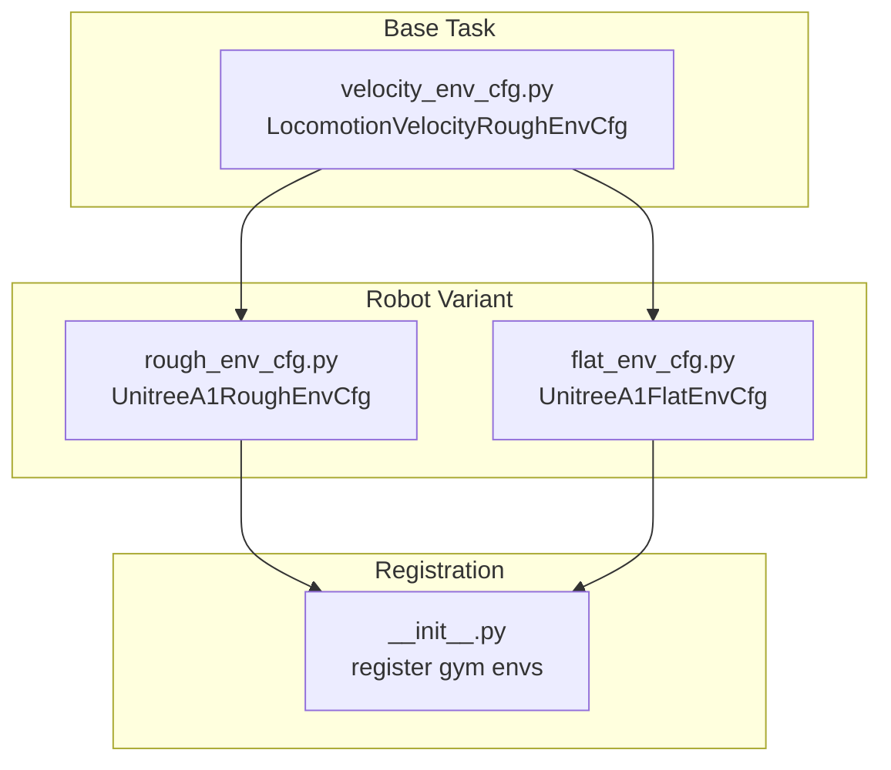
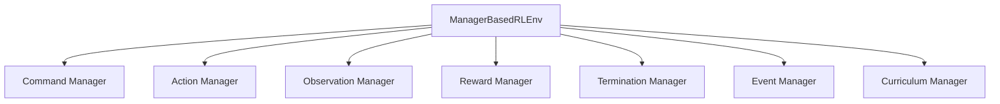
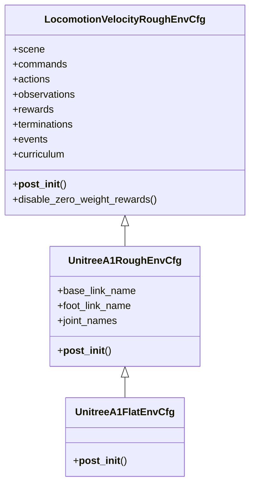
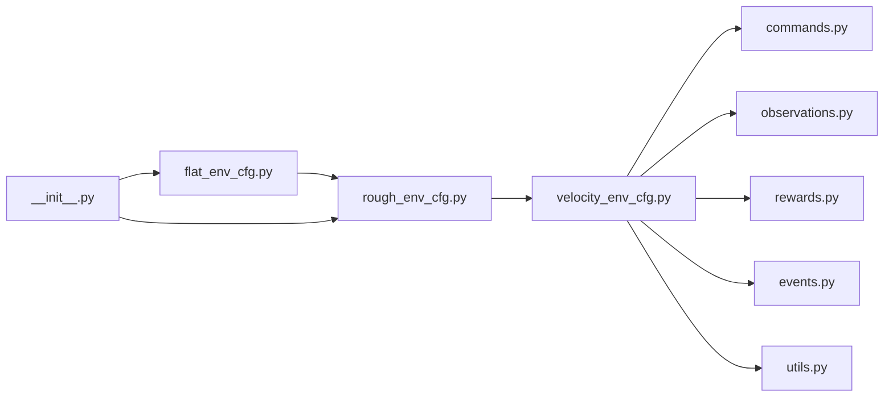

# Custom Task Development

<cite>
**Referenced Files in This Document**
- [README.md](file://README.md)
- [velocity_env_cfg.py](file://source/robot_lab/robot_lab/tasks/manager_based/locomotion/velocity/velocity_env_cfg.py)
- [flat_env_cfg.py](file://source/robot_lab/robot_lab/tasks/manager_based/locomotion/velocity/config/quadruped/unitree_a1/flat_env_cfg.py)
- [rough_env_cfg.py](file://source/robot_lab/robot_lab/tasks/manager_based/locomotion/velocity/config/quadruped/unitree_a1/rough_env_cfg.py)
- [__init__.py](file://source/robot_lab/robot_lab/tasks/manager_based/locomotion/velocity/config/quadruped/unitree_a1/__init__.py)
- [commands.py](file://source/robot_lab/robot_lab/tasks/manager_based/locomotion/velocity/mdp/commands.py)
- [events.py](file://source/robot_lab/robot_lab/tasks/manager_based/locomotion/velocity/mdp/events.py)
- [observations.py](file://source/robot_lab/robot_lab/tasks/manager_based/locomotion/velocity/mdp/observations.py)
- [rewards.py](file://source/robot_lab/robot_lab/tasks/manager_based/locomotion/velocity/mdp/rewards.py)
- [utils.py](file://source/robot_lab/robot_lab/tasks/manager_based/locomotion/velocity/mdp/utils.py)
</cite>

## Table of Contents
1. [Introduction](#introduction)
2. [Project Structure](#project-structure)
3. [Core Components](#core-components)
4. [Architecture Overview](#architecture-overview)
5. [Detailed Component Analysis](#detailed-component-analysis)
6. [Dependency Analysis](#dependency-analysis)
7. [Performance Considerations](#performance-considerations)
8. [Troubleshooting Guide](#troubleshooting-guide)
9. [Conclusion](#conclusion)
10. [Appendices](#appendices)

## Introduction
This document explains how to develop custom tasks within the ManagerBasedRLEnv framework. It focuses on the task configuration hierarchy, MDP component customization (observation groups, reward terms, termination conditions, commands, actions, and events), and integration of new robot types and locomotion modes. It also provides best practices for parameterization, hyperparameter tuning, performance optimization, debugging, visualization, and validation.

## Project Structure
The ManagerBasedRLEnv framework organizes tasks around a base environment configuration and per-robot/per-mode overrides. The locomotion velocity-tracking task demonstrates:
- A base environment configuration that defines scenes, MDP components, and defaults.
- Per-environment variants (flat vs. rough) that inherit from the base and override specific components.
- Registration entries that bind environment configurations to Gym-compatible names.

**Diagram sources**
- [velocity_env_cfg.py](file://source/robot_lab/robot_lab/tasks/manager_based/locomotion/velocity/velocity_env_cfg.py#L696-L744)
- [rough_env_cfg.py](file://source/robot_lab/robot_lab/tasks/manager_based/locomotion/velocity/config/quadruped/unitree_a1/rough_env_cfg.py#L18-L162)
- [flat_env_cfg.py](file://source/robot_lab/robot_lab/tasks/manager_based/locomotion/velocity/config/quadruped/unitree_a1/flat_env_cfg.py#L9-L30)
- [__init__.py](file://source/robot_lab/robot_lab/tasks/manager_based/locomotion/velocity/config/quadruped/unitree_a1/__init__.py#L12-L32)

**Section sources**
- [README.md](file://README.md#L349-L426)
- [velocity_env_cfg.py](file://source/robot_lab/robot_lab/tasks/manager_based/locomotion/velocity/velocity_env_cfg.py#L696-L744)
- [rough_env_cfg.py](file://source/robot_lab/robot_lab/tasks/manager_based/locomotion/velocity/config/quadruped/unitree_a1/rough_env_cfg.py#L18-L162)
- [flat_env_cfg.py](file://source/robot_lab/robot_lab/tasks/manager_based/locomotion/velocity/config/quadruped/unitree_a1/flat_env_cfg.py#L9-L30)
- [__init__.py](file://source/robot_lab/robot_lab/tasks/manager_based/locomotion/velocity/config/quadruped/unitree_a1/__init__.py#L12-L32)

## Core Components
The ManagerBasedRLEnv task is composed of:
- Scene: terrain, robot asset, sensors, lighting.
- Commands: velocity/command generators.
- Actions: action specification and scaling.
- Observations: policy and critic groups with configurable terms.
- Rewards: shaped terms for stability, tracking, contact, and locomotion gaits.
- Terminations: episode-ending conditions.
- Events: initialization/reset/interval randomizations and perturbations.
- Curriculum: adaptive difficulty for commands and terrain.

Key implementation references:
- Base environment configuration and MDP components: [velocity_env_cfg.py](file://source/robot_lab/robot_lab/tasks/manager_based/locomotion/velocity/velocity_env_cfg.py#L42-L744)
- Flat/rough overrides for a specific robot: [flat_env_cfg.py](file://source/robot_lab/robot_lab/tasks/manager_based/locomotion/velocity/config/quadruped/unitree_a1/flat_env_cfg.py#L9-L30), [rough_env_cfg.py](file://source/robot_lab/robot_lab/tasks/manager_based/locomotion/velocity/config/quadruped/unitree_a1/rough_env_cfg.py#L18-L162)
- Gym registration: [__init__.py](file://source/robot_lab/robot_lab/tasks/manager_based/locomotion/velocity/config/quadruped/unitree_a1/__init__.py#L12-L32)

**Section sources**
- [velocity_env_cfg.py](file://source/robot_lab/robot_lab/tasks/manager_based/locomotion/velocity/velocity_env_cfg.py#L42-L744)
- [flat_env_cfg.py](file://source/robot_lab/robot_lab/tasks/manager_based/locomotion/velocity/config/quadruped/unitree_a1/flat_env_cfg.py#L9-L30)
- [rough_env_cfg.py](file://source/robot_lab/robot_lab/tasks/manager_based/locomotion/velocity/config/quadruped/unitree_a1/rough_env_cfg.py#L18-L162)
- [__init__.py](file://source/robot_lab/robot_lab/tasks/manager_based/locomotion/velocity/config/quadruped/unitree_a1/__init__.py#L12-L32)

## Architecture Overview
The ManagerBasedRLEnv orchestrates:
- Environment lifecycle: initialization, reset, step, termination.
- MDP managers: command, action, observation, reward, termination, event, curriculum.
- Asset and sensor access via scene entities.

[No sources needed since this diagram shows conceptual workflow, not actual code structure]

## Detailed Component Analysis

### Task Configuration Hierarchy and Inheritance
- Base configuration defines:
  - Scene with terrain, robot asset, sensors, and lighting.
  - Commands, Actions, Observations, Rewards, Terminations, Events, and Curriculum.
  - Simulation parameters and sensor update periods.
- Robot-specific configuration inherits from the base and overrides:
  - Robot asset and sensor prim paths.
  - Observation scales and term selections.
  - Action scaling and clipping.
  - Reward weights and sensor/body filters.
  - Termination and curriculum settings.
- Environment variants (flat/rough) inherit from the robot configuration and further specialize:
  - Terrain type and height scanner presence.
  - Reward weights and curriculum terms.
  - Observation terms removal.

**Diagram sources**
- [velocity_env_cfg.py](file://source/robot_lab/robot_lab/tasks/manager_based/locomotion/velocity/velocity_env_cfg.py#L696-L744)
- [rough_env_cfg.py](file://source/robot_lab/robot_lab/tasks/manager_based/locomotion/velocity/config/quadruped/unitree_a1/rough_env_cfg.py#L18-L162)
- [flat_env_cfg.py](file://source/robot_lab/robot_lab/tasks/manager_based/locomotion/velocity/config/quadruped/unitree_a1/flat_env_cfg.py#L9-L30)

**Section sources**
- [velocity_env_cfg.py](file://source/robot_lab/robot_lab/tasks/manager_based/locomotion/velocity/velocity_env_cfg.py#L696-L744)
- [rough_env_cfg.py](file://source/robot_lab/robot_lab/tasks/manager_based/locomotion/velocity/config/quadruped/unitree_a1/rough_env_cfg.py#L18-L162)
- [flat_env_cfg.py](file://source/robot_lab/robot_lab/tasks/manager_based/locomotion/velocity/config/quadruped/unitree_a1/flat_env_cfg.py#L9-L30)

### Creating New Observation Groups
- Define a new observation group class inheriting from the policy/critic base configuration.
- Add observation terms with desired noise, clipping, and scaling.
- Enable concatenation and corruption as needed.
- Reference base policy/critic groups for structure: [velocity_env_cfg.py](file://source/robot_lab/robot_lab/tasks/manager_based/locomotion/velocity/velocity_env_cfg.py#L133-L254)

Best practices:
- Keep scales consistent across related terms.
- Use noise judiciously to improve robustness.
- Disable zero-weight terms to reduce computation.

**Section sources**
- [velocity_env_cfg.py](file://source/robot_lab/robot_lab/tasks/manager_based/locomotion/velocity/velocity_env_cfg.py#L133-L254)

### Defining Custom Reward Terms
- Implement a reward function that accepts the environment and parameters, returning a per-environment reward tensor.
- Use scene assets and sensors via the environment’s scene accessor.
- Apply command-dependent gating and normalization where appropriate.
- Reference existing reward implementations for patterns: [rewards.py](file://source/robot_lab/robot_lab/tasks/manager_based/locomotion/velocity/mdp/rewards.py#L22-L681)

Examples of reward categories:
- Tracking rewards: exponential kernels for velocity tracking.
- Penalizing deviations: joint torques, velocities, accelerations, power.
- Contact-based rewards/penalties: air time, contact counts, sliding, stumbling.
- Gait enforcement: synchronization and anti-synchronization of foot contacts.

Integration:
- Add the reward term to the rewards configuration with a weight.
- Optionally create helper methods to instantiate terms with specific parameters.

**Section sources**
- [rewards.py](file://source/robot_lab/robot_lab/tasks/manager_based/locomotion/velocity/mdp/rewards.py#L22-L681)
- [velocity_env_cfg.py](file://source/robot_lab/robot_lab/tasks/manager_based/locomotion/velocity/velocity_env_cfg.py#L375-L646)

### Adding Termination Conditions
- Implement a termination function that returns a boolean per environment.
- Use scene assets and sensors to detect invalid states (e.g., out-of-bounds, illegal contacts).
- Reference existing termination implementations: [rewards.py](file://source/robot_lab/robot_lab/tasks/manager_based/locomotion/velocity/mdp/rewards.py#L658-L668)

Integration:
- Add the termination term to the terminations configuration.
- Consider time-based timeouts and environment-specific bounds.

**Section sources**
- [rewards.py](file://source/robot_lab/robot_lab/tasks/manager_based/locomotion/velocity/mdp/rewards.py#L658-L668)
- [velocity_env_cfg.py](file://source/robot_lab/robot_lab/tasks/manager_based/locomotion/velocity/velocity_env_cfg.py#L648-L665)

### Defining Custom Commands, Actions, and Events
- Commands: define a command generator class and configuration; update logic can adapt to terrain or other runtime conditions. Reference: [commands.py](file://source/robot_lab/robot_lab/tasks/manager_based/locomotion/velocity/mdp/commands.py#L21-L85)
- Actions: configure action specifications (e.g., joint position targets) with scaling and clipping; reference: [velocity_env_cfg.py](file://source/robot_lab/robot_lab/tasks/manager_based/locomotion/velocity/velocity_env_cfg.py#L121-L127)
- Events: implement event functions for initialization, reset, and periodic intervals; reference: [events.py](file://source/robot_lab/robot_lab/tasks/manager_based/locomotion/velocity/mdp/events.py#L19-L270)

Integration:
- Bind command/action/event definitions to the environment configuration.
- Use environment-specific overrides to tailor behavior per robot or mode.

**Section sources**
- [commands.py](file://source/robot_lab/robot_lab/tasks/manager_based/locomotion/velocity/mdp/commands.py#L21-L85)
- [velocity_env_cfg.py](file://source/robot_lab/robot_lab/tasks/manager_based/locomotion/velocity/velocity_env_cfg.py#L102-L127)
- [events.py](file://source/robot_lab/robot_lab/tasks/manager_based/locomotion/velocity/mdp/events.py#L19-L270)

### Integrating New Robot Types and Locomotion Modes
- Add a new robot configuration that inherits from the base environment configuration.
- Override robot asset, joint names, and sensor prim paths.
- Tune observation scales, action parameters, reward weights, and curriculum.
- Reference the Unitree A1 example: [rough_env_cfg.py](file://source/robot_lab/robot_lab/tasks/manager_based/locomotion/velocity/config/quadruped/unitree_a1/rough_env_cfg.py#L18-L162)
- Register the environment with Gym: [__init__.py](file://source/robot_lab/robot_lab/tasks/manager_based/locomotion/velocity/config/quadruped/unitree_a1/__init__.py#L12-L32)

For locomotion modes (e.g., wheeled, humanoid), create separate directories under the velocity task and mirror the base/variant pattern.

**Section sources**
- [rough_env_cfg.py](file://source/robot_lab/robot_lab/tasks/manager_based/locomotion/velocity/config/quadruped/unitree_a1/rough_env_cfg.py#L18-L162)
- [__init__.py](file://source/robot_lab/robot_lab/tasks/manager_based/locomotion/velocity/config/quadruped/unitree_a1/__init__.py#L12-L32)

### MDP Component Customization
- State representation: define observation groups and terms; concatenate and corrupt as needed; reference: [velocity_env_cfg.py](file://source/robot_lab/robot_lab/tasks/manager_based/locomotion/velocity/velocity_env_cfg.py#L133-L254)
- Action spaces: configure joint actions with scaling/clipping; reference: [velocity_env_cfg.py](file://source/robot_lab/robot_lab/tasks/manager_based/locomotion/velocity/velocity_env_cfg.py#L121-L127)
- Reward shaping: balance tracking, regularization, contact, and gait terms; reference: [velocity_env_cfg.py](file://source/robot_lab/robot_lab/tasks/manager_based/locomotion/velocity/velocity_env_cfg.py#L375-L646)

Validation:
- Use zero-agent and random-agent runners to sanity-check environment setup: [README.md](file://README.md#L228-L235)

**Section sources**
- [velocity_env_cfg.py](file://source/robot_lab/robot_lab/tasks/manager_based/locomotion/velocity/velocity_env_cfg.py#L121-L127)
- [velocity_env_cfg.py](file://source/robot_lab/robot_lab/tasks/manager_based/locomotion/velocity/velocity_env_cfg.py#L133-L254)
- [velocity_env_cfg.py](file://source/robot_lab/robot_lab/tasks/manager_based/locomotion/velocity/velocity_env_cfg.py#L375-L646)
- [README.md](file://README.md#L228-L235)

## Dependency Analysis
The ManagerBasedRLEnv task depends on:
- Environment configuration classes for scene, commands, actions, observations, rewards, terminations, events, and curriculum.
- MDP modules for commands, observations, rewards, events, and utilities.
- Robot asset definitions and Gym registration.

**Diagram sources**
- [velocity_env_cfg.py](file://source/robot_lab/robot_lab/tasks/manager_based/locomotion/velocity/velocity_env_cfg.py#L12-L28)
- [commands.py](file://source/robot_lab/robot_lab/tasks/manager_based/locomotion/velocity/mdp/commands.py#L12-L15)
- [observations.py](file://source/robot_lab/robot_lab/tasks/manager_based/locomotion/velocity/mdp/observations.py#L9-L13)
- [rewards.py](file://source/robot_lab/robot_lab/tasks/manager_based/locomotion/velocity/mdp/rewards.py#L9-L16)
- [events.py](file://source/robot_lab/robot_lab/tasks/manager_based/locomotion/velocity/mdp/events.py#L9-L13)
- [utils.py](file://source/robot_lab/robot_lab/tasks/manager_based/locomotion/velocity/mdp/utils.py#L8-L12)
- [rough_env_cfg.py](file://source/robot_lab/robot_lab/tasks/manager_based/locomotion/velocity/config/quadruped/unitree_a1/rough_env_cfg.py#L4-L14)
- [flat_env_cfg.py](file://source/robot_lab/robot_lab/tasks/manager_based/locomotion/velocity/config/quadruped/unitree_a1/flat_env_cfg.py#L4-L6)
- [__init__.py](file://source/robot_lab/robot_lab/tasks/manager_based/locomotion/velocity/config/quadruped/unitree_a1/__init__.py#L4-L6)

**Section sources**
- [velocity_env_cfg.py](file://source/robot_lab/robot_lab/tasks/manager_based/locomotion/velocity/velocity_env_cfg.py#L12-L28)
- [commands.py](file://source/robot_lab/robot_lab/tasks/manager_based/locomotion/velocity/mdp/commands.py#L12-L15)
- [observations.py](file://source/robot_lab/robot_lab/tasks/manager_based/locomotion/velocity/mdp/observations.py#L9-L13)
- [rewards.py](file://source/robot_lab/robot_lab/tasks/manager_based/locomotion/velocity/mdp/rewards.py#L9-L16)
- [events.py](file://source/robot_lab/robot_lab/tasks/manager_based/locomotion/velocity/mdp/events.py#L9-L13)
- [utils.py](file://source/robot_lab/robot_lab/tasks/manager_based/locomotion/velocity/mdp/utils.py#L8-L12)
- [rough_env_cfg.py](file://source/robot_lab/robot_lab/tasks/manager_based/locomotion/velocity/config/quadruped/unitree_a1/rough_env_cfg.py#L4-L14)
- [flat_env_cfg.py](file://source/robot_lab/robot_lab/tasks/manager_based/locomotion/velocity/config/quadruped/unitree_a1/flat_env_cfg.py#L4-L6)
- [__init__.py](file://source/robot_lab/robot_lab/tasks/manager_based/locomotion/velocity/config/quadruped/unitree_a1/__init__.py#L4-L6)

## Performance Considerations
- Disable zero-weight rewards to prune inactive computations: [velocity_env_cfg.py](file://source/robot_lab/robot_lab/tasks/manager_based/locomotion/velocity/velocity_env_cfg.py#L737-L744)
- Tune decimation and simulation dt for stability and throughput: [velocity_env_cfg.py](file://source/robot_lab/robot_lab/tasks/manager_based/locomotion/velocity/velocity_env_cfg.py#L714-L718)
- Reduce sensor update frequency where feasible: [velocity_env_cfg.py](file://source/robot_lab/robot_lab/tasks/manager_based/locomotion/velocity/velocity_env_cfg.py#L722-L726)
- Use curriculum to progressively increase difficulty and stabilize training: [velocity_env_cfg.py](file://source/robot_lab/robot_lab/tasks/manager_based/locomotion/velocity/velocity_env_cfg.py#L668-L687)

[No sources needed since this section provides general guidance]

## Troubleshooting Guide
- Use zero-agent and random-agent runners to validate environment setup: [README.md](file://README.md#L228-L235)
- Inspect environment registration and entry points: [__init__.py](file://source/robot_lab/robot_lab/tasks/manager_based/locomotion/velocity/config/quadruped/unitree_a1/__init__.py#L12-L32)
- Verify sensor updates and physics material settings: [velocity_env_cfg.py](file://source/robot_lab/robot_lab/tasks/manager_based/locomotion/velocity/velocity_env_cfg.py#L716-L726)
- Debug terrain-aware logic using utility helpers: [utils.py](file://source/robot_lab/robot_lab/tasks/manager_based/locomotion/velocity/mdp/utils.py#L42-L127)

**Section sources**
- [README.md](file://README.md#L228-L235)
- [__init__.py](file://source/robot_lab/robot_lab/tasks/manager_based/locomotion/velocity/config/quadruped/unitree_a1/__init__.py#L12-L32)
- [velocity_env_cfg.py](file://source/robot_lab/robot_lab/tasks/manager_based/locomotion/velocity/velocity_env_cfg.py#L716-L726)
- [utils.py](file://source/robot_lab/robot_lab/tasks/manager_based/locomotion/velocity/mdp/utils.py#L42-L127)

## Conclusion
By leveraging the ManagerBasedRLEnv configuration hierarchy and MDP modules, developers can rapidly prototype and iterate on custom tasks. Start from the base configuration, specialize per robot and mode, and incrementally tune rewards, commands, actions, and curriculum. Use the provided utilities and validation tools to ensure correctness and performance.

[No sources needed since this section summarizes without analyzing specific files]

## Appendices

### Best Practices for Task Parameterization and Hyperparameter Tuning
- Begin with flat terrain and gradually introduce roughness and curriculum.
- Start with moderate reward weights and increase gradually while monitoring stability.
- Use command thresholds to gate certain rewards during low-motion phases.
- Regularize actions and joint dynamics to prevent unrealistic behaviors.
- Monitor sensor-based penalties (contacts, air time) to ensure safe locomotion.

[No sources needed since this section provides general guidance]

### Validation Procedures for Custom Tasks
- Sanity-check with zero and random agents.
- Compare policy outputs across flat and rough variants.
- Inspect reward decomposition and ensure each term contributes meaningfully.
- Validate terrain-aware behaviors using utility functions.

[No sources needed since this section provides general guidance]

### Templates and Examples for Common Scenarios
- Navigation challenges: emphasize tracking rewards and terrain-aware commands; reference terrain utilities and command updates.
- Manipulation tasks: integrate contact sensors and add reward terms for grasp stability and object proximity.
- Specialized locomotion skills: customize action spaces, add gait enforcement, and adjust base height and orientation penalties.

[No sources needed since this section provides general guidance]