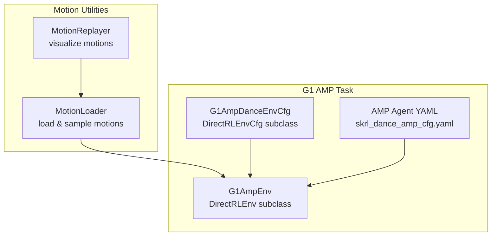
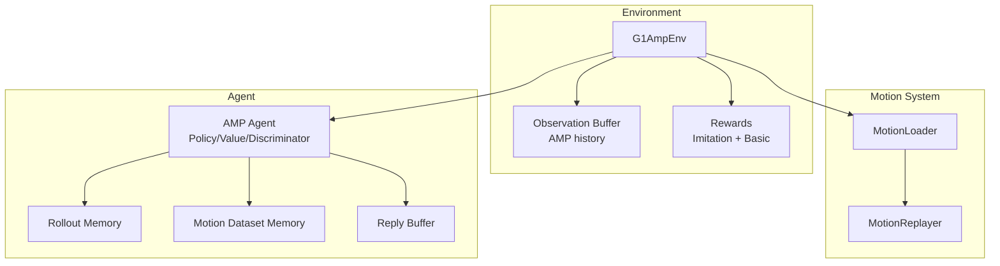
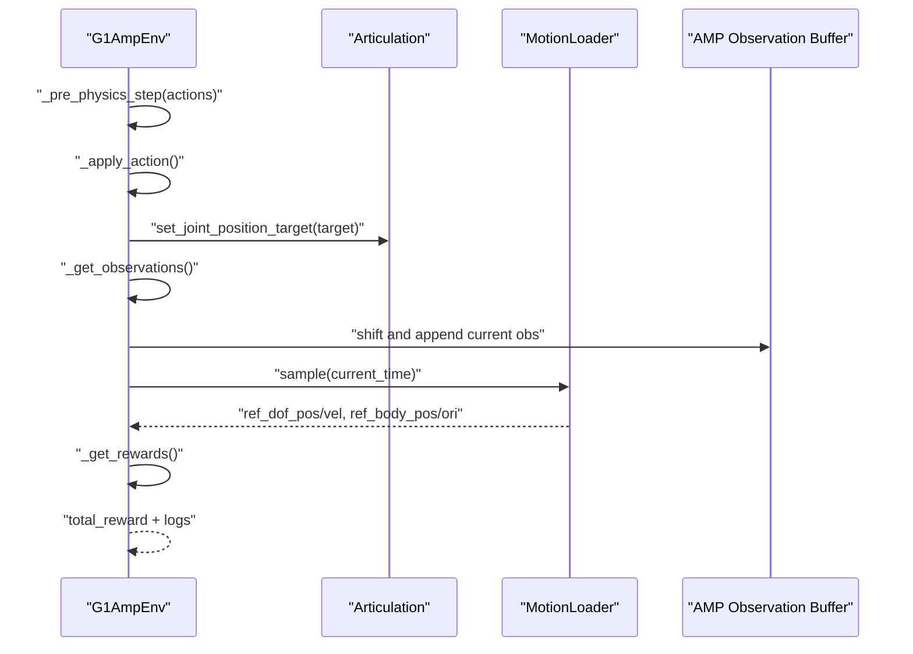
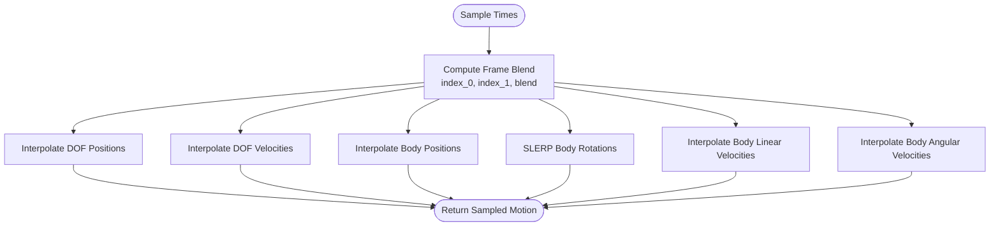
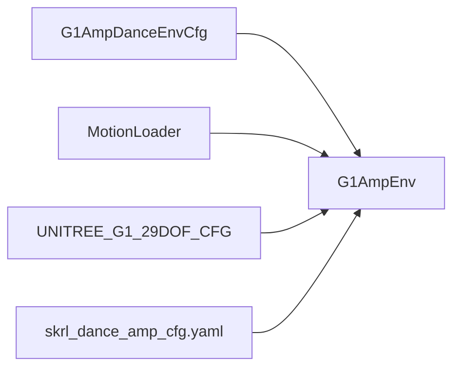

# Direct Control and AMP Tasks

<cite>
**Referenced Files in This Document**
- [README.md](file://README.md)
- [g1_amp_env.py](file://source/robot_lab/robot_lab/tasks/direct/g1_amp/g1_amp_env.py)
- [g1_amp_env_cfg.py](file://source/robot_lab/robot_lab/tasks/direct/g1_amp/g1_amp_env_cfg.py)
- [motion_loader.py](file://source/robot_lab/robot_lab/tasks/direct/g1_amp/motions/motion_loader.py)
- [motion_replayer.py](file://source/robot_lab/robot_lab/tasks/direct/g1_amp/motions/motion_replayer.py)
- [skrl_dance_amp_cfg.yaml](file://source/robot_lab/robot_lab/tasks/direct/g1_amp/agents/skrl_dance_amp_cfg.yaml)
</cite>

## Table of Contents
1. [Introduction](#introduction)
2. [Project Structure](#project-structure)
3. [Core Components](#core-components)
4. [Architecture Overview](#architecture-overview)
5. [Detailed Component Analysis](#detailed-component-analysis)
6. [Dependency Analysis](#dependency-analysis)
7. [Performance Considerations](#performance-considerations)
8. [Troubleshooting Guide](#troubleshooting-guide)
9. [Conclusion](#conclusion)
10. [Appendices](#appendices)

## Introduction
This document explains the Associative Memory Paradigm (AMP) task for direct control of the Unitree G1 humanoid. It focuses on how the AMP framework enables direct motor primitive control without traditional reward shaping, how the associative memory system supports skill acquisition and execution, and how the G1 AMP environment is configured. It also covers direct control action spaces, primitive skill definitions via motion datasets, memory-based decision-making, and the relationship between AMP and traditional reinforcement learning. Finally, it provides guidelines for extending AMP with new primitives and customizing memory architectures.

## Project Structure
The AMP implementation for the G1 humanoid is organized under the direct control tasks:
- Environment definition and configuration for G1 AMP
- Motion loader and replayer utilities
- Agent configuration for AMP training and evaluation

**Diagram sources**
- [g1_amp_env.py](file://source/robot_lab/robot_lab/tasks/direct/g1_amp/g1_amp_env.py#L28-L134)
- [g1_amp_env_cfg.py](file://source/robot_lab/robot_lab/tasks/direct/g1_amp/g1_amp_env_cfg.py#L27-L87)
- [motion_loader.py](file://source/robot_lab/robot_lab/tasks/direct/g1_amp/motions/motion_loader.py#L14-L323)
- [motion_replayer.py](file://source/robot_lab/robot_lab/tasks/direct/g1_amp/motions/motion_replayer.py#L1-L155)
- [skrl_dance_amp_cfg.yaml](file://source/robot_lab/robot_lab/tasks/direct/g1_amp/agents/skrl_dance_amp_cfg.yaml#L1-L118)

**Section sources**
- [README.md](file://README.md#L271-L279)
- [g1_amp_env.py](file://source/robot_lab/robot_lab/tasks/direct/g1_amp/g1_amp_env.py#L1-L134)
- [g1_amp_env_cfg.py](file://source/robot_lab/robot_lab/tasks/direct/g1_amp/g1_amp_env_cfg.py#L1-L87)
- [motion_loader.py](file://source/robot_lab/robot_lab/tasks/direct/g1_amp/motions/motion_loader.py#L1-L323)
- [motion_replayer.py](file://source/robot_lab/robot_lab/tasks/direct/g1_amp/motions/motion_replayer.py#L1-L155)
- [skrl_dance_amp_cfg.yaml](file://source/robot_lab/robot_lab/tasks/direct/g1_amp/agents/skrl_dance_amp_cfg.yaml#L1-L118)

## Core Components
- G1AmpEnv: Implements a DirectRLEnv-based environment that:
  - Uses direct joint position targets as actions
  - Builds observations from joint states, key body positions, root orientation, and progress
  - Maintains an AMP observation buffer for temporal context
  - Computes imitation rewards against reference motions and basic reward terms
  - Supports multiple reset strategies (default, random, random-start)
- G1AmpDanceEnvCfg: Defines environment configuration including:
  - Episode length, simulation timestep, and rendering decimation
  - Observation/action/state spaces and AMP-specific parameters
  - Motion file path, reference body, and reset strategy
  - Simulation and scene settings
- MotionLoader: Loads motion datasets (DOF positions/velocities, body positions/rotations, velocities) and provides:
  - Time sampling and interpolation (linear for positions/velocities, SLERP for rotations)
  - DOF/body index mapping aligned with the robot’s joint/body names
  - Optional resampling to match simulation timestep
- MotionReplayer: Utility to replay motion data in simulation for visualization and debugging
- AMP Agent YAML: SKRL configuration for AMP training, including:
  - Policy/value/discriminator networks
  - Rollout and AMP memories
  - AMP hyperparameters (batch sizes, reward weights, discriminator scales)

**Section sources**
- [g1_amp_env.py](file://source/robot_lab/robot_lab/tasks/direct/g1_amp/g1_amp_env.py#L28-L134)
- [g1_amp_env_cfg.py](file://source/robot_lab/robot_lab/tasks/direct/g1_amp/g1_amp_env_cfg.py#L27-L87)
- [motion_loader.py](file://source/robot_lab/robot_lab/tasks/direct/g1_amp/motions/motion_loader.py#L14-L323)
- [motion_replayer.py](file://source/robot_lab/robot_lab/tasks/direct/g1_amp/motions/motion_replayer.py#L1-L155)
- [skrl_dance_amp_cfg.yaml](file://source/robot_lab/robot_lab/tasks/direct/g1_amp/agents/skrl_dance_amp_cfg.yaml#L1-L118)

## Architecture Overview
The AMP system couples a direct control policy with an associative memory module that stores and retrieves reference motion contexts. The environment computes observations enriched with recent AMP history and provides rewards derived from imitation of reference motions.

**Diagram sources**
- [g1_amp_env.py](file://source/robot_lab/robot_lab/tasks/direct/g1_amp/g1_amp_env.py#L28-L134)
- [motion_loader.py](file://source/robot_lab/robot_lab/tasks/direct/g1_amp/motions/motion_loader.py#L14-L323)
- [motion_replayer.py](file://source/robot_lab/robot_lab/tasks/direct/g1_amp/motions/motion_replayer.py#L1-L155)
- [skrl_dance_amp_cfg.yaml](file://source/robot_lab/robot_lab/tasks/direct/g1_amp/agents/skrl_dance_amp_cfg.yaml#L1-L118)

## Detailed Component Analysis

### G1AmpEnv: Direct Control and AMP Observation Pipeline
- Direct control:
  - Actions are interpreted as joint position targets applied to the robot articulation.
  - Action scaling and offset are computed from joint limits to map normalized actions to physical joint limits.
- Observation construction:
  - Includes joint positions and velocities, root height, root orientation tangents/normals, relative key body positions, and progress.
  - Progress is episode time normalized by episode length.
  - The observation buffer maintains a sliding window of recent observations for AMP context.
- Reward computation:
  - Imitation reward combines joint position/velocity errors and root position/orientation alignment against reference motion samples at current time.
  - Basic reward terms penalize termination, actions, joint limits, accelerations, and velocities.
  - Rewards are logged and optionally tracked by the agent.
- Reset strategies:
  - Default: reset to asset default state.
  - Random: sample motion times uniformly and initialize from motion.
  - Random-start: initialize from motion at time zero.

**Diagram sources**
- [g1_amp_env.py](file://source/robot_lab/robot_lab/tasks/direct/g1_amp/g1_amp_env.py#L99-L134)
- [g1_amp_env.py](file://source/robot_lab/robot_lab/tasks/direct/g1_amp/g1_amp_env.py#L136-L239)
- [g1_amp_env.py](file://source/robot_lab/robot_lab/tasks/direct/g1_amp/g1_amp_env.py#L249-L308)
- [g1_amp_env.py](file://source/robot_lab/robot_lab/tasks/direct/g1_amp/g1_amp_env.py#L312-L344)

**Section sources**
- [g1_amp_env.py](file://source/robot_lab/robot_lab/tasks/direct/g1_amp/g1_amp_env.py#L28-L134)
- [g1_amp_env.py](file://source/robot_lab/robot_lab/tasks/direct/g1_amp/g1_amp_env.py#L136-L239)
- [g1_amp_env.py](file://source/robot_lab/robot_lab/tasks/direct/g1_amp/g1_amp_env.py#L249-L344)

### G1AmpDanceEnvCfg: Environment Configuration
Key configuration highlights:
- Episode length, simulation timestep, and rendering decimation
- Observation/action/state spaces and AMP parameters (number of AMP observations and observation dimension)
- Motion file path, reference body, and reset strategy
- Simulation and scene settings (physics and environment replication)
- Robot asset configuration for Unitree G1

**Section sources**
- [g1_amp_env_cfg.py](file://source/robot_lab/robot_lab/tasks/direct/g1_amp/g1_amp_env_cfg.py#L27-L87)

### MotionLoader: Skill Library and Reference Sampling
- Loads motion data from NPZ files containing DOF/body trajectories and timestamps
- Provides:
  - Time sampling (uniform within motion duration)
  - Interpolation for positions/velocities (linear)
  - SLERP interpolation for rotations
  - DOF/body index mapping aligned with the robot’s joint/body names
  - Optional resampling to match simulation timestep
- Used by the environment to sample reference states for reward computation and to populate AMP observation buffers

**Diagram sources**
- [motion_loader.py](file://source/robot_lab/robot_lab/tasks/direct/g1_amp/motions/motion_loader.py#L163-L229)

**Section sources**
- [motion_loader.py](file://source/robot_lab/robot_lab/tasks/direct/g1_amp/motions/motion_loader.py#L14-L323)

### MotionReplayer: Visualization and Debugging
- Loads a motion file and aligns joint/body indices to the robot
- Steps through frames, writing root pose/velocity and joint states to the simulation
- Useful for validating motion alignment and debugging AMP resets

**Section sources**
- [motion_replayer.py](file://source/robot_lab/robot_lab/tasks/direct/g1_amp/motions/motion_replayer.py#L1-L155)

### AMP Agent Configuration (SKRL YAML)
- Defines:
  - Policy/value/discriminator network architectures
  - Rollout memory and AMP memories (motion dataset and reply buffer)
  - AMP hyperparameters (batch sizes, reward weights, discriminator scales, schedulers)
- Integrates with the environment to train a policy that leverages AMP context and discriminator signals

**Section sources**
- [skrl_dance_amp_cfg.yaml](file://source/robot_lab/robot_lab/tasks/direct/g1_amp/agents/skrl_dance_amp_cfg.yaml#L1-L118)

## Dependency Analysis
The environment depends on:
- Configuration class for environment parameters
- MotionLoader for reference motion sampling
- Robot asset configuration for Unitree G1
- Agent configuration for AMP training

**Diagram sources**
- [g1_amp_env_cfg.py](file://source/robot_lab/robot_lab/tasks/direct/g1_amp/g1_amp_env_cfg.py#L27-L87)
- [g1_amp_env.py](file://source/robot_lab/robot_lab/tasks/direct/g1_amp/g1_amp_env.py#L28-L134)
- [skrl_dance_amp_cfg.yaml](file://source/robot_lab/robot_lab/tasks/direct/g1_amp/agents/skrl_dance_amp_cfg.yaml#L1-L118)

**Section sources**
- [g1_amp_env_cfg.py](file://source/robot_lab/robot_lab/tasks/direct/g1_amp/g1_amp_env_cfg.py#L27-L87)
- [g1_amp_env.py](file://source/robot_lab/robot_lab/tasks/direct/g1_amp/g1_amp_env.py#L28-L134)
- [skrl_dance_amp_cfg.yaml](file://source/robot_lab/robot_lab/tasks/direct/g1_amp/agents/skrl_dance_amp_cfg.yaml#L1-L118)

## Performance Considerations
- Observation buffer size and dimensionality impact memory usage and throughput; tune num_amp_observations and amp_observation_space to balance context and performance.
- MotionLoader interpolation cost scales with batch size; pre-resampling motions to simulation dt reduces runtime overhead.
- AMP memories (motion_dataset and reply_buffer) should be sized to maintain representative diversity without excessive memory pressure.
- Rendering decimation and environment replication settings influence simulation throughput.

[No sources needed since this section provides general guidance]

## Troubleshooting Guide
Common issues and resolutions:
- Motion file path invalid: Ensure the motion file path in the environment configuration points to a valid NPZ file.
- Joint/body name mismatch: Verify that motion DOF/body names align with the robot’s joint/body names; MotionLoader raises assertions if names are missing.
- Reset strategy anomalies: Confirm reset_strategy values and that random-start uses time zero consistently.
- AMP reward instability: Adjust imitation reward weights and sigma parameters to balance imitation and basic rewards.

**Section sources**
- [g1_amp_env_cfg.py](file://source/robot_lab/robot_lab/tasks/direct/g1_amp/g1_amp_env_cfg.py#L62-L70)
- [motion_loader.py](file://source/robot_lab/robot_lab/tasks/direct/g1_amp/motions/motion_loader.py#L29-L30)
- [motion_loader.py](file://source/robot_lab/robot_lab/tasks/direct/g1_amp/motions/motion_loader.py#L244-L247)
- [g1_amp_env.py](file://source/robot_lab/robot_lab/tasks/direct/g1_amp/g1_amp_env.py#L249-L308)

## Conclusion
The G1 AMP task demonstrates direct control with associative memory, combining a simple action space (joint position targets) and a rich observation pipeline with AMP history. The environment integrates a motion-based reward system and supports flexible reset strategies. The AMP agent configuration provides a practical blueprint for training policies that leverage reference motion datasets and discriminator signals. This setup serves as a foundation for acquiring and executing complex humanoids skills, including dance-like primitives and humanoid-specific behaviors.

[No sources needed since this section summarizes without analyzing specific files]

## Appendices

### Relationship Between AMP and Traditional RL Approaches
- Traditional RL often relies on shaped rewards and policy gradients to learn control; AMP replaces explicit reward shaping with memory-based imitation and discriminator signals.
- AMP retains policy gradients but augments them with reference motion context, enabling direct control without extensive reward engineering.
- The environment’s reward composition blends imitation and basic terms, allowing the policy to learn stable primitives while maintaining safety and feasibility constraints.

**Section sources**
- [g1_amp_env.py](file://source/robot_lab/robot_lab/tasks/direct/g1_amp/g1_amp_env.py#L136-L239)
- [skrl_dance_amp_cfg.yaml](file://source/robot_lab/robot_lab/tasks/direct/g1_amp/agents/skrl_dance_amp_cfg.yaml#L66-L110)

### Guidelines for Extending AMP with New Primitives and Customizing Memory Architectures
- Extend skill library:
  - Prepare motion datasets in NPZ format with DOF/body trajectories and fps metadata.
  - Use MotionLoader to validate and resample motions to simulation dt.
  - Update the environment configuration to point to new motion files and adjust reference body and reset strategy.
- Customize memory architectures:
  - Adjust rollout and AMP memory sizes in the agent YAML to fit hardware constraints and desired diversity.
  - Modify AMP hyperparameters (batch sizes, reward weights, discriminator scales) to emphasize or de-emphasize style vs. task rewards.
- Implement complex skills:
  - Combine multiple motion clips with temporal blending and boundary conditions.
  - Introduce gating or switching mechanisms in the policy to select appropriate primitives based on context or learned triggers.

**Section sources**
- [motion_loader.py](file://source/robot_lab/robot_lab/tasks/direct/g1_amp/motions/motion_loader.py#L267-L308)
- [g1_amp_env_cfg.py](file://source/robot_lab/robot_lab/tasks/direct/g1_amp/g1_amp_env_cfg.py#L62-L70)
- [skrl_dance_amp_cfg.yaml](file://source/robot_lab/robot_lab/tasks/direct/g1_amp/agents/skrl_dance_amp_cfg.yaml#L51-L110)