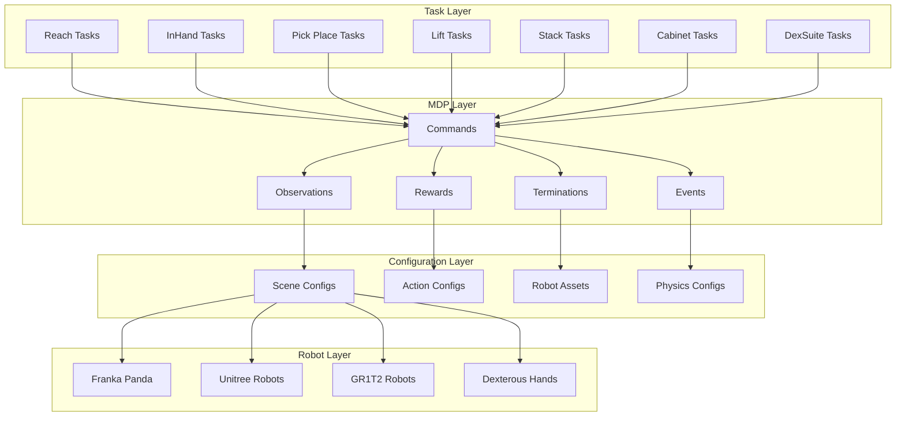
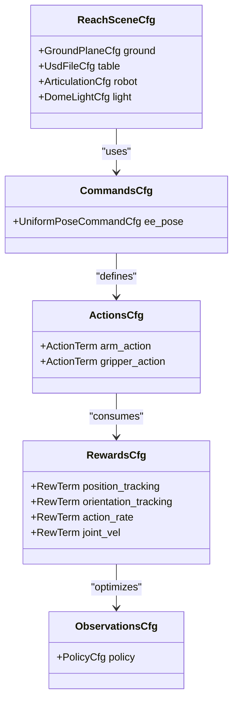
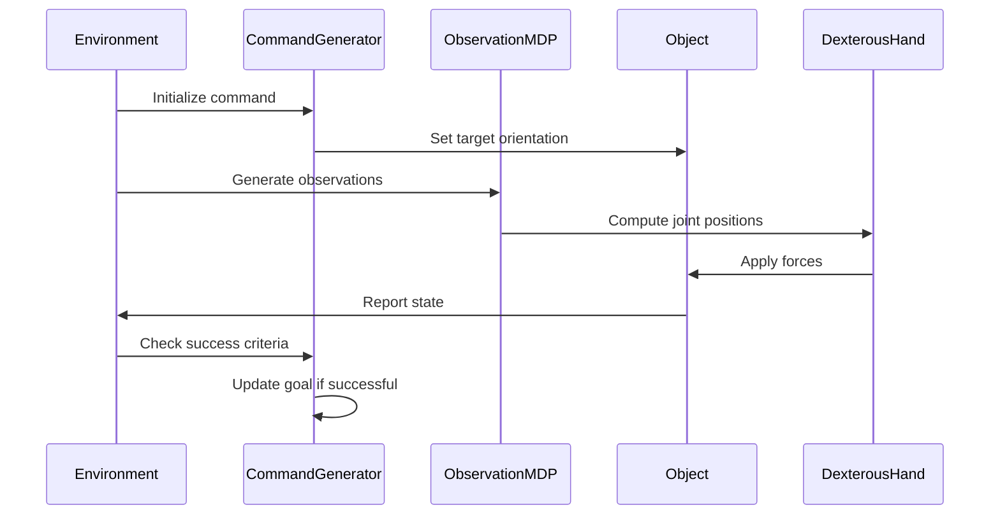
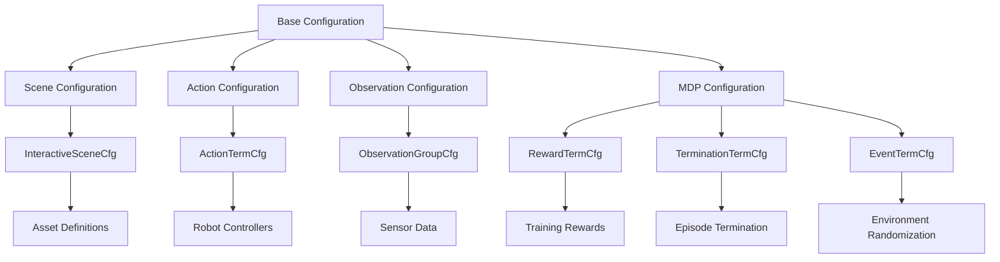
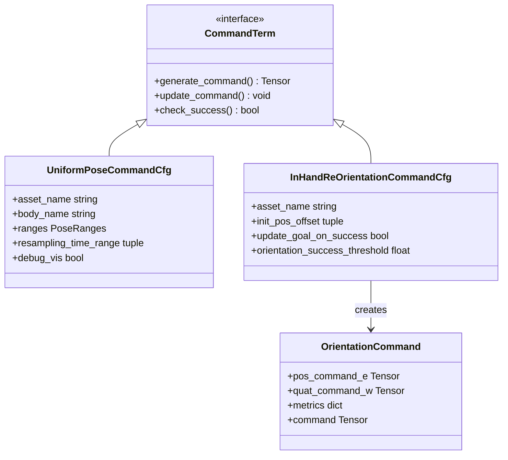
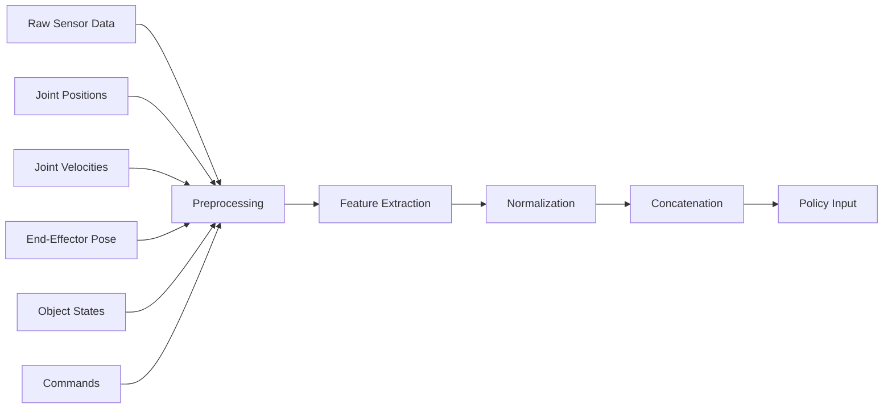
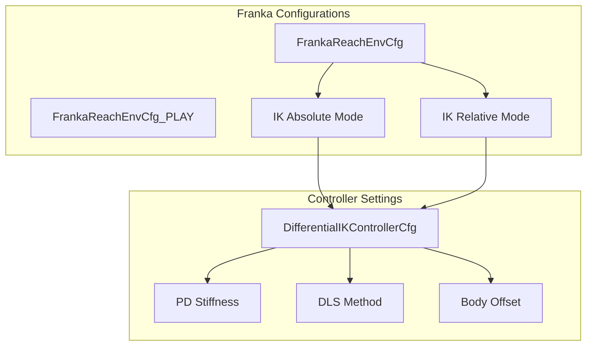
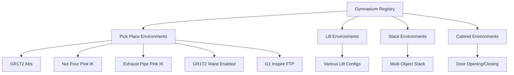
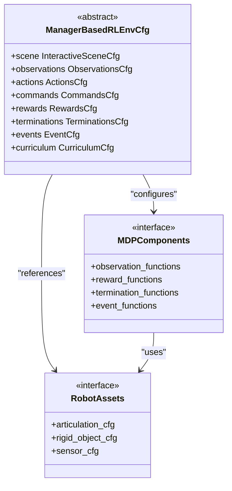

# Manipulation System Overview

<cite>
**Referenced Files in This Document**
- [manipulation/__init__.py](file://source/robot_lab/robot_lab/tasks/manager_based/manipulation/__init__.py)
- [reach_env_cfg.py](file://source/robot_lab/robot_lab/tasks/manager_based/manipulation/reach/reach_env_cfg.py)
- [inhand_env_cfg.py](file://source/robot_lab/robot_lab/tasks/manager_based/manipulation/inhand/inhand_env_cfg.py)
- [observations.py](file://source/robot_lab/robot_lab/tasks/manager_based/manipulation/inhand/mdp/observations.py)
- [orientation_command.py](file://source/robot_lab/robot_lab/tasks/manager_based/manipulation/inhand/mdp/commands/orientation_command.py)
- [__init__.py](file://source/robot_lab/robot_lab/tasks/manager_based/manipulation/reach/__init__.py)
- [__init__.py](file://source/robot_lab/robot_lab/tasks/manager_based/manipulation/pick_place/__init__.py)
- [ik_abs_env_cfg.py](file://source/robot_lab/robot_lab/tasks/manager_based/manipulation/reach/config/franka/ik_abs_env_cfg.py)
- [ik_rel_env_cfg.py](file://source/robot_lab/robot_lab/tasks/manager_based/manipulation/reach/config/franka/ik_rel_env_cfg.py)
</cite>

## Table of Contents
1. [Introduction](#introduction)
2. [System Architecture](#system-architecture)
3. [Core Manipulation Tasks](#core-manipulation-tasks)
4. [Configuration Management](#configuration-management)
5. [MDP Components](#mdp-components)
6. [Robot-Specific Configurations](#robot-specific-configurations)
7. [Environment Registration](#environment-registration)
8. [Implementation Patterns](#implementation-patterns)
9. [Performance Considerations](#performance-considerations)
10. [Troubleshooting Guide](#troubleshooting-guide)

## Introduction

The Manipulation System in this robotics framework provides a comprehensive suite of robotic manipulation tasks built on the Isaac Lab platform. The system focuses on end-effector pose tracking, in-hand object manipulation, pick-and-place operations, and various industrial manipulation scenarios. It leverages a modular architecture that separates concerns between environment configuration, MDP (Markov Decision Process) components, and robot-specific implementations.

The system supports multiple robotic platforms including Franka Panda, Unitree G1, GR1T2, and various dexterous hands, enabling research and development in advanced manipulation capabilities such as inverse kinematics tracking, object reorientation, and complex multi-object manipulation tasks.

## System Architecture

The manipulation system follows a hierarchical architecture pattern that separates concerns across different layers:

**Diagram sources**
- [manipulation/__init__.py:1-9](file://source/robot_lab/robot_lab/tasks/manager_based/manipulation/__init__.py#L1-L9)
- [reach_env_cfg.py:188-230](file://source/robot_lab/robot_lab/tasks/manager_based/manipulation/reach/reach_env_cfg.py#L188-L230)
- [inhand_env_cfg.py:310-347](file://source/robot_lab/robot_lab/tasks/manager_based/manipulation/inhand/inhand_env_cfg.py#L310-L347)

The architecture consists of four main layers:

1. **Task Layer**: Contains specific manipulation task implementations (reach, in-hand, pick-place, etc.)
2. **MDP Layer**: Provides reusable components for commands, observations, rewards, terminations, and events
3. **Configuration Layer**: Manages scene setups, action configurations, and robot asset definitions
4. **Robot Layer**: Handles robot-specific implementations and hardware integrations

**Section sources**
- [manipulation/__init__.py:6-9](file://source/robot_lab/robot_lab/tasks/manager_based/manipulation/__init__.py#L6-L9)

## Core Manipulation Tasks

### Reach Task System

The reach task system focuses on end-effector pose tracking with configurable command generation and reward mechanisms:

**Diagram sources**
- [reach_env_cfg.py:35-230](file://source/robot_lab/robot_lab/tasks/manager_based/manipulation/reach/reach_env_cfg.py#L35-L230)

The reach system implements several key features:
- **Command Generation**: Uniform pose command distribution with configurable ranges
- **Action Space**: Differential inverse kinematics with both absolute and relative modes
- **Observation Pipeline**: Joint positions, velocities, and command tracking
- **Reward Design**: Multi-term reward system balancing tracking accuracy and smoothness

### In-Hand Object Manipulation

The in-hand manipulation system provides advanced object reorientation capabilities:

**Diagram sources**
- [inhand_env_cfg.py:77-90](file://source/robot_lab/robot_lab/tasks/manager_based/manipulation/inhand/inhand_env_cfg.py#L77-L90)
- [orientation_command.py:66-92](file://source/robot_lab/robot_lab/tasks/manager_based/manipulation/inhand/mdp/commands/orientation_command.py#L66-L92)

Key characteristics include:
- **Object Tracking**: Real-time orientation tracking with quaternion-based error computation
- **Success Metrics**: Consecutive success counting and orientation error thresholds
- **Observation Types**: Full kinematic state with optional velocity filtering
- **Event Systems**: Comprehensive randomization and reset mechanisms

**Section sources**
- [reach_env_cfg.py:69-230](file://source/robot_lab/robot_lab/tasks/manager_based/manipulation/reach/reach_env_cfg.py#L69-L230)
- [inhand_env_cfg.py:33-347](file://source/robot_lab/robot_lab/tasks/manager_based/manipulation/inhand/inhand_env_cfg.py#L33-L347)

## Configuration Management

The system employs a sophisticated configuration management approach using dataclass-based configurations:

**Diagram sources**
- [reach_env_cfg.py:35-202](file://source/robot_lab/robot_lab/tasks/manager_based/manipulation/reach/reach_env_cfg.py#L35-L202)
- [inhand_env_cfg.py:33-335](file://source/robot_lab/robot_lab/tasks/manager_based/manipulation/inhand/inhand_env_cfg.py#L33-L335)

Configuration features include:
- **Modular Design**: Separate configurations for different aspects of the environment
- **Type Safety**: Strong typing with dataclass validation
- **Extensibility**: Easy addition of new configuration options
- **Robot Agnostic**: Base configurations work across different robot platforms

**Section sources**
- [reach_env_cfg.py:188-230](file://source/robot_lab/robot_lab/tasks/manager_based/manipulation/reach/reach_env_cfg.py#L188-L230)
- [inhand_env_cfg.py:310-347](file://source/robot_lab/robot_lab/tasks/manager_based/manipulation/inhand/inhand_env_cfg.py#L310-L347)

## MDP Components

### Command Generation System

The MDP system provides flexible command generation for different manipulation tasks:

**Diagram sources**
- [reach_env_cfg.py:69-86](file://source/robot_lab/robot_lab/tasks/manager_based/manipulation/reach/reach_env_cfg.py#L69-L86)
- [inhand_env_cfg.py:77-89](file://source/robot_lab/robot_lab/tasks/manager_based/manipulation/inhand/inhand_env_cfg.py#L77-L89)
- [orientation_command.py:85-92](file://source/robot_lab/robot_lab/tasks/manager_based/manipulation/inhand/mdp/commands/orientation_command.py#L85-L92)

### Observation Pipeline

The observation system provides structured sensor data for policy learning:

**Diagram sources**
- [inhand_env_cfg.py:105-170](file://source/robot_lab/robot_lab/tasks/manager_based/manipulation/inhand/inhand_env_cfg.py#L105-L170)
- [observations.py:20-39](file://source/robot_lab/robot_lab/tasks/manager_based/manipulation/inhand/mdp/observations.py#L20-L39)

**Section sources**
- [reach_env_cfg.py:98-181](file://source/robot_lab/robot_lab/tasks/manager_based/manipulation/reach/reach_env_cfg.py#L98-L181)
- [inhand_env_cfg.py:104-303](file://source/robot_lab/robot_lab/tasks/manager_based/manipulation/inhand/inhand_env_cfg.py#L104-L303)

## Robot-Specific Configurations

### Franka Panda Integration

The system provides specialized configurations for Franka Panda robots with differential inverse kinematics:

**Diagram sources**
- [ik_abs_env_cfg.py:18-36](file://source/robot_lab/robot_lab/tasks/manager_based/manipulation/reach/config/franka/ik_abs_env_cfg.py#L18-L36)
- [ik_rel_env_cfg.py:18-36](file://source/robot_lab/robot_lab/tasks/manager_based/manipulation/reach/config/franka/ik_rel_env_cfg.py#L18-L36)

Key features include:
- **High-Precision Control**: Stiffer PD controllers for improved tracking
- **Multiple Control Modes**: Absolute and relative inverse kinematics
- **Body Frame Offsets**: Compensation for tooling and sensor placement
- **Play Mode**: Simplified configurations for demonstration

**Section sources**
- [ik_abs_env_cfg.py:18-48](file://source/robot_lab/robot_lab/tasks/manager_based/manipulation/reach/config/franka/ik_abs_env_cfg.py#L18-L48)
- [ik_rel_env_cfg.py:18-49](file://source/robot_lab/robot_lab/tasks/manager_based/manipulation/reach/config/franka/ik_rel_env_cfg.py#L18-L49)

## Environment Registration

The system uses Gymnasium registration for environment discovery and management:

**Diagram sources**
- [__init__.py:10-59](file://source/robot_lab/robot_lab/tasks/manager_based/manipulation/pick_place/__init__.py#L10-L59)

Registration patterns include:
- **Standardized Naming**: Consistent naming conventions across environments
- **Agent Integration**: Built-in support for Robomimic behavioral cloning agents
- **Configuration Binding**: Direct association between environments and training configurations

**Section sources**
- [__init__.py:10-59](file://source/robot_lab/robot_lab/tasks/manager_based/manipulation/pick_place/__init__.py#L10-L59)

## Implementation Patterns

### Modular MDP Architecture

The system follows a modular MDP pattern that promotes code reuse and maintainability:

**Diagram sources**
- [reach_env_cfg.py:188-230](file://source/robot_lab/robot_lab/tasks/manager_based/manipulation/reach/reach_env_cfg.py#L188-L230)
- [inhand_env_cfg.py:310-347](file://source/robot_lab/robot_lab/tasks/manager_based/manipulation/inhand/inhand_env_cfg.py#L310-L347)

Key implementation patterns include:
- **Configuration-Driven Design**: All behavior controlled through configuration classes
- **Interface-Based Architecture**: Clear separation between different MDP components
- **Asset Management**: Centralized robot and object asset definitions
- **Event-Driven Updates**: Modular event system for environment modifications

**Section sources**
- [reach_env_cfg.py:35-202](file://source/robot_lab/robot_lab/tasks/manager_based/manipulation/reach/reach_env_cfg.py#L35-L202)
- [inhand_env_cfg.py:33-335](file://source/robot_lab/robot_lab/tasks/manager_based/manipulation/inhand/inhand_env_cfg.py#L33-L335)

## Performance Considerations

### Simulation Optimization

The system implements several performance optimization strategies:

- **Decimation Control**: Adjustable simulation stepping rates (2-4 for manipulation tasks)
- **Physics Configuration**: Optimized PhysX settings for rigid body dynamics
- **Memory Management**: Efficient tensor operations and GPU utilization
- **Rendering Optimization**: Configurable render intervals for training vs. evaluation

### Training Efficiency

Training efficiency is enhanced through:
- **Curriculum Learning**: Progressive difficulty adjustment
- **Randomization Strategies**: Systematic environment variation
- **Early Termination**: Efficient episode termination conditions
- **Observation Filtering**: Reduced-dimensional state representations

## Troubleshooting Guide

### Common Issues and Solutions

**Inverse Kinematics Failures**:
- Verify robot-specific IK configurations
- Check joint limits and physical constraints
- Adjust IK solver parameters and convergence thresholds

**Observation Mismatch**:
- Ensure observation dimensions match policy expectations
- Verify sensor data availability and timing
- Check coordinate frame transformations

**Training Instability**:
- Adjust reward scaling and normalization
- Modify action space bounds
- Implement proper curriculum progression

**Performance Bottlenecks**:
- Optimize environment decimation settings
- Reduce unnecessary visualization
- Monitor GPU memory usage

**Section sources**
- [reach_env_cfg.py:204-230](file://source/robot_lab/robot_lab/tasks/manager_based/manipulation/reach/reach_env_cfg.py#L204-L230)
- [inhand_env_cfg.py:337-347](file://source/robot_lab/robot_lab/tasks/manager_based/manipulation/inhand/inhand_env_cfg.py#L337-L347)