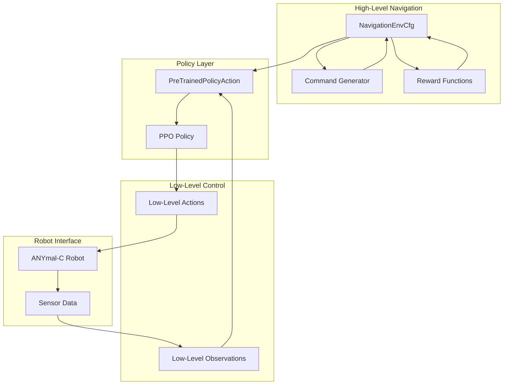
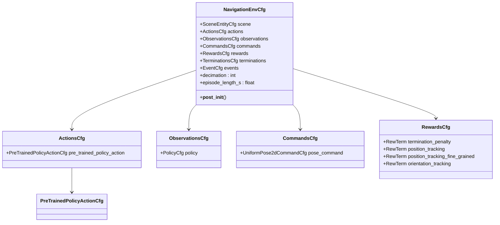
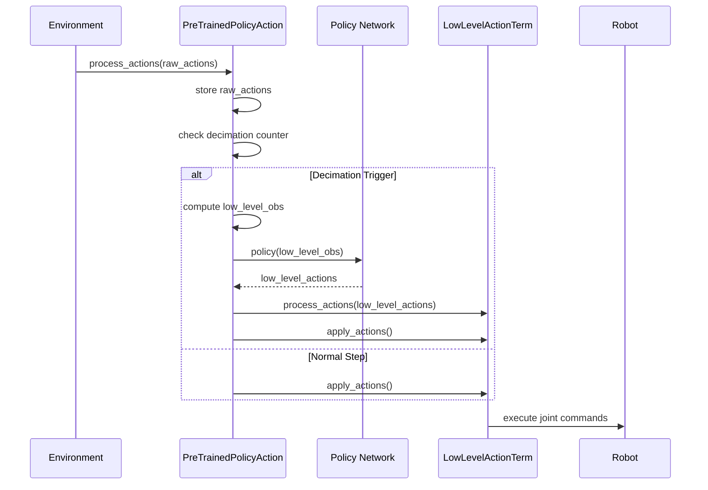
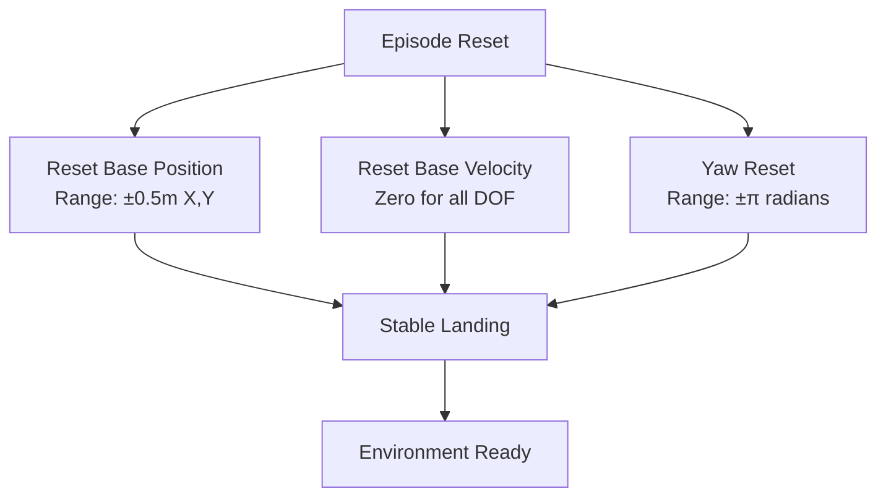
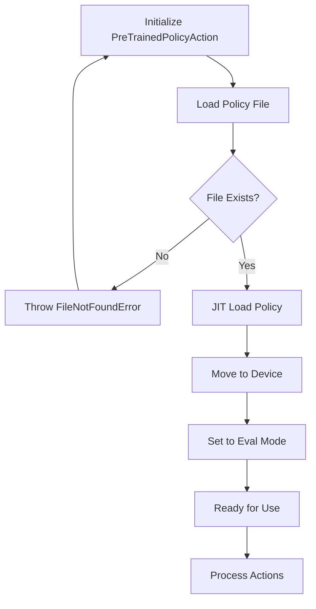
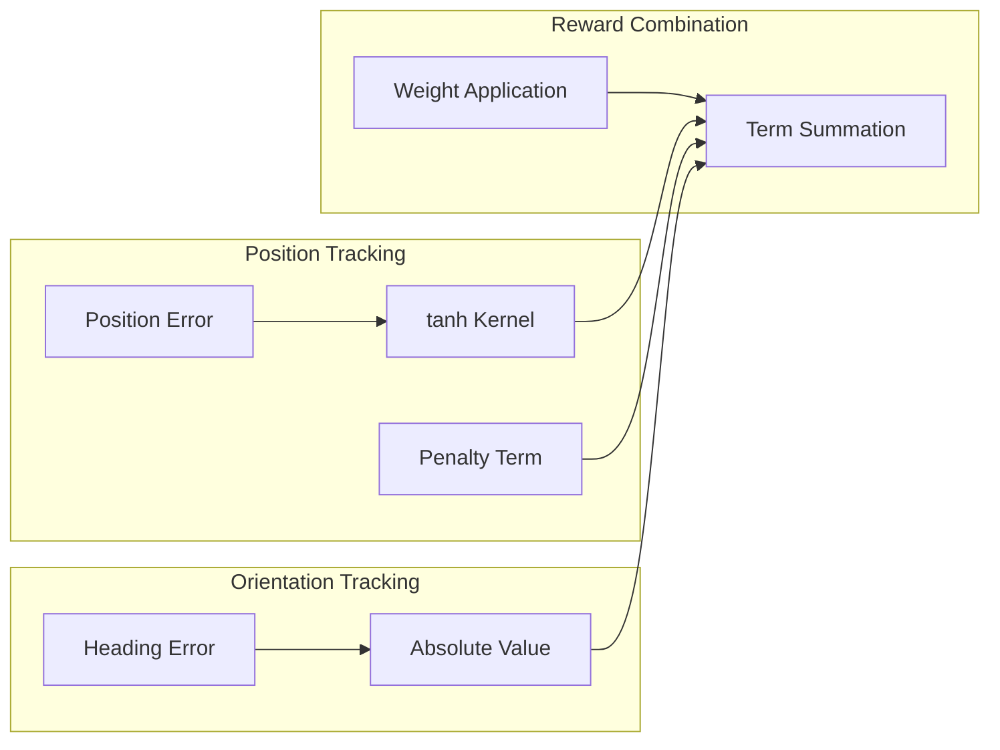
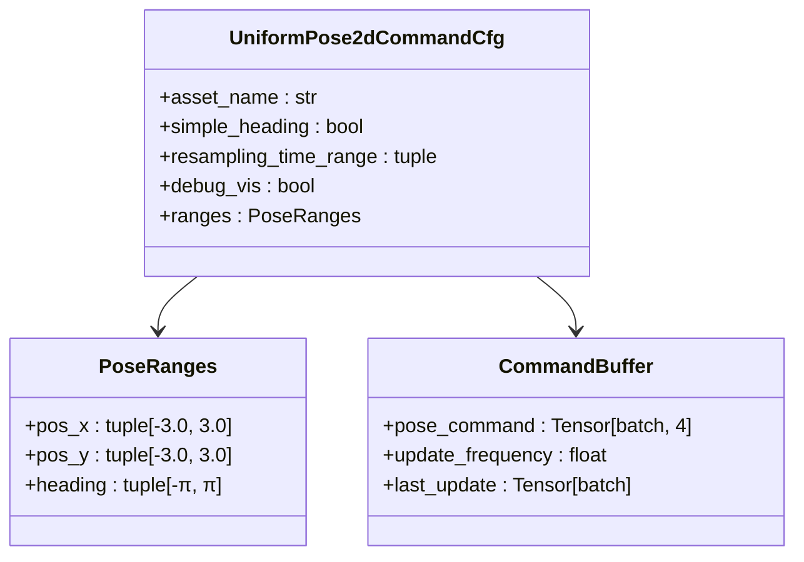
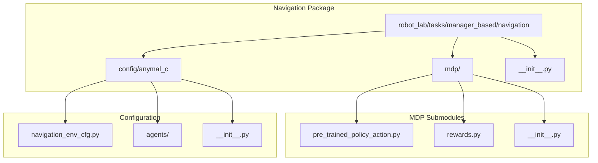

# Navigation System Overview

<cite>
**Referenced Files in This Document**
- [navigation_env_cfg.py](file://source/robot_lab/robot_lab/tasks/manager_based/navigation/config/anymal_c/navigation_env_cfg.py)
- [pre_trained_policy_action.py](file://source/robot_lab/robot_lab/tasks/manager_based/navigation/mdp/pre_trained_policy_action.py)
- [rewards.py](file://source/robot_lab/robot_lab/tasks/manager_based/navigation/mdp/rewards.py)
- [navigation_mdp_init.py](file://source/robot_lab/robot_lab/tasks/manager_based/navigation/mdp/__init__.py)
- [navigation_init.py](file://source/robot_lab/robot_lab/tasks/manager_based/navigation/__init__.py)
- [commands.py](file://source/robot_lab/robot_lab/tasks/manager_based/locomotion/velocity/mdp/commands.py)
</cite>

## Table of Contents
1. [Introduction](#introduction)
2. [System Architecture](#system-architecture)
3. [Core Components](#core-components)
4. [Environment Configuration](#environment-configuration)
5. [Pre-Trained Policy Action System](#pre-trained-policy-action-system)
6. [Reward Functions](#reward-functions)
7. [Command Generation](#command-generation)
8. [Integration Architecture](#integration-architecture)
9. [Performance Considerations](#performance-considerations)
10. [Troubleshooting Guide](#troubleshooting-guide)
11. [Conclusion](#conclusion)

## Introduction

The Navigation System in this robot lab repository provides a comprehensive framework for training and deploying navigation capabilities on quadruped robots, specifically designed for the ANYmal-C platform. This system leverages a hierarchical approach where high-level navigation commands are translated into low-level joint control through a pre-trained policy network, enabling efficient and robust navigation in complex environments.

The system is built upon the Isaac Lab framework and utilizes a manager-based reinforcement learning architecture that separates concerns between high-level navigation decisions and low-level motor control. This separation allows for modular development, easier debugging, and more maintainable code structure.

## System Architecture

The navigation system follows a layered architecture pattern that promotes separation of concerns and modularity:

**Diagram sources**
- [navigation_env_cfg.py:122-161](file://source/robot_lab/robot_lab/tasks/manager_based/navigation/config/anymal_c/navigation_env_cfg.py#L122-L161)
- [pre_trained_policy_action.py:24-101](file://source/robot_lab/robot_lab/tasks/manager_based/navigation/mdp/pre_trained_policy_action.py#L24-L101)

The architecture consists of four main layers:

1. **Environment Configuration Layer**: Defines the overall navigation environment setup
2. **Policy Translation Layer**: Bridges high-level commands to low-level actions
3. **Control Execution Layer**: Implements the actual robot control mechanisms
4. **Robot Interface Layer**: Handles physical robot interaction and sensor feedback

## Core Components

### Navigation Environment Configuration

The navigation environment is configured through a comprehensive configuration class that defines all aspects of the navigation task:

**Diagram sources**
- [navigation_env_cfg.py:122-133](file://source/robot_lab/robot_lab/tasks/manager_based/navigation/config/anymal_c/navigation_env_cfg.py#L122-L133)
- [navigation_env_cfg.py:46-56](file://source/robot_lab/robot_lab/tasks/manager_based/navigation/config/anymal_c/navigation_env_cfg.py#L46-L56)
- [navigation_env_cfg.py:76-95](file://source/robot_lab/robot_lab/tasks/manager_based/navigation/config/anymal_c/navigation_env_cfg.py#L76-L95)

**Section sources**
- [navigation_env_cfg.py:122-161](file://source/robot_lab/robot_lab/tasks/manager_based/navigation/config/anymal_c/navigation_env_cfg.py#L122-L161)

### Pre-Trained Policy Action System

The pre-trained policy action system serves as the core bridge between high-level navigation commands and low-level robot control:

**Diagram sources**
- [pre_trained_policy_action.py:90-101](file://source/robot_lab/robot_lab/tasks/manager_based/navigation/mdp/pre_trained_policy_action.py#L90-L101)

The system operates on a decimation-based schedule where high-level policy inference occurs less frequently than low-level action application, optimizing computational resources while maintaining responsive control.

**Section sources**
- [pre_trained_policy_action.py:24-189](file://source/robot_lab/robot_lab/tasks/manager_based/navigation/mdp/pre_trained_policy_action.py#L24-L189)

## Environment Configuration

The navigation environment configuration establishes the fundamental parameters and behaviors for the navigation task:

### Simulation Parameters

The environment configuration carefully balances simulation fidelity with computational efficiency:

| Parameter | Value | Description |
|-----------|--------|-------------|
| `sim.dt` | Inherits from low-level config | Physics simulation timestep |
| `render_interval` | Inherits from low-level config | Rendering frequency |
| `decimation` | Low-level decimation × 10 | Overall environment decimation |
| `episode_length_s` | Command resampling time | Episode duration in seconds |

### Reset Mechanisms

The system implements sophisticated reset mechanisms to ensure consistent training conditions:

**Diagram sources**
- [navigation_env_cfg.py:28-42](file://source/robot_lab/robot_lab/tasks/manager_based/navigation/config/anymal_c/navigation_env_cfg.py#L28-L42)

**Section sources**
- [navigation_env_cfg.py:135-148](file://source/robot_lab/robot_lab/tasks/manager_based/navigation/config/anymal_c/navigation_env_cfg.py#L135-L148)

## Pre-Trained Policy Action System

The pre-trained policy action system represents the most sophisticated component of the navigation architecture, implementing a hierarchical control approach:

### Policy Loading and Initialization

The system supports external policy loading with robust error handling:

**Diagram sources**
- [pre_trained_policy_action.py:42-46](file://source/robot_lab/robot_lab/tasks/manager_based/navigation/mdp/pre_trained_policy_action.py#L42-L46)

### Action Processing Pipeline

The action processing pipeline implements a sophisticated decimation mechanism:

| Phase | Frequency | Purpose |
|-------|-----------|---------|
| High-Level | 1/10th of base rate | Generate navigation commands |
| Policy Inference | 1/40th of base rate | Compute low-level actions |
| Low-Level Control | Base rate | Execute joint commands |

**Section sources**
- [pre_trained_policy_action.py:90-101](file://source/robot_lab/robot_lab/tasks/manager_based/navigation/mdp/pre_trained_policy_action.py#L90-L101)

## Reward Functions

The reward system employs a multi-faceted approach to guide navigation learning:

### Position Tracking Rewards

The system implements dual-position tracking mechanisms with different sensitivity levels:

**Diagram sources**
- [rewards.py:15-27](file://source/robot_lab/robot_lab/tasks/manager_based/navigation/mdp/rewards.py#L15-L27)

### Reward Configuration

| Reward Type | Weight | Function | Purpose |
|-------------|--------|----------|---------|
| `termination_penalty` | -400.0 | `is_terminated` | Episode termination penalty |
| `position_tracking` | 0.5 | `tanh(std=2.0)` | Coarse position tracking |
| `position_tracking_fine_grained` | 0.5 | `tanh(std=0.2)` | Fine-grained position tracking |
| `orientation_tracking` | -0.2 | `heading_error_abs` | Heading error penalty |

**Section sources**
- [navigation_env_cfg.py:79-94](file://source/robot_lab/robot_lab/tasks/manager_based/navigation/config/anymal_c/navigation_env_cfg.py#L79-L94)
- [rewards.py:15-27](file://source/robot_lab/robot_lab/tasks/manager_based/navigation/mdp/rewards.py#L15-L27)

## Command Generation

The navigation system employs sophisticated command generation tailored for 2D pose control:

### Pose Command Configuration

The command system generates 2D pose commands with comprehensive parameter control:

**Diagram sources**
- [navigation_env_cfg.py:101-107](file://source/robot_lab/robot_lab/tasks/manager_based/navigation/config/anymal_c/navigation_env_cfg.py#L101-L107)

### Command Generation Process

The command generation process ensures smooth and predictable navigation behavior:

1. **Resampling Interval**: Commands are resampled every 8 seconds for consistent exploration
2. **Pose Space**: 2D position (±3m range) plus heading (±π radians) control
3. **Simple Heading Mode**: Prevents complex heading calculations for stable navigation
4. **Debug Visualization**: Optional visual feedback for command targets

**Section sources**
- [navigation_env_cfg.py:98-107](file://source/robot_lab/robot_lab/tasks/manager_based/navigation/config/anymal_c/navigation_env_cfg.py#L98-L107)

## Integration Architecture

The navigation system integrates seamlessly with the broader robot lab ecosystem:

### Module Organization

**Diagram sources**
- [navigation_init.py:6-9](file://source/robot_lab/robot_lab/tasks/manager_based/navigation/__init__.py#L6-L9)
- [navigation_mdp_init.py:8-12](file://source/robot_lab/robot_lab/tasks/manager_based/navigation/mdp/__init__.py#L8-L12)

### Cross-Platform Compatibility

The system maintains compatibility with various robot platforms through standardized interfaces:

| Platform | Supported | Configuration Path |
|----------|-----------|-------------------|
| ANYmal-C | ✅ Primary | `anymal_c/navigation_env_cfg.py` |
| ANYmal-D | ❓ Future | Planned |
| Unitree Go1 | ❓ Future | Planned |
| Boston Dynamics Spot | ❓ Future | Planned |

**Section sources**
- [navigation_mdp_init.py:8-12](file://source/robot_lab/robot_lab/tasks/manager_based/navigation/mdp/__init__.py#L8-L12)

## Performance Considerations

The navigation system is optimized for efficient operation in both simulation and real-world scenarios:

### Computational Efficiency

| Component | Optimization Strategy | Performance Impact |
|-----------|----------------------|-------------------|
| Policy Decimation | 4-step cycle reduces inference frequency | ~75% reduction in policy computations |
| Batch Processing | Vectorized operations across all environments | Linear scaling with environment count |
| Memory Management | Efficient tensor reuse and minimal allocations | Reduced memory footprint |
| Device Utilization | GPU acceleration for policy inference | 10x+ speedup over CPU |

### Resource Management

The system implements several resource optimization strategies:

1. **Lazy Initialization**: Components are initialized only when needed
2. **Memory Pooling**: Reused tensors minimize allocation overhead
3. **Asynchronous Updates**: Non-blocking operations prevent simulation stalls
4. **Selective Visualization**: Debug markers disabled in production runs

## Troubleshooting Guide

Common issues and their solutions when working with the navigation system:

### Policy Loading Issues

**Problem**: Policy file not found or inaccessible
**Solution**: Verify `policy_path` exists and is readable
**Diagnostic**: Check file permissions and path correctness

**Problem**: Policy loading fails with JIT errors
**Solution**: Ensure policy matches expected input dimensions
**Diagnostic**: Compare observation space with policy training conditions

### Action Execution Problems

**Problem**: Robot not responding to navigation commands
**Solution**: Check low-level action term configuration
**Diagnostic**: Verify joint limits and actuator capabilities

**Problem**: Stuttering or jerky movements
**Solution**: Adjust decimation factors and smoothing parameters
**Diagnostic**: Monitor action frequency and control loop timing

### Training Instability

**Problem**: Poor convergence or unstable training
**Solution**: Tune reward weights and command ranges
**Diagnostic**: Analyze reward shaping and exploration parameters

**Problem**: Early termination in episodes
**Solution**: Adjust termination thresholds and safety margins
**Diagnostic**: Review contact force sensors and collision detection

**Section sources**
- [pre_trained_policy_action.py:42-46](file://source/robot_lab/robot_lab/tasks/manager_based/navigation/mdp/pre_trained_policy_action.py#L42-L46)
- [navigation_env_cfg.py:114-118](file://source/robot_lab/robot_lab/tasks/manager_based/navigation/config/anymal_c/navigation_env_cfg.py#L114-L118)

## Conclusion

The Navigation System provides a robust, scalable framework for quadruped robot navigation that effectively bridges high-level command generation with low-level control execution. Through its hierarchical architecture, sophisticated reward design, and efficient policy translation mechanisms, the system enables reliable navigation performance across diverse environments.

Key strengths of the system include:

- **Modular Design**: Clear separation between navigation, policy, and control layers
- **Efficient Computation**: Strategic decimation reduces computational overhead
- **Robust Integration**: Seamless compatibility with the broader Isaac Lab ecosystem
- **Extensible Architecture**: Foundation for supporting additional robot platforms

The system's design principles and implementation patterns serve as a foundation for developing advanced navigation capabilities in robotic systems, with clear pathways for future enhancements and platform expansion.