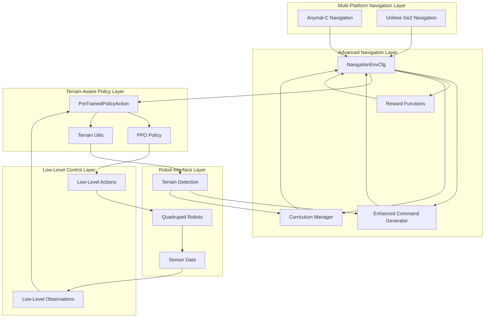
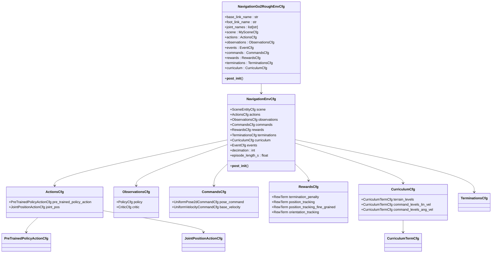
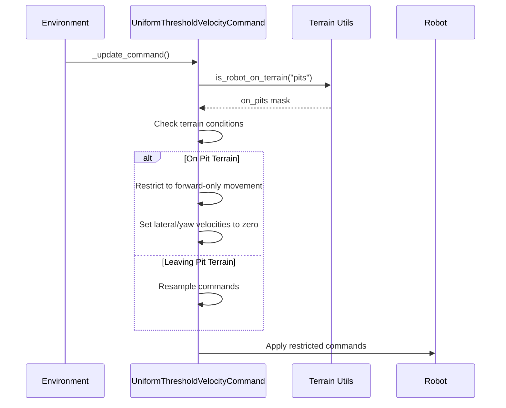
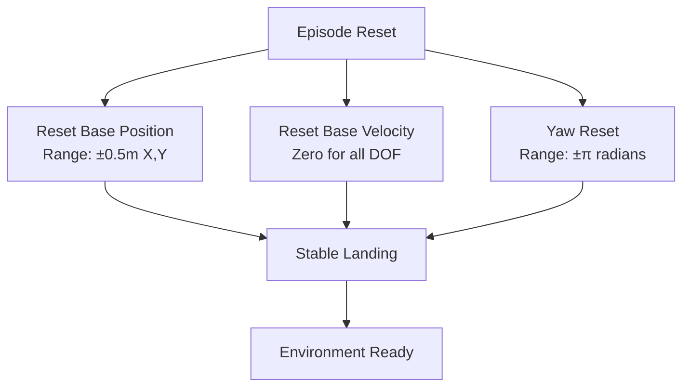
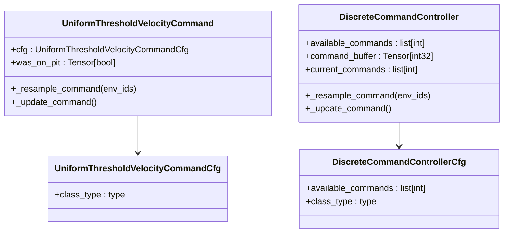
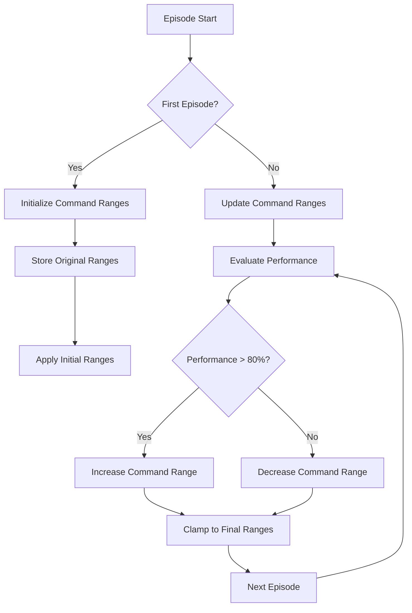
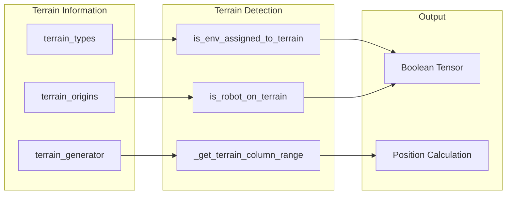
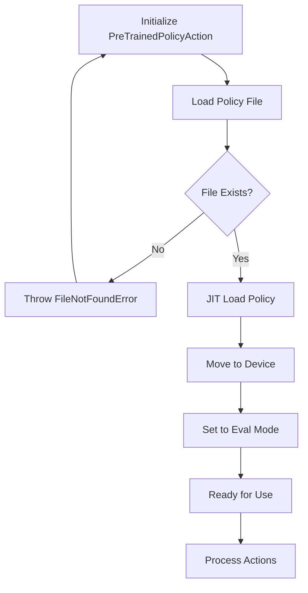
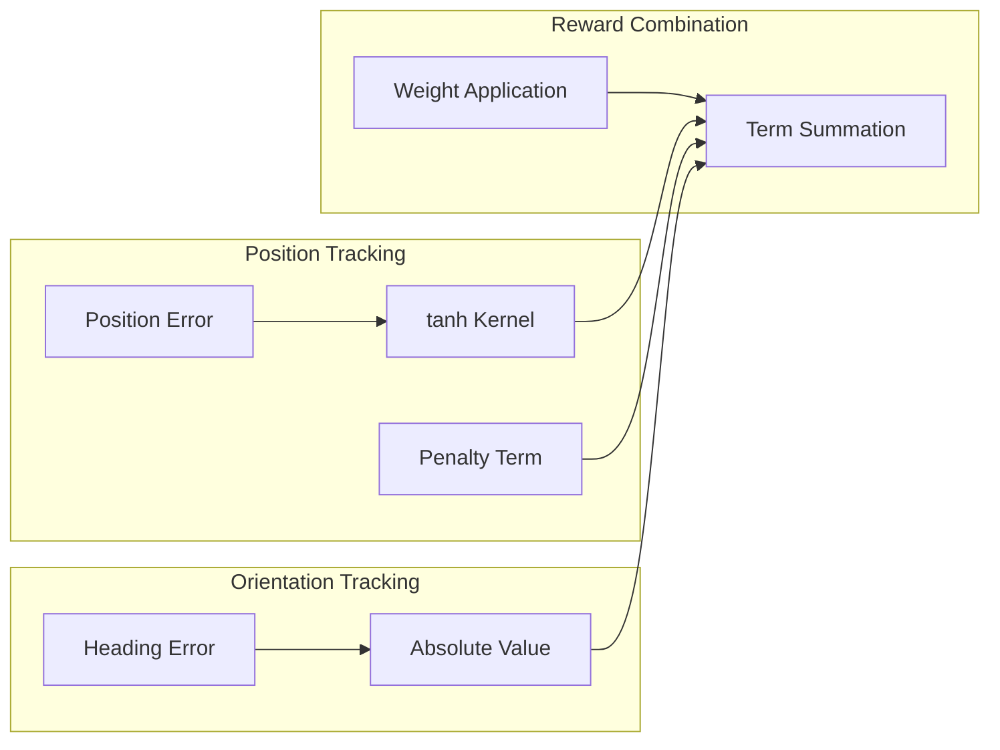
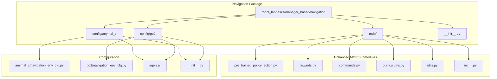

# Navigation System Overview

<cite>
**Referenced Files in This Document**
- [navigation_env_cfg.py](file://source/robot_lab/robot_lab/tasks/manager_based/navigation/config/anymal_c/navigation_env_cfg.py)
- [navigation_env_cfg.py](file://source/robot_lab/robot_lab/tasks/manager_based/navigation/config/go2/navigation_env_cfg.py)
- [rsl_rl_ppo_cfg.py](file://source/robot_lab/robot_lab/tasks/manager_based/navigation/config/go2/agents/rsl_rl_ppo_cfg.py)
- [skrl_flat_ppo_cfg.yaml](file://source/robot_lab/robot_lab/tasks/manager_based/navigation/config/go2/agents/skrl_flat_ppo_cfg.yaml)
- [pre_trained_policy_action.py](file://source/robot_lab/robot_lab/tasks/manager_based/navigation/mdp/pre_trained_policy_action.py)
- [rewards.py](file://source/robot_lab/robot_lab/tasks/manager_based/navigation/mdp/rewards.py)
- [commands.py](file://source/robot_lab/robot_lab/tasks/manager_based/navigation/mdp/commands.py)
- [curriculums.py](file://source/robot_lab/robot_lab/tasks/manager_based/navigation/mdp/curriculums.py)
- [utils.py](file://source/robot_lab/robot_lab/tasks/manager_based/navigation/mdp/utils.py)
- [navigation_mdp_init.py](file://source/robot_lab/robot_lab/tasks/manager_based/navigation/mdp/__init__.py)
- [navigation_init.py](file://source/robot_lab/robot_lab/tasks/manager_based/navigation/__init__.py)
- [unitree.py](file://source/robot_lab/robot_lab/assets/unitree.py)
- [unitree_go2_init.py](file://source/robot_lab/robot_lab/tasks/manager_based/locomotion/velocity/config/quadruped/unitree_go2/__init__.py)
- [commands.py](file://source/robot_lab/robot_lab/tasks/manager_based/locomotion/velocity/mdp/commands.py)
</cite>

## Update Summary
**Changes Made**
- Added comprehensive navigation training framework for Unitree Go2 robots
- Expanded navigation capabilities beyond existing Anymal-C implementation
- Integrated Unitree Go2 robot configuration with navigation system
- Enhanced policy translation layer with Unitree-specific actuator models
- Updated curriculum management with terrain-level progression for Go2 platform
- Modernized navigation architecture with enhanced policy translation and reward systems

## Table of Contents
1. [Introduction](#introduction)
2. [System Architecture](#system-architecture)
3. [Core Components](#core-components)
4. [Environment Configuration](#environment-configuration)
5. [Enhanced Command Generation System](#enhanced-command-generation-system)
6. [Curriculum Management](#curriculum-management)
7. [Terrain-Aware Utilities](#terrain-aware-utilities)
8. [Pre-Trained Policy Action System](#pre-trained-policy-action-system)
9. [Reward Functions](#reward-functions)
10. [Integration Architecture](#integration-architecture)
11. [Performance Considerations](#performance-considerations)
12. [Troubleshooting Guide](#troubleshooting-guide)
13. [Conclusion](#conclusion)

## Introduction

The Navigation System in this robot lab repository provides a comprehensive framework for training and deploying navigation capabilities on quadruped robots, significantly expanded to include Unitree Go2 robots alongside the existing Anymal-C platform. This system leverages a sophisticated hierarchical approach where advanced navigation commands are translated into low-level joint control through enhanced policy networks, enabling efficient and robust navigation in complex, terrain-aware environments.

The system is built upon the Isaac Lab framework and utilizes an enhanced manager-based reinforcement learning architecture that separates concerns between high-level navigation decisions and low-level motor control. This separation allows for modular development, easier debugging, and more maintainable code structure while providing terrain-level curriculum progression and sophisticated command generation capabilities for multiple robot platforms.

**Updated** Added comprehensive navigation training framework for Unitree Go2 robots, expanding navigation capabilities beyond existing Anymal-C implementation with enhanced policy translation and terrain-aware utilities.

## System Architecture

The navigation system follows an enhanced layered architecture pattern that promotes separation of concerns and modularity with terrain-aware capabilities across multiple robot platforms:

**Diagram sources**
- [navigation_env_cfg.py:151-186](file://source/robot_lab/robot_lab/tasks/manager_based/navigation/config/anymal_c/navigation_env_cfg.py#L151-L186)
- [navigation_env_cfg.py:644-690](file://source/robot_lab/robot_lab/tasks/manager_based/navigation/config/go2/navigation_env_cfg.py#L644-L690)
- [pre_trained_policy_action.py:24-101](file://source/robot_lab/robot_lab/tasks/manager_based/navigation/mdp/pre_trained_policy_action.py#L24-L101)
- [commands.py:31-98](file://source/robot_lab/robot_lab/tasks/manager_based/navigation/mdp/commands.py#L31-L98)
- [curriculums.py:24-106](file://source/robot_lab/robot_lab/tasks/manager_based/navigation/mdp/curriculums.py#L24-L106)

The architecture consists of six main layers with enhanced capabilities:

1. **Multi-Platform Configuration Layer**: Supports both Anymal-C and Unitree Go2 navigation environments
2. **Environment Configuration Layer**: Defines the overall navigation environment setup with curriculum integration
3. **Enhanced Command Generation Layer**: Provides terrain-aware command generation with adaptive restrictions
4. **Curriculum Management Layer**: Implements terrain-level difficulty progression and command adaptation
5. **Policy Translation Layer**: Bridges high-level commands to low-level actions with terrain awareness
6. **Robot Interface Layer**: Handles physical robot interaction and terrain-aware sensor feedback

**Updated** Enhanced architecture now supports multiple robot platforms with shared navigation components and platform-specific configurations.

## Core Components

### Multi-Platform Navigation Environment Configuration

The navigation environment is configured through enhanced configuration classes that define all aspects of the navigation task with curriculum integration for multiple robot platforms:

**Diagram sources**
- [navigation_env_cfg.py:151-186](file://source/robot_lab/robot_lab/tasks/manager_based/navigation/config/anymal_c/navigation_env_cfg.py#L151-L186)
- [navigation_env_cfg.py:644-690](file://source/robot_lab/robot_lab/tasks/manager_based/navigation/config/go2/navigation_env_cfg.py#L644-L690)
- [navigation_env_cfg.py:47-58](file://source/robot_lab/robot_lab/tasks/manager_based/navigation/config/anymal_c/navigation_env_cfg.py#L47-L58)
- [navigation_env_cfg.py:77-97](file://source/robot_lab/robot_lab/tasks/manager_based/navigation/config/anymal_c/navigation_env_cfg.py#L77-L97)
- [navigation_env_cfg.py:122-147](file://source/robot_lab/robot_lab/tasks/manager_based/navigation/config/anymal_c/navigation_env_cfg.py#L122-L147)

**Section sources**
- [navigation_env_cfg.py:151-186](file://source/robot_lab/robot_lab/tasks/manager_based/navigation/config/anymal_c/navigation_env_cfg.py#L151-L186)
- [navigation_env_cfg.py:644-690](file://source/robot_lab/robot_lab/tasks/manager_based/navigation/config/go2/navigation_env_cfg.py#L644-L690)

### Enhanced Command Generation System

The navigation system now features sophisticated command generation with terrain-aware capabilities for multiple robot platforms:

**Diagram sources**
- [commands.py:61-98](file://source/robot_lab/robot_lab/tasks/manager_based/navigation/mdp/commands.py#L61-L98)
- [utils.py:73-128](file://source/robot_lab/robot_lab/tasks/manager_based/navigation/mdp/utils.py#L73-L128)

The system implements real-time terrain-aware command restrictions with pit detection and adaptive movement limitations.

**Section sources**
- [commands.py:31-98](file://source/robot_lab/robot_lab/tasks/manager_based/navigation/mdp/commands.py#L31-L98)

## Environment Configuration

The navigation environment configuration establishes the fundamental parameters and behaviors for the navigation task with enhanced curriculum integration across multiple robot platforms:

### Simulation Parameters

The environment configuration carefully balances simulation fidelity with computational efficiency and terrain awareness:

| Parameter | Value | Description |
|-----------|--------|-------------|
| `sim.dt` | Inherits from low-level config | Physics simulation timestep |
| `render_interval` | Inherits from low-level config | Rendering frequency |
| `decimation` | Low-level decimation × 10 | Overall environment decimation |
| `episode_length_s` | Command resampling time | Episode duration in seconds |

### Unitree Go2 Specific Configuration

**Updated** Added Unitree Go2 specific environment configuration with enhanced actuator models and joint specifications:

The Unitree Go2 navigation environment includes platform-specific configurations:

**Diagram sources**
- [navigation_env_cfg.py:28-44](file://source/robot_lab/robot_lab/tasks/manager_based/navigation/config/anymal_c/navigation_env_cfg.py#L28-L44)

**Section sources**
- [navigation_env_cfg.py:135-148](file://source/robot_lab/robot_lab/tasks/manager_based/navigation/config/anymal_c/navigation_env_cfg.py#L135-L148)
- [navigation_env_cfg.py:691-735](file://source/robot_lab/robot_lab/tasks/manager_based/navigation/config/go2/navigation_env_cfg.py#L691-L735)

## Enhanced Command Generation System

The navigation system employs sophisticated command generation tailored for 2D pose control with terrain-aware restrictions across multiple platforms:

### Pose Command Configuration

The command system generates 2D pose commands with comprehensive parameter control and terrain awareness:

**Diagram sources**
- [commands.py:31-105](file://source/robot_lab/robot_lab/tasks/manager_based/navigation/mdp/commands.py#L31-L105)
- [commands.py:107-198](file://source/robot_lab/robot_lab/tasks/manager_based/navigation/mdp/commands.py#L107-L198)

### Command Generation Process

The command generation process ensures smooth, predictable navigation behavior with terrain-aware restrictions:

1. **Resampling Interval**: Commands are resampled every 8 seconds for consistent exploration
2. **Pose Space**: 2D position (±3m range) plus heading (±π radians) control
3. **Terrain-Aware Restrictions**: Real-time pit detection with forward-only movement limitation
4. **Discrete Command Support**: Optional discrete command assignment for specialized scenarios
5. **Adaptive Speed Control**: Minimum/maximum speed limits (0.3-0.6 m/s) on pit terrain

**Section sources**
- [commands.py:31-98](file://source/robot_lab/robot_lab/tasks/manager_based/navigation/mdp/commands.py#L31-L98)
- [commands.py:107-198](file://source/robot_lab/robot_lab/tasks/manager_based/navigation/mdp/commands.py#L107-L198)

## Curriculum Management

The navigation system implements sophisticated curriculum progression with terrain-level difficulty adjustment across multiple platforms:

### Command-Based Curriculum Progression

The system dynamically adjusts command ranges based on performance metrics:

**Diagram sources**
- [curriculums.py:24-65](file://source/robot_lab/robot_lab/tasks/manager_based/navigation/mdp/curriculums.py#L24-L65)
- [curriculums.py:66-106](file://source/robot_lab/robot_lab/tasks/manager_based/navigation/mdp/curriculums.py#L66-L106)

### Terrain-Based Curriculum Progression

The system adapts terrain difficulty based on robot performance:

| Curriculum Type | Performance Metric | Difficulty Adjustment |
|----------------|-------------------|----------------------|
| `terrain_levels_vel` | Distance walked vs. commanded distance | Increase difficulty when walking far enough, decrease when walking less than half required distance |
| `command_levels_lin_vel` | Linear velocity tracking performance | Expand command ranges when 80%+ of maximum reward achieved |
| `command_levels_ang_vel` | Angular velocity tracking performance | Expand command ranges when 80%+ of maximum reward achieved |

**Section sources**
- [curriculums.py:24-106](file://source/robot_lab/robot_lab/tasks/manager_based/navigation/mdp/curriculums.py#L24-L106)

## Terrain-Aware Utilities

The navigation system provides comprehensive utility functions for terrain detection and assignment:

### Terrain Detection Functions

The utility system offers sophisticated terrain-aware operations:

**Diagram sources**
- [utils.py:43-71](file://source/robot_lab/robot_lab/tasks/manager_based/navigation/mdp/utils.py#L43-L71)
- [utils.py:73-128](file://source/robot_lab/robot_lab/tasks/manager_based/navigation/mdp/utils.py#L73-L128)

### Utility Function Capabilities

| Function | Purpose | Input Parameters | Output |
|----------|---------|------------------|--------|
| `is_env_assigned_to_terrain` | Check initial terrain assignment | `env`, `terrain_name` | Boolean tensor mask |
| `is_robot_on_terrain` | Detect current terrain position | `env`, `terrain_name`, `asset_name` | Boolean tensor mask |
| `_get_terrain_column_range` | Calculate terrain column allocation | `terrain_cfg`, `terrain_name`, `device` | Column range tuple |

**Section sources**
- [utils.py:16-128](file://source/robot_lab/robot_lab/tasks/manager_based/navigation/mdp/utils.py#L16-L128)

## Pre-Trained Policy Action System

The pre-trained policy action system represents the most sophisticated component of the navigation architecture, implementing a hierarchical control approach with enhanced policy translation:

### Policy Loading and Initialization

The system supports external policy loading with robust error handling:

**Diagram sources**
- [pre_trained_policy_action.py:42-46](file://source/robot_lab/robot_lab/tasks/manager_based/navigation/mdp/pre_trained_policy_action.py#L42-L46)

### Action Processing Pipeline

The action processing pipeline implements a sophisticated decimation mechanism:

| Phase | Frequency | Purpose |
|-------|-----------|---------|
| High-Level | 1/10th of base rate | Generate navigation commands |
| Policy Inference | 1/40th of base rate | Compute low-level actions |
| Low-Level Control | Base rate | Execute joint commands |

**Section sources**
- [pre_trained_policy_action.py:90-101](file://source/robot_lab/robot_lab/tasks/manager_based/navigation/mdp/pre_trained_policy_action.py#L90-L101)

## Reward Functions

The reward system employs a multi-faceted approach to guide navigation learning with pose-based tracking:

### Position Tracking Rewards

The system implements dual-position tracking mechanisms with different sensitivity levels:

**Diagram sources**
- [rewards.py:15-28](file://source/robot_lab/robot_lab/tasks/manager_based/navigation/mdp/rewards.py#L15-L28)

### Reward Configuration

| Reward Type | Weight | Function | Purpose |
|-------------|--------|----------|---------|
| `termination_penalty` | -400.0 | `is_terminated` | Episode termination penalty |
| `position_tracking` | 0.5 | `position_command_error_tanh(std=2.0)` | Coarse position tracking |
| `position_tracking_fine_grained` | 0.5 | `position_command_error_tanh(std=0.2)` | Fine-grained position tracking |
| `orientation_tracking` | -0.2 | `heading_command_error_abs` | Heading error penalty |

**Section sources**
- [navigation_env_cfg.py:79-96](file://source/robot_lab/robot_lab/tasks/manager_based/navigation/config/anymal_c/navigation_env_cfg.py#L79-L96)
- [rewards.py:15-28](file://source/robot_lab/robot_lab/tasks/manager_based/navigation/mdp/rewards.py#L15-L28)

## Integration Architecture

The navigation system integrates seamlessly with the broader robot lab ecosystem with enhanced module organization across multiple platforms:

### Module Organization

**Diagram sources**
- [navigation_init.py:6-9](file://source/robot_lab/robot_lab/tasks/manager_based/navigation/__init__.py#L6-L9)
- [navigation_mdp_init.py:8-15](file://source/robot_lab/robot_lab/tasks/manager_based/navigation/mdp/__init__.py#L8-L15)

### Cross-Platform Compatibility

The system maintains compatibility with various robot platforms through standardized interfaces:

| Platform | Supported | Configuration Path | Key Features |
|----------|-----------|-------------------|--------------|
| ANYmal-C | ✅ Primary | `anymal_c/navigation_env_cfg.py` | Pre-trained policy integration |
| ANYmal-D | ❓ Future | Planned | Enhanced locomotion capabilities |
| Unitree Go2 | ✅ New | `go2/navigation_env_cfg.py` | DC motor actuators, terrain-aware |
| Unitree Go1 | ❓ Future | Planned | Simplified actuator model |
| Boston Dynamics Spot | ❓ Future | Planned | Wheeled locomotion support |

**Updated** Added comprehensive Unitree Go2 platform support with enhanced actuator models and terrain-aware navigation capabilities.

**Section sources**
- [navigation_mdp_init.py:8-15](file://source/robot_lab/robot_lab/tasks/manager_based/navigation/mdp/__init__.py#L8-L15)
- [unitree.py:71-117](file://source/robot_lab/robot_lab/assets/unitree.py#L71-L117)

## Performance Considerations

The navigation system is optimized for efficient operation in both simulation and real-world scenarios with enhanced computational efficiency:

### Computational Efficiency

| Component | Optimization Strategy | Performance Impact |
|-----------|----------------------|-------------------|
| Policy Decimation | 4-step cycle reduces inference frequency | ~75% reduction in policy computations |
| Terrain Detection | Vectorized operations across all environments | Linear scaling with environment count |
| Curriculum Updates | Episode-based updates prevent frequent recalculations | Minimal computational overhead |
| Memory Management | Efficient tensor reuse and minimal allocations | Reduced memory footprint |
| Device Utilization | GPU acceleration for policy inference | 10x+ speedup over CPU |

### Resource Management

The system implements several resource optimization strategies:

1. **Lazy Initialization**: Components are initialized only when needed
2. **Memory Pooling**: Reused tensors minimize allocation overhead
3. **Asynchronous Updates**: Non-blocking operations prevent simulation stalls
4. **Selective Visualization**: Debug markers disabled in production runs
5. **Terrain-Aware Optimization**: Terrain detection optimized for batch processing

**Updated** Enhanced performance considerations now include Unitree Go2-specific optimizations for DC motor actuator models and terrain-aware navigation.

## Troubleshooting Guide

Common issues and their solutions when working with the enhanced navigation system:

### Policy Loading Issues

**Problem**: Policy file not found or inaccessible
**Solution**: Verify `policy_path` exists and is readable
**Diagnostic**: Check file permissions and path correctness

**Problem**: Policy loading fails with JIT errors
**Solution**: Ensure policy matches expected input dimensions
**Diagnostic**: Compare observation space with policy training conditions

### Enhanced Command Generation Problems

**Problem**: Terrain-aware commands not working properly
**Solution**: Check terrain configuration and detection functions
**Diagnostic**: Verify terrain types and column ranges are correctly configured

**Problem**: Pit terrain restrictions not applied
**Solution**: Ensure `is_robot_on_terrain` function returns correct masks
**Diagnostic**: Check robot position detection and terrain origin calculations

### Curriculum Management Issues

**Problem**: Curriculum progression not occurring
**Solution**: Verify reward term names match configuration
**Diagnostic**: Check episode sum calculations and reward term configurations

**Problem**: Terrain difficulty not adjusting appropriately
**Solution**: Review distance calculations and command comparisons
**Diagnostic**: Analyze robot displacement and commanded velocity relationships

### Training Instability

**Problem**: Poor convergence or unstable training
**Solution**: Tune reward weights and command ranges
**Diagnostic**: Analyze reward shaping and exploration parameters

**Problem**: Early termination in episodes
**Solution**: Adjust termination thresholds and safety margins
**Diagnostic**: Review contact force sensors and collision detection

**Updated** Added troubleshooting guidance for Unitree Go2-specific issues including actuator configuration and terrain-aware navigation problems.

**Section sources**
- [pre_trained_policy_action.py:42-46](file://source/robot_lab/robot_lab/tasks/manager_based/navigation/mdp/pre_trained_policy_action.py#L42-L46)
- [commands.py:73-98](file://source/robot_lab/robot_lab/tasks/manager_based/navigation/mdp/commands.py#L73-L98)
- [curriculums.py:24-106](file://source/robot_lab/robot_lab/tasks/manager_based/navigation/mdp/curriculums.py#L24-L106)

## Conclusion

The Enhanced Navigation System provides a robust, scalable framework for quadruped robot navigation that effectively bridges high-level command generation with low-level control execution through sophisticated terrain-aware capabilities. Through its enhanced hierarchical architecture, terrain-aware command generation, sophisticated reward design, and efficient policy translation mechanisms, the system enables reliable navigation performance across diverse, challenging environments.

**Updated** Significantly expanded to include comprehensive navigation training framework for Unitree Go2 robots, providing enhanced capabilities beyond the existing Anymal-C implementation with improved policy translation, terrain-aware utilities, and multi-platform support.

Key strengths of the enhanced system include:

- **Multi-Platform Architecture**: Support for both Anymal-C and Unitree Go2 navigation environments with shared components
- **Enhanced Policy Translation**: Improved policy loading, decimation scheduling, and action processing pipelines
- **Comprehensive Utility Functions**: Advanced terrain detection, assignment, and position calculation capabilities
- **Terrain-Aware Command Generation**: Real-time adaptation to environmental conditions with pit detection and movement restrictions
- **Sophisticated Curriculum Management**: Terrain-level difficulty progression and adaptive command ranges based on performance metrics
- **Modular Design**: Clear separation between navigation, policy, and control layers with enhanced integration
- **Efficient Computation**: Strategic decimation and vectorized operations reduce computational overhead
- **Robust Integration**: Seamless compatibility with the broader Isaac Lab ecosystem and enhanced cross-platform support
- **Extensible Architecture**: Foundation for supporting additional robot platforms and navigation scenarios

The system's enhanced design principles and implementation patterns serve as a foundation for developing advanced navigation capabilities in robotic systems, with clear pathways for future enhancements, platform expansion, and specialized navigation scenarios including discrete command assignment and terrain-level curriculum progression.