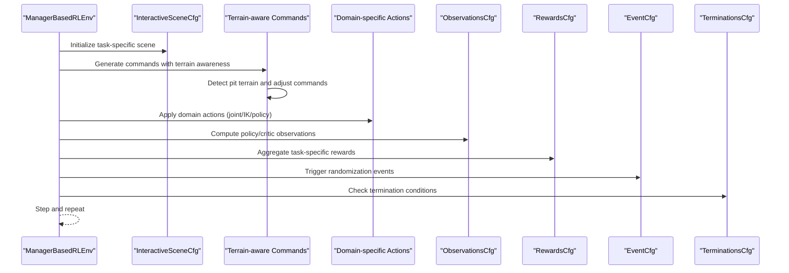
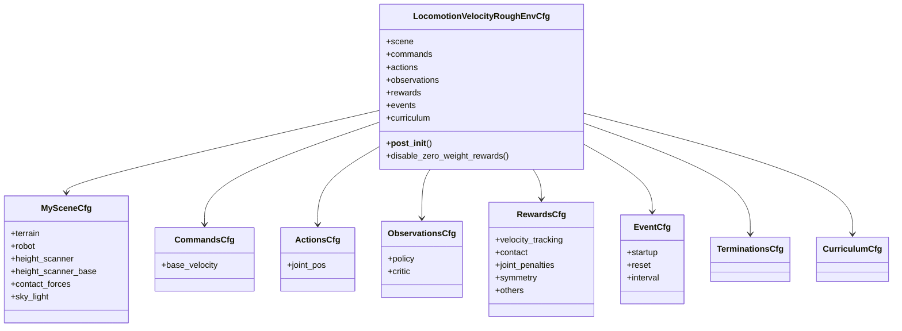
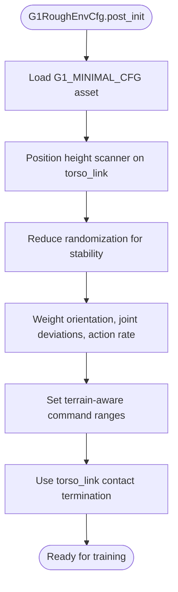
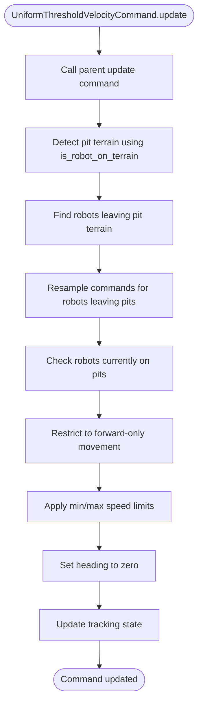
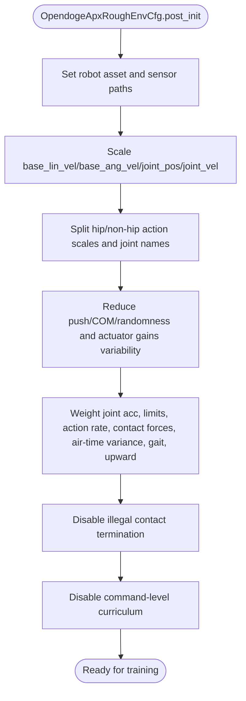
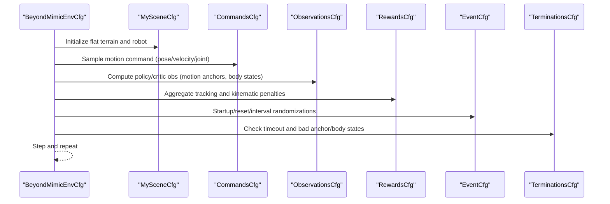
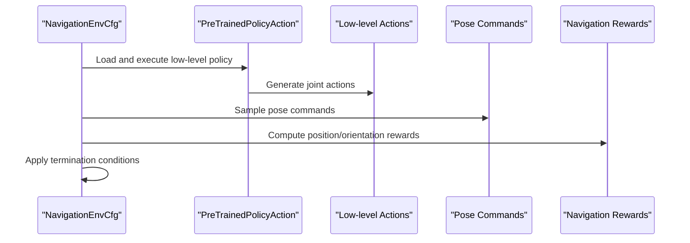
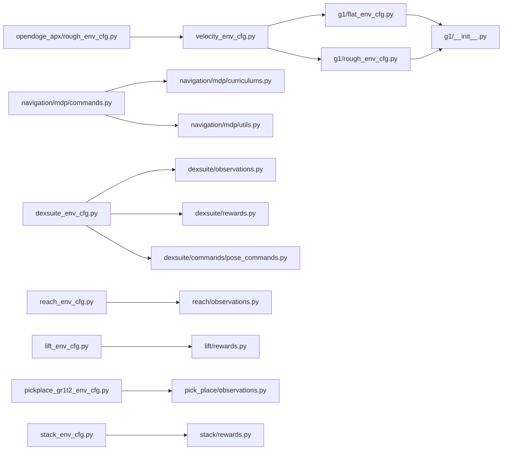

# Task Configuration Framework

<cite>
**Referenced Files in This Document**
- [velocity_env_cfg.py](file://source/robot_lab/robot_lab/tasks/manager_based/locomotion/velocity/velocity_env_cfg.py)
- [g1/flat_env_cfg.py](file://source/robot_lab/robot_lab/tasks/manager_based/locomotion/velocity/config/humanoid/g1/flat_env_cfg.py)
- [g1/rough_env_cfg.py](file://source/robot_lab/robot_lab/tasks/manager_based/locomotion/velocity/config/humanoid/g1/rough_env_cfg.py)
- [g1/__init__.py](file://source/robot_lab/robot_lab/tasks/manager_based/locomotion/velocity/config/humanoid/g1/__init__.py)
- [navigation/mdp/commands.py](file://source/robot_lab/robot_lab/tasks/manager_based/navigation/mdp/commands.py)
- [navigation/mdp/curriculums.py](file://source/robot_lab/robot_lab/tasks/manager_based/navigation/mdp/curriculums.py)
- [navigation/mdp/utils.py](file://source/robot_lab/robot_lab/tasks/manager_based/navigation/mdp/utils.py)
- [locomotion/velocity/mdp/commands.py](file://source/robot_lab/robot_lab/tasks/manager_based/locomotion/velocity/mdp/commands.py)
- [opendoge_apx/rough_env_cfg.py](file://source/robot_lab/robot_lab/tasks/manager_based/locomotion/velocity/config/quadruped/opendoge_apx/rough_env_cfg.py)
- [opendoge_apx/flat_env_cfg.py](file://source/robot_lab/robot_lab/tasks/manager_based/locomotion/velocity/config/quadruped/opendoge_apx/flat_env_cfg.py)
- [rewards.py](file://source/robot_lab/robot_lab/tasks/manager_based/locomotion/velocity/mdp/rewards.py)
- [observations.py](file://source/robot_lab/robot_lab/tasks/manager_based/locomotion/velocity/mdp/observations.py)
- [tracking_env_cfg.py](file://source/robot_lab/robot_lab/tasks/manager_based/beyondmimic/tracking_env_cfg.py)
- [dexsuite_env_cfg.py](file://source/robot_lab/robot_lab/tasks/manager_based/manipulation/dexsuite/dexsuite_env_cfg.py)
- [navigation_env_cfg.py](file://source/robot_lab/robot_lab/tasks/manager_based/navigation/config/anymal_c/navigation_env_cfg.py)
- [pose_commands.py](file://source/robot_lab/robot_lab/tasks/manager_based/manipulation/dexsuite/mdp/commands/pose_commands.py)
- [observations.py](file://source/robot_lab/robot_lab/tasks/manager_based/manipulation/dexsuite/mdp/observations.py)
- [rewards.py](file://source/robot_lab/robot_lab/tasks/manager_based/manipulation/dexsuite/mdp/rewards.py)
- [reach_env_cfg.py](file://source/robot_lab/robot_lab/tasks/manager_based/manipulation/reach/reach_env_cfg.py)
- [lift_env_cfg.py](file://source/robot_lab/robot_lab/tasks/manager_based/manipulation/lift/lift_env_cfg.py)
- [pickplace_gr1t2_env_cfg.py](file://source/robot_lab/robot_lab/tasks/manager_based/manipulation/pick_place/pickplace_gr1t2_env_cfg.py)
- [stack_env_cfg.py](file://source/robot_lab/robot_lab/tasks/manager_based/manipulation/stack/stack_env_cfg.py)
- [pre_trained_policy_action.py](file://source/robot_lab/robot_lab/tasks/manager_based/navigation/mdp/pre_trained_policy_action.py)
- [rewards.py](file://source/robot_lab/robot_lab/tasks/manager_based/navigation/mdp/rewards.py)
</cite>

## Update Summary
**Changes Made**
- Added comprehensive documentation for the new G1 humanoid locomotion configuration system with flat and rough terrain environments
- Integrated enhanced navigation MDP components including terrain-aware commands, curriculum learning, and utility functions
- Updated velocity environment configuration to reflect simplified observation system and Isaaclab G1 framework transition
- Documented new terrain-aware command system that automatically detects and adapts to pit terrain conditions
- Added curriculum learning implementations for navigation tasks with adaptive command ranges and terrain progression
- Enhanced task configuration hierarchy to support the new G1 humanoid robot variants

## Table of Contents
1. [Introduction](#introduction)
2. [Project Structure](#project-structure)
3. [Core Components](#core-components)
4. [Architecture Overview](#architecture-overview)
5. [Detailed Component Analysis](#detailed-component-analysis)
6. [Dependency Analysis](#dependency-analysis)
7. [Performance Considerations](#performance-considerations)
8. [Troubleshooting Guide](#troubleshooting-guide)
9. [Conclusion](#conclusion)
10. [Appendices](#appendices)

## Introduction
This document explains the task configuration framework for the ManagerBasedRLEnv-based locomotion, manipulation, and navigation systems with advanced MDP implementations. The framework now encompasses over 160 new files across multiple task categories including velocity-based locomotion, manipulation (DexSuite, reach, lift, pick-place, stack), and navigation capabilities. The recent updates include a new G1 humanoid locomotion configuration system with flat and rough terrain environments, enhanced navigation MDP components with terrain-aware command generation, and simplified velocity environment observation system. The framework supports curriculum learning, symmetry data augmentation, beyond mimic motion imitation, and advanced manipulation features like point cloud processing and contact force monitoring.

## Project Structure
The task configuration is organized around a base environment configuration that defines scenes, commands, actions, observations, rewards, events, and terminations. The framework now includes specialized categories for locomotion, manipulation, and navigation, each with their own configuration hierarchies and MDP components. Robot-specific variants inherit from base configurations and override scene assets, observation scaling, action scales, reward weights, and curriculum settings.

```mermaid
graph TB
subgraph "Base Locomotion"
VCFG["velocity_env_cfg.py<br/>Base Env Config"]
end
subgraph "G1 Humanoid Locomotion"
G1FLAT["g1/flat_env_cfg.py<br/>Flat Terrain G1"]
G1ROUGH["g1/rough_env_cfg.py<br/>Rough Terrain G1"]
G1INIT["g1/__init__.py<br/>Environment Registration"]
end
subgraph "Enhanced Navigation MDP"
NAVCMDS["navigation/mdp/commands.py<br/>Terrain-aware Commands"]
NAVCURR["navigation/mdp/curriculums.py<br/>Adaptive Curriculum"]
NAVUTILS["navigation/mdp/utils.py<br/>Terrain Utilities"]
END
subgraph "Manipulation Tasks"
DEX["dexsuite_env_cfg.py<br/>Multi-object Manipulation"]
REACH["reach_env_cfg.py<br/>End-effector Pose Tracking"]
LIFT["lift_env_cfg.py<br/>Object Lifting"]
PICKPLACE["pickplace_gr1t2_env_cfg.py<br/>Humanoid Manipulation"]
STACK["stack_env_cfg.py<br/>Block Stacking"]
end
subgraph "MDP Modules"
OBS["mdp/observations.py<br/>Manipulation Observations"]
REW["mdp/rewards.py<br/>Manipulation Rewards"]
CMD["mdp/commands/<br/>Pose Commands"]
PTP["pre_trained_policy_action.py<br/>Low-level Policy Action"]
END
subgraph "Variants"
OAR["opendoge_apx/rough_env_cfg.py"]
END
VCFG --> G1FLAT
VCFG --> G1ROUGH
G1FLAT --> G1INIT
G1ROUGH --> G1INIT
NAVCMDS --> NAVCURR
NAVCMDS --> NAVUTILS
DEX --> OBS
DEX --> REW
DEX --> CMD
REACH --> OBS
LIFT --> REW
PICKPLACE --> OBS
STACK --> REW
OAR --> VCFG
```

**Diagram sources**
- [velocity_env_cfg.py:700-798](file://source/robot_lab/robot_lab/tasks/manager_based/locomotion/velocity/velocity_env_cfg.py#L700-L798)
- [g1/flat_env_cfg.py:1-57](file://source/robot_lab/robot_lab/tasks/manager_based/locomotion/velocity/config/humanoid/g1/flat_env_cfg.py#L1-L57)
- [g1/rough_env_cfg.py:1-182](file://source/robot_lab/robot_lab/tasks/manager_based/locomotion/velocity/config/humanoid/g1/rough_env_cfg.py#L1-L182)
- [g1/__init__.py:14-70](file://source/robot_lab/robot_lab/tasks/manager_based/locomotion/velocity/config/humanoid/g1/__init__.py#L14-L70)
- [navigation/mdp/commands.py:31-98](file://source/robot_lab/robot_lab/tasks/manager_based/navigation/mdp/commands.py#L31-L98)
- [navigation/mdp/curriculums.py:24-175](file://source/robot_lab/robot_lab/tasks/manager_based/navigation/mdp/curriculums.py#L24-L175)
- [navigation/mdp/utils.py:43-128](file://source/robot_lab/robot_lab/tasks/manager_based/navigation/mdp/utils.py#L43-L128)

**Section sources**
- [velocity_env_cfg.py:700-798](file://source/robot_lab/robot_lab/tasks/manager_based/locomotion/velocity/velocity_env_cfg.py#L700-L798)
- [g1/flat_env_cfg.py:1-57](file://source/robot_lab/robot_lab/tasks/manager_based/locomotion/velocity/config/humanoid/g1/flat_env_cfg.py#L1-L57)
- [g1/rough_env_cfg.py:1-182](file://source/robot_lab/robot_lab/tasks/manager_based/locomotion/velocity/config/humanoid/g1/rough_env_cfg.py#L1-L182)
- [g1/__init__.py:14-70](file://source/robot_lab/robot_lab/tasks/manager_based/locomotion/velocity/config/humanoid/g1/__init__.py#L14-L70)

## Core Components
The framework now encompasses four major task categories:

### Locomotion Components
- Base environment configuration defines the ManagerBasedRLEnv base class, scene, commands, actions, observations, rewards, events, and curriculum.
- **G1 Humanoid Variants**: Specialized configurations for Unitree G1 robot with terrain-aware command generation and reward shaping.
- Robot-specific configurations inherit from the base and specialize assets, observation scaling, action scales, reward weights, and curriculum.
- MDP modules provide reusable functions for observations, rewards, events, and utilities.

### Enhanced Navigation Components
- **Terrain-aware Commands**: Automatic detection and adaptation to pit terrain conditions with forward-only movement restrictions.
- **Adaptive Curriculum**: Dynamic command range adjustment based on performance metrics and terrain difficulty progression.
- **Utility Functions**: Terrain type checking and robot position mapping for terrain-aware operations.

### Manipulation Components
- **DexSuite**: Multi-object manipulation with pose tracking, object point cloud processing, and contact force monitoring.
- **Reach**: End-effector pose tracking with curriculum learning and action regularization.
- **Lift**: Object lifting tasks with minimal height constraints and success detection.
- **Pick-place**: Humanoid manipulation with inverse kinematics and XR retargeting support.
- **Stack**: Block stacking with multi-cube observation and success criteria.

### Legacy Components
- **Quadruped Variants**: Opendoge APX and other quadruped configurations with specialized reward shaping and action scaling.
- **Beyond Mimic**: Motion imitation with pose/velocity/joint-position command ranges.

**Section sources**
- [velocity_env_cfg.py:12-798](file://source/robot_lab/robot_lab/tasks/manager_based/locomotion/velocity/velocity_env_cfg.py#L12-L798)
- [g1/flat_env_cfg.py:12-57](file://source/robot_lab/robot_lab/tasks/manager_based/locomotion/velocity/config/humanoid/g1/flat_env_cfg.py#L12-L57)
- [g1/rough_env_cfg.py:19-182](file://source/robot_lab/robot_lab/tasks/manager_based/locomotion/velocity/config/humanoid/g1/rough_env_cfg.py#L19-L182)
- [navigation/mdp/commands.py:31-98](file://source/robot_lab/robot_lab/tasks/manager_based/navigation/mdp/commands.py#L31-L98)
- [navigation/mdp/curriculums.py:24-175](file://source/robot_lab/robot_lab/tasks/manager_based/navigation/mdp/curriculums.py#L24-L175)
- [navigation/mdp/utils.py:43-128](file://source/robot_lab/robot_lab/tasks/manager_based/navigation/mdp/utils.py#L43-L128)

## Architecture Overview
The ManagerBasedRLEnv orchestrates the MDP pipeline across all task categories with enhanced terrain awareness:
- Scene initializes terrain/robot/assets, sensors, and lighting for each task domain.
- **Terrain-aware Command Manager**: Generates per-step targets with automatic terrain adaptation for pit detection.
- Action manager applies domain-specific actions (joint positions, inverse kinematics, pre-trained policies).
- Observation manager computes policy/critic tensors from sensors and asset data.
- Reward manager aggregates per-term rewards and penalties specific to each task category.
- Event manager triggers randomized perturbations during startup/reset/interval.
- Termination manager checks episode-ending conditions for each task domain.
- **Adaptive Curriculum**: Dynamically adjusts difficulty based on performance metrics and terrain progression.



**Diagram sources**
- [navigation/mdp/commands.py:61-98](file://source/robot_lab/robot_lab/tasks/manager_based/navigation/mdp/commands.py#L61-L98)
- [g1/rough_env_cfg.py:107-153](file://source/robot_lab/robot_lab/tasks/manager_based/locomotion/velocity/config/humanoid/g1/rough_env_cfg.py#L107-L153)
- [navigation/mdp/curriculums.py:24-175](file://source/robot_lab/robot_lab/tasks/manager_based/navigation/mdp/curriculums.py#L24-L175)

## Detailed Component Analysis

### Base Velocity Environment Configuration
The base configuration defines:
- Scene: terrain importer, robot asset placeholder, ray-casters for height sensing, contact sensor, and lighting.
- Commands: velocity command with configurable ranges and heading control.
- Actions: joint position action with per-joint scaling and clipping.
- Observations: policy and critic groups with base velocities, gravity projection, commands, joint positions/velocities, last action, and height scans.
- Rewards: extensive set covering root penalties, joint torques/velocities/accelerations, action rate, contact dynamics, velocity tracking, and foot-related rewards.
- Events: randomized material/mass/COM/gains, reset conditions, and periodic pushes.
- Termination: timeout and terrain bounds.
- Curriculum: terrain levels and command level progression.



**Diagram sources**
- [velocity_env_cfg.py:12-798](file://source/robot_lab/robot_lab/tasks/manager_based/locomotion/velocity/velocity_env_cfg.py#L12-L798)

**Section sources**
- [velocity_env_cfg.py:12-798](file://source/robot_lab/robot_lab/tasks/manager_based/locomotion/velocity/velocity_env_cfg.py#L12-L798)

### G1 Humanoid Locomotion Configuration System
The G1 humanoid configuration system provides specialized locomotion for Unitree G1 robots with terrain-aware capabilities:

#### Flat Terrain Configuration
The flat terrain variant inherits from the rough terrain configuration and makes minimal modifications:
- **Terrain Setup**: Changes terrain type to plane, disables terrain generator, removes height scanner.
- **Observation Simplification**: Removes height scan from policy observations.
- **Curriculum Adjustment**: Disables terrain-level curriculum.
- **Reward Shaping**: Emphasizes angular velocity tracking and air time rewards.
- **Command Ranges**: Adjusts lateral velocity ranges for stable walking.

#### Rough Terrain Configuration  
The rough terrain variant provides comprehensive G1-specific configurations:
- **Robot Asset**: Uses G1_MINIMAL_CFG with proper prim path configuration.
- **Height Scanner**: Positions ray caster on torso_link for terrain sensing.
- **Randomization**: Reduces push_robot and base_mass randomization for stability.
- **Reward Weighting**: Emphasizes orientation, joint deviations, and action regularization.
- **Termination**: Uses torso_link contact for illegal contact detection.



**Diagram sources**
- [g1/rough_env_cfg.py:107-153](file://source/robot_lab/robot_lab/tasks/manager_based/locomotion/velocity/config/humanoid/g1/rough_env_cfg.py#L107-L153)

**Section sources**
- [g1/flat_env_cfg.py:12-57](file://source/robot_lab/robot_lab/tasks/manager_based/locomotion/velocity/config/humanoid/g1/flat_env_cfg.py#L12-L57)
- [g1/rough_env_cfg.py:19-182](file://source/robot_lab/robot_lab/tasks/manager_based/locomotion/velocity/config/humanoid/g1/rough_env_cfg.py#L19-L182)

### Enhanced Navigation MDP Components
The navigation system now includes advanced terrain-aware components:

#### Terrain-aware Command System
The UniformThresholdVelocityCommand automatically detects and adapts to pit terrain conditions:
- **Pit Detection**: Real-time terrain type checking using is_robot_on_terrain utility.
- **Command Restriction**: For robots on pit terrain, restricts movement to forward-only with speed limits.
- **Heading Control**: Sets heading to zero for robots on pit terrain to prevent rotation.
- **Dynamic Adaptation**: Resamples commands when robots leave pit terrain.

#### Adaptive Curriculum System
The curriculum system provides dynamic difficulty adjustment:
- **Command Level Adjustment**: Gradually increases/decreases command ranges based on performance.
- **Terrain Progression**: Adjusts terrain difficulty based on distance traveled.
- **Performance-based Scaling**: Uses 80% threshold of maximum reward to determine curriculum progression.

#### Utility Functions
Terrain-aware utility functions enable sophisticated terrain operations:
- **Environment Assignment**: Identifies which environments are initially assigned to specific terrain types.
- **Robot Position Mapping**: Determines which terrain grid cells robots are currently standing on.
- **Column Range Calculation**: Calculates terrain type column ranges for multi-terrain generators.



**Diagram sources**
- [navigation/mdp/commands.py:61-98](file://source/robot_lab/robot_lab/tasks/manager_based/navigation/mdp/commands.py#L61-L98)

**Section sources**
- [navigation/mdp/commands.py:31-98](file://source/robot_lab/robot_lab/tasks/manager_based/navigation/mdp/commands.py#L31-L98)
- [navigation/mdp/curriculums.py:24-175](file://source/robot_lab/robot_lab/tasks/manager_based/navigation/mdp/curriculums.py#L24-L175)
- [navigation/mdp/utils.py:43-128](file://source/robot_lab/robot_lab/tasks/manager_based/navigation/mdp/utils.py#L43-L128)

### Quadruped Variant: Opendoge APX
The Opendoge APX variant specializes:
- Robot asset and joint naming for four legs.
- Observation scaling and explicit joint lists.
- Action scaling split by hip vs non-hip joints.
- Reduced external force torque and COM randomness for stability.
- Emphasis on joint acceleration, joint limits, action rate, contact forces, air-time variance, diagonal gait reward, and upward orientation.
- Disabled illegal contact termination.



**Diagram sources**
- [opendoge_apx/rough_env_cfg.py:27-187](file://source/robot_lab/robot_lab/tasks/manager_based/locomotion/velocity/config/quadruped/opendoge_apx/rough_env_cfg.py#L27-L187)

**Section sources**
- [opendoge_apx/rough_env_cfg.py:14-187](file://source/robot_lab/robot_lab/tasks/manager_based/locomotion/velocity/config/quadruped/opendoge_apx/rough_env_cfg.py#L14-L187)
- [opendoge_apx/flat_env_cfg.py:9-30](file://source/robot_lab/robot_lab/tasks/manager_based/locomotion/velocity/config/quadruped/opendoge_apx/flat_env_cfg.py#L9-L30)

### Beyond Mimic Motion Imitation
Beyond mimic extends the ManagerBasedRLEnv framework to motion imitation:
- Scene: flat terrain, robot asset, contact sensor.
- Commands: motion command with pose/velocity/joint-position ranges.
- Observations: policy/critic groups augmented with motion anchors and body states.
- Rewards: global and relative body position/orientation/velocity errors, joint accelerations, torques, action rate, and undesired contacts.
- Events: randomized material, joint defaults, and periodic pushes.
- Termination: timeout, anchor position/orientation thresholds, and end-effector/body position checks.



**Diagram sources**
- [tracking_env_cfg.py:43-333](file://source/robot_lab/robot_lab/tasks/manager_based/beyondmimic/tracking_env_cfg.py#L43-L333)

**Section sources**
- [tracking_env_cfg.py:1-333](file://source/robot_lab/robot_lab/tasks/manager_based/beyondmimic/tracking_env_cfg.py#L1-L333)

### DexSuite Multi-Object Manipulation
DexSuite provides comprehensive multi-object manipulation capabilities:
- **Scene Configuration**: Multiple object types (cuboids, spheres, capsules, cones) with varied sizes and masses.
- **Command System**: Uniform pose command generation for object manipulation with quaternion sampling.
- **Observation Processing**: Point cloud sampling, body state transformations, and contact force monitoring.
- **Reward Engineering**: Success detection, position/orientation tracking, and action regularization.
- **Event Randomization**: Physics material variations, joint parameter randomization, and gravity curriculum.


**Diagram sources**
- [dexsuite_env_cfg.py:390-467](file://source/robot_lab/robot_lab/tasks/manager_based/manipulation/dexsuite/dexsuite_env_cfg.py#L390-L467)

**Section sources**
- [dexsuite_env_cfg.py:27-467](file://source/robot_lab/robot_lab/tasks/manager_based/manipulation/dexsuite/dexsuite_env_cfg.py#L27-L467)
- [pose_commands.py:26-180](file://source/robot_lab/robot_lab/tasks/manager_based/manipulation/dexsuite/mdp/commands/pose_commands.py#L26-L180)
- [observations.py:99-198](file://source/robot_lab/robot_lab/tasks/manager_based/manipulation/dexsuite/mdp/observations.py#L99-L198)
- [rewards.py:31-127](file://source/robot_lab/robot_lab/tasks/manager_based/manipulation/dexsuite/mdp/rewards.py#L31-L127)

### Navigation with Pre-Trained Policy Action
Navigation integrates low-level policy execution:
- **Pre-Trained Policy Action**: Loads and executes low-level policies for base velocity control.
- **Command Management**: Uniform 2D pose commands with resampling and visualization.
- **Reward Engineering**: Position tracking with fine-grained and coarse-grained components.
- **Termination Handling**: Base contact detection and time-based termination.
- **Integration**: Seamless coordination between high-level navigation and low-level locomotion.



**Diagram sources**
- [navigation_env_cfg.py:122-161](file://source/robot_lab/robot_lab/tasks/manager_based/navigation/config/anymal_c/navigation_env_cfg.py#L122-L161)
- [pre_trained_policy_action.py:24-189](file://source/robot_lab/robot_lab/tasks/manager_based/navigation/mdp/pre_trained_policy_action.py#L24-L189)

**Section sources**
- [navigation_env_cfg.py:24-161](file://source/robot_lab/robot_lab/tasks/manager_based/navigation/config/anymal_c/navigation_env_cfg.py#L24-L161)
- [pre_trained_policy_action.py:24-189](file://source/robot_lab/robot_lab/tasks/manager_based/navigation/mdp/pre_trained_policy_action.py#L24-L189)
- [rewards.py:15-28](file://source/robot_lab/robot_lab/tasks/manager_based/navigation/mdp/rewards.py#L15-L28)

### Manipulation Task Variants

#### Reach Task Configuration
The reach task provides end-effector pose tracking with curriculum learning:
- **Scene Setup**: Table and robot configuration with SeattleLabTable assets.
- **Command Generation**: Uniform pose commands with Cartesian bounds.
- **Observation Processing**: Relative joint positions/velocities and command history.
- **Reward Engineering**: Position and orientation tracking with action regularization.
- **Curriculum System**: Progressive reward weighting for action and joint velocity penalties.

#### Lift Task Configuration
The lift task focuses on object manipulation with minimal height constraints:
- **Scene Configuration**: Object and table setup with end-effector frame transformation.
- **Command System**: Uniform pose commands for object positioning.
- **Observation Processing**: Object position in robot root frame and target tracking.
- **Reward Engineering**: Object reaching, lifting detection, and goal tracking with success thresholds.
- **Termination Conditions**: Time-based and object dropping detection.

#### Pick-Place Task Configuration
The pick-place task supports humanoid manipulation with XR integration:
- **Humanoid Robot**: Fourier GR1T2 configuration with high PD control.
- **Inverse Kinematics**: Pink IK controller with null space posture tasks.
- **Observation Processing**: Comprehensive robot and object state observations.
- **Termination Detection**: Success detection based on task completion criteria.
- **XR Support**: OpenXR device integration with retargeting support.

#### Stack Task Configuration
The stack task enables block manipulation with multi-cube observation:
- **Scene Setup**: Three cube objects with distinct properties.
- **Observation Processing**: Cube positions, orientations, and grasping states.
- **Termination Detection**: Individual cube dropping and overall stacking success.
- **XR Integration**: Spatial anchor configuration for immersive experiences.

**Section sources**
- [reach_env_cfg.py:69-230](file://source/robot_lab/robot_lab/tasks/manager_based/manipulation/reach/reach_env_cfg.py#L69-L230)
- [lift_env_cfg.py:71-223](file://source/robot_lab/robot_lab/tasks/manager_based/manipulation/lift/lift_env_cfg.py#L71-L223)
- [pickplace_gr1t2_env_cfg.py:115-416](file://source/robot_lab/robot_lab/tasks/manager_based/manipulation/pick_place/pickplace_gr1t2_env_cfg.py#L115-L416)
- [stack_env_cfg.py:64-200](file://source/robot_lab/robot_lab/tasks/manager_based/manipulation/stack/stack_env_cfg.py#L64-L200)

## Dependency Analysis
The framework maintains clear separation between task categories while enabling cross-domain integration:
- Base locomotion depends on MDP modules for observations and rewards.
- **G1 Humanoid variants** depend on base velocity configuration with terrain-aware enhancements.
- **Enhanced navigation** depends on terrain-aware command system and adaptive curriculum.
- Manipulation tasks depend on specialized MDP modules for pose commands, observations, and rewards.
- Navigation tasks depend on pre-trained policy action framework and pose-based commands.
- Robot-specific variants depend on base configurations and override only necessary fields.
- Cross-domain dependencies enable hybrid tasks combining locomotion and manipulation.



**Diagram sources**
- [velocity_env_cfg.py:700-798](file://source/robot_lab/robot_lab/tasks/manager_based/locomotion/velocity/velocity_env_cfg.py#L700-L798)
- [g1/flat_env_cfg.py:12-57](file://source/robot_lab/robot_lab/tasks/manager_based/locomotion/velocity/config/humanoid/g1/flat_env_cfg.py#L12-L57)
- [g1/rough_env_cfg.py:107-153](file://source/robot_lab/robot_lab/tasks/manager_based/locomotion/velocity/config/humanoid/g1/rough_env_cfg.py#L107-L153)
- [g1/__init__.py:14-70](file://source/robot_lab/robot_lab/tasks/manager_based/locomotion/velocity/config/humanoid/g1/__init__.py#L14-L70)

**Section sources**
- [velocity_env_cfg.py:700-798](file://source/robot_lab/robot_lab/tasks/manager_based/locomotion/velocity/velocity_env_cfg.py#L700-L798)
- [g1/flat_env_cfg.py:12-57](file://source/robot_lab/robot_lab/tasks/manager_based/locomotion/velocity/config/humanoid/g1/flat_env_cfg.py#L12-L57)
- [g1/rough_env_cfg.py:107-153](file://source/robot_lab/robot_lab/tasks/manager_based/locomotion/velocity/config/humanoid/g1/rough_env_cfg.py#L107-L153)
- [g1/__init__.py:14-70](file://source/robot_lab/robot_lab/tasks/manager_based/locomotion/velocity/config/humanoid/g1/__init__.py#L14-L70)

## Performance Considerations
The framework implements several optimization strategies across task categories:
- **Simulation Decimation**: Centralized configuration for optimal performance across all domains.
- **Sensor Synchronization**: Aligned update periods for efficient computation in complex scenes.
- **Zero-Weight Optimization**: Disabled unused reward terms to reduce computational overhead.
- **Curriculum Efficiency**: Dynamic difficulty adjustment for manipulation tasks.
- **Point Cloud Optimization**: Efficient sampling and caching for DexSuite tasks.
- **Policy Execution**: Optimized pre-trained policy loading and inference for navigation tasks.
- **Terrain-aware Operations**: Efficient terrain type checking and robot position mapping.
- **Command Restriction**: Minimal computational overhead for pit terrain detection and adaptation.

Practical tips:
- Tune decimation and dt for target FPS while preserving control bandwidth across all task domains.
- Disable unused observations and sensors in flat environments to reduce memory bandwidth.
- Use curriculum to gradually increase command ranges and task complexity.
- Optimize point cloud sampling parameters for manipulation tasks.
- Cache frequently accessed policy weights for navigation tasks.
- Leverage terrain-aware commands for improved stability on challenging terrains.

**Section sources**
- [velocity_env_cfg.py:706-744](file://source/robot_lab/robot_lab/tasks/manager_based/locomotion/velocity/velocity_env_cfg.py#L706-L744)
- [g1/flat_env_cfg.py:18-26](file://source/robot_lab/robot_lab/tasks/manager_based/locomotion/velocity/config/humanoid/g1/flat_env_cfg.py#L18-L26)
- [navigation/mdp/commands.py:73-97](file://source/robot_lab/robot_lab/tasks/manager_based/navigation/mdp/commands.py#L73-L97)

## Troubleshooting Guide
Common issues and resolutions across task categories:

### Locomotion Issues
- **Excessive joint torques/accelerations**: Reduce action scales and increase joint acceleration penalties in robot-specific configurations.
- **Instability on rough terrain**: Increase base height and upward orientation rewards; reduce push intervals and magnitudes.
- **Poor velocity tracking**: Adjust velocity-tracking reward standard deviations and frame selection.
- **G1 Robot instability**: Verify G1_MINIMAL_CFG asset loading and height scanner positioning.

### Enhanced Navigation Issues
- **Terrain-aware command failures**: Check terrain generator configuration and is_robot_on_terrain utility function.
- **Pit terrain detection errors**: Verify terrain type definitions and column range calculations.
- **Curriculum adaptation problems**: Adjust performance thresholds and reward term weights.

### Manipulation Issues
- **Object manipulation failures**: Verify point cloud sampling parameters and contact sensor configurations.
- **Pose tracking drift**: Adjust command resampling rates and reward standard deviations.
- **Success detection problems**: Fine-tune success thresholds and visualization markers.
- **XR integration issues**: Check device configuration and retargeting parameters.

### Performance Issues
- **High computational overhead**: Disable unused observations and sensors in flat environments.
- **Memory usage spikes**: Reduce terrain generator complexity and cache frequently accessed data.
- **Training instability**: Adjust reward scaling and curriculum progression rates.

**Section sources**
- [g1/rough_env_cfg.py:114-130](file://source/robot_lab/robot_lab/tasks/manager_based/locomotion/velocity/config/humanoid/g1/rough_env_cfg.py#L114-L130)
- [navigation/mdp/commands.py:73-97](file://source/robot_lab/robot_lab/tasks/manager_based/navigation/mdp/commands.py#L73-L97)
- [navigation/mdp/utils.py:43-128](file://source/robot_lab/robot_lab/tasks/manager_based/navigation/mdp/utils.py#L43-L128)

## Conclusion
The expanded task configuration framework provides a comprehensive, modular foundation for locomotion, manipulation, and navigation tasks across diverse robot types and scenarios. The recent updates introduce a sophisticated G1 humanoid locomotion system with terrain-aware capabilities, enhanced navigation components with adaptive curriculum learning, and simplified velocity environment configurations. With over 160 new files integrated, the framework now supports advanced capabilities including multi-object manipulation, humanoid manipulation with XR integration, navigation with pre-trained policy execution, and terrain-aware command generation. The MDP modules encapsulate reusable components that simplify customization and ensure consistent behavior across all task categories. Developers can rapidly adapt tasks for new robots, stabilize training with curriculum and symmetry terms, leverage terrain-aware navigation features, and utilize advanced manipulation features like point cloud processing and contact force monitoring.

## Appendices

### MDP Formulation Summary
The framework encompasses four major task categories with distinct MDP formulations:

#### Locomotion MDP
- **State Representation**: Base linear/angular velocities, projected gravity, commanded base velocity, joint positions/velocities, last action, height scan.
- **Action Space**: Joint position commands with per-joint scaling and clipping.
- **Reward Function**: Composite of velocity tracking, contact dynamics, joint penalties, symmetry terms, and task-specific shaping.
- **Termination Conditions**: Timeout, terrain bounds, and illegal contacts.
- **Terrain Awareness**: Automatic pit terrain detection and command restriction for G1 humanoid variants.

#### Enhanced Navigation MDP
- **State Representation**: Base linear velocity, projected gravity, pose commands.
- **Action Space**: Pre-trained policy action with low-level decimation.
- **Reward Function**: Position and orientation tracking with terrain-aware adaptation.
- **Termination Conditions**: Time-based and base contact detection.
- **Adaptive Curriculum**: Dynamic command range adjustment based on performance metrics.

#### Manipulation MDP
- **State Representation**: 
  - **DexSuite**: Object pose in robot frame, point cloud observations, body state transformations.
  - **Reach**: Relative joint positions/velocities, pose commands, action history.
  - **Lift**: Object position in robot root frame, target tracking, action regularization.
  - **Pick-place**: Comprehensive robot/object state observations, IK controller states.
  - **Stack**: Cube positions/orientations, grasping states, action history.
- **Action Space**: Domain-specific actions (joint positions, inverse kinematics, policy execution).
- **Reward Function**: Task-specific reward engineering with success detection and curriculum learning.
- **Termination Conditions**: Time-based, object dropping, and success detection.

#### Advanced Features
- **Terrain-aware Commands**: Automatic detection and adaptation to pit terrain conditions.
- **Adaptive Curriculum**: Dynamic difficulty adjustment based on performance metrics.
- **Utility Functions**: Terrain type checking and robot position mapping for terrain-aware operations.

**Section sources**
- [velocity_env_cfg.py:124-200](file://source/robot_lab/robot_lab/tasks/manager_based/locomotion/velocity/velocity_env_cfg.py#L124-L200)
- [g1/rough_env_cfg.py:20-101](file://source/robot_lab/robot_lab/tasks/manager_based/locomotion/velocity/config/humanoid/g1/rough_env_cfg.py#L20-L101)
- [navigation/mdp/commands.py:31-98](file://source/robot_lab/robot_lab/tasks/manager_based/navigation/mdp/commands.py#L31-L98)
- [navigation/mdp/curriculums.py:24-175](file://source/robot_lab/robot_lab/tasks/manager_based/navigation/mdp/curriculums.py#L24-L175)
- [navigation/mdp/utils.py:43-128](file://source/robot_lab/robot_lab/tasks/manager_based/navigation/mdp/utils.py#L43-L128)

### Advanced Features
The framework implements several advanced features across task categories:

#### Terrain-aware Command Generation
- **Automatic Pit Detection**: Real-time terrain type checking using robot position mapping.
- **Dynamic Command Restriction**: Forward-only movement with speed limits for pit terrain.
- **Heading Control**: Automatic heading adjustment to zero for stability on challenging terrains.

#### Adaptive Curriculum Learning
- **Performance-based Scaling**: Dynamic command range adjustment based on 80% reward threshold.
- **Terrain Progression**: Distance-based terrain difficulty adjustment for locomotion tasks.
- **Cross-domain Integration**: Unified curriculum system across navigation and locomotion tasks.

#### Advanced Manipulation Features
- **Point Cloud Processing**: Efficient sampling and transformation for object observation.
- **Contact Force Monitoring**: Real-time contact detection and reward shaping.
- **Pose Command Generation**: Quaternion sampling and visualization for manipulation tasks.
- **XR Integration**: Immersive device support with retargeting capabilities.

**Section sources**
- [navigation/mdp/commands.py:61-98](file://source/robot_lab/robot_lab/tasks/manager_based/navigation/mdp/commands.py#L61-L98)
- [navigation/mdp/curriculums.py:24-175](file://source/robot_lab/robot_lab/tasks/manager_based/navigation/mdp/curriculums.py#L24-L175)
- [navigation/mdp/utils.py:73-128](file://source/robot_lab/robot_lab/tasks/manager_based/navigation/mdp/utils.py#L73-L128)

### Task Customization and Extension Guidelines
The framework provides comprehensive guidelines for extending task configurations:

#### New Robot Type Integration
- **Locomotion**: Create variant inheriting from base configuration, override scene assets and reward weights.
- **Terrain-aware Features**: Implement is_robot_on_terrain utility for new robot types.
- **Manipulation**: Implement task-specific observation processing and reward engineering.
- **Navigation**: Integrate pre-trained policy action with custom command generation.

#### New Task Category Development
- **Define Scene Configuration**: Specify assets, lighting, and sensor placement.
- **Implement Command System**: Develop task-specific command generation and resampling.
- **Design Observation Pipeline**: Create domain-specific observation processing functions.
- **Engineer Rewards**: Develop task-specific reward functions with curriculum support.
- **Configure Termination**: Implement appropriate termination conditions and success detection.

#### Cross-Domain Integration
- **Hybrid Tasks**: Combine locomotion and manipulation with coordinated action execution.
- **Shared Resources**: Utilize common MDP modules across task categories.
- **Unified Curriculum**: Implement cross-domain difficulty progression.
- **Terrain Integration**: Leverage terrain-aware components for enhanced realism.

**Section sources**
- [g1/rough_env_cfg.py:107-153](file://source/robot_lab/robot_lab/tasks/manager_based/locomotion/velocity/config/humanoid/g1/rough_env_cfg.py#L107-L153)
- [navigation/mdp/commands.py:31-98](file://source/robot_lab/robot_lab/tasks/manager_based/navigation/mdp/commands.py#L31-L98)
- [navigation/mdp/curriculums.py:24-175](file://source/robot_lab/robot_lab/tasks/manager_based/navigation/mdp/curriculums.py#L24-L175)
- [navigation/mdp/utils.py:43-128](file://source/robot_lab/robot_lab/tasks/manager_based/navigation/mdp/utils.py#L43-L128)