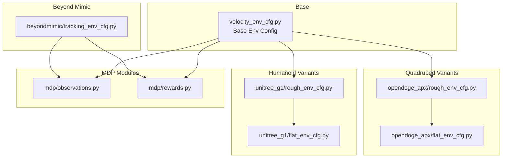
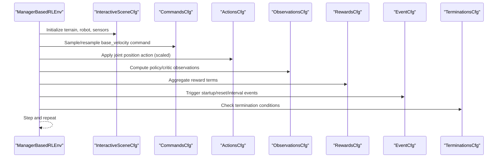
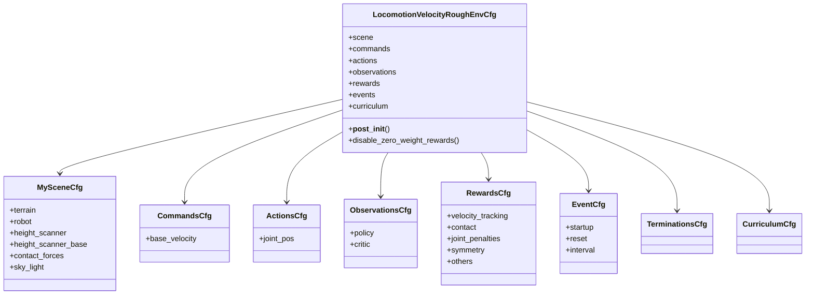
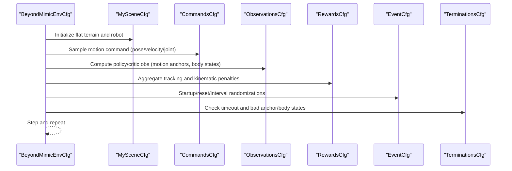
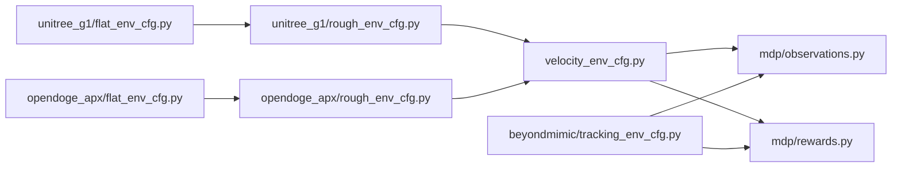

# Task Configuration Framework

<cite>
**Referenced Files in This Document**
- [velocity_env_cfg.py](file://source/robot_lab/robot_lab/tasks/manager_based/locomotion/velocity/velocity_env_cfg.py)
- [unitree_g1/rough_env_cfg.py](file://source/robot_lab/robot_lab/tasks/manager_based/locomotion/velocity/config/humanoid/unitree_g1/rough_env_cfg.py)
- [unitree_g1/flat_env_cfg.py](file://source/robot_lab/robot_lab/tasks/manager_based/locomotion/velocity/config/humanoid/unitree_g1/flat_env_cfg.py)
- [opendoge_apx/rough_env_cfg.py](file://source/robot_lab/robot_lab/tasks/manager_based/locomotion/velocity/config/quadruped/opendoge_apx/rough_env_cfg.py)
- [opendoge_apx/flat_env_cfg.py](file://source/robot_lab/robot_lab/tasks/manager_based/locomotion/velocity/config/quadruped/opendoge_apx/flat_env_cfg.py)
- [rewards.py](file://source/robot_lab/robot_lab/tasks/manager_based/locomotion/velocity/mdp/rewards.py)
- [observations.py](file://source/robot_lab/robot_lab/tasks/manager_based/locomotion/velocity/mdp/observations.py)
- [tracking_env_cfg.py](file://source/robot_lab/robot_lab/tasks/manager_based/beyondmimic/tracking_env_cfg.py)
</cite>

## Table of Contents
1. [Introduction](#introduction)
2. [Project Structure](#project-structure)
3. [Core Components](#core-components)
4. [Architecture Overview](#architecture-overview)
5. [Detailed Component Analysis](#detailed-component-analysis)
6. [Dependency Analysis](#dependency-analysis)
7. [Performance Considerations](#performance-considerations)
8. [Troubleshooting Guide](#troubleshooting-guide)
9. [Conclusion](#conclusion)
10. [Appendices](#appendices)

## Introduction
This document explains the task configuration framework for the ManagerBasedRLEnv-based locomotion system and MDP component integration. It focuses on velocity-based locomotion tasks over both flat and rough terrains, detailing the configuration hierarchy, MDP formulation (state/action/reward/termination), and practical examples from the codebase. It also covers curriculum learning, symmetry data augmentation, beyond mimic motion imitation, customization/extensibility, and guidelines for adapting tasks to different robot types and training scenarios.

## Project Structure
The task configuration is organized around a base environment configuration that defines scenes, commands, actions, observations, rewards, events, and terminations. Robot-specific variants inherit from the base and override scene assets, observation scaling, action scales, reward weights, and curriculum settings. MDP components encapsulate reusable functions for observations, rewards, events, and utilities.

**Diagram sources**
- [velocity_env_cfg.py](file://source/robot_lab/robot_lab/tasks/manager_based/locomotion/velocity/velocity_env_cfg.py#L696-L744)
- [unitree_g1/rough_env_cfg.py](file://source/robot_lab/robot_lab/tasks/manager_based/locomotion/velocity/config/humanoid/unitree_g1/rough_env_cfg.py#L15-L168)
- [unitree_g1/flat_env_cfg.py](file://source/robot_lab/robot_lab/tasks/manager_based/locomotion/velocity/config/humanoid/unitree_g1/flat_env_cfg.py#L9-L38)
- [opendoge_apx/rough_env_cfg.py](file://source/robot_lab/robot_lab/tasks/manager_based/locomotion/velocity/config/quadruped/opendoge_apx/rough_env_cfg.py#L14-L187)
- [opendoge_apx/flat_env_cfg.py](file://source/robot_lab/robot_lab/tasks/manager_based/locomotion/velocity/config/quadruped/opendoge_apx/flat_env_cfg.py#L9-L30)
- [rewards.py](file://source/robot_lab/robot_lab/tasks/manager_based/locomotion/velocity/mdp/rewards.py#L1-L681)
- [observations.py](file://source/robot_lab/robot_lab/tasks/manager_based/locomotion/velocity/mdp/observations.py#L1-L35)
- [tracking_env_cfg.py](file://source/robot_lab/robot_lab/tasks/manager_based/beyondmimic/tracking_env_cfg.py#L1-L333)

**Section sources**
- [velocity_env_cfg.py](file://source/robot_lab/robot_lab/tasks/manager_based/locomotion/velocity/velocity_env_cfg.py#L696-L744)
- [unitree_g1/rough_env_cfg.py](file://source/robot_lab/robot_lab/tasks/manager_based/locomotion/velocity/config/humanoid/unitree_g1/rough_env_cfg.py#L15-L168)
- [opendoge_apx/rough_env_cfg.py](file://source/robot_lab/robot_lab/tasks/manager_based/locomotion/velocity/config/quadruped/opendoge_apx/rough_env_cfg.py#L14-L187)

## Core Components
- Base environment configuration defines the ManagerBasedRLEnv base class, scene, commands, actions, observations, rewards, events, and curriculum.
- Robot-specific configurations inherit from the base and specialize assets, observation scaling, action scales, reward weights, and curriculum.
- MDP modules provide reusable functions for observations, rewards, events, and utilities.

Key responsibilities:
- Scene: terrain, robot asset, sensors (height scanner, contact forces), lighting.
- Commands: velocity commands with configurable ranges and resampling behavior.
- Actions: joint position actuation with scaling and clipping.
- Observations: policy and critic groups with noise, clipping, and concatenation.
- Rewards: velocity tracking, contact dynamics, joint penalties, symmetry terms, and termination-related penalties.
- Events: randomized material/mass/COM/gains, resets, and periodic perturbations.
- Termination: timeout, terrain bounds, illegal contacts.
- Curriculum: terrain levels and command level progression.

**Section sources**
- [velocity_env_cfg.py](file://source/robot_lab/robot_lab/tasks/manager_based/locomotion/velocity/velocity_env_cfg.py#L42-L744)
- [rewards.py](file://source/robot_lab/robot_lab/tasks/manager_based/locomotion/velocity/mdp/rewards.py#L1-L681)
- [observations.py](file://source/robot_lab/robot_lab/tasks/manager_based/locomotion/velocity/mdp/observations.py#L1-L35)

## Architecture Overview
The ManagerBasedRLEnv orchestrates the MDP pipeline:
- Scene initializes terrain, robot, sensors, and lighting.
- Command manager generates per-step velocity targets.
- Action manager applies joint position commands scaled per-robot.
- Observation manager computes policy/critic tensors from sensors and asset data.
- Reward manager aggregates per-term rewards and penalties.
- Event manager triggers randomized perturbations during startup/reset/interval.
- Termination manager checks episode-ending conditions.
- Curriculum adjusts difficulty dynamically.

**Diagram sources**
- [velocity_env_cfg.py](file://source/robot_lab/robot_lab/tasks/manager_based/locomotion/velocity/velocity_env_cfg.py#L696-L744)
- [unitree_g1/rough_env_cfg.py](file://source/robot_lab/robot_lab/tasks/manager_based/locomotion/velocity/config/humanoid/unitree_g1/rough_env_cfg.py#L15-L168)
- [opendoge_apx/rough_env_cfg.py](file://source/robot_lab/robot_lab/tasks/manager_based/locomotion/velocity/config/quadruped/opendoge_apx/rough_env_cfg.py#L14-L187)

## Detailed Component Analysis

### Base Velocity Environment Configuration
The base configuration defines:
- Scene: terrain importer, robot asset placeholder, ray-casters for height sensing, contact sensor, and lighting.
- Commands: velocity command with configurable ranges and heading control.
- Actions: joint position action with per-joint scaling and clipping.
- Observations: policy and critic groups with base velocities, gravity projection, commands, joint positions/velocities, last action, and height scans.
- Rewards: extensive set covering root penalties, joint torques/velocities/accelerations, action rate, contact dynamics, velocity tracking, and foot-related rewards.
- Events: randomized material/mass/COM/gains, reset conditions, and periodic pushes.
- Termination: timeout and terrain bounds.
- Curriculum: terrain levels and command level progression.

**Diagram sources**
- [velocity_env_cfg.py](file://source/robot_lab/robot_lab/tasks/manager_based/locomotion/velocity/velocity_env_cfg.py#L42-L744)

**Section sources**
- [velocity_env_cfg.py](file://source/robot_lab/robot_lab/tasks/manager_based/locomotion/velocity/velocity_env_cfg.py#L42-L744)

### Humanoid Variant: Unitree G1
The Unitree G1 variant specializes:
- Robot asset and link names for base and feet.
- Observation scaling adjustments and removal of certain observations.
- Action scaling tailored to the robot’s degrees-of-freedom.
- Reward emphasis on velocity tracking in the body frame, joint deviation penalties, and upward orientation reward.
- Termination tuned to base-link illegal contacts.
- Curriculum disabled for command levels.

**Diagram sources**
- [unitree_g1/rough_env_cfg.py](file://source/robot_lab/robot_lab/tasks/manager_based/locomotion/velocity/config/humanoid/unitree_g1/rough_env_cfg.py#L47-L168)

**Section sources**
- [unitree_g1/rough_env_cfg.py](file://source/robot_lab/robot_lab/tasks/manager_based/locomotion/velocity/config/humanoid/unitree_g1/rough_env_cfg.py#L15-L168)
- [unitree_g1/flat_env_cfg.py](file://source/robot_lab/robot_lab/tasks/manager_based/locomotion/velocity/config/humanoid/unitree_g1/flat_env_cfg.py#L9-L38)

### Quadruped Variant: Opendoge APX
The Opendoge APX variant specializes:
- Robot asset and joint naming for four legs.
- Observation scaling and explicit joint lists.
- Action scaling split by hip vs non-hip joints.
- Reduced external force torque and COM randomness for stability.
- Emphasis on joint acceleration, joint limits, action rate, contact forces, air-time variance, diagonal gait reward, and upward orientation.
- Disabled illegal contact termination.

**Diagram sources**
- [opendoge_apx/rough_env_cfg.py](file://source/robot_lab/robot_lab/tasks/manager_based/locomotion/velocity/config/quadruped/opendoge_apx/rough_env_cfg.py#L27-L187)

**Section sources**
- [opendoge_apx/rough_env_cfg.py](file://source/robot_lab/robot_lab/tasks/manager_based/locomotion/velocity/config/quadruped/opendoge_apx/rough_env_cfg.py#L14-L187)
- [opendoge_apx/flat_env_cfg.py](file://source/robot_lab/robot_lab/tasks/manager_based/locomotion/velocity/config/quadruped/opendoge_apx/flat_env_cfg.py#L9-L30)

### Beyond Mimic Motion Imitation
Beyond mimic extends the ManagerBasedRLEnv framework to motion imitation:
- Scene: flat terrain, robot asset, contact sensor.
- Commands: motion command with pose/velocity/joint-position ranges.
- Observations: policy/critic groups augmented with motion anchors and body states.
- Rewards: global and relative body position/orientation/velocity errors, joint accelerations, torques, action rate, and undesired contacts.
- Events: randomized material, joint defaults, and periodic pushes.
- Termination: timeout, anchor position/orientation thresholds, and end-effector/body position checks.

**Diagram sources**
- [tracking_env_cfg.py](file://source/robot_lab/robot_lab/tasks/manager_based/beyondmimic/tracking_env_cfg.py#L43-L333)

**Section sources**
- [tracking_env_cfg.py](file://source/robot_lab/robot_lab/tasks/manager_based/beyondmimic/tracking_env_cfg.py#L1-L333)

## Dependency Analysis
- Base environment depends on MDP modules for observations and rewards.
- Robot-specific variants depend on the base configuration and override only necessary fields.
- Beyond mimic depends on MDP modules and introduces motion-specific commands and rewards.

**Diagram sources**
- [velocity_env_cfg.py](file://source/robot_lab/robot_lab/tasks/manager_based/locomotion/velocity/velocity_env_cfg.py#L12-L29)
- [unitree_g1/rough_env_cfg.py](file://source/robot_lab/robot_lab/tasks/manager_based/locomotion/velocity/config/humanoid/unitree_g1/rough_env_cfg.py#L4-L7)
- [opendoge_apx/rough_env_cfg.py](file://source/robot_lab/robot_lab/tasks/manager_based/locomotion/velocity/config/quadruped/opendoge_apx/rough_env_cfg.py#L6-L11)
- [tracking_env_cfg.py](file://source/robot_lab/robot_lab/tasks/manager_based/beyondmimic/tracking_env_cfg.py#L8-L27)

**Section sources**
- [velocity_env_cfg.py](file://source/robot_lab/robot_lab/tasks/manager_based/locomotion/velocity/velocity_env_cfg.py#L12-L29)
- [unitree_g1/rough_env_cfg.py](file://source/robot_lab/robot_lab/tasks/manager_based/locomotion/velocity/config/humanoid/unitree_g1/rough_env_cfg.py#L4-L7)
- [opendoge_apx/rough_env_cfg.py](file://source/robot_lab/robot_lab/tasks/manager_based/locomotion/velocity/config/quadruped/opendoge_apx/rough_env_cfg.py#L6-L11)
- [tracking_env_cfg.py](file://source/robot_lab/robot_lab/tasks/manager_based/beyondmimic/tracking_env_cfg.py#L8-L27)

## Performance Considerations
- Simulation decimation and step size are configured centrally in the base environment to balance fidelity and throughput.
- Sensor update periods are aligned to simulation and decimation for efficient computation.
- Zero-weight rewards are disabled to reduce computational overhead.
- Curriculum toggles terrain generator settings to manage difficulty ramp-up efficiently.

Practical tips:
- Tune decimation and dt for target FPS while preserving control bandwidth.
- Disable unused observations and sensors in flat environments to reduce memory bandwidth.
- Use curriculum to gradually increase command ranges and terrain complexity.

**Section sources**
- [velocity_env_cfg.py](file://source/robot_lab/robot_lab/tasks/manager_based/locomotion/velocity/velocity_env_cfg.py#L711-L744)
- [unitree_g1/flat_env_cfg.py](file://source/robot_lab/robot_lab/tasks/manager_based/locomotion/velocity/config/humanoid/unitree_g1/flat_env_cfg.py#L11-L38)
- [opendoge_apx/flat_env_cfg.py](file://source/robot_lab/robot_lab/tasks/manager_based/locomotion/velocity/config/quadruped/opendoge_apx/flat_env_cfg.py#L11-L30)

## Troubleshooting Guide
Common issues and resolutions:
- Excessive joint torques/accelerations: Reduce action scales and increase joint acceleration penalties in the robot-specific configuration.
- Instability on rough terrain: Increase base height and upward orientation rewards; reduce push intervals and magnitudes; tune actuator gain randomness.
- Poor velocity tracking: Adjust velocity-tracking reward standard deviations and frame selection (world vs body).
- Sensor NaN/infs: The base reward module includes fallbacks for raycast height readings; verify sensor placement and update periods.
- Illegal contacts causing early termination: Adjust undesired contacts thresholds or disable termination depending on task.

**Section sources**
- [rewards.py](file://source/robot_lab/robot_lab/tasks/manager_based/locomotion/velocity/mdp/rewards.py#L609-L637)
- [opendoge_apx/rough_env_cfg.py](file://source/robot_lab/robot_lab/tasks/manager_based/locomotion/velocity/config/quadruped/opendoge_apx/rough_env_cfg.py#L89-L100)
- [unitree_g1/rough_env_cfg.py](file://source/robot_lab/robot_lab/tasks/manager_based/locomotion/velocity/config/humanoid/unitree_g1/rough_env_cfg.py#L123-L133)

## Conclusion
The task configuration framework provides a modular, extensible foundation for velocity-based locomotion across diverse robot types and terrains. By inheriting from a shared base configuration and overriding targeted fields, developers can rapidly adapt tasks for new robots, stabilize training with curriculum and symmetry terms, and integrate advanced capabilities such as beyond mimic motion imitation. The MDP modules encapsulate reusable components that simplify customization and ensure consistent behavior across variants.

## Appendices

### MDP Formulation Summary
- State representation:
  - Policy group: base linear/angular velocities, projected gravity, commanded base velocity, joint positions/velocities, last action, height scan.
  - Critic group: similar to policy but without corruption and with optional additional terms.
- Action space: joint position commands with per-joint scaling and clipping.
- Reward function: composite of velocity tracking, contact dynamics, joint penalties, symmetry terms, and task-specific shaping.
- Termination conditions: timeout, terrain bounds, and illegal contacts.

Examples from the codebase:
- Velocity tracking rewards in world/body frames with exponential kernels.
- Quadruped gait reward enforcing synchronized and anti-synchronized foot contacts.
- Symmetry terms encouraging mirrored joint positions/actions and synchronized joint groups.
- Base height and upward orientation rewards to maintain stability.

**Section sources**
- [velocity_env_cfg.py](file://source/robot_lab/robot_lab/tasks/manager_based/locomotion/velocity/velocity_env_cfg.py#L130-L255)
- [rewards.py](file://source/robot_lab/robot_lab/tasks/manager_based/locomotion/velocity/mdp/rewards.py#L22-L75)
- [rewards.py](file://source/robot_lab/robot_lab/tasks/manager_based/locomotion/velocity/mdp/rewards.py#L153-L253)
- [rewards.py](file://source/robot_lab/robot_lab/tasks/manager_based/locomotion/velocity/mdp/rewards.py#L255-L333)

### Advanced Features
- Curriculum learning:
  - Terrain levels curriculum toggles the terrain generator’s difficulty ramp.
  - Command-level curricula adjust the ranges of velocity commands based on reward progress.
- Symmetry data augmentation:
  - Joint mirroring and action mirroring encourage symmetric motion.
  - Action synchronization reduces variance across joint groups.
- Beyond mimic motion imitation:
  - Motion commands define pose/velocity/joint targets.
  - Tracking rewards align robot body states with motion anchors.

**Section sources**
- [velocity_env_cfg.py](file://source/robot_lab/robot_lab/tasks/manager_based/locomotion/velocity/velocity_env_cfg.py#L668-L688)
- [rewards.py](file://source/robot_lab/robot_lab/tasks/manager_based/locomotion/velocity/mdp/rewards.py#L255-L333)
- [tracking_env_cfg.py](file://source/robot_lab/robot_lab/tasks/manager_based/beyondmimic/tracking_env_cfg.py#L84-L261)

### Task Customization and Extension Guidelines
- New robot type:
  - Create a new variant under the appropriate category (humanoid/quadruped/wheeled) inheriting from the base configuration.
  - Override scene robot asset, sensor prim paths, joint names, action scales, and reward weights.
  - Adjust curriculum and termination settings to match the robot’s dynamics.
- New locomotion skill:
  - Define a new command type and corresponding reward terms in the MDP.
  - Introduce new observations (e.g., phase estimation) and incorporate them into policy/critic groups.
  - Add event-driven perturbations or curriculum terms to guide skill acquisition.
- Training scenario adaptation:
  - Flat vs rough: toggle terrain generator, height scanner, and base height reward.
  - Stability vs agility: adjust contact force penalties, action rate, and symmetry terms.
  - Multi-modal tasks: combine velocity commands with motion commands and cross-train reward terms.

**Section sources**
- [velocity_env_cfg.py](file://source/robot_lab/robot_lab/tasks/manager_based/locomotion/velocity/velocity_env_cfg.py#L696-L744)
- [unitree_g1/rough_env_cfg.py](file://source/robot_lab/robot_lab/tasks/manager_based/locomotion/velocity/config/humanoid/unitree_g1/rough_env_cfg.py#L47-L168)
- [opendoge_apx/rough_env_cfg.py](file://source/robot_lab/robot_lab/tasks/manager_based/locomotion/velocity/config/quadruped/opendoge_apx/rough_env_cfg.py#L27-L187)
- [tracking_env_cfg.py](file://source/robot_lab/robot_lab/tasks/manager_based/beyondmimic/tracking_env_cfg.py#L303-L333)