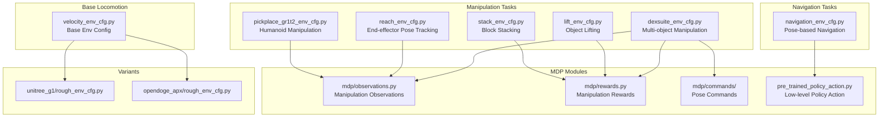
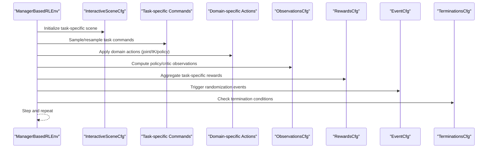
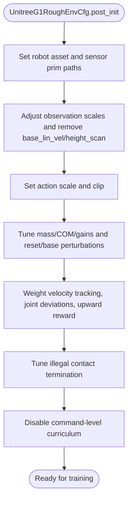
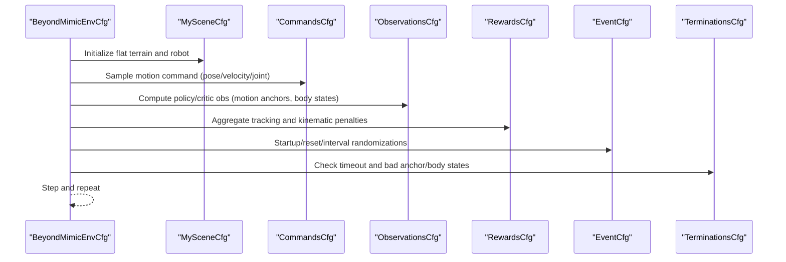
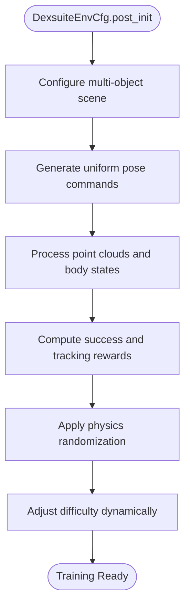
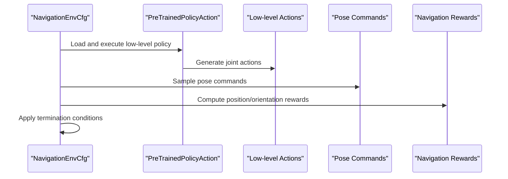
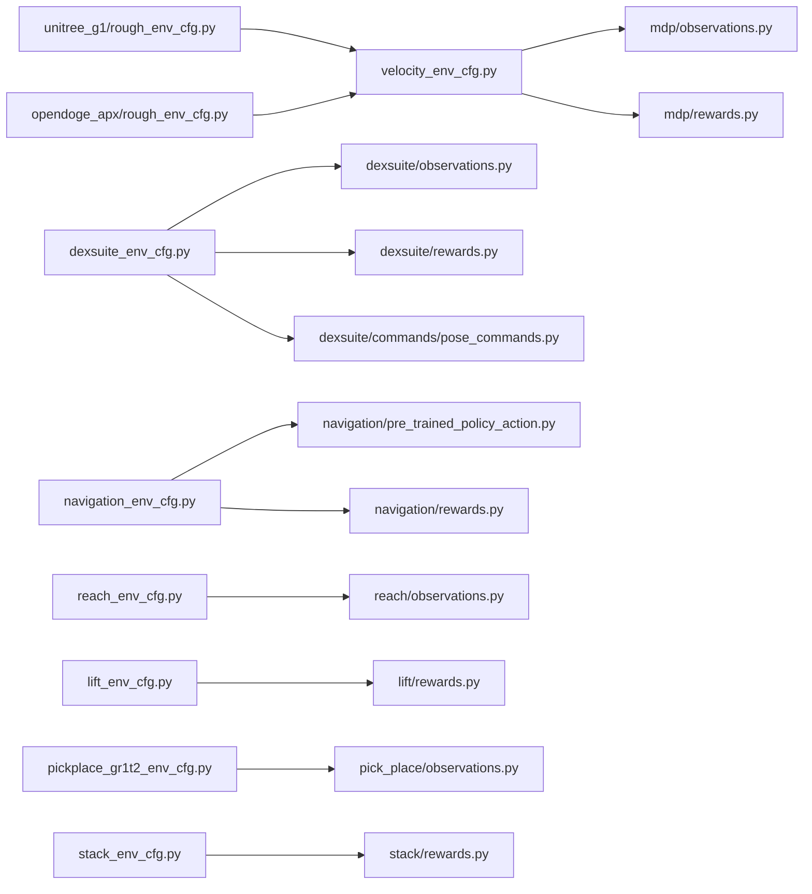

# Task Configuration Framework

<cite>
**Referenced Files in This Document**
- [velocity_env_cfg.py](file://source/robot_lab/robot_lab/tasks/manager_based/locomotion/velocity/velocity_env_cfg.py)
- [unitree_g1/rough_env_cfg.py](file://source/robot_lab/robot_lab/tasks/manager_based/locomotion/velocity/config/humanoid/unitree_g1/rough_env_cfg.py)
- [unitree_g1/flat_env_cfg.py](file://source/robot_lab/robot_lab/tasks/manager_based/locomotion/velocity/config/humanoid/unitree_g1/flat_env_cfg.py)
- [opendoge_apx/rough_env_cfg.py](file://source/robot_lab/robot_lab/tasks/manager_based/locomotion/velocity/config/quadruped/opendoge_apx/rough_env_cfg.py)
- [opendoge_apx/flat_env_cfg.py](file://source/robot_lab/robot_lab/tasks/manager_based/locomotion/velocity/config/quadruped/opendoge_apx/flat_env_cfg.py)
- [rewards.py](file://source/robot_lab/robot_lab/tasks/manager_based/locomotion/velocity/mdp/rewards.py)
- [observations.py](file://source/robot_lab/robot_lab/tasks/manager_based/locomotion/velocity/mdp/observations.py)
- [tracking_env_cfg.py](file://source/robot_lab/robot_lab/tasks/manager_based/beyondmimic/tracking_env_cfg.py)
- [dexsuite_env_cfg.py](file://source/robot_lab/robot_lab/tasks/manager_based/manipulation/dexsuite/dexsuite_env_cfg.py)
- [navigation_env_cfg.py](file://source/robot_lab/robot_lab/tasks/manager_based/navigation/config/anymal_c/navigation_env_cfg.py)
- [pose_commands.py](file://source/robot_lab/robot_lab/tasks/manager_based/manipulation/dexsuite/mdp/commands/pose_commands.py)
- [observations.py](file://source/robot_lab/robot_lab/tasks/manager_based/manipulation/dexsuite/mdp/observations.py)
- [rewards.py](file://source/robot_lab/robot_lab/tasks/manager_based/manipulation/dexsuite/mdp/rewards.py)
- [reach_env_cfg.py](file://source/robot_lab/robot_lab/tasks/manager_based/manipulation/reach/reach_env_cfg.py)
- [lift_env_cfg.py](file://source/robot_lab/robot_lab/tasks/manager_based/manipulation/lift/lift_env_cfg.py)
- [pickplace_gr1t2_env_cfg.py](file://source/robot_lab/robot_lab/tasks/manager_based/manipulation/pick_place/pickplace_gr1t2_env_cfg.py)
- [stack_env_cfg.py](file://source/robot_lab/robot_lab/tasks/manager_based/manipulation/stack/stack_env_cfg.py)
- [pre_trained_policy_action.py](file://source/robot_lab/robot_lab/tasks/manager_based/navigation/mdp/pre_trained_policy_action.py)
- [rewards.py](file://source/robot_lab/robot_lab/tasks/manager_based/navigation/mdp/rewards.py)
</cite>

## Update Summary
**Changes Made**
- Added comprehensive documentation for new manipulation task categories including DexSuite, reach, lift, pick-place, and stack tasks
- Integrated navigation task documentation with pre-trained policy action framework
- Expanded MDP formulation coverage to include manipulation-specific reward engineering and observation preprocessing
- Enhanced task configuration hierarchy documentation to reflect the new 160+ files across multiple task categories
- Added advanced manipulation features including point cloud processing, contact force monitoring, and curriculum learning implementations

## Table of Contents
1. [Introduction](#introduction)
2. [Project Structure](#project-structure)
3. [Core Components](#core-components)
4. [Architecture Overview](#architecture-overview)
5. [Detailed Component Analysis](#detailed-component-analysis)
6. [Dependency Analysis](#dependency-analysis)
7. [Performance Considerations](#performance-considerations)
8. [Troubleshooting Guide](#troubleshooting-guide)
9. [Conclusion](#conclusion)
10. [Appendices](#appendices)

## Introduction
This document explains the task configuration framework for the ManagerBasedRLEnv-based locomotion, manipulation, and navigation systems with advanced MDP implementations. The framework now encompasses over 160 new files across multiple task categories including velocity-based locomotion, manipulation (DexSuite, reach, lift, pick-place, stack), and navigation capabilities. It focuses on comprehensive task configuration hierarchies, MDP formulation (state/action/reward/termination), and practical examples from the codebase. The framework supports curriculum learning, symmetry data augmentation, beyond mimic motion imitation, and advanced manipulation features like point cloud processing and contact force monitoring.

## Project Structure
The task configuration is organized around a base environment configuration that defines scenes, commands, actions, observations, rewards, events, and terminations. The framework now includes specialized categories for locomotion, manipulation, and navigation, each with their own configuration hierarchies and MDP components. Robot-specific variants inherit from base configurations and override scene assets, observation scaling, action scales, reward weights, and curriculum settings.

**Diagram sources**
- [velocity_env_cfg.py:696-744](file://source/robot_lab/robot_lab/tasks/manager_based/locomotion/velocity/velocity_env_cfg.py#L696-L744)
- [dexsuite_env_cfg.py:390-467](file://source/robot_lab/robot_lab/tasks/manager_based/manipulation/dexsuite/dexsuite_env_cfg.py#L390-L467)
- [navigation_env_cfg.py:122-161](file://source/robot_lab/robot_lab/tasks/manager_based/navigation/config/anymal_c/navigation_env_cfg.py#L122-L161)
- [reach_env_cfg.py:189-230](file://source/robot_lab/robot_lab/tasks/manager_based/manipulation/reach/reach_env_cfg.py#L189-L230)
- [lift_env_cfg.py:194-223](file://source/robot_lab/robot_lab/tasks/manager_based/manipulation/lift/lift_env_cfg.py#L194-L223)
- [pickplace_gr1t2_env_cfg.py:298-416](file://source/robot_lab/robot_lab/tasks/manager_based/manipulation/pick_place/pickplace_gr1t2_env_cfg.py#L298-L416)
- [stack_env_cfg.py:164-200](file://source/robot_lab/robot_lab/tasks/manager_based/manipulation/stack/stack_env_cfg.py#L164-L200)

**Section sources**
- [velocity_env_cfg.py:696-744](file://source/robot_lab/robot_lab/tasks/manager_based/locomotion/velocity/velocity_env_cfg.py#L696-L744)
- [dexsuite_env_cfg.py:390-467](file://source/robot_lab/robot_lab/tasks/manager_based/manipulation/dexsuite/dexsuite_env_cfg.py#L390-L467)
- [navigation_env_cfg.py:122-161](file://source/robot_lab/robot_lab/tasks/manager_based/navigation/config/anymal_c/navigation_env_cfg.py#L122-L161)

## Core Components
The framework now encompasses three major task categories:

### Locomotion Components
- Base environment configuration defines the ManagerBasedRLEnv base class, scene, commands, actions, observations, rewards, events, and curriculum.
- Robot-specific configurations inherit from the base and specialize assets, observation scaling, action scales, reward weights, and curriculum.
- MDP modules provide reusable functions for observations, rewards, events, and utilities.

### Manipulation Components
- **DexSuite**: Multi-object manipulation with pose tracking, object point cloud processing, and contact force monitoring.
- **Reach**: End-effector pose tracking with curriculum learning and action regularization.
- **Lift**: Object lifting tasks with minimal height constraints and success detection.
- **Pick-place**: Humanoid manipulation with inverse kinematics and XR retargeting support.
- **Stack**: Block stacking with multi-cube observation and success criteria.

### Navigation Components
- **Pose-based Navigation**: Low-level policy integration with pre-trained policy action framework.
- **Command Management**: Uniform 2D pose commands with resampling and visualization.
- **Reward Engineering**: Position and orientation tracking with termination conditions.

**Section sources**
- [velocity_env_cfg.py:42-744](file://source/robot_lab/robot_lab/tasks/manager_based/locomotion/velocity/velocity_env_cfg.py#L42-L744)
- [dexsuite_env_cfg.py:27-467](file://source/robot_lab/robot_lab/tasks/manager_based/manipulation/dexsuite/dexsuite_env_cfg.py#L27-L467)
- [navigation_env_cfg.py:24-161](file://source/robot_lab/robot_lab/tasks/manager_based/navigation/config/anymal_c/navigation_env_cfg.py#L24-L161)

## Architecture Overview
The ManagerBasedRLEnv orchestrates the MDP pipeline across all task categories:
- Scene initializes terrain/robot/assets, sensors, and lighting for each task domain.
- Command manager generates per-step targets specific to the task (velocity, pose, object pose).
- Action manager applies domain-specific actions (joint positions, inverse kinematics, pre-trained policies).
- Observation manager computes policy/critic tensors from sensors and asset data.
- Reward manager aggregates per-term rewards and penalties specific to each task category.
- Event manager triggers randomized perturbations during startup/reset/interval.
- Termination manager checks episode-ending conditions for each task domain.
- Curriculum adjusts difficulty dynamically for manipulation tasks.

**Diagram sources**
- [dexsuite_env_cfg.py:390-467](file://source/robot_lab/robot_lab/tasks/manager_based/manipulation/dexsuite/dexsuite_env_cfg.py#L390-L467)
- [navigation_env_cfg.py:122-161](file://source/robot_lab/robot_lab/tasks/manager_based/navigation/config/anymal_c/navigation_env_cfg.py#L122-L161)
- [reach_env_cfg.py:189-230](file://source/robot_lab/robot_lab/tasks/manager_based/manipulation/reach/reach_env_cfg.py#L189-L230)

## Detailed Component Analysis

### Base Velocity Environment Configuration
The base configuration defines:
- Scene: terrain importer, robot asset placeholder, ray-casters for height sensing, contact sensor, and lighting.
- Commands: velocity command with configurable ranges and heading control.
- Actions: joint position action with per-joint scaling and clipping.
- Observations: policy and critic groups with base velocities, gravity projection, commands, joint positions/velocities, last action, and height scans.
- Rewards: extensive set covering root penalties, joint torques/velocities/accelerations, action rate, contact dynamics, velocity tracking, and foot-related rewards.
- Events: randomized material/mass/COM/gains, reset conditions, and periodic pushes.
- Termination: timeout and terrain bounds.
- Curriculum: terrain levels and command level progression.

**Diagram sources**
- [velocity_env_cfg.py:42-744](file://source/robot_lab/robot_lab/tasks/manager_based/locomotion/velocity/velocity_env_cfg.py#L42-L744)

**Section sources**
- [velocity_env_cfg.py:42-744](file://source/robot_lab/robot_lab/tasks/manager_based/locomotion/velocity/velocity_env_cfg.py#L42-L744)

### Humanoid Variant: Unitree G1
The Unitree G1 variant specializes:
- Robot asset and link names for base and feet.
- Observation scaling adjustments and removal of certain observations.
- Action scaling tailored to the robot's degrees-of-freedom.
- Reward emphasis on velocity tracking in the body frame, joint deviation penalties, and upward orientation reward.
- Termination tuned to base-link illegal contacts.
- Curriculum disabled for command levels.

**Diagram sources**
- [unitree_g1/rough_env_cfg.py:47-168](file://source/robot_lab/robot_lab/tasks/manager_based/locomotion/velocity/config/humanoid/unitree_g1/rough_env_cfg.py#L47-L168)

**Section sources**
- [unitree_g1/rough_env_cfg.py:15-168](file://source/robot_lab/robot_lab/tasks/manager_based/locomotion/velocity/config/humanoid/unitree_g1/rough_env_cfg.py#L15-L168)
- [unitree_g1/flat_env_cfg.py:9-38](file://source/robot_lab/robot_lab/tasks/manager_based/locomotion/velocity/config/humanoid/unitree_g1/flat_env_cfg.py#L9-L38)

### Quadruped Variant: Opendoge APX
The Opendoge APX variant specializes:
- Robot asset and joint naming for four legs.
- Observation scaling and explicit joint lists.
- Action scaling split by hip vs non-hip joints.
- Reduced external force torque and COM randomness for stability.
- Emphasis on joint acceleration, joint limits, action rate, contact forces, air-time variance, diagonal gait reward, and upward orientation.
- Disabled illegal contact termination.

**Diagram sources**
- [opendoge_apx/rough_env_cfg.py:27-187](file://source/robot_lab/robot_lab/tasks/manager_based/locomotion/velocity/config/quadruped/opendoge_apx/rough_env_cfg.py#L27-L187)

**Section sources**
- [opendoge_apx/rough_env_cfg.py:14-187](file://source/robot_lab/robot_lab/tasks/manager_based/locomotion/velocity/config/quadruped/opendoge_apx/rough_env_cfg.py#L14-L187)
- [opendoge_apx/flat_env_cfg.py:9-30](file://source/robot_lab/robot_lab/tasks/manager_based/locomotion/velocity/config/quadruped/opendoge_apx/flat_env_cfg.py#L9-L30)

### Beyond Mimic Motion Imitation
Beyond mimic extends the ManagerBasedRLEnv framework to motion imitation:
- Scene: flat terrain, robot asset, contact sensor.
- Commands: motion command with pose/velocity/joint-position ranges.
- Observations: policy/critic groups augmented with motion anchors and body states.
- Rewards: global and relative body position/orientation/velocity errors, joint accelerations, torques, action rate, and undesired contacts.
- Events: randomized material, joint defaults, and periodic pushes.
- Termination: timeout, anchor position/orientation thresholds, and end-effector/body position checks.

**Diagram sources**
- [tracking_env_cfg.py:43-333](file://source/robot_lab/robot_lab/tasks/manager_based/beyondmimic/tracking_env_cfg.py#L43-L333)

**Section sources**
- [tracking_env_cfg.py:1-333](file://source/robot_lab/robot_lab/tasks/manager_based/beyondmimic/tracking_env_cfg.py#L1-L333)

### DexSuite Multi-Object Manipulation
DexSuite provides comprehensive multi-object manipulation capabilities:
- **Scene Configuration**: Multiple object types (cuboids, spheres, capsules, cones) with varied sizes and masses.
- **Command System**: Uniform pose command generation for object manipulation with quaternion sampling.
- **Observation Processing**: Point cloud sampling, body state transformations, and contact force monitoring.
- **Reward Engineering**: Success detection, position/orientation tracking, and action regularization.
- **Event Randomization**: Physics material variations, joint parameter randomization, and gravity curriculum.

**Diagram sources**
- [dexsuite_env_cfg.py:390-467](file://source/robot_lab/robot_lab/tasks/manager_based/manipulation/dexsuite/dexsuite_env_cfg.py#L390-L467)

**Section sources**
- [dexsuite_env_cfg.py:27-467](file://source/robot_lab/robot_lab/tasks/manager_based/manipulation/dexsuite/dexsuite_env_cfg.py#L27-L467)
- [pose_commands.py:26-180](file://source/robot_lab/robot_lab/tasks/manager_based/manipulation/dexsuite/mdp/commands/pose_commands.py#L26-L180)
- [observations.py:99-198](file://source/robot_lab/robot_lab/tasks/manager_based/manipulation/dexsuite/mdp/observations.py#L99-L198)
- [rewards.py:31-127](file://source/robot_lab/robot_lab/tasks/manager_based/manipulation/dexsuite/mdp/rewards.py#L31-L127)

### Navigation with Pre-Trained Policy Action
Navigation integrates low-level policy execution:
- **Pre-Trained Policy Action**: Loads and executes low-level policies for base velocity control.
- **Command Management**: Uniform 2D pose commands with resampling and visualization.
- **Reward Engineering**: Position tracking with fine-grained and coarse-grained components.
- **Termination Handling**: Base contact detection and time-based termination.
- **Integration**: Seamless coordination between high-level navigation and low-level locomotion.

**Diagram sources**
- [navigation_env_cfg.py:122-161](file://source/robot_lab/robot_lab/tasks/manager_based/navigation/config/anymal_c/navigation_env_cfg.py#L122-L161)
- [pre_trained_policy_action.py:24-189](file://source/robot_lab/robot_lab/tasks/manager_based/navigation/mdp/pre_trained_policy_action.py#L24-L189)

**Section sources**
- [navigation_env_cfg.py:24-161](file://source/robot_lab/robot_lab/tasks/manager_based/navigation/config/anymal_c/navigation_env_cfg.py#L24-L161)
- [pre_trained_policy_action.py:24-189](file://source/robot_lab/robot_lab/tasks/manager_based/navigation/mdp/pre_trained_policy_action.py#L24-L189)
- [rewards.py:15-28](file://source/robot_lab/robot_lab/tasks/manager_based/navigation/mdp/rewards.py#L15-L28)

### Manipulation Task Variants

#### Reach Task Configuration
The reach task provides end-effector pose tracking with curriculum learning:
- **Scene Setup**: Table and robot configuration with SeattleLabTable assets.
- **Command Generation**: Uniform pose commands with Cartesian bounds.
- **Observation Processing**: Relative joint positions/velocities and command history.
- **Reward Engineering**: Position and orientation tracking with action regularization.
- **Curriculum System**: Progressive reward weighting for action and joint velocity penalties.

#### Lift Task Configuration
The lift task focuses on object manipulation with minimal height constraints:
- **Scene Configuration**: Object and table setup with end-effector frame transformation.
- **Command System**: Uniform pose commands for object positioning.
- **Observation Processing**: Object position in robot root frame and target tracking.
- **Reward Engineering**: Object reaching, lifting detection, and goal tracking with success thresholds.
- **Termination Conditions**: Time-based and object dropping detection.

#### Pick-Place Task Configuration
The pick-place task supports humanoid manipulation with XR integration:
- **Humanoid Robot**: Fourier GR1T2 configuration with high PD control.
- **Inverse Kinematics**: Pink IK controller with null space posture tasks.
- **Observation Processing**: Comprehensive robot and object state observations.
- **Termination Detection**: Success detection based on task completion criteria.
- **XR Support**: OpenXR device integration with retargeting support.

#### Stack Task Configuration
The stack task enables block manipulation with multi-cube observation:
- **Scene Setup**: Three cube objects with distinct properties.
- **Observation Processing**: Cube positions, orientations, and grasping states.
- **Termination Detection**: Individual cube dropping and overall stacking success.
- **XR Integration**: Spatial anchor configuration for immersive experiences.

**Section sources**
- [reach_env_cfg.py:69-230](file://source/robot_lab/robot_lab/tasks/manager_based/manipulation/reach/reach_env_cfg.py#L69-L230)
- [lift_env_cfg.py:71-223](file://source/robot_lab/robot_lab/tasks/manager_based/manipulation/lift/lift_env_cfg.py#L71-L223)
- [pickplace_gr1t2_env_cfg.py:115-416](file://source/robot_lab/robot_lab/tasks/manager_based/manipulation/pick_place/pickplace_gr1t2_env_cfg.py#L115-L416)
- [stack_env_cfg.py:64-200](file://source/robot_lab/robot_lab/tasks/manager_based/manipulation/stack/stack_env_cfg.py#L64-L200)

## Dependency Analysis
The framework maintains clear separation between task categories while enabling cross-domain integration:
- Base locomotion depends on MDP modules for observations and rewards.
- Manipulation tasks depend on specialized MDP modules for pose commands, observations, and rewards.
- Navigation tasks depend on pre-trained policy action framework and pose-based commands.
- Robot-specific variants depend on base configurations and override only necessary fields.
- Cross-domain dependencies enable hybrid tasks combining locomotion and manipulation.

**Diagram sources**
- [velocity_env_cfg.py:12-29](file://source/robot_lab/robot_lab/tasks/manager_based/locomotion/velocity/velocity_env_cfg.py#L12-L29)
- [dexsuite_env_cfg.py:23-24](file://source/robot_lab/robot_lab/tasks/manager_based/manipulation/dexsuite/dexsuite_env_cfg.py#L23-L24)
- [navigation_env_cfg.py:18-19](file://source/robot_lab/robot_lab/tasks/manager_based/navigation/config/anymal_c/navigation_env_cfg.py#L18-L19)

**Section sources**
- [velocity_env_cfg.py:12-29](file://source/robot_lab/robot_lab/tasks/manager_based/locomotion/velocity/velocity_env_cfg.py#L12-L29)
- [dexsuite_env_cfg.py:23-24](file://source/robot_lab/robot_lab/tasks/manager_based/manipulation/dexsuite/dexsuite_env_cfg.py#L23-L24)
- [navigation_env_cfg.py:18-19](file://source/robot_lab/robot_lab/tasks/manager_based/navigation/config/anymal_c/navigation_env_cfg.py#L18-L19)

## Performance Considerations
The framework implements several optimization strategies across task categories:
- **Simulation Decimation**: Centralized configuration for optimal performance across all domains.
- **Sensor Synchronization**: Aligned update periods for efficient computation in complex scenes.
- **Zero-Weight Optimization**: Disabled unused reward terms to reduce computational overhead.
- **Curriculum Efficiency**: Dynamic difficulty adjustment for manipulation tasks.
- **Point Cloud Optimization**: Efficient sampling and caching for DexSuite tasks.
- **Policy Execution**: Optimized pre-trained policy loading and inference for navigation tasks.

Practical tips:
- Tune decimation and dt for target FPS while preserving control bandwidth across all task domains.
- Disable unused observations and sensors in flat environments to reduce memory bandwidth.
- Use curriculum to gradually increase command ranges and task complexity.
- Optimize point cloud sampling parameters for manipulation tasks.
- Cache frequently accessed policy weights for navigation tasks.

**Section sources**
- [velocity_env_cfg.py:711-744](file://source/robot_lab/robot_lab/tasks/manager_based/locomotion/velocity/velocity_env_cfg.py#L711-L744)
- [dexsuite_env_cfg.py:425-434](file://source/robot_lab/robot_lab/tasks/manager_based/manipulation/dexsuite/dexsuite_env_cfg.py#L425-L434)
- [navigation_env_cfg.py:135-149](file://source/robot_lab/robot_lab/tasks/manager_based/navigation/config/anymal_c/navigation_env_cfg.py#L135-L149)

## Troubleshooting Guide
Common issues and resolutions across task categories:

### Locomotion Issues
- **Excessive joint torques/accelerations**: Reduce action scales and increase joint acceleration penalties in robot-specific configurations.
- **Instability on rough terrain**: Increase base height and upward orientation rewards; reduce push intervals and magnitudes.
- **Poor velocity tracking**: Adjust velocity-tracking reward standard deviations and frame selection.

### Manipulation Issues
- **Object manipulation failures**: Verify point cloud sampling parameters and contact sensor configurations.
- **Pose tracking drift**: Adjust command resampling rates and reward standard deviations.
- **Success detection problems**: Fine-tune success thresholds and visualization markers.
- **XR integration issues**: Check device configuration and retargeting parameters.

### Navigation Issues
- **Policy execution errors**: Verify policy file paths and compatibility with low-level actions.
- **Base contact false positives**: Adjust contact sensor thresholds and filtering parameters.
- **Command tracking errors**: Check pose command ranges and visualization settings.

**Section sources**
- [rewards.py:609-637](file://source/robot_lab/robot_lab/tasks/manager_based/locomotion/velocity/mdp/rewards.py#L609-L637)
- [dexsuite_env_cfg.py:357-370](file://source/robot_lab/robot_lab/tasks/manager_based/manipulation/dexsuite/dexsuite_env_cfg.py#L357-L370)
- [navigation_env_cfg.py:115-118](file://source/robot_lab/robot_lab/tasks/manager_based/navigation/config/anymal_c/navigation_env_cfg.py#L115-L118)

## Conclusion
The expanded task configuration framework provides a comprehensive, modular foundation for locomotion, manipulation, and navigation tasks across diverse robot types and scenarios. With over 160 new files integrated, the framework now supports advanced capabilities including multi-object manipulation, humanoid manipulation with XR integration, and navigation with pre-trained policy execution. The MDP modules encapsulate reusable components that simplify customization and ensure consistent behavior across all task categories. Developers can rapidly adapt tasks for new robots, stabilize training with curriculum and symmetry terms, and leverage advanced manipulation features like point cloud processing and contact force monitoring.

## Appendices

### MDP Formulation Summary
The framework encompasses three major task categories with distinct MDP formulations:

#### Locomotion MDP
- **State Representation**: Base linear/angular velocities, projected gravity, commanded base velocity, joint positions/velocities, last action, height scan.
- **Action Space**: Joint position commands with per-joint scaling and clipping.
- **Reward Function**: Composite of velocity tracking, contact dynamics, joint penalties, symmetry terms, and task-specific shaping.
- **Termination Conditions**: Timeout, terrain bounds, and illegal contacts.

#### Manipulation MDP
- **State Representation**: 
  - **DexSuite**: Object pose in robot frame, point cloud observations, body state transformations.
  - **Reach**: Relative joint positions/velocities, pose commands, action history.
  - **Lift**: Object position in robot root frame, target tracking, action regularization.
  - **Pick-place**: Comprehensive robot/object state observations, IK controller states.
  - **Stack**: Cube positions/orientations, grasping states, action history.
- **Action Space**: Domain-specific actions (joint positions, inverse kinematics, policy execution).
- **Reward Function**: Task-specific reward engineering with success detection and curriculum learning.
- **Termination Conditions**: Time-based, object dropping, and success detection.

#### Navigation MDP
- **State Representation**: Base linear velocity, projected gravity, pose commands.
- **Action Space**: Pre-trained policy action with low-level decimation.
- **Reward Function**: Position and orientation tracking with termination penalties.
- **Termination Conditions**: Time-based and base contact detection.

**Section sources**
- [velocity_env_cfg.py:130-255](file://source/robot_lab/robot_lab/tasks/manager_based/locomotion/velocity/velocity_env_cfg.py#L130-L255)
- [dexsuite_env_cfg.py:120-181](file://source/robot_lab/robot_lab/tasks/manager_based/manipulation/dexsuite/dexsuite_env_cfg.py#L120-L181)
- [navigation_env_cfg.py:58-120](file://source/robot_lab/robot_lab/tasks/manager_based/navigation/config/anymal_c/navigation_env_cfg.py#L58-L120)

### Advanced Features
The framework implements several advanced features across task categories:

#### Curriculum Learning
- **DexSuite**: Adaptive Difficulty Rating (ADR) curriculum with position/rotation tolerance adjustment.
- **Reach**: Progressive reward weighting for action and joint velocity penalties.
- **Lift**: Gradual increase in reward weights for action regularization.
- **Stack**: Multi-stage success detection with progressive complexity.

#### Symmetry Data Augmentation
- **Locomotion**: Joint mirroring and action synchronization for symmetric motion.
- **Manipulation**: Symmetric object handling and multi-hand coordination.

#### Advanced Manipulation Features
- **Point Cloud Processing**: Efficient sampling and transformation for object observation.
- **Contact Force Monitoring**: Real-time contact detection and reward shaping.
- **Pose Command Generation**: Quaternion sampling and visualization for manipulation tasks.
- **XR Integration**: Immersive device support with retargeting capabilities.

**Section sources**
- [dexsuite_env_cfg.py:404-434](file://source/robot_lab/robot_lab/tasks/manager_based/manipulation/dexsuite/dexsuite_env_cfg.py#L404-L434)
- [reach_env_cfg.py:171-181](file://source/robot_lab/robot_lab/tasks/manager_based/manipulation/reach/reach_env_cfg.py#L171-L181)
- [observations.py:99-176](file://source/robot_lab/robot_lab/tasks/manager_based/manipulation/dexsuite/mdp/observations.py#L99-L176)
- [pose_commands.py:126-180](file://source/robot_lab/robot_lab/tasks/manager_based/manipulation/dexsuite/mdp/commands/pose_commands.py#L126-L180)

### Task Customization and Extension Guidelines
The framework provides comprehensive guidelines for extending task configurations:

#### New Robot Type Integration
- **Locomotion**: Create variant inheriting from base configuration, override scene assets and reward weights.
- **Manipulation**: Implement task-specific observation processing and reward engineering.
- **Navigation**: Integrate pre-trained policy action with custom command generation.

#### New Task Category Development
- **Define Scene Configuration**: Specify assets, lighting, and sensor placement.
- **Implement Command System**: Develop task-specific command generation and resampling.
- **Design Observation Pipeline**: Create domain-specific observation processing functions.
- **Engineer Rewards**: Develop task-specific reward functions with curriculum support.
- **Configure Termination**: Implement appropriate termination conditions and success detection.

#### Cross-Domain Integration
- **Hybrid Tasks**: Combine locomotion and manipulation with coordinated action execution.
- **Shared Resources**: Utilize common MDP modules across task categories.
- **Unified Curriculum**: Implement cross-domain difficulty progression.

**Section sources**
- [dexsuite_env_cfg.py:390-467](file://source/robot_lab/robot_lab/tasks/manager_based/manipulation/dexsuite/dexsuite_env_cfg.py#L390-L467)
- [navigation_env_cfg.py:122-161](file://source/robot_lab/robot_lab/tasks/manager_based/navigation/config/anymal_c/navigation_env_cfg.py#L122-L161)
- [reach_env_cfg.py:189-230](file://source/robot_lab/robot_lab/tasks/manager_based/manipulation/reach/reach_env_cfg.py#L189-L230)