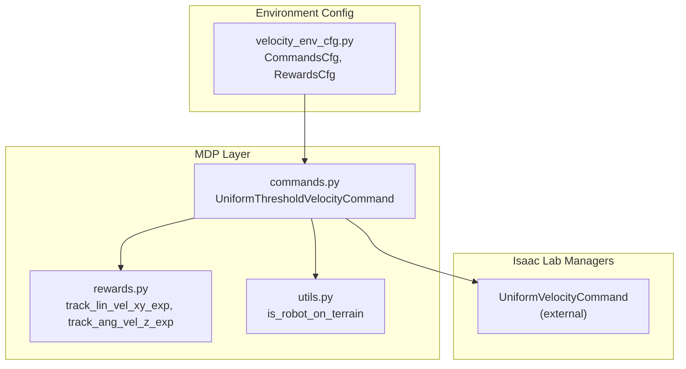
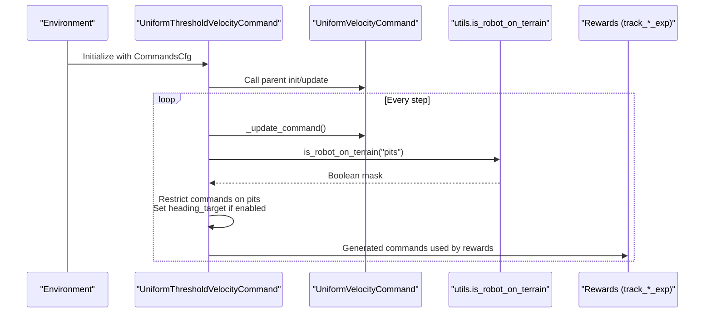
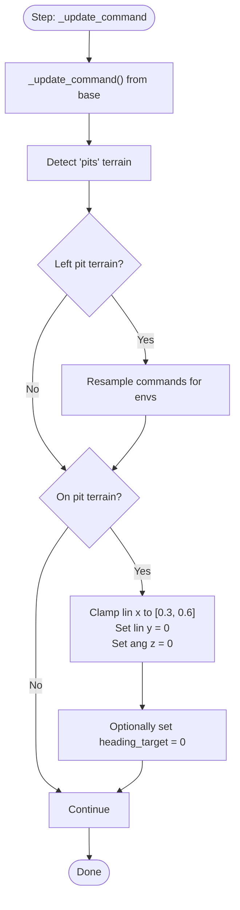
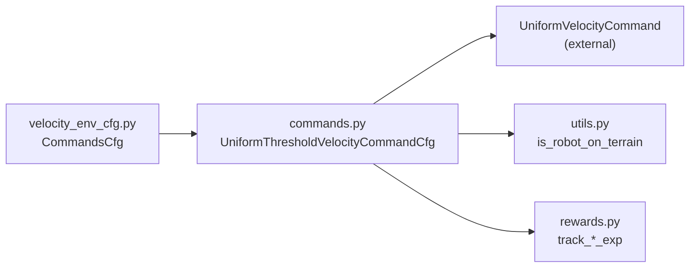

# Command Generation and Tracking

<cite>
**Referenced Files in This Document**
- [commands.py](file://source/robot_lab/robot_lab/tasks/manager_based/locomotion/velocity/mdp/commands.py)
- [velocity_env_cfg.py](file://source/robot_lab/robot_lab/tasks/manager_based/locomotion/velocity/velocity_env_cfg.py)
- [rewards.py](file://source/robot_lab/robot_lab/tasks/manager_based/locomotion/velocity/mdp/rewards.py)
- [utils.py](file://source/robot_lab/robot_lab/tasks/manager_based/locomotion/velocity/mdp/utils.py)
- [__init__.py](file://source/robot_lab/robot_lab/tasks/manager_based/locomotion/velocity/mdp/__init__.py)
</cite>

## Table of Contents
1. [Introduction](#introduction)
2. [Project Structure](#project-structure)
3. [Core Components](#core-components)
4. [Architecture Overview](#architecture-overview)
5. [Detailed Component Analysis](#detailed-component-analysis)
6. [Dependency Analysis](#dependency-analysis)
7. [Performance Considerations](#performance-considerations)
8. [Troubleshooting Guide](#troubleshooting-guide)
9. [Conclusion](#conclusion)
10. [Appendices](#appendices)

## Introduction
This document explains the velocity command generation and tracking systems used in locomotion environments. It focuses on:
- The CommandsCfg configuration that defines the base velocity command generator
- The UniformThresholdVelocityCommand implementation that extends uniform command sampling with terrain-aware restrictions
- Command resampling mechanisms and threshold-based velocity generation
- Heading control stiffness parameters and their impact on tracking
- Integration with reward systems for velocity tracking and how command generation affects training stability and convergence

## Project Structure
The velocity command system is implemented within the locomotion velocity MDP module and integrated into the environment configuration. Key files:
- Commands and command configuration: commands.py
- Environment configuration and command wiring: velocity_env_cfg.py
- Reward functions for velocity tracking: rewards.py
- Terrain-aware utilities: utils.py
- Module exports: __init__.py

**Diagram sources**
- [commands.py](file://source/robot_lab/robot_lab/tasks/manager_based/locomotion/velocity/mdp/commands.py#L21-L91)
- [velocity_env_cfg.py](file://source/robot_lab/robot_lab/tasks/manager_based/locomotion/velocity/velocity_env_cfg.py#L102-L117)
- [rewards.py](file://source/robot_lab/robot_lab/tasks/manager_based/locomotion/velocity/mdp/rewards.py#L22-L48)
- [utils.py](file://source/robot_lab/robot_lab/tasks/manager_based/locomotion/velocity/mdp/utils.py#L72-L127)

**Section sources**
- [velocity_env_cfg.py](file://source/robot_lab/robot_lab/tasks/manager_based/locomotion/velocity/velocity_env_cfg.py#L102-L117)
- [commands.py](file://source/robot_lab/robot_lab/tasks/manager_based/locomotion/velocity/mdp/commands.py#L21-L91)
- [rewards.py](file://source/robot_lab/robot_lab/tasks/manager_based/locomotion/velocity/mdp/rewards.py#L22-L48)
- [utils.py](file://source/robot_lab/robot_lab/tasks/manager_based/locomotion/velocity/mdp/utils.py#L72-L127)
- [__init__.py](file://source/robot_lab/robot_lab/tasks/manager_based/locomotion/velocity/mdp/__init__.py#L11-L20)

## Core Components
- CommandsCfg: Defines the base_velocity command generator using UniformThresholdVelocityCommandCfg with ranges for linear x/y and angular z, plus heading control parameters.
- UniformThresholdVelocityCommand: Extends the base command generator to:
  - Resample commands periodically
  - Apply a small-magnitude threshold to suppress near-zero commands
  - Dynamically detect “pits” terrain and restrict commands accordingly (forward-only movement, no lateral/rotational motion, optional heading reset)
- Reward integration: Exponential tracking rewards for linear and angular velocities use the same command_name to align generated commands with tracked performance.

Key configuration highlights:
- resampling_time_range: Controls how often commands are resampled
- ranges: Defines min/max bounds for lin_vel_x, lin_vel_y, ang_vel_z, heading
- heading_command and heading_control_stiffness: Enable and tune heading tracking behavior
- Threshold-based suppression: Small commands are nudged to zero to improve training stability

**Section sources**
- [velocity_env_cfg.py](file://source/robot_lab/robot_lab/tasks/manager_based/locomotion/velocity/velocity_env_cfg.py#L102-L117)
- [commands.py](file://source/robot_lab/robot_lab/tasks/manager_based/locomotion/velocity/mdp/commands.py#L21-L91)
- [rewards.py](file://source/robot_lab/robot_lab/tasks/manager_based/locomotion/velocity/mdp/rewards.py#L22-L48)

## Architecture Overview
The command generation pipeline integrates with the environment’s command manager and reward system. The UniformThresholdVelocityCommand updates commands each step, applies terrain-aware constraints, and feeds the command buffer consumed by reward functions.

**Diagram sources**
- [commands.py](file://source/robot_lab/robot_lab/tasks/manager_based/locomotion/velocity/mdp/commands.py#L48-L84)
- [utils.py](file://source/robot_lab/robot_lab/tasks/manager_based/locomotion/velocity/mdp/utils.py#L72-L127)
- [rewards.py](file://source/robot_lab/robot_lab/tasks/manager_based/locomotion/velocity/mdp/rewards.py#L22-L48)

## Detailed Component Analysis

### CommandsCfg and UniformThresholdVelocityCommandCfg
- CommandsCfg defines a base_velocity command using UniformThresholdVelocityCommandCfg with:
  - resampling_time_range: Fixed resampling interval
  - ranges: Lin x/y and ang z bounds, plus heading range
  - heading_command: Enables heading tracking
  - heading_control_stiffness: Stiffness for heading control
  - debug_vis: Visualization toggle
- UniformThresholdVelocityCommandCfg inherits from the base configuration and binds the specialized class UniformThresholdVelocityCommand.

Practical implications:
- The fixed resampling interval ensures periodic exploration of command space
- Heading control stiffness tunes how aggressively the robot aligns heading to the target
- Ranges define feasible command volumes per terrain condition

**Section sources**
- [velocity_env_cfg.py](file://source/robot_lab/robot_lab/tasks/manager_based/locomotion/velocity/velocity_env_cfg.py#L102-L117)
- [commands.py](file://source/robot_lab/robot_lab/tasks/manager_based/locomotion/velocity/mdp/commands.py#L87-L91)

### UniformThresholdVelocityCommand: Resampling and Thresholding
- Resampling: Calls the parent update to resample commands at the configured interval and then applies a magnitude threshold to zero small commands in the x/y plane.
- Real-time terrain-aware restriction:
  - Detects robots on “pits” terrain
  - For robots leaving pits: resamples commands to avoid abrupt transitions
  - For robots on pits: clamps forward speed to a safe range, disables lateral and yaw motion, optionally resets heading to zero

**Diagram sources**
- [commands.py](file://source/robot_lab/robot_lab/tasks/manager_based/locomotion/velocity/mdp/commands.py#L48-L84)
- [utils.py](file://source/robot_lab/robot_lab/tasks/manager_based/locomotion/velocity/mdp/utils.py#L72-L127)

**Section sources**
- [commands.py](file://source/robot_lab/robot_lab/tasks/manager_based/locomotion/velocity/mdp/commands.py#L42-L84)

### Terrain-Aware Utilities
- is_robot_on_terrain: Determines which robots are currently standing on a specific terrain type by mapping robot positions to terrain grid cells and checking column ranges.
- Used by UniformThresholdVelocityCommand to decide whether to restrict commands.

Operational notes:
- Works with a terrain generator and terrain_types metadata
- Uses nearest-neighbor mapping from robot positions to terrain origins

**Section sources**
- [utils.py](file://source/robot_lab/robot_lab/tasks/manager_based/locomotion/velocity/mdp/utils.py#L72-L127)

### Reward Integration for Velocity Tracking
- track_lin_vel_xy_exp and track_ang_vel_z_exp compute exponential rewards based on the difference between commanded and measured velocities in the robot body frame.
- These rewards depend on the command_name “base_velocity”, ensuring alignment with CommandsCfg.

Impact on training:
- Exponential kernels emphasize small tracking errors
- Gravity projection scaling prevents rewarding unrealistic orientations
- Strong correlation between command generation and reward enables stable learning when commands are well-conditioned

**Section sources**
- [rewards.py](file://source/robot_lab/robot_lab/tasks/manager_based/locomotion/velocity/mdp/rewards.py#L22-L48)
- [velocity_env_cfg.py](file://source/robot_lab/robot_lab/tasks/manager_based/locomotion/velocity/velocity_env_cfg.py#L526-L531)

### Relationship Between Commands and Tracking Performance
- Command ranges define the feasible operating space; tighter ranges reduce extreme maneuvers but may limit exploration
- Threshold-based suppression reduces noisy low-magnitude commands, improving policy stability
- Heading control stiffness influences convergence speed and robustness to heading drift
- Terrain-aware restrictions prevent unsafe behaviors on “pits,” maintaining safety and stability during resampling transitions

**Section sources**
- [velocity_env_cfg.py](file://source/robot_lab/robot_lab/tasks/manager_based/locomotion/velocity/velocity_env_cfg.py#L102-L117)
- [commands.py](file://source/robot_lab/robot_lab/tasks/manager_based/locomotion/velocity/mdp/commands.py#L42-L84)

## Dependency Analysis
- UniformThresholdVelocityCommand depends on:
  - UniformVelocityCommand (external base class)
  - utils.is_robot_on_terrain for terrain detection
  - Rewards that consume the generated commands via command_name
- CommandsCfg wires the command generator into the environment configuration

**Diagram sources**
- [velocity_env_cfg.py](file://source/robot_lab/robot_lab/tasks/manager_based/locomotion/velocity/velocity_env_cfg.py#L102-L117)
- [commands.py](file://source/robot_lab/robot_lab/tasks/manager_based/locomotion/velocity/mdp/commands.py#L21-L91)
- [utils.py](file://source/robot_lab/robot_lab/tasks/manager_based/locomotion/velocity/mdp/utils.py#L72-L127)
- [rewards.py](file://source/robot_lab/robot_lab/tasks/manager_based/locomotion/velocity/mdp/rewards.py#L22-L48)

**Section sources**
- [velocity_env_cfg.py](file://source/robot_lab/robot_lab/tasks/manager_based/locomotion/velocity/velocity_env_cfg.py#L102-L117)
- [commands.py](file://source/robot_lab/robot_lab/tasks/manager_based/locomotion/velocity/mdp/commands.py#L21-L91)
- [utils.py](file://source/robot_lab/robot_lab/tasks/manager_based/locomotion/velocity/mdp/utils.py#L72-L127)
- [rewards.py](file://source/robot_lab/robot_lab/tasks/manager_based/locomotion/velocity/mdp/rewards.py#L22-L48)

## Performance Considerations
- Resampling interval: Longer intervals reduce command variability and stabilize learning; shorter intervals increase exploration but risk instability on challenging terrains.
- Threshold magnitude: Larger thresholds suppress more small commands, reducing noise but potentially limiting fine control.
- Heading control stiffness: Higher stiffness accelerates heading convergence but may cause overshoot; lower stiffness improves damping but slows alignment.
- Terrain-aware restriction: Prevents dangerous transitions onto “pits,” improving long-term stability at the cost of reduced command diversity in restricted regions.

[No sources needed since this section provides general guidance]

## Troubleshooting Guide
Common issues and remedies:
- Commands not changing: Verify resampling_time_range is set and positive; confirm CommandsCfg is attached to the environment.
- Excessive heading drift: Increase heading_control_stiffness; ensure heading_command is enabled.
- Robot unstable on “pits”: Confirm is_robot_on_terrain detects “pits”; ensure UniformThresholdVelocityCommand restricts commands appropriately.
- Poor tracking performance: Reduce command ranges to safer bounds; adjust reward std parameters to balance sensitivity.

**Section sources**
- [velocity_env_cfg.py](file://source/robot_lab/robot_lab/tasks/manager_based/locomotion/velocity/velocity_env_cfg.py#L102-L117)
- [commands.py](file://source/robot_lab/robot_lab/tasks/manager_based/locomotion/velocity/mdp/commands.py#L48-L84)
- [utils.py](file://source/robot_lab/robot_lab/tasks/manager_based/locomotion/velocity/mdp/utils.py#L72-L127)
- [rewards.py](file://source/robot_lab/robot_lab/tasks/manager_based/locomotion/velocity/mdp/rewards.py#L22-L48)

## Conclusion
The velocity command generation system combines periodic resampling, threshold-based suppression, and terrain-aware restrictions to produce stable, safe, and effective commands. Integration with exponential tracking rewards ensures tight alignment between commanded and achieved velocities. Proper tuning of resampling intervals, command ranges, and heading control stiffness is essential for balancing exploration, stability, and convergence across diverse terrains.

[No sources needed since this section summarizes without analyzing specific files]

## Appendices

### Configuration Examples and Recommendations
- Flat terrain
  - resampling_time_range: [10.0, 10.0]
  - ranges: lin_vel_x [-1.0, 1.0], lin_vel_y [-1.0, 1.0], ang_vel_z [-1.0, 1.0], heading [-π, π]
  - heading_command: True
  - heading_control_stiffness: 0.5
- Rough terrain (general)
  - Reduce ranges slightly (e.g., lin_vel_x/y [-0.8, 0.8], ang_vel_z [-0.8, 0.8]) to improve stability
  - Keep resampling_time_range around 10 seconds
  - Increase heading_control_stiffness moderately to maintain heading alignment on uneven ground
- “Pits” zones
  - Rely on automatic restriction: forward-only movement with speed clamped to [0.3, 0.6]; lateral and yaw disabled; heading reset to zero
  - Ensure terrain generator includes “pits” sub-terrain and that is_robot_on_terrain can detect it

[No sources needed since this section provides general guidance]