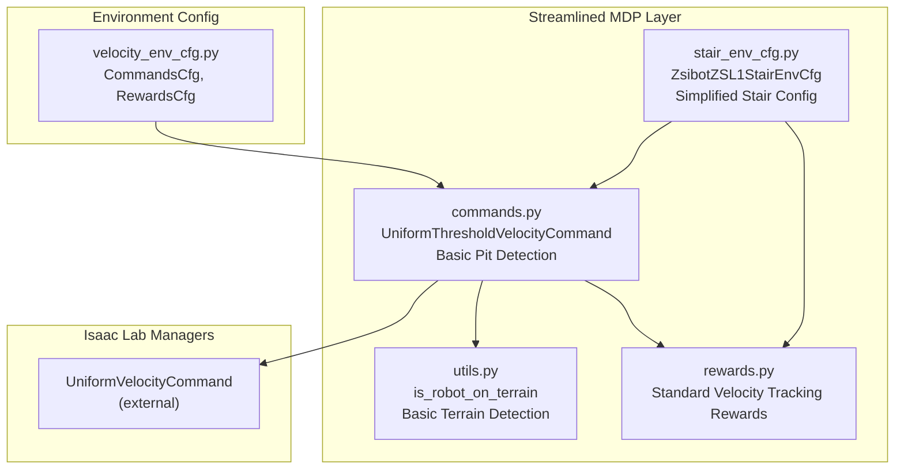
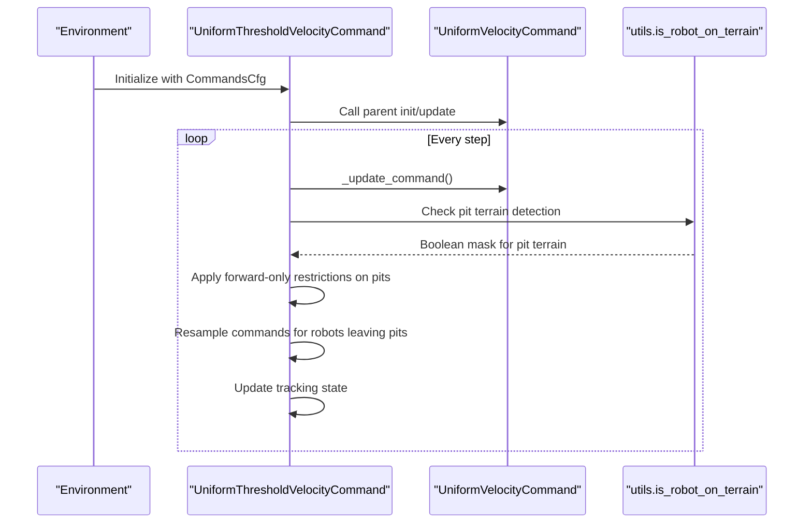
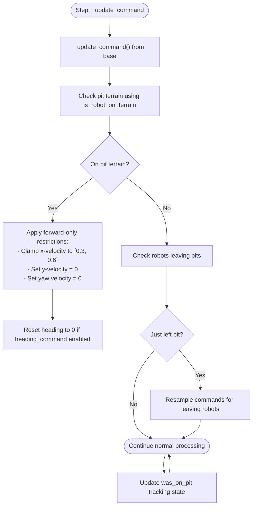
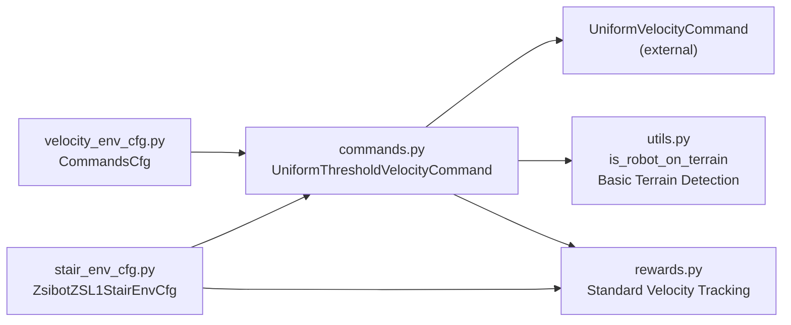

# Command Generation and Tracking

<cite>
**Referenced Files in This Document**
- [commands.py](file://source/robot_lab/robot_lab/tasks/manager_based/locomotion/velocity/mdp/commands.py)
- [velocity_env_cfg.py](file://source/robot_lab/robot_lab/tasks/manager_based/locomotion/velocity/velocity_env_cfg.py)
- [rewards.py](file://source/robot_lab/robot_lab/tasks/manager_based/locomotion/velocity/mdp/rewards.py)
- [utils.py](file://source/robot_lab/robot_lab/tasks/manager_based/locomotion/velocity/mdp/utils.py)
- [stair_env_cfg.py](file://source/robot_lab/robot_lab/tasks/manager_based/locomotion/velocity/config/quadruped/zsibot_zsl1/stair_env_cfg.py)
- [__init__.py](file://source/robot_lab/robot_lab/tasks/manager_based/locomotion/velocity/mdp/__init__.py)
</cite>

## Update Summary
**Changes Made**
- Simplified terrain-aware command generation to basic pit detection and restrictions
- Removed complex world-horizontal velocity stabilization system
- Eliminated advanced stair detection and specialized stair climbing features
- Streamlined reward system to focus on core velocity tracking capabilities
- Updated to reflect current implementation with basic terrain-aware restrictions

## Table of Contents
1. [Introduction](#introduction)
2. [Project Structure](#project-structure)
3. [Core Components](#core-components)
4. [Architecture Overview](#architecture-overview)
5. [Detailed Component Analysis](#detailed-component-analysis)
6. [Dependency Analysis](#dependency-analysis)
7. [Performance Considerations](#performance-considerations)
8. [Troubleshooting Guide](#troubleshooting-guide)
9. [Conclusion](#conclusion)
10. [Appendices](#appendices)

## Introduction
This document explains the current velocity command generation and tracking systems used in locomotion environments. The system focuses on basic terrain-aware command generation with simplified pit detection and restrictions. Key features include:
- Basic terrain-aware command generation with pit detection and restrictions
- Simple command resampling mechanisms with threshold-based velocity generation
- Standard reward integration for velocity tracking without specialized stair features
- Streamlined configuration for different terrain conditions and command ranges

**Updated** Simplified to reflect current implementation without complex world-horizontal stabilization or advanced stair detection

## Project Structure
The velocity command system is implemented within the locomotion velocity MDP module with streamlined functionality. Key files:
- Commands and command configuration: commands.py
- Environment configuration and command wiring: velocity_env_cfg.py
- Reward functions for velocity tracking: rewards.py
- Terrain-aware utilities: utils.py
- Stair climbing specific configuration: stair_env_cfg.py
- Module exports: __init__.py

**Diagram sources**
- [commands.py:31-98](file://source/robot_lab/robot_lab/tasks/manager_based/locomotion/velocity/mdp/commands.py#L31-L98)
- [velocity_env_cfg.py:103-118](file://source/robot_lab/robot_lab/tasks/manager_based/locomotion/velocity/velocity_env_cfg.py#L103-L118)
- [rewards.py:22-48](file://source/robot_lab/robot_lab/tasks/manager_based/locomotion/velocity/mdp/rewards.py#L22-L48)
- [utils.py:73-127](file://source/robot_lab/robot_lab/tasks/manager_based/locomotion/velocity/mdp/utils.py#L73-L127)
- [stair_env_cfg.py:55-231](file://source/robot_lab/robot_lab/tasks/manager_based/locomotion/velocity/config/quadruped/zsibot_zsl1/stair_env_cfg.py#L55-L231)

**Section sources**
- [velocity_env_cfg.py:103-118](file://source/robot_lab/robot_lab/tasks/manager_based/locomotion/velocity/velocity_env_cfg.py#L103-L118)
- [commands.py:31-98](file://source/robot_lab/robot_lab/tasks/manager_based/locomotion/velocity/mdp/commands.py#L31-L98)
- [rewards.py:22-48](file://source/robot_lab/robot_lab/tasks/manager_based/locomotion/velocity/mdp/rewards.py#L22-L48)
- [utils.py:73-127](file://source/robot_lab/robot_lab/tasks/manager_based/locomotion/velocity/mdp/utils.py#L73-L127)
- [stair_env_cfg.py:55-231](file://source/robot_lab/robot_lab/tasks/manager_based/locomotion/velocity/config/quadruped/zsibot_zsl1/stair_env_cfg.py#L55-L231)
- [__init__.py:11-20](file://source/robot_lab/robot_lab/tasks/manager_based/locomotion/velocity/mdp/__init__.py#L11-L20)

## Core Components
- **UniformThresholdVelocityCommand**: Enhanced version of the base command generator with basic terrain-aware restrictions for pit detection and forward-only movement constraints.
- **Basic CommandsCfg**: Defines the base_velocity command generator using UniformVelocityCommandCfg with standard ranges for linear x/y and angular z velocities.
- **Simplified Reward Integration**: Uses standard velocity tracking rewards without specialized stair climbing features.

Key configuration highlights:
- **Basic pit detection**: `is_robot_on_terrain` utility for detecting pit terrain
- **Forward-only restrictions**: Automatic enforcement of forward movement on pit terrain
- **Simple resampling**: Threshold-based command resampling with small command suppression
- **Standard heading control**: Basic heading command functionality without world-horizontal stabilization

**Updated** Simplified to basic terrain-aware functionality without complex world-horizontal stabilization

**Section sources**
- [velocity_env_cfg.py:103-118](file://source/robot_lab/robot_lab/tasks/manager_based/locomotion/velocity/velocity_env_cfg.py#L103-L118)
- [commands.py:31-98](file://source/robot_lab/robot_lab/tasks/manager_based/locomotion/velocity/mdp/commands.py#L31-L98)
- [rewards.py:22-48](file://source/robot_lab/robot_lab/tasks/manager_based/locomotion/velocity/mdp/rewards.py#L22-L48)

## Architecture Overview
The streamlined command generation pipeline focuses on basic terrain-aware restrictions with simplified functionality:

**Diagram sources**
- [commands.py:61-98](file://source/robot_lab/robot_lab/tasks/manager_based/locomotion/velocity/mdp/commands.py#L61-L98)
- [utils.py:73-127](file://source/robot_lab/robot_lab/tasks/manager_based/locomotion/velocity/mdp/utils.py#L73-L127)

## Detailed Component Analysis

### UniformThresholdVelocityCommand: Basic Terrain-Aware Implementation
- **Enhanced terrain-aware restrictions**: 
  - Tracks robots on pit terrain using `is_robot_on_terrain` utility
  - Automatically enforces forward-only movement with speed constraints (0.3-0.6 m/s)
  - Disables lateral movement and yaw rotation on pit terrain
  - Sets heading to 0 for robots on pit terrain when heading_command is enabled
- **Simplified command processing**:
  - Basic threshold-based resampling that suppresses small commands (< 0.2 m/s)
  - Maintains standard heading control functionality without world-horizontal stabilization
- **State tracking**: 
  - Tracks which robots were on pit terrain in previous step for transition detection

**Diagram sources**
- [commands.py:61-98](file://source/robot_lab/robot_lab/tasks/manager_based/locomotion/velocity/mdp/commands.py#L61-L98)

**Section sources**
- [commands.py:31-98](file://source/robot_lab/robot_lab/tasks/manager_based/locomotion/velocity/mdp/commands.py#L31-L98)

### Basic CommandsCfg and Configuration
- **Standard CommandsCfg**: Defines base_velocity command using UniformVelocityCommandCfg with:
  - Standard ranges: lin_vel_x [-1.0, 1.0], lin_vel_y [-1.0, 1.0], ang_vel_z [-1.0, 1.0], heading [-π, π]
  - Heading command enabled with stiffness 0.5
  - Fixed resampling time range (10.0, 10.0) seconds
  - Debug visualization enabled
- **UniformThresholdVelocityCommandCfg**: Inherits from base configuration with specialized class binding

**Updated** Simplified to standard configuration without complex world-horizontal stabilization

**Section sources**
- [velocity_env_cfg.py:103-118](file://source/robot_lab/robot_lab/tasks/manager_based/locomotion/velocity/velocity_env_cfg.py#L103-L118)
- [commands.py:100-105](file://source/robot_lab/robot_lab/tasks/manager_based/locomotion/velocity/mdp/commands.py#L100-L105)

### Basic Terrain-Aware Utilities
- **Enhanced is_robot_on_terrain**: Improved terrain detection supporting:
  - **Basic terrain types**: "pits" terrain detection for forward-only restrictions
  - **Robust terrain mapping**: Accurate robot-to-terrain cell assignment
  - **Simple boolean masking**: Returns clear boolean tensors for terrain detection
- **Streamlined implementation**: Focused on essential terrain detection without complex stair-specific logic

**Updated** Simplified to basic pit detection functionality

**Section sources**
- [utils.py:73-127](file://source/robot_lab/robot_lab/tasks/manager_based/locomotion/velocity/mdp/utils.py#L73-L127)

### Standard Reward Integration
- **Basic velocity tracking rewards**: Uses standard exponential kernel rewards for linear and angular velocity tracking
- **Simplified reward functions**: 
  - `track_lin_vel_xy_exp`: Exponential kernel for xy linear velocity tracking
  - `track_ang_vel_z_exp`: Exponential kernel for z angular velocity tracking
  - `track_lin_vel_xy_yaw_frame_exp`: Gravity-aligned frame tracking
  - `track_ang_vel_z_world_exp`: World-frame angular velocity tracking
- **No specialized stair rewards**: Standard reward system without stair-specific modifications

**Updated** Simplified to standard velocity tracking without specialized stair climbing features

**Section sources**
- [rewards.py:22-48](file://source/robot_lab/robot_lab/tasks/manager_based/locomotion/velocity/mdp/rewards.py#L22-L48)
- [rewards.py:51-79](file://source/robot_lab/robot_lab/tasks/manager_based/locomotion/velocity/mdp/rewards.py#L51-L79)

### Simplified Stair Climbing Configuration
- **ZsibotZSL1StairEnvCfg**: Streamlined stair climbing configuration:
  - **Disabled heading command**: Robot rotates freely without heading alignment
  - **Forward-only movement**: Lin_vel_x restricted to (0.0, 1.0), no backward movement
  - **No lateral movement**: Lin_vel_y restricted to (-0.0, 0.0)
  - **Standard reward weights**: Uses basic velocity tracking rewards without specialized stair features
  - **Simplified observation scaling**: Reduced scales for better stair climbing performance
- **Basic terrain integration**: Uses standard pit detection for terrain-aware restrictions

**Updated** Simplified to basic stair configuration without advanced world-horizontal stabilization

**Section sources**
- [stair_env_cfg.py:55-231](file://source/robot_lab/robot_lab/tasks/manager_based/locomotion/velocity/config/quadruped/zsibot_zsl1/stair_env_cfg.py#L55-L231)

### Relationship Between Basic Commands and Performance
- **Basic terrain awareness**: Pit detection enables safe forward movement on dangerous terrain
- **Forward-only restrictions**: Prevents destabilizing movements on pit terrain while maintaining forward momentum
- **Standard reward integration**: Basic velocity tracking rewards work well with simplified command generation
- **Simplified state tracking**: Reduced complexity improves training stability and convergence

**Updated** Simplified to basic terrain-aware functionality without complex world-horizontal stabilization

**Section sources**
- [velocity_env_cfg.py:103-118](file://source/robot_lab/robot_lab/tasks/manager_based/locomotion/velocity/velocity_env_cfg.py#L103-L118)
- [commands.py:31-98](file://source/robot_lab/robot_lab/tasks/manager_based/locomotion/velocity/mdp/commands.py#L31-L98)
- [stair_env_cfg.py:221-231](file://source/robot_lab/robot_lab/tasks/manager_based/locomotion/velocity/config/quadruped/zsibot_zsl1/stair_env_cfg.py#L221-L231)

## Dependency Analysis
- **UniformThresholdVelocityCommand** depends on:
  - **UniformVelocityCommand** (external base class)
  - **utils.is_robot_on_terrain** for basic terrain detection
  - **Standard Rewards** for velocity tracking
  - **Simplified stair climbing configuration** for stair navigation
- **CommandsCfg** integrates the basic command generator with standard optimization

**Diagram sources**
- [velocity_env_cfg.py:103-118](file://source/robot_lab/robot_lab/tasks/manager_based/locomotion/velocity/velocity_env_cfg.py#L103-L118)
- [commands.py:31-98](file://source/robot_lab/robot_lab/tasks/manager_based/locomotion/velocity/mdp/commands.py#L31-L98)
- [utils.py:73-127](file://source/robot_lab/robot_lab/tasks/manager_based/locomotion/velocity/mdp/utils.py#L73-L127)
- [rewards.py:22-48](file://source/robot_lab/robot_lab/tasks/manager_based/locomotion/velocity/mdp/rewards.py#L22-L48)
- [stair_env_cfg.py:55-231](file://source/robot_lab/robot_lab/tasks/manager_based/locomotion/velocity/config/quadruped/zsibot_zsl1/stair_env_cfg.py#L55-L231)

**Section sources**
- [velocity_env_cfg.py:103-118](file://source/robot_lab/robot_lab/tasks/manager_based/locomotion/velocity/velocity_env_cfg.py#L103-L118)
- [commands.py:31-98](file://source/robot_lab/robot_lab/tasks/manager_based/locomotion/velocity/mdp/commands.py#L31-L98)
- [utils.py:73-127](file://source/robot_lab/robot_lab/tasks/manager_based/locomotion/velocity/mdp/utils.py#L73-L127)
- [rewards.py:22-48](file://source/robot_lab/robot_lab/tasks/manager_based/locomotion/velocity/mdp/rewards.py#L22-L48)
- [stair_env_cfg.py:55-231](file://source/robot_lab/robot_lab/tasks/manager_based/locomotion/velocity/config/quadruped/zsibot_zsl1/stair_env_cfg.py#L55-L231)

## Performance Considerations
- **Basic pit detection**: Simple terrain detection provides reliable pit avoidance without computational overhead
- **Forward-only restrictions**: Effective pit terrain handling prevents destabilizing movements while maintaining forward momentum
- **Standard reward integration**: Basic velocity tracking rewards work well with simplified command generation
- **Reduced complexity**: Streamlined implementation improves training stability and convergence
- **Observation scaling**: Appropriate scaling factors for stair climbing scenarios

**Updated** Simplified performance considerations for streamlined implementation

## Troubleshooting Guide
Common issues and remedies:
- **Pit terrain traversal issues**: Verify `is_robot_on_terrain` is properly detecting "pits" terrain type
- **Forward movement problems**: Check that forward-only restrictions are being applied correctly (speed clamped to [0.3, 0.6])
- **Heading command conflicts**: Ensure heading_command is properly configured (enabled/disabled based on terrain requirements)
- **Training instability**: The simplified implementation should provide better training stability than complex world-horizontal stabilization
- **Stair climbing limitations**: Basic configuration may require adjustments for challenging stair scenarios
- **Reward balance issues**: Standard velocity tracking rewards should work well with basic command generation

**Updated** Simplified troubleshooting for streamlined implementation

**Section sources**
- [velocity_env_cfg.py:103-118](file://source/robot_lab/robot_lab/tasks/manager_based/locomotion/velocity/velocity_env_cfg.py#L103-L118)
- [commands.py:31-98](file://source/robot_lab/robot_lab/tasks/manager_based/locomotion/velocity/mdp/commands.py#L31-L98)
- [utils.py:73-127](file://source/robot_lab/robot_lab/tasks/manager_based/locomotion/velocity/mdp/utils.py#L73-L127)
- [rewards.py:22-48](file://source/robot_lab/robot_lab/tasks/manager_based/locomotion/velocity/mdp/rewards.py#L22-L48)
- [stair_env_cfg.py:221-231](file://source/robot_lab/robot_lab/tasks/manager_based/locomotion/velocity/config/quadruped/zsibot_zsl1/stair_env_cfg.py#L221-L231)

## Conclusion
The streamlined velocity command generation system provides reliable terrain-aware command generation with simplified functionality. The basic implementation focuses on essential features like pit detection and forward-only restrictions, eliminating the complexity of world-horizontal stabilization while maintaining effective terrain navigation. The system offers improved training stability and convergence through reduced computational overhead and simpler state tracking, making it suitable for a wide range of locomotion scenarios including basic stair climbing applications.

**Updated** Simplified conclusion reflecting streamlined implementation without complex world-horizontal stabilization

## Appendices

### Streamlined Configuration Examples and Recommendations
- **Flat terrain**
  - resampling_time_range: [10.0, 10.0]
  - ranges: lin_vel_x [-1.0, 1.0], lin_vel_y [-1.0, 1.0], ang_vel_z [-1.0, 1.0], heading [-π, π]
  - heading_command: True
  - heading_control_stiffness: 0.5
- **Rough terrain (general)**
  - Reduce ranges slightly (e.g., lin_vel_x/y [-0.8, 0.8], ang_vel_z [-0.8, 0.8]) to improve stability
  - Keep resampling_time_range around 10 seconds
  - Increase heading_control_stiffness moderately to maintain heading alignment on uneven ground
- **Pit terrain navigation**
  - Automatic forward-only movement with speed clamped to [0.3, 0.6] m/s
  - Lateral and yaw movement disabled on pit terrain
  - Heading reset to 0 when leaving pit terrain
  - Ensure terrain generator includes "pits" sub-terrain and proper detection
- **Stair climbing scenarios**
  - Disabled heading command for free rotation during stair navigation
  - Forward-only movement only (lin_vel_x [0.0, 1.0])
  - No lateral movement (lin_vel_y [-0.0, 0.0])
  - Standard velocity tracking rewards for stair approach and ascent
  - Adjust observation scaling for better stair perception

**Updated** Simplified configuration recommendations for streamlined implementation