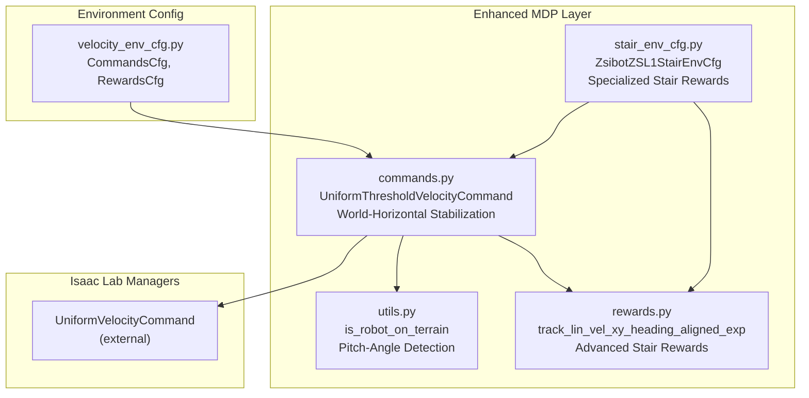
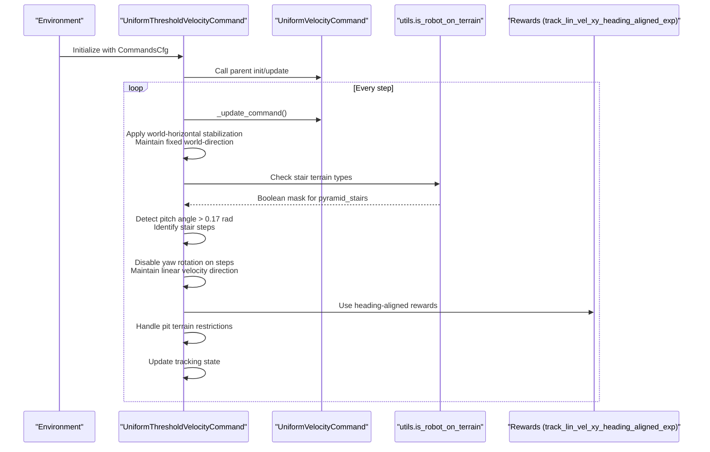
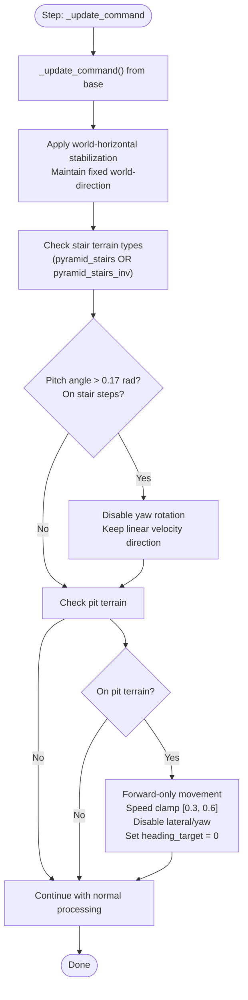
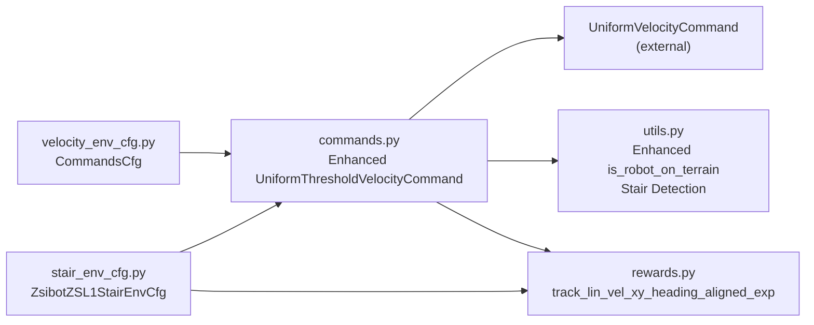

# Command Generation and Tracking

<cite>
**Referenced Files in This Document**
- [commands.py](file://source/robot_lab/robot_lab/tasks/manager_based/locomotion/velocity/mdp/commands.py)
- [velocity_env_cfg.py](file://source/robot_lab/robot_lab/tasks/manager_based/locomotion/velocity/velocity_env_cfg.py)
- [rewards.py](file://source/robot_lab/robot_lab/tasks/manager_based/locomotion/velocity/mdp/rewards.py)
- [utils.py](file://source/robot_lab/robot_lab/tasks/manager_based/locomotion/velocity/mdp/utils.py)
- [stair_env_cfg.py](file://source/robot_lab/robot_lab/tasks/manager_based/locomotion/velocity/config/quadruped/zsibot_zsl1/stair_env_cfg.py)
- [__init__.py](file://source/robot_lab/robot_lab/tasks/manager_based/locomotion/velocity/mdp/__init__.py)
</cite>

## Update Summary
**Changes Made**
- Enhanced world-horizontal velocity stabilization mechanism for improved stair climbing performance
- Added terrain-aware conditional behavior specifically for pyramid stairs and inverted stairs
- Implemented pitch-angle detection for stair step identification
- Integrated advanced reward system with heading-aligned velocity tracking for stair navigation
- Added comprehensive stair climbing configuration with specialized reward parameters

## Table of Contents
1. [Introduction](#introduction)
2. [Project Structure](#project-structure)
3. [Core Components](#core-components)
4. [Architecture Overview](#architecture-overview)
5. [Detailed Component Analysis](#detailed-component-analysis)
6. [Dependency Analysis](#dependency-analysis)
7. [Performance Considerations](#performance-considerations)
8. [Troubleshooting Guide](#troubleshooting-guide)
9. [Conclusion](#conclusion)
10. [Appendices](#appendices)

## Introduction
This document explains the enhanced velocity command generation and tracking systems used in locomotion environments, with particular emphasis on world-horizontal velocity stabilization and terrain-aware conditional behavior for improved stair climbing performance. The system now features:
- Advanced world-horizontal velocity stabilization that maintains fixed world-coordinate direction regardless of robot pitch/roll
- Terrain-aware conditional behavior specifically designed for pyramid stairs and inverted stairs
- Enhanced command resampling mechanisms with improved stair navigation capabilities
- Advanced reward integration with heading-aligned velocity tracking for stair climbing scenarios
- Comprehensive stair climbing configuration with specialized reward parameters and observation scaling

## Project Structure
The velocity command system is implemented within the locomotion velocity MDP module and integrated into specialized stair climbing configurations. Key files:
- Commands and command configuration: commands.py
- Environment configuration and command wiring: velocity_env_cfg.py
- Reward functions for velocity tracking: rewards.py
- Terrain-aware utilities: utils.py
- Stair climbing specific configuration: stair_env_cfg.py
- Module exports: __init__.py

**Diagram sources**
- [commands.py:72-139](file://source/robot_lab/robot_lab/tasks/manager_based/locomotion/velocity/mdp/commands.py#L72-L139)
- [velocity_env_cfg.py:102-121](file://source/robot_lab/robot_lab/tasks/manager_based/locomotion/velocity/velocity_env_cfg.py#L102-L121)
- [rewards.py:683-791](file://source/robot_lab/robot_lab/tasks/manager_based/locomotion/velocity/mdp/rewards.py#L683-L791)
- [utils.py:72-127](file://source/robot_lab/robot_lab/tasks/manager_based/locomotion/velocity/mdp/utils.py#L72-L127)
- [stair_env_cfg.py:50-219](file://source/robot_lab/robot_lab/tasks/manager_based/locomotion/velocity/config/quadruped/zsibot_zsl1/stair_env_cfg.py#L50-L219)

**Section sources**
- [velocity_env_cfg.py:102-121](file://source/robot_lab/robot_lab/tasks/manager_based/locomotion/velocity/velocity_env_cfg.py#L102-L121)
- [commands.py:72-139](file://source/robot_lab/robot_lab/tasks/manager_based/locomotion/velocity/mdp/commands.py#L72-L139)
- [rewards.py:683-791](file://source/robot_lab/robot_lab/tasks/manager_based/locomotion/velocity/mdp/rewards.py#L683-L791)
- [utils.py:72-127](file://source/robot_lab/robot_lab/tasks/manager_based/locomotion/velocity/mdp/utils.py#L72-L127)
- [stair_env_cfg.py:50-219](file://source/robot_lab/robot_lab/tasks/manager_based/locomotion/velocity/config/quadruped/zsibot_zsl1/stair_env_cfg.py#L50-L219)
- [__init__.py:11-20](file://source/robot_lab/robot_lab/tasks/manager_based/locomotion/velocity/mdp/__init__.py#L11-L20)

## Core Components
- **Enhanced CommandsCfg**: Defines the base_velocity command generator using UniformThresholdVelocityCommandCfg with ranges for linear x/y and angular z, plus advanced heading control parameters.
- **UniformThresholdVelocityCommand**: Extends the base command generator with:
  - **World-horizontal velocity stabilization**: Maintains fixed world-coordinate direction regardless of robot pitch/roll on stairs and rough terrain
  - **Terrain-aware conditional behavior**: Implements specialized logic for pyramid stairs and inverted stairs with pitch-angle detection
  - **Advanced stair climbing support**: Disables yaw rotation on stair steps while maintaining linear velocity direction
  - **Enhanced resampling mechanisms**: Improved command generation with better stair navigation capabilities
- **Advanced Reward Integration**: Uses `track_lin_vel_xy_heading_aligned_exp` for stair climbing scenarios that prioritizes heading alignment before forward velocity tracking

Key configuration highlights:
- **World-horizontal stabilization**: `vel_command_yaw_w` buffer ensures consistent world-frame velocity direction
- **Stair detection**: Pitch-angle threshold of 0.17 radians (~10 degrees) identifies stair steps
- **Conditional behavior**: Yaw rotation disabled on stair steps, linear velocity maintained
- **Enhanced reward system**: Specialized stair climbing rewards with reduced upward penalties

**Section sources**
- [velocity_env_cfg.py:102-121](file://source/robot_lab/robot_lab/tasks/manager_based/locomotion/velocity/velocity_env_cfg.py#L102-L121)
- [commands.py:72-139](file://source/robot_lab/robot_lab/tasks/manager_based/locomotion/velocity/mdp/commands.py#L72-L139)
- [rewards.py:683-791](file://source/robot_lab/robot_lab/tasks/manager_based/locomotion/velocity/mdp/rewards.py#L683-L791)
- [stair_env_cfg.py:158-200](file://source/robot_lab/robot_lab/tasks/manager_based/locomotion/velocity/config/quadruped/zsibot_zsl1/stair_env_cfg.py#L158-L200)

## Architecture Overview
The enhanced command generation pipeline integrates world-horizontal velocity stabilization with terrain-aware conditional behavior for improved stair climbing performance. The system now features:

**Diagram sources**
- [commands.py:72-139](file://source/robot_lab/robot_lab/tasks/manager_based/locomotion/velocity/mdp/commands.py#L72-L139)
- [utils.py:72-127](file://source/robot_lab/robot_lab/tasks/manager_based/locomotion/velocity/mdp/utils.py#L72-L127)
- [rewards.py:683-791](file://source/robot_lab/robot_lab/tasks/manager_based/locomotion/velocity/mdp/rewards.py#L683-L791)

## Detailed Component Analysis

### Enhanced CommandsCfg and UniformThresholdVelocityCommandCfg
- **Enhanced CommandsCfg**: Defines base_velocity command using UniformThresholdVelocityCommandCfg with:
  - **World-horizontal velocity buffer**: `vel_command_yaw_w` maintains fixed world-frame direction
  - **Advanced terrain detection**: Supports both "pyramid_stairs" and "pyramid_stairs_inv" terrain types
  - **Pitch-angle threshold**: 0.17 radians (~10 degrees) for stair step identification
  - **Enhanced heading control**: Improved integration with world-horizontal stabilization
- **UniformThresholdVelocityCommandCfg**: Inherits from base configuration with specialized class binding

**Updated** Enhanced with world-horizontal velocity stabilization and advanced stair climbing capabilities

**Section sources**
- [velocity_env_cfg.py:102-121](file://source/robot_lab/robot_lab/tasks/manager_based/locomotion/velocity/velocity_env_cfg.py#L102-L121)
- [commands.py:141-146](file://source/robot_lab/robot_lab/tasks/manager_based/locomotion/velocity/mdp/commands.py#L141-L146)

### UniformThresholdVelocityCommand: Advanced Stabilization and Conditional Behavior
- **World-horizontal velocity stabilization**: 
  - Maintains fixed world-coordinate direction regardless of robot pitch/roll
  - Uses `vel_command_yaw_w` buffer to store xy velocity direction in world frame
  - Applies quaternion transformation to convert world-frame to body-frame velocity
- **Advanced stair detection and handling**:
  - Detects "pyramid_stairs" and "pyramid_stairs_inv" terrain types
  - Uses pitch-angle detection: `torch.abs(torch.atan2(proj_gravity[:, 0], -proj_gravity[:, 2])) > 0.17`
  - Disables yaw rotation on stair steps while maintaining linear velocity direction
- **Enhanced terrain-aware restrictions**:
  - Improved pit terrain detection and handling
  - Better transition management between terrains

**Diagram sources**
- [commands.py:72-139](file://source/robot_lab/robot_lab/tasks/manager_based/locomotion/velocity/mdp/commands.py#L72-L139)

**Section sources**
- [commands.py:72-139](file://source/robot_lab/robot_lab/tasks/manager_based/locomotion/velocity/mdp/commands.py#L72-L139)

### Advanced Terrain-Aware Utilities
- **Enhanced is_robot_on_terrain**: Improved terrain detection supporting:
  - **Stair-specific terrain types**: "pyramid_stairs" and "pyramid_stairs_inv"
  - **Pitch-angle integration**: Works with stair climbing detection logic
  - **Robust terrain mapping**: Accurate robot-to-terrain cell assignment
- **Pitch-angle detection**: Uses projected gravity vector to determine stair step inclination

**Updated** Enhanced with stair-specific terrain detection and pitch-angle analysis

**Section sources**
- [utils.py:72-127](file://source/robot_lab/robot_lab/tasks/manager_based/locomotion/velocity/mdp/utils.py#L72-L127)

### Advanced Reward Integration for Stair Climbing
- **Enhanced track_lin_vel_xy_heading_aligned_exp**: Specialized reward function for stair climbing that:
  - Prioritizes heading alignment before forward velocity tracking
  - Uses `heading_target` from command term for stair navigation
  - Falls back to body-frame velocity tracking on incline terrain
  - Integrates with world-horizontal velocity stabilization
- **Specialized stair rewards**: Reduced upward penalties (0.3) to allow body tilt during leg lifting
- **Enhanced contact rewards**: Modified undesired contacts and contact forces for stair climbing scenarios

**Updated** Enhanced with heading-aligned velocity tracking specifically designed for stair climbing

**Section sources**
- [rewards.py:683-791](file://source/robot_lab/robot_lab/tasks/manager_based/locomotion/velocity/mdp/rewards.py#L683-L791)
- [stair_env_cfg.py:158-200](file://source/robot_lab/robot_lab/tasks/manager_based/locomotion/velocity/config/quadruped/zsibot_zsl1/stair_env_cfg.py#L158-L200)

### Stair Climbing Configuration
- **ZsibotZSL1StairEnvCfg**: Specialized environment configuration for stair climbing:
  - **Reduced upward penalty**: 0.3 weight to allow controlled body tilt
  - **Enhanced air time rewards**: 0.5 weight for longer stride and obstacle clearance
  - **Modified contact rewards**: Reduced undesired contacts penalty (-1.0)
  - **Specialized joint penalties**: Reduced joint torques and power penalties
  - **Enhanced observation scaling**: Increased base_lin_vel scale (2.0) for stair climbing
- **Advanced reward parameters**: Optimized for stair climbing performance

**New** Dedicated stair climbing configuration with specialized reward system

**Section sources**
- [stair_env_cfg.py:50-219](file://source/robot_lab/robot_lab/tasks/manager_based/locomotion/velocity/config/quadruped/zsibot_zsl1/stair_env_cfg.py#L50-L219)

### Relationship Between Enhanced Commands and Stair Climbing Performance
- **World-horizontal stabilization**: Ensures consistent velocity direction regardless of stair pitch/roll angles
- **Conditional behavior**: Disables yaw rotation on stair steps to prevent destabilization while maintaining forward momentum
- **Enhanced reward integration**: Heading-aligned velocity tracking prioritizes proper stair approach direction
- **Terrain-aware restrictions**: Improved pit terrain handling with better transition management
- **Specialized stair rewards**: Reduced penalties for stair-specific behaviors like body tilt and leg lifting

**Updated** Enhanced with world-horizontal velocity stabilization and specialized stair climbing behavior

**Section sources**
- [velocity_env_cfg.py:102-121](file://source/robot_lab/robot_lab/tasks/manager_based/locomotion/velocity/velocity_env_cfg.py#L102-L121)
- [commands.py:72-139](file://source/robot_lab/robot_lab/tasks/manager_based/locomotion/velocity/mdp/commands.py#L72-L139)
- [stair_env_cfg.py:158-200](file://source/robot_lab/robot_lab/tasks/manager_based/locomotion/velocity/config/quadruped/zsibot_zsl1/stair_env_cfg.py#L158-L200)

## Dependency Analysis
- **Enhanced UniformThresholdVelocityCommand** depends on:
  - **UniformVelocityCommand** (external base class)
  - **utils.is_robot_on_terrain** for advanced terrain detection (including stair-specific terrains)
  - **Enhanced Rewards** that utilize heading-aligned velocity tracking
  - **Specialized stair climbing configuration** for optimal stair navigation
- **CommandsCfg** integrates the enhanced command generator with stair climbing optimization

**Diagram sources**
- [velocity_env_cfg.py:102-121](file://source/robot_lab/robot_lab/tasks/manager_based/locomotion/velocity/velocity_env_cfg.py#L102-L121)
- [commands.py:72-139](file://source/robot_lab/robot_lab/tasks/manager_based/locomotion/velocity/mdp/commands.py#L72-L139)
- [utils.py:72-127](file://source/robot_lab/robot_lab/tasks/manager_based/locomotion/velocity/mdp/utils.py#L72-L127)
- [rewards.py:683-791](file://source/robot_lab/robot_lab/tasks/manager_based/locomotion/velocity/mdp/rewards.py#L683-L791)
- [stair_env_cfg.py:50-219](file://source/robot_lab/robot_lab/tasks/manager_based/locomotion/velocity/config/quadruped/zsibot_zsl1/stair_env_cfg.py#L50-L219)

**Section sources**
- [velocity_env_cfg.py:102-121](file://source/robot_lab/robot_lab/tasks/manager_based/locomotion/velocity/velocity_env_cfg.py#L102-L121)
- [commands.py:72-139](file://source/robot_lab/robot_lab/tasks/manager_based/locomotion/velocity/mdp/commands.py#L72-L139)
- [utils.py:72-127](file://source/robot_lab/robot_lab/tasks/manager_based/locomotion/velocity/mdp/utils.py#L72-L127)
- [rewards.py:683-791](file://source/robot_lab/robot_lab/tasks/manager_based/locomotion/velocity/mdp/rewards.py#L683-L791)
- [stair_env_cfg.py:50-219](file://source/robot_lab/robot_lab/tasks/manager_based/locomotion/velocity/config/quadruped/zsibot_zsl1/stair_env_cfg.py#L50-L219)

## Performance Considerations
- **World-horizontal stabilization**: Provides consistent velocity direction across all terrains, improving stair climbing stability
- **Pitch-angle threshold**: 0.17 radians (~10 degrees) effectively distinguishes stair steps from flat surfaces
- **Conditional behavior**: Prevents destabilizing yaw rotations on stair steps while maintaining forward momentum
- **Enhanced reward integration**: Heading-aligned velocity tracking improves stair approach accuracy
- **Specialized stair rewards**: Reduced penalties for stair-specific behaviors improve learning efficiency
- **Observation scaling**: Increased base_lin_vel scale (2.0) provides better stair climbing feedback

**Updated** Enhanced with world-horizontal velocity stabilization and specialized stair climbing considerations

## Troubleshooting Guide
Common issues and remedies:
- **Stair climbing instability**: Verify world-horizontal stabilization is active; check pitch-angle threshold (0.17 rad)
- **Poor stair approach**: Ensure `track_lin_vel_xy_heading_aligned_exp` is used; verify heading_target is properly set
- **Excessive yaw rotation on stairs**: Confirm stair detection logic is working; check `on_stair_steps` condition
- **Reduced stair climbing performance**: Review specialized stair rewards configuration; verify upward penalty reduction (0.3)
- **Contact detection issues**: Check stair-specific terrain types ("pyramid_stairs", "pyramid_stairs_inv") are properly configured
- **Observation scaling problems**: Verify base_lin_vel scale is increased (2.0) for stair climbing scenarios

**Updated** Enhanced troubleshooting for world-horizontal stabilization and stair-specific issues

**Section sources**
- [velocity_env_cfg.py:102-121](file://source/robot_lab/robot_lab/tasks/manager_based/locomotion/velocity/velocity_env_cfg.py#L102-L121)
- [commands.py:72-139](file://source/robot_lab/robot_lab/tasks/manager_based/locomotion/velocity/mdp/commands.py#L72-L139)
- [utils.py:72-127](file://source/robot_lab/robot_lab/tasks/manager_based/locomotion/velocity/mdp/utils.py#L72-L127)
- [rewards.py:683-791](file://source/robot_lab/robot_lab/tasks/manager_based/locomotion/velocity/mdp/rewards.py#L683-L791)
- [stair_env_cfg.py:158-200](file://source/robot_lab/robot_lab/tasks/manager_based/locomotion/velocity/config/quadruped/zsibot_zsl1/stair_env_cfg.py#L158-L200)

## Conclusion
The enhanced velocity command generation system now provides world-horizontal velocity stabilization and terrain-aware conditional behavior specifically designed for improved stair climbing performance. The integration of advanced world-horizontal stabilization, pitch-angle detection for stair steps, and specialized reward systems creates a robust framework for stair navigation. The system maintains stability across various terrains while optimizing performance for stair climbing scenarios through enhanced command generation, conditional behavior, and specialized reward integration.

**Updated** Enhanced conclusion reflecting world-horizontal velocity stabilization and specialized stair climbing capabilities

## Appendices

### Enhanced Configuration Examples and Recommendations
- **Flat terrain**
  - resampling_time_range: [10.0, 10.0]
  - ranges: lin_vel_x [-1.0, 1.0], lin_vel_y [-1.0, 1.0], ang_vel_z [-1.0, 1.0], heading [-π, π]
  - heading_command: True
  - heading_control_stiffness: 0.5
- **Rough terrain (general)**
  - Reduce ranges slightly (e.g., lin_vel_x/y [-0.8, 0.8], ang_vel_z [-0.8, 0.8]) to improve stability
  - Keep resampling_time_range around 10 seconds
  - Increase heading_control_stiffness moderately to maintain heading alignment on uneven ground
- **Stair climbing scenarios**
  - **World-horizontal stabilization**: Enabled by default with `vel_command_yaw_w` buffer
  - **Pitch-angle threshold**: 0.17 radians (~10 degrees) for stair step detection
  - **Conditional behavior**: Yaw rotation disabled on stair steps, linear velocity maintained
  - **Specialized rewards**: Use `track_lin_vel_xy_heading_aligned_exp` with reduced upward penalty (0.3)
  - **Observation scaling**: Increase base_lin_vel scale to 2.0 for better stair climbing feedback
  - **Contact rewards**: Reduced undesired contacts penalty (-1.0) and modified contact forces
- **"Pits" zones**
  - Rely on automatic restriction: forward-only movement with speed clamped to [0.3, 0.6]; lateral and yaw disabled; heading reset to zero
  - Ensure terrain generator includes "pits" sub-terrain and that is_robot_on_terrain can detect it

**Updated** Enhanced with world-horizontal stabilization and specialized stair climbing recommendations