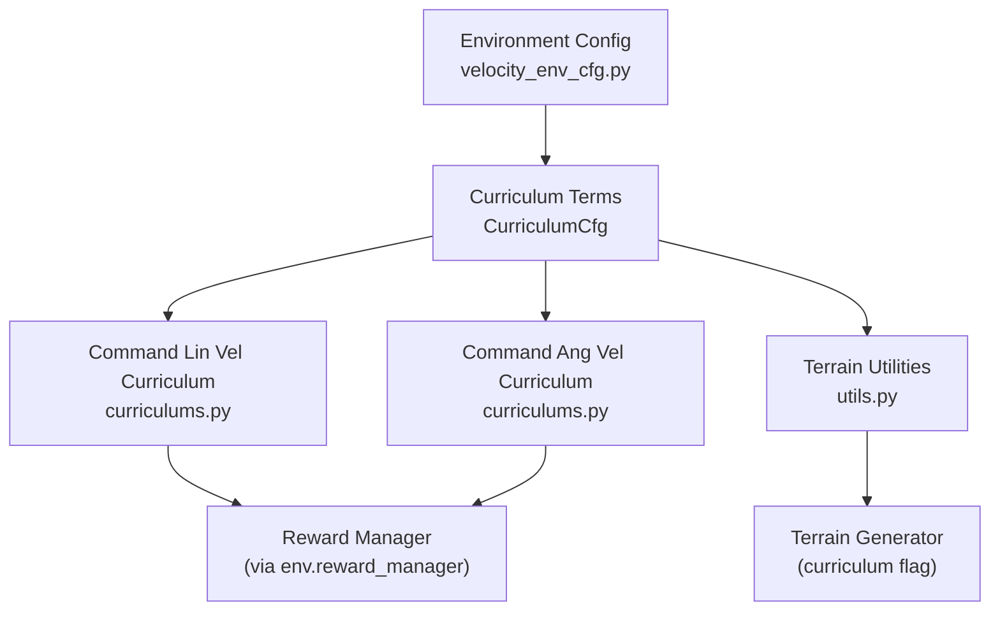
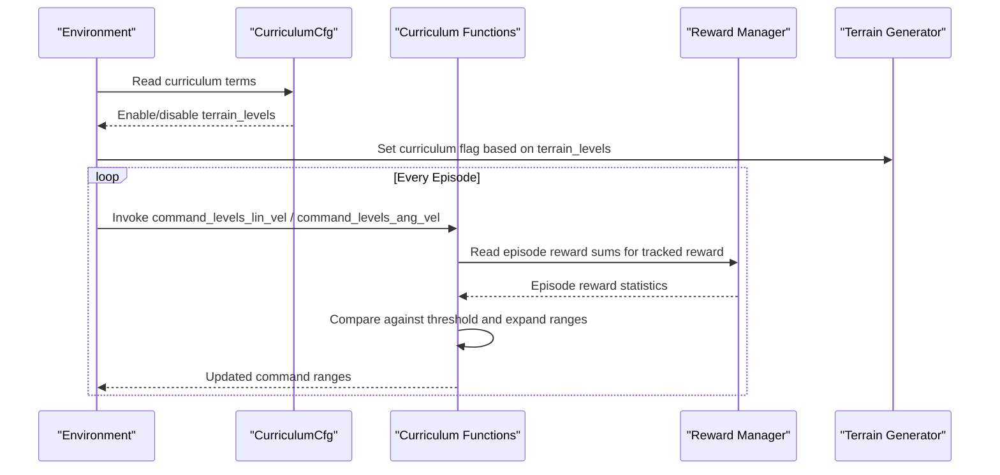
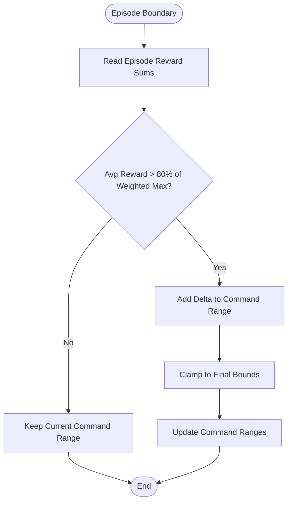
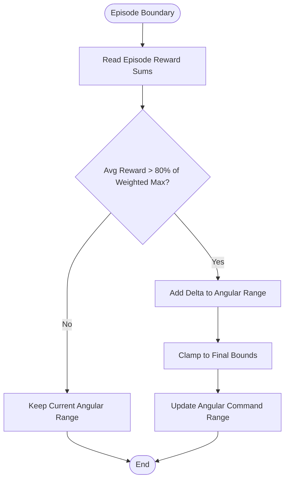
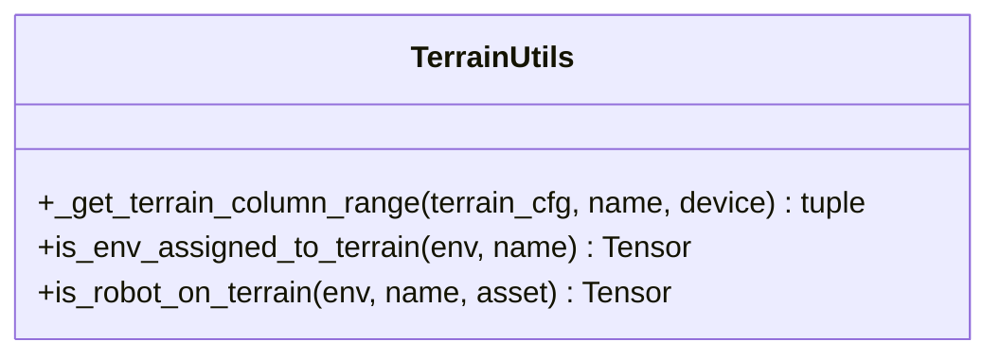
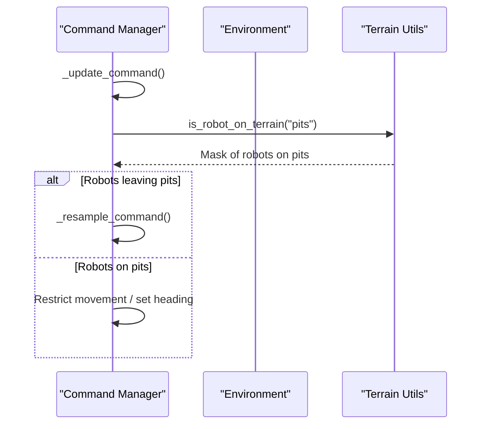
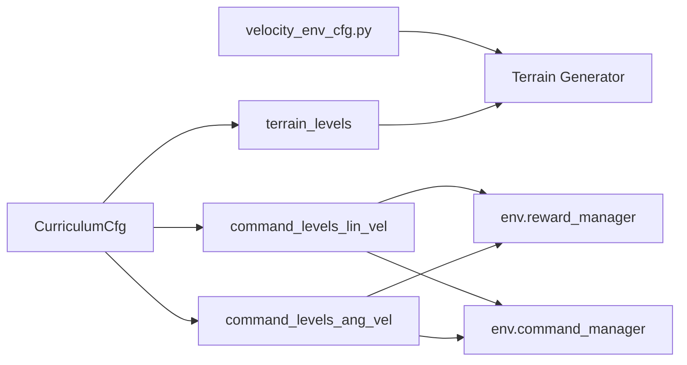

# Curriculum Learning and Difficulty Progression

<cite>
**Referenced Files in This Document**
- [curriculums.py](file://source/robot_lab/robot_lab/tasks/manager_based/locomotion/velocity/mdp/curriculums.py)
- [velocity_env_cfg.py](file://source/robot_lab/robot_lab/tasks/manager_based/locomotion/velocity/velocity_env_cfg.py)
- [utils.py](file://source/robot_lab/robot_lab/tasks/manager_based/locomotion/velocity/mdp/utils.py)
- [commands.py](file://source/robot_lab/robot_lab/tasks/manager_based/locomotion/velocity/mdp/commands.py)
- [cusrl_ppo_cfg.py](file://source/robot_lab/robot_lab/tasks/manager_based/locomotion/velocity/config/humanoid/booster_t1/agents/cusrl_ppo_cfg.py)
</cite>

## Table of Contents
1. [Introduction](#introduction)
2. [Project Structure](#project-structure)
3. [Core Components](#core-components)
4. [Architecture Overview](#architecture-overview)
5. [Detailed Component Analysis](#detailed-component-analysis)
6. [Dependency Analysis](#dependency-analysis)
7. [Performance Considerations](#performance-considerations)
8. [Troubleshooting Guide](#troubleshooting-guide)
9. [Conclusion](#conclusion)

## Introduction
This document explains the curriculum learning and difficulty progression systems used in the repository’s locomotion velocity-tracking environments. It focuses on:
- The CurriculumCfg class and its curriculum terms for terrain difficulty and command space expansion
- Adaptive difficulty scaling driven by reward performance
- Integration with terrain generators and command spaces
- Practical examples, progression strategies, and monitoring approaches
- Common pitfalls and best practices for stable training during difficulty increases

## Project Structure
The curriculum system spans configuration, MDP utilities, and runtime helpers:
- Curriculum configuration is declared in the environment configuration class
- Runtime curriculum logic is implemented in dedicated MDP modules
- Terrain-aware utilities support curriculum-driven terrain selection and filtering
- Command-space helpers adapt command ranges based on performance

**Diagram sources**
- [velocity_env_cfg.py](file://source/robot_lab/robot_lab/tasks/manager_based/locomotion/velocity/velocity_env_cfg.py#L668-L744)
- [curriculums.py](file://source/robot_lab/robot_lab/tasks/manager_based/locomotion/velocity/mdp/curriculums.py#L20-L96)
- [utils.py](file://source/robot_lab/robot_lab/tasks/manager_based/locomotion/velocity/mdp/utils.py#L42-L126)

**Section sources**
- [velocity_env_cfg.py](file://source/robot_lab/robot_lab/tasks/manager_based/locomotion/velocity/velocity_env_cfg.py#L668-L744)

## Core Components
- CurriculumCfg: Declares curriculum terms for terrain difficulty and command space expansion. It enables:
  - terrain_levels: Progressive terrain difficulty via a terrain generator curriculum flag
  - command_levels_lin_vel: Adaptive linear velocity command range based on reward performance
  - command_levels_ang_vel: Adaptive angular velocity command range based on reward performance
- Runtime curriculum functions:
  - command_levels_lin_vel: Initializes and expands command ranges based on episode reward performance
  - command_levels_ang_vel: Similar logic for angular velocity command range
- Terrain utilities:
  - is_env_assigned_to_terrain: Determines which environments are initially assigned to a terrain type
  - is_robot_on_terrain: Detects whether robots are currently on a specific terrain type
  - _get_terrain_column_range: Computes column ranges for terrain types in the generator grid

**Section sources**
- [velocity_env_cfg.py](file://source/robot_lab/robot_lab/tasks/manager_based/locomotion/velocity/velocity_env_cfg.py#L668-L744)
- [curriculums.py](file://source/robot_lab/robot_lab/tasks/manager_based/locomotion/velocity/mdp/curriculums.py#L20-L96)
- [utils.py](file://source/robot_lab/robot_lab/tasks/manager_based/locomotion/velocity/mdp/utils.py#L42-L126)

## Architecture Overview
The curriculum system integrates three pillars:
- Configuration: CurriculumCfg defines which curriculum terms are active
- Runtime: Curriculum functions adjust command ranges and terrain difficulty
- Environment wiring: The environment configuration toggles the terrain generator’s curriculum flag

**Diagram sources**
- [velocity_env_cfg.py](file://source/robot_lab/robot_lab/tasks/manager_based/locomotion/velocity/velocity_env_cfg.py#L728-L735)
- [curriculums.py](file://source/robot_lab/robot_lab/tasks/manager_based/locomotion/velocity/mdp/curriculums.py#L42-L58)

## Detailed Component Analysis

### CurriculumCfg and Terrain Integration
- terrain_levels activates a curriculum term that toggles the terrain generator’s curriculum flag. When enabled, the terrain generator produces progressively difficult terrains.
- The environment configuration explicitly checks for the presence of the terrain_levels term and sets the terrain generator’s curriculum flag accordingly.

Practical implication:
- Enabling terrain_levels ensures the terrain generator participates in difficulty progression
- Disabling it keeps the generator static

**Section sources**
- [velocity_env_cfg.py](file://source/robot_lab/robot_lab/tasks/manager_based/locomotion/velocity/velocity_env_cfg.py#L728-L735)

### Command Space Expansion: Linear Velocity
The function initializes command ranges once and then periodically evaluates reward performance to expand the command space.

Key mechanics:
- Initialization: On the first step, the function captures the original command ranges and computes initial/final ranges using a multiplier pair
- Periodic evaluation: At episode boundaries, it reads episode reward sums for a named reward term and compares against a weighted threshold
- Expansion: If performance exceeds the threshold, it expands the command ranges by a fixed delta while clamping to final bounds
- Return: Provides the current maximum command range for downstream use

**Diagram sources**
- [curriculums.py](file://source/robot_lab/robot_lab/tasks/manager_based/locomotion/velocity/mdp/curriculums.py#L42-L58)

**Section sources**
- [curriculums.py](file://source/robot_lab/robot_lab/tasks/manager_based/locomotion/velocity/mdp/curriculums.py#L20-L60)

### Command Space Expansion: Angular Velocity
Similar to linear velocity, the angular velocity function:
- Initializes angular command ranges using the same multiplier scheme
- Expands ranges at episode boundaries when reward performance exceeds the threshold
- Clamps to final bounds and updates the command manager

**Diagram sources**
- [curriculums.py](file://source/robot_lab/robot_lab/tasks/manager_based/locomotion/velocity/mdp/curriculums.py#L81-L94)

**Section sources**
- [curriculums.py](file://source/robot_lab/robot_lab/tasks/manager_based/locomotion/velocity/mdp/curriculums.py#L63-L96)

### Terrain Utilities and Command-Aware Behavior
Terrain utilities support:
- Determining which environments are initially assigned to a terrain type
- Detecting whether robots are currently on a specific terrain type
- Computing column ranges for terrain types in the generator grid

These utilities underpin terrain-aware command updates and terrain progression.

**Diagram sources**
- [utils.py](file://source/robot_lab/robot_lab/tasks/manager_based/locomotion/velocity/mdp/utils.py#L15-L126)

**Section sources**
- [utils.py](file://source/robot_lab/robot_lab/tasks/manager_based/locomotion/velocity/mdp/utils.py#L42-L126)

### Command-Aware Updates
Commands are resampled and updated with terrain-aware restrictions. For example, when robots are on “pits,” movement can be restricted and headings adjusted, and upon leaving pits, commands are resampled.

**Diagram sources**
- [commands.py](file://source/robot_lab/robot_lab/tasks/manager_based/locomotion/velocity/mdp/commands.py#L48-L68)

**Section sources**
- [commands.py](file://source/robot_lab/robot_lab/tasks/manager_based/locomotion/velocity/mdp/commands.py#L42-L68)

## Dependency Analysis
- CurriculumCfg depends on:
  - mdp.terrain_levels_vel for terrain difficulty progression
  - mdp.command_levels_lin_vel and mdp.command_levels_ang_vel for command space expansion
- Runtime curriculum functions depend on:
  - env.reward_manager for episode reward sums
  - env.command_manager for command range configuration
  - env.common_step_counter and env.max_episode_length for periodic updates
- Environment configuration toggles:
  - terrain generator curriculum flag based on terrain_levels presence

**Diagram sources**
- [velocity_env_cfg.py](file://source/robot_lab/robot_lab/tasks/manager_based/locomotion/velocity/velocity_env_cfg.py#L668-L744)
- [curriculums.py](file://source/robot_lab/robot_lab/tasks/manager_based/locomotion/velocity/mdp/curriculums.py#L20-L96)

**Section sources**
- [velocity_env_cfg.py](file://source/robot_lab/robot_lab/tasks/manager_based/locomotion/velocity/velocity_env_cfg.py#L668-L744)
- [curriculums.py](file://source/robot_lab/robot_lab/tasks/manager_based/locomotion/velocity/mdp/curriculums.py#L20-L96)

## Performance Considerations
- Update cadence: Curriculum updates occur at episode boundaries to avoid frequent reconfiguration and reduce overhead
- Threshold tuning: The 80% threshold balances stability and progression speed; lowering it accelerates difficulty but risks instability
- Range deltas: Small increments maintain smooth adaptation; larger steps risk overshooting capabilities
- Reward normalization: Using weighted thresholds accounts for reward scaling differences across tasks

[No sources needed since this section provides general guidance]

## Troubleshooting Guide
Common issues and remedies:
- No difficulty progression
  - Ensure terrain_levels is present in CurriculumCfg and that the environment configuration enables the terrain generator’s curriculum flag
  - Verify that the terrain generator supports curriculum mode
- Commands not expanding
  - Confirm the reward term name in command curriculum parameters matches the tracked reward
  - Check that episode reward sums are populated and that thresholds are reachable given current weights
- Stalls at low performance
  - Reduce the threshold or adjust reward weights to improve progress signals
  - Consider reducing range deltas to prevent large jumps
- Instability during difficulty increases
  - Add smoothing by decoupling terrain difficulty from command expansion
  - Monitor episode lengths and ensure sufficient samples before adapting

**Section sources**
- [velocity_env_cfg.py](file://source/robot_lab/robot_lab/tasks/manager_based/locomotion/velocity/velocity_env_cfg.py#L728-L735)
- [curriculums.py](file://source/robot_lab/robot_lab/tasks/manager_based/locomotion/velocity/mdp/curriculums.py#L42-L58)

## Conclusion
The curriculum system combines configurable terrain difficulty with adaptive command space expansion guided by reward performance. By initializing ranges carefully, evaluating performance at episode boundaries, and clamping expansions to final bounds, the system promotes steady, stable progress. Integrating terrain utilities and terrain-aware command updates further aligns difficulty progression with environment dynamics. Proper configuration and monitoring ensure robust training across diverse locomotion tasks.