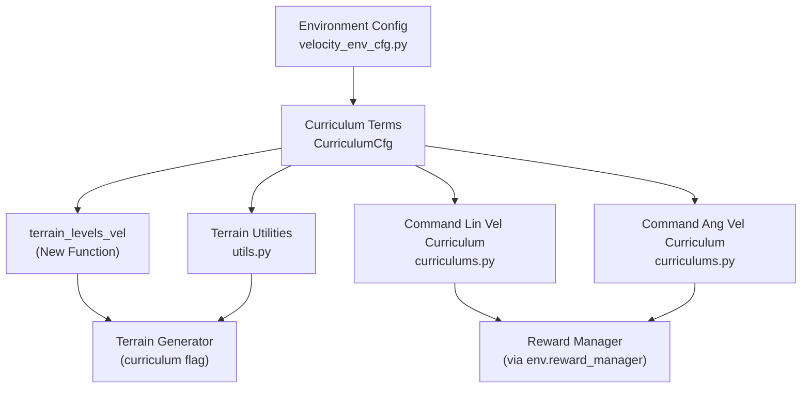
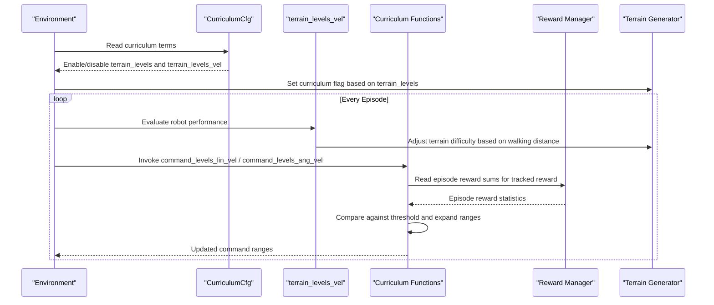
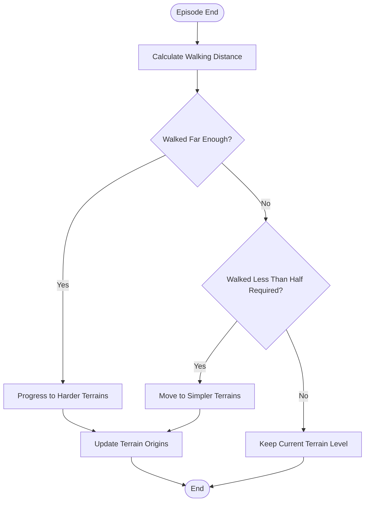
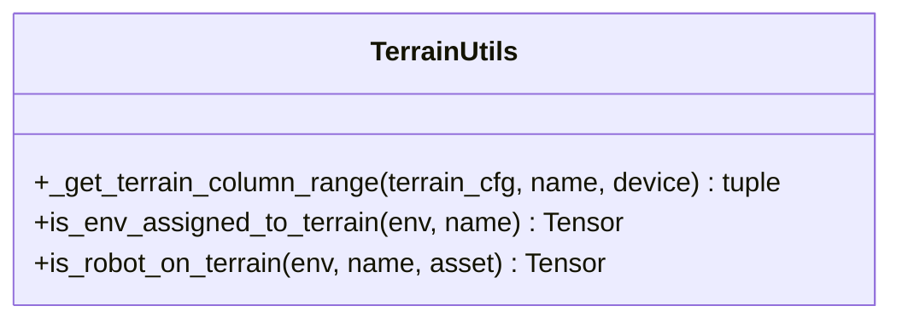
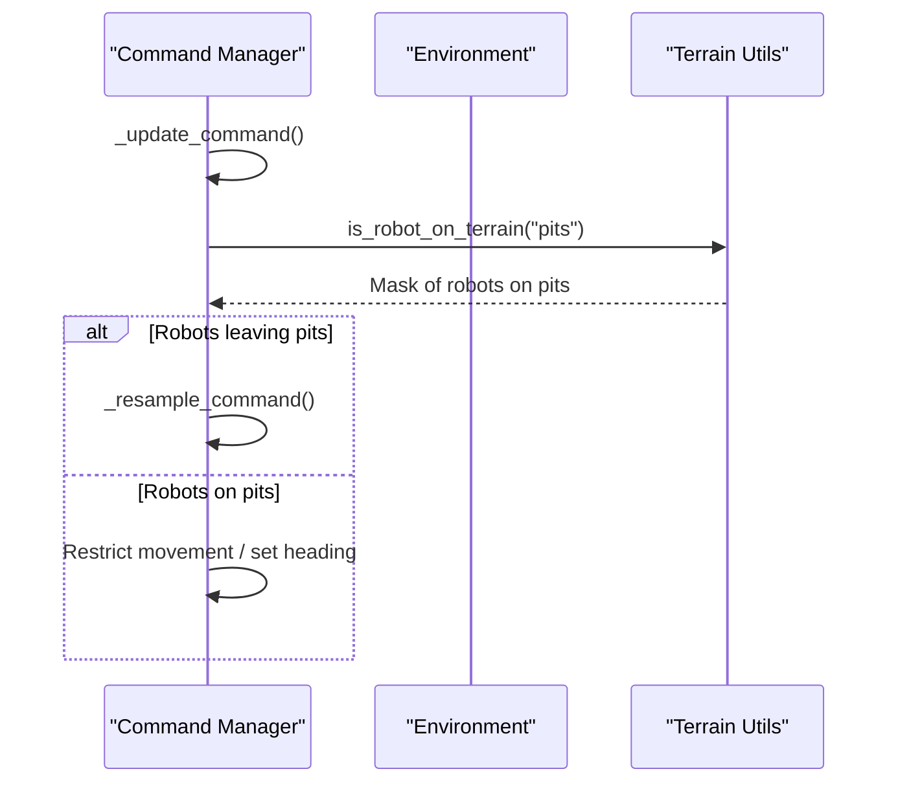
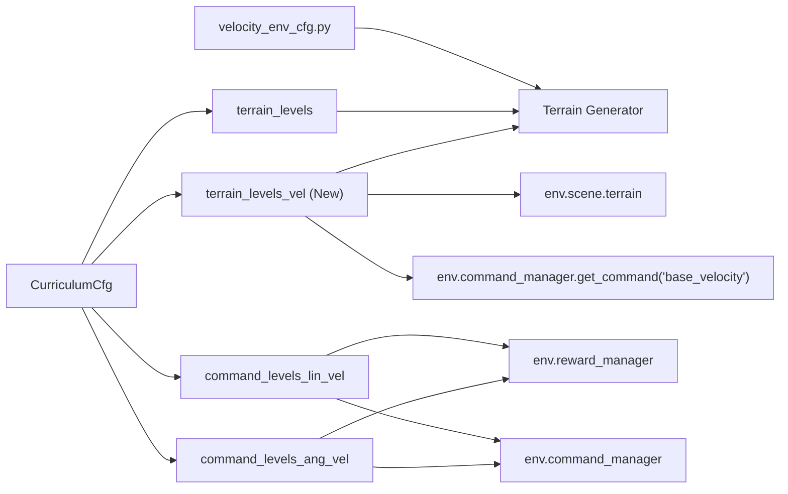

# Curriculum Learning and Difficulty Progression

<cite>
**Referenced Files in This Document**
- [curriculums.py](file://source/robot_lab/robot_lab/tasks/manager_based/locomotion/velocity/mdp/curriculums.py)
- [velocity_env_cfg.py](file://source/robot_lab/robot_lab/tasks/manager_based/locomotion/velocity/velocity_env_cfg.py)
- [utils.py](file://source/robot_lab/robot_lab/tasks/manager_based/locomotion/velocity/mdp/utils.py)
- [commands.py](file://source/robot_lab/robot_lab/tasks/manager_based/locomotion/velocity/mdp/commands.py)
- [cusrl_ppo_cfg.py](file://source/robot_lab/robot_lab/tasks/manager_based/locomotion/velocity/config/humanoid/booster_t1/agents/cusrl_ppo_cfg.py)
- [unitree_go2/flat_env_cfg.py](file://source/robot_lab/robot_lab/tasks/manager_based/locomotion/velocity/config/quadruped/unitree_go2/flat_env_cfg.py)
- [unitree_go2/rough_env_cfg.py](file://source/robot_lab/robot_lab/tasks/manager_based/locomotion/velocity/config/quadruped/unitree_go2/rough_env_cfg.py)
- [zsibot_zsl1/flat_env_cfg.py](file://source/robot_lab/robot_lab/tasks/manager_based/locomotion/velocity/config/quadruped/zsibot_zsl1/flat_env_cfg.py)
- [zsibot_zsl1/rough_env_cfg.py](file://source/robot_lab/robot_lab/tasks/manager_based/locomotion/velocity/config/quadruped/zsibot_zsl1/rough_env_cfg.py)
- [unitree_go2_parkour/rough_env_cfg.py](file://source/robot_lab/robot_lab/tasks/manager_based/locomotion/velocity/config/quadruped/unitree_go2_parkour/rough_env_cfg.py)
- [zsibot_zsl1_parkour/rough_env_cfg.py](file://source/robot_lab/robot_lab/tasks/manager_based/locomotion/velocity/config/quadruped/zsibot_zsl1_parkour/rough_env_cfg.py)
</cite>

## Update Summary
**Changes Made**
- Added documentation for the new `terrain_levels_vel` function that automatically adjusts terrain difficulty based on actual robot performance
- Updated configuration examples for Go2 and ZSL1 platforms with improved parameter handling
- Enhanced curriculum system documentation to include adaptive difficulty scaling based on real robot locomotion performance
- Added examples of curriculum configuration, progression schedules, and monitoring difficulty adaptation
- Updated troubleshooting guide with new function-specific considerations

## Table of Contents
1. [Introduction](#introduction)
2. [Project Structure](#project-structure)
3. [Core Components](#core-components)
4. [Architecture Overview](#architecture-overview)
5. [Detailed Component Analysis](#detailed-component-analysis)
6. [Dependency Analysis](#dependency-analysis)
7. [Performance Considerations](#performance-considerations)
8. [Troubleshooting Guide](#troubleshooting-guide)
9. [Conclusion](#conclusion)

## Introduction
This document explains the curriculum learning and difficulty progression systems used in the repository's locomotion velocity-tracking environments. It focuses on:
- The CurriculumCfg class and its curriculum terms for terrain difficulty and command space expansion
- **New**: The `terrain_levels_vel` function that automatically adjusts terrain difficulty based on actual robot performance during locomotion tasks
- Adaptive difficulty scaling driven by reward performance
- Integration with terrain generators and command spaces
- Practical examples, progression strategies, and monitoring approaches
- Common pitfalls and best practices for stable training during difficulty increases

## Project Structure
The curriculum system spans configuration, MDP utilities, and runtime helpers:
- Curriculum configuration is declared in the environment configuration class
- Runtime curriculum logic is implemented in dedicated MDP modules
- Terrain-aware utilities support curriculum-driven terrain selection and filtering
- Command-space helpers adapt command ranges based on performance
- **New**: Performance-based terrain difficulty adjustment using robot movement metrics

**Diagram sources**
- [velocity_env_cfg.py:788-812](file://source/robot_lab/robot_lab/tasks/manager_based/locomotion/velocity/velocity_env_cfg.py#L788-L812)
- [curriculums.py:103-134](file://source/robot_lab/robot_lab/tasks/manager_based/locomotion/velocity/mdp/curriculums.py#L103-L134)
- [utils.py:42-126](file://source/robot_lab/robot_lab/tasks/manager_based/locomotion/velocity/mdp/utils.py#L42-L126)

**Section sources**
- [velocity_env_cfg.py:788-812](file://source/robot_lab/robot_lab/tasks/manager_based/locomotion/velocity/velocity_env_cfg.py#L788-L812)

## Core Components
- **CurriculumCfg**: Declares curriculum terms for terrain difficulty and command space expansion. It enables:
  - **terrain_levels**: Progressive terrain difficulty via a terrain generator curriculum flag
  - **terrain_levels_vel**: **NEW** Performance-based terrain difficulty that adjusts based on actual robot walking distance
  - **command_levels_lin_vel**: Adaptive linear velocity command range based on reward performance
  - **command_levels_ang_vel**: Adaptive angular velocity command range based on reward performance
- **Runtime curriculum functions**:
  - **terrain_levels_vel**: **NEW** Automatically adjusts terrain difficulty based on robot's actual locomotion performance
  - command_levels_lin_vel: Initializes and expands command ranges based on episode reward performance
  - command_levels_ang_vel: Similar logic for angular velocity command range
- **Terrain utilities**:
  - is_env_assigned_to_terrain: Determines which environments are initially assigned to a terrain type
  - is_robot_on_terrain: Detects whether robots are currently on a specific terrain type
  - _get_terrain_column_range: Computes column ranges for terrain types in the generator grid

**Section sources**
- [velocity_env_cfg.py:788-812](file://source/robot_lab/robot_lab/tasks/manager_based/locomotion/velocity/velocity_env_cfg.py#L788-L812)
- [curriculums.py:103-134](file://source/robot_lab/robot_lab/tasks/manager_based/locomotion/velocity/mdp/curriculums.py#L103-L134)
- [utils.py:42-126](file://source/robot_lab/robot_lab/tasks/manager_based/locomotion/velocity/mdp/utils.py#L42-L126)

## Architecture Overview
The curriculum system integrates four pillars:
- Configuration: CurriculumCfg defines which curriculum terms are active
- **Runtime**: Curriculum functions adjust command ranges, terrain difficulty, and performance-based progression
- Environment wiring: The environment configuration toggles the terrain generator's curriculum flag
- **Performance Monitoring**: Real-time tracking of robot locomotion performance for adaptive difficulty adjustment

**Diagram sources**
- [velocity_env_cfg.py:853-860](file://source/robot_lab/robot_lab/tasks/manager_based/locomotion/velocity/velocity_env_cfg.py#L853-L860)
- [curriculums.py:103-134](file://source/robot_lab/robot_lab/tasks/manager_based/locomotion/velocity/mdp/curriculums.py#L103-L134)
- [curriculums.py:42-58](file://source/robot_lab/robot_lab/tasks/manager_based/locomotion/velocity/mdp/curriculums.py#L42-L58)

## Detailed Component Analysis

### Enhanced Curriculum System with Performance-Based Terrain Adjustment

#### terrain_levels_vel: Performance-Based Terrain Difficulty
**NEW** The `terrain_levels_vel` function provides adaptive terrain difficulty based on actual robot locomotion performance rather than just command-based expectations.

Key mechanics:
- **Distance Calculation**: Computes the actual distance the robot walked using root position differences
- **Performance Evaluation**: Compares actual walking distance with commanded velocity requirements
- **Adaptive Progression**: 
  - Robots that walked far enough progress to harder terrains
  - Robots that walked less than half the required distance go to simpler terrains
- **Terrain Level Updates**: Uses `terrain.update_env_origins()` to adjust terrain difficulty dynamically

**Diagram sources**
- [curriculums.py:124-133](file://source/robot_lab/robot_lab/tasks/manager_based/locomotion/velocity/mdp/curriculums.py#L124-L133)

**Section sources**
- [curriculums.py:103-134](file://source/robot_lab/robot_lab/tasks/manager_based/locomotion/velocity/mdp/curriculums.py#L103-L134)

### CurriculumCfg and Terrain Integration
- **terrain_levels**: Activates a curriculum term that toggles the terrain generator's curriculum flag. When enabled, the terrain generator produces progressively difficult terrains.
- **terrain_levels_vel**: **NEW** Activates performance-based terrain difficulty that adjusts based on actual robot performance.
- The environment configuration explicitly checks for the presence of the terrain_levels and terrain_levels_vel terms and sets the terrain generator's curriculum flag accordingly.

Practical implications:
- Enabling terrain_levels ensures the terrain generator participates in difficulty progression
- Enabling terrain_levels_vel provides performance-based difficulty adjustment
- Disabling either keeps the respective generator static

**Section sources**
- [velocity_env_cfg.py:793-796](file://source/robot_lab/robot_lab/tasks/manager_based/locomotion/velocity/velocity_env_cfg.py#L793-L796)
- [velocity_env_cfg.py:853-860](file://source/robot_lab/robot_lab/tasks/manager_based/locomotion/velocity/velocity_env_cfg.py#L853-L860)

### Command Space Expansion: Linear Velocity
The function initializes command ranges once and then periodically evaluates reward performance to expand the command space.

Key mechanics:
- Initialization: On the first step, the function captures the original command ranges and computes initial/final ranges using a multiplier pair
- Periodic evaluation: At episode boundaries, it reads episode reward sums for a named reward term and compares against a weighted threshold
- Expansion: If performance exceeds the threshold, it expands the command ranges by a fixed delta while clamping to final bounds
- Return: Provides the current maximum command range for downstream use

**Diagram sources**
- [curriculums.py:42-58](file://source/robot_lab/robot_lab/tasks/manager_based/locomotion/velocity/mdp/curriculums.py#L42-L58)

**Section sources**
- [curriculums.py:25-65](file://source/robot_lab/robot_lab/tasks/manager_based/locomotion/velocity/mdp/curriculums.py#L25-L65)

### Command Space Expansion: Angular Velocity
Similar to linear velocity, the angular velocity function:
- Initializes angular command ranges using the same multiplier scheme
- Expands ranges at episode boundaries when reward performance exceeds the threshold
- Clamps to final bounds and updates the command manager

**Diagram sources**
- [curriculums.py:86-99](file://source/robot_lab/robot_lab/tasks/manager_based/locomotion/velocity/mdp/curriculums.py#L86-L99)

**Section sources**
- [curriculums.py:68-101](file://source/robot_lab/robot_lab/tasks/manager_based/locomotion/velocity/mdp/curriculums.py#L68-L101)

### Platform-Specific Configuration Examples

#### Go2 Platform Configuration
The Go2 platform configuration demonstrates improved parameter handling and curriculum integration:

**Flat Environment Configuration**:
- Terrain type set to "plane" for controlled training
- Terrain generator disabled to prevent automatic difficulty progression
- Height scanner disabled for simplified observations
- Terrain curriculum disabled to focus on command-based training

**Rough Environment Configuration**:
- Full robot configuration with joint names and action scaling
- Comprehensive reward system with velocity tracking and contact penalties
- Curriculum terms disabled by default for stable baseline training
- Parameterized action scaling and joint limits for performance optimization

**Section sources**
- [unitree_go2/flat_env_cfg.py:10-29](file://source/robot_lab/robot_lab/tasks/manager_based/locomotion/velocity/config/quadruped/unitree_go2/flat_env_cfg.py#L10-L29)
- [unitree_go2/rough_env_cfg.py:18-167](file://source/robot_lab/robot_lab/tasks/manager_based/locomotion/velocity/config/quadruped/unitree_go2/rough_env_cfg.py#L18-L167)

#### ZSL1 Platform Configuration
The ZSL1 platform configuration follows similar patterns with platform-specific parameters:

**Flat Environment Configuration**:
- Identical structure to Go2 flat configuration
- Platform-specific joint naming conventions
- Optimized reward weights for ZSL1 dynamics

**Rough Environment Configuration**:
- ZSL1-specific joint names and mirror configurations
- Platform-specific reward balancing for quadruped locomotion
- Curriculum flexibility for different training scenarios

**Section sources**
- [zsibot_zsl1/flat_env_cfg.py:10-29](file://source/robot_lab/robot_lab/tasks/manager_based/locomotion/velocity/config/quadruped/zsibot_zsl1/flat_env_cfg.py#L10-L29)
- [zsibot_zsl1/rough_env_cfg.py:15-166](file://source/robot_lab/robot_lab/tasks/manager_based/locomotion/velocity/config/quadruped/zsibot_zsl1/rough_env_cfg.py#L15-L166)

### Parkour-Specific Curriculum Integration
Both Go2 and ZSL1 parkour configurations demonstrate advanced curriculum integration:

**Performance-Based Terrain Adjustment**:
- Terrain curriculum disabled in parkour variants for controlled obstacle training
- Flat terrain configurations for basic locomotion skills
- Advanced reward systems tailored for parkour-specific objectives

**Section sources**
- [unitree_go2_parkour/rough_env_cfg.py:540-568](file://source/robot_lab/robot_lab/tasks/manager_based/locomotion/velocity/config/quadruped/unitree_go2_parkour/rough_env_cfg.py#L540-L568)
- [zsibot_zsl1_parkour/rough_env_cfg.py:513-545](file://source/robot_lab/robot_lab/tasks/manager_based/locomotion/velocity/config/quadruped/zsibot_zsl1_parkour/rough_env_cfg.py#L513-L545)

### Terrain Utilities and Command-Aware Behavior
Terrain utilities support:
- Determining which environments are initially assigned to a terrain type
- Detecting whether robots are currently on a specific terrain type
- Computing column ranges for terrain types in the generator grid

These utilities underpin terrain-aware command updates and terrain progression.

**Diagram sources**
- [utils.py:15-126](file://source/robot_lab/robot_lab/tasks/manager_based/locomotion/velocity/mdp/utils.py#L15-L126)

**Section sources**
- [utils.py:42-126](file://source/robot_lab/robot_lab/tasks/manager_based/locomotion/velocity/mdp/utils.py#L42-L126)

### Command-Aware Updates
Commands are resampled and updated with terrain-aware restrictions. For example, when robots are on "pits," movement can be restricted and headings adjusted, and upon leaving pits, commands are resampled.

**Diagram sources**
- [commands.py:48-68](file://source/robot_lab/robot_lab/tasks/manager_based/locomotion/velocity/mdp/commands.py#L48-L68)

**Section sources**
- [commands.py:42-68](file://source/robot_lab/robot_lab/tasks/manager_based/locomotion/velocity/mdp/commands.py#L42-L68)

## Dependency Analysis
- **CurriculumCfg depends on**:
  - mdp.terrain_levels_vel for performance-based terrain difficulty progression
  - mdp.command_levels_lin_vel and mdp.command_levels_ang_vel for command space expansion
- **Runtime curriculum functions depend on**:
  - env.reward_manager for episode reward sums
  - env.command_manager for command range configuration
  - env.common_step_counter and env.max_episode_length for periodic updates
  - **NEW**: env.scene.terrain for performance-based terrain level updates
  - **NEW**: env.command_manager.get_command("base_velocity") for velocity tracking
- **Environment configuration toggles**:
  - terrain generator curriculum flag based on terrain_levels presence
  - **NEW**: terrain_levels_vel performance monitoring integration

**Diagram sources**
- [velocity_env_cfg.py:788-812](file://source/robot_lab/robot_lab/tasks/manager_based/locomotion/velocity/velocity_env_cfg.py#L788-L812)
- [curriculums.py:103-134](file://source/robot_lab/robot_lab/tasks/manager_based/locomotion/velocity/mdp/curriculums.py#L103-L134)

**Section sources**
- [velocity_env_cfg.py:788-812](file://source/robot_lab/robot_lab/tasks/manager_based/locomotion/velocity/velocity_env_cfg.py#L788-L812)
- [curriculums.py:103-134](file://source/robot_lab/robot_lab/tasks/manager_based/locomotion/velocity/mdp/curriculums.py#L103-L134)

## Performance Considerations
- **Update cadence**: Curriculum updates occur at episode boundaries to avoid frequent reconfiguration and reduce overhead
- **Threshold tuning**: The 80% threshold balances stability and progression speed; lowering it accelerates difficulty but risks instability
- **Range deltas**: Small increments maintain smooth adaptation; larger steps risk overshooting capabilities
- **Reward normalization**: Using weighted thresholds accounts for reward scaling differences across tasks
- **Performance-based progression**: **NEW** The `terrain_levels_vel` function provides more realistic difficulty progression based on actual robot capabilities
- **Computational efficiency**: **NEW** Performance calculations use vectorized operations for batch processing across environments

## Troubleshooting Guide
Common issues and remedies:
- **No difficulty progression**
  - Ensure terrain_levels is present in CurriculumCfg and that the environment configuration enables the terrain generator's curriculum flag
  - Verify that the terrain generator supports curriculum mode
  - **NEW**: For performance-based progression, ensure terrain_levels_vel is enabled and terrain generator has proper size configuration
- **Commands not expanding**
  - Confirm the reward term name in command curriculum parameters matches the tracked reward
  - Check that episode reward sums are populated and that thresholds are reachable given current weights
- **Stalls at low performance**
  - Reduce the threshold or adjust reward weights to improve progress signals
  - Consider reducing range deltas to prevent large jumps
  - **NEW**: For performance-based terrain, verify that robots are actually moving and not stuck in place
- **Instability during difficulty increases**
  - Add smoothing by decoupling terrain difficulty from command expansion
  - Monitor episode lengths and ensure sufficient samples before adapting
  - **NEW**: For performance-based terrain, consider adjusting the distance thresholds to match robot capabilities
- **Platform-specific issues**
  - **Go2/ZSL1**: Verify joint names and mirror configurations match robot specifications
  - **Parkour variants**: Ensure terrain curriculum is disabled for obstacle-specific training
  - **Action scaling**: Check that platform-specific action scales are appropriate for robot dynamics

**Section sources**
- [velocity_env_cfg.py:853-860](file://source/robot_lab/robot_lab/tasks/manager_based/locomotion/velocity/velocity_env_cfg.py#L853-L860)
- [curriculums.py:124-133](file://source/robot_lab/robot_lab/tasks/manager_based/locomotion/velocity/mdp/curriculums.py#L124-L133)
- [unitree_go2/rough_env_cfg.py:157-161](file://source/robot_lab/robot_lab/tasks/manager_based/locomotion/velocity/config/quadruped/unitree_go2/rough_env_cfg.py#L157-L161)
- [zsibot_zsl1/rough_env_cfg.py:156-160](file://source/robot_lab/robot_lab/tasks/manager_based/locomotion/velocity/config/quadruped/zsibot_zsl1/rough_env_cfg.py#L156-L160)

## Conclusion
The curriculum system combines configurable terrain difficulty with adaptive command space expansion and **NEW** performance-based terrain progression guided by reward performance. The enhanced `terrain_levels_vel` function provides more realistic difficulty adjustment by monitoring actual robot locomotion performance rather than just command expectations. By initializing ranges carefully, evaluating performance at episode boundaries, and clamping expansions to final bounds, the system promotes steady, stable progress. Integrating terrain utilities and terrain-aware command updates further aligns difficulty progression with environment dynamics. The platform-specific configurations for Go2 and ZSL1 demonstrate optimal parameter handling for different robot types. Proper configuration and monitoring ensure robust training across diverse locomotion tasks, from basic flat terrain to complex parkour scenarios.