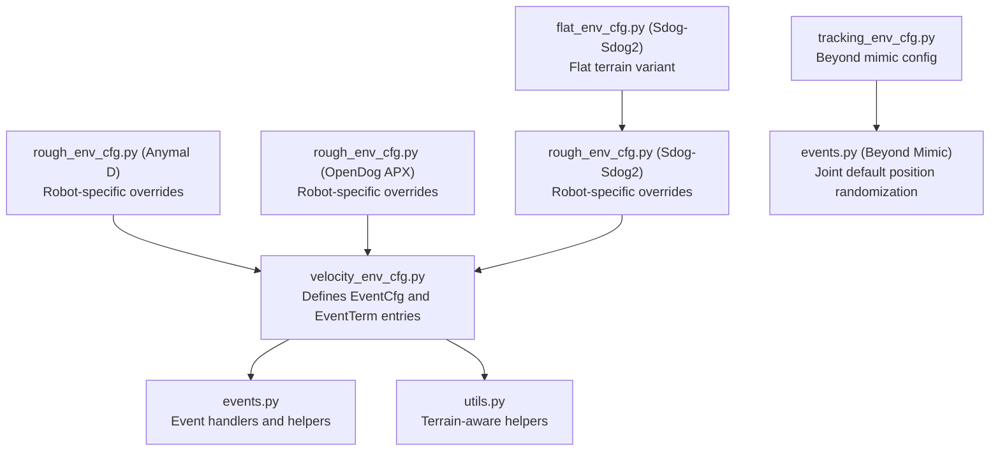
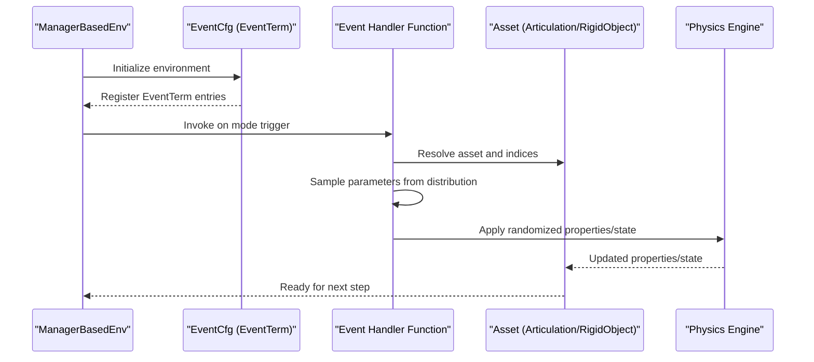
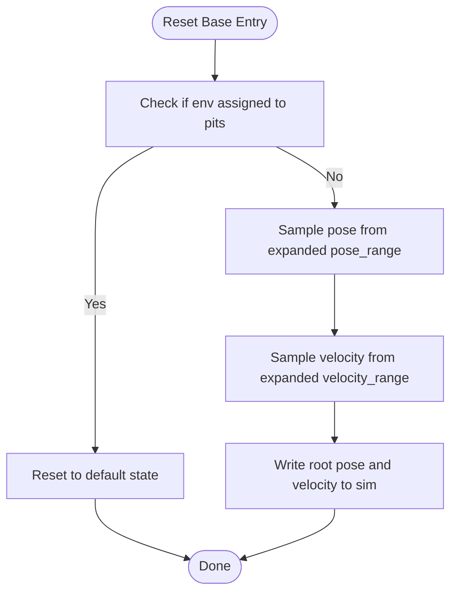
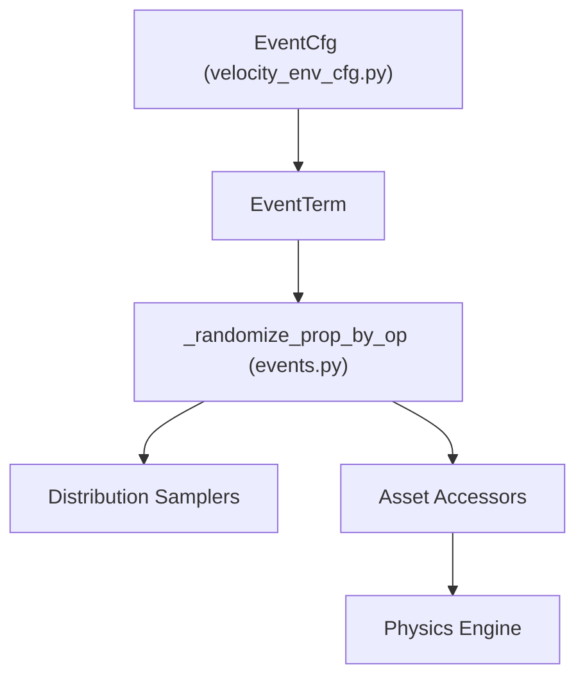

# Environment Events and Randomization

<cite>
**Referenced Files in This Document**
- [velocity_env_cfg.py](file://source/robot_lab/robot_lab/tasks/manager_based/locomotion/velocity/velocity_env_cfg.py)
- [events.py](file://source/robot_lab/robot_lab/tasks/manager_based/locomotion/velocity/mdp/events.py)
- [utils.py](file://source/robot_lab/robot_lab/tasks/manager_based/locomotion/velocity/mdp/utils.py)
- [rough_env_cfg.py (Anymal D)](file://source/robot_lab/robot_lab/tasks/manager_based/locomotion/velocity/config/quadruped/anymal_d/rough_env_cfg.py)
- [rough_env_cfg.py (OpenDog APX)](file://source/robot_lab/robot_lab/tasks/manager_based/locomotion/velocity/config/quadruped/opendoge_apx/rough_env_cfg.py)
- [rough_env_cfg.py (Sdog-Sdog2)](file://source/robot_lab/robot_lab/tasks/manager_based/locomotion/velocity/config/quadruped/sdog_sdog2/rough_env_cfg.py)
- [flat_env_cfg.py (Sdog-Sdog2)](file://source/robot_lab/robot_lab/tasks/manager_based/locomotion/velocity/config/quadruped/sdog_sdog2/flat_env_cfg.py)
- [tracking_env_cfg.py](file://source/robot_lab/robot_lab/tasks/manager_based/beyondmimic/tracking_env_cfg.py)
- [events.py (Beyond Mimic)](file://source/robot_lab/robot_lab/tasks/manager_based/beyondmimic/mdp/events.py)
</cite>

## Update Summary
**Changes Made**
- Updated reset parameter ranges for Sdog-Sdog2 configurations with expanded pose and velocity ranges
- Added documentation for external force torque randomization removal from Sdog-Sdog2 configurations
- Enhanced reset base parameter documentation with expanded ranges

## Table of Contents
1. [Introduction](#introduction)
2. [Project Structure](#project-structure)
3. [Core Components](#core-components)
4. [Architecture Overview](#architecture-overview)
5. [Detailed Component Analysis](#detailed-component-analysis)
6. [Dependency Analysis](#dependency-analysis)
7. [Performance Considerations](#performance-considerations)
8. [Troubleshooting Guide](#troubleshooting-guide)
9. [Conclusion](#conclusion)
10. [Appendices](#appendices)

## Introduction
This document explains the environment event system and randomization mechanisms used to improve generalization, robustness, and transfer learning in locomotion and beyond-mimic tasks. It focuses on the EventCfg class and the EventTerm configuration, detailing timing modes (startup, reset, interval), parameter distributions, and randomization strategies. It also covers practical examples, integration with curriculum learning, and the impact on training outcomes.

## Project Structure
The event system is defined centrally in the locomotion velocity environment configuration and implemented in dedicated MDP modules. Robot-specific overrides and additional event sets exist for specialized tasks.

**Diagram sources**
- [velocity_env_cfg.py](file://source/robot_lab/robot_lab/tasks/manager_based/locomotion/velocity/velocity_env_cfg.py#L258-L372)
- [events.py](file://source/robot_lab/robot_lab/tasks/manager_based/locomotion/velocity/mdp/events.py#L1-L270)
- [utils.py](file://source/robot_lab/robot_lab/tasks/manager_based/locomotion/velocity/mdp/utils.py#L1-L127)
- [rough_env_cfg.py (Anymal D)](file://source/robot_lab/robot_lab/tasks/manager_based/locomotion/velocity/config/quadruped/anymal_d/rough_env_cfg.py#L41-L66)
- [rough_env_cfg.py (OpenDog APX)](file://source/robot_lab/robot_lab/tasks/manager_based/locomotion/velocity/config/quadruped/opendoge_apx/rough_env_cfg.py#L51-L99)
- [rough_env_cfg.py (Sdog-Sdog2)](file://source/robot_lab/robot_lab/tasks/manager_based/locomotion/velocity/config/quadruped/sdog_sdog2/rough_env_cfg.py#L53-L77)
- [flat_env_cfg.py (Sdog-Sdog2)](file://source/robot_lab/robot_lab/tasks/manager_based/locomotion/velocity/config/quadruped/sdog_sdog2/flat_env_cfg.py#L1-L32)
- [tracking_env_cfg.py](file://source/robot_lab/robot_lab/tasks/manager_based/beyondmimic/tracking_env_cfg.py#L173-L213)
- [events.py (Beyond Mimic)](file://source/robot_lab/robot_lab/tasks/manager_based/beyondmimic/mdp/events.py#L1-L55)

**Section sources**
- [velocity_env_cfg.py](file://source/robot_lab/robot_lab/tasks/manager_based/locomotion/velocity/velocity_env_cfg.py#L258-L372)
- [events.py](file://source/robot_lab/robot_lab/tasks/manager_based/locomotion/velocity/mdp/events.py#L1-L270)
- [utils.py](file://source/robot_lab/robot_lab/tasks/manager_based/locomotion/velocity/mdp/utils.py#L1-L127)
- [rough_env_cfg.py (Anymal D)](file://source/robot_lab/robot_lab/tasks/manager_based/locomotion/velocity/config/quadruped/anymal_d/rough_env_cfg.py#L41-L66)
- [rough_env_cfg.py (OpenDog APX)](file://source/robot_lab/robot_lab/tasks/manager_based/locomotion/velocity/config/quadruped/opendoge_apx/rough_env_cfg.py#L51-L99)
- [rough_env_cfg.py (Sdog-Sdog2)](file://source/robot_lab/robot_lab/tasks/manager_based/locomotion/velocity/config/quadruped/sdog_sdog2/rough_env_cfg.py#L53-L77)
- [flat_env_cfg.py (Sdog-Sdog2)](file://source/robot_lab/robot_lab/tasks/manager_based/locomotion/velocity/config/quadruped/sdog_sdog2/flat_env_cfg.py#L1-L32)
- [tracking_env_cfg.py](file://source/robot_lab/robot_lab/tasks/manager_based/beyondmimic/tracking_env_cfg.py#L173-L213)
- [events.py (Beyond Mimic)](file://source/robot_lab/robot_lab/tasks/manager_based/beyondmimic/mdp/events.py#L1-L55)

## Core Components
- EventCfg: Central configuration container for all environment events. Each event is defined as an EventTerm with a function, timing mode, and parameters.
- EventTerm: Encapsulates the handler function, mode, and optional interval timing for interval-mode events.
- Event handlers: Functions implementing the randomization logic for physics properties and robot states.

Key event categories:
- Startup events: randomize_rigid_body_material, randomize_rigid_body_mass_base, randomize_rigid_body_mass_others, randomize_com_positions
- Reset events: randomize_reset_joints, randomize_actuator_gains, randomize_reset_base
- Interval events: randomize_push_robot

**Updated** Removed randomize_apply_external_force_torque from Sdog-Sdog2 configurations while maintaining other reset events.

**Section sources**
- [velocity_env_cfg.py](file://source/robot_lab/robot_lab/tasks/manager_based/locomotion/velocity/velocity_env_cfg.py#L258-L372)

## Architecture Overview
The event system integrates with the ManagerBased environment lifecycle. EventTerm entries in EventCfg specify when and how to invoke handlers. Handlers operate on assets (articulations or rigid objects) and modify physics properties or robot states.

**Diagram sources**
- [velocity_env_cfg.py](file://source/robot_lab/robot_lab/tasks/manager_based/locomotion/velocity/velocity_env_cfg.py#L258-L372)
- [events.py](file://source/robot_lab/robot_lab/tasks/manager_based/locomotion/velocity/mdp/events.py#L138-L200)

## Detailed Component Analysis

### Event Timing Modes and Strategies
- Startup mode: Applied once during environment initialization to randomize material, mass, and center-of-mass properties.
- Reset mode: Applied on episode resets to randomize joint positions, actuator gains, and base pose/velocity.
- Interval mode: Applied periodically during episodes to introduce perturbations (e.g., pushing the robot).

Timing and parameters:
- Startup: randomize_rigid_body_material, randomize_rigid_body_mass_base, randomize_rigid_body_mass_others, randomize_com_positions
- Reset: randomize_reset_joints, randomize_actuator_gains, randomize_reset_base
- Interval: randomize_push_robot with interval_range_s

Impact:
- Startup: Establishes diverse physical properties across environments to encourage robust policies.
- Reset: Adds variability in initial conditions and actuator characteristics to prevent overfitting to specific setups.
- Interval: Introduces ongoing perturbations to improve robustness to disturbances.

**Section sources**
- [velocity_env_cfg.py](file://source/robot_lab/robot_lab/tasks/manager_based/locomotion/velocity/velocity_env_cfg.py#L258-L372)

### Parameter Distributions and Operations
Common distribution types:
- Uniform: Samples from a continuous range.
- Log-uniform: Samples from a log-uniform distribution.
- Gaussian: Samples from a normal distribution.

Supported operations:
- add: Adds random values to existing properties.
- scale: Scales existing properties by random factors.
- abs: Sets properties to random absolute values.

Examples from the codebase:
- Mass randomization uses "add" and "scale" operations with specified ranges.
- COM positions use per-dimension distributions with specified ranges.
- Actuator gains use uniform distributions with scale operation.
- Pose/velocity ranges define bounds for random initialization.

**Section sources**
- [events.py](file://source/robot_lab/robot_lab/tasks/manager_based/locomotion/velocity/mdp/events.py#L138-L200)

### Startup Events

#### randomize_rigid_body_material
- Purpose: Randomize friction and restitution properties for bodies.
- Parameters: static_friction_range, dynamic_friction_range, restitution_range, num_buckets.
- Mode: startup.

Strategy:
- Distributes materials across buckets to vary surface properties across environments.

**Section sources**
- [velocity_env_cfg.py](file://source/robot_lab/robot_lab/tasks/manager_based/locomotion/velocity/velocity_env_cfg.py#L262-L272)

#### randomize_rigid_body_mass_base and randomize_rigid_body_mass_others
- Purpose: Adjust mass of base and other bodies to vary inertia and dynamics.
- Parameters: mass_distribution_params, operation ("add" or "scale"), recompute_inertia.
- Mode: startup.

Strategy:
- Base mass: additive perturbation to avoid negative mass.
- Other bodies: multiplicative scaling within safe bounds.

Notes:
- Some configurations restrict body names to isolate base vs. appendages.

**Section sources**
- [velocity_env_cfg.py](file://source/robot_lab/robot_lab/tasks/manager_based/locomotion/velocity/velocity_env_cfg.py#L274-L294)
- [rough_env_cfg.py (Anymal D)](file://source/robot_lab/robot_lab/tasks/manager_based/locomotion/velocity/config/quadruped/anymal_d/rough_env_cfg.py#L60-L66)

#### randomize_com_positions
- Purpose: Shift center of mass within specified bounds.
- Parameters: com_range per axis.
- Mode: startup.

Strategy:
- Independent per-axis randomization to alter balance and dynamics.

**Section sources**
- [velocity_env_cfg.py](file://source/robot_lab/robot_lab/tasks/manager_based/locomotion/velocity/velocity_env_cfg.py#L307-L314)

### Reset Events

#### randomize_reset_joints
- Purpose: Randomize joint positions at reset.
- Parameters: position_range, velocity_range.
- Mode: reset.

Strategy:
- Scales joint positions around default configuration; keeps velocities near zero.

**Section sources**
- [velocity_env_cfg.py](file://source/robot_lab/robot_lab/tasks/manager_based/locomotion/velocity/velocity_env_cfg.py#L327-L335)

#### randomize_actuator_gains
- Purpose: Randomize actuator stiffness and damping.
- Parameters: stiffness_distribution_params, damping_distribution_params, operation, distribution.
- Mode: reset.

Strategy:
- Uniform scaling of gains to simulate hardware variations.

**Section sources**
- [velocity_env_cfg.py](file://source/robot_lab/robot_lab/tasks/manager_based/locomotion/velocity/velocity_env_cfg.py#L337-L347)

#### randomize_reset_base
- Purpose: Randomize base pose and velocity.
- Parameters: pose_range, velocity_range.
- Mode: reset.

Strategy:
- Uniform sampling within specified bounds; pit-terrain environments are excluded from randomization to avoid falls.

**Updated** Expanded Sdog-Sdog2 reset base pose range (x: -0.5→0.5, y: -0.5→0.5) and velocity range from near-zero values to (-0.5, 0.5) for all axes.

**Diagram sources**
- [events.py](file://source/robot_lab/robot_lab/tasks/manager_based/locomotion/velocity/mdp/events.py#L203-L269)
- [utils.py](file://source/robot_lab/robot_lab/tasks/manager_based/locomotion/velocity/mdp/utils.py#L42-L69)
- [rough_env_cfg.py (Sdog-Sdog2)](file://source/robot_lab/robot_lab/tasks/manager_based/locomotion/velocity/config/quadruped/sdog_sdog2/rough_env_cfg.py#L54-L71)

**Section sources**
- [velocity_env_cfg.py](file://source/robot_lab/robot_lab/tasks/manager_based/locomotion/velocity/velocity_env_cfg.py#L349-L363)
- [events.py](file://source/robot_lab/robot_lab/tasks/manager_based/locomotion/velocity/mdp/events.py#L203-L269)
- [utils.py](file://source/robot_lab/robot_lab/tasks/manager_based/locomotion/velocity/mdp/utils.py#L42-L69)
- [rough_env_cfg.py (Sdog-Sdog2)](file://source/robot_lab/robot_lab/tasks/manager_based/locomotion/velocity/config/quadruped/sdog_sdog2/rough_env_cfg.py#L54-L71)

### Interval Events

#### randomize_push_robot
- Purpose: Periodically push the robot by setting target velocities.
- Parameters: interval_range_s, velocity_range.
- Mode: interval.

Strategy:
- Pushes in x/y directions with specified magnitude ranges at regular intervals.

Robot-specific overrides:
- OpenDog APX reduces turbulence and pushes by limiting force/torque ranges and velocity magnitudes.
- OpenDog APX increases stability by tightening COM range and reducing push frequency/magnitude.

**Section sources**
- [velocity_env_cfg.py](file://source/robot_lab/robot_lab/tasks/manager_based/locomotion/velocity/velocity_env_cfg.py#L366-L371)
- [rough_env_cfg.py (OpenDog APX)](file://source/robot_lab/robot_lab/tasks/manager_based/locomotion/velocity/config/quadruped/opendoge_apx/rough_env_cfg.py#L89-L99)

### Beyond Mimic Extension
Beyond mimic introduces an additional startup event for joint default positions and a different interval event for pushing.

- randomize_joint_default_pos: Randomizes joint default positions using specified distribution and operation.
- randomize_push_robot: Pushing with shorter intervals and smaller velocity ranges.

**Section sources**
- [tracking_env_cfg.py](file://source/robot_lab/robot_lab/tasks/manager_based/beyondmimic/tracking_env_cfg.py#L173-L213)
- [events.py (Beyond Mimic)](file://source/robot_lab/robot_lab/tasks/manager_based/beyondmimic/mdp/events.py#L17-L55)

## Dependency Analysis
The event system depends on:
- Manager-based environment lifecycle (startup, reset, interval).
- Asset resolution via SceneEntityCfg.
- Distribution samplers from math utilities.
- Physics engine integration for applying randomized properties.

**Diagram sources**
- [velocity_env_cfg.py](file://source/robot_lab/robot_lab/tasks/manager_based/locomotion/velocity/velocity_env_cfg.py#L258-L372)
- [events.py](file://source/robot_lab/robot_lab/tasks/manager_based/locomotion/velocity/mdp/events.py#L138-L200)

**Section sources**
- [velocity_env_cfg.py](file://source/robot_lab/robot_lab/tasks/manager_based/locomotion/velocity/velocity_env_cfg.py#L258-L372)
- [events.py](file://source/robot_lab/robot_lab/tasks/manager_based/locomotion/velocity/mdp/events.py#L138-L200)

## Performance Considerations
- Prefer "scale" and "abs" operations for multiplicative or absolute changes to maintain physical realism.
- Limit interval frequencies and magnitudes to avoid excessive simulation overhead and unrealistic disturbances.
- Use targeted body/joint selection via SceneEntityCfg to minimize unnecessary updates.
- For large-scale training, ensure parameter ranges keep physics stable (avoid negative masses or extreme inertia).

## Troubleshooting Guide
Common issues and resolutions:
- Negative mass errors: Use additive mass randomization with non-negative lower bounds.
- Excessive instability: Reduce force/torque and push magnitudes; tighten COM ranges.
- Pit terrain falls: Ensure pit-terrain environments bypass random base resets.

Relevant references:
- Pit-terrain handling in reset base logic.
- OpenDog APX overrides for reduced turbulence and stability.
- Sdog-Sdog2 expanded reset parameter ranges for improved training stability.

**Section sources**
- [events.py](file://source/robot_lab/robot_lab/tasks/manager_based/locomotion/velocity/mdp/events.py#L203-L269)
- [utils.py](file://source/robot_lab/robot_lab/tasks/manager_based/locomotion/velocity/mdp/utils.py#L42-L69)
- [rough_env_cfg.py (OpenDog APX)](file://source/robot_lab/robot_lab/tasks/manager_based/locomotion/velocity/config/quadruped/opendoge_apx/rough_env_cfg.py#L89-L99)
- [rough_env_cfg.py (Sdog-Sdog2)](file://source/robot_lab/robot_lab/tasks/manager_based/locomotion/velocity/config/quadruped/sdog_sdog2/rough_env_cfg.py#L54-L71)

## Conclusion
The event system provides a structured way to inject variability at startup, reset, and during episodes. By carefully selecting distributions, operations, and parameter ranges, the system improves generalization, robustness, and transfer across tasks and robots. Robot-specific overrides demonstrate how to tailor randomization for stability and training efficiency. Recent updates to Sdog-Sdog2 configurations show expanded reset parameter ranges and removal of external force torque randomization to improve training stability and convergence.

## Appendices

### Example Configurations and Overrides
- Anymal D rough environment: Demonstrates selective body mass randomization and base COM/force application.
- OpenDog APX rough environment: Reduces turbulence and push magnitudes for stability.
- Sdog-Sdog2 rough environment: Expanded reset base pose range (x: -0.5→0.5, y: -0.5→0.5) and velocity range from near-zero values to (-0.5, 0.5) for all axes, with external force torque randomization removed.
- Sdog-Sdog2 flat environment: Inherits Sdog-Sdog2 rough configuration with flat terrain modifications.
- Beyond mimic tracking: Adds joint default position randomization and shorter-interval pushing.

**Section sources**
- [rough_env_cfg.py (Anymal D)](file://source/robot_lab/robot_lab/tasks/manager_based/locomotion/velocity/config/quadruped/anymal_d/rough_env_cfg.py#L41-L66)
- [rough_env_cfg.py (OpenDog APX)](file://source/robot_lab/robot_lab/tasks/manager_based/locomotion/velocity/config/quadruped/opendoge_apx/rough_env_cfg.py#L51-L99)
- [rough_env_cfg.py (Sdog-Sdog2)](file://source/robot_lab/robot_lab/tasks/manager_based/locomotion/velocity/config/quadruped/sdog_sdog2/rough_env_cfg.py#L53-L77)
- [flat_env_cfg.py (Sdog-Sdog2)](file://source/robot_lab/robot_lab/tasks/manager_based/locomotion/velocity/config/quadruped/sdog_sdog2/flat_env_cfg.py#L1-L32)
- [tracking_env_cfg.py](file://source/robot_lab/robot_lab/tasks/manager_based/beyondmimic/tracking_env_cfg.py#L173-L213)