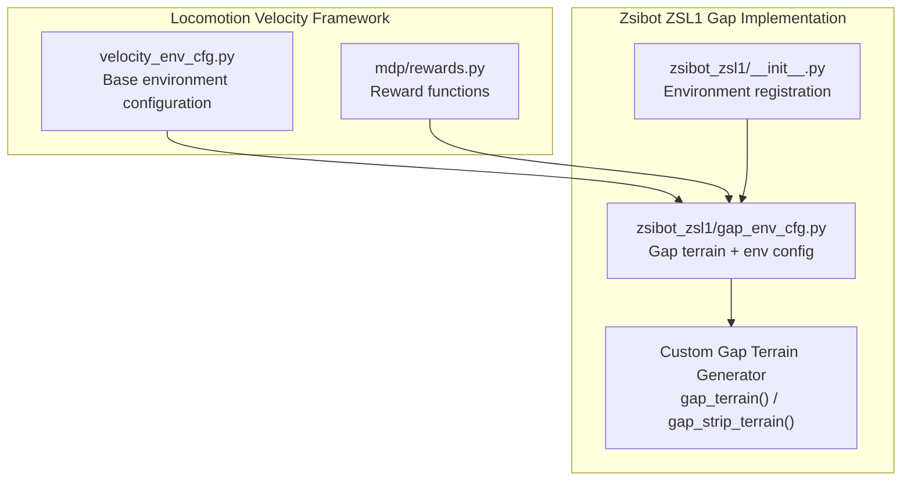
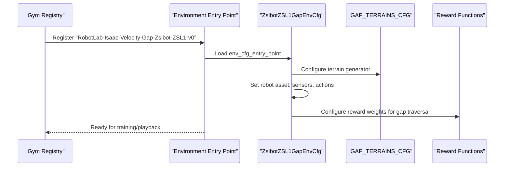
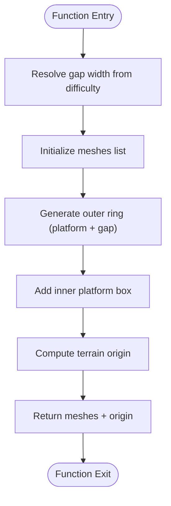
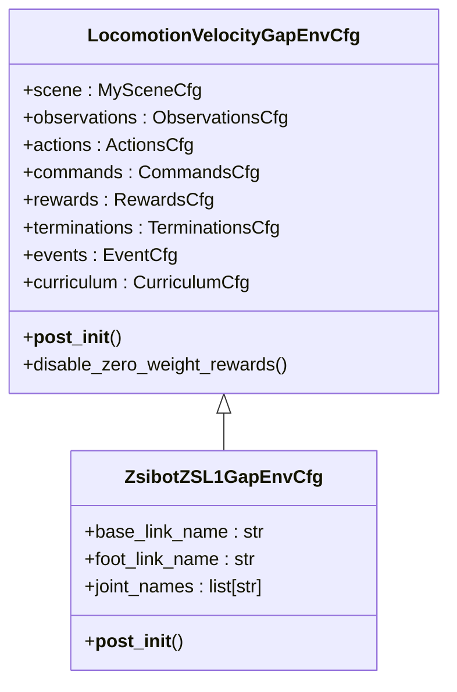
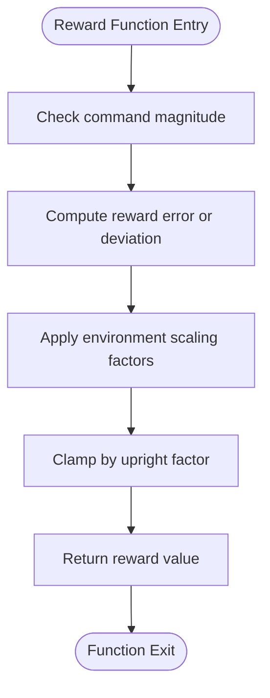
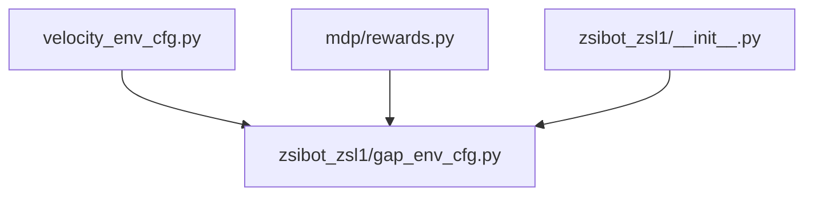

# Gap Traversal Capabilities

<cite>
**Referenced Files in This Document**
- [gap_env_cfg.py](file://source/robot_lab/robot_lab/tasks/manager_based/locomotion/velocity/config/quadruped/zsibot_zsl1/gap_env_cfg.py)
- [__init__.py](file://source/robot_lab/robot_lab/tasks/manager_based/locomotion/velocity/config/quadruped/zsibot_zsl1/__init__.py)
- [velocity_env_cfg.py](file://source/robot_lab/robot_lab/tasks/manager_based/locomotion/velocity/velocity_env_cfg.py)
- [rewards.py](file://source/robot_lab/robot_lab/tasks/manager_based/locomotion/velocity/mdp/rewards.py)
- [README.md](file://README.md)
</cite>

## Table of Contents
1. [Introduction](#introduction)
2. [Project Structure](#project-structure)
3. [Core Components](#core-components)
4. [Architecture Overview](#architecture-overview)
5. [Detailed Component Analysis](#detailed-component-analysis)
6. [Dependency Analysis](#dependency-analysis)
7. [Performance Considerations](#performance-considerations)
8. [Troubleshooting Guide](#troubleshooting-guide)
9. [Conclusion](#conclusion)

## Introduction
This document explains the gap traversal capabilities implemented in the robot_lab project, focusing on the Zsibot ZSL1 quadruped robot's ability to navigate obstacles such as gaps and platforms. The implementation leverages a custom terrain generation system, specialized reward functions, and environment configurations tailored for safe and efficient obstacle crossing.

Key capabilities include:
- Custom terrain generation with configurable gap widths and platform sizes
- Specialized reward functions encouraging controlled stepping and clearance
- Environment-specific configurations optimizing action scaling and observation preprocessing for gap traversal
- Integration with the broader locomotion velocity-tracking framework

## Project Structure
The gap traversal functionality is organized within the locomotion velocity-tracking task framework. The Zsibot ZSL1 gap environment configuration demonstrates how custom terrains and reward policies are combined to achieve robust obstacle navigation.

**Diagram sources**
- [velocity_env_cfg.py:900-958](file://source/robot_lab/robot_lab/tasks/manager_based/locomotion/velocity/velocity_env_cfg.py#L900-L958)
- [rewards.py:670-732](file://source/robot_lab/robot_lab/tasks/manager_based/locomotion/velocity/mdp/rewards.py#L670-L732)
- [__init__.py:52-60](file://source/robot_lab/robot_lab/tasks/manager_based/locomotion/velocity/config/quadruped/zsibot_zsl1/__init__.py#L52-L60)
- [gap_env_cfg.py:27-156](file://source/robot_lab/robot_lab/tasks/manager_based/locomotion/velocity/config/quadruped/zsibot_zsl1/gap_env_cfg.py#L27-L156)

**Section sources**
- [README.md:1-512](file://README.md#L1-L512)
- [__init__.py:1-61](file://source/robot_lab/robot_lab/tasks/manager_based/locomotion/velocity/config/quadruped/zsibot_zsl1/__init__.py#L1-L61)

## Core Components
The gap traversal system comprises three primary components:

- Custom Terrain Generation: Generates terrains featuring gaps and platforms with configurable difficulty and dimensions.
- Environment Configuration: Defines robot assets, sensors, observations, actions, rewards, and termination criteria optimized for gap traversal.
- Reward Functions: Encourages controlled stepping, clearance height, and coordinated gait patterns suitable for crossing gaps.

Key implementation highlights:
- Gap terrain generation functions produce trimesh geometries representing platforms with surrounding gaps.
- The environment configuration sets terrain generator parameters and adjusts reward weights to favor safe obstacle traversal.
- Reward functions emphasize foot lift heights and air-time thresholds to promote controlled stepping.

**Section sources**
- [gap_env_cfg.py:27-156](file://source/robot_lab/robot_lab/tasks/manager_based/locomotion/velocity/config/quadruped/zsibot_zsl1/gap_env_cfg.py#L27-L156)
- [velocity_env_cfg.py:900-958](file://source/robot_lab/robot_lab/tasks/manager_based/locomotion/velocity/velocity_env_cfg.py#L900-L958)
- [rewards.py:507-554](file://source/robot_lab/robot_lab/tasks/manager_based/locomotion/velocity/mdp/rewards.py#L507-L554)

## Architecture Overview
The gap traversal architecture integrates custom terrain generation with the environment configuration and reward system. The Zsibot ZSL1 gap environment registers a gym environment entry that loads the gap-specific configuration and agent runner configuration.

**Diagram sources**
- [__init__.py:52-60](file://source/robot_lab/robot_lab/tasks/manager_based/locomotion/velocity/config/quadruped/zsibot_zsl1/__init__.py#L52-L60)
- [gap_env_cfg.py:159-339](file://source/robot_lab/robot_lab/tasks/manager_based/locomotion/velocity/config/quadruped/zsibot_zsl1/gap_env_cfg.py#L159-L339)
- [velocity_env_cfg.py:900-958](file://source/robot_lab/robot_lab/tasks/manager_based/locomotion/velocity/velocity_env_cfg.py#L900-L958)

## Detailed Component Analysis

### Gap Terrain Generation
The terrain generation system creates custom trimesh geometries for gap and platform scenarios. Two primary functions are provided:

- gap_terrain: Generates a central platform surrounded by a configurable gap on all sides.
- gap_strip_terrain: Creates a repeated pattern of gaps and landing strips along the X-axis with a run-up platform.

**Diagram sources**
- [gap_env_cfg.py:27-66](file://source/robot_lab/robot_lab/tasks/manager_based/locomotion/velocity/config/quadruped/zsibot_zsl1/gap_env_cfg.py#L27-L66)

Implementation characteristics:
- Gap width is interpolated from a configured range based on difficulty.
- Platform dimensions and landing lengths are configurable.
- Origin is computed to align the terrain with the environment coordinate system.

**Section sources**
- [gap_env_cfg.py:27-156](file://source/robot_lab/robot_lab/tasks/manager_based/locomotion/velocity/config/quadruped/zsibot_zsl1/gap_env_cfg.py#L27-L156)

### Environment Configuration for Gap Traversal
The Zsibot ZSL1 gap environment configuration extends the base velocity environment to support gap traversal. It defines:

- Robot asset replacement for Zsibot ZSL1
- Height scanner placement for terrain perception
- Terrain generator configuration using GAP_TERRAINS_CFG
- Observation scaling adjustments for base velocity and joint states
- Action scaling tuned for leg lifting and controlled stepping
- Reward weights emphasizing controlled air-time, foot lift height, and gait symmetry

**Diagram sources**
- [velocity_env_cfg.py:900-958](file://source/robot_lab/robot_lab/tasks/manager_based/locomotion/velocity/velocity_env_cfg.py#L900-L958)
- [gap_env_cfg.py:159-339](file://source/robot_lab/robot_lab/tasks/manager_based/locomotion/velocity/config/quadruped/zsibot_zsl1/gap_env_cfg.py#L159-L339)

Key configuration aspects:
- Terrain generator switched to GAP_TERRAINS_CFG for gap scenarios.
- Observation scaling adjusted for base linear velocity and joint states.
- Action scale increased for hip and knee joints to facilitate leg lifting.
- Reward weights tuned to encourage controlled stepping and clearance height.

**Section sources**
- [gap_env_cfg.py:159-339](file://source/robot_lab/robot_lab/tasks/manager_based/locomotion/velocity/config/quadruped/zsibot_zsl1/gap_env_cfg.py#L159-L339)
- [velocity_env_cfg.py:900-958](file://source/robot_lab/robot_lab/tasks/manager_based/locomotion/velocity/velocity_env_cfg.py#L900-L958)

### Reward Functions for Gap Traversal
The reward system includes specialized functions that promote safe and efficient gap traversal:

- feet_air_time: Rewards prolonged air-time for feet, encouraging longer steps.
- feet_height_body: Penalizes deviation from target foot height, promoting adequate clearance.
- climbing_progress: Encourages forward progress and elevation gain when aligned with the command direction.
- upward: Maintains an upright posture to support controlled movement.

**Diagram sources**
- [rewards.py:340-360](file://source/robot_lab/robot_lab/tasks/manager_based/locomotion/velocity/mdp/rewards.py#L340-L360)
- [rewards.py:527-554](file://source/robot_lab/robot_lab/tasks/manager_based/locomotion/velocity/mdp/rewards.py#L527-L554)
- [rewards.py:670-732](file://source/robot_lab/robot_lab/tasks/manager_based/locomotion/velocity/mdp/rewards.py#L670-L732)

Implementation highlights:
- Air-time rewards activate only when commands exceed a threshold.
- Foot height targets are defined in the body frame to account for robot motion.
- Climb progress combines forward and elevation gains with alignment constraints.

**Section sources**
- [rewards.py:340-360](file://source/robot_lab/robot_lab/tasks/manager_based/locomotion/velocity/mdp/rewards.py#L340-L360)
- [rewards.py:527-554](file://source/robot_lab/robot_lab/tasks/manager_based/locomotion/velocity/mdp/rewards.py#L527-L554)
- [rewards.py:670-732](file://source/robot_lab/robot_lab/tasks/manager_based/locomotion/velocity/mdp/rewards.py#L670-L732)

## Dependency Analysis
The gap traversal implementation depends on several components within the locomotion velocity framework:

- Base environment configuration: Provides shared scene, observations, actions, commands, rewards, terminations, events, and curriculum settings.
- Reward functions: Supply modular reward terms used by the environment configuration.
- Terrain generation: Supplies custom terrains for gap and platform scenarios.
- Gym registration: Exposes the environment through the gym registry for training and playback.

**Diagram sources**
- [velocity_env_cfg.py:900-958](file://source/robot_lab/robot_lab/tasks/manager_based/locomotion/velocity/velocity_env_cfg.py#L900-L958)
- [rewards.py:1-807](file://source/robot_lab/robot_lab/tasks/manager_based/locomotion/velocity/mdp/rewards.py#L1-L807)
- [gap_env_cfg.py:159-339](file://source/robot_lab/robot_lab/tasks/manager_based/locomotion/velocity/config/quadruped/zsibot_zsl1/gap_env_cfg.py#L159-L339)
- [__init__.py:52-60](file://source/robot_lab/robot_lab/tasks/manager_based/locomotion/velocity/config/quadruped/zsibot_zsl1/__init__.py#L52-L60)

**Section sources**
- [velocity_env_cfg.py:900-958](file://source/robot_lab/robot_lab/tasks/manager_based/locomotion/velocity/velocity_env_cfg.py#L900-L958)
- [rewards.py:1-807](file://source/robot_lab/robot_lab/tasks/manager_based/locomotion/velocity/mdp/rewards.py#L1-L807)
- [gap_env_cfg.py:159-339](file://source/robot_lab/robot_lab/tasks/manager_based/locomotion/velocity/config/quadruped/zsibot_zsl1/gap_env_cfg.py#L159-L339)
- [__init__.py:52-60](file://source/robot_lab/robot_lab/tasks/manager_based/locomotion/velocity/config/quadruped/zsibot_zsl1/__init__.py#L52-L60)

## Performance Considerations
- Terrain complexity: The custom terrain generation uses trimesh geometries; ensure appropriate mesh resolution to balance realism and simulation performance.
- Observation scaling: Adjust observation scales to prevent numerical instability during training.
- Action scaling: Increase joint action scales for hip and knee joints to enable sufficient leg lift for gap traversal.
- Reward weighting: Tune reward weights to balance controlled stepping with energy efficiency.

## Troubleshooting Guide
Common issues and resolutions:
- Excessive jumping or instability: Reduce base height and orientation penalties; increase upward reward weight.
- Inadequate gap clearance: Increase feet_height_body target height and decrease penalty weight; adjust action scale for hip/knee joints.
- Poor gait coordination: Enable feet_gait reward and configure synced_feet_pair_names for stable stepping patterns.
- Sensor misalignment: Verify height scanner placement and update period to match simulation settings.

**Section sources**
- [gap_env_cfg.py:180-339](file://source/robot_lab/robot_lab/tasks/manager_based/locomotion/velocity/config/quadruped/zsibot_zsl1/gap_env_cfg.py#L180-L339)
- [velocity_env_cfg.py:900-958](file://source/robot_lab/robot_lab/tasks/manager_based/locomotion/velocity/velocity_env_cfg.py#L900-L958)
- [rewards.py:507-554](file://source/robot_lab/robot_lab/tasks/manager_based/locomotion/velocity/mdp/rewards.py#L507-L554)

## Conclusion
The gap traversal capabilities for the Zsibot ZSL1 quadruped robot are implemented through a combination of custom terrain generation, environment-specific configuration, and reward functions designed to encourage controlled stepping and safe obstacle navigation. By leveraging the locomotion velocity framework, the system provides a robust foundation for training policies capable of traversing gaps and platforms efficiently and safely.