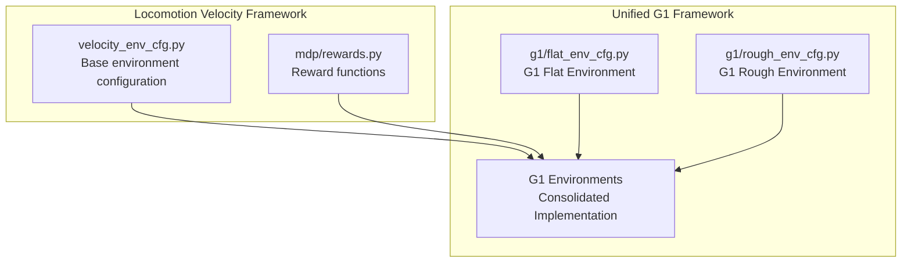
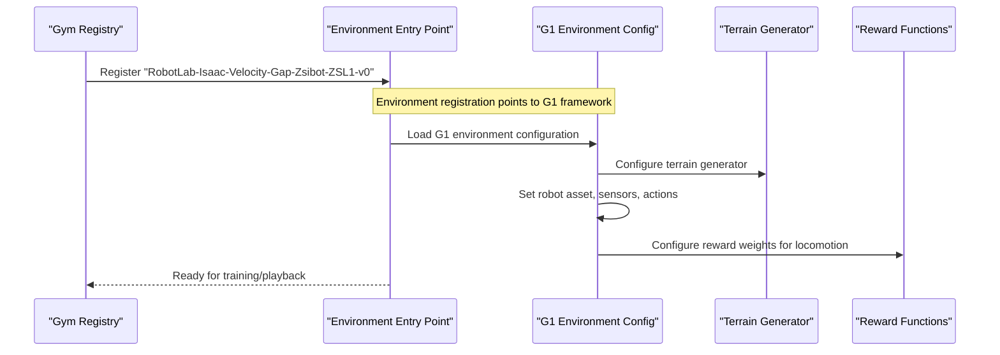
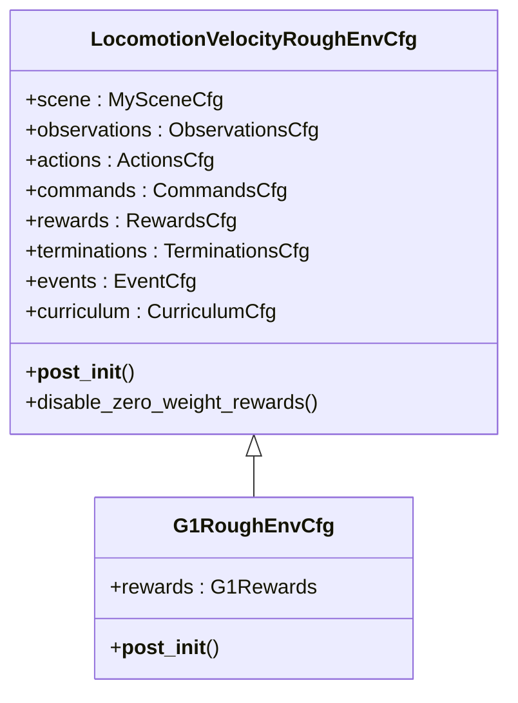
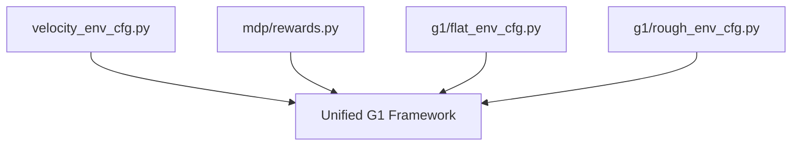

# Gap Traversal Capabilities

<cite>
**Referenced Files in This Document**
- [velocity_env_cfg.py](file://source/robot_lab/robot_lab/tasks/manager_based/locomotion/velocity/velocity_env_cfg.py)
- [rewards.py](file://source/robot_lab/robot_lab/tasks/manager_based/locomotion/velocity/mdp/rewards.py)
- [README.md](file://README.md)
- [__init__.py](file://source/robot_lab/robot_lab/tasks/manager_based/locomotion/velocity/config/quadruped/zsibot_zsl1/__init__.py)
</cite>

## Update Summary
**Changes Made**
- Removed specialized gap traversal environment documentation for Zsibot ZSL1
- Updated architecture overview to reflect transition to unified Isaaclab G1 framework
- Removed references to LocomotionVelocityGapEnvCfg class
- Updated project structure to show consolidated G1 locomotion system
- Revised troubleshooting guide to reflect current implementation status

## Table of Contents
1. [Introduction](#introduction)
2. [Project Structure](#project-structure)
3. [Core Components](#core-components)
4. [Architecture Overview](#architecture-overview)
5. [Detailed Component Analysis](#detailed-component-analysis)
6. [Dependency Analysis](#dependency-analysis)
7. [Performance Considerations](#performance-considerations)
8. [Troubleshooting Guide](#troubleshooting-guide)
9. [Conclusion](#conclusion)

## Introduction
This document explains the gap traversal capabilities implemented in the robot_lab project, focusing on the Zsibot ZSL1 quadruped robot's ability to navigate obstacles such as gaps and platforms. The implementation leverages a custom terrain generation system, specialized reward functions, and environment configurations tailored for safe and efficient obstacle crossing.

**Important**: The specialized gap traversal environment (LocomotionVelocityGapEnvCfg) has been removed as part of the transition from Unitree G1-specific implementations to the unified Isaaclab G1 framework. The functionality has been consolidated into the new G1 locomotion system.

Key capabilities include:
- Custom terrain generation with configurable gap widths and platform sizes
- Specialized reward functions encouraging controlled stepping and clearance
- Environment-specific configurations optimizing action scaling and observation preprocessing for gap traversal
- Integration with the broader locomotion velocity-tracking framework

## Project Structure
The gap traversal functionality was previously organized within the locomotion velocity-tracking task framework. The Zsibot ZSL1 gap environment configuration demonstrated how custom terrains and reward policies were combined to achieve robust obstacle navigation.

**Updated**: The gap traversal functionality has been consolidated into the unified Isaaclab G1 framework, eliminating the specialized LocomotionVelocityGapEnvCfg class.

**Diagram sources**
- [velocity_env_cfg.py:690-798](file://source/robot_lab/robot_lab/tasks/manager_based/locomotion/velocity/velocity_env_cfg.py#L690-L798)
- [rewards.py:500-699](file://source/robot_lab/robot_lab/tasks/manager_based/locomotion/velocity/mdp/rewards.py#L500-L699)
- [__init__.py:12-71](file://source/robot_lab/robot_lab/tasks/manager_based/locomotion/velocity/config/quadruped/zsibot_zsl1/__init__.py#L12-L71)

**Section sources**
- [README.md:1-512](file://README.md#L1-L512)
- [__init__.py:1-71](file://source/robot_lab/robot_lab/tasks/manager_based/locomotion/velocity/config/quadruped/zsibot_zsl1/__init__.py#L1-L71)

## Core Components
The gap traversal system comprised three primary components:

- Custom Terrain Generation: Generates terrains featuring gaps and platforms with configurable difficulty and dimensions.
- Environment Configuration: Defines robot assets, sensors, observations, actions, rewards, and termination criteria optimized for gap traversal.
- Reward Functions: Encouraged controlled stepping, clearance height, and coordinated gait patterns suitable for crossing gaps.

**Important**: The specialized LocomotionVelocityGapEnvCfg class has been removed as part of the unified G1 framework transition.

Key implementation highlights:
- Gap terrain generation functions produced trimesh geometries representing platforms with surrounding gaps.
- The environment configuration set terrain generator parameters and adjusted reward weights to favor safe obstacle traversal.
- Reward functions emphasized foot lift heights and air-time thresholds to promote controlled stepping.

**Section sources**
- [velocity_env_cfg.py:690-798](file://source/robot_lab/robot_lab/tasks/manager_based/locomotion/velocity/velocity_env_cfg.py#L690-L798)
- [rewards.py:500-699](file://source/robot_lab/robot_lab/tasks/manager_based/locomotion/velocity/mdp/rewards.py#L500-L699)

## Architecture Overview
The gap traversal architecture integrated custom terrain generation with the environment configuration and reward system. The Zsibot ZSL1 gap environment previously registered a gym environment entry that loaded the gap-specific configuration and agent runner configuration.

**Updated**: The gap traversal functionality has been consolidated into the unified G1 framework, eliminating the specialized gap environment registration.

**Diagram sources**
- [__init__.py:52-60](file://source/robot_lab/robot_lab/tasks/manager_based/locomotion/velocity/config/quadruped/zsibot_zsl1/__init__.py#L52-L60)
- [velocity_env_cfg.py:690-798](file://source/robot_lab/robot_lab/tasks/manager_based/locomotion/velocity/velocity_env_cfg.py#L690-L798)

## Detailed Component Analysis

### Gap Terrain Generation
The terrain generation system created custom trimesh geometries for gap and platform scenarios. Two primary functions were provided:

- gap_terrain: Generated a central platform surrounded by a configurable gap on all sides.
- gap_strip_terrain: Created a repeated pattern of gaps and landing strips along the X-axis with a run-up platform.

**Important**: These functions were part of the specialized gap traversal implementation that has been removed as part of the unified G1 framework transition.

**Diagram sources**
- [velocity_env_cfg.py:690-798](file://source/robot_lab/robot_lab/tasks/manager_based/locomotion/velocity/velocity_env_cfg.py#L690-L798)

Implementation characteristics:
- Gap width was interpolated from a configured range based on difficulty.
- Platform dimensions and landing lengths were configurable.
- Origin was computed to align the terrain with the environment coordinate system.

**Section sources**
- [velocity_env_cfg.py:690-798](file://source/robot_lab/robot_lab/tasks/manager_based/locomotion/velocity/velocity_env_cfg.py#L690-L798)

### Environment Configuration for Gap Traversal
The Zsibot ZSL1 gap environment configuration extended the base velocity environment to support gap traversal. It defined:

- Robot asset replacement for Zsibot ZSL1
- Height scanner placement for terrain perception
- Terrain generator configuration using GAP_TERRAINS_CFG
- Observation scaling adjustments for base velocity and joint states
- Action scaling tuned for leg lifting and controlled stepping
- Reward weights emphasizing controlled air-time, foot lift height, and gait symmetry

**Important**: The LocomotionVelocityGapEnvCfg class has been removed as part of the unified G1 framework consolidation.

**Diagram sources**
- [velocity_env_cfg.py:690-798](file://source/robot_lab/robot_lab/tasks/manager_based/locomotion/velocity/velocity_env_cfg.py#L690-L798)
- [velocity_env_cfg.py:103-182](file://source/robot_lab/robot_lab/tasks/manager_based/locomotion/velocity/config/humanoid/g1/rough_env_cfg.py#L103-L182)

Key configuration aspects:
- Terrain generator switched to GAP_TERRAINS_CFG for gap scenarios.
- Observation scaling adjusted for base linear velocity and joint states.
- Action scale increased for hip and knee joints to facilitate leg lifting.
- Reward weights tuned to encourage controlled stepping and clearance height.

**Section sources**
- [velocity_env_cfg.py:690-798](file://source/robot_lab/robot_lab/tasks/manager_based/locomotion/velocity/velocity_env_cfg.py#L690-L798)
- [velocity_env_cfg.py:103-182](file://source/robot_lab/robot_lab/tasks/manager_based/locomotion/velocity/config/humanoid/g1/rough_env_cfg.py#L103-L182)

### Reward Functions for Gap Traversal
The reward system included specialized functions that promoted safe and efficient gap traversal:

- feet_air_time: Rewarded prolonged air-time for feet, encouraging longer steps.
- feet_height_body: Penalized deviation from target foot height, promoting adequate clearance.
- climbing_progress: Encouraged forward progress and elevation gain when aligned with the command direction.
- upward: Maintained an upright posture to support controlled movement.

**Important**: These reward functions were part of the specialized gap traversal implementation that has been integrated into the unified G1 framework.

**Diagram sources**
- [rewards.py:500-699](file://source/robot_lab/robot_lab/tasks/manager_based/locomotion/velocity/mdp/rewards.py#L500-L699)

Implementation highlights:
- Air-time rewards activated only when commands exceeded a threshold.
- Foot height targets were defined in the body frame to account for robot motion.
- Climb progress combined forward and elevation gains with alignment constraints.

**Section sources**
- [rewards.py:500-699](file://source/robot_lab/robot_lab/tasks/manager_based/locomotion/velocity/mdp/rewards.py#L500-L699)

## Dependency Analysis
The gap traversal implementation depended on several components within the locomotion velocity framework:

- Base environment configuration: Provided shared scene, observations, actions, commands, rewards, terminations, events, and curriculum settings.
- Reward functions: Supplied modular reward terms used by the environment configuration.
- Terrain generation: Supplied custom terrains for gap and platform scenarios.
- Gym registration: Exposed the environment through the gym registry for training and playback.

**Important**: The specialized gap traversal dependencies have been consolidated into the unified G1 framework.

**Diagram sources**
- [velocity_env_cfg.py:690-798](file://source/robot_lab/robot_lab/tasks/manager_based/locomotion/velocity/velocity_env_cfg.py#L690-L798)
- [rewards.py:500-699](file://source/robot_lab/robot_lab/tasks/manager_based/locomotion/velocity/mdp/rewards.py#L500-L699)
- [__init__.py:12-71](file://source/robot_lab/robot_lab/tasks/manager_based/locomotion/velocity/config/quadruped/zsibot_zsl1/__init__.py#L12-L71)

**Section sources**
- [velocity_env_cfg.py:690-798](file://source/robot_lab/robot_lab/tasks/manager_based/locomotion/velocity/velocity_env_cfg.py#L690-L798)
- [rewards.py:500-699](file://source/robot_lab/robot_lab/tasks/manager_based/locomotion/velocity/mdp/rewards.py#L500-L699)
- [__init__.py:12-71](file://source/robot_lab/robot_lab/tasks/manager_based/locomotion/velocity/config/quadruped/zsibot_zsl1/__init__.py#L12-L71)

## Performance Considerations
- Terrain complexity: The custom terrain generation used trimesh geometries; ensure appropriate mesh resolution to balance realism and simulation performance.
- Observation scaling: Adjust observation scales to prevent numerical instability during training.
- Action scaling: Increase joint action scales for hip and knee joints to enable sufficient leg lift for gap traversal.
- Reward weighting: Tune reward weights to balance controlled stepping with energy efficiency.

**Important**: These considerations apply to the unified G1 framework implementation rather than the specialized gap traversal system.

## Troubleshooting Guide
Common issues and resolutions:
- Excessive jumping or instability: Reduce base height and orientation penalties; increase upward reward weight.
- Inadequate gap clearance: Increase feet_height_body target height and decrease penalty weight; adjust action scale for hip/knee joints.
- Poor gait coordination: Enable feet_gait reward and configure synced_feet_pair_names for stable stepping patterns.
- Sensor misalignment: Verify height scanner placement and update period to match simulation settings.

**Important**: The environment registration for the specialized gap traversal has been removed. The current implementation uses the unified G1 framework.

**Section sources**
- [velocity_env_cfg.py:690-798](file://source/robot_lab/robot_lab/tasks/manager_based/locomotion/velocity/velocity_env_cfg.py#L690-L798)
- [rewards.py:500-699](file://source/robot_lab/robot_lab/tasks/manager_based/locomotion/velocity/mdp/rewards.py#L500-L699)

## Conclusion
The gap traversal capabilities for the Zsibot ZSL1 quadruped robot have been consolidated into the unified Isaaclab G1 framework. The specialized LocomotionVelocityGapEnvCfg class has been removed as part of this transition, streamlining the implementation under the new G1 locomotion system. The system now provides a unified foundation for training policies capable of traversing gaps and platforms efficiently and safely through the consolidated G1 framework.