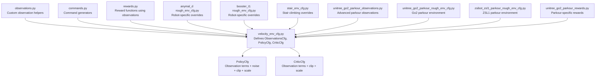
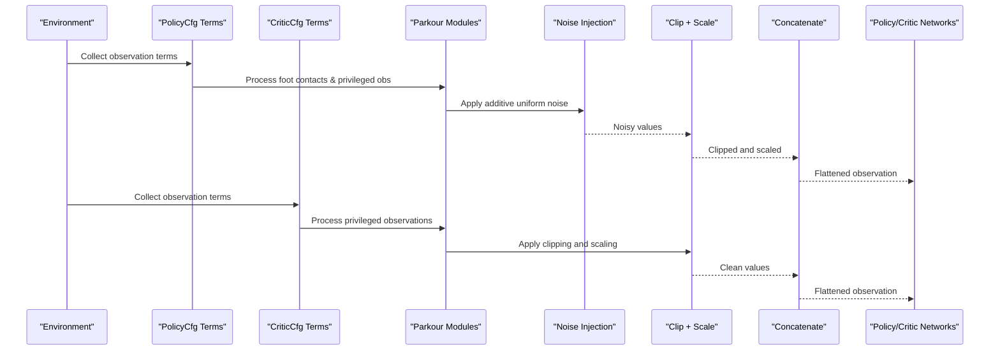
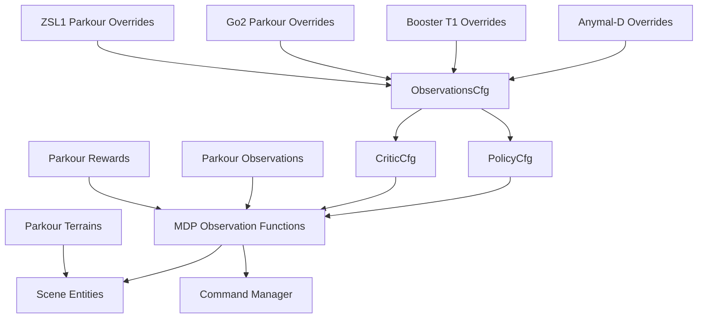

# Observation System and State Representation

<cite>
**Referenced Files in This Document**
- [velocity_env_cfg.py](file://source/robot_lab/robot_lab/tasks/manager_based/locomotion/velocity/velocity_env_cfg.py)
- [observations.py](file://source/robot_lab/robot_lab/tasks/manager_based/locomotion/velocity/mdp/observations.py)
- [commands.py](file://source/robot_lab/robot_lab/tasks/manager_based/locomotion/velocity/mdp/commands.py)
- [rewards.py](file://source/robot_lab/robot_lab/tasks/manager_based/locomotion/velocity/mdp/rewards.py)
- [rough_env_cfg.py](file://source/robot_lab/robot_lab/tasks/manager_based/locomotion/velocity/config/quadruped/anymal_d/rough_env_cfg.py)
- [rough_env_cfg.py](file://source/robot_lab/robot_lab/tasks/manager_based/locomotion/velocity/config/humanoid/booster_t1/rough_env_cfg.py)
- [stair_env_cfg.py](file://source/robot_lab/robot_lab/tasks/manager_based/locomotion/velocity/config/quadruped/zsibot_zsl1/stair_env_cfg.py)
- [unitree_go2_parkour_observations.py](file://source/robot_lab/robot_lab/tasks/manager_based/locomotion/velocity/config/quadruped/unitree_go2_parkour/mdp/observations.py)
- [unitree_go2_parkour_rough_env_cfg.py](file://source/robot_lab/robot_lab/tasks/manager_based/locomotion/velocity/config/quadruped/unitree_go2_parkour/rough_env_cfg.py)
- [zsibot_zsl1_parkour_rough_env_cfg.py](file://source/robot_lab/robot_lab/tasks/manager_based/locomotion/velocity/config/quadruped/zsibot_zsl1_parkour/rough_env_cfg.py)
- [unitree_go2_parkour_rewards.py](file://source/robot_lab/robot_lab/tasks/manager_based/locomotion/velocity/config/quadruped/unitree_go2_parkour/mdp/rewards.py)
- [unitree_go2_parkour_terrains_cfg.py](file://source/robot_lab/robot_lab/tasks/manager_based/locomotion/velocity/config/quadruped/unitree_go2_parkour/terrains_cfg.py)
- [unitree_go2_parkour_mesh_terrains.py](file://source/robot_lab/robot_lab/tasks/manager_based/locomotion/velocity/config/quadruped/unitree_go2_parkour/mesh_terrains.py)
</cite>

## Update Summary
**Changes Made**
- Added comprehensive documentation for specialized parkour observation modules
- Enhanced coverage of foot contact detection capabilities
- Documented base mass tracking and privileged observations
- Added advanced scan processing techniques for complex terrain navigation
- Expanded terrain generation capabilities for parkour training
- Included detailed reward functions specific to parkour locomotion
- Updated observation system architecture to reflect enhanced capabilities

## Table of Contents
1. [Introduction](#introduction)
2. [Project Structure](#project-structure)
3. [Core Components](#core-components)
4. [Architecture Overview](#architecture-overview)
5. [Detailed Component Analysis](#detailed-component-analysis)
6. [Advanced Parkour Observation Modules](#advanced-parkour-observation-modules)
7. [Specialized Terrain Generation](#specialized-terrain-generation)
8. [Enhanced Reward Systems](#enhanced-reward-systems)
9. [Dependency Analysis](#dependency-analysis)
10. [Performance Considerations](#performance-considerations)
11. [Troubleshooting Guide](#troubleshooting-guide)
12. [Conclusion](#conclusion)

## Introduction
This document explains the observation system and state representation used in velocity-based locomotion, with enhanced capabilities for Go2 parkour training. The system now includes specialized observation modules with foot contact detection, base mass tracking, and advanced scan processing that goes beyond the basic observation system. It focuses on the ObservationsCfg class with PolicyCfg and CriticCfg observation groups, detailing each observation term, noise injection, clipping, scaling, and data corruption controls. It also covers concatenation strategies, preprocessing pipelines, and practical configuration examples for policy and critic branches, along with performance implications for training stability.

## Project Structure
The observation system is defined within the velocity-based locomotion task configuration and supported by MDP modules for commands, rewards, and specialized observation helpers. The system now includes dedicated parkour environments with advanced observation capabilities.

**Diagram sources**
- [velocity_env_cfg.py:130-271](file://source/robot_lab/robot_lab/tasks/manager_based/locomotion/velocity/velocity_env_cfg.py#L130-L271)
- [observations.py:1-63](file://source/robot_lab/robot_lab/tasks/manager_based/locomotion/velocity/mdp/observations.py#L1-L63)
- [commands.py:21-85](file://source/robot_lab/robot_lab/tasks/manager_based/locomotion/velocity/mdp/commands.py#L21-L85)
- [rewards.py:22-75](file://source/robot_lab/robot_lab/tasks/manager_based/locomotion/velocity/mdp/rewards.py#L22-L75)
- [rough_env_cfg.py:14-34](file://source/robot_lab/robot_lab/tasks/manager_based/locomotion/velocity/config/quadruped/anymal_d/rough_env_cfg.py#L14-L34)
- [rough_env_cfg.py:16-36](file://source/robot_lab/robot_lab/tasks/manager_based/locomotion/velocity/config/humanoid/booster_t1/rough_env_cfg.py#L16-L36)
- [stair_env_cfg.py:80-90](file://source/robot_lab/robot_lab/tasks/manager_based/locomotion/velocity/config/quadruped/zsibot_zsl1/stair_env_cfg.py#L80-L90)
- [unitree_go2_parkour_observations.py:1-111](file://source/robot_lab/robot_lab/tasks/manager_based/locomotion/velocity/config/quadruped/unitree_go2_parkour/mdp/observations.py#L1-L111)
- [unitree_go2_parkour_rough_env_cfg.py:208-288](file://source/robot_lab/robot_lab/tasks/manager_based/locomotion/velocity/config/quadruped/unitree_go2_parkour/rough_env_cfg.py#L208-L288)
- [zsibot_zsl1_parkour_rough_env_cfg.py:216-296](file://source/robot_lab/robot_lab/tasks/manager_based/locomotion/velocity/config/quadruped/zsibot_zsl1_parkour/rough_env_cfg.py#L216-L296)
- [unitree_go2_parkour_rewards.py:1-131](file://source/robot_lab/robot_lab/tasks/manager_based/locomotion/velocity/config/quadruped/unitree_go2_parkour/mdp/rewards.py#L1-L131)

**Section sources**
- [velocity_env_cfg.py:130-271](file://source/robot_lab/robot_lab/tasks/manager_based/locomotion/velocity/velocity_env_cfg.py#L130-L271)
- [observations.py:1-63](file://source/robot_lab/robot_lab/tasks/manager_based/locomotion/velocity/mdp/observations.py#L1-L63)
- [commands.py:21-85](file://source/robot_lab/robot_lab/tasks/manager_based/locomotion/velocity/mdp/commands.py#L21-L85)
- [rewards.py:22-75](file://source/robot_lab/robot_lab/tasks/manager_based/locomotion/velocity/mdp/rewards.py#L22-L75)
- [rough_env_cfg.py:14-34](file://source/robot_lab/robot_lab/tasks/manager_based/locomotion/velocity/config/quadruped/anymal_d/rough_env_cfg.py#L14-L34)
- [rough_env_cfg.py:16-36](file://source/robot_lab/robot_lab/tasks/manager_based/locomotion/velocity/config/humanoid/booster_t1/rough_env_cfg.py#L16-L36)
- [stair_env_cfg.py:80-90](file://source/robot_lab/robot_lab/tasks/manager_based/locomotion/velocity/config/quadruped/zsibot_zsl1/stair_env_cfg.py#L80-L90)
- [unitree_go2_parkour_observations.py:1-111](file://source/robot_lab/robot_lab/tasks/manager_based/locomotion/velocity/config/quadruped/unitree_go2_parkour/mdp/observations.py#L1-L111)
- [unitree_go2_parkour_rough_env_cfg.py:208-288](file://source/robot_lab/robot_lab/tasks/manager_based/locomotion/velocity/config/quadruped/unitree_go2_parkour/rough_env_cfg.py#L208-L288)
- [zsibot_zsl1_parkour_rough_env_cfg.py:216-296](file://source/robot_lab/robot_lab/tasks/manager_based/locomotion/velocity/config/quadruped/zsibot_zsl1_parkour/rough_env_cfg.py#L216-L296)
- [unitree_go2_parkour_rewards.py:1-131](file://source/robot_lab/robot_lab/tasks/manager_based/locomotion/velocity/config/quadruped/unitree_go2_parkour/mdp/rewards.py#L1-L131)

## Core Components
- ObservationsCfg: Central configuration container for observations, composed of two groups:
  - PolicyCfg: Used by the policy network; enables noise injection and corruption for robustness.
  - CriticCfg: Used by the critic network; disables noise and corruption for stable value estimation.
- Observation terms: Ordered list of ObsTerm entries, each specifying a function, optional parameters, noise, clipping, and scaling.
- Concatenation: Both groups concatenate terms into a single flattened observation tensor.
- Corruption: Policy group can inject data corruption; Critic group does not.
- **Enhanced with specialized parkour observation modules** including foot contact detection, base mass tracking, and privileged observations.

Key observation terms in PolicyCfg and CriticCfg include:
- Base linear and angular velocities
- Projected gravity vector
- Velocity commands
- Joint positions and velocities (relative to defaults)
- Last actions
- Height scan from a ray-caster sensor
- **Foot contacts** (binary contact flags from contact sensors)
- **Base mass observations** (privileged information for domain randomization)
- **Base center-of-mass tracking** (privileged information)
- **Friction coefficient measurements** (privileged information)
- **PD gain scaling ratios** (privileged information for control adaptation)

**Section sources**
- [velocity_env_cfg.py:133-271](file://source/robot_lab/robot_lab/tasks/manager_based/locomotion/velocity/velocity_env_cfg.py#L133-L271)
- [unitree_go2_parkour_observations.py:33-111](file://source/robot_lab/robot_lab/tasks/manager_based/locomotion/velocity/config/quadruped/unitree_go2_parkour/mdp/observations.py#L33-L111)

## Architecture Overview
The observation pipeline transforms raw sensor and state signals into normalized tensors consumed by policy and critic networks. The policy receives noisy observations to improve generalization, while the critic receives clean observations for stable value estimation. The enhanced system now includes specialized parkour observation modules for advanced terrain navigation.

**Diagram sources**
- [velocity_env_cfg.py:133-271](file://source/robot_lab/robot_lab/tasks/manager_based/locomotion/velocity/velocity_env_cfg.py#L133-L271)
- [unitree_go2_parkour_observations.py:33-111](file://source/robot_lab/robot_lab/tasks/manager_based/locomotion/velocity/config/quadruped/unitree_go2_parkour/mdp/observations.py#L33-L111)

## Detailed Component Analysis

### ObservationsCfg and Groups
- PolicyCfg:
  - Enables noise injection and corruption.
  - Concatenates observation terms in order.
  - Includes base linear/angular velocities, projected gravity, velocity commands, joint positions/velocities, last actions, and height scan.
  - **Enhanced with foot contact detection for improved terrain awareness.**
- CriticCfg:
  - Disables noise and corruption.
  - Concatenates observation terms in order.
  - Mirrors the same terms as PolicyCfg but without noise.
  - **Includes privileged observations for domain randomization and control adaptation.**
  - **Enhanced with base mass tracking, center-of-mass information, and PD gain scaling.**

Configuration highlights:
- Noise: Additive uniform noise applied per term.
- Clip: Tuple of (min, max) bounds applied after noise.
- Scale: Multiplicative factor applied after clipping.
- Corruption: Boolean flag controlling whether corrupted observations are produced.
- **Foot contacts**: Binary flags indicating ground contact for each foot.
- **Privileged observations**: Domain randomization parameters accessible only to the critic.

**Section sources**
- [velocity_env_cfg.py:133-271](file://source/robot_lab/robot_lab/tasks/manager_based/locomotion/velocity/velocity_env_cfg.py#L133-L271)
- [unitree_go2_parkour_rough_env_cfg.py:212-288](file://source/robot_lab/robot_lab/tasks/manager_based/locomotion/velocity/config/quadruped/unitree_go2_parkour/rough_env_cfg.py#L212-L288)
- [zsibot_zsl1_parkour_rough_env_cfg.py:247-296](file://source/robot_lab/robot_lab/tasks/manager_based/locomotion/velocity/config/quadruped/zsibot_zsl1_parkour/rough_env_cfg.py#L247-L296)

### Individual Observation Terms

#### Base Linear Velocity
- Function: Base linear velocity in body frame.
- Noise: Optional uniform noise injected.
- Clip: Typical broad range to avoid extreme outliers.
- Scale: Normalization factor tailored per robot/environment.
- Use: Captures forward/backward and lateral translation relative to the robot.

**Section sources**
- [velocity_env_cfg.py:138-143](file://source/robot_lab/robot_lab/tasks/manager_based/locomotion/velocity/velocity_env_cfg.py#L138-L143)

#### Base Angular Velocity
- Function: Base angular velocity around the z-axis in body frame.
- Noise: Optional uniform noise injected.
- Clip: Broad range to prevent saturation.
- Scale: Often reduced to emphasize yaw dynamics.
- Use: Encodes turning rate and rotational stability.

**Section sources**
- [velocity_env_cfg.py:144-149](file://source/robot_lab/robot_lab/tasks/manager_based/locomotion/velocity/velocity_env_cfg.py#L144-L149)

#### Projected Gravity Vector
- Function: Projection of gravity onto the robot's body frame.
- Noise: Optional small uniform noise.
- Clip: Broad range to avoid numerical issues.
- Scale: Unit magnitude normalization often implied.
- Use: Encodes tilt and levelness; stabilizes reward shaping.

**Section sources**
- [velocity_env_cfg.py:150-155](file://source/robot_lab/robot_lab/tasks/manager_based/locomotion/velocity/velocity_env_cfg.py#L150-L155)

#### Velocity Commands
- Function: Generated command for base velocity (x/y translational, z rotational).
- Parameters: Selects the command source by name.
- Clip: Broad range.
- Scale: Normalization factor.
- Use: Supervisory signal guiding velocity tracking rewards.

**Section sources**
- [velocity_env_cfg.py:156-161](file://source/robot_lab/robot_lab/tasks/manager_based/locomotion/velocity/velocity_env_cfg.py#L156-L161)

#### Joint Positions (Relative)
- Function: Joint positions relative to default rest configuration.
- Parameters: Asset selection and joint filtering.
- Noise: Small uniform noise.
- Clip: Broad range.
- Scale: Often identity or slight normalization.
- Use: Regularizes posture and compensates for actuator drift.

**Section sources**
- [velocity_env_cfg.py:162-168](file://source/robot_lab/robot_lab/tasks/manager_based/locomotion/velocity/velocity_env_cfg.py#L162-L168)

#### Joint Velocities (Relative)
- Function: Joint velocities relative to default rest configuration.
- Parameters: Asset selection and joint filtering.
- Noise: Larger uniform noise to simulate sensor variability.
- Clip: Broad range.
- Scale: Reduced factor to down-weight high-frequency noise.
- Use: Penalizes excessive motion and aids stability.

**Section sources**
- [velocity_env_cfg.py:169-175](file://source/robot_lab/robot_lab/tasks/manager_based/locomotion/velocity/velocity_env_cfg.py#L169-L175)

#### Last Actions
- Function: Previous actions sent to the robot.
- Clip: Broad range.
- Scale: Identity.
- Use: Temporal continuity and action smoothing.

**Section sources**
- [velocity_env_cfg.py:176-180](file://source/robot_lab/robot_lab/tasks/manager_based/locomotion/velocity/velocity_env_cfg.py#L176-L180)

#### Height Scan
- Function: Height measurements from a ray-caster sensor.
- Parameters: Sensor entity selection.
- Noise: Small uniform noise.
- Clip: Narrow range to bound sensor artifacts.
- Scale: Identity.
- Use: Terrain adaptation and foothold awareness.

**Section sources**
- [velocity_env_cfg.py:181-187](file://source/robot_lab/robot_lab/tasks/manager_based/locomotion/velocity/velocity_env_cfg.py#L181-L187)

#### Foot Contacts
- **New Function**: Binary contact flags from contact sensors.
- **Purpose**: Provides real-time ground contact information for each foot.
- **Implementation**: Uses net contact forces from contact sensors to determine contact status.
- **Parameters**: Sensor configuration and contact threshold.
- **Clip**: Not applicable (binary output).
- **Scale**: Not applicable (binary output).
- **Use**: Critical for gait planning, stability assessment, and terrain adaptation in parkour scenarios.

**Section sources**
- [unitree_go2_parkour_observations.py:33-47](file://source/robot_lab/robot_lab/tasks/manager_based/locomotion/velocity/config/quadruped/unitree_go2_parkour/mdp/observations.py#L33-L47)
- [unitree_go2_parkour_rough_env_cfg.py:223-226](file://source/robot_lab/robot_lab/tasks/manager_based/locomotion/velocity/config/quadruped/unitree_go2_parkour/rough_env_cfg.py#L223-L226)
- [zsibot_zsl1_parkour_rough_env_cfg.py:231-234](file://source/robot_lab/robot_lab/tasks/manager_based/locomotion/velocity/config/quadruped/zsibot_zsl1_parkour/rough_env_cfg.py#L231-L234)

#### Base Mass Observation
- **New Function**: Base link mass after domain randomization.
- **Purpose**: Privileged information for mass uncertainty handling.
- **Implementation**: Extracts mass values from physics properties of the base link.
- **Parameters**: Asset configuration for base link identification.
- **Clip**: Not applicable (continuous output).
- **Scale**: Not applicable (physical units).
- **Use**: Enables the critic to account for mass variations during training.

**Section sources**
- [unitree_go2_parkour_observations.py:50-58](file://source/robot_lab/robot_lab/tasks/manager_based/locomotion/velocity/config/quadruped/unitree_go2_parkour/mdp/observations.py#L50-L58)
- [unitree_go2_parkour_rough_env_cfg.py:255-258](file://source/robot_lab/robot_lab/tasks/manager_based/locomotion/velocity/config/quadruped/unitree_go2_parkour/rough_env_cfg.py#L255-L258)
- [zsibot_zsl1_parkour_rough_env_cfg.py:263-266](file://source/robot_lab/robot_lab/tasks/manager_based/locomotion/velocity/config/quadruped/zsibot_zsl1_parkour/rough_env_cfg.py#L263-L266)

#### Base Center-of-Mass Observation
- **New Function**: Base link center-of-mass position after domain randomization.
- **Purpose**: Privileged information for COM uncertainty handling.
- **Implementation**: Extracts COM positions from physics properties of the base link.
- **Parameters**: Asset configuration for base link identification.
- **Clip**: Not applicable (continuous output).
- **Scale**: Not applicable (physical units).
- **Use**: Enables the critic to account for COM position variations during training.

**Section sources**
- [unitree_go2_parkour_observations.py:61-69](file://source/robot_lab/robot_lab/tasks/manager_based/locomotion/velocity/config/quadruped/unitree_go2_parkour/mdp/observations.py#L61-L69)
- [unitree_go2_parkour_rough_env_cfg.py:259-262](file://source/robot_lab/robot_lab/tasks/manager_based/locomotion/velocity/config/quadruped/unitree_go2_parkour/rough_env_cfg.py#L259-L262)
- [zsibot_zsl1_parkour_rough_env_cfg.py:267-270](file://source/robot_lab/robot_lab/tasks/manager_based/locomotion/velocity/config/quadruped/zsibot_zsl1_parkour/rough_env_cfg.py#L267-L270)

#### Friction Coefficient Observation
- **New Function**: Mean static friction coefficient across all robot shapes.
- **Purpose**: Privileged information for surface uncertainty handling.
- **Implementation**: Extracts friction coefficients from physics material properties.
- **Parameters**: Asset configuration for shape identification.
- **Clip**: Not applicable (continuous output).
- **Scale**: Not applicable (dimensionless).
- **Use**: Enables the critic to account for friction variation during training.

**Section sources**
- [unitree_go2_parkour_observations.py:72-80](file://source/robot_lab/robot_lab/tasks/manager_based/locomotion/velocity/config/quadruped/unitree_go2_parkour/mdp/observations.py#L72-L80)
- [unitree_go2_parkour_rough_env_cfg.py:263-266](file://source/robot_lab/robot_lab/tasks/manager_based/locomotion/velocity/config/quadruped/unitree_go2_parkour/rough_env_cfg.py#L263-L266)
- [zsibot_zsl1_parkour_rough_env_cfg.py:271-274](file://source/robot_lab/robot_lab/tasks/manager_based/locomotion/velocity/config/quadruped/zsibot_zsl1_parkour/rough_env_cfg.py#L271-L274)

#### P-Gain Scale Observation
- **New Function**: Ratio of current P-gains to default P-gains.
- **Purpose**: Privileged information for stiffness adaptation.
- **Implementation**: Compares current actuator stiffness to default values.
- **Parameters**: Asset configuration for actuator identification.
- **Clip**: Not applicable (continuous output).
- **Scale**: Not applicable (ratio).
- **Use**: Enables the critic to account for stiffness variations during training.

**Section sources**
- [unitree_go2_parkour_observations.py:83-95](file://source/robot_lab/robot_lab/tasks/manager_based/locomotion/velocity/config/quadruped/unitree_go2_parkour/mdp/observations.py#L83-L95)
- [unitree_go2_parkour_rough_env_cfg.py:267-270](file://source/robot_lab/robot_lab/tasks/manager_based/locomotion/velocity/config/quadruped/unitree_go2_parkour/rough_env_cfg.py#L267-L270)
- [zsibot_zsl1_parkour_rough_env_cfg.py:275-278](file://source/robot_lab/robot_lab/tasks/manager_based/locomotion/velocity/config/quadruped/zsibot_zsl1_parkour/rough_env_cfg.py#L275-L278)

#### D-Gain Scale Observation
- **New Function**: Ratio of current D-gains to default D-gains.
- **Purpose**: Privileged information for damping adaptation.
- **Implementation**: Compares current actuator damping to default values.
- **Parameters**: Asset configuration for actuator identification.
- **Clip**: Not applicable (continuous output).
- **Scale**: Not applicable (ratio).
- **Use**: Enables the critic to account for damping variations during training.

**Section sources**
- [unitree_go2_parkour_observations.py:98-110](file://source/robot_lab/robot_lab/tasks/manager_based/locomotion/velocity/config/quadruped/unitree_go2_parkour/mdp/observations.py#L98-L110)
- [unitree_go2_parkour_rough_env_cfg.py:271-274](file://source/robot_lab/robot_lab/tasks/manager_based/locomotion/velocity/config/quadruped/unitree_go2_parkour/rough_env_cfg.py#L271-L274)
- [zsibot_zsl1_parkour_rough_env_cfg.py:279-282](file://source/robot_lab/robot_lab/tasks/manager_based/locomotion/velocity/config/quadruped/zsibot_zsl1_parkour/rough_env_cfg.py#L279-L282)

### Noise Injection Mechanisms
- Noise type: Additive uniform noise configured per term.
- Placement: Applied before clipping and scaling.
- Robot-specific overrides: Some configurations increase or decrease noise scales for robustness.
- **Policy-only noise**: Foot contacts and privileged observations are processed differently in policy vs critic contexts.

Examples of noise parameters:
- Base linear velocity: small range.
- Base angular velocity: moderate range.
- Joint positions: small range.
- Joint velocities: larger range.
- Height scan: small range.
- **Foot contacts**: No noise (binary values).
- **Privileged observations**: No noise (deterministic privileged information).

**Section sources**
- [velocity_env_cfg.py:140-141](file://source/robot_lab/robot_lab/tasks/manager_based/locomotion/velocity/velocity_env_cfg.py#L140-L141)
- [velocity_env_cfg.py:146-147](file://source/robot_lab/robot_lab/tasks/manager_based/locomotion/velocity/velocity_env_cfg.py#L146-L147)
- [velocity_env_cfg.py:152-153](file://source/robot_lab/robot_lab/tasks/manager_based/locomotion/velocity/velocity_env_cfg.py#L152-L153)
- [velocity_env_cfg.py:165-166](file://source/robot_lab/robot_lab/tasks/manager_based/locomotion/velocity/velocity_env_cfg.py#L165-L166)
- [velocity_env_cfg.py:172-173](file://source/robot_lab/robot_lab/tasks/manager_based/locomotion/velocity/velocity_env_cfg.py#L172-L173)
- [velocity_env_cfg.py:184-185](file://source/robot_lab/robot_lab/tasks/manager_based/locomotion/velocity/velocity_env_cfg.py#L184-L185)

### Clipping and Scaling
- Clip: Applies hard bounds to stabilize training and avoid outliers.
- Scale: Normalizes magnitudes to align with expected ranges for neural networks.
- Robot-specific overrides: Scales are tuned per robot to balance sensitivity and stability.
- **Privileged observations**: Typically no clipping or scaling to preserve physical meaning.

Examples of scale overrides:
- Base linear velocity: increased scale for responsiveness.
- Base angular velocity: reduced scale for stability.
- Joint positions: identity scale.
- Joint velocities: reduced scale.
- **Height scan**: clip range of (-1.0, 1.0) for sensor normalization.
- **Foot contacts**: binary output (no scaling).
- **Privileged observations**: physical units preserved.

**Section sources**
- [velocity_env_cfg.py:142-143](file://source/robot_lab/robot_lab/tasks/manager_based/locomotion/velocity/velocity_env_cfg.py#L142-L143)
- [velocity_env_cfg.py:148-149](file://source/robot_lab/robot_lab/tasks/manager_based/locomotion/velocity/velocity_env_cfg.py#L148-L149)
- [velocity_env_cfg.py:167-168](file://source/robot_lab/robot_lab/tasks/manager_based/locomotion/velocity/velocity_env_cfg.py#L167-L168)
- [velocity_env_cfg.py:174-175](file://source/robot_lab/robot_lab/tasks/manager_based/locomotion/velocity/velocity_env_cfg.py#L174-L175)
- [unitree_go2_parkour_rough_env_cfg.py:229-232](file://source/robot_lab/robot_lab/tasks/manager_based/locomotion/velocity/config/quadruped/unitree_go2_parkour/rough_env_cfg.py#L229-L232)
- [unitree_go2_parkour_rough_env_cfg.py:276-280](file://source/robot_lab/robot_lab/tasks/manager_based/locomotion/velocity/config/quadruped/unitree_go2_parkour/rough_env_cfg.py#L276-L280)
- [rough_env_cfg.py:29-32](file://source/robot_lab/robot_lab/tasks/manager_based/locomotion/velocity/config/quadruped/anymal_d/rough_env_cfg.py#L29-L32)
- [rough_env_cfg.py:31-34](file://source/robot_lab/robot_lab/tasks/manager_based/locomotion/velocity/config/humanoid/booster_t1/rough_env_cfg.py#L31-L34)

### Data Corruption Techniques
- Corruption flag: Controlled per group.
- Policy group: enable_corruption = False (introduces robustness).
- Critic group: enable_corruption = False (stable value estimation).
- Purpose: Policy learns under noisy conditions; critic remains stable.
- **Privileged observations**: Not subject to corruption as they represent ground truth information.

**Section sources**
- [velocity_env_cfg.py:190-192](file://source/robot_lab/robot_lab/tasks/manager_based/locomotion/velocity/velocity_env_cfg.py#L190-L192)
- [velocity_env_cfg.py:265-267](file://source/robot_lab/robot_lab/tasks/manager_based/locomotion/velocity/velocity_env_cfg.py#L265-L267)

### Concatenation Strategies
- Order preservation: Terms are concatenated in the declared order.
- Flattening: Each term is flattened before concatenation.
- Group independence: Policy and Critic maintain separate concatenations.
- **Scan-first ordering**: Alternative concatenation order where height scan precedes other observations.
- **Privileged-first ordering**: Alternative concatenation order where privileged observations precede other observations.

**Section sources**
- [velocity_env_cfg.py:190-192](file://source/robot_lab/robot_lab/tasks/manager_based/locomotion/velocity/velocity_env_cfg.py#L190-L192)
- [velocity_env_cfg.py:265-267](file://source/robot_lab/robot_lab/tasks/manager_based/locomotion/velocity/velocity_env_cfg.py#L265-L267)
- [unitree_go2_parkour_rough_env_cfg.py:600-683](file://source/robot_lab/robot_lab/tasks/manager_based/locomotion/velocity/config/quadruped/unitree_go2_parkour/rough_env_cfg.py#L600-L683)
- [unitree_go2_parkour_rough_env_cfg.py:686-761](file://source/robot_lab/robot_lab/tasks/manager_based/locomotion/velocity/config/quadruped/unitree_go2_parkour/rough_env_cfg.py#L686-L761)

### Preprocessing Pipelines
- Step-by-step:
  1. Extract term values from the environment.
  2. Optionally inject additive uniform noise.
  3. Apply clip bounds.
  4. Apply scale factor.
  5. Flatten and concatenate across terms.
- Policy vs Critic:
  - Policy adds noise and may enable corruption.
  - Critic bypasses noise and corruption.
  - **Critic includes privileged observations for domain randomization awareness.**
  - **Foot contact processing differs between policy and critic contexts.**

**Section sources**
- [velocity_env_cfg.py:133-271](file://source/robot_lab/robot_lab/tasks/manager_based/locomotion/velocity/velocity_env_cfg.py#L133-L271)
- [unitree_go2_parkour_observations.py:33-111](file://source/robot_lab/robot_lab/tasks/manager_based/locomotion/velocity/config/quadruped/unitree_go2_parkour/mdp/observations.py#L33-L111)

### Examples of Observation Term Configuration
- PolicyCfg:
  - Base linear velocity: noise, clip, scale.
  - Joint velocities: higher noise and reduced scale.
  - Height scan: small noise and narrow clip.
  - **Foot contacts: binary output with contact threshold.**
- CriticCfg:
  - Identical terms without noise.
  - Same clip and scale as PolicyCfg.
  - **Privileged observations: base mass, COM, friction, PD gains.**
  - **Enhanced with foot contact detection for terrain awareness.**
- Robot-specific overrides:
  - Anymal-D rough environment:
    - Increased base linear velocity scale.
    - Reduced joint velocities scale.
  - Booster T1 rough environment:
    - Increased base linear velocity scale.
    - Reduced base angular velocity scale.
    - Explicitly removing base linear velocity and height scan from policy.
  - **Go2 Parkour environment:**
    - 52D proprioceptive + 4D foot contacts + 187D height scan (policy).
    - 52D proprioceptive + 4D foot contacts + 29D privileged + 187D height scan (critic).
  - **ZSIBot ZSL1 Parkour environment:**
    - Similar configuration with ZSL1-specific joint naming and terrain parameters.

**Section sources**
- [velocity_env_cfg.py:138-187](file://source/robot_lab/robot_lab/tasks/manager_based/locomotion/velocity/velocity_env_cfg.py#L138-L187)
- [velocity_env_cfg.py:198-241](file://source/robot_lab/robot_lab/tasks/manager_based/locomotion/velocity/velocity_env_cfg.py#L198-L241)
- [unitree_go2_parkour_rough_env_cfg.py:212-288](file://source/robot_lab/robot_lab/tasks/manager_based/locomotion/velocity/config/quadruped/unitree_go2_parkour/rough_env_cfg.py#L212-L288)
- [zsibot_zsl1_parkour_rough_env_cfg.py:247-296](file://source/robot_lab/robot_lab/tasks/manager_based/locomotion/velocity/config/quadruped/zsibot_zsl1_parkour/rough_env_cfg.py#L247-L296)
- [rough_env_cfg.py:28-34](file://source/robot_lab/robot_lab/tasks/manager_based/locomotion/velocity/config/quadruped/anymal_d/rough_env_cfg.py#L28-L34)
- [rough_env_cfg.py:30-36](file://source/robot_lab/robot_lab/tasks/manager_based/locomotion/velocity/config/humanoid/booster_t1/rough_env_cfg.py#L30-L36)

### Relationship to Commands and Rewards
- Commands: Velocity commands are generated and passed to the environment; observations include these commands to guide tracking.
- Rewards: Many reward functions depend on observations (e.g., tracking errors, contact times, projected gravity), reinforcing the importance of accurate and stable observation pipelines.
- **Enhanced terrain rewards**: Stair climbing rewards benefit from the feet height observation for better terrain clearance assessment.
- **Parkour-specific rewards**: Specialized reward functions for torque management, stumble detection, and mechanical work.

**Section sources**
- [commands.py:21-85](file://source/robot_lab/robot_lab/tasks/manager_based/locomotion/velocity/mdp/commands.py#L21-L85)
- [rewards.py:22-75](file://source/robot_lab/robot_lab/tasks/manager_based/locomotion/velocity/mdp/rewards.py#L22-L75)
- [unitree_go2_parkour_rewards.py:35-131](file://source/robot_lab/robot_lab/tasks/manager_based/locomotion/velocity/config/quadruped/unitree_go2_parkour/mdp/rewards.py#L35-L131)

## Advanced Parkour Observation Modules

### Foot Contact Detection
The foot contact detection module provides binary contact flags from contact sensors, enabling precise ground contact monitoring for each foot. This is crucial for parkour locomotion where timing and contact detection significantly impact performance.

**Implementation Details:**
- Uses net contact forces from contact sensors to determine contact status.
- Applies configurable contact thresholds to distinguish between grounded and airborne states.
- Processes contact force history to provide stable contact detection.
- Supports multiple foot configurations with flexible naming patterns.

**Section sources**
- [unitree_go2_parkour_observations.py:33-47](file://source/robot_lab/robot_lab/tasks/manager_based/locomotion/velocity/config/quadruped/unitree_go2_parkour/mdp/observations.py#L33-L47)
- [unitree_go2_parkour_rough_env_cfg.py:223-226](file://source/robot_lab/robot_lab/tasks/manager_based/locomotion/velocity/config/quadruped/unitree_go2_parkour/rough_env_cfg.py#L223-L226)

### Privileged Observation System
The privileged observation system provides the critic with domain randomization parameters that are not available to the policy. This enables the critic to account for uncertainties during training while maintaining stable value estimation.

**Privileged Observations Include:**
- Base mass: Current mass of the robot's base link.
- Center-of-mass: Position of the robot's center of mass.
- Friction coefficient: Mean static friction across all contact surfaces.
- P-gain scale: Ratio of current to default joint stiffness.
- D-gain scale: Ratio of current to default joint damping.

**Section sources**
- [unitree_go2_parkour_observations.py:50-110](file://source/robot_lab/robot_lab/tasks/manager_based/locomotion/velocity/config/quadruped/unitree_go2_parkour/mdp/observations.py#L50-L110)
- [unitree_go2_parkour_rough_env_cfg.py:254-280](file://source/robot_lab/robot_lab/tasks/manager_based/locomotion/velocity/config/quadruped/unitree_go2_parkour/rough_env_cfg.py#L254-L280)

### Advanced Scan Processing
The enhanced scan processing system provides sophisticated terrain perception capabilities for complex parkour scenarios. The system processes height scans with advanced filtering and normalization techniques.

**Scan Processing Features:**
- High-resolution grid pattern for detailed terrain mapping.
- Advanced clipping and scaling for sensor normalization.
- Multi-resolution scanning for different terrain complexity levels.
- Integration with contact sensor data for comprehensive terrain awareness.

**Section sources**
- [unitree_go2_parkour_rough_env_cfg.py:228-232](file://source/robot_lab/robot_lab/tasks/manager_based/locomotion/velocity/config/quadruped/unitree_go2_parkour/rough_env_cfg.py#L228-L232)
- [unitree_go2_parkour_rough_env_cfg.py:276-280](file://source/robot_lab/robot_lab/tasks/manager_based/locomotion/velocity/config/quadruped/unitree_go2_parkour/rough_env_cfg.py#L276-L280)

## Specialized Terrain Generation

### Parkour-Specific Terrain Configurations
The system includes specialized terrain configurations designed specifically for parkour locomotion training. These terrains provide progressive difficulty and diverse challenge scenarios.

**Terrain Types Include:**
- Pyramid stairs: Complex multi-level staircases with varying step heights.
- Gap strips: Repeated gaps with landing platforms for jumping training.
- Hurdle strips: Series of hurdles with adjustable heights and spacing.
- Debris fields: Randomly placed obstacles for obstacle negotiation.
- Parkour steps: Custom-designed steps for parkour-style movement.

**Section sources**
- [unitree_go2_parkour_terrains_cfg.py:23-384](file://source/robot_lab/robot_lab/tasks/manager_based/locomotion/velocity/config/quadruped/unitree_go2_parkour/terrains_cfg.py#L23-L384)
- [unitree_go2_parkour_mesh_terrains.py:50-200](file://source/robot_lab/robot_lab/tasks/manager_based/locomotion/velocity/config/quadruped/unitree_go2_parkour/mesh_terrains.py#L50-L200)

### Mesh Terrain Generation Utilities
The terrain generation system includes utility functions for creating complex mesh-based terrains programmatically. These utilities enable dynamic terrain generation and customization.

**Utility Functions Include:**
- Plane generation for flat surfaces.
- Border creation for terrain boundaries.
- Box, cylinder, and cone generation for obstacles.
- Random object placement with configurable difficulty.
- Terrain composition and assembly functions.

**Section sources**
- [unitree_go2_parkour_mesh_terrains.py:15-195](file://source/robot_lab/robot_lab/tasks/manager_based/locomotion/velocity/config/quadruped/unitree_go2_parkour/mesh_terrains.py#L15-L195)

## Enhanced Reward Systems

### Parkour-Specific Reward Functions
The reward system includes specialized functions designed for parkour locomotion training. These rewards encourage efficient and safe movement patterns while penalizing undesirable behaviors.

**Reward Functions Include:**
- Torque sum: Penalizes excessive joint torque usage.
- Stop penalties: Exponential penalties for low velocity states.
- Hip position regularization: Maintains optimal hip positioning.
- Stumble detection: Penalizes unstable contact patterns.
- Joint deviation: Encourages default joint position adherence.
- Mechanical work: Positive work calculation with regeneration clamping.

**Section sources**
- [unitree_go2_parkour_rewards.py:35-131](file://source/robot_lab/robot_lab/tasks/manager_based/locomotion/velocity/config/quadruped/unitree_go2_parkour/mdp/rewards.py#L35-L131)

### Integration with Observation System
The reward functions integrate seamlessly with the enhanced observation system, utilizing both proprioceptive and privileged observations for comprehensive performance assessment.

**Integration Benefits:**
- Foot contact information for gait analysis.
- Privileged observations for uncertainty-aware control.
- Height scan data for terrain adaptation rewards.
- Domain randomization parameters for robustness assessment.

**Section sources**
- [unitree_go2_parkour_rewards.py:85-100](file://source/robot_lab/robot_lab/tasks/manager_based/locomotion/velocity/config/quadruped/unitree_go2_parkour/mdp/rewards.py#L85-L100)
- [unitree_go2_parkour_rough_env_cfg.py:367-423](file://source/robot_lab/robot_lab/tasks/manager_based/locomotion/velocity/config/quadruped/unitree_go2_parkour/rough_env_cfg.py#L367-L423)

## Dependency Analysis
- ObservationsCfg depends on:
  - MDP observation functions for each term.
  - Scene entities (robot asset, sensors).
  - Command manager for velocity commands.
  - **Parkour observation modules for advanced capabilities.**
- Robot-specific overrides depend on:
  - Base link and foot link naming conventions.
  - Sensor prim paths aligned to base link.
  - **Contact sensor configurations for foot contact detection.**
  - **Privileged observation availability for domain randomization.**
- **New dependencies**: Parkour environments require specialized observation modules and terrain generation utilities.

**Diagram sources**
- [velocity_env_cfg.py:130-271](file://source/robot_lab/robot_lab/tasks/manager_based/locomotion/velocity/velocity_env_cfg.py#L130-L271)
- [unitree_go2_parkour_observations.py:23-30](file://source/robot_lab/robot_lab/tasks/manager_based/locomotion/velocity/config/quadruped/unitree_go2_parkour/mdp/observations.py#L23-L30)
- [unitree_go2_parkour_rough_env_cfg.py:40-43](file://source/robot_lab/robot_lab/tasks/manager_based/locomotion/velocity/config/quadruped/unitree_go2_parkour/rough_env_cfg.py#L40-L43)
- [unitree_go2_parkour_terrains_cfg.py:15-16](file://source/robot_lab/robot_lab/tasks/manager_based/locomotion/velocity/config/quadruped/unitree_go2_parkour/terrains_cfg.py#L15-L16)
- [unitree_go2_parkour_rewards.py:24-32](file://source/robot_lab/robot_lab/tasks/manager_based/locomotion/velocity/config/quadruped/unitree_go2_parkour/mdp/rewards.py#L24-L32)

**Section sources**
- [velocity_env_cfg.py:130-271](file://source/robot_lab/robot_lab/tasks/manager_based/locomotion/velocity/velocity_env_cfg.py#L130-L271)
- [unitree_go2_parkour_observations.py:23-30](file://source/robot_lab/robot_lab/tasks/manager_based/locomotion/velocity/config/quadruped/unitree_go2_parkour/mdp/observations.py#L23-L30)
- [unitree_go2_parkour_rough_env_cfg.py:40-43](file://source/robot_lab/robot_lab/tasks/manager_based/locomotion/velocity/config/quadruped/unitree_go2_parkour/rough_env_cfg.py#L40-L43)
- [unitree_go2_parkour_terrains_cfg.py:15-16](file://source/robot_lab/robot_lab/tasks/manager_based/locomotion/velocity/config/quadruped/unitree_go2_parkour/terrains_cfg.py#L15-L16)
- [unitree_go2_parkour_rewards.py:24-32](file://source/robot_lab/robot_lab/tasks/manager_based/locomotion/velocity/config/quadruped/unitree_go2_parkour/mdp/rewards.py#L24-L32)

## Performance Considerations
- Training stability:
  - Policy noise improves generalization but should be calibrated to avoid saturating the action space.
  - Critic absence of noise yields stable value estimates.
  - **Privileged observations provide valuable information without significantly impacting computational cost.**
  - **Foot contact detection adds minimal computational overhead while providing critical terrain awareness.**
- Computational cost:
  - Concatenation is linear in the number of terms; reducing terms or simplifying scales can lower overhead.
  - **Privileged observation processing adds minimal overhead compared to the benefits.**
  - **Advanced scan processing provides detailed terrain information with manageable computational cost.**
- Robustness:
  - Robot-specific scales and noise adjustments help adapt to different dynamics and sensor characteristics.
  - **Foot link naming consistency is crucial for proper foot contact computation.**
  - **Domain randomization parameters enable robust policy training across varied conditions.**

## Troubleshooting Guide
- Symmetry helpers:
  - Custom helper for joint positions relative to defaults (excluding wheels) is available for specialized setups.
- Command-aware behavior:
  - Commands can be restricted on certain terrains to prevent unrealistic motion during training.
- Reward alignment:
  - Several rewards incorporate projected gravity and contact sensor data; ensure observations reflect these signals consistently.
- **Foot contact observation issues:**
  - Ensure contact sensor configuration matches foot link naming patterns.
  - Verify contact thresholds are appropriate for the robot's weight and movement patterns.
  - Check that contact sensor update rates match simulation timestep requirements.
- **Privileged observation issues:**
  - Ensure asset configurations correctly identify base links and shapes for privileged observations.
  - Verify domain randomization events are properly configured for the target robot.
  - Check that actuator configurations support gain scaling observations.
- **Terrain generation issues:**
  - Verify terrain configuration parameters match the intended difficulty progression.
  - Ensure mesh generation utilities are properly configured for the target terrain types.
  - Check that terrain composition functions correctly assemble complex terrain layouts.

**Section sources**
- [observations.py:16-26](file://source/robot_lab/robot_lab/tasks/manager_based/locomotion/velocity/mdp/observations.py#L16-L26)
- [commands.py:21-85](file://source/robot_lab/robot_lab/tasks/manager_based/locomotion/velocity/mdp/commands.py#L21-L85)
- [rewards.py:22-75](file://source/robot_lab/robot_lab/tasks/manager_based/locomotion/velocity/mdp/rewards.py#L22-L75)
- [unitree_go2_parkour_observations.py:33-47](file://source/robot_lab/robot_lab/tasks/manager_based/locomotion/velocity/config/quadruped/unitree_go2_parkour/mdp/observations.py#L33-L47)
- [unitree_go2_parkour_rough_env_cfg.py:295-337](file://source/robot_lab/robot_lab/tasks/manager_based/locomotion/velocity/config/quadruped/unitree_go2_parkour/rough_env_cfg.py#L295-L337)

## Conclusion
The observation system separates policy and critic pathways to balance robustness and stability. PolicyCfg leverages noise and optional corruption to generalize across diverse conditions, while CriticCfg maintains clean, consistent inputs for reliable value estimation. The enhanced system now includes specialized parkour observation modules with foot contact detection, base mass tracking, and advanced scan processing capabilities. These additions provide critical terrain awareness and domain randomization information that significantly improves training effectiveness for complex locomotion tasks. The integration of privileged observations enables the critic to account for uncertainties during training while maintaining stable value estimation, resulting in more robust and adaptable policies for parkour locomotion scenarios.