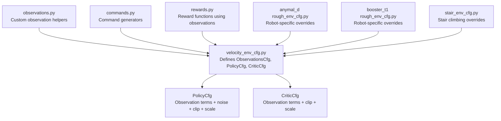
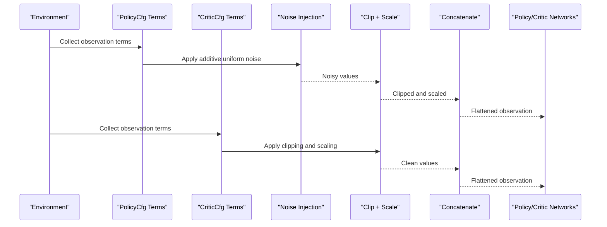
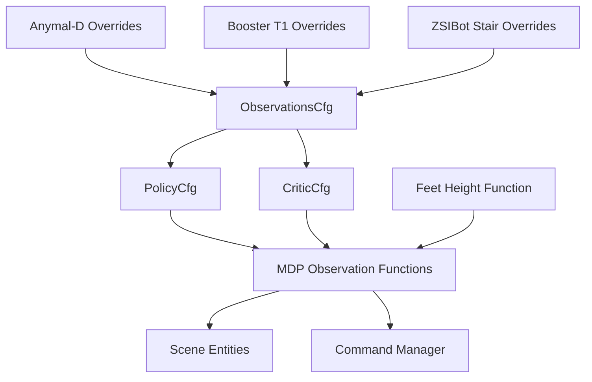

# Observation System and State Representation

<cite>
**Referenced Files in This Document**
- [velocity_env_cfg.py](file://source/robot_lab/robot_lab/tasks/manager_based/locomotion/velocity/velocity_env_cfg.py)
- [observations.py](file://source/robot_lab/robot_lab/tasks/manager_based/locomotion/velocity/mdp/observations.py)
- [commands.py](file://source/robot_lab/robot_lab/tasks/manager_based/locomotion/velocity/mdp/commands.py)
- [rewards.py](file://source/robot_lab/robot_lab/tasks/manager_based/locomotion/velocity/mdp/rewards.py)
- [rough_env_cfg.py](file://source/robot_lab/robot_lab/tasks/manager_based/locomotion/velocity/config/quadruped/anymal_d/rough_env_cfg.py)
- [rough_env_cfg.py](file://source/robot_lab/robot_lab/tasks/manager_based/locomotion/velocity/config/humanoid/booster_t1/rough_env_cfg.py)
- [stair_env_cfg.py](file://source/robot_lab/robot_lab/tasks/manager_based/locomotion/velocity/config/quadruped/zsibot_zsl1/stair_env_cfg.py)
</cite>

## Update Summary
**Changes Made**
- Added documentation for the new `feet_height_in_body_frame` observation function
- Updated the Individual Observation Terms section to include this new function
- Enhanced the CriticCfg section to explain the new terrain clearance observation
- Added information about the function's purpose for stair climbing scenarios
- Updated configuration examples to show the new observation parameters

## Table of Contents
1. [Introduction](#introduction)
2. [Project Structure](#project-structure)
3. [Core Components](#core-components)
4. [Architecture Overview](#architecture-overview)
5. [Detailed Component Analysis](#detailed-component-analysis)
6. [Dependency Analysis](#dependency-analysis)
7. [Performance Considerations](#performance-considerations)
8. [Troubleshooting Guide](#troubleshooting-guide)
9. [Conclusion](#conclusion)

## Introduction
This document explains the observation system and state representation used in velocity-based locomotion. It focuses on the ObservationsCfg class with PolicyCfg and CriticCfg observation groups, detailing each observation term, noise injection, clipping, scaling, and data corruption controls. It also covers concatenation strategies, preprocessing pipelines, and practical configuration examples for policy and critic branches, along with performance implications for training stability.

## Project Structure
The observation system is defined within the velocity-based locomotion task configuration and supported by MDP modules for commands, rewards, and specialized observation helpers.

**Diagram sources**
- [velocity_env_cfg.py:130-271](file://source/robot_lab/robot_lab/tasks/manager_based/locomotion/velocity/velocity_env_cfg.py#L130-L271)
- [observations.py:1-63](file://source/robot_lab/robot_lab/tasks/manager_based/locomotion/velocity/mdp/observations.py#L1-L63)
- [commands.py:21-85](file://source/robot_lab/robot_lab/tasks/manager_based/locomotion/velocity/mdp/commands.py#L21-L85)
- [rewards.py:22-75](file://source/robot_lab/robot_lab/tasks/manager_based/locomotion/velocity/mdp/rewards.py#L22-L75)
- [rough_env_cfg.py:14-34](file://source/robot_lab/robot_lab/tasks/manager_based/locomotion/velocity/config/quadruped/anymal_d/rough_env_cfg.py#L14-L34)
- [rough_env_cfg.py:16-36](file://source/robot_lab/robot_lab/tasks/manager_based/locomotion/velocity/config/humanoid/booster_t1/rough_env_cfg.py#L16-L36)
- [stair_env_cfg.py:80-90](file://source/robot_lab/robot_lab/tasks/manager_based/locomotion/velocity/config/quadruped/zsibot_zsl1/stair_env_cfg.py#L80-L90)

**Section sources**
- [velocity_env_cfg.py:130-271](file://source/robot_lab/robot_lab/tasks/manager_based/locomotion/velocity/velocity_env_cfg.py#L130-L271)
- [observations.py:1-63](file://source/robot_lab/robot_lab/tasks/manager_based/locomotion/velocity/mdp/observations.py#L1-L63)
- [commands.py:21-85](file://source/robot_lab/robot_lab/tasks/manager_based/locomotion/velocity/mdp/commands.py#L21-L85)
- [rewards.py:22-75](file://source/robot_lab/robot_lab/tasks/manager_based/locomotion/velocity/mdp/rewards.py#L22-L75)
- [rough_env_cfg.py:14-34](file://source/robot_lab/robot_lab/tasks/manager_based/locomotion/velocity/config/quadruped/anymal_d/rough_env_cfg.py#L14-L34)
- [rough_env_cfg.py:16-36](file://source/robot_lab/robot_lab/tasks/manager_based/locomotion/velocity/config/humanoid/booster_t1/rough_env_cfg.py#L16-L36)
- [stair_env_cfg.py:80-90](file://source/robot_lab/robot_lab/tasks/manager_based/locomotion/velocity/config/quadruped/zsibot_zsl1/stair_env_cfg.py#L80-L90)

## Core Components
- ObservationsCfg: Central configuration container for observations, composed of two groups:
  - PolicyCfg: Used by the policy network; enables noise injection and corruption for robustness.
  - CriticCfg: Used by the critic network; disables noise and corruption for stable value estimation.
- Observation terms: Ordered list of ObsTerm entries, each specifying a function, optional parameters, noise, clipping, and scaling.
- Concatenation: Both groups concatenate terms into a single flattened observation tensor.
- Corruption: Policy group can inject data corruption; Critic group does not.

Key observation terms in PolicyCfg and CriticCfg include:
- Base linear and angular velocities
- Projected gravity vector
- Velocity commands
- Joint positions and velocities (relative to defaults)
- Last actions
- Height scan from a ray-caster sensor
- **Feet height in body frame** (enhanced critic observations for complex terrain)

**Section sources**
- [velocity_env_cfg.py:133-271](file://source/robot_lab/robot_lab/tasks/manager_based/locomotion/velocity/velocity_env_cfg.py#L133-L271)

## Architecture Overview
The observation pipeline transforms raw sensor and state signals into normalized tensors consumed by policy and critic networks. The policy receives noisy observations to improve generalization, while the critic receives clean observations for stable value estimation.

**Diagram sources**
- [velocity_env_cfg.py:133-271](file://source/robot_lab/robot_lab/tasks/manager_based/locomotion/velocity/velocity_env_cfg.py#L133-L271)

## Detailed Component Analysis

### ObservationsCfg and Groups
- PolicyCfg:
  - Enables noise injection and corruption.
  - Concatenates observation terms in order.
  - Includes base linear/angular velocities, projected gravity, velocity commands, joint positions/velocities, last actions, and height scan.
- CriticCfg:
  - Disables noise and corruption.
  - Concatenates observation terms in order.
  - Mirrors the same terms as PolicyCfg but without noise.
  - **Enhanced with feet height observation for complex terrain scenarios.**

Configuration highlights:
- Noise: Additive uniform noise applied per term.
- Clip: Tuple of (min, max) bounds applied after noise.
- Scale: Multiplicative factor applied after clipping.
- Corruption: Boolean flag controlling whether corrupted observations are produced.

**Section sources**
- [velocity_env_cfg.py:133-271](file://source/robot_lab/robot_lab/tasks/manager_based/locomotion/velocity/velocity_env_cfg.py#L133-L271)

### Individual Observation Terms

#### Base Linear Velocity
- Function: Base linear velocity in body frame.
- Noise: Optional uniform noise injected.
- Clip: Typical broad range to avoid extreme outliers.
- Scale: Normalization factor tailored per robot/environment.
- Use: Captures forward/backward and lateral translation relative to the robot.

**Section sources**
- [velocity_env_cfg.py:138-143](file://source/robot_lab/robot_lab/tasks/manager_based/locomotion/velocity/velocity_env_cfg.py#L138-L143)

#### Base Angular Velocity
- Function: Base angular velocity around the z-axis in body frame.
- Noise: Optional uniform noise injected.
- Clip: Broad range to prevent saturation.
- Scale: Often reduced to emphasize yaw dynamics.
- Use: Encodes turning rate and rotational stability.

**Section sources**
- [velocity_env_cfg.py:144-149](file://source/robot_lab/robot_lab/tasks/manager_based/locomotion/velocity/velocity_env_cfg.py#L144-L149)

#### Projected Gravity Vector
- Function: Projection of gravity onto the robot's body frame.
- Noise: Optional small uniform noise.
- Clip: Broad range to avoid numerical issues.
- Scale: Unit magnitude normalization often implied.
- Use: Encodes tilt and levelness; stabilizes reward shaping.

**Section sources**
- [velocity_env_cfg.py:150-155](file://source/robot_lab/robot_lab/tasks/manager_based/locomotion/velocity/velocity_env_cfg.py#L150-L155)

#### Velocity Commands
- Function: Generated command for base velocity (x/y translational, z rotational).
- Parameters: Selects the command source by name.
- Clip: Broad range.
- Scale: Normalization factor.
- Use: Supervisory signal guiding velocity tracking rewards.

**Section sources**
- [velocity_env_cfg.py:156-161](file://source/robot_lab/robot_lab/tasks/manager_based/locomotion/velocity/velocity_env_cfg.py#L156-L161)

#### Joint Positions (Relative)
- Function: Joint positions relative to default rest configuration.
- Parameters: Asset selection and joint filtering.
- Noise: Small uniform noise.
- Clip: Broad range.
- Scale: Often identity or slight normalization.
- Use: Regularizes posture and compensates for actuator drift.

**Section sources**
- [velocity_env_cfg.py:162-168](file://source/robot_lab/robot_lab/tasks/manager_based/locomotion/velocity/velocity_env_cfg.py#L162-L168)

#### Joint Velocities (Relative)
- Function: Joint velocities relative to default rest configuration.
- Parameters: Asset selection and joint filtering.
- Noise: Larger uniform noise to simulate sensor variability.
- Clip: Broad range.
- Scale: Reduced factor to down-weight high-frequency noise.
- Use: Penalizes excessive motion and aids stability.

**Section sources**
- [velocity_env_cfg.py:169-175](file://source/robot_lab/robot_lab/tasks/manager_based/locomotion/velocity/velocity_env_cfg.py#L169-L175)

#### Last Actions
- Function: Previous actions sent to the robot.
- Clip: Broad range.
- Scale: Identity.
- Use: Temporal continuity and action smoothing.

**Section sources**
- [velocity_env_cfg.py:176-180](file://source/robot_lab/robot_lab/tasks/manager_based/locomotion/velocity/velocity_env_cfg.py#L176-L180)

#### Height Scan
- Function: Height measurements from a ray-caster sensor.
- Parameters: Sensor entity selection.
- Noise: Small uniform noise.
- Clip: Narrow range to bound sensor artifacts.
- Scale: Identity.
- Use: Terrain adaptation and foothold awareness.

**Section sources**
- [velocity_env_cfg.py:181-187](file://source/robot_lab/robot_lab/tasks/manager_based/locomotion/velocity/velocity_env_cfg.py#L181-L187)

#### Feet Height in Body Frame
- **New Function**: Computes foot heights relative to the robot's body frame.
- **Purpose**: Provides crucial terrain clearance information for stair climbing and complex terrain scenarios.
- **Enhanced Critic**: Available only in CriticCfg for improved value estimation in challenging terrains.
- **Parameters**: Asset configuration specifying foot link names (e.g., `".*_FOOT_LINK"`).
- **Clip**: Narrow range `(-0.5, 0.5)` to bound terrain clearance values.
- **Scale**: Factor `2.0` to emphasize terrain clearance differences.
- **Use**: Helps the critic understand relative foot heights for better value estimation during stair climbing and uneven terrain navigation.

**Section sources**
- [velocity_env_cfg.py:248-255](file://source/robot_lab/robot_lab/tasks/manager_based/locomotion/velocity/velocity_env_cfg.py#L248-L255)
- [observations.py:38-62](file://source/robot_lab/robot_lab/tasks/manager_based/locomotion/velocity/mdp/observations.py#L38-L62)

### Noise Injection Mechanisms
- Noise type: Additive uniform noise configured per term.
- Placement: Applied before clipping and scaling.
- Robot-specific overrides: Some configurations increase or decrease noise scales for robustness.

Examples of noise parameters:
- Base linear velocity: small range.
- Base angular velocity: moderate range.
- Joint positions: small range.
- Joint velocities: larger range.
- Height scan: small range.

**Section sources**
- [velocity_env_cfg.py:140-141](file://source/robot_lab/robot_lab/tasks/manager_based/locomotion/velocity/velocity_env_cfg.py#L140-L141)
- [velocity_env_cfg.py:146-147](file://source/robot_lab/robot_lab/tasks/manager_based/locomotion/velocity/velocity_env_cfg.py#L146-L147)
- [velocity_env_cfg.py:152-153](file://source/robot_lab/robot_lab/tasks/manager_based/locomotion/velocity/velocity_env_cfg.py#L152-L153)
- [velocity_env_cfg.py:165-166](file://source/robot_lab/robot_lab/tasks/manager_based/locomotion/velocity/velocity_env_cfg.py#L165-L166)
- [velocity_env_cfg.py:172-173](file://source/robot_lab/robot_lab/tasks/manager_based/locomotion/velocity/velocity_env_cfg.py#L172-L173)
- [velocity_env_cfg.py:184-185](file://source/robot_lab/robot_lab/tasks/manager_based/locomotion/velocity/velocity_env_cfg.py#L184-L185)

### Clipping and Scaling
- Clip: Applies hard bounds to stabilize training and avoid outliers.
- Scale: Normalizes magnitudes to align with expected ranges for neural networks.
- Robot-specific overrides: Scales are tuned per robot to balance sensitivity and stability.

Examples of scale overrides:
- Base linear velocity: increased scale for responsiveness.
- Base angular velocity: reduced scale for stability.
- Joint positions: identity scale.
- Joint velocities: reduced scale.
- **Feet height in body frame**: scale factor of `2.0` for enhanced terrain clearance sensitivity.

**Section sources**
- [velocity_env_cfg.py:142-143](file://source/robot_lab/robot_lab/tasks/manager_based/locomotion/velocity/velocity_env_cfg.py#L142-L143)
- [velocity_env_cfg.py:148-149](file://source/robot_lab/robot_lab/tasks/manager_based/locomotion/velocity/velocity_env_cfg.py#L148-L149)
- [velocity_env_cfg.py:167-168](file://source/robot_lab/robot_lab/tasks/manager_based/locomotion/velocity/velocity_env_cfg.py#L167-L168)
- [velocity_env_cfg.py:174-175](file://source/robot_lab/robot_lab/tasks/manager_based/locomotion/velocity/velocity_env_cfg.py#L174-L175)
- [velocity_env_cfg.py:253-254](file://source/robot_lab/robot_lab/tasks/manager_based/locomotion/velocity/velocity_env_cfg.py#L253-L254)
- [rough_env_cfg.py:29-32](file://source/robot_lab/robot_lab/tasks/manager_based/locomotion/velocity/config/quadruped/anymal_d/rough_env_cfg.py#L29-L32)
- [rough_env_cfg.py:31-34](file://source/robot_lab/robot_lab/tasks/manager_based/locomotion/velocity/config/humanoid/booster_t1/rough_env_cfg.py#L31-L34)

### Data Corruption Techniques
- Corruption flag: Controlled per group.
- Policy group: enable_corruption = True (introduces robustness).
- Critic group: enable_corruption = False (stable value estimation).
- Purpose: Policy learns under noisy conditions; critic remains stable.

**Section sources**
- [velocity_env_cfg.py:190-192](file://source/robot_lab/robot_lab/tasks/manager_based/locomotion/velocity/velocity_env_cfg.py#L190-L192)
- [velocity_env_cfg.py:265-267](file://source/robot_lab/robot_lab/tasks/manager_based/locomotion/velocity/velocity_env_cfg.py#L265-L267)

### Concatenation Strategies
- Order preservation: Terms are concatenated in the declared order.
- Flattening: Each term is flattened before concatenation.
- Group independence: Policy and Critic maintain separate concatenations.

**Section sources**
- [velocity_env_cfg.py:190-192](file://source/robot_lab/robot_lab/tasks/manager_based/locomotion/velocity/velocity_env_cfg.py#L190-L192)
- [velocity_env_cfg.py:265-267](file://source/robot_lab/robot_lab/tasks/manager_based/locomotion/velocity/velocity_env_cfg.py#L265-L267)

### Preprocessing Pipelines
- Step-by-step:
  1. Extract term values from the environment.
  2. Optionally inject additive uniform noise.
  3. Apply clip bounds.
  4. Apply scale factor.
  5. Flatten and concatenate across terms.
- Policy vs Critic:
  - Policy adds noise and may enable corruption.
  - Critic bypasses noise and corruption.
  - **Critic includes enhanced terrain clearance observation for complex scenarios.**

**Section sources**
- [velocity_env_cfg.py:133-271](file://source/robot_lab/robot_lab/tasks/manager_based/locomotion/velocity/velocity_env_cfg.py#L133-L271)

### Examples of Observation Term Configuration
- PolicyCfg:
  - Base linear velocity: noise, clip, scale.
  - Joint velocities: higher noise and reduced scale.
  - Height scan: small noise and narrow clip.
- CriticCfg:
  - Identical terms without noise.
  - Same clip and scale as PolicyCfg.
  - **Enhanced with feet height observation for terrain clearance.**
- Robot-specific overrides:
  - Anymal-D rough environment:
    - Increased base linear velocity scale.
    - Reduced joint velocities scale.
  - Booster T1 rough environment:
    - Increased base linear velocity scale.
    - Reduced base angular velocity scale.
    - Explicitly removing base linear velocity and height scan from policy.
  - **ZSIBot ZSL1 stair environment:**
    - Base linear velocity scale increased to `2.0`.
    - Base angular velocity scale reduced to `0.25`.
    - Base linear velocity term removed from policy for stability.
    - Height scan enabled for terrain perception during stair climbing.

**Section sources**
- [velocity_env_cfg.py:138-187](file://source/robot_lab/robot_lab/tasks/manager_based/locomotion/velocity/velocity_env_cfg.py#L138-L187)
- [velocity_env_cfg.py:198-241](file://source/robot_lab/robot_lab/tasks/manager_based/locomotion/velocity/velocity_env_cfg.py#L198-L241)
- [velocity_env_cfg.py:248-255](file://source/robot_lab/robot_lab/tasks/manager_based/locomotion/velocity/velocity_env_cfg.py#L248-L255)
- [rough_env_cfg.py:28-34](file://source/robot_lab/robot_lab/tasks/manager_based/locomotion/velocity/config/quadruped/anymal_d/rough_env_cfg.py#L28-L34)
- [rough_env_cfg.py:30-36](file://source/robot_lab/robot_lab/tasks/manager_based/locomotion/velocity/config/humanoid/booster_t1/rough_env_cfg.py#L30-L36)
- [stair_env_cfg.py:80-90](file://source/robot_lab/robot_lab/tasks/manager_based/locomotion/velocity/config/quadruped/zsibot_zsl1/stair_env_cfg.py#L80-L90)

### Relationship to Commands and Rewards
- Commands: Velocity commands are generated and passed to the environment; observations include these commands to guide tracking.
- Rewards: Many reward functions depend on observations (e.g., tracking errors, contact times, projected gravity), reinforcing the importance of accurate and stable observation pipelines.
- **Enhanced terrain rewards**: Stair climbing rewards benefit from the feet height observation for better terrain clearance assessment.

**Section sources**
- [commands.py:21-85](file://source/robot_lab/robot_lab/tasks/manager_based/locomotion/velocity/mdp/commands.py#L21-L85)
- [rewards.py:22-75](file://source/robot_lab/robot_lab/tasks/manager_based/locomotion/velocity/mdp/rewards.py#L22-L75)

## Dependency Analysis
- ObservationsCfg depends on:
  - MDP observation functions for each term.
  - Scene entities (robot asset, sensors).
  - Command manager for velocity commands.
- Robot-specific overrides depend on:
  - Base link and foot link naming conventions.
  - Sensor prim paths aligned to base link.
- **New dependency**: Feet height observation requires proper foot link naming patterns (e.g., `".*_FOOT_LINK"`).

**Diagram sources**
- [velocity_env_cfg.py:130-271](file://source/robot_lab/robot_lab/tasks/manager_based/locomotion/velocity/velocity_env_cfg.py#L130-L271)
- [observations.py:38-62](file://source/robot_lab/robot_lab/tasks/manager_based/locomotion/velocity/mdp/observations.py#L38-L62)
- [rough_env_cfg.py:14-34](file://source/robot_lab/robot_lab/tasks/manager_based/locomotion/velocity/config/quadruped/anymal_d/rough_env_cfg.py#L14-L34)
- [rough_env_cfg.py:16-36](file://source/robot_lab/robot_lab/tasks/manager_based/locomotion/velocity/config/humanoid/booster_t1/rough_env_cfg.py#L16-L36)
- [stair_env_cfg.py:56-66](file://source/robot_lab/robot_lab/tasks/manager_based/locomotion/velocity/config/quadruped/zsibot_zsl1/stair_env_cfg.py#L56-L66)

**Section sources**
- [velocity_env_cfg.py:130-271](file://source/robot_lab/robot_lab/tasks/manager_based/locomotion/velocity/velocity_env_cfg.py#L130-L271)
- [observations.py:38-62](file://source/robot_lab/robot_lab/tasks/manager_based/locomotion/velocity/mdp/observations.py#L38-L62)
- [rough_env_cfg.py:14-34](file://source/robot_lab/robot_lab/tasks/manager_based/locomotion/velocity/config/quadruped/anymal_d/rough_env_cfg.py#L14-L34)
- [rough_env_cfg.py:16-36](file://source/robot_lab/robot_lab/tasks/manager_based/locomotion/velocity/config/humanoid/booster_t1/rough_env_cfg.py#L16-L36)
- [stair_env_cfg.py:56-66](file://source/robot_lab/robot_lab/tasks/manager_based/locomotion/velocity/config/quadruped/zsibot_zsl1/stair_env_cfg.py#L56-L66)

## Performance Considerations
- Training stability:
  - Policy noise improves generalization but should be calibrated to avoid saturating the action space.
  - Critic absence of noise yields stable value estimates.
  - **Feet height observation provides valuable terrain information without significantly impacting computational cost.**
- Computational cost:
  - Concatenation is linear in the number of terms; reducing terms or simplifying scales can lower overhead.
  - **Feet height observation adds minimal computational overhead while providing significant benefits for stair climbing.**
- Robustness:
  - Robot-specific scales and noise adjustments help adapt to different dynamics and sensor characteristics.
  - **Foot link naming consistency is crucial for proper feet height computation.**

## Troubleshooting Guide
- Symmetry helpers:
  - Custom helper for joint positions relative to defaults (excluding wheels) is available for specialized setups.
- Command-aware behavior:
  - Commands can be restricted on certain terrains to prevent unrealistic motion during training.
- Reward alignment:
  - Several rewards incorporate projected gravity and contact sensor data; ensure observations reflect these signals consistently.
- **Feet height observation issues:**
  - Ensure foot link naming follows the pattern `".*_FOOT_LINK"` or adjust the asset configuration accordingly.
  - Verify that the robot asset has proper foot link definitions in the URDF/robot description.
  - Check that the critic group includes the feet height observation for stair climbing scenarios.

**Section sources**
- [observations.py:16-26](file://source/robot_lab/robot_lab/tasks/manager_based/locomotion/velocity/mdp/observations.py#L16-L26)
- [commands.py:21-85](file://source/robot_lab/robot_lab/tasks/manager_based/locomotion/velocity/mdp/commands.py#L21-L85)
- [rewards.py:22-75](file://source/robot_lab/robot_lab/tasks/manager_based/locomotion/velocity/mdp/rewards.py#L22-L75)
- [stair_env_cfg.py:56-66](file://source/robot_lab/robot_lab/tasks/manager_based/locomotion/velocity/config/quadruped/zsibot_zsl1/stair_env_cfg.py#L56-L66)

## Conclusion
The observation system separates policy and critic pathways to balance robustness and stability. PolicyCfg leverages noise and optional corruption to generalize across diverse conditions, while CriticCfg maintains clean, consistent inputs for reliable value estimation. The addition of the feet height in body frame observation enhances the critic's ability to handle complex terrain scenarios, particularly stair climbing, by providing crucial terrain clearance information. Carefully tuned clipping, scaling, and robot-specific overrides ensure stable training and strong performance across different locomotion platforms.