# Parkour Navigation System

<cite>
**Referenced Files in This Document**
- [rough_env_cfg.py](file://source/robot_lab/robot_lab/tasks/manager_based/locomotion/velocity/config/quadruped/unitree_go2_parkour/rough_env_cfg.py)
- [terrains_cfg.py](file://source/robot_lab/robot_lab/tasks/manager_based/locomotion/velocity/config/quadruped/unitree_go2_parkour/terrains_cfg.py)
- [mesh_terrains.py](file://source/robot_lab/robot_lab/tasks/manager_based/locomotion/velocity/config/quadruped/unitree_go2_parkour/mesh_terrains.py)
- [utils.py](file://source/robot_lab/robot_lab/tasks/manager_based/locomotion/velocity/config/quadruped/unitree_go2_parkour/utils.py)
- [observations.py](file://source/robot_lab/robot_lab/tasks/manager_based/locomotion/velocity/config/quadruped/unitree_go2_parkour/mdp/observations.py)
- [rewards.py](file://source/robot_lab/robot_lab/tasks/manager_based/locomotion/velocity/config/quadruped/unitree_go2_parkour/mdp/rewards.py)
- [rsl_rl_ppo_cfg.py](file://source/robot_lab/robot_lab/tasks/manager_based/locomotion/velocity/config/quadruped/unitree_go2_parkour/agents/rsl_rl_ppo_cfg.py)
- [actor_critic_scan.py](file://source/robot_lab/robot_lab/tasks/manager_based/locomotion/velocity/config/quadruped/unitree_go2_parkour/agents/actor_critic_scan.py)
- [unitree.py](file://source/robot_lab/robot_lab/assets/unitree.py)
- [rough_env_cfg.py](file://source/robot_lab/robot_lab/tasks/manager_based/locomotion/velocity/config/quadruped/zsibot_zsl1_parkour/rough_env_cfg.py)
- [rsl_rl_ppo_cfg.py](file://source/robot_lab/robot_lab/tasks/manager_based/locomotion/velocity/config/quadruped/zsibot_zsl1_parkour/agents/rsl_rl_ppo_cfg.py)
- [observations.py](file://source/robot_lab/robot_lab/tasks/manager_based/locomotion/velocity/config/quadruped/zsibot_zsl1_parkour/mdp/observations.py)
- [rewards.py](file://source/robot_lab/robot_lab/tasks/manager_based/locomotion/velocity/config/quadruped/zsibot_zsl1_parkour/mdp/rewards.py)
- [parkour_env_cfg.py](file://source/robot_lab/robot_lab/tasks/manager_based/locomotion/velocity/config/quadruped/zsibot_zsl1/parkour_env_cfg.py)
- [README.md](file://README.md)
- [__init__.py](file://source/robot_lab/robot_lab/tasks/manager_based/locomotion/velocity/config/quadruped/unitree_go2_parkour/__init__.py)
- [__init__.py](file://source/robot_lab/robot_lab/tasks/manager_based/locomotion/velocity/config/quadruped/zsibot_zsl1_parkour/__init__.py)
- [__init__.py](file://source/robot_lab/robot_lab/tasks/manager_based/locomotion/velocity/config/quadruped/zsibot_zsl1/__init__.py)
</cite>

## Update Summary
**Changes Made**
- Enhanced with standardized naming convention examples for Unitree Go2 and ZSIBOT ZSL1 parkour environments
- Updated environment registration to use RobotLab-Isaac-Velocity- prefixed environment names
- Added comprehensive environment listing with standardized naming patterns
- Integrated dual robot platform support with consistent naming conventions

## Table of Contents
1. [Introduction](#introduction)
2. [System Architecture](#system-architecture)
3. [Core Components](#core-components)
4. [Go2 Parkour Terrain Generation](#go2-parkour-terrain-generation)
5. [ZSL1 Parkour Implementation](#zsl1-parkour-implementation)
6. [Advanced Neural Network Architecture](#advanced-neural-network-architecture)
7. [Enhanced Reward System Design](#enhanced-reward-system-design)
8. [Robot Configuration](#robot-configuration)
9. [Training Configuration](#training-configuration)
10. [Environment Naming Convention](#environment-naming-convention)
11. [Environment Registration Examples](#environment-registration-examples)
12. [Performance Considerations](#performance-considerations)
13. [Troubleshooting Guide](#troubleshooting-guide)
14. [Conclusion](#conclusion)

## Introduction

The Parkour Navigation System has undergone a comprehensive enhancement to provide a dual-platform implementation supporting both Unitree Go2 and ZSIBOT ZSL1 quadruped robots. This advanced system represents a significant evolution from the previous ZSL1-focused approach, now offering sophisticated parkour capabilities for multiple robot platforms with custom neural networks, advanced terrain generation, and specialized reward systems.

The system leverages NVIDIA's Isaac Lab platform with a modular architecture that combines advanced terrain generation algorithms, custom neural network architectures, and reward shaping techniques. The new implementation focuses on parkour-style navigation capabilities including obstacle negotiation, step climbing, gap traversal, and complex terrain adaptation across both robot platforms.

**Updated** Enhanced with standardized naming convention examples for Unitree Go2 and ZSIBOT ZSL1 parkour environments. The system now uses consistent RobotLab-Isaac-Velocity- prefixed environment names for improved organization and discoverability.

## System Architecture

The dual-platform Parkour System follows a modernized modular architecture built around the Isaac Lab framework, providing comprehensive solutions for advanced quadruped parkour navigation across multiple robot platforms:

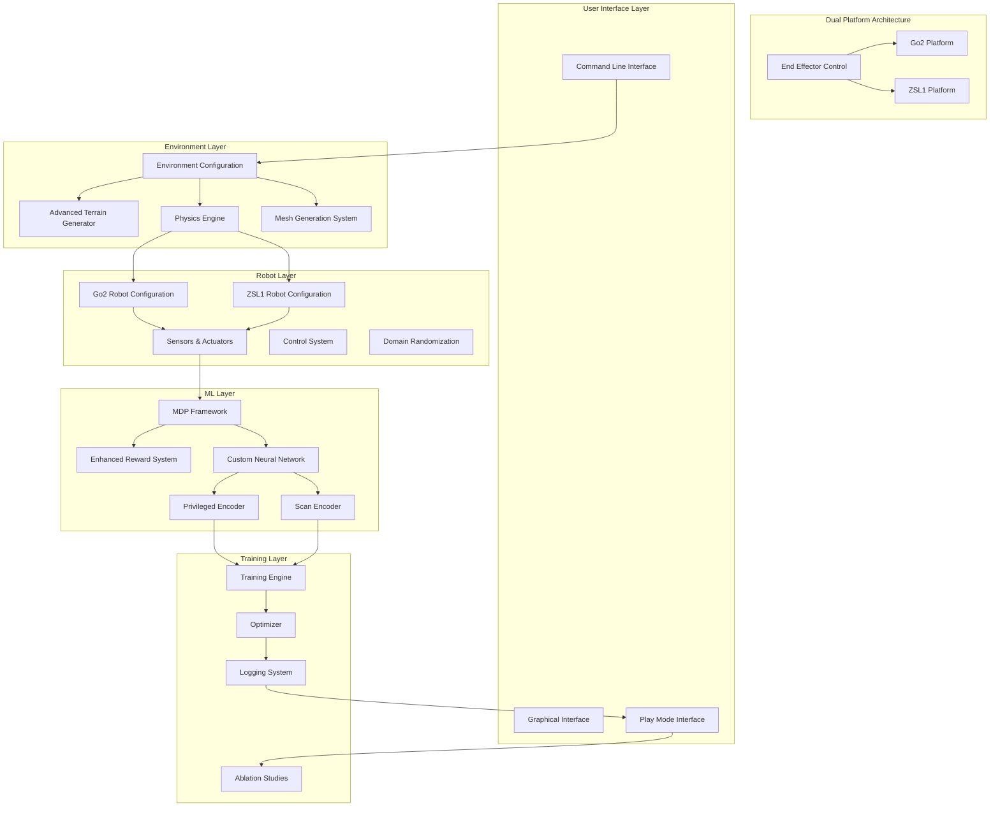

**Diagram sources**
- [rough_env_cfg.py:448-502](file://source/robot_lab/robot_lab/tasks/manager_based/locomotion/velocity/config/quadruped/unitree_go2_parkour/rough_env_cfg.py#L448-L502)
- [rsl_rl_ppo_cfg.py:128-193](file://source/robot_lab/robot_lab/tasks/manager_based/locomotion/velocity/config/quadruped/unitree_go2_parkour/agents/rsl_rl_ppo_cfg.py#L128-L193)

The architecture consists of several key layers with enhanced capabilities:

- **Dual Platform Support**: Advanced terrain generation with mesh-based algorithms and domain randomization for both Go2 and ZSL1 robots
- **Robot Layer**: Platform-specific configurations with enhanced sensor integration and actuator control
- **ML Layer**: Custom neural network architecture with separate encoders for different observation types
- **Training Layer**: Comprehensive training framework with ablation studies and performance monitoring

## Core Components

### Advanced Environment Configuration System

The system utilizes a sophisticated hierarchical configuration approach with enhanced modularity and dual-platform support:

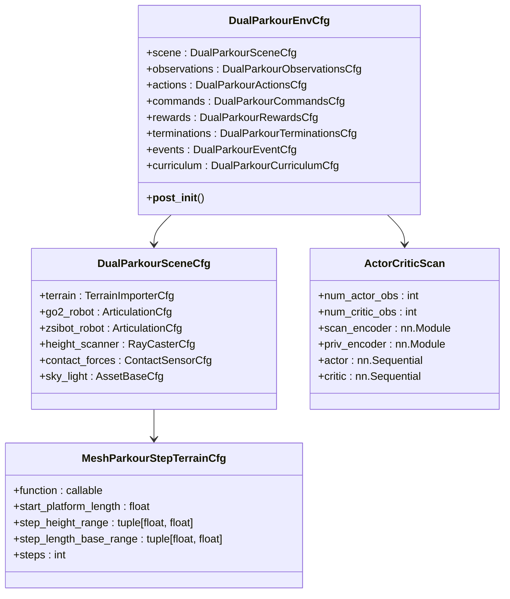

**Diagram sources**
- [rough_env_cfg.py:448-502](file://source/robot_lab/robot_lab/tasks/manager_based/locomotion/velocity/config/quadruped/unitree_go2_parkour/rough_env_cfg.py#L448-L502)
- [rsl_rl_ppo_cfg.py:30-120](file://source/robot_lab/robot_lab/tasks/manager_based/locomotion/velocity/config/quadruped/unitree_go2_parkour/agents/rsl_rl_ppo_cfg.py#L30-L120)

**Section sources**
- [rough_env_cfg.py:448-502](file://source/robot_lab/robot_lab/tasks/manager_based/locomotion/velocity/config/quadruped/unitree_go2_parkour/rough_env_cfg.py#L448-L502)
- [rsl_rl_ppo_cfg.py:30-120](file://source/robot_lab/robot_lab/tasks/manager_based/locomotion/velocity/config/quadruped/unitree_go2_parkour/agents/rsl_rl_ppo_cfg.py#L30-L120)

### Enhanced Observation and Action Spaces

The system defines sophisticated observation and action spaces with custom neural network integration for both platforms:


**Diagram sources**
- [rough_env_cfg.py:207-288](file://source/robot_lab/robot_lab/tasks/manager_based/locomotion/velocity/config/quadruped/unitree_go2_parkour/rough_env_cfg.py#L207-L288)
- [actor_critic_scan.py:20-146](file://source/robot_lab/robot_lab/tasks/manager_based/locomotion/velocity/config/quadruped/unitree_go2_parkour/agents/actor_critic_scan.py#L20-L146)

**Section sources**
- [rough_env_cfg.py:207-288](file://source/robot_lab/robot_lab/tasks/manager_based/locomotion/velocity/config/quadruped/unitree_go2_parkour/rough_env_cfg.py#L207-L288)
- [actor_critic_scan.py:20-146](file://source/robot_lab/robot_lab/tasks/manager_based/locomotion/velocity/config/quadruped/unitree_go2_parkour/agents/actor_critic_scan.py#L20-L146)

## Go2 Parkour Terrain Generation

The Go2 terrain generation system creates sophisticated and challenging environments for Go2 parkour training:

### Advanced Mesh-Based Terrain Generation

The system generates complex terrains using advanced mesh generation algorithms with customizable parameters:

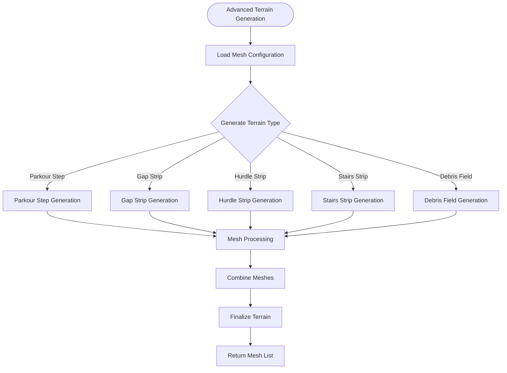

**Diagram sources**
- [mesh_terrains.py:749-800](file://source/robot_lab/robot_lab/tasks/manager_based/locomotion/velocity/config/quadruped/unitree_go2_parkour/mesh_terrains.py#L749-L800)
- [terrains_cfg.py:194-208](file://source/robot_lab/robot_lab/tasks/manager_based/locomotion/velocity/config/quadruped/unitree_go2_parkour/terrains_cfg.py#L194-L208)

The terrain generation algorithm creates diverse parkour environments with configurable parameters:

- **Parkour Step Terrain**: Variable height and length ranges for realistic obstacle progression
- **Gap Strip Terrain**: Repeated gap-and-landing sequences for landing precision training
- **Hurdle Strip Terrain**: Series of hurdles with configurable heights and spacing
- **Stairs Strip Terrain**: Up/down stair segments with customizable patterns
- **Debris Field Terrain**: Mixed box and cylinder obstacles for complex navigation

**Section sources**
- [mesh_terrains.py:749-800](file://source/robot_lab/robot_lab/tasks/manager_based/locomotion/velocity/config/quadruped/unitree_go2_parkour/mesh_terrains.py#L749-L800)
- [terrains_cfg.py:194-208](file://source/robot_lab/robot_lab/tasks/manager_based/locomotion/velocity/config/quadruped/unitree_go2_parkour/terrains_cfg.py#L194-L208)

### Enhanced Terrain Configuration System

The system provides comprehensive terrain configuration with advanced customization options:

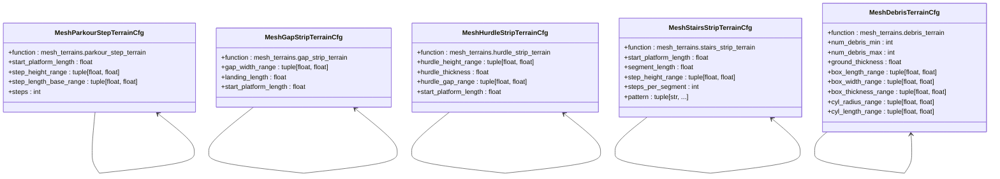

**Diagram sources**
- [terrains_cfg.py:194-315](file://source/robot_lab/robot_lab/tasks/manager_based/locomotion/velocity/config/quadruped/unitree_go2_parkour/terrains_cfg.py#L194-L315)

**Section sources**
- [terrains_cfg.py:194-315](file://source/robot_lab/robot_lab/tasks/manager_based/locomotion/velocity/config/quadruped/unitree_go2_parkour/terrains_cfg.py#L194-L315)

## ZSL1 Parkour Implementation

The ZSL1 implementation provides specialized parkour capabilities tailored for the ZSIBOT ZSL1 robot platform:

### Custom ZSL1 Terrain Generation

The ZSL1 system features unique terrain configurations optimized for the ZSL1 robot's capabilities:

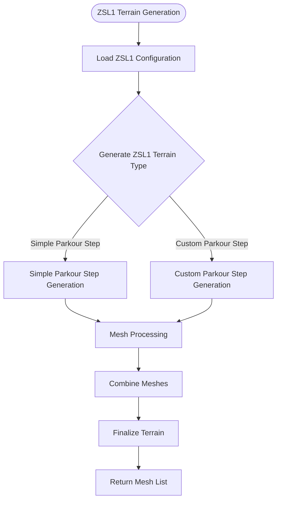

**Diagram sources**
- [parkour_env_cfg.py:26-208](file://source/robot_lab/robot_lab/tasks/manager_based/locomotion/velocity/config/quadruped/zsibot_zsl1/parkour_env_cfg.py#L26-L208)

The ZSL1 terrain generation includes specialized configurations:

- **Simple Parkour Step**: Optimized for controlled stepping with reduced complexity
- **Custom Parkour Step**: Advanced configuration with enhanced step parameters
- **Parkour Terrains Configuration**: Custom terrain generator with specific proportions and parameters

**Section sources**
- [parkour_env_cfg.py:26-208](file://source/robot_lab/robot_lab/tasks/manager_based/locomotion/velocity/config/quadruped/zsibot_zsl1/parkour_env_cfg.py#L26-L208)

### ZSL1-Specific Reward System

The ZSL1 reward system includes specialized functions optimized for ZSL1 parkour performance:

#### Climbing Progress Reward

The climbing progress reward encourages controlled ascent and descent movements:

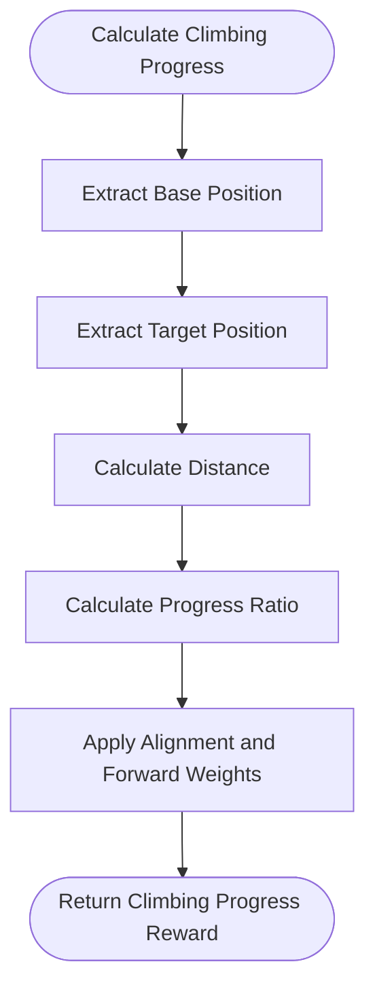

**Diagram sources**
- [parkour_env_cfg.py:410-414](file://source/robot_lab/robot_lab/tasks/manager_based/locomotion/velocity/config/quadruped/zsibot_zsl1/parkour_env_cfg.py#L410-L414)

#### Joint Mirror Reward

Advanced joint mirroring prevents asymmetrical movement patterns:

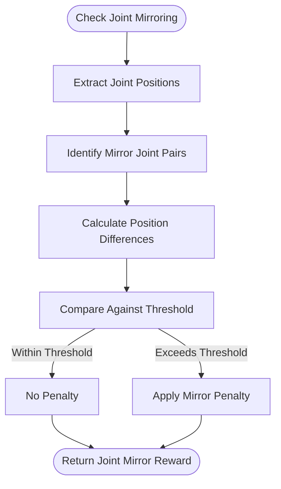

**Diagram sources**
- [parkour_env_cfg.py:362-366](file://source/robot_lab/robot_lab/tasks/manager_based/locomotion/velocity/config/quadruped/zsibot_zsl1/parkour_env_cfg.py#L362-L366)

**Section sources**
- [parkour_env_cfg.py:410-414](file://source/robot_lab/robot_lab/tasks/manager_based/locomotion/velocity/config/quadruped/zsibot_zsl1/parkour_env_cfg.py#L410-L414)
- [parkour_env_cfg.py:362-366](file://source/robot_lab/robot_lab/tasks/manager_based/locomotion/velocity/config/quadruped/zsibot_zsl1/parkour_env_cfg.py#L362-L366)

## Advanced Neural Network Architecture

The system implements custom neural network architectures specifically designed for both Go2 and ZSL1 parkour navigation:

### Actor-Critic with Scan and Privileged Encoders

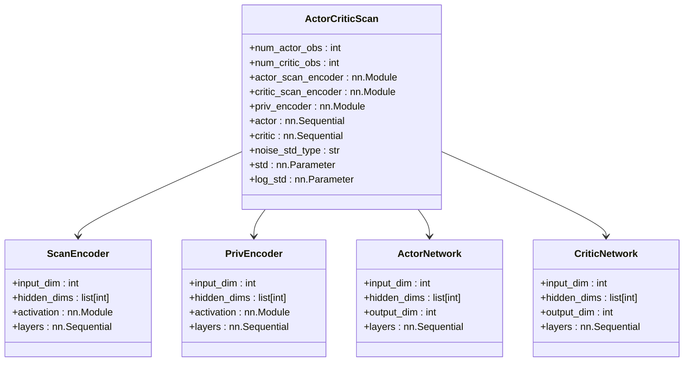

**Diagram sources**
- [actor_critic_scan.py:20-146](file://source/robot_lab/robot_lab/tasks/manager_based/locomotion/velocity/config/quadruped/unitree_go2_parkour/agents/actor_critic_scan.py#L20-L146)
- [rsl_rl_ppo_cfg.py:30-120](file://source/robot_lab/robot_lab/tasks/manager_based/locomotion/velocity/config/quadruped/unitree_go2_parkour/agents/rsl_rl_ppo_cfg.py#L30-L120)

The neural network architecture features:

- **Separate Encoders**: Dedicated encoders for scan observations and privileged observations
- **Flexible Architecture**: Configurable hidden dimensions and activation functions
- **Dual Policy**: Separate actor and critic networks with shared observation processing
- **Noise Parameterization**: Support for both scalar and log-standard deviation parameterization

**Section sources**
- [actor_critic_scan.py:20-146](file://source/robot_lab/robot_lab/tasks/manager_based/locomotion/velocity/config/quadruped/unitree_go2_parkour/agents/actor_critic_scan.py#L20-L146)
- [rsl_rl_ppo_cfg.py:30-120](file://source/robot_lab/robot_lab/tasks/manager_based/locomotion/velocity/config/quadruped/unitree_go2_parkour/agents/rsl_rl_ppo_cfg.py#L30-L120)

### Custom Observation Processing Pipeline

The system processes different observation types through specialized encoders:

```mermaid
sequenceDiagram
participant Obs as Raw Observations
participant PropEnc as Proprioceptive Encoder
participant ScanEnc as Scan Encoder
participant PrivEnc as Privileged Encoder
participant Actor as Actor Network
participant Critic as Critic Network
Obs->>PropEnc : Process proprioceptive data
Obs->>ScanEnc : Process scan data
Obs->>PrivEnc : Process privileged data
PropEnc-->>Actor : Encoded proprioceptive
ScanEnc-->>Actor : Encoded scan
PropEnc-->>Critic : Encoded proprioceptive
PrivEnc-->>Critic : Encoded privileged
Actor-->>Actor : Generate action distribution
Critic-->>Critic : Evaluate state value
```

**Diagram sources**
- [actor_critic_scan.py:178-231](file://source/robot_lab/robot_lab/tasks/manager_based/locomotion/velocity/config/quadruped/unitree_go2_parkour/agents/actor_critic_scan.py#L178-L231)

**Section sources**
- [actor_critic_scan.py:178-231](file://source/robot_lab/robot_lab/tasks/manager_based/locomotion/velocity/config/quadruped/unitree_go2_parkour/agents/actor_critic_scan.py#L178-L231)

## Enhanced Reward System Design

The reward system employs sophisticated shaping techniques with platform-specific parkour metrics:

### Advanced Reward Function Architecture

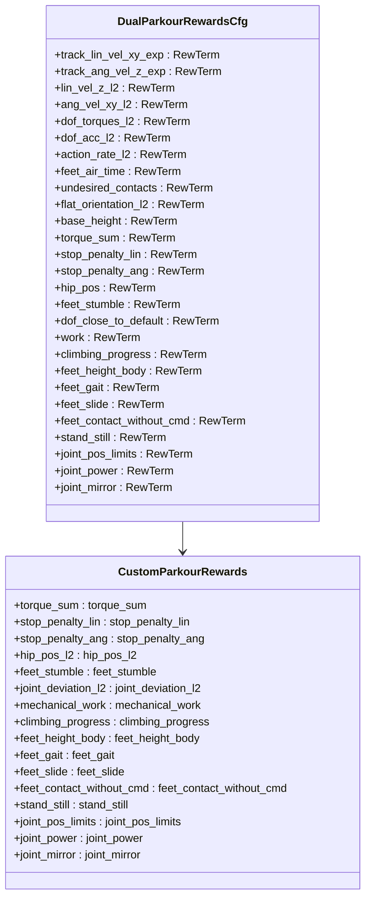

**Diagram sources**
- [rough_env_cfg.py:367-423](file://source/robot_lab/robot_lab/tasks/manager_based/locomotion/velocity/config/quadruped/unitree_go2_parkour/rough_env_cfg.py#L367-L423)
- [rewards.py:24-32](file://source/robot_lab/robot_lab/tasks/manager_based/locomotion/velocity/config/quadruped/unitree_go2_parkour/mdp/rewards.py#L24-L32)

### Platform-Specific Reward Functions

The reward system includes specialized functions optimized for each platform's parkour performance:

#### Mechanical Work Reward

The mechanical work reward encourages efficient energy usage during parkour maneuvers:


**Diagram sources**
- [rewards.py:119-131](file://source/robot_lab/robot_lab/tasks/manager_based/locomotion/velocity/config/quadruped/unitree_go2_parkour/mdp/rewards.py#L119-L131)

#### ZSL1 Joint Mirror Reward

Advanced joint mirroring prevents asymmetrical movement patterns specific to ZSL1:


**Diagram sources**
- [parkour_env_cfg.py:362-366](file://source/robot_lab/robot_lab/tasks/manager_based/locomotion/velocity/config/quadruped/zsibot_zsl1/parkour_env_cfg.py#L362-L366)

**Section sources**
- [rewards.py:119-131](file://source/robot_lab/robot_lab/tasks/manager_based/locomotion/velocity/config/quadruped/unitree_go2_parkour/mdp/rewards.py#L119-L131)
- [parkour_env_cfg.py:362-366](file://source/robot_lab/robot_lab/tasks/manager_based/locomotion/velocity/config/quadruped/zsibot_zsl1/parkour_env_cfg.py#L362-L366)

## Robot Configuration

The system provides dual-platform configuration optimized for parkour performance:

### Unitree Go2 Configuration

The Unitree Go2 robot configuration includes specialized parameters for advanced parkour capabilities:

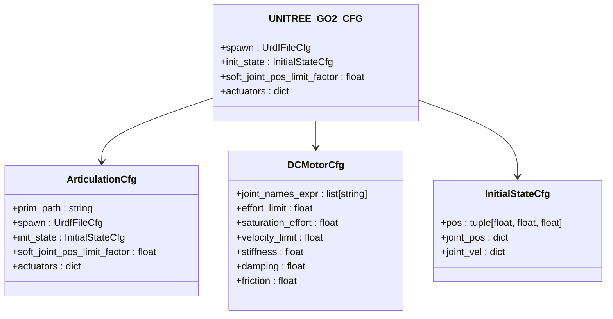

**Diagram sources**
- [unitree.py:71-117](file://source/robot_lab/robot_lab/assets/unitree.py#L71-L117)

### ZSIBOT ZSL1 Configuration

The ZSIBOT ZSL1 robot configuration includes specialized parameters optimized for controlled parkour:

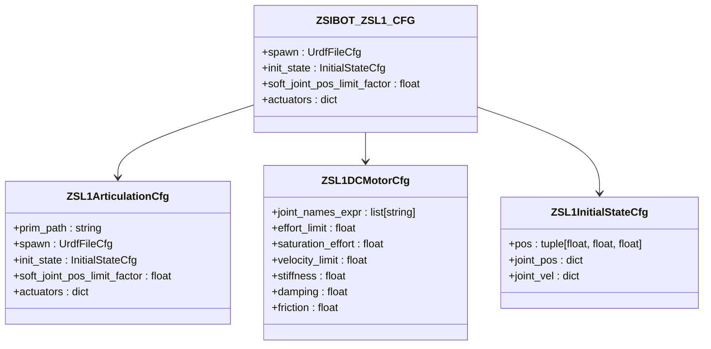

**Diagram sources**
- [parkour_env_cfg.py:14](file://source/robot_lab/robot_lab/tasks/manager_based/locomotion/velocity/config/quadruped/zsibot_zsl1/parkour_env_cfg.py#L14)

Key configuration aspects include:

- **Enhanced Actuator Specifications**: Optimized for higher torque and faster response
- **Improved Joint Limits**: Configured for maximum range of motion required for parkour
- **Advanced Initial Pose**: Stable starting position with appropriate joint angles
- **Optimized Physical Properties**: Mass and damping characteristics for superior agility

**Section sources**
- [unitree.py:71-117](file://source/robot_lab/robot_lab/assets/unitree.py#L71-L117)
- [parkour_env_cfg.py:14](file://source/robot_lab/robot_lab/tasks/manager_based/locomotion/velocity/config/quadruped/zsibot_zsl1/parkour_env_cfg.py#L14)

## Training Configuration

The training system provides comprehensive configuration options for both robot platforms:

### Environment Variants

The system registers multiple environment variants with specialized configurations for each platform:

| Environment Type | Configuration File | Key Features |
|------------------|-------------------|--------------|
| Flat Terrain | `Go2ParkourFlatEnvCfg` / `ZSL1ParkourFlatEnvCfg` | Baseline locomotion training without height scan |
| Rough Terrain | `Go2ParkourRoughEnvCfg` / `ZSL1ParkourRoughEnvCfg` | Complex terrain adaptation with full observation |
| Play Mode | `Go2ParkourRoughPlayEnvCfg` / `ZSL1ParkourRoughPlayEnvCfg` | Evaluation and visualization mode |
| Ablation Studies | Multiple variants | Systematic analysis of observation types |

### Advanced Training Parameters

The training configuration includes sophisticated parameter tuning for optimal performance:

- **Custom Neural Networks**: Actor-Critic with separate scan and privileged encoders
- **Adaptive Learning Rates**: Configurable learning rate schedules and KL divergence control
- **Empirical Normalization**: Automatic normalization of observations and rewards
- **Ablation Study Support**: Multiple variants for systematic analysis of components

**Section sources**
- [rsl_rl_ppo_cfg.py:128-237](file://source/robot_lab/robot_lab/tasks/manager_based/locomotion/velocity/config/quadruped/unitree_go2_parkour/agents/rsl_rl_ppo_cfg.py#L128-L237)

## Environment Naming Convention

**Updated** The system now uses a standardized naming convention for all parkour environments, ensuring consistency across platforms and easy identification of environment variants.

### Standardized Naming Pattern

All environment IDs follow the RobotLab-Isaac-Velocity- prefixed naming convention:

```
RobotLab-Isaac-Velocity-{Platform}-{Task}-{Variant}-v0
```

Where:
- `{Platform}` = Go2, ZSL1, or other supported robots
- `{Task}` = Parkour, Flat, Rough, Gap, Stair, or other locomotion tasks
- `{Variant}` = Base variant or specific ablation study
- `-v0` = Version suffix

### Go2 Environment Naming Examples

| Environment ID | Description |
|----------------|-------------|
| `RobotLab-Isaac-Velocity-Go2-Parkour-Flat-v0` | Flat terrain parkour training for Go2 |
| `RobotLab-Isaac-Velocity-Go2-Parkour-Rough-v0` | Rough terrain parkour training for Go2 |
| `RobotLab-Isaac-Velocity-Go2-Parkour-Rough-Abl1-v0` | Go2 parkour with ablation study 1 |
| `RobotLab-Isaac-Velocity-Go2-Parkour-Rough-Abl2_5-v0` | Go2 parkour with scan-first ordering |
| `RobotLab-Isaac-Velocity-Go2-Parkour-Rough-Abl3_5-v0` | Go2 parkour with explicit scan encoder |
| `RobotLab-Isaac-Velocity-Go2-Parkour-Rough-Abl4_0-v0` | Go2 parkour with critic-only scan |
| `RobotLab-Isaac-Velocity-Go2-Parkour-Rough-Abl7_0-v0` | Go2 parkour with reduced privileged encoder |

### ZSL1 Environment Naming Examples

| Environment ID | Description |
|----------------|-------------|
| `RobotLab-Isaac-Velocity-ZSL1-Parkour-Flat-v0` | Flat terrain parkour training for ZSL1 |
| `RobotLab-Isaac-Velocity-ZSL1-Parkour-Rough-v0` | Rough terrain parkour training for ZSL1 |
| `RobotLab-Isaac-Velocity-ZSL1-Parkour-Rough-Abl1-v0` | ZSL1 parkour with ablation study 1 |
| `RobotLab-Isaac-Velocity-ZSL1-Parkour-Rough-Abl2_5-v0` | ZSL1 parkour with scan-first ordering |
| `RobotLab-Isaac-Velocity-ZSL1-Parkour-Rough-Abl3_5-v0` | ZSL1 parkour with explicit scan encoder |
| `RobotLab-Isaac-Velocity-ZSL1-Parkour-Rough-Abl4_0-v0` | ZSL1 parkour with critic-only scan |
| `RobotLab-Isaac-Velocity-ZSL1-Parkour-Rough-Abl7_0-v0` | ZSL1 parkour with reduced privileged encoder |

### Additional ZSL1 Task Environments

| Environment ID | Description |
|----------------|-------------|
| `RobotLab-Isaac-Velocity-Flat-Zsibot-ZSL1-v0` | Basic flat terrain training |
| `RobotLab-Isaac-Velocity-Rough-Zsibot-ZSL1-v0` | Basic rough terrain training |
| `RobotLab-Isaac-Velocity-Stair-Zsibot-ZSL1-v0` | Stair climbing training |
| `RobotLab-Isaac-Velocity-Parkour-Zsibot-ZSL1-v0` | Parkour-specific training |
| `RobotLab-Isaac-Velocity-Gap-Zsibot-ZSL1-v0` | Gap crossing training |
| `RobotLab-Isaac-Velocity-Rough-Abl3_5-Zsibot-ZSL1-v0` | ZSL1 gap training with ablation |

**Section sources**
- [__init__.py:21-161](file://source/robot_lab/robot_lab/tasks/manager_based/locomotion/velocity/config/quadruped/unitree_go2_parkour/__init__.py#L21-L161)
- [__init__.py:21-160](file://source/robot_lab/robot_lab/tasks/manager_based/locomotion/velocity/config/quadruped/zsibot_zsl1_parkour/__init__.py#L21-L160)
- [__init__.py:12-70](file://source/robot_lab/robot_lab/tasks/manager_based/locomotion/velocity/config/quadruped/zsibot_zsl1/__init__.py#L12-L70)

## Environment Registration Examples

**Updated** The environment registration system now uses the standardized naming convention consistently across all parkour environments.

### Go2 Parkour Environment Registration

The Go2 parkour environments are registered with comprehensive ablation study support:

```python
# Flat terrain variants
gym.register(
    id="RobotLab-Isaac-Velocity-Go2-Parkour-Flat-v0",
    entry_point="isaaclab.envs:ManagerBasedRLEnv",
    disable_env_checker=True,
    kwargs={
        "env_cfg_entry_point": f"{__name__}.rough_env_cfg:Go2ParkourFlatEnvCfg",
        "rsl_rl_cfg_entry_point": f"{agents.__name__}.rsl_rl_ppo_cfg:Go2ParkourFlatPPORunnerCfg",
    },
)

# Rough terrain variants
gym.register(
    id="RobotLab-Isaac-Velocity-Go2-Parkour-Rough-v0",
    entry_point="isaaclab.envs:ManagerBasedRLEnv",
    disable_env_checker=True,
    kwargs={
        "env_cfg_entry_point": f"{__name__}.rough_env_cfg:Go2ParkourRoughEnvCfg",
        "rsl_rl_cfg_entry_point": f"{agents.__name__}.rsl_rl_ppo_cfg:Go2ParkourRoughPPORunnerCfg",
    },
)

# Ablation study variants
gym.register(
    id="RobotLab-Isaac-Velocity-Go2-Parkour-Rough-Abl1-v0",
    entry_point="isaaclab.envs:ManagerBasedRLEnv",
    disable_env_checker=True,
    kwargs={
        "env_cfg_entry_point": f"{__name__}.rough_env_cfg:Go2ParkourRoughAbl1EnvCfg",
        "rsl_rl_cfg_entry_point": f"{agents.__name__}.rsl_rl_ppo_cfg:Go2ParkourRoughAbl1PPORunnerCfg",
    },
)
```

### ZSL1 Parkour Environment Registration

The ZSL1 parkour environments follow the same standardized pattern:

```python
# Flat terrain variants
gym.register(
    id="RobotLab-Isaac-Velocity-ZSL1-Parkour-Flat-v0",
    entry_point="isaaclab.envs:ManagerBasedRLEnv",
    disable_env_checker=True,
    kwargs={
        "env_cfg_entry_point": f"{__name__}.rough_env_cfg:ZSL1ParkourFlatEnvCfg",
        "rsl_rl_cfg_entry_point": f"{agents.__name__}.rsl_rl_ppo_cfg:ZSL1ParkourFlatPPORunnerCfg",
    },
)

# Rough terrain variants
gym.register(
    id="RobotLab-Isaac-Velocity-ZSL1-Parkour-Rough-v0",
    entry_point="isaaclab.envs:ManagerBasedRLEnv",
    disable_env_checker=True,
    kwargs={
        "env_cfg_entry_point": f"{__name__}.rough_env_cfg:ZSL1ParkourRoughEnvCfg",
        "rsl_rl_cfg_entry_point": f"{agents.__name__}.rsl_rl_ppo_cfg:ZSL1ParkourRoughPPORunnerCfg",
    },
)

# Ablation study variants
gym.register(
    id="RobotLab-Isaac-Velocity-ZSL1-Parkour-Rough-Abl3_5-v0",
    entry_point="isaaclab.envs:ManagerBasedRLEnv",
    disable_env_checker=True,
    kwargs={
        "env_cfg_entry_point": f"{__name__}.rough_env_cfg:ZSL1ParkourRoughEnvCfg",
        "rsl_rl_cfg_entry_point": f"{agents.__name__}.rsl_rl_ppo_cfg:ZSL1ParkourRoughAbl3_5PPORunnerCfg",
    },
)
```

### Additional ZSL1 Task Environments

```python
# Basic locomotion environments
gym.register(
    id="RobotLab-Isaac-Velocity-Flat-Zsibot-ZSL1-v0",
    entry_point="isaaclab.envs:ManagerBasedRLEnv",
    disable_env_checker=True,
    kwargs={
        "env_cfg_entry_point": f"{__name__}.flat_env_cfg:ZsibotZSL1FlatEnvCfg",
        "rsl_rl_cfg_entry_point": f"{agents.__name__}.rsl_rl_ppo_cfg:ZsibotZSL1FlatPPORunnerCfg",
    },
)

# Specialized task environments
gym.register(
    id="RobotLab-Isaac-Velocity-Parkour-Zsibot-ZSL1-v0",
    entry_point="isaaclab.envs:ManagerBasedRLEnv",
    disable_env_checker=True,
    kwargs={
        "env_cfg_entry_point": f"{__name__}.parkour_env_cfg:ZsibotZSL1ParkourEnvCfg",
        "rsl_rl_cfg_entry_point": f"{agents.__name__}.rsl_rl_ppo_cfg:ZsibotZSL1ParkourPPORunnerCfg",
    },
)
```

**Section sources**
- [__init__.py:19-161](file://source/robot_lab/robot_lab/tasks/manager_based/locomotion/velocity/config/quadruped/unitree_go2_parkour/__init__.py#L19-L161)
- [__init__.py:19-160](file://source/robot_lab/robot_lab/tasks/manager_based/locomotion/velocity/config/quadruped/zsibot_zsl1_parkour/__init__.py#L19-L160)
- [__init__.py:12-70](file://source/robot_lab/robot_lab/tasks/manager_based/locomotion/velocity/config/quadruped/zsibot_zsl1/__init__.py#L12-L70)

## Performance Considerations

The system incorporates several optimization strategies for efficient parkour operation across both platforms:

### Computational Efficiency

- **GPU Acceleration**: Leverages GPU computing for parallel neural network inference
- **Memory Management**: Optimized memory allocation for large-scale terrain generation
- **Real-time Processing**: Efficient algorithms for real-time command generation and response
- **Custom Network Architecture**: Specialized neural network design for reduced computational overhead

### Stability Enhancements

- **Advanced Contact Force Monitoring**: Real-time contact force analysis for stability assessment
- **Enhanced Upright Orientation Control**: Maintains robot stability during aggressive maneuvers
- **Energy Efficiency Optimization**: Optimized joint power consumption for extended operation
- **Domain Randomization**: Systematic variation of physical properties for robust generalization

### Scalability Features

- **Modular Terrain Generation**: Configurable environment sizes and complexities
- **Distributed Training Support**: Multi-GPU and distributed training capabilities
- **Extensible Architecture**: Modular design for adding new terrain types and robot models
- **Ablation Study Framework**: Comprehensive analysis capabilities for system optimization

## Troubleshooting Guide

Common issues and their solutions for the dual-platform parkour system:

### Training Instability

**Symptoms**: Unstable training curves, frequent falls, poor convergence
**Solutions**:
- Adjust reward scaling factors for better balance
- Modify action clipping ranges for safer exploration
- Increase terrain difficulty gradually
- Verify sensor configuration accuracy
- Check neural network architecture compatibility

### Robot Behavior Issues

**Symptoms**: Inconsistent obstacle negotiation, poor foothold selection
**Solutions**:
- Calibrate sensor heights and field of view
- Adjust joint position scales for better reach
- Modify contact force thresholds
- Review terrain generation parameters
- Verify domain randomization settings

### Performance Problems

**Symptoms**: Slow simulation speeds, memory leaks, rendering issues
**Solutions**:
- Optimize environment complexity for available hardware
- Adjust physics simulation parameters
- Monitor GPU utilization and memory usage
- Clear temporary simulation caches regularly
- Check neural network memory usage

### Neural Network Issues

**Symptoms**: Poor policy performance, training divergence
**Solutions**:
- Verify observation dimension compatibility
- Check scan encoder configuration
- Adjust learning rate and KL divergence parameters
- Review privileged observation processing
- Validate custom reward function implementation

### Environment Registration Issues

**Symptoms**: Environment not found errors, incorrect naming
**Solutions**:
- Verify environment ID matches registration pattern
- Check module import paths in gym.register kwargs
- Ensure environment configuration files exist
- Validate version suffix (-v0) in environment IDs
- Confirm proper namespace usage in prim_path fields

## Conclusion

The enhanced Parkour Navigation System represents a comprehensive and sophisticated solution for advanced quadruped locomotion capabilities across multiple robot platforms. The transition from ZSL1-focused to dual-platform implementation provides significantly enhanced parkour navigation abilities through custom neural networks, advanced terrain generation, and specialized reward systems.

The system leverages NVIDIA's Isaac Lab platform with a modular architecture that combines advanced terrain generation algorithms, custom neural network architectures, and reward shaping techniques. The new implementation focuses on parkour-style navigation capabilities including obstacle negotiation, step climbing, gap traversal, and complex terrain adaptation across both robot platforms.

**Updated** The standardized naming convention ensures consistent environment identification and easy integration with the broader Isaac Lab ecosystem. The RobotLab-Isaac-Velocity- prefixed environment names provide clear categorization and improve discoverability across different robot platforms and task variants.

The modular architecture ensures extensibility for different robot platforms and application scenarios, while the comprehensive training framework supports rapid deployment and optimization. The system's focus on safety, stability, and performance makes it suitable for real-world applications in search and rescue, industrial inspection, and autonomous exploration missions.

The custom neural network architecture with separate scan and privileged encoders, combined with advanced terrain generation algorithms, provides unprecedented capabilities for complex parkour navigation. The systematic approach to ablation studies and performance analysis ensures continuous improvement and optimization of the system's capabilities across both Go2 and ZSL1 platforms.

Future enhancements could include expanded terrain types, multi-robot coordination capabilities, and integration with advanced perception systems for even more sophisticated navigation scenarios.