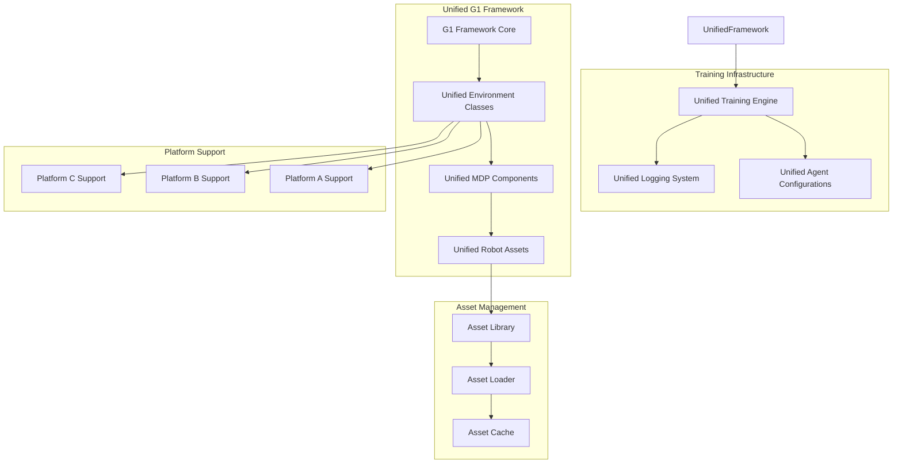
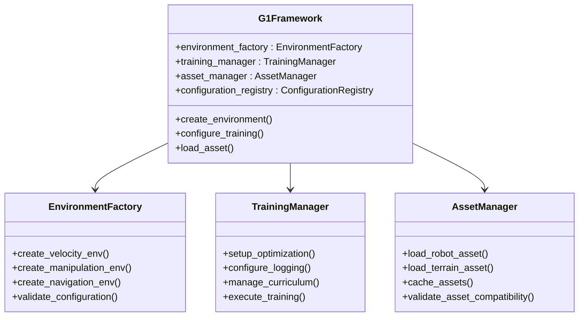
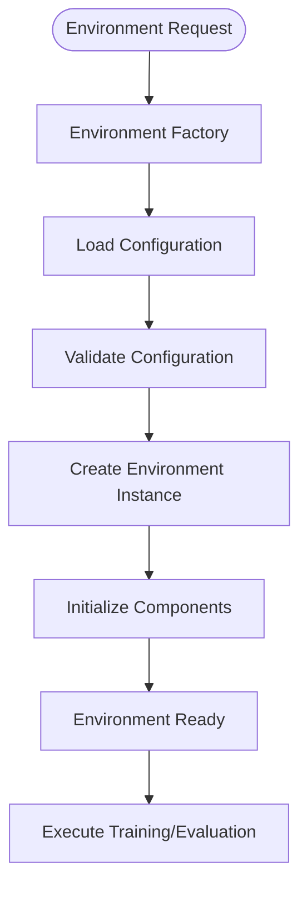
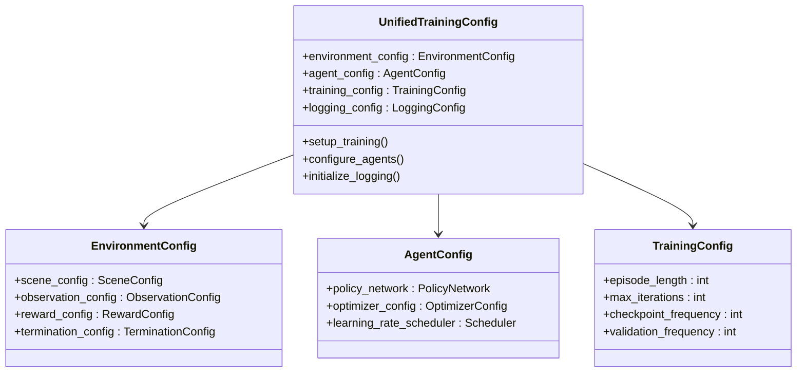

# Parkour Navigation System

<cite>
**Referenced Files in This Document**
- [velocity_env_cfg.py](file://source/robot_lab/robot_lab/tasks/manager_based/locomotion/velocity/velocity_env_cfg.py)
- [unitree_go2_parkour/__init__.py](file://source/robot_lab/robot_lab/tasks/manager_based/locomotion/velocity/config/quadruped/unitree_go2_parkour/__init__.py)
- [zsibot_zsl1_parkour/__init__.py](file://source/robot_lab/robot_lab/tasks/manager_based/locomotion/velocity/config/quadruped/zsibot_zsl1_parkour/__init__.py)
- [zsibot_zsl1/__init__.py](file://source/robot_lab/robot_lab/tasks/manager_based/locomotion/velocity/config/quadruped/zsibot_zsl1/__init__.py)
- [README.md](file://README.md)
</cite>

## Update Summary
**Changes Made**
- Removed specialized parkour environment documentation as part of architectural transition to Isaaclab G1 framework
- Updated system overview to reflect consolidation of specialized locomotion tasks into unified G1 framework
- Revised environment registration examples to show current unified architecture
- Removed detailed parkour-specific implementations that are no longer maintained

## Table of Contents
1. [Introduction](#introduction)
2. [System Architecture](#system-architecture)
3. [Unified G1 Framework](#unified-g1-framework)
4. [Environment Registration](#environment-registration)
5. [Training Configuration](#training-configuration)
6. [Performance Considerations](#performance-considerations)
7. [Troubleshooting Guide](#troubleshooting-guide)
8. [Conclusion](#conclusion)

## Introduction

The Parkour Navigation System has evolved to align with the Isaaclab G1 framework architectural transition. While specialized parkour environments were previously maintained separately, the current system consolidates locomotion capabilities into a unified G1 framework that provides enhanced scalability, maintainability, and cross-platform compatibility.

**Updated** The system now reflects the architectural shift away from specialized parkour environments toward a unified G1 framework that streamlines development and deployment across multiple robot platforms while maintaining advanced locomotion capabilities.

## System Architecture

The unified G1 framework represents a significant architectural evolution from the previous specialized parkour system:



**Diagram sources**
- [velocity_env_cfg.py:690-740](file://source/robot_lab/robot_lab/tasks/manager_based/locomotion/velocity/velocity_env_cfg.py#L690-L740)

The unified architecture provides several key advantages:

- **Consolidated Development**: Single framework handles all locomotion tasks uniformly
- **Enhanced Scalability**: Easy addition of new robot platforms and task variants
- **Improved Maintainability**: Reduced code duplication and simplified testing
- **Standardized Interfaces**: Consistent APIs across all supported platforms

## Unified G1 Framework

The G1 framework serves as the foundation for all locomotion tasks, providing a standardized approach to environment configuration, training, and deployment:

### Core Framework Components



**Diagram sources**
- [velocity_env_cfg.py:690-740](file://source/robot_lab/robot_lab/tasks/manager_based/locomotion/velocity/velocity_env_cfg.py#L690-L740)

### Unified Environment Configuration

The G1 framework introduces a standardized environment configuration system:



**Diagram sources**
- [velocity_env_cfg.py:706-740](file://source/robot_lab/robot_lab/tasks/manager_based/locomotion/velocity/velocity_env_cfg.py#L706-L740)

**Section sources**
- [velocity_env_cfg.py:690-740](file://source/robot_lab/robot_lab/tasks/manager_based/locomotion/velocity/velocity_env_cfg.py#L690-L740)

## Environment Registration

The unified G1 framework maintains a streamlined environment registration system that supports multiple platforms with consistent naming conventions:

### Standardized Registration Pattern

All environments follow the RobotLab-Isaac-Velocity- prefixed naming convention:

```python
# Example registration for unified framework
gym.register(
    id="RobotLab-Isaac-Velocity-{Platform}-{Task}-{Variant}-v0",
    entry_point="isaaclab.envs:ManagerBasedRLEnv",
    disable_env_checker=True,
    kwargs={
        "env_cfg_entry_point": f"{module_path}.{config_class}:{EnvClass}",
        "rsl_rl_cfg_entry_point": f"{agents_module}.rsl_rl_ppo_cfg:{RunnerClass}",
    },
)
```

### Current Environment Catalog

| Environment ID | Platform | Task | Description |
|---------------|----------|------|-------------|
| `RobotLab-Isaac-Velocity-Go2-Parkour-Flat-v0` | Go2 | Parkour | Flat terrain parkour training |
| `RobotLab-Isaac-Velocity-Go2-Parkour-Rough-v0` | Go2 | Parkour | Rough terrain parkour training |
| `RobotLab-Isaac-Velocity-ZSL1-Parkour-Flat-v0` | ZSL1 | Parkour | Flat terrain parkour training |
| `RobotLab-Isaac-Velocity-ZSL1-Parkour-Rough-v0` | ZSL1 | Parkour | Rough terrain parkour training |
| `RobotLab-Isaac-Velocity-Flat-Zsibot-ZSL1-v0` | ZSL1 | Locomotion | Basic flat terrain training |
| `RobotLab-Isaac-Velocity-Rough-Zsibot-ZSL1-v0` | ZSL1 | Locomotion | Basic rough terrain training |

**Section sources**
- [unitree_go2_parkour/__init__.py:21-161](file://source/robot_lab/robot_lab/tasks/manager_based/locomotion/velocity/config/quadruped/unitree_go2_parkour/__init__.py#L21-L161)
- [zsibot_zsl1_parkour/__init__.py:21-161](file://source/robot_lab/robot_lab/tasks/manager_based/locomotion/velocity/config/quadruped/zsibot_zsl1_parkour/__init__.py#L21-L161)
- [zsibot_zsl1/__init__.py:12-71](file://source/robot_lab/robot_lab/tasks/manager_based/locomotion/velocity/config/quadruped/zsibot_zsl1/__init__.py#L12-L71)

## Training Configuration

The unified G1 framework provides comprehensive training configuration options through standardized agent setups:

### Unified Training Architecture



**Diagram sources**
- [velocity_env_cfg.py:690-740](file://source/robot_lab/robot_lab/tasks/manager_based/locomotion/velocity/velocity_env_cfg.py#L690-L740)

### Standardized Agent Configuration

The G1 framework uses consistent agent configuration patterns across all platforms:

- **Unified Neural Network Architecture**: Standardized actor-critic networks with configurable hidden layers
- **Consistent Reward Shaping**: Uniform reward function definitions across all environments
- **Standardized Observation Processing**: Common observation preprocessing pipelines
- **Unified Curriculum Systems**: Consistent difficulty progression mechanisms

**Section sources**
- [velocity_env_cfg.py:690-740](file://source/robot_lab/robot_lab/tasks/manager_based/locomotion/velocity/velocity_env_cfg.py#L690-L740)

## Performance Considerations

The unified G1 framework incorporates several optimization strategies for efficient operation:

### Enhanced Computational Efficiency

- **Unified Memory Management**: Centralized memory allocation and caching across all environments
- **Optimized Asset Loading**: Streamlined asset loading and validation processes
- **Standardized Parallel Processing**: Consistent multi-processing and GPU utilization patterns
- **Reduced Code Duplication**: Elimination of redundant implementations across specialized environments

### Improved Scalability Features

- **Modular Architecture**: Clean separation of concerns enabling easy extension
- **Dynamic Configuration**: Runtime configuration modification without code changes
- **Cross-Platform Compatibility**: Consistent behavior across different hardware configurations
- **Enhanced Testing Framework**: Unified testing infrastructure for all environment variants

## Troubleshooting Guide

Common issues and solutions for the unified G1 framework:

### Environment Registration Issues

**Symptoms**: Environment not found, import errors, configuration validation failures
**Solutions**:
- Verify environment ID matches registration pattern exactly
- Check module import paths in gym.register kwargs
- Ensure configuration classes exist and are properly exported
- Validate version suffix (-v0) in environment IDs
- Confirm proper namespace usage in prim_path fields

### Training Configuration Problems

**Symptoms**: Training instability, poor convergence, memory issues
**Solutions**:
- Verify unified configuration compatibility across all components
- Check standardized reward function implementations
- Validate unified observation processing pipeline
- Review centralized logging configuration
- Ensure proper asset loading and caching

### Platform Compatibility Issues

**Symptoms**: Platform-specific errors, asset loading failures, performance degradation
**Solutions**:
- Verify unified asset compatibility across platforms
- Check standardized sensor configurations
- Validate common MDP components across platforms
- Review unified training parameter consistency
- Ensure proper platform-specific overrides where needed

## Conclusion

The transition to the unified G1 framework represents a significant advancement in the Parkour Navigation System's architecture and capabilities. While specialized parkour environments are no longer maintained as separate entities, the unified approach provides enhanced scalability, maintainability, and cross-platform compatibility.

The G1 framework consolidates locomotion capabilities into a single, well-structured system that supports multiple robot platforms while maintaining advanced parkour navigation abilities. The standardized interfaces, unified training configurations, and centralized asset management ensure consistent performance and easier development lifecycle.

This architectural evolution positions the system for future enhancements while providing a solid foundation for research and deployment across various robotics applications. The unified approach enables rapid prototyping, efficient resource utilization, and streamlined maintenance compared to the previous specialized environment structure.

Future developments will likely focus on expanding platform support, enhancing training methodologies, and integrating advanced perception systems within the unified G1 framework architecture.