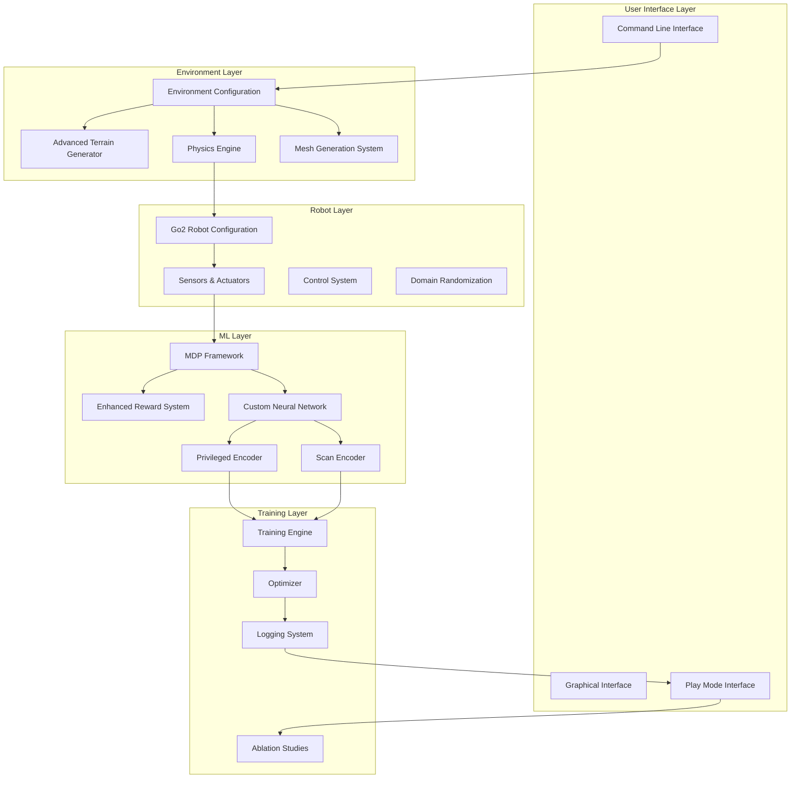
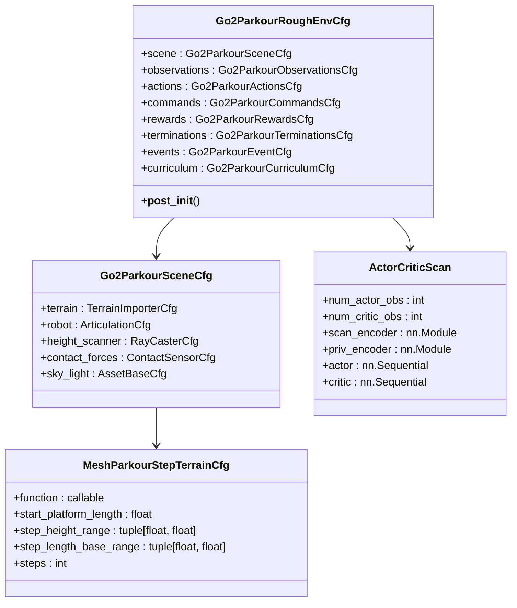
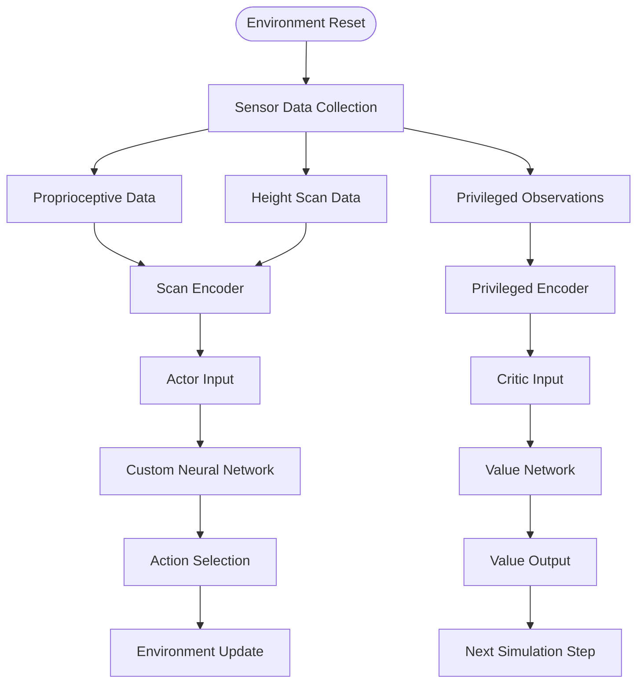
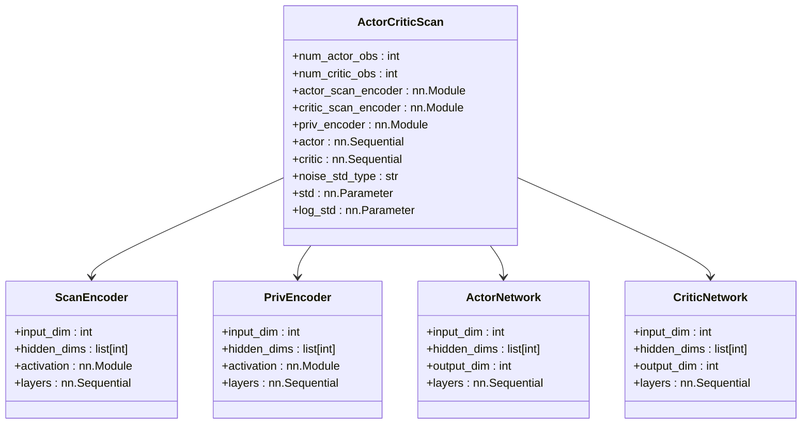
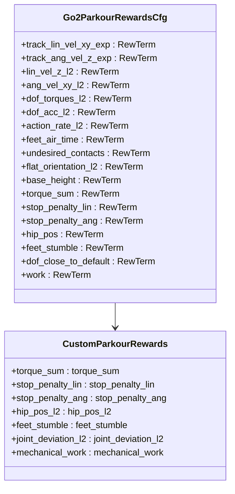
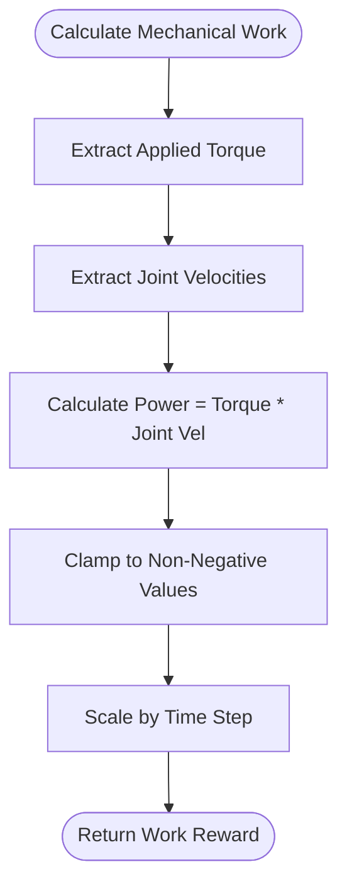
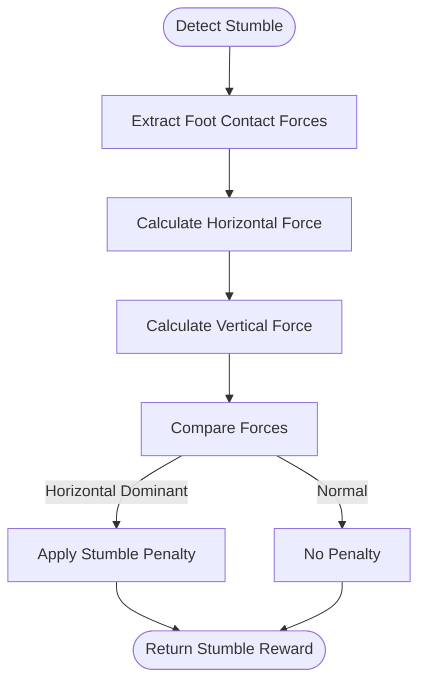
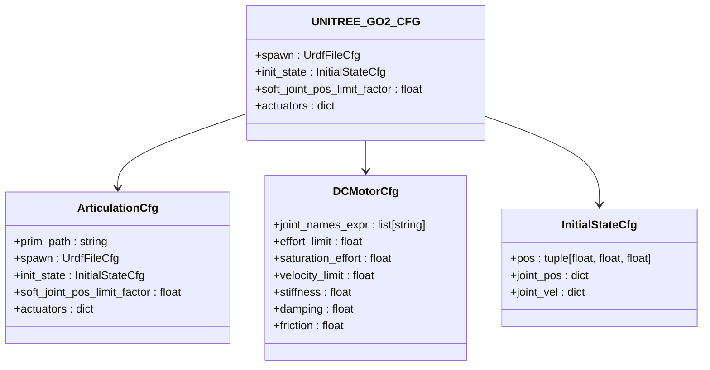

# Parkour Navigation System

<cite>
**Referenced Files in This Document**
- [rough_env_cfg.py](file://source/robot_lab/robot_lab/tasks/manager_based/locomotion/velocity/config/quadruped/unitree_go2_parkour/rough_env_cfg.py)
- [terrains_cfg.py](file://source/robot_lab/robot_lab/tasks/manager_based/locomotion/velocity/config/quadruped/unitree_go2_parkour/terrains_cfg.py)
- [mesh_terrains.py](file://source/robot_lab/robot_lab/tasks/manager_based/locomotion/velocity/config/quadruped/unitree_go2_parkour/mesh_terrains.py)
- [utils.py](file://source/robot_lab/robot_lab/tasks/manager_based/locomotion/velocity/config/quadruped/unitree_go2_parkour/utils.py)
- [observations.py](file://source/robot_lab/robot_lab/tasks/manager_based/locomotion/velocity/config/quadruped/unitree_go2_parkour/mdp/observations.py)
- [rewards.py](file://source/robot_lab/robot_lab/tasks/manager_based/locomotion/velocity/config/quadruped/unitree_go2_parkour/mdp/rewards.py)
- [rsl_rl_ppo_cfg.py](file://source/robot_lab/robot_lab/tasks/manager_based/locomotion/velocity/config/quadruped/unitree_go2_parkour/agents/rsl_rl_ppo_cfg.py)
- [actor_critic_scan.py](file://source/robot_lab/robot_lab/tasks/manager_based/locomotion/velocity/config/quadruped/unitree_go2_parkour/agents/actor_critic_scan.py)
- [unitree.py](file://source/robot_lab/robot_lab/assets/unitree.py)
- [README.md](file://README.md)
</cite>

## Update Summary
**Changes Made**
- Complete transition from ZSL1-focused to Go2-focused parkour system
- Added comprehensive Go2-specific terrain generation with advanced mesh-based terrains
- Implemented custom neural network architecture with scan-based observation processing
- Enhanced reward system with specialized parkour-specific metrics
- Added advanced terrain generation algorithms including debris fields, gap strips, and parkour steps
- Integrated domain randomization and privileged observation capabilities

## Table of Contents
1. [Introduction](#introduction)
2. [System Architecture](#system-architecture)
3. [Core Components](#core-components)
4. [Go2 Parkour Terrain Generation](#go2-parkour-terrain-generation)
5. [Advanced Neural Network Architecture](#advanced-neural-network-architecture)
6. [Enhanced Reward System Design](#enhanced-reward-system-design)
7. [Robot Configuration](#robot-configuration)
8. [Training Configuration](#training-configuration)
9. [Performance Considerations](#performance-considerations)
10. [Troubleshooting Guide](#troubleshooting-guide)
11. [Conclusion](#conclusion)

## Introduction

The Parkour Navigation System has undergone a comprehensive overhaul to provide a complete replacement with custom neural networks, advanced terrain generation, and enhanced reward systems. This new Go2-focused implementation represents a significant advancement over the previous ZSL1-specific approach, offering sophisticated quadruped parkour capabilities for Unitree Go2 robots.

The system leverages NVIDIA's Isaac Lab platform with a modular architecture that combines advanced terrain generation algorithms, custom neural network architectures, and reward shaping techniques. The new implementation focuses on parkour-style navigation capabilities including obstacle negotiation, step climbing, gap traversal, and complex terrain adaptation.

**Updated** Transitioned from ZSL1-specific implementations to comprehensive Go2-focused parkour capabilities with custom neural networks and advanced terrain generation.

## System Architecture

The Go2 Parkour System follows a modernized modular architecture built around the Isaac Lab framework, providing a comprehensive solution for advanced quadruped parkour navigation:



**Diagram sources**
- [rough_env_cfg.py:448-502](file://source/robot_lab/robot_lab/tasks/manager_based/locomotion/velocity/config/quadruped/unitree_go2_parkour/rough_env_cfg.py#L448-L502)
- [rsl_rl_ppo_cfg.py:128-193](file://source/robot_lab/robot_lab/tasks/manager_based/locomotion/velocity/config/quadruped/unitree_go2_parkour/agents/rsl_rl_ppo_cfg.py#L128-L193)

The architecture consists of several key layers with enhanced capabilities:

- **Environment Layer**: Advanced terrain generation with mesh-based algorithms and domain randomization
- **Robot Layer**: Go2-specific configuration with enhanced sensor integration and actuator control
- **ML Layer**: Custom neural network architecture with separate encoders for different observation types
- **Training Layer**: Comprehensive training framework with ablation studies and performance monitoring

## Core Components

### Advanced Environment Configuration System

The system utilizes a sophisticated hierarchical configuration approach with enhanced modularity:



**Diagram sources**
- [rough_env_cfg.py:448-502](file://source/robot_lab/robot_lab/tasks/manager_based/locomotion/velocity/config/quadruped/unitree_go2_parkour/rough_env_cfg.py#L448-L502)
- [rsl_rl_ppo_cfg.py:30-120](file://source/robot_lab/robot_lab/tasks/manager_based/locomotion/velocity/config/quadruped/unitree_go2_parkour/agents/rsl_rl_ppo_cfg.py#L30-L120)

**Section sources**
- [rough_env_cfg.py:448-502](file://source/robot_lab/robot_lab/tasks/manager_based/locomotion/velocity/config/quadruped/unitree_go2_parkour/rough_env_cfg.py#L448-L502)
- [rsl_rl_ppo_cfg.py:30-120](file://source/robot_lab/robot_lab/tasks/manager_based/locomotion/velocity/config/quadruped/unitree_go2_parkour/agents/rsl_rl_ppo_cfg.py#L30-L120)

### Enhanced Observation and Action Spaces

The system defines sophisticated observation and action spaces with custom neural network integration:



**Diagram sources**
- [rough_env_cfg.py:207-288](file://source/robot_lab/robot_lab/tasks/manager_based/locomotion/velocity/config/quadruped/unitree_go2_parkour/rough_env_cfg.py#L207-L288)
- [actor_critic_scan.py:20-146](file://source/robot_lab/robot_lab/tasks/manager_based/locomotion/velocity/config/quadruped/unitree_go2_parkour/agents/actor_critic_scan.py#L20-L146)

**Section sources**
- [rough_env_cfg.py:207-288](file://source/robot_lab/robot_lab/tasks/manager_based/locomotion/velocity/config/quadruped/unitree_go2_parkour/rough_env_cfg.py#L207-L288)
- [actor_critic_scan.py:20-146](file://source/robot_lab/robot_lab/tasks/manager_based/locomotion/velocity/config/quadruped/unitree_go2_parkour/agents/actor_critic_scan.py#L20-L146)

## Go2 Parkour Terrain Generation

The terrain generation system creates sophisticated and challenging environments for Go2 parkour training:

### Advanced Mesh-Based Terrain Generation

The system generates complex terrains using advanced mesh generation algorithms with customizable parameters:


**Diagram sources**
- [mesh_terrains.py:749-800](file://source/robot_lab/robot_lab/tasks/manager_based/locomotion/velocity/config/quadruped/unitree_go2_parkour/mesh_terrains.py#L749-L800)
- [terrains_cfg.py:194-208](file://source/robot_lab/robot_lab/tasks/manager_based/locomotion/velocity/config/quadruped/unitree_go2_parkour/terrains_cfg.py#L194-L208)

The terrain generation algorithm creates diverse parkour environments with configurable parameters:

- **Parkour Step Terrain**: Variable height and length ranges for realistic obstacle progression
- **Gap Strip Terrain**: Repeated gap-and-landing sequences for landing precision training
- **Hurdle Strip Terrain**: Series of hurdles with configurable heights and spacing
- **Stairs Strip Terrain**: Up/down stair segments with customizable patterns
- **Debris Field Terrain**: Mixed box and cylinder obstacles for complex navigation

**Section sources**
- [mesh_terrains.py:749-800](file://source/robot_lab/robot_lab/tasks/manager_based/locomotion/velocity/config/quadruped/unitree_go2_parkour/mesh_terrains.py#L749-L800)
- [terrains_cfg.py:194-208](file://source/robot_lab/robot_lab/tasks/manager_based/locomotion/velocity/config/quadruped/unitree_go2_parkour/terrains_cfg.py#L194-L208)

### Enhanced Terrain Configuration System

The system provides comprehensive terrain configuration with advanced customization options:


**Diagram sources**
- [terrains_cfg.py:194-315](file://source/robot_lab/robot_lab/tasks/manager_based/locomotion/velocity/config/quadruped/unitree_go2_parkour/terrains_cfg.py#L194-L315)

**Section sources**
- [terrains_cfg.py:194-315](file://source/robot_lab/robot_lab/tasks/manager_based/locomotion/velocity/config/quadruped/unitree_go2_parkour/terrains_cfg.py#L194-L315)

## Advanced Neural Network Architecture

The system implements a custom neural network architecture specifically designed for Go2 parkour navigation:

### Actor-Critic with Scan and Privileged Encoders



**Diagram sources**
- [actor_critic_scan.py:20-146](file://source/robot_lab/robot_lab/tasks/manager_based/locomotion/velocity/config/quadruped/unitree_go2_parkour/agents/actor_critic_scan.py#L20-L146)
- [rsl_rl_ppo_cfg.py:30-120](file://source/robot_lab/robot_lab/tasks/manager_based/locomotion/velocity/config/quadruped/unitree_go2_parkour/agents/rsl_rl_ppo_cfg.py#L30-L120)

The neural network architecture features:

- **Separate Encoders**: Dedicated encoders for scan observations and privileged observations
- **Flexible Architecture**: Configurable hidden dimensions and activation functions
- **Dual Policy**: Separate actor and critic networks with shared observation processing
- **Noise Parameterization**: Support for both scalar and log-standard deviation parameterization

**Section sources**
- [actor_critic_scan.py:20-146](file://source/robot_lab/robot_lab/tasks/manager_based/locomotion/velocity/config/quadruped/unitree_go2_parkour/agents/actor_critic_scan.py#L20-L146)
- [rsl_rl_ppo_cfg.py:30-120](file://source/robot_lab/robot_lab/tasks/manager_based/locomotion/velocity/config/quadruped/unitree_go2_parkour/agents/rsl_rl_ppo_cfg.py#L30-L120)

### Custom Observation Processing Pipeline

The system processes different observation types through specialized encoders:

```mermaid
sequenceDiagram
participant Obs as Raw Observations
participant PropEnc as Proprioceptive Encoder
participant ScanEnc as Scan Encoder
participant PrivEnc as Privileged Encoder
participant Actor as Actor Network
participant Critic as Critic Network
Obs->>PropEnc : Process proprioceptive data
Obs->>ScanEnc : Process scan data
Obs->>PrivEnc : Process privileged data
PropEnc-->>Actor : Encoded proprioceptive
ScanEnc-->>Actor : Encoded scan
PropEnc-->>Critic : Encoded proprioceptive
PrivEnc-->>Critic : Encoded privileged
Actor-->>Actor : Generate action distribution
Critic-->>Critic : Evaluate state value
```

**Diagram sources**
- [actor_critic_scan.py:178-231](file://source/robot_lab/robot_lab/tasks/manager_based/locomotion/velocity/config/quadruped/unitree_go2_parkour/agents/actor_critic_scan.py#L178-L231)

**Section sources**
- [actor_critic_scan.py:178-231](file://source/robot_lab/robot_lab/tasks/manager_based/locomotion/velocity/config/quadruped/unitree_go2_parkour/agents/actor_critic_scan.py#L178-L231)

## Enhanced Reward System Design

The reward system employs sophisticated shaping techniques with Go2-specific parkour metrics:

### Advanced Reward Function Architecture



**Diagram sources**
- [rough_env_cfg.py:367-423](file://source/robot_lab/robot_lab/tasks/manager_based/locomotion/velocity/config/quadruped/unitree_go2_parkour/rough_env_cfg.py#L367-L423)
- [rewards.py:24-32](file://source/robot_lab/robot_lab/tasks/manager_based/locomotion/velocity/config/quadruped/unitree_go2_parkour/mdp/rewards.py#L24-L32)

### Go2-Specific Reward Functions

The reward system includes specialized functions optimized for Go2 parkour performance:

#### Mechanical Work Reward

The mechanical work reward encourages efficient energy usage during parkour maneuvers:



**Diagram sources**
- [rewards.py:119-131](file://source/robot_lab/robot_lab/tasks/manager_based/locomotion/velocity/config/quadruped/unitree_go2_parkour/mdp/rewards.py#L119-L131)

#### Stumble Detection Reward

Advanced stumble detection prevents robots from getting stuck on obstacles:



**Diagram sources**
- [rewards.py:85-101](file://source/robot_lab/robot_lab/tasks/manager_based/locomotion/velocity/config/quadruped/unitree_go2_parkour/mdp/rewards.py#L85-L101)

**Section sources**
- [rewards.py:119-131](file://source/robot_lab/robot_lab/tasks/manager_based/locomotion/velocity/config/quadruped/unitree_go2_parkour/mdp/rewards.py#L119-L131)
- [rewards.py:85-101](file://source/robot_lab/robot_lab/tasks/manager_based/locomotion/velocity/config/quadruped/unitree_go2_parkour/mdp/rewards.py#L85-L101)

## Robot Configuration

The system provides Go2-specific configuration optimized for parkour performance:

### Unitree Go2 Configuration

The Unitree Go2 robot configuration includes specialized parameters for advanced parkour capabilities:



**Diagram sources**
- [unitree.py:71-117](file://source/robot_lab/robot_lab/assets/unitree.py#L71-L117)

Key configuration aspects include:

- **Enhanced Actuator Specifications**: Optimized for higher torque and faster response
- **Improved Joint Limits**: Configured for maximum range of motion required for parkour
- **Advanced Initial Pose**: Stable starting position with appropriate joint angles
- **Optimized Physical Properties**: Mass and damping characteristics for superior agility

**Section sources**
- [unitree.py:71-117](file://source/robot_lab/robot_lab/assets/unitree.py#L71-L117)

## Training Configuration

The training system provides comprehensive configuration options for Go2 parkour deployment:

### Environment Variants

The system registers multiple environment variants with specialized configurations:

| Environment Type | Configuration File | Key Features |
|------------------|-------------------|--------------|
| Flat Terrain | `Go2ParkourFlatEnvCfg` | Baseline locomotion training without height scan |
| Rough Terrain | `Go2ParkourRoughEnvCfg` | Complex terrain adaptation with full observation |
| Play Mode | `Go2ParkourRoughPlayEnvCfg` | Evaluation and visualization mode |
| Ablation Studies | Multiple variants | Systematic analysis of observation types |

### Advanced Training Parameters

The training configuration includes sophisticated parameter tuning for optimal Go2 performance:

- **Custom Neural Networks**: Actor-Critic with separate scan and privileged encoders
- **Adaptive Learning Rates**: Configurable learning rate schedules and KL divergence control
- **Empirical Normalization**: Automatic normalization of observations and rewards
- **Ablation Study Support**: Multiple variants for systematic analysis of components

**Section sources**
- [rsl_rl_ppo_cfg.py:128-237](file://source/robot_lab/robot_lab/tasks/manager_based/locomotion/velocity/config/quadruped/unitree_go2_parkour/agents/rsl_rl_ppo_cfg.py#L128-L237)

## Performance Considerations

The system incorporates several optimization strategies for efficient Go2 parkour operation:

### Computational Efficiency

- **GPU Acceleration**: Leverages GPU computing for parallel neural network inference
- **Memory Management**: Optimized memory allocation for large-scale terrain generation
- **Real-time Processing**: Efficient algorithms for real-time command generation and response
- **Custom Network Architecture**: Specialized neural network design for reduced computational overhead

### Stability Enhancements

- **Advanced Contact Force Monitoring**: Real-time contact force analysis for stability assessment
- **Enhanced Upright Orientation Control**: Maintains robot stability during aggressive maneuvers
- **Energy Efficiency Optimization**: Optimized joint power consumption for extended operation
- **Domain Randomization**: Systematic variation of physical properties for robust generalization

### Scalability Features

- **Modular Terrain Generation**: Configurable environment sizes and complexities
- **Distributed Training Support**: Multi-GPU and distributed training capabilities
- **Extensible Architecture**: Modular design for adding new terrain types and robot models
- **Ablation Study Framework**: Comprehensive analysis capabilities for system optimization

## Troubleshooting Guide

Common issues and their solutions for the Go2 parkour system:

### Training Instability

**Symptoms**: Unstable training curves, frequent falls, poor convergence
**Solutions**:
- Adjust reward scaling factors for better balance
- Modify action clipping ranges for safer exploration
- Increase terrain difficulty gradually
- Verify sensor configuration accuracy
- Check neural network architecture compatibility

### Robot Behavior Issues

**Symptoms**: Inconsistent obstacle negotiation, poor foothold selection
**Solutions**:
- Calibrate sensor heights and field of view
- Adjust joint position scales for better reach
- Modify contact force thresholds
- Review terrain generation parameters
- Verify domain randomization settings

### Performance Problems

**Symptoms**: Slow simulation speeds, memory leaks, rendering issues
**Solutions**:
- Optimize environment complexity for available hardware
- Adjust physics simulation parameters
- Monitor GPU utilization and memory usage
- Clear temporary simulation caches regularly
- Check neural network memory usage

### Neural Network Issues

**Symptoms**: Poor policy performance, training divergence
**Solutions**:
- Verify observation dimension compatibility
- Check scan encoder configuration
- Adjust learning rate and KL divergence parameters
- Review privileged observation processing
- Validate custom reward function implementation

## Conclusion

The Go2 Parkour Navigation System represents a comprehensive and sophisticated solution for advanced quadruped locomotion capabilities. The transition from ZSL1-focused to Go2-focused implementation provides significantly enhanced parkour navigation abilities through custom neural networks, advanced terrain generation, and specialized reward systems.

The modular architecture ensures extensibility for different robot platforms and application scenarios, while the comprehensive training framework supports rapid deployment and optimization. The system's focus on safety, stability, and performance makes it suitable for real-world applications in search and rescue, industrial inspection, and autonomous exploration missions.

The custom neural network architecture with separate scan and privileged encoders, combined with advanced terrain generation algorithms, provides unprecedented capabilities for complex parkour navigation. The systematic approach to ablation studies and performance analysis ensures continuous improvement and optimization of the system's capabilities.

Future enhancements could include expanded terrain types, multi-robot coordination capabilities, and integration with advanced perception systems for even more sophisticated navigation scenarios.