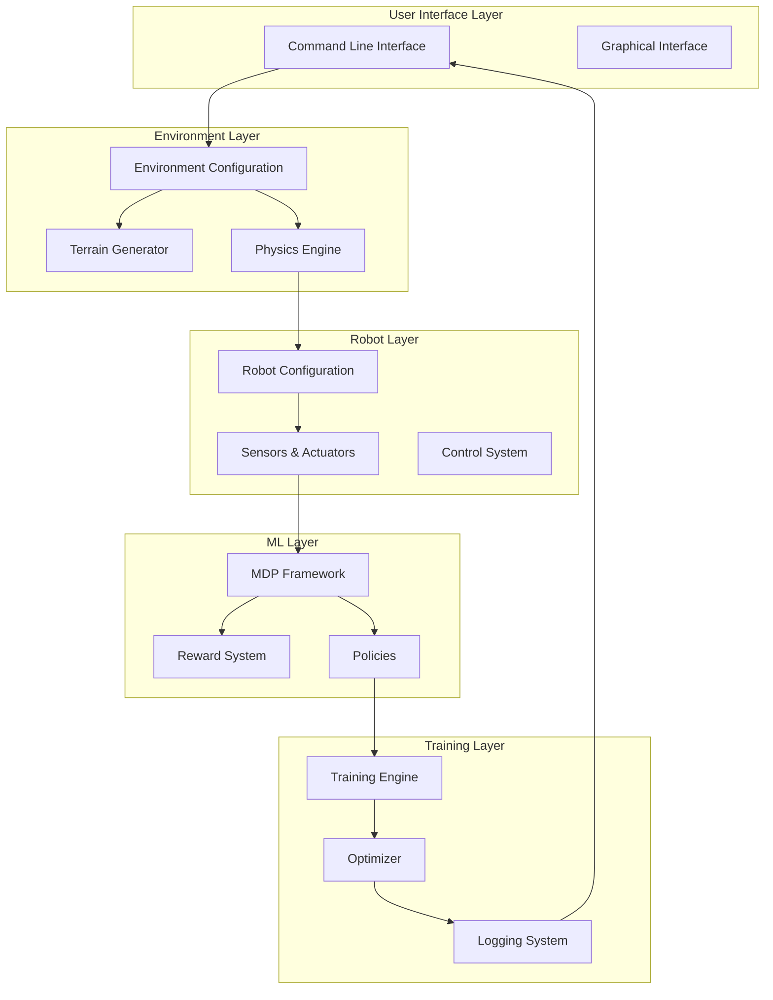
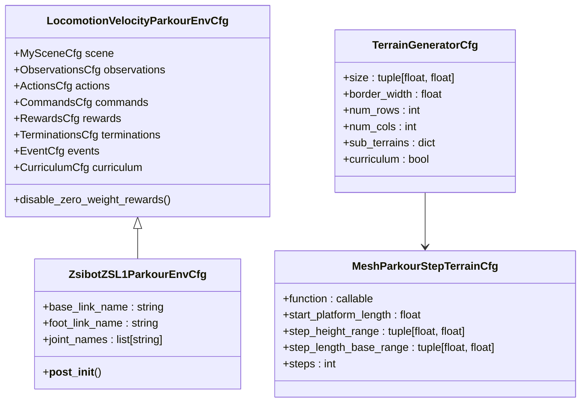
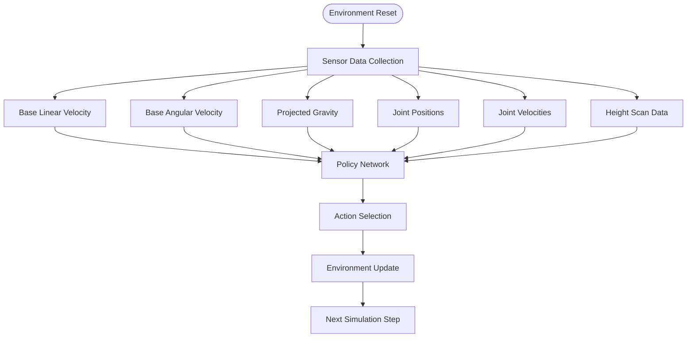
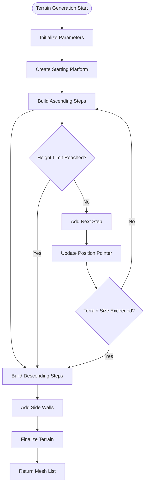
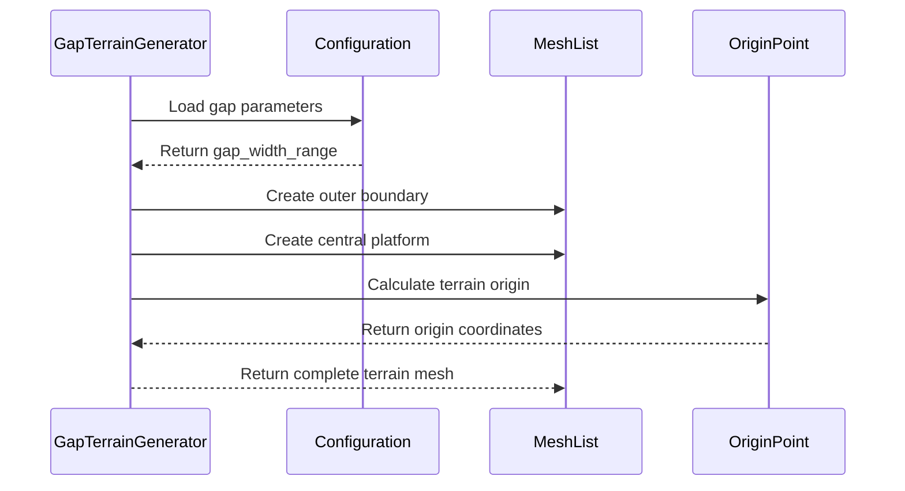
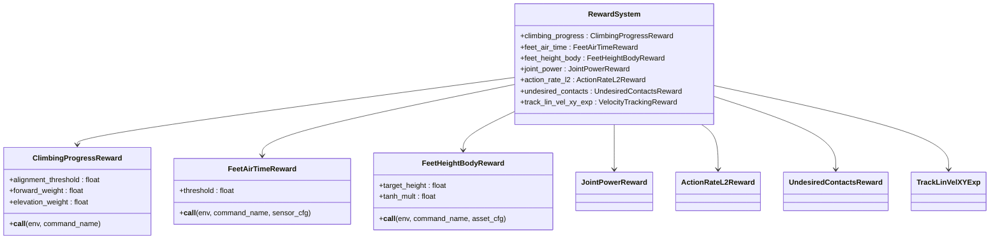
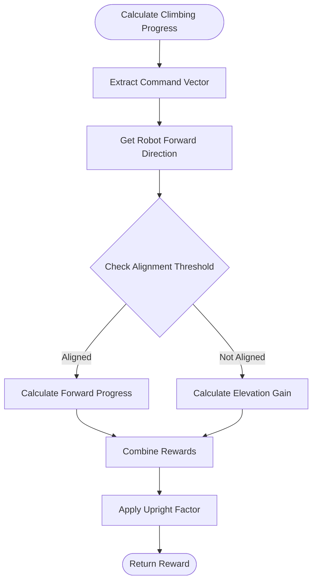
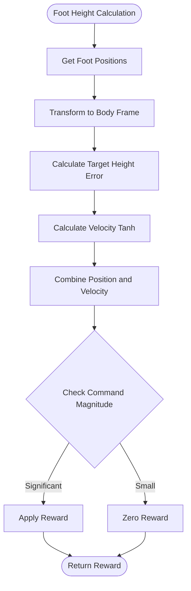
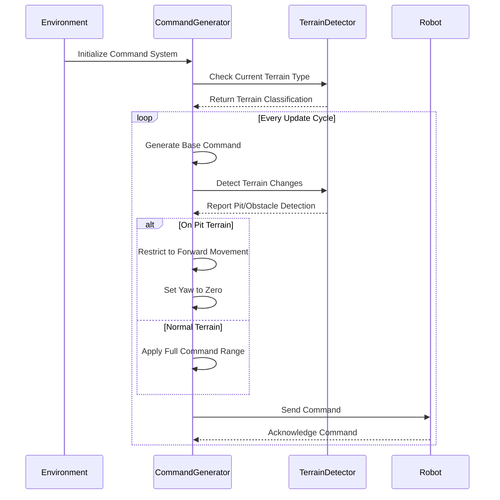
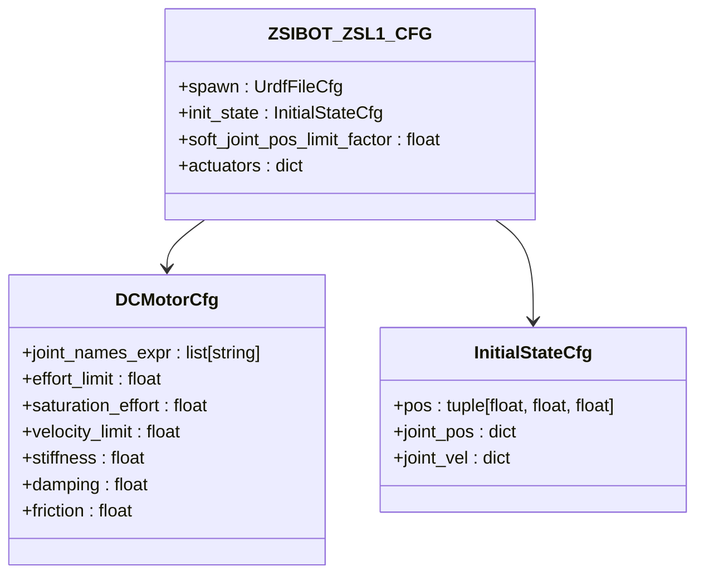

# Parkour Navigation System

<cite>
**Referenced Files in This Document**
- [parkour_env_cfg.py](file://source/robot_lab/robot_lab/tasks/manager_based/locomotion/velocity/config/quadruped/zsibot_zsl1/parkour_env_cfg.py)
- [gap_env_cfg.py](file://source/robot_lab/robot_lab/tasks/manager_based/locomotion/velocity/config/quadruped/zsibot_zsl1/gap_env_cfg.py)
- [rewards.py](file://source/robot_lab/robot_lab/tasks/manager_based/locomotion/velocity/mdp/rewards.py)
- [commands.py](file://source/robot_lab/robot_lab/tasks/manager_based/locomotion/velocity/mdp/commands.py)
- [velocity_env_cfg.py](file://source/robot_lab/robot_lab/tasks/manager_based/locomotion/velocity/velocity_env_cfg.py)
- [zsibot.py](file://source/robot_lab/robot_lab/assets/zsibot.py)
- [README.md](file://README.md)
</cite>

## Table of Contents
1. [Introduction](#introduction)
2. [System Architecture](#system-architecture)
3. [Core Components](#core-components)
4. [Parkour Terrain Generation](#parkour-terrain-generation)
5. [Reward System Design](#reward-system-design)
6. [Command Management](#command-management)
7. [Robot Configuration](#robot-configuration)
8. [Training Configuration](#training-configuration)
9. [Performance Considerations](#performance-considerations)
10. [Troubleshooting Guide](#troubleshooting-guide)
11. [Conclusion](#conclusion)

## Introduction

The Parkour Navigation System is a specialized quadruped locomotion framework built on NVIDIA's Isaac Lab platform. This system enables advanced parkour-style navigation capabilities for quadruped robots, focusing on obstacle negotiation, step climbing, and gap traversal. The implementation leverages sophisticated terrain generation algorithms, reward shaping techniques, and command management systems to achieve robust autonomous navigation in complex environments.

The system specifically targets Zsibot ZSL1 quadruped robots but is designed with extensibility in mind for other quadruped platforms. It combines traditional reinforcement learning approaches with advanced terrain perception and obstacle avoidance capabilities, making it suitable for applications ranging from search and rescue missions to industrial inspection tasks.

## System Architecture

The Parkour Navigation System follows a modular architecture built around the Isaac Lab framework, providing a comprehensive solution for quadruped parkour navigation:

**Diagram sources**
- [parkour_env_cfg.py:170-349](file://source/robot_lab/robot_lab/tasks/manager_based/locomotion/velocity/config/quadruped/zsibot_zsl1/parkour_env_cfg.py#L170-L349)
- [velocity_env_cfg.py:844-857](file://source/robot_lab/robot_lab/tasks/manager_based/locomotion/velocity/velocity_env_cfg.py#L844-L857)

The architecture consists of several key layers:

- **Environment Layer**: Handles terrain generation, physics simulation, and environmental interactions
- **Robot Layer**: Manages robot configuration, sensor data processing, and actuator control
- **ML Layer**: Implements the Markov Decision Process (MDP) framework with reward shaping and policy optimization
- **Training Layer**: Provides training infrastructure, optimization algorithms, and performance monitoring

## Core Components

### Environment Configuration System

The system utilizes a hierarchical configuration approach that separates concerns across different functional areas:

**Diagram sources**
- [velocity_env_cfg.py:844-857](file://source/robot_lab/robot_lab/tasks/manager_based/locomotion/velocity/velocity_env_cfg.py#L844-L857)
- [parkour_env_cfg.py:120-167](file://source/robot_lab/robot_lab/tasks/manager_based/locomotion/velocity/config/quadruped/zsibot_zsl1/parkour_env_cfg.py#L120-L167)

**Section sources**
- [velocity_env_cfg.py:844-857](file://source/robot_lab/robot_lab/tasks/manager_based/locomotion/velocity/velocity_env_cfg.py#L844-L857)
- [parkour_env_cfg.py:169-349](file://source/robot_lab/robot_lab/tasks/manager_based/locomotion/velocity/config/quadruped/zsibot_zsl1/parkour_env_cfg.py#L169-L349)

### Observation and Action Spaces

The system defines comprehensive observation and action spaces tailored for parkour navigation:

**Diagram sources**
- [velocity_env_cfg.py:134-272](file://source/robot_lab/robot_lab/tasks/manager_based/locomotion/velocity/velocity_env_cfg.py#L134-L272)

**Section sources**
- [velocity_env_cfg.py:134-272](file://source/robot_lab/robot_lab/tasks/manager_based/locomotion/velocity/velocity_env_cfg.py#L134-L272)

## Parkour Terrain Generation

The terrain generation system creates diverse and challenging environments for parkour training:

### Parkour Step Terrain Generation

The system generates complex step-based terrains that simulate real-world parkour obstacles:

**Diagram sources**
- [parkour_env_cfg.py:27-117](file://source/robot_lab/robot_lab/tasks/manager_based/locomotion/velocity/config/quadruped/zsibot_zsl1/parkour_env_cfg.py#L27-L117)

The terrain generation algorithm creates parkour-style staircases with configurable parameters:

- **Step Configuration**: Variable height and length ranges for realistic obstacle progression
- **Platform Integration**: Starting platforms and finishing areas for safe robot positioning
- **Structural Integrity**: Side walls and support structures for stability
- **Scale Adaptation**: Dynamic scaling based on difficulty parameters

**Section sources**
- [parkour_env_cfg.py:27-167](file://source/robot_lab/robot_lab/tasks/manager_based/locomotion/velocity/config/quadruped/zsibot_zsl1/parkour_env_cfg.py#L27-L167)

### Gap Terrain Generation

The system also supports gap traversal scenarios with specialized terrain generation:

**Diagram sources**
- [gap_env_cfg.py:27-104](file://source/robot_lab/robot_lab/tasks/manager_based/locomotion/velocity/config/quadruped/zsibot_zsl1/gap_env_cfg.py#L27-L104)

**Section sources**
- [gap_env_cfg.py:27-157](file://source/robot_lab/robot_lab/tasks/manager_based/locomotion/velocity/config/quadruped/zsibot_zsl1/gap_env_cfg.py#L27-L157)

## Reward System Design

The reward system employs sophisticated shaping techniques to encourage parkour-specific behaviors:

### Reward Function Architecture

**Diagram sources**
- [rewards.py:670-732](file://source/robot_lab/robot_lab/tasks/manager_based/locomotion/velocity/mdp/rewards.py#L670-L732)

### Parkour-Specific Reward Functions

The reward system includes specialized functions for parkour navigation:

#### Climbing Progress Reward

The climbing progress reward encourages forward and upward movement during obstacle negotiation:

**Diagram sources**
- [rewards.py:670-732](file://source/robot_lab/robot_lab/tasks/manager_based/locomotion/velocity/mdp/rewards.py#L670-L732)

#### Feet Height Control

Advanced foot height control ensures proper obstacle clearance:

**Diagram sources**
- [rewards.py:527-554](file://source/robot_lab/robot_lab/tasks/manager_based/locomotion/velocity/mdp/rewards.py#L527-L554)

**Section sources**
- [rewards.py:670-732](file://source/robot_lab/robot_lab/tasks/manager_based/locomotion/velocity/mdp/rewards.py#L670-L732)
- [rewards.py:527-554](file://source/robot_lab/robot_lab/tasks/manager_based/locomotion/velocity/mdp/rewards.py#L527-L554)

## Command Management

The command management system provides adaptive velocity control with terrain awareness:

### Adaptive Command Generation

**Diagram sources**
- [commands.py:53-98](file://source/robot_lab/robot_lab/tasks/manager_based/locomotion/velocity/mdp/commands.py#L53-L98)

The command system includes specialized logic for different terrain types:

- **Pit Detection**: Automatic detection of dangerous terrain features
- **Movement Restriction**: Safe operation protocols for hazardous areas
- **Heading Control**: Adaptive orientation management based on terrain conditions
- **Command Thresholding**: Smooth command transitions to prevent abrupt movements

**Section sources**
- [commands.py:31-98](file://source/robot_lab/robot_lab/tasks/manager_based/locomotion/velocity/mdp/commands.py#L31-L98)

## Robot Configuration

The system supports multiple robot configurations optimized for parkour navigation:

### Zsibot ZSL1 Configuration

The Zsibot ZSL1 quadruped robot configuration includes specialized parameters for parkour performance:

**Diagram sources**
- [zsibot.py:14-58](file://source/robot_lab/robot_lab/assets/zsibot.py#L14-L58)

Key configuration aspects include:

- **Actuator Specifications**: High-torque motors optimized for lifting and climbing
- **Joint Limits**: Configured for maximum range of motion required for parkour
- **Initial Pose**: Stable starting position with appropriate joint angles
- **Physical Properties**: Mass and damping characteristics optimized for agility

**Section sources**
- [zsibot.py:14-58](file://source/robot_lab/robot_lab/assets/zsibot.py#L14-L58)

## Training Configuration

The training system provides comprehensive configuration options for different deployment scenarios:

### Environment Registration

The system registers multiple environment variants for training and evaluation:

| Environment Type | Configuration File | Key Features |
|------------------|-------------------|--------------|
| Flat Terrain | `flat_env_cfg.py` | Baseline locomotion training |
| Rough Terrain | `rough_env_cfg.py` | Complex terrain adaptation |
| Parkour Terrain | `parkour_env_cfg.py` | Step climbing and obstacle negotiation |
| Gap Terrain | `gap_env_cfg.py` | Gap traversal and landing precision |

### Training Parameters

The training configuration includes sophisticated parameter tuning for optimal performance:

- **Observation Scaling**: Adaptive scaling factors for different sensor modalities
- **Action Clipping**: Configurable action bounds for safety and stability
- **Reward Shaping**: Multi-objective reward functions for comprehensive learning
- **Curriculum Learning**: Progressive difficulty scaling for skill acquisition

**Section sources**
- [README.md:196-347](file://README.md#L196-L347)

## Performance Considerations

The system incorporates several optimization strategies for efficient operation:

### Computational Efficiency

- **GPU Acceleration**: Leverages GPU computing for parallel simulation execution
- **Memory Management**: Optimized memory allocation for large-scale simulations
- **Real-time Processing**: Efficient algorithms for real-time command generation and response

### Stability Enhancements

- **Contact Force Monitoring**: Real-time contact force analysis for stability assessment
- **Upright Orientation Control**: Maintains robot stability during aggressive maneuvers
- **Energy Efficiency**: Optimized joint power consumption for extended operation

### Scalability Features

- **Multi-environment Support**: Configurable environment sizes and complexities
- **Distributed Training**: Support for multi-GPU and distributed training setups
- **Modular Design**: Extensible architecture for adding new robot models and terrains

## Troubleshooting Guide

Common issues and their solutions:

### Training Instability

**Symptoms**: Unstable training curves, frequent falls, poor convergence
**Solutions**:
- Adjust reward scaling factors for better balance
- Modify action clipping ranges for safer exploration
- Increase terrain difficulty gradually
- Verify sensor configuration accuracy

### Robot Behavior Issues

**Symptoms**: Inconsistent obstacle negotiation, poor foothold selection
**Solutions**:
- Calibrate sensor heights and field of view
- Adjust joint position scales for better reach
- Modify contact force thresholds
- Review terrain generation parameters

### Performance Problems

**Symptoms**: Slow simulation speeds, memory leaks, rendering issues
**Solutions**:
- Optimize environment complexity for available hardware
- Adjust physics simulation parameters
- Monitor GPU utilization and memory usage
- Clear temporary simulation caches regularly

## Conclusion

The Parkour Navigation System represents a comprehensive solution for advanced quadruped locomotion capabilities. By combining sophisticated terrain generation, reward shaping, and adaptive command management, the system enables robots to navigate complex environments with unprecedented agility and precision.

The modular architecture ensures extensibility for different robot platforms and application scenarios, while the comprehensive training framework supports rapid deployment and optimization. The system's focus on safety, stability, and performance makes it suitable for real-world applications in search and rescue, industrial inspection, and autonomous exploration missions.

Future enhancements could include expanded terrain types, multi-robot coordination capabilities, and integration with advanced perception systems for even more sophisticated navigation scenarios.