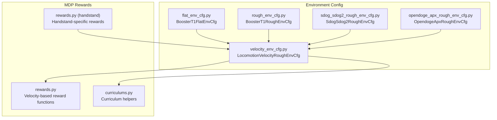
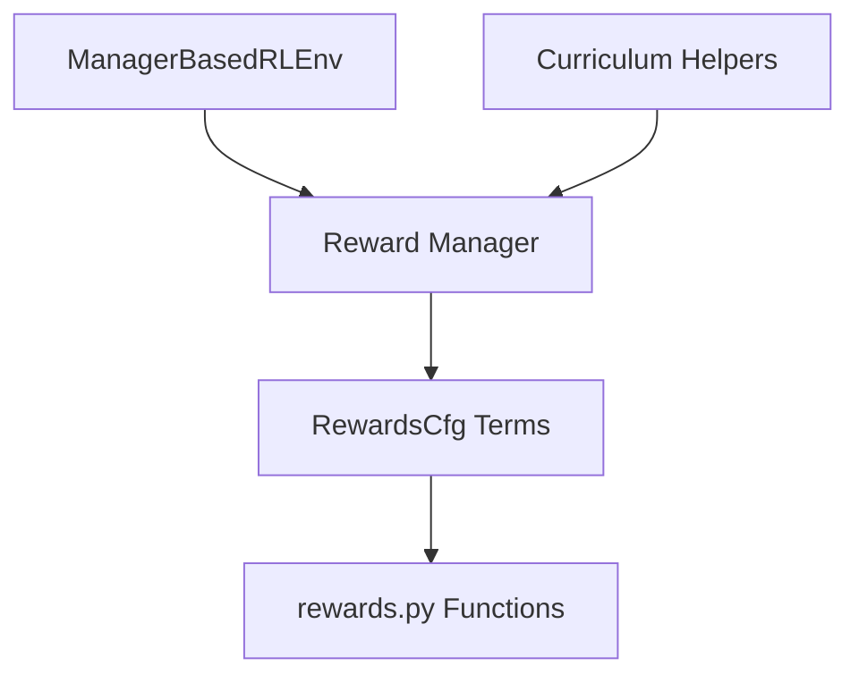
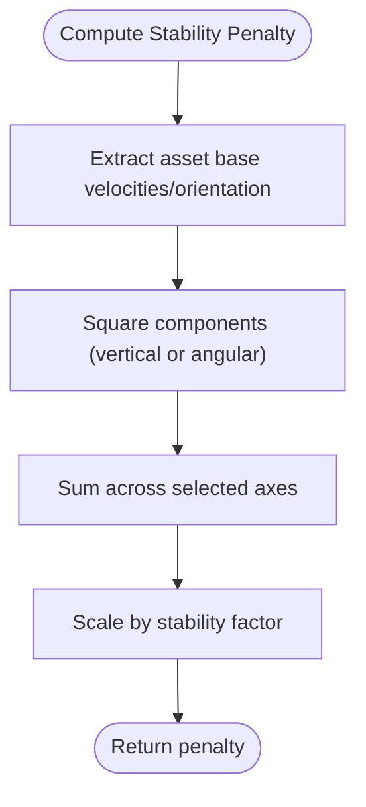
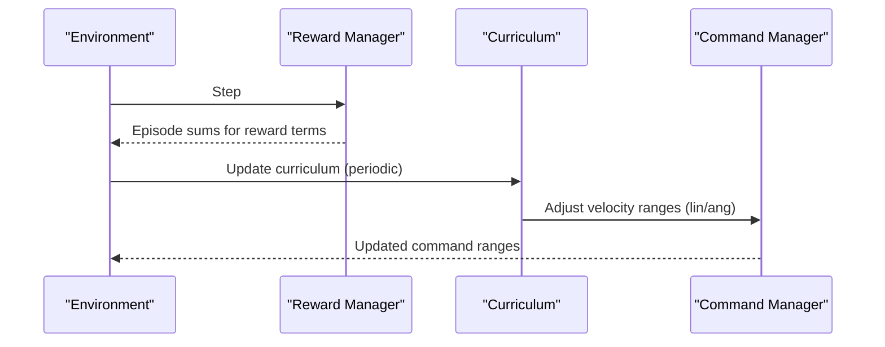
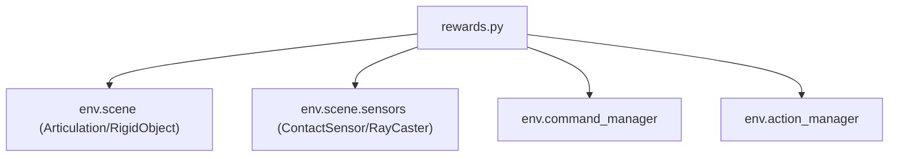

# Reward Functions and Shaping

<cite>
**Referenced Files in This Document**
- [rewards.py](file://source/robot_lab/robot_lab/tasks/manager_based/locomotion/velocity/mdp/rewards.py)
- [velocity_env_cfg.py](file://source/robot_lab/robot_lab/tasks/manager_based/locomotion/velocity/velocity_env_cfg.py)
- [flat_env_cfg.py](file://source/robot_lab/robot_lab/tasks/manager_based/locomotion/velocity/config/humanoid/booster_t1/flat_env_cfg.py)
- [rough_env_cfg.py](file://source/robot_lab/robot_lab/tasks/manager_based/locomotion/velocity/config/humanoid/booster_t1/rough_env_cfg.py)
- [sdog_sdog2_rough_env_cfg.py](file://source/robot_lab/robot_lab/tasks/manager_based/locomotion/velocity/config/quadruped/sdog_sdog2/rough_env_cfg.py)
- [opendoge_apx_rough_env_cfg.py](file://source/robot_lab/robot_lab/tasks/manager_based/locomotion/velocity/config/quadruped/opendoge_apx/rough_env_cfg.py)
- [curriculums.py](file://source/robot_lab/robot_lab/tasks/manager_based/locomotion/velocity/mdp/curriculums.py)
- [rewards.py (handstand)](file://source/robot_lab/robot_lab/tasks/manager_based/locomotion/velocity/config/others/unitree_a1_handstand/env/rewards.py)
</cite>

## Table of Contents
1. [Introduction](#introduction)
2. [Project Structure](#project-structure)
3. [Core Components](#core-components)
4. [Architecture Overview](#architecture-overview)
5. [Detailed Component Analysis](#detailed-component-analysis)
6. [Dependency Analysis](#dependency-analysis)
7. [Performance Considerations](#performance-considerations)
8. [Troubleshooting Guide](#troubleshooting-guide)
9. [Conclusion](#conclusion)
10. [Appendices](#appendices)

## Introduction
This document explains reward functions and shaping tailored for velocity-based locomotion tasks. It focuses on the RewardsCfg class and its reward terms, covering:
- Velocity tracking rewards (track_lin_vel_xy_exp, track_ang_vel_z_exp)
- Stability penalties (lin_vel_z_l2, ang_vel_xy_l2, flat_orientation_l2)
- Joint penalties (joint_torques_l2, joint_vel_l2, joint_acc_l2)
- Contact-based rewards (feet_air_time, feet_contact, contact_forces)
- Penalties for joint limits, power consumption, and mirror/sync constraints
- Reward weighting strategies, curriculum-based reward scaling, and reward term activation/deactivation
- Practical examples of reward function tuning, common reward combinations, and their impact on learning behavior

## Project Structure
The reward system is implemented as modular manager terms and configured via environment configurations. Key locations:
- Reward implementations: velocity/mode/rewards.py
- Base environment configuration: velocity/velocity_env_cfg.py
- Example overrides for flat terrain: config/humanoid/booster_t1/flat_env_cfg.py
- Example overrides for rough terrain: config/humanoid/booster_t1/rough_env_cfg.py
- Additional quadruped examples: config/quadruped/*/rough_env_cfg.py
- Curriculum utilities: velocity/mdp/curriculums.py
- Handstand-specific rewards: config/others/unitree_a1_handstand/env/rewards.py

**Diagram sources**
- [velocity_env_cfg.py](file://source/robot_lab/robot_lab/tasks/manager_based/locomotion/velocity/velocity_env_cfg.py#L695-L744)
- [flat_env_cfg.py](file://source/robot_lab/robot_lab/tasks/manager_based/locomotion/velocity/config/humanoid/booster_t1/flat_env_cfg.py#L10-L33)
- [rough_env_cfg.py](file://source/robot_lab/robot_lab/tasks/manager_based/locomotion/velocity/config/humanoid/booster_t1/rough_env_cfg.py#L17-L140)
- [sdog_sdog2_rough_env_cfg.py](file://source/robot_lab/robot_lab/tasks/manager_based/locomotion/velocity/config/quadruped/sdog_sdog2/rough_env_cfg.py#L14-L175)
- [opendoge_apx_rough_env_cfg.py](file://source/robot_lab/robot_lab/tasks/manager_based/locomotion/velocity/config/quadruped/opendoge_apx/rough_env_cfg.py#L14-L187)
- [rewards.py](file://source/robot_lab/robot_lab/tasks/manager_based/locomotion/velocity/mdp/rewards.py#L1-L681)
- [curriculums.py](file://source/robot_lab/robot_lab/tasks/manager_based/locomotion/velocity/mdp/curriculums.py#L1-L60)
- [rewards.py (handstand)](file://source/robot_lab/robot_lab/tasks/manager_based/locomotion/velocity/config/others/unitree_a1_handstand/env/rewards.py#L1-L58)

**Section sources**
- [velocity_env_cfg.py](file://source/robot_lab/robot_lab/tasks/manager_based/locomotion/velocity/velocity_env_cfg.py#L695-L744)

## Core Components
This section documents the RewardsCfg class and its reward terms. Each term is described by purpose, computation characteristics, and typical weight ranges observed in example configurations.

- Velocity tracking rewards
  - track_lin_vel_xy_exp: Exponential reward for tracking commanded xy linear velocity; uses error in base frame and multiplies by a stability factor based on projected gravity.
  - track_ang_vel_z_exp: Exponential reward for tracking commanded z angular velocity; similar structure to linear tracking.
  - track_lin_vel_xy_yaw_frame_exp: Exponential reward for tracking xy linear velocity in a gravity-aligned body frame.
  - track_ang_vel_z_world_exp: Exponential reward for tracking z angular velocity in the world frame.

- Stability penalties
  - lin_vel_z_l2: L2 penalty on vertical base linear velocity.
  - ang_vel_xy_l2: L2 penalty on roll/pitch base angular velocities.
  - flat_orientation_l2: L2 penalty on projected gravity’s x/y components to encourage flat base orientation.

- Joint penalties
  - joint_torques_l2: L2 penalty on joint torques.
  - joint_vel_l2: L2 penalty on joint velocities.
  - joint_acc_l2: L2 penalty on joint accelerations.
  - joint_pos_limits: Penalty for joint position limits violation.
  - joint_vel_limits: Penalty for joint velocity limits violation.
  - joint_power: Penalty/proxy for power consumption via torque·velocity product.
  - joint_pos_penalty: Deviation from default joint positions; scaled differently when command/velocity is low.
  - joint_mirror: Mirror constraint penalty across symmetric joints.
  - action_mirror: Mirror constraint penalty on absolute actions across symmetric joints.
  - action_sync: Encourage synchronized absolute actions within joint groups.

- Contact-based rewards
  - feet_air_time: Sum of per-foot air-time above a threshold when command is non-zero.
  - feet_air_time_positive_biped: Positive reward for single-stance duration up to a threshold (biped-specific).
  - feet_air_time_variance_penalty: Penalize variance in air/ground time across feet.
  - feet_contact: Binary penalty when contact count differs from expectation.
  - feet_contact_without_cmd: Encourage contact when command is near zero.
  - feet_stumble: Penalize conditions indicating vertical vs lateral force dominance at feet.
  - feet_slide: Penalize lateral foot velocity while in contact.
  - feet_height / feet_height_body: Encourage swing feet to clear a target height with velocity-aware weighting.
  - feet_distance_y_exp / feet_distance_xy_exp: Exponential shaping of foot placement relative to desired stance geometry.
  - feet_gait: Quadruped gait enforcement via contact/air-time synchronization and anti-synchronization between foot pairs.
  - contact_forces / undesired_contacts: Contact force thresholds and undesired contact penalties.

- Others
  - upward: Encourage base orientation pointing upwards.
  - base_height_l2: L2 penalty on base height with optional terrain-adjusted target via ray-sensing.
  - is_terminated: Terminal reward for episode termination.

Typical weight ranges observed in example environments:
- Velocity tracking: positive weights around 2–5
- Stability penalties: negative weights around −0.05 to −0.2
- Joint penalties: negative weights ranging from −1e-7 to −5e-5 depending on joint subset
- Action penalties: negative weights around −0.01 to −0.075
- Contact rewards/penalties: vary widely by task; e.g., feet_air_time often positive, feet_slide negative
- Upward/base_height: positive weights around 1.0

Activation/deactivation:
- Zero-weight terms are disabled by environment configuration’s disable_zero_weight_rewards method.

**Section sources**
- [velocity_env_cfg.py](file://source/robot_lab/robot_lab/tasks/manager_based/locomotion/velocity/velocity_env_cfg.py#L375-L744)
- [rewards.py](file://source/robot_lab/robot_lab/tasks/manager_based/locomotion/velocity/mdp/rewards.py#L22-L681)

## Architecture Overview
The reward system is built around manager-based terms that are configured in RewardsCfg and executed during environment steps. Curriculum adjusts command ranges dynamically based on reward performance.

**Diagram sources**
- [velocity_env_cfg.py](file://source/robot_lab/robot_lab/tasks/manager_based/locomotion/velocity/velocity_env_cfg.py#L695-L744)
- [rewards.py](file://source/robot_lab/robot_lab/tasks/manager_based/locomotion/velocity/mdp/rewards.py#L1-L681)
- [curriculums.py](file://source/robot_lab/robot_lab/tasks/manager_based/locomotion/velocity/mdp/curriculums.py#L1-L60)

## Detailed Component Analysis

### Velocity Tracking Rewards
- track_lin_vel_xy_exp
  - Purpose: Exponentially reward tracking of xy linear velocity commands in the base frame.
  - Implementation highlights: Computes squared error between commanded and measured xy base linear velocities, applies exponential kernel with std, and multiplies by a stability factor derived from projected gravity.
  - Typical usage: Positive weight; std controls reward sensitivity; often paired with a stability multiplier to avoid rewarding unstable motions.
  - Weight range: Observed around 2–5 in examples.

- track_ang_vel_z_exp
  - Purpose: Exponentially reward tracking of z angular velocity commands.
  - Implementation highlights: Similar to linear tracking but for yaw angular velocity; includes the same stability factor.
  - Weight range: Observed around 1–3 in examples.

- Alternative frames
  - track_lin_vel_xy_yaw_frame_exp: Uses a gravity-aligned body frame for velocity measurement.
  - track_ang_vel_z_world_exp: Uses world-frame angular velocity measurement.

**Diagram sources**
- [rewards.py](file://source/robot_lab/robot_lab/tasks/manager_based/locomotion/velocity/mdp/rewards.py#L22-L48)

**Section sources**
- [rewards.py](file://source/robot_lab/robot_lab/tasks/manager_based/locomotion/velocity/mdp/rewards.py#L22-L75)

### Stability Penalties
- lin_vel_z_l2
  - Purpose: Penalize vertical base linear velocity to suppress bounce and hover.
  - Weight range: Negative weights around −0.2 to −2.0 in examples.

- ang_vel_xy_l2
  - Purpose: Penalize roll/pitch base angular velocities to stabilize orientation.
  - Weight range: Negative weights around −0.05 to −0.1 in examples.

- flat_orientation_l2
  - Purpose: Penalize deviations of projected gravity’s x/y components to maintain flat base orientation.
  - Weight range: Negative weights around −0.1 to −0.2 in examples.

**Diagram sources**
- [rewards.py](file://source/robot_lab/robot_lab/tasks/manager_based/locomotion/velocity/mdp/rewards.py#L640-L680)

**Section sources**
- [rewards.py](file://source/robot_lab/robot_lab/tasks/manager_based/locomotion/velocity/mdp/rewards.py#L640-L680)

### Joint Penalties and Constraints
- joint_torques_l2 / joint_vel_l2 / joint_acc_l2
  - Purpose: Penalize excessive torques, velocities, or accelerations to improve energy efficiency and safety.
  - Weight range: Negative weights from −1e-7 to −5e-5; often subsetted to major joints (hips, knees).

- joint_pos_limits / joint_vel_limits
  - Purpose: Penalize violations of joint position/velocity limits.
  - Weight range: Negative weights around −5.0 in examples.

- joint_power
  - Purpose: Encourage reduced power consumption via torque·velocity product.
  - Weight range: Negative weights around −2e-5 in examples.

- joint_pos_penalty
  - Purpose: Deviation from default joint positions; scaled differently when command/velocity is low.
  - Weight range: Negative weights around −1.0 in examples.

- Mirror and Sync Constraints
  - joint_mirror: Enforce symmetry across mirrored joint pairs.
  - action_mirror: Enforce symmetry on absolute actions across mirrored pairs.
  - action_sync: Encourage synchronized absolute actions within joint groups.
  - Weight range: Negative weights around −0.05 to −0.1 in examples.

**Diagram sources**
- [rewards.py](file://source/robot_lab/robot_lab/tasks/manager_based/locomotion/velocity/mdp/rewards.py#L255-L333)

**Section sources**
- [rewards.py](file://source/robot_lab/robot_lab/tasks/manager_based/locomotion/velocity/mdp/rewards.py#L78-L126)
- [rewards.py](file://source/robot_lab/robot_lab/tasks/manager_based/locomotion/velocity/mdp/rewards.py#L255-L333)

### Contact-Based Rewards
- feet_air_time
  - Purpose: Encourage steps by rewarding cumulative air-time above a threshold when command is non-zero.
  - Weight range: Positive weights around 0.1–2.0 in examples.

- feet_air_time_positive_biped
  - Purpose: Single-stance reward for bipeds up to a threshold.
  - Weight range: Positive weights around 0.1–0.4 in examples.

- feet_air_time_variance_penalty
  - Purpose: Penalize variance in air/ground time across feet to promote even gait.
  - Weight range: Negative weights around −1.0 in examples.

- feet_contact / feet_contact_without_cmd
  - Purpose: Encourage expected contact counts under command or contact when no command.
  - Weight range: Varies; often near zero or small positive/negative in examples.

- feet_stumble / feet_slide
  - Purpose: Penalize conditions indicating vertical vs lateral force dominance or lateral sliding.
  - Weight range: Negative weights around −0.1 to −0.4 in examples.

- feet_height / feet_height_body
  - Purpose: Encourage swing feet to clear a target height with velocity-aware weighting.
  - Weight range: Negative weights around −5.0 in examples.

- feet_distance_y_exp / feet_distance_xy_exp
  - Purpose: Exponential shaping of foot placement relative to desired stance geometry.
  - Weight range: Depends on std and target geometry; often combined with other terms.

- feet_gait
  - Purpose: Quadruped gait enforcement via contact/air-time synchronization and anti-synchronization between foot pairs.
  - Weight range: Positive weights around 0.5 in examples.

- contact_forces / undesired_contacts
  - Purpose: Penalize excessive or undesired contact forces.
  - Weight range: Negative weights around −1e-4 to −1.0 in examples.

**Diagram sources**
- [rewards.py](file://source/robot_lab/robot_lab/tasks/manager_based/locomotion/velocity/mdp/rewards.py#L336-L583)

**Section sources**
- [rewards.py](file://source/robot_lab/robot_lab/tasks/manager_based/locomotion/velocity/mdp/rewards.py#L336-L583)

### Curriculum-Based Reward Scaling
- command_levels_lin_vel / command_levels_ang_vel
  - Purpose: Dynamically expand command ranges based on tracking reward performance.
  - Mechanism: Adjusts velocity ranges when average episode reward exceeds a threshold; updates ranges gradually and clamped to initial/final bounds.
  - Usage: Enabled in curriculum; parameters include reward term name and range multiplier.

**Diagram sources**
- [curriculums.py](file://source/robot_lab/robot_lab/tasks/manager_based/locomotion/velocity/mdp/curriculums.py#L20-L60)
- [velocity_env_cfg.py](file://source/robot_lab/robot_lab/tasks/manager_based/locomotion/velocity/velocity_env_cfg.py#L668-L687)

**Section sources**
- [curriculums.py](file://source/robot_lab/robot_lab/tasks/manager_based/locomotion/velocity/mdp/curriculums.py#L20-L60)
- [velocity_env_cfg.py](file://source/robot_lab/robot_lab/tasks/manager_based/locomotion/velocity/velocity_env_cfg.py#L668-L687)

### Reward Term Activation/Deactivation
- Zero-weight terms are disabled via disable_zero_weight_rewards, which sets the term to None if its weight is zero.
- Example overrides demonstrate enabling/disabling specific terms in flat/rough environments.

**Section sources**
- [velocity_env_cfg.py](file://source/robot_lab/robot_lab/tasks/manager_based/locomotion/velocity/velocity_env_cfg.py#L737-L744)
- [flat_env_cfg.py](file://source/robot_lab/robot_lab/tasks/manager_based/locomotion/velocity/config/humanoid/booster_t1/flat_env_cfg.py#L28-L32)
- [rough_env_cfg.py](file://source/robot_lab/robot_lab/tasks/manager_based/locomotion/velocity/config/humanoid/booster_t1/rough_env_cfg.py#L56-L125)

### Practical Examples and Combinations
- Humanoid (Booster T1)
  - Flat terrain: Emphasize stability penalties (e.g., lin_vel_z_l2), reduce terrain-dependent terms.
  - Rough terrain: Increase tracking rewards (e.g., track_lin_vel_xy_exp, track_ang_vel_z_exp), add gait and contact terms.
  - Example weights: track_lin_vel_xy_exp ≈ 4.5, track_ang_vel_z_exp ≈ 2.5, lin_vel_z_l2 ≈ −0.2, ang_vel_xy_l2 ≈ −0.1, flat_orientation_l2 ≈ −0.2, joint_torques_l2 ≈ −3e-7, joint_acc_l2 ≈ −1.25e-7, action_rate_l2 ≈ −0.075, feet_air_time ≈ 2.0, feet_slide ≈ −0.4, upward ≈ 1.0.

- Quadrupeds (Sdog Sdog2, Opendoge APX)
  - Emphasize joint smoothing (joint_acc_l2), joint limits (joint_pos_limits), power (joint_power), mirror constraints (joint_mirror), and gait enforcement (feet_gait).
  - Example weights: joint_torques_l2 ≈ −2.5e-5, joint_acc_l2 ≈ −2.5e-7, joint_pos_limits ≈ −5.0, joint_power ≈ −2e-5, joint_mirror ≈ −0.05, action_rate_l2 ≈ −0.01, feet_air_time ≈ 0.1–0.15, feet_height_body ≈ −5.0, feet_gait ≈ 0.5.

- Handstand (Unitree A1)
  - Specialized rewards for feet height and orientation to maintain inverted posture.
  - Example functions: handstand_feet_height_exp, handstand_feet_on_air, handstand_feet_air_time, handstand_orientation_l2.

Impact on learning:
- Strong tracking rewards accelerate convergence to desired velocities.
- Stability penalties prevent unrealistic behaviors (hovering, excessive rolling).
- Joint and action penalties improve energy efficiency and safety.
- Contact rewards encourage natural gait patterns; gait enforcement improves coordination.
- Curriculum expands task difficulty progressively, preventing premature plateauing.

**Section sources**
- [rough_env_cfg.py](file://source/robot_lab/robot_lab/tasks/manager_based/locomotion/velocity/config/humanoid/booster_t1/rough_env_cfg.py#L51-L125)
- [flat_env_cfg.py](file://source/robot_lab/robot_lab/tasks/manager_based/locomotion/velocity/config/humanoid/booster_t1/flat_env_cfg.py#L27-L32)
- [sdog_sdog2_rough_env_cfg.py](file://source/robot_lab/robot_lab/tasks/manager_based/locomotion/velocity/config/quadruped/sdog_sdog2/rough_env_cfg.py#L89-L160)
- [opendoge_apx_rough_env_cfg.py](file://source/robot_lab/robot_lab/tasks/manager_based/locomotion/velocity/config/quadruped/opendoge_apx/rough_env_cfg.py#L101-L171)
- [rewards.py (handstand)](file://source/robot_lab/robot_lab/tasks/manager_based/locomotion/velocity/config/others/unitree_a1_handstand/env/rewards.py#L17-L58)

## Dependency Analysis
- Rewards depend on:
  - Scene entities (robot, sensors) accessed via env.scene and env.scene.sensors.
  - Command manager for velocity commands.
  - Action manager for action-related constraints.
  - Math utilities for transformations (e.g., quat_apply, quat_conjugate).

**Diagram sources**
- [rewards.py](file://source/robot_lab/robot_lab/tasks/manager_based/locomotion/velocity/mdp/rewards.py#L1-L681)

**Section sources**
- [rewards.py](file://source/robot_lab/robot_lab/tasks/manager_based/locomotion/velocity/mdp/rewards.py#L1-L681)

## Performance Considerations
- Exponential kernels (e.g., track_lin_vel_xy_exp, track_ang_vel_z_exp) are computationally efficient and smooth, aiding stable gradients.
- Contact sensor computations (air/ground times, forces) can be costly; tune update periods and body subsets to balance fidelity and speed.
- Curriculum updates occur periodically; ensure episode length aligns with update cadence to avoid frequent range changes mid-episode.
- Zero-weight term removal reduces computation overhead during evaluation or when disabling terms.

## Troubleshooting Guide
- Reward not activating
  - Verify weight > 0; zero-weight terms are disabled by disable_zero_weight_rewards.
  - Check environment overrides that set terms to None.

- Tracking reward too sensitive/unsensitive
  - Adjust std in track_*_exp functions; smaller std increases sensitivity.
  - Consider switching between world/body frame tracking depending on task stability needs.

- Instability during training
  - Increase lin_vel_z_l2, ang_vel_xy_l2, flat_orientation_l2 weights.
  - Reduce action_rate_l2 or increase action smoothness penalties.

- Poor gait or uneven foot contact
  - Enable feet_gait and adjust feet_air_time_variance_penalty.
  - Increase joint mirror/action sync weights for symmetry.

- Excessive power consumption
  - Increase joint_power and joint_torques_l2 weights.
  - Reduce action_rate_l2 if smoothing is insufficient.

**Section sources**
- [velocity_env_cfg.py](file://source/robot_lab/robot_lab/tasks/manager_based/locomotion/velocity/velocity_env_cfg.py#L737-L744)
- [rewards.py](file://source/robot_lab/robot_lab/tasks/manager_based/locomotion/velocity/mdp/rewards.py#L22-L75)
- [rewards.py](file://source/robot_lab/robot_lab/tasks/manager_based/locomotion/velocity/mdp/rewards.py#L336-L583)

## Conclusion
The reward system provides a flexible, modular framework for velocity-based locomotion. By combining velocity tracking, stability penalties, joint/action constraints, and contact-based shaping—and by leveraging curriculum-driven command scaling—environments can be tuned to achieve robust, efficient, and natural locomotion behaviors. Example configurations illustrate effective weight choices and term combinations across humanoid and quadruped tasks, with special-purpose rewards for specialized gaits such as handstands.

## Appendices
- Reward term summary and typical weight ranges are documented in the “Core Components” section with references to example environments.