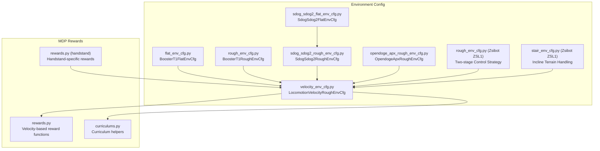
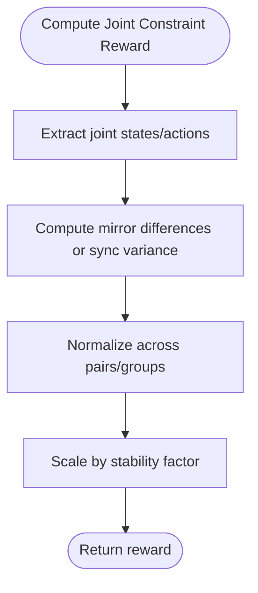
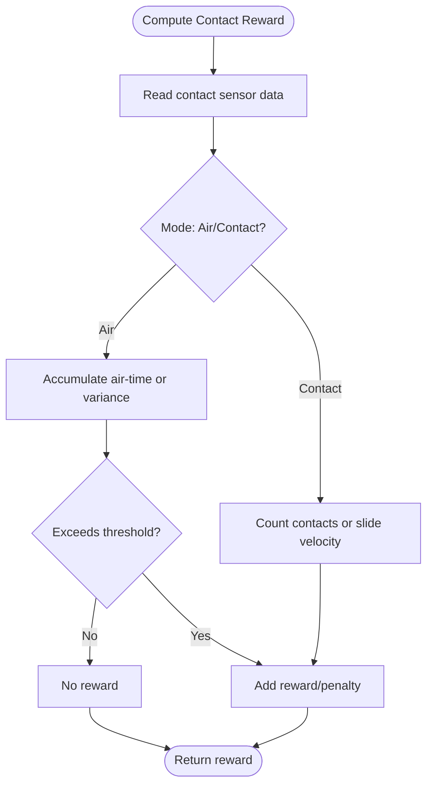
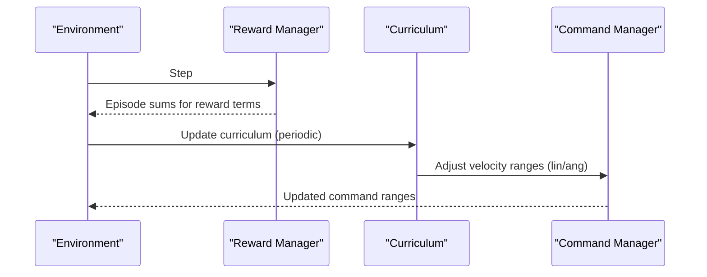
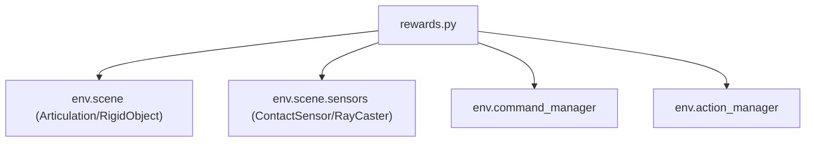

# Reward Functions and Shaping

<cite>
**Referenced Files in This Document**
- [rewards.py](file://source/robot_lab/robot_lab/tasks/manager_based/locomotion/velocity/mdp/rewards.py)
- [velocity_env_cfg.py](file://source/robot_lab/robot_lab/tasks/manager_based/locomotion/velocity/velocity_env_cfg.py)
- [flat_env_cfg.py](file://source/robot_lab/robot_lab/tasks/manager_based/locomotion/velocity/config/humanoid/booster_t1/flat_env_cfg.py)
- [rough_env_cfg.py](file://source/robot_lab/robot_lab/tasks/manager_based/locomotion/velocity/config/humanoid/booster_t1/rough_env_cfg.py)
- [sdog_sdog2_rough_env_cfg.py](file://source/robot_lab/robot_lab/tasks/manager_based/locomotion/velocity/config/quadruped/sdog_sdog2/rough_env_cfg.py)
- [sdog_sdog2_flat_env_cfg.py](file://source/robot_lab/robot_lab/tasks/manager_based/locomotion/velocity/config/quadruped/sdog_sdog2/flat_env_cfg.py)
- [opendoge_apx_rough_env_cfg.py](file://source/robot_lab/robot_lab/tasks/manager_based/locomotion/velocity/config/quadruped/opendoge_apx/rough_env_cfg.py)
- [curriculums.py](file://source/robot_lab/robot_lab/tasks/manager_based/locomotion/velocity/mdp/curriculums.py)
- [rewards.py (handstand)](file://source/robot_lab/robot_lab/tasks/manager_based/locomotion/velocity/config/others/unitree_a1_handstand/env/rewards.py)
- [rough_env_cfg.py (Zsibot ZSL1)](file://source/robot_lab/robot_lab/tasks/manager_based/locomotion/velocity/config/quadruped/zsibot_zsl1/rough_env_cfg.py)
- [stair_env_cfg.py (Zsibot ZSL1)](file://source/robot_lab/robot_lab/tasks/manager_based/locomotion/velocity/config/quadruped/zsibot_zsl1/stair_env_cfg.py)
</cite>

## Update Summary
**Changes Made**
- Added documentation for the new heading-aligned velocity tracking function (track_lin_vel_xy_heading_aligned_exp)
- Updated velocity tracking rewards section to include the two-stage control strategy implementation
- Documented the requirement for heading_command=True in CommandCfg for accessing heading_target
- Added examples of Zsibot ZSL1 configurations using the new reward function
- Updated troubleshooting guide with guidance for the new reward function

## Table of Contents
1. [Introduction](#introduction)
2. [Project Structure](#project-structure)
3. [Core Components](#core-components)
4. [Architecture Overview](#architecture-overview)
5. [Detailed Component Analysis](#detailed-component-analysis)
6. [Dependency Analysis](#dependency-analysis)
7. [Performance Considerations](#performance-considerations)
8. [Troubleshooting Guide](#troubleshooting-guide)
9. [Conclusion](#conclusion)
10. [Appendices](#appendices)

## Introduction
This document explains reward functions and shaping tailored for velocity-based locomotion tasks. It focuses on the RewardsCfg class and its reward terms, covering:
- Velocity tracking rewards (track_lin_vel_xy_exp, track_ang_vel_z_exp, track_lin_vel_xy_heading_aligned_exp)
- Stability penalties (lin_vel_z_l2, ang_vel_xy_l2, flat_orientation_l2)
- Joint penalties (joint_torques_l2, joint_vel_l2, joint_acc_l2)
- Contact-based rewards (feet_air_time, feet_contact, contact_forces)
- Penalties for joint limits, power consumption, and mirror/sync constraints
- Reward weighting strategies, curriculum-based reward scaling, and reward term activation/deactivation
- Practical examples of reward function tuning, common reward combinations, and their impact on learning behavior

**Updated** Enhanced documentation with new heading-aligned velocity tracking function that implements two-stage control strategy for improved locomotion stability on complex terrain.

## Project Structure
The reward system is implemented as modular manager terms and configured via environment configurations. Key locations:
- Reward implementations: velocity/mode/rewards.py
- Base environment configuration: velocity/velocity_env_cfg.py
- Example overrides for flat terrain: config/humanoid/booster_t1/flat_env_cfg.py
- Example overrides for rough terrain: config/humanoid/booster_t1/rough_env_cfg.py
- Sdog-Sdog2 specific configurations: config/quadruped/sdog_sdog2/*
- Zsibot ZSL1 configurations using new reward: config/quadruped/zsibot_zsl1/*
- Additional quadruped examples: config/quadruped/*/rough_env_cfg.py
- Curriculum utilities: velocity/mdp/curriculums.py
- Handstand-specific rewards: config/others/unitree_a1_handstand/env/rewards.py



**Diagram sources**
- [velocity_env_cfg.py:695-744](file://source/robot_lab/robot_lab/tasks/manager_based/locomotion/velocity/velocity_env_cfg.py#L695-L744)
- [flat_env_cfg.py:10-33](file://source/robot_lab/robot_lab/tasks/manager_based/locomotion/velocity/config/humanoid/booster_t1/flat_env_cfg.py#L10-L33)
- [rough_env_cfg.py:17-140](file://source/robot_lab/robot_lab/tasks/manager_based/locomotion/velocity/config/humanoid/booster_t1/rough_env_cfg.py#L17-L140)
- [sdog_sdog2_rough_env_cfg.py:14-179](file://source/robot_lab/robot_lab/tasks/manager_based/locomotion/velocity/config/quadruped/sdog_sdog2/rough_env_cfg.py#L14-L179)
- [sdog_sdog2_flat_env_cfg.py:11-32](file://source/robot_lab/robot_lab/tasks/manager_based/locomotion/velocity/config/quadruped/sdog_sdog2/flat_env_cfg.py#L11-L32)
- [opendoge_apx_rough_env_cfg.py:14-187](file://source/robot_lab/robot_lab/tasks/manager_based/locomotion/velocity/config/quadruped/opendoge_apx/rough_env_cfg.py#L14-L187)
- [rewards.py:1-791](file://source/robot_lab/robot_lab/tasks/manager_based/locomotion/velocity/mdp/rewards.py#L1-L791)
- [curriculums.py:1-60](file://source/robot_lab/robot_lab/tasks/manager_based/locomotion/velocity/mdp/curriculums.py#L1-L60)
- [rewards.py (handstand):1-58](file://source/robot_lab/robot_lab/tasks/manager_based/locomotion/velocity/config/others/unitree_a1_handstand/env/rewards.py#L1-L58)
- [rough_env_cfg.py (Zsibot ZSL1):123-129](file://source/robot_lab/robot_lab/tasks/manager_based/locomotion/velocity/config/quadruped/zsibot_zsl1/rough_env_cfg.py#L123-L129)
- [stair_env_cfg.py (Zsibot ZSL1):157-163](file://source/robot_lab/robot_lab/tasks/manager_based/locomotion/velocity/config/quadruped/zsibot_zsl1/stair_env_cfg.py#L157-L163)

**Section sources**
- [velocity_env_cfg.py:695-744](file://source/robot_lab/robot_lab/tasks/manager_based/locomotion/velocity/velocity_env_cfg.py#L695-L744)

## Core Components
This section documents the RewardsCfg class and its reward terms. Each term is described by purpose, computation characteristics, and typical weight ranges observed in example configurations.

**Updated** Enhanced with new heading-aligned velocity tracking function and two-stage control strategy.

- **General Terms**
  - is_terminated: Terminal reward for episode termination.

- **Root Penalties**
  - lin_vel_z_l2: L2 penalty on vertical base linear velocity.
  - ang_vel_xy_l2: L2 penalty on roll/pitch base angular velocities.
  - flat_orientation_l2: L2 penalty on projected gravity's x/y components to encourage flat base orientation.
  - base_height_l2: L2 penalty on base height with optional terrain-adjusted target via ray-sensing.
  - body_lin_acc_l2: L2 penalty on base linear acceleration.

- **Joint Penalties**
  - joint_torques_l2: L2 penalty on joint torques.
  - joint_vel_l2: L2 penalty on joint velocities.
  - joint_acc_l2: L2 penalty on joint accelerations.
  - joint_pos_limits: Penalty for joint position limits violation.
  - joint_vel_limits: Penalty for joint velocity limits violation.
  - joint_power: Penalty/proxy for power consumption via torque·velocity product.
  - joint_pos_penalty: Deviation from default joint positions; scaled differently when command/velocity is low.
  - joint_mirror: Mirror constraint penalty across symmetric joints.
  - action_mirror: Mirror constraint penalty on absolute actions across symmetric joints.
  - action_sync: Encourage synchronized absolute actions within joint groups.

- **Action Penalties**
  - applied_torque_limits: Penalty for exceeding applied torque limits.
  - action_rate_l2: L2 penalty on action rate (change in actions).

- **Contact Sensor Terms**
  - undesired_contacts: Penalize undesired contacts as the number of violations above a threshold.
  - contact_forces: Contact force penalties.

- **Velocity Tracking Rewards**
  - track_lin_vel_xy_exp: Exponential reward for tracking commanded xy linear velocity; uses error in base frame and multiplies by a stability factor based on projected gravity.
  - track_ang_vel_z_exp: Exponential reward for tracking commanded z angular velocity; similar structure to linear tracking.
  - **Updated** track_lin_vel_xy_heading_aligned_exp: Two-stage control strategy that prioritizes heading alignment before forward velocity tracking.

- **Other Contact-Based Rewards**
  - feet_air_time: Sum of per-foot air-time above a threshold when command is non-zero.
  - feet_air_time_variance: Penalize variance in air/ground time across feet.
  - feet_gait: Quadruped gait enforcement via contact/air-time synchronization and anti-synchronization between foot pairs.
  - feet_contact: Binary penalty when contact count differs from expectation.
  - feet_contact_without_cmd: Encourage contact when command is near zero.
  - feet_stumble: Penalize conditions indicating vertical vs lateral force dominance at feet.
  - feet_slide: Penalize lateral foot velocity while in contact.
  - feet_height / feet_height_body: Encourage swing feet to clear a target height with velocity-aware weighting.
  - feet_distance_y_exp / feet_distance_xy_exp: Exponential shaping of foot placement relative to desired stance geometry.
  - upward: Encourage base orientation pointing upwards.

Typical weight ranges observed in example environments:
- Velocity tracking: positive weights around 2–5
- Stability penalties: negative weights around −0.05 to −0.2
- Joint penalties: negative weights ranging from −1e-7 to −5e-5 depending on joint subset
- Action penalties: negative weights around −0.01 to −0.075
- Contact rewards/penalties: vary widely by task; e.g., feet_air_time often positive, feet_slide negative
- Upward/base_height: positive weights around 1.0

Activation/deactivation:
- Zero-weight terms are disabled by environment configuration's disable_zero_weight_rewards method.

**Section sources**
- [velocity_env_cfg.py:375-744](file://source/robot_lab/robot_lab/tasks/manager_based/locomotion/velocity/velocity_env_cfg.py#L375-L744)
- [rewards.py:22-791](file://source/robot_lab/robot_lab/tasks/manager_based/locomotion/velocity/mdp/rewards.py#L22-L791)

## Architecture Overview
The reward system is built around manager-based terms that are configured in RewardsCfg and executed during environment steps. Curriculum adjusts command ranges dynamically based on reward performance.

```mermaid
graph TB
Env["ManagerBasedRLEnv"]
RM["Reward Manager"]
Term["RewardsCfg Terms"]
Impl["rewards.py Functions"]
Cur["Curriculum Helpers"]
end
```

**Diagram sources**
- [velocity_env_cfg.py:695-744](file://source/robot_lab/robot_lab/tasks/manager_based/locomotion/velocity/velocity_env_cfg.py#L695-L744)
- [rewards.py:1-791](file://source/robot_lab/robot_lab/tasks/manager_based/locomotion/velocity/mdp/rewards.py#L1-L791)
- [curriculums.py:1-60](file://source/robot_lab/robot_lab/tasks/manager_based/locomotion/velocity/mdp/curriculums.py#L1-L60)

## Detailed Component Analysis

### Heading-Aligned Velocity Tracking with Two-Stage Control Strategy

**Updated** New reward function that implements a sophisticated two-stage control strategy for improved locomotion stability.

The `track_lin_vel_xy_heading_aligned_exp` function introduces a two-stage control strategy that prioritizes heading alignment before forward velocity tracking:

#### Two-Stage Control Implementation

**Stage 1: Heading Alignment (Misaligned)**
- When heading error > threshold: Focus on aligning robot with target direction
- Rewards: heading_error reduction and yaw velocity alignment
- Allows minimal forward progress while correcting orientation

**Stage 2: Forward Velocity Tracking (Aligned)**
- When heading error ≤ threshold: Focus on achieving commanded forward speed
- Rewards: forward velocity tracking with lateral stability penalty
- Maintains stability while maximizing forward progress

#### Key Features

1. **Heading Target Access**: Requires `heading_command=True` in CommandCfg to access `heading_target`
2. **Fallback Mechanism**: Derives target heading from xy command direction when heading_target unavailable
3. **Incline Terrain Handling**: Automatically falls back to standard body-frame tracking on steep inclines
4. **Gravity Alignment Factor**: Applies stability factor based on projected gravity for natural movement

#### Mathematical Implementation


**Diagram sources**
- [rewards.py:683-790](file://source/robot_lab/robot_lab/tasks/manager_based/locomotion/velocity/mdp/rewards.py#L683-L790)

#### Configuration Examples

**Zsibot ZSL1 Rough Terrain Configuration**:
- Uses `track_lin_vel_xy_heading_aligned_exp` with weight 4.0
- Heading threshold: 0.3 radians (≈17.2°)
- Prevents rear-facing locomotion on complex terrain
- Enables full 360° heading sampling for comprehensive learning

**Zsibot ZSL1 Stair Configuration**:
- Same two-stage approach optimized for incline navigation
- Automatic fallback to body-frame tracking on steep inclines
- Reduced upward weight (0.3) to allow controlled body tilt during leg lifting

**Section sources**
- [rewards.py:683-790](file://source/robot_lab/robot_lab/tasks/manager_based/locomotion/velocity/mdp/rewards.py#L683-L790)
- [rough_env_cfg.py (Zsibot ZSL1):123-129](file://source/robot_lab/robot_lab/tasks/manager_based/locomotion/velocity/config/quadruped/zsibot_zsl1/rough_env_cfg.py#L123-L129)
- [stair_env_cfg.py (Zsibot ZSL1):157-163](file://source/robot_lab/robot_lab/tasks/manager_based/locomotion/velocity/config/quadruped/zsibot_zsl1/stair_env_cfg.py#L157-L163)

### Velocity Tracking Rewards
- track_lin_vel_xy_exp
  - Purpose: Exponentially reward tracking of xy linear velocity commands in the base frame.
  - Implementation highlights: Computes squared error between commanded and measured xy base linear velocities, applies exponential kernel with std, and multiplies by a stability factor derived from projected gravity.
  - **Updated** Weight increased to 5.0 for Sdog-Sdog2 climbing ladder performance.
  - Typical usage: Positive weight; std controls reward sensitivity; often paired with a stability multiplier to avoid rewarding unstable motions.
  - Weight range: Observed around 2–5 in examples.

- track_ang_vel_z_exp
  - Purpose: Exponentially reward tracking of z angular velocity commands.
  - Implementation highlights: Similar to linear tracking but for yaw angular velocity; includes the same stability factor.
  - **Updated** Weight increased to 2.5 for Sdog-Sdog2 climbing ladder performance.
  - Weight range: Observed around 1–3 in examples.

- **Updated** track_lin_vel_xy_heading_aligned_exp
  - Purpose: Two-stage control strategy that prioritizes heading alignment before forward velocity tracking.
  - Implementation highlights: Implements sophisticated two-stage behavior with heading threshold control, automatic incline detection, and gravity alignment factor.
  - **New** Weight typically 4.0; heading threshold 0.3 radians; requires `heading_command=True`.
  - Typical usage: Complex terrain navigation, stair climbing, and scenarios requiring precise direction control.

- Alternative frames
  - track_lin_vel_xy_yaw_frame_exp: Uses a gravity-aligned body frame for velocity measurement.
  - track_ang_vel_z_world_exp: Uses world-frame angular velocity measurement.


**Diagram sources**
- [rewards.py:22-48](file://source/robot_lab/robot_lab/tasks/manager_based/locomotion/velocity/mdp/rewards.py#L22-L48)

**Section sources**
- [rewards.py:22-75](file://source/robot_lab/robot_lab/tasks/manager_based/locomotion/velocity/mdp/rewards.py#L22-L75)
- [rewards.py:683-790](file://source/robot_lab/robot_lab/tasks/manager_based/locomotion/velocity/mdp/rewards.py#L683-L790)

### Stability Penalties
- lin_vel_z_l2
  - Purpose: Penalize vertical base linear velocity to suppress bounce and hover.
  - **Updated** Weight increased to -2.0 for Sdog-Sdog2 climbing stability.
  - Weight range: Negative weights around −0.2 to −2.0 in examples.

- ang_vel_xy_l2
  - Purpose: Penalize roll/pitch base angular velocities to stabilize orientation.
  - **Updated** Weight set to -0.05 for Sdog-Sdog2 climbing stability.
  - Weight range: Negative weights around −0.05 to −0.1 in examples.

- flat_orientation_l2
  - Purpose: Penalize deviations of projected gravity's x/y components to maintain flat base orientation.
  - **Updated** Disabled (weight = 0) for Sdog-Sdog2 climbing ladder performance where orientation flexibility is needed.
  - Weight range: Negative weights around −0.1 to −0.2 in examples.


**Diagram sources**
- [rewards.py:640-680](file://source/robot_lab/robot_lab/tasks/manager_based/locomotion/velocity/mdp/rewards.py#L640-L680)

**Section sources**
- [rewards.py:640-680](file://source/robot_lab/robot_lab/tasks/manager_based/locomotion/velocity/mdp/rewards.py#L640-L680)

### Joint Penalties and Constraints
- joint_torques_l2 / joint_vel_l2 / joint_acc_l2
  - Purpose: Penalize excessive torques, velocities, or accelerations to improve energy efficiency and safety.
  - **Updated** joint_vel_l2 disabled (weight = 0) for Sdog-Sdog2 climbing performance.
  - Weight range: Negative weights from −1e-7 to −5e-5; often subsetted to major joints (hips, knees).

- joint_pos_limits / joint_vel_limits
  - Purpose: Penalize violations of joint position/velocity limits.
  - **Updated** joint_vel_limits disabled (weight = 0) for Sdog-Sdog2 climbing performance.
  - Weight range: Negative weights around −5.0 in examples.

- joint_power
  - Purpose: Encourage reduced power consumption via torque·velocity product.
  - **Updated** joint_power set to -2e-5 with mirror constraints disabled.
  - Weight range: Negative weights around −2e-5 in examples.

- joint_pos_penalty
  - Purpose: Deviation from default joint positions; scaled differently when command/velocity is low.
  - Weight range: Negative weights around −1.0 in examples.

- Mirror and Sync Constraints
  - **Updated** joint_mirror disabled (weight = -0.05) for Sdog-Sdog2 climbing performance.
  - joint_mirror: Enforce symmetry across mirrored joint pairs.
  - action_mirror: Enforce symmetry on absolute actions across mirrored pairs.
  - action_sync: Encourage synchronized absolute actions within joint groups.
  - Weight range: Negative weights around −0.05 to −0.1 in examples.



**Diagram sources**
- [rewards.py:255-333](file://source/robot_lab/robot_lab/tasks/manager_based/locomotion/velocity/mdp/rewards.py#L255-L333)

**Section sources**
- [rewards.py:78-126](file://source/robot_lab/robot_lab/tasks/manager_based/locomotion/velocity/mdp/rewards.py#L78-L126)
- [rewards.py:255-333](file://source/robot_lab/robot_lab/tasks/manager_based/locomotion/velocity/mdp/rewards.py#L255-L333)

### Contact-Based Rewards
- feet_air_time
  - Purpose: Encourage steps by rewarding cumulative air-time above a threshold when command is non-zero.
  - **Updated** Weight set to 0.1 for Sdog-Sdog2 climbing performance.
  - Weight range: Positive weights around 0.1–2.0 in examples.

- feet_air_time_variance
  - Purpose: Penalize variance in air/ground time across feet to promote even gait.
  - **Updated** Weight set to -1.0 for Sdog-Sdog2 climbing performance.
  - Weight range: Negative weights around −1.0 in examples.

- feet_contact / feet_contact_without_cmd
  - Purpose: Encourage expected contact counts under command or contact when no command.
  - **Updated** feet_contact disabled (weight = 0) for Sdog-Sdog2 climbing performance.
  - Weight range: Varies; often near zero or small positive/negative in examples.

- feet_stumble / feet_slide
  - Purpose: Penalize conditions indicating vertical vs lateral force dominance or lateral sliding.
  - **Updated** feet_stumble disabled (weight = 0) for Sdog-Sdog2 climbing performance.
  - Weight range: Negative weights around −0.1 to −0.4 in examples.

- feet_height / feet_height_body
  - Purpose: Encourage swing feet to clear a target height with velocity-aware weighting.
  - **Updated** feet_height disabled (weight = 0) for Sdog-Sdog2 climbing performance.
  - Weight range: Negative weights around −5.0 in examples.

- feet_gait
  - Purpose: Quadruped gait enforcement via contact/air-time synchronization and anti-synchronization between foot pairs.
  - **Updated** Weight set to 0.5 for Sdog-Sdog2 climbing performance.
  - Weight range: Positive weights around 0.5 in examples.

- contact_forces / undesired_contacts
  - Purpose: Penalize excessive or undesired contact forces.
  - **Updated** contact_forces set to -1.5e-4 for Sdog-Sdog2 climbing performance.
  - Weight range: Negative weights around −1e-4 to −1.0 in examples.



**Diagram sources**
- [rewards.py:336-583](file://source/robot_lab/robot_lab/tasks/manager_based/locomotion/velocity/mdp/rewards.py#L336-L583)

**Section sources**
- [rewards.py:336-583](file://source/robot_lab/robot_lab/tasks/manager_based/locomotion/velocity/mdp/rewards.py#L336-L583)

### Curriculum-Based Reward Scaling
- command_levels_lin_vel / command_levels_ang_vel
  - Purpose: Dynamically expand command ranges based on tracking reward performance.
  - Mechanism: Adjusts velocity ranges when average episode reward exceeds a threshold; updates ranges gradually and clamped to initial/final bounds.
  - **Updated** Both curriculum terms disabled for Sdog-Sdog2 climbing performance.
  - Usage: Enabled in curriculum; parameters include reward term name and range multiplier.



**Diagram sources**
- [curriculums.py:20-60](file://source/robot_lab/robot_lab/tasks/manager_based/locomotion/velocity/mdp/curriculums.py#L20-L60)
- [velocity_env_cfg.py:668-687](file://source/robot_lab/robot_lab/tasks/manager_based/locomotion/velocity/velocity_env_cfg.py#L668-L687)

**Section sources**
- [curriculums.py:20-60](file://source/robot_lab/robot_lab/tasks/manager_based/locomotion/velocity/mdp/curriculums.py#L20-L60)
- [velocity_env_cfg.py:668-687](file://source/robot_lab/robot_lab/tasks/manager_based/locomotion/velocity/velocity_env_cfg.py#L668-L687)

### Reward Term Activation/Deactivation
- Zero-weight terms are disabled via disable_zero_weight_rewards, which sets the term to None if its weight is zero.
- **Updated** Sdog-Sdog2 configuration demonstrates selective disabling of stability and contact terms for climbing performance.
- Example overrides demonstrate enabling/disabling specific terms in flat/rough environments.

**Section sources**
- [velocity_env_cfg.py:737-744](file://source/robot_lab/robot_lab/tasks/manager_based/locomotion/velocity/velocity_env_cfg.py#L737-L744)
- [flat_env_cfg.py:28-32](file://source/robot_lab/robot_lab/tasks/manager_based/locomotion/velocity/config/humanoid/booster_t1/flat_env_cfg.py#L28-L32)
- [rough_env_cfg.py:56-125](file://source/robot_lab/robot_lab/tasks/manager_based/locomotion/velocity/config/humanoid/booster_t1/rough_env_cfg.py#L56-L125)
- [sdog_sdog2_rough_env_cfg.py:147-149](file://source/robot_lab/robot_lab/tasks/manager_based/locomotion/velocity/config/quadruped/sdog_sdog2/rough_env_cfg.py#L147-L149)

### Practical Examples and Combinations
- **Humanoid (Booster T1)**
  - Flat terrain: Emphasize stability penalties (e.g., lin_vel_z_l2), reduce terrain-dependent terms.
  - Rough terrain: Increase tracking rewards (e.g., track_lin_vel_xy_exp, track_ang_vel_z_exp), add gait and contact terms.
  - Example weights: track_lin_vel_xy_exp ≈ 4.5, track_ang_vel_z_exp ≈ 2.5, lin_vel_z_l2 ≈ −0.2, ang_vel_xy_l2 ≈ −0.1, flat_orientation_l2 ≈ −0.2, joint_torques_l2 ≈ −3e-7, joint_acc_l2 ≈ −1.25e-7, action_rate_l2 ≈ −0.075, feet_air_time ≈ 2.0, feet_slide ≈ −0.4, upward ≈ 1.0.

- **Quadrupeds (Sdog Sdog2, Opendoge APX)**
  - **Updated** Sdog-Sdog2 climbing ladder configuration emphasizes stability and power efficiency:
    - Base height target: 0.33m (increased from 0.25m)
    - Track linear velocity: 5.0 (increased from 3.0)
    - Track angular velocity: 2.5 (increased from 1.5)
    - Stability: lin_vel_z_l2 (-2.0), ang_vel_xy_l2 (-0.05), flat_orientation_l2 (disabled)
    - Power: joint_power (-2e-5), joint_vel_l2 (disabled), joint_vel_limits (disabled)
    - Motion: stand_still (-2.0), joint_mirror (disabled)
    - Contact: feet_air_time (0.1), feet_air_time_variance (-1.0), feet_contact (disabled)
    - Gait: feet_gait (0.5), upward (1.0)
  - Emphasize joint smoothing (joint_acc_l2), joint limits (joint_pos_limits), power (joint_power), mirror constraints (joint_mirror), and gait enforcement (feet_gait).
  - Example weights: joint_torques_l2 ≈ −2.5e-5, joint_acc_l2 ≈ −2.5e-7, joint_pos_limits ≈ −5.0, joint_power ≈ −2e-5, joint_mirror ≈ −0.05, action_rate_l2 ≈ −0.01, feet_air_time ≈ 0.1–0.15, feet_height_body ≈ −5.0, feet_gait ≈ 0.5.

- **Updated** **Zsibot ZSL1 with Two-Stage Control**
  - **New** Sophisticated two-stage control strategy for complex terrain navigation
  - Uses `track_lin_vel_xy_heading_aligned_exp` with weight 4.0 and heading threshold 0.3 radians
  - Prevents rear-facing locomotion on rough terrain by prioritizing heading alignment
  - Automatic fallback to body-frame tracking on steep inclines (pitch > 10°)
  - Enables full 360° heading sampling for comprehensive direction learning
  - Example weights: track_lin_vel_xy_exp (4.0), track_ang_vel_z_exp (1.5), feet_air_time (2.5), feet_height (6.0), upward (0.3)

- **Handstand (Unitree A1)**
  - Specialized rewards for feet height and orientation to maintain inverted posture.
  - Example functions: handstand_feet_height_exp, handstand_feet_on_air, handstand_feet_air_time, handstand_orientation_l2.

**Impact on learning:**
- Strong tracking rewards accelerate convergence to desired velocities.
- **Updated** Two-stage control strategy prevents robots from facing away from velocity goals, improving stability on complex terrain.
- **Updated** Heading alignment prioritization enables precise direction control before forward movement.
- **Updated** Incline detection automatically adapts control strategy for different terrains.
- **Updated** Stability penalties prevent unrealistic behaviors while allowing climbing flexibility.
- Joint and action penalties improve energy efficiency and safety for climbing tasks.
- Contact rewards encourage natural gait patterns; gait enforcement improves coordination.
- Curriculum expands task difficulty progressively, preventing premature plateauing.
- **Updated** Selective reward disabling allows for task-specific optimization (e.g., climbing ladder stability).

**Section sources**
- [rough_env_cfg.py:51-125](file://source/robot_lab/robot_lab/tasks/manager_based/locomotion/velocity/config/humanoid/booster_t1/rough_env_cfg.py#L51-L125)
- [flat_env_cfg.py:27-32](file://source/robot_lab/robot_lab/tasks/manager_based/locomotion/velocity/config/humanoid/booster_t1/flat_env_cfg.py#L27-L32)
- [sdog_sdog2_rough_env_cfg.py:89-160](file://source/robot_lab/robot_lab/tasks/manager_based/locomotion/velocity/config/quadruped/sdog_sdog2/rough_env_cfg.py#L89-L160)
- [opendoge_apx_rough_env_cfg.py:101-171](file://source/robot_lab/robot_lab/tasks/manager_based/locomotion/velocity/config/quadruped/opendoge_apx/rough_env_cfg.py#L101-L171)
- [rewards.py (handstand):17-58](file://source/robot_lab/robot_lab/tasks/manager_based/locomotion/velocity/config/others/unitree_a1_handstand/env/rewards.py#L17-L58)
- [rewards.py:683-790](file://source/robot_lab/robot_lab/tasks/manager_based/locomotion/velocity/mdp/rewards.py#L683-L790)
- [rough_env_cfg.py (Zsibot ZSL1):123-129](file://source/robot_lab/robot_lab/tasks/manager_based/locomotion/velocity/config/quadruped/zsibot_zsl1/rough_env_cfg.py#L123-L129)
- [stair_env_cfg.py (Zsibot ZSL1):157-163](file://source/robot_lab/robot_lab/tasks/manager_based/locomotion/velocity/config/quadruped/zsibot_zsl1/stair_env_cfg.py#L157-L163)

## Dependency Analysis
- Rewards depend on:
  - Scene entities (robot, sensors) accessed via env.scene and env.scene.sensors.
  - Command manager for velocity commands.
  - Action manager for action-related constraints.
  - Math utilities for transformations (e.g., quat_apply, quat_conjugate).



**Diagram sources**
- [rewards.py:1-791](file://source/robot_lab/robot_lab/tasks/manager_based/locomotion/velocity/mdp/rewards.py#L1-L791)

**Section sources**
- [rewards.py:1-791](file://source/robot_lab/robot_lab/tasks/manager_based/locomotion/velocity/mdp/rewards.py#L1-L791)

## Performance Considerations
- Exponential kernels (e.g., track_lin_vel_xy_exp, track_ang_vel_z_exp) are computationally efficient and smooth, aiding stable gradients.
- Contact sensor computations (air/ground times, forces) can be costly; tune update periods and body subsets to balance fidelity and speed.
- Curriculum updates occur periodically; ensure episode length aligns with update cadence to avoid frequent range changes mid-episode.
- Zero-weight term removal reduces computation overhead during evaluation or when disabling terms.
- **Updated** Two-stage control strategy adds computational overhead but significantly improves stability and learning efficiency.
- **Updated** Heading alignment calculation requires quaternion-to-yaw conversion; consider caching when using multiple reward functions.
- **Updated** Incline detection uses projected gravity calculation; ensure terrain complexity doesn't overwhelm the detection threshold.

## Troubleshooting Guide
- Reward not activating
  - Verify weight > 0; zero-weight terms are disabled by disable_zero_weight_rewards.
  - Check environment overrides that set terms to None.

- Tracking reward too sensitive/unsensitive
  - Adjust std in track_*_exp functions; smaller std increases sensitivity.
  - Consider switching between world/body frame tracking depending on task stability needs.
  - **Updated** For Sdog-Sdog2 climbing, consider reducing tracking weights if stability issues arise.
  - **Updated** For two-stage control, adjust heading_threshold parameter (typically 0.3 radians) based on terrain complexity.

- **Updated** Two-stage control issues
  - **Problem**: Robot spins excessively during heading alignment
  - **Solution**: Reduce heading_threshold or increase std parameter
  - **Problem**: Robot fails to move forward when aligned
  - **Solution**: Lower heading_threshold or adjust reward weighting coefficients
  - **Problem**: Incline detection not working properly
  - **Solution**: Verify pitch_angle threshold (0.17 radians ≈ 10°) and ensure projected_gravity calculation is available

- Instability during training
  - Increase lin_vel_z_l2, ang_vel_xy_l2, flat_orientation_l2 weights.
  - Reduce action_rate_l2 or increase action smoothness penalties.
  - **Updated** For climbing tasks, consider disabling flat_orientation_l2 to allow more flexible positioning.
  - **Updated** For two-stage control, ensure heading alignment is sufficiently strict (lower threshold) for complex terrain.

- Poor gait or uneven foot contact
  - Enable feet_gait and adjust feet_air_time_variance_penalty.
  - Increase joint mirror/action sync weights for symmetry.
  - **Updated** For climbing, consider disabling feet_contact to allow more flexible foot positioning.

- Excessive power consumption
  - Increase joint_power and joint_torques_l2 weights.
  - Reduce action_rate_l2 if smoothing is insufficient.
  - **Updated** Sdog-Sdog2 configuration already includes power optimization with joint_power (-2e-5).

- **Updated** Climbing-specific issues
  - Base height target too low: Increase from 0.25m to 0.33m for better climbing stability.
  - Tracking rewards too weak: Increase from 3.0 to 5.0 for linear and 1.5 to 2.5 for angular velocity.
  - Stability constraints too restrictive: Disable flat_orientation_l2 for climbing flexibility.
  - **Updated** Two-stage control not working: Ensure CommandCfg has `heading_command=True` and `rel_heading_envs=1.0`.

- **Updated** Command configuration requirements
  - **Problem**: heading_target not available in reward function
  - **Solution**: Set `heading_command=True` in CommandsCfg and ensure `rel_heading_envs=1.0`
  - **Problem**: Full 360° heading sampling not working
  - **Solution**: Set `heading=(-math.pi, math.pi)` in CommandsCfg ranges

**Section sources**
- [velocity_env_cfg.py:737-744](file://source/robot_lab/robot_lab/tasks/manager_based/locomotion/velocity/velocity_env_cfg.py#L737-L744)
- [rewards.py:22-75](file://source/robot_lab/robot_lab/tasks/manager_based/locomotion/velocity/mdp/rewards.py#L22-L75)
- [rewards.py:336-583](file://source/robot_lab/robot_lab/tasks/manager_based/locomotion/velocity/mdp/rewards.py#L336-L583)
- [rewards.py:683-790](file://source/robot_lab/robot_lab/tasks/manager_based/locomotion/velocity/mdp/rewards.py#L683-L790)
- [sdog_sdog2_rough_env_cfg.py:86-146](file://source/robot_lab/robot_lab/tasks/manager_based/locomotion/velocity/config/quadruped/sdog_sdog2/rough_env_cfg.py#L86-L146)
- [rough_env_cfg.py (Zsibot ZSL1):185-188](file://source/robot_lab/robot_lab/tasks/manager_based/locomotion/velocity/config/quadruped/zsibot_zsl1/rough_env_cfg.py#L185-L188)

## Conclusion
The reward system provides a flexible, modular framework for velocity-based locomotion. By combining velocity tracking, stability penalties, joint/action constraints, and contact-based shaping—and by leveraging curriculum-driven command scaling—environments can be tuned to achieve robust, efficient, and natural locomotion behaviors. 

**Updated** The addition of the heading-aligned velocity tracking function with two-stage control strategy represents a significant advancement in locomotion stability. This new reward function implements sophisticated behavior prioritizing heading alignment before forward velocity tracking, making it particularly effective for complex terrain navigation and stair climbing. The automatic incline detection and gravity alignment factors further enhance its adaptability across different environments. The Zsibot ZSL1 configurations demonstrate practical applications where this two-stage approach prevents rear-facing locomotion and enables precise direction control. Example configurations illustrate effective weight choices and term combinations across humanoid and quadruped tasks, with special-purpose rewards for specialized gaits such as handstands. The enhanced reward system now provides researchers and practitioners with powerful tools for developing stable, efficient, and adaptable locomotion policies.

## Appendices
- Reward term summary and typical weight ranges are documented in the "Core Components" section with references to example environments.
- **Updated** Sdog-Sdog2 specific configurations provide detailed examples of reward organization and selective term disabling for climbing ladder performance.
- **Updated** Zsibot ZSL1 configurations showcase the practical implementation of two-stage control strategy with comprehensive terrain adaptation capabilities.
- **Updated** Command configuration requirements for heading-aligned reward functions include `heading_command=True` and appropriate heading sampling ranges.