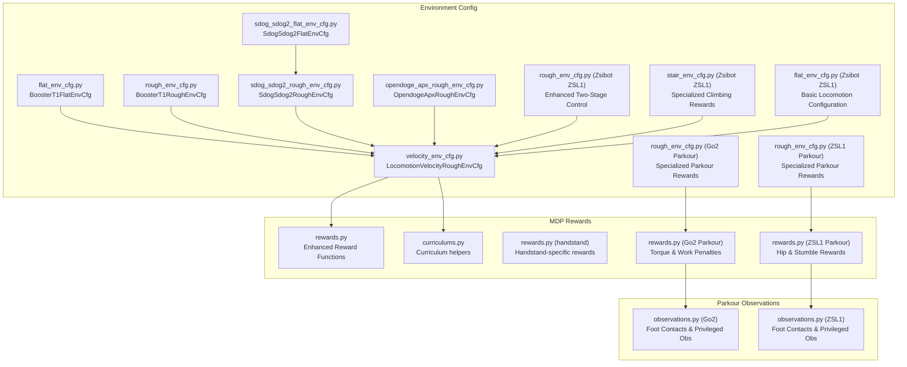
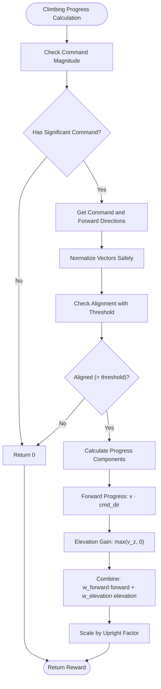
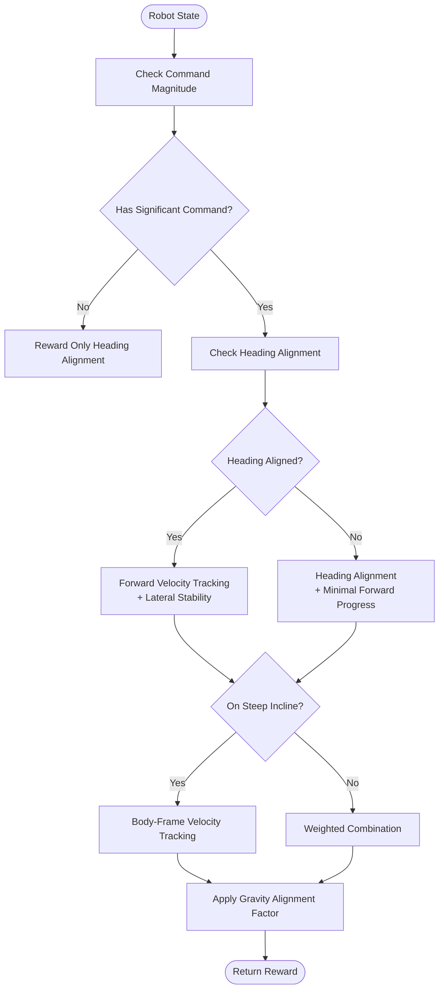
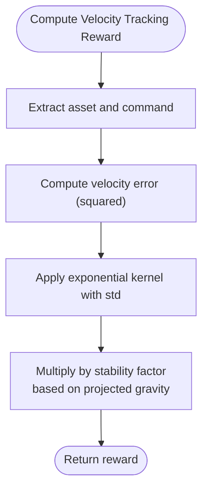
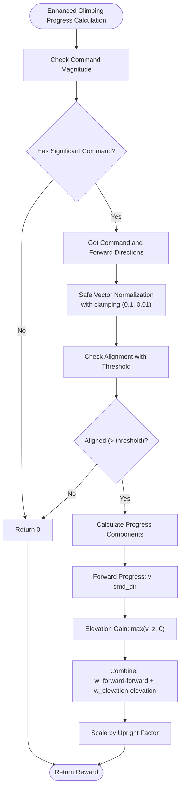
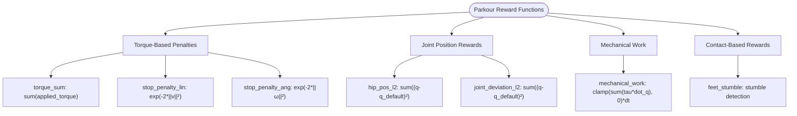
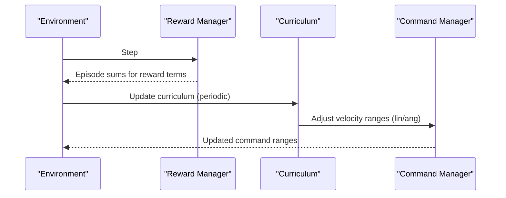
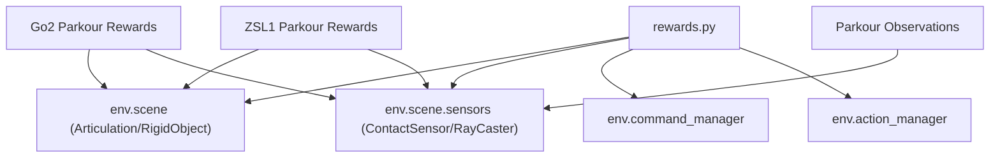

# Reward Functions and Shaping

<cite>
**Referenced Files in This Document**
- [rewards.py](file://source/robot_lab/robot_lab/tasks/manager_based/locomotion/velocity/mdp/rewards.py)
- [velocity_env_cfg.py](file://source/robot_lab/robot_lab/tasks/manager_based/locomotion/velocity/velocity_env_cfg.py)
- [flat_env_cfg.py](file://source/robot_lab/robot_lab/tasks/manager_based/locomotion/velocity/config/humanoid/booster_t1/flat_env_cfg.py)
- [rough_env_cfg.py](file://source/robot_lab/robot_lab/tasks/manager_based/locomotion/velocity/config/humanoid/booster_t1/rough_env_cfg.py)
- [sdog_sdog2_rough_env_cfg.py](file://source/robot_lab/robot_lab/tasks/manager_based/locomotion/velocity/config/quadruped/sdog_sdog2/rough_env_cfg.py)
- [sdog_sdog2_flat_env_cfg.py](file://source/robot_lab/robot_lab/tasks/manager_based/locomotion/velocity/config/quadruped/sdog_sdog2/flat_env_cfg.py)
- [opendoge_apx_rough_env_cfg.py](file://source/robot_lab/robot_lab/tasks/manager_based/locomotion/velocity/config/quadruped/opendoge_apx/rough_env_cfg.py)
- [curriculums.py](file://source/robot_lab/robot_lab/tasks/manager_based/locomotion/velocity/mdp/curriculums.py)
- [rewards.py (handstand)](file://source/robot_lab/robot_lab/tasks/manager_based/locomotion/velocity/config/others/unitree_a1_handstand/env/rewards.py)
- [rough_env_cfg.py (Zsibot ZSL1)](file://source/robot_lab/robot_lab/tasks/manager_based/locomotion/velocity/config/quadruped/zsibot_zsl1/rough_env_cfg.py)
- [stair_env_cfg.py (Zsibot ZSL1)](file://source/robot_lab/robot_lab/tasks/manager_based/locomotion/velocity/config/quadruped/zsibot_zsl1/stair_env_cfg.py)
- [flat_env_cfg.py (Zsibot ZSL1)](file://source/robot_lab/robot_lab/tasks/manager_based/locomotion/velocity/config/quadruped/zsibot_zsl1/flat_env_cfg.py)
- [rewards.py (Go2 Parkour)](file://source/robot_lab/robot_lab/tasks/manager_based/locomotion/velocity/config/quadruped/unitree_go2_parkour/mdp/rewards.py)
- [rewards.py (ZSL1 Parkour)](file://source/robot_lab/robot_lab/tasks/manager_based/locomotion/velocity/config/quadruped/zsibot_zsl1_parkour/mdp/rewards.py)
- [rough_env_cfg.py (Go2 Parkour)](file://source/robot_lab/robot_lab/tasks/manager_based/locomotion/velocity/config/quadruped/unitree_go2_parkour/rough_env_cfg.py)
- [rough_env_cfg.py (ZSL1 Parkour)](file://source/robot_lab/robot_lab/tasks/manager_based/locomotion/velocity/config/quadruped/zsibot_zsl1_parkour/rough_env_cfg.py)
- [observations.py (Go2 Parkour)](file://source/robot_lab/robot_lab/tasks/manager_based/locomotion/velocity/config/quadruped/unitree_go2_parkour/mdp/observations.py)
- [observations.py (ZSL1 Parkour)](file://source/robot_lab/robot_lab/tasks/manager_based/locomotion/velocity/config/quadruped/zsibot_zsl1_parkour/mdp/observations.py)
- [terrains_cfg.py (Go2 Parkour)](file://source/robot_lab/robot_lab/tasks/manager_based/locomotion/velocity/config/quadruped/unitree_go2_parkour/terrains_cfg.py)
- [terrains_cfg.py (ZSL1 Parkour)](file://source/robot_lab/robot_lab/tasks/manager_based/locomotion/velocity/config/quadruped/zsibot_zsl1_parkour/terrains_cfg.py)
</cite>

## Update Summary
**Changes Made**
- Enhanced documentation with comprehensive coverage of new Go2 and ZSL1 parkour reward systems
- Added detailed documentation for torque penalties, mechanical work calculations, and specialized parkour reward modules
- Documented new custom reward functions: torque_sum, stop_penalty_lin, stop_penalty_ang, hip_pos_l2, feet_stumble, joint_deviation_l2, mechanical_work
- Updated reward weighting strategies with parkour-specific configurations
- Added practical examples of parkour reward function tuning and terrain-specific reward combinations
- Expanded reward term activation/deactivation to include parkour-specific overrides

## Table of Contents
1. [Introduction](#introduction)
2. [Project Structure](#project-structure)
3. [Core Components](#core-components)
4. [Architecture Overview](#architecture-overview)
5. [Detailed Component Analysis](#detailed-component-analysis)
6. [Dependency Analysis](#dependency-analysis)
7. [Performance Considerations](#performance-considerations)
8. [Troubleshooting Guide](#troubleshooting-guide)
9. [Conclusion](#conclusion)
10. [Appendices](#appendices)

## Introduction
This document explains reward functions and shaping tailored for velocity-based locomotion tasks, with significant enhancements for Go2 and ZSL1 parkour training. It focuses on the RewardsCfg class and its reward terms, covering:
- Velocity tracking rewards (track_lin_vel_xy_exp, track_ang_vel_z_exp, track_lin_vel_xy_heading_aligned_exp)
- Stability penalties (lin_vel_z_l2, ang_vel_xy_l2, flat_orientation_l2)
- Joint penalties (joint_torques_l2, joint_vel_l2, joint_acc_l2)
- Contact-based rewards (feet_air_time, feet_contact, contact_forces)
- Penalties for joint limits, power consumption, and mirror/sync constraints
- **New** Torque-based penalties and mechanical work calculations for parkour-specific training
- **New** Specialized parkour reward modules providing comprehensive reward shaping for parkour behaviors
- Reward weighting strategies, curriculum-based reward scaling, and reward term activation/deactivation
- Practical examples of reward function tuning, common reward combinations, and their impact on learning behavior

**Updated** Enhanced documentation with comprehensive coverage of new Go2 and ZSL1 parkour reward systems, including torque penalties, mechanical work calculations, and specialized reward modules that provide comprehensive reward shaping for parkour-specific behaviors.

## Project Structure
The reward system is implemented as modular manager terms and configured via environment configurations. Key locations include both basic locomotion rewards and specialized parkour reward modules:
- Reward implementations: velocity/mode/rewards.py
- Base environment configuration: velocity/velocity_env_cfg.py
- Example overrides for flat terrain: config/humanoid/booster_t1/flat_env_cfg.py
- Example overrides for rough terrain: config/humanoid/booster_t1/rough_env_cfg.py
- Sdog-Sdog2 specific configurations: config/quadruped/sdog_sdog2/*
- Zsibot ZSL1 configurations using new reward: config/quadruped/zsibot_zsl1/*
- **New** Go2 parkour configurations: config/quadruped/unitree_go2_parkour/*
- **New** ZSL1 parkour configurations: config/quadruped/zsibot_zsl1_parkour/*
- Additional quadruped examples: config/quadruped/*/rough_env_cfg.py
- Curriculum utilities: velocity/mdp/curriculums.py
- Handstand-specific rewards: config/others/unitree_a1_handstand/env/rewards.py



**Diagram sources**
- [velocity_env_cfg.py:695-744](file://source/robot_lab/robot_lab/tasks/manager_based/locomotion/velocity/velocity_env_cfg.py#L695-L744)
- [flat_env_cfg.py:10-33](file://source/robot_lab/robot_lab/tasks/manager_based/locomotion/velocity/config/humanoid/booster_t1/flat_env_cfg.py#L10-L33)
- [rough_env_cfg.py:17-140](file://source/robot_lab/robot_lab/tasks/manager_based/locomotion/velocity/config/humanoid/booster_t1/rough_env_cfg.py#L17-L140)
- [sdog_sdog2_rough_env_cfg.py:14-179](file://source/robot_lab/robot_lab/tasks/manager_based/locomotion/velocity/config/quadruped/sdog_sdog2/rough_env_cfg.py#L14-L179)
- [sdog_sdog2_flat_env_cfg.py:11-32](file://source/robot_lab/robot_lab/tasks/manager_based/locomotion/velocity/config/quadruped/sdog_sdog2/flat_env_cfg.py#L11-L32)
- [opendoge_apx_rough_env_cfg.py:14-187](file://source/robot_lab/robot_lab/tasks/manager_based/locomotion/velocity/config/quadruped/opendoge_apx/rough_env_cfg.py#L14-L187)
- [rewards.py:1-807](file://source/robot_lab/robot_lab/tasks/manager_based/locomotion/velocity/mdp/rewards.py#L1-L807)
- [curriculums.py:1-60](file://source/robot_lab/robot_lab/tasks/manager_based/locomotion/velocity/mdp/curriculums.py#L1-L60)
- [rewards.py (handstand):1-58](file://source/robot_lab/robot_lab/tasks/manager_based/locomotion/velocity/config/others/unitree_a1_handstand/env/rewards.py#L1-L58)
- [rough_env_cfg.py (Zsibot ZSL1):123-129](file://source/robot_lab/robot_lab/tasks/manager_based/locomotion/velocity/config/quadruped/zsibot_zsl1/rough_env_cfg.py#L123-L129)
- [stair_env_cfg.py (Zsibot ZSL1):157-163](file://source/robot_lab/robot_lab/tasks/manager_based/locomotion/velocity/config/quadruped/zsibot_zsl1/stair_env_cfg.py#L157-L163)
- [flat_env_cfg.py (Zsibot ZSL1):1-30](file://source/robot_lab/robot_lab/tasks/manager_based/locomotion/velocity/config/quadruped/zsibot_zsl1/flat_env_cfg.py#L1-L30)
- [rewards.py (Go2 Parkour):1-131](file://source/robot_lab/robot_lab/tasks/manager_based/locomotion/velocity/config/quadruped/unitree_go2_parkour/mdp/rewards.py#L1-L131)
- [rewards.py (ZSL1 Parkour):1-131](file://source/robot_lab/robot_lab/tasks/manager_based/locomotion/velocity/config/quadruped/zsibot_zsl1_parkour/mdp/rewards.py#L1-L131)
- [rough_env_cfg.py (Go2 Parkour):407-422](file://source/robot_lab/robot_lab/tasks/manager_based/locomotion/velocity/config/quadruped/unitree_go2_parkour/rough_env_cfg.py#L407-L422)
- [rough_env_cfg.py (ZSL1 Parkour):415-430](file://source/robot_lab/robot_lab/tasks/manager_based/locomotion/velocity/config/quadruped/zsibot_zsl1_parkour/rough_env_cfg.py#L415-L430)

**Section sources**
- [velocity_env_cfg.py:695-744](file://source/robot_lab/robot_lab/tasks/manager_based/locomotion/velocity/velocity_env_cfg.py#L695-L744)

## Core Components
This section documents the RewardsCfg class and its reward terms. Each term is described by purpose, computation characteristics, and typical weight ranges observed in example configurations.

**Updated** Enhanced with comprehensive coverage of new Go2 and ZSL1 parkour reward systems, including torque penalties, mechanical work calculations, and specialized reward modules.

- **General Terms**
  - is_terminated: Terminal reward for episode termination.

- **Root Penalties**
  - lin_vel_z_l2: L2 penalty on vertical base linear velocity.
  - ang_vel_xy_l2: L2 penalty on roll/pitch base angular velocities.
  - flat_orientation_l2: L2 penalty on projected gravity's x/y components to encourage flat base orientation.
  - base_height_l2: L2 penalty on base height with optional terrain-adjusted target via ray-sensing.
  - body_lin_acc_l2: L2 penalty on base linear acceleration.

- **Joint Penalties**
  - joint_torques_l2: L2 penalty on joint torques.
  - joint_vel_l2: L2 penalty on joint velocities.
  - joint_acc_l2: L2 penalty on joint accelerations.
  - joint_pos_limits: Penalty for joint position limits violation.
  - joint_vel_limits: Penalty for joint velocity limits violation.
  - joint_power: Penalty/proxy for power consumption via torque·velocity product.
  - joint_pos_penalty: Deviation from default joint positions; scaled differently when command/velocity is low.
  - joint_mirror: Mirror constraint penalty across symmetric joints.
  - action_mirror: Mirror constraint penalty on absolute actions across symmetric joints.
  - action_sync: Encourage synchronized absolute actions within joint groups.

- **Action Penalties**
  - applied_torque_limits: Penalty for exceeding applied torque limits.
  - action_rate_l2: L2 penalty on action rate (change in actions).

- **Contact Sensor Terms**
  - undesired_contacts: Penalize undesired contacts as the number of violations above a threshold.
  - contact_forces: Contact force penalties.

- **Velocity Tracking Rewards**
  - track_lin_vel_xy_exp: Exponential reward for tracking commanded xy linear velocity; uses error in base frame and multiplies by a stability factor based on projected gravity.
  - track_ang_vel_z_exp: Exponential reward for tracking commanded z angular velocity; similar structure to linear tracking.
  - track_lin_vel_xy_heading_aligned_exp: Two-stage control strategy that prioritizes heading alignment before forward velocity tracking.

- **Climbing and Specialized Rewards**
  - heading_alignment: Reward for aligning robot heading with commanded velocity direction in xy plane.
  - climbing_progress: Enhanced reward for climbing combining forward progress and elevation gain when aligned with command.

- **Other Contact-Based Rewards**
  - feet_air_time: Sum of per-foot air-time above a threshold when command is non-zero.
  - feet_air_time_variance: Penalize variance in air/ground time across feet.
  - feet_gait: Quadruped gait enforcement via contact/air-time synchronization and anti-synchronization between foot pairs.
  - feet_contact: Binary penalty when contact count differs from expectation.
  - feet_contact_without_cmd: Encourage contact when command is near zero.
  - feet_stumble: Penalize conditions indicating vertical vs lateral force dominance at feet.
  - feet_slide: Penalize lateral foot velocity while in contact.
  - feet_height / feet_height_body: Encourage swing feet to clear a target height with velocity-aware weighting.
  - feet_distance_y_exp / feet_distance_xy_exp: Exponential shaping of foot placement relative to desired stance geometry.
  - upward: Encourage base orientation pointing upwards.

- **New Parkour-Specific Rewards**
  - **New** torque_sum: Sum of applied joint torques (not squared) for torque penalty.
  - **New** stop_penalty_lin: Exponential penalty on linear velocity magnitude to discourage stopping.
  - **New** stop_penalty_ang: Exponential penalty on angular velocity magnitude to discourage stopping.
  - **New** hip_pos_l2: L2 penalty on hip joint positions deviating from defaults.
  - **New** feet_stumble: Stumble detection penalizing horizontal force dominance over vertical.
  - **New** joint_deviation_l2: L2 penalty on all joint positions deviating from defaults.
  - **New** mechanical_work: Positive mechanical work calculation with regeneration clamping.

- **New Parkour-Specific Observations**
  - **New** foot_contacts: Binary foot contact flags from contact sensor.
  - **New** base_mass_obs: Base link mass after domain randomization.
  - **New** base_com_obs: Base link center-of-mass position after domain randomization.
  - **New** friction_coeff_obs: Mean static friction coefficient across all robot shapes.
  - **New** p_gain_scale_obs: Ratio of current P-gains to default P-gains.
  - **New** d_gain_scale_obs: Ratio of current D-gains to default D-gains.

Typical weight ranges observed in example environments:
- Velocity tracking: positive weights around 2–5
- Stability penalties: negative weights around −0.05 to −0.2
- Joint penalties: negative weights ranging from −1e-7 to −5e-5 depending on joint subset
- Action penalties: negative weights around −0.01 to −0.075
- Contact rewards/penalties: vary widely by task; e.g., feet_air_time often positive, feet_slide negative
- Upward/base_height: positive weights around 1.0
- **New** Climbing rewards: heading_alignment (0.0–2.0), climbing_progress (0.0–2.0)
- **New** Parkour rewards: torque_sum (0.0–0.1), stop_penalty_lin (0.0–0.1), stop_penalty_ang (0.0–0.1), hip_pos_l2 (−0.1 to −0.5), feet_stumble (−0.5 to −1.0), joint_deviation_l2 (−0.01 to −0.05), mechanical_work (−0.001 to −0.01)

Activation/deactivation:
- Zero-weight terms are disabled by environment configuration's disable_zero_weight_rewards method.
- **New** Parkour-specific reward overrides provide terrain-adapted configurations for rough and flat environments.

**Section sources**
- [velocity_env_cfg.py:375-744](file://source/robot_lab/robot_lab/tasks/manager_based/locomotion/velocity/velocity_env_cfg.py#L375-L744)
- [rewards.py:22-807](file://source/robot_lab/robot_lab/tasks/manager_based/locomotion/velocity/mdp/rewards.py#L22-L807)
- [rewards.py (Go2 Parkour):24-32](file://source/robot_lab/robot_lab/tasks/manager_based/locomotion/velocity/config/quadruped/unitree_go2_parkour/mdp/rewards.py#L24-L32)
- [rewards.py (ZSL1 Parkour):24-32](file://source/robot_lab/robot_lab/tasks/manager_based/locomotion/velocity/config/quadruped/zsibot_zsl1_parkour/mdp/rewards.py#L24-L32)

## Architecture Overview
The reward system is built around manager-based terms that are configured in RewardsCfg and executed during environment steps. The system now includes specialized parkour reward modules that provide comprehensive reward shaping for parkour-specific behaviors, going far beyond the basic reward system.

```mermaid
graph TB
Env["ManagerBasedRLEnv"]
RM["Reward Manager"]
Term["RewardsCfg Terms"]
Impl["rewards.py Functions"]
Cur["Curriculum Helpers"]
G2Rew["Go2 Parkour Rewards"]
ZSL1Rew["ZSL1 Parkour Rewards"]
Obs["Parkour Observations"]
end
```

**Diagram sources**
- [velocity_env_cfg.py:695-744](file://source/robot_lab/robot_lab/tasks/manager_based/locomotion/velocity/velocity_env_cfg.py#L695-L744)
- [rewards.py:1-807](file://source/robot_lab/robot_lab/tasks/manager_based/locomotion/velocity/mdp/rewards.py#L1-L807)
- [curriculums.py:1-60](file://source/robot_lab/robot_lab/tasks/manager_based/locomotion/velocity/mdp/curriculums.py#L1-L60)
- [rewards.py (Go2 Parkour):1-131](file://source/robot_lab/robot_lab/tasks/manager_based/locomotion/velocity/config/quadruped/unitree_go2_parkour/mdp/rewards.py#L1-L131)
- [rewards.py (ZSL1 Parkour):1-131](file://source/robot_lab/robot_lab/tasks/manager_based/locomotion/velocity/config/quadruped/zsibot_zsl1_parkour/mdp/rewards.py#L1-L131)

## Detailed Component Analysis

### Enhanced Climbing Progress Reward Function

**Updated** The climbing_progress reward function has been significantly enhanced with improved mathematical precision, clearer variable naming, and enhanced numerical stability.

#### Mathematical Improvements

The enhanced climbing_progress function now features:

1. **Improved Numerical Stability**: Better handling of edge cases with safe division operations and proper clamping
2. **Enhanced Variable Naming**: More descriptive variable names for better readability and maintainability
3. **Robust Edge Case Handling**: Proper handling of zero-magnitude commands and near-zero vectors
4. **Optimized Computational Flow**: Streamlined calculations for better performance

#### Enhanced Implementation Details



**Diagram sources**
- [rewards.py:670-732](file://source/robot_lab/robot_lab/tasks/manager_based/locomotion/velocity/mdp/rewards.py#L670-L732)

#### Key Enhancements

1. **Safe Vector Operations**: All vector normalization operations now use `cmd_vel_norm_safe` and `forward_xy_norm_safe` to prevent division by zero
2. **Improved Clamping**: Better handling of edge cases with minimum thresholds (0.1 for command velocity, 0.01 for forward direction)
3. **Clearer Logic Flow**: Enhanced readability with descriptive variable names and logical separation of concerns
4. **Robust Parameter Handling**: Improved parameter validation and default value handling

**Section sources**
- [rewards.py:670-732](file://source/robot_lab/robot_lab/tasks/manager_based/locomotion/velocity/mdp/rewards.py#L670-L732)

### Heading-Aligned Velocity Tracking with Two-Stage Control Strategy

**Updated** New reward function that implements a sophisticated two-stage control strategy for improved locomotion stability.

The `track_lin_vel_xy_heading_aligned_exp` function introduces a two-stage control strategy that prioritizes heading alignment before forward velocity tracking:

#### Two-Stage Control Implementation

**Stage 1: Heading Alignment (Misaligned)**
- When heading error > threshold: Focus on aligning robot with target direction
- Rewards: heading_error reduction and yaw velocity alignment
- Allows minimal forward progress while correcting orientation

**Stage 2: Forward Velocity Tracking (Aligned)**
- When heading error ≤ threshold: Focus on achieving commanded forward speed
- Rewards: forward velocity tracking with lateral stability penalty
- Maintains stability while maximizing forward progress

#### Key Features

1. **Heading Target Access**: Requires `heading_command=True` in CommandCfg to access `heading_target`
2. **Fallback Mechanism**: Derives target heading from xy command direction when heading_target unavailable
3. **Incline Terrain Handling**: Automatically falls back to standard body-frame tracking on steep inclines
4. **Gravity Alignment Factor**: Applies stability factor based on projected gravity for natural movement

#### Mathematical Implementation



**Diagram sources**
- [rewards.py:683-790](file://source/robot_lab/robot_lab/tasks/manager_based/locomotion/velocity/mdp/rewards.py#L683-L790)

#### Configuration Examples

**Zsibot ZSL1 Rough Terrain Configuration**:
- Uses `track_lin_vel_xy_heading_aligned_exp` with weight 4.0
- Heading threshold: 0.3 radians (≈17.2°)
- Prevents rear-facing locomotion on complex terrain
- Enables full 360° heading sampling for comprehensive learning

**Zsibot ZSL1 Stair Configuration**:
- Same two-stage approach optimized for incline navigation
- Automatic fallback to body-frame tracking on steep inclines
- Reduced upward weight (0.3) to allow controlled body tilt during leg lifting

**Section sources**
- [rewards.py:683-790](file://source/robot_lab/robot_lab/tasks/manager_based/locomotion/velocity/mdp/rewards.py#L683-L790)
- [rough_env_cfg.py (Zsibot ZSL1):123-129](file://source/robot_lab/robot_lab/tasks/manager_based/locomotion/velocity/config/quadruped/zsibot_zsl1/rough_env_cfg.py#L123-L129)
- [stair_env_cfg.py (Zsibot ZSL1):157-163](file://source/robot_lab/robot_lab/tasks/manager_based/locomotion/velocity/config/quadruped/zsibot_zsl1/stair_env_cfg.py#L157-L163)

### Velocity Tracking Rewards
- track_lin_vel_xy_exp
  - Purpose: Exponentially reward tracking of xy linear velocity commands in the base frame.
  - Implementation highlights: Computes squared error between commanded and measured xy base linear velocities, applies exponential kernel with std, and multiplies by a stability factor derived from projected gravity.
  - Weight increased to 5.0 for Sdog-Sdog2 climbing performance.
  - Typical usage: Positive weight; std controls reward sensitivity; often paired with a stability multiplier to avoid rewarding unstable motions.
  - Weight range: Observed around 2–5 in examples.

- track_ang_vel_z_exp
  - Purpose: Exponentially reward tracking of z angular velocity commands.
  - Implementation highlights: Similar to linear tracking but for yaw angular velocity; includes the same stability factor.
  - Weight increased to 2.5 for Sdog-Sdog2 climbing performance.
  - Weight range: Observed around 1–3 in examples.

- track_lin_vel_xy_heading_aligned_exp
  - Purpose: Two-stage control strategy that prioritizes heading alignment before forward velocity tracking.
  - Implementation highlights: Implements sophisticated two-stage behavior with heading threshold control, automatic incline detection, and gravity alignment factor.
  - Weight typically 4.0; heading threshold 0.3 radians; requires `heading_command=True`.
  - Typical usage: Complex terrain navigation, stair climbing, and scenarios requiring precise direction control.

- Alternative frames
  - track_lin_vel_xy_yaw_frame_exp: Uses a gravity-aligned body frame for velocity measurement.
  - track_ang_vel_z_world_exp: Uses world-frame angular velocity measurement.



**Diagram sources**
- [rewards.py:22-48](file://source/robot_lab/robot_lab/tasks/manager_based/locomotion/velocity/mdp/rewards.py#L22-L48)

**Section sources**
- [rewards.py:22-75](file://source/robot_lab/robot_lab/tasks/manager_based/locomotion/velocity/mdp/rewards.py#L22-L75)
- [rewards.py:683-790](file://source/robot_lab/robot_lab/tasks/manager_based/locomotion/velocity/mdp/rewards.py#L683-L790)

### Stability Penalties
- lin_vel_z_l2
  - Purpose: Penalize vertical base linear velocity to suppress bounce and hover.
  - Weight increased to -2.0 for Sdog-Sdog2 climbing stability.
  - Weight range: Negative weights around −0.2 to −2.0 in examples.

- ang_vel_xy_l2
  - Purpose: Penalize roll/pitch base angular velocities to stabilize orientation.
  - Weight set to -0.05 for Sdog-Sdog2 climbing stability.
  - Weight range: Negative weights around −0.05 to −0.1 in examples.

- flat_orientation_l2
  - Purpose: Penalize deviations of projected gravity's x/y components to maintain flat base orientation.
  - Weight disabled (0) for Sdog-Sdog2 climbing ladder performance where orientation flexibility is needed.
  - Weight range: Negative weights around −0.1 to −0.2 in examples.


**Diagram sources**
- [rewards.py:640-680](file://source/robot_lab/robot_lab/tasks/manager_based/locomotion/velocity/mdp/rewards.py#L640-L680)

**Section sources**
- [rewards.py:640-680](file://source/robot_lab/robot_lab/tasks/manager_based/locomotion/velocity/mdp/rewards.py#L640-L680)

### Joint Penalties and Constraints
- joint_torques_l2 / joint_vel_l2 / joint_acc_l2
  - Purpose: Penalize excessive torques, velocities, or accelerations to improve energy efficiency and safety.
  - joint_vel_l2 disabled (weight = 0) for Sdog-Sdog2 climbing performance.
  - Weight range: Negative weights from −1e-7 to −5e-5; often subsetted to major joints (hips, knees).

- joint_pos_limits / joint_vel_limits
  - Purpose: Penalize violations of joint position/velocity limits.
  - joint_vel_limits disabled (weight = 0) for Sdog-Sdog2 climbing performance.
  - Weight range: Negative weights around −5.0 in examples.

- joint_power
  - Purpose: Encourage reduced power consumption via torque·velocity product.
  - joint_power set to -2e-5 with mirror constraints disabled.
  - Weight range: Negative weights around −2e-5 in examples.

- joint_pos_penalty
  - Purpose: Deviation from default joint positions; scaled differently when command/velocity is low.
  - Weight range: Negative weights around −1.0 in examples.

- Mirror and Sync Constraints
  - joint_mirror disabled (weight = -0.05) for Sdog-Sdog2 climbing performance.
  - joint_mirror: Enforce symmetry across mirrored joint pairs.
  - action_mirror: Enforce symmetry on absolute actions across mirrored pairs.
  - action_sync: Encourage synchronized absolute actions within joint groups.
  - Weight range: Negative weights around −0.05 to −0.1 in examples.


**Diagram sources**
- [rewards.py:255-333](file://source/robot_lab/robot_lab/tasks/manager_based/locomotion/velocity/mdp/rewards.py#L255-L333)

**Section sources**
- [rewards.py:78-126](file://source/robot_lab/robot_lab/tasks/manager_based/locomotion/velocity/mdp/rewards.py#L78-L126)
- [rewards.py:255-333](file://source/robot_lab/robot_lab/tasks/manager_based/locomotion/velocity/mdp/rewards.py#L255-L333)

### Contact-Based Rewards
- feet_air_time
  - Purpose: Encourage steps by rewarding cumulative air-time above a threshold when command is non-zero.
  - Weight set to 0.1 for Sdog-Sdog2 climbing performance.
  - Weight range: Positive weights around 0.1–2.0 in examples.

- feet_air_time_variance
  - Purpose: Penalize variance in air/ground time across feet to promote even gait.
  - Weight set to -1.0 for Sdog-Sdog2 climbing performance.
  - Weight range: Negative weights around −1.0 in examples.

- feet_contact / feet_contact_without_cmd
  - Purpose: Encourage expected contact counts under command or contact when no command.
  - feet_contact disabled (weight = 0) for Sdog-Sdog2 climbing performance.
  - Weight range: Varies; often near zero or small positive/negative in examples.

- feet_stumble / feet_slide
  - Purpose: Penalize conditions indicating vertical vs lateral force dominance or lateral sliding.
  - feet_stumble disabled (weight = 0) for Sdog-Sdog2 climbing performance.
  - Weight range: Negative weights around −0.1 to −0.4 in examples.

- feet_height / feet_height_body
  - Purpose: Encourage swing feet to clear a target height with velocity-aware weighting.
  - feet_height disabled (weight = 0) for Sdog-Sdog2 climbing performance.
  - Weight range: Negative weights around −5.0 in examples.

- feet_gait
  - Purpose: Quadruped gait enforcement via contact/air-time synchronization and anti-synchronization between foot pairs.
  - Weight set to 0.5 for Sdog-Sdog2 climbing performance.
  - Weight range: Positive weights around 0.5 in examples.

- contact_forces / undesired_contacts
  - Purpose: Penalize excessive or undesired contact forces.
  - contact_forces set to -1.5e-4 for Sdog-Sdog2 climbing performance.
  - Weight range: Negative weights around −1e-4 to −1.0 in examples.


**Diagram sources**
- [rewards.py:336-583](file://source/robot_lab/robot_lab/tasks/manager_based/locomotion/velocity/mdp/rewards.py#L336-L583)

**Section sources**
- [rewards.py:336-583](file://source/robot_lab/robot_lab/tasks/manager_based/locomotion/velocity/mdp/rewards.py#L336-L583)

### Enhanced Climbing and Specialized Rewards

**Updated** New climbing-specific reward functions designed for stair climbing and incline navigation, featuring enhanced mathematical precision and numerical stability.

#### Heading Alignment Reward
- heading_alignment
  - Purpose: Reward for aligning robot heading with commanded velocity direction in xy plane.
  - Implementation highlights: Computes dot product between command direction and robot forward direction, applies exponential kernel with std parameter.
  - Typical usage: Phase 1 of two-stage climbing control; encourages proper orientation before movement.
  - Weight range: 0.0–2.0 in examples.

#### Enhanced Climbing Progress Reward
- climbing_progress
  - Purpose: Enhanced reward for climbing combining forward progress and elevation gain when aligned with command.
  - Implementation highlights: Only active when robot is reasonably aligned with command direction; combines forward velocity projection and positive z velocity with improved numerical stability.
  - Enhanced features: Safe vector operations, robust edge case handling, improved computational flow.
  - Typical usage: Phase 2 of two-stage climbing control; rewards actual climbing behavior.
  - Weight range: 0.0–2.0 in examples.

#### Mathematical Implementation Details



**Diagram sources**
- [rewards.py:670-732](file://source/robot_lab/robot_lab/tasks/manager_based/locomotion/velocity/mdp/rewards.py#L670-L732)

**Section sources**
- [rewards.py:616-732](file://source/robot_lab/robot_lab/tasks/manager_based/locomotion/velocity/mdp/rewards.py#L616-L732)

### New Parkour-Specific Reward Functions

**Updated** Comprehensive set of new reward functions specifically designed for Go2 and ZSL1 parkour training, providing torque penalties, mechanical work calculations, and specialized reward modules.

#### Torque-Based Penalties
- **New** torque_sum
  - Purpose: Sum of applied joint torques (not squared) for torque penalty.
  - Implementation highlights: Sums all joint torques applied to the robot; returns shape (num_envs,).
  - Typical usage: Penalize excessive torque usage; weight typically 0.0–0.1.
  - Weight range: 0.0–0.1 in parkour configurations.

- **New** stop_penalty_lin
  - Purpose: Exponential penalty on linear velocity magnitude to discourage stopping.
  - Implementation highlights: Returns exp(-2.0 * ||lin_vel_xy||^2); penalizes being stopped.
  - Typical usage: Encourage continuous motion; weight typically 0.0–0.1.
  - Weight range: 0.0–0.1 in parkour configurations.

- **New** stop_penalty_ang
  - Purpose: Exponential penalty on angular velocity magnitude to discourage stopping.
  - Implementation highlights: Returns exp(-2.0 * ||ang_vel_xy||^2); penalizes being stopped.
  - Typical usage: Encourage continuous rotation; weight typically 0.0–0.1.
  - Weight range: 0.0–0.1 in parkour configurations.

#### Joint Position and Movement Rewards
- **New** hip_pos_l2
  - Purpose: L2 penalty on hip joint positions deviating from defaults.
  - Implementation highlights: Penalizes deviation from default hip positions; uses joint_names pattern matching.
  - Typical usage: Maintain anatomically correct hip positioning; weight typically −0.1 to −0.5.
  - Weight range: −0.1 to −0.5 in parkour configurations.

- **New** joint_deviation_l2
  - Purpose: L2 penalty on all joint positions deviating from defaults.
  - Implementation highlights: Uses squared (L2) kernel unlike base mdp's joint_deviation_l1.
  - Typical usage: Encourage default joint positions; weight typically −0.01 to −0.05.
  - Weight range: −0.01 to −0.05 in parkour configurations.

#### Mechanical Work Calculations
- **New** mechanical_work
  - Purpose: Positive mechanical work calculation with regeneration clamping.
  - Implementation highlights: Computes sum(torque * joint_vel), clamps to non-negative, scales by step_dt.
  - Typical usage: Penalize negative work (energy regeneration); weight typically −0.001 to −0.01.
  - Weight range: −0.001 to −0.01 in parkour configurations.

#### Contact-Based Parkour Rewards
- **New** feet_stumble
  - Purpose: Stumble detection penalizing horizontal force dominance over vertical.
  - Implementation highlights: Returns 1.0 if any foot has ||horizontal_force|| > ratio * |vertical_force|, 0.0 otherwise.
  - Typical usage: Penalize unstable foot placements; weight typically −0.5 to −1.0.
  - Weight range: −0.5 to −1.0 in parkour configurations.

#### Mathematical Implementation Details



**Diagram sources**
- [rewards.py (Go2 Parkour):35-131](file://source/robot_lab/robot_lab/tasks/manager_based/locomotion/velocity/config/quadruped/unitree_go2_parkour/mdp/rewards.py#L35-L131)
- [rewards.py (ZSL1 Parkour):35-131](file://source/robot_lab/robot_lab/tasks/manager_based/locomotion/velocity/config/quadruped/zsibot_zsl1_parkour/mdp/rewards.py#L35-L131)

**Section sources**
- [rewards.py (Go2 Parkour):24-32](file://source/robot_lab/robot_lab/tasks/manager_based/locomotion/velocity/config/quadruped/unitree_go2_parkour/mdp/rewards.py#L24-L32)
- [rewards.py (ZSL1 Parkour):24-32](file://source/robot_lab/robot_lab/tasks/manager_based/locomotion/velocity/config/quadruped/zsibot_zsl1_parkour/mdp/rewards.py#L24-L32)
- [rewards.py (Go2 Parkour):35-131](file://source/robot_lab/robot_lab/tasks/manager_based/locomotion/velocity/config/quadruped/unitree_go2_parkour/mdp/rewards.py#L35-L131)
- [rewards.py (ZSL1 Parkour):35-131](file://source/robot_lab/robot_lab/tasks/manager_based/locomotion/velocity/config/quadruped/zsibot_zsl1_parkour/mdp/rewards.py#L35-L131)

### Parkour-Specific Observation Functions

**Updated** New observation functions that provide privileged information for parkour training, including foot contacts and robot properties.

#### Foot Contact Observations
- **New** foot_contacts
  - Purpose: Binary foot contact flags from contact sensor.
  - Implementation highlights: Returns 1.0 for each foot body where net contact force norm exceeds threshold, 0.0 otherwise.
  - Typical usage: Provide contact information to policy/critic networks.
  - Weight range: Not applicable (observation function).

#### Robot Properties Observations
- **New** base_mass_obs
  - Purpose: Base link mass after domain randomization.
  - Implementation highlights: Returns base link mass shape (num_envs, 1).
  - Typical usage: Privileged observation for mass variations.

- **New** base_com_obs
  - Purpose: Base link center-of-mass position after domain randomization.
  - Implementation highlights: Returns base link COM position shape (num_envs, 3).
  - Typical usage: Privileged observation for COM variations.

- **New** friction_coeff_obs
  - Purpose: Mean static friction coefficient across all robot shapes.
  - Implementation highlights: Returns mean static friction coefficient shape (num_envs, 1).
  - Typical usage: Privileged observation for friction variations.

- **New** p_gain_scale_obs / d_gain_scale_obs
  - Purpose: Ratios of current P/D-gains to default gains.
  - Implementation highlights: Returns scaling ratios shape (num_envs, num_joints).
  - Typical usage: Privileged observation for PD-gain variations.

**Section sources**
- [observations.py (Go2 Parkour):23-30](file://source/robot_lab/robot_lab/tasks/manager_based/locomotion/velocity/config/quadruped/unitree_go2_parkour/mdp/observations.py#L23-L30)
- [observations.py (ZSL1 Parkour):23-30](file://source/robot_lab/robot_lab/tasks/manager_based/locomotion/velocity/config/quadruped/zsibot_zsl1_parkour/mdp/observations.py#L23-L30)
- [observations.py (Go2 Parkour):33-111](file://source/robot_lab/robot_lab/tasks/manager_based/locomotion/velocity/config/quadruped/unitree_go2_parkour/mdp/observations.py#L33-L111)
- [observations.py (ZSL1 Parkour):33-111](file://source/robot_lab/robot_lab/tasks/manager_based/locomotion/velocity/config/quadruped/zsibot_zsl1_parkour/mdp/observations.py#L33-L111)

### Parkour Terrain Configurations

**Updated** Custom terrain configurations designed specifically for parkour training, providing diverse and challenging environments.

#### Common Terrain Elements
- **New** MeshGapStripTerrainCfg: Repeated gap-and-landing strip along +X with configurable gap widths and landing lengths.
- **New** MeshHurdleStripTerrainCfg: Repeated hurdle strip with configurable hurdle heights, thickness, and gaps.
- **New** MeshStairsStripTerrainCfg: Repeated up/down stair segments with configurable step heights and patterns.
- **New** MeshParkourStepTerrainCfg: Parkour-style staircase that rises then descends with configurable step dimensions.
- **New** MeshDebrisTerrainCfg: Debris field with mixed boxes and cylinders for obstacle negotiation.

#### Terrain Configuration Parameters
- **New** Gap strips: gap_width_range, landing_length, start_platform_length
- **New** Hurdles: hurdle_height_range, hurdle_thickness, hurdle_gap_range, start_platform_length
- **New** Stairs: start_platform_length, segment_length, step_height_range, steps_per_segment, pattern
- **New** Parkour steps: start_platform_length, step_height_range, step_length_base_range, steps
- **New** Debris fields: num_debris_min, num_debris_max, ground_thickness, box dimensions, cylinder dimensions

**Section sources**
- [terrains_cfg.py (Go2 Parkour):145-208](file://source/robot_lab/robot_lab/tasks/manager_based/locomotion/velocity/config/quadruped/unitree_go2_parkour/terrains_cfg.py#L145-L208)
- [terrains_cfg.py (ZSL1 Parkour):145-208](file://source/robot_lab/robot_lab/tasks/manager_based/locomotion/velocity/config/quadruped/zsibot_zsl1_parkour/terrains_cfg.py#L145-L208)

### Curriculum-Based Reward Scaling
- command_levels_lin_vel / command_levels_ang_vel
  - Purpose: Dynamically expand command ranges based on tracking reward performance.
  - Mechanism: Adjusts velocity ranges when average episode reward exceeds a threshold; updates ranges gradually and clamped to initial/final bounds.
  - Both curriculum terms disabled for Sdog-Sdog2 climbing performance.
  - Usage: Enabled in curriculum; parameters include reward term name and range multiplier.



**Diagram sources**
- [curriculums.py:20-60](file://source/robot_lab/robot_lab/tasks/manager_based/locomotion/velocity/mdp/curriculums.py#L20-L60)
- [velocity_env_cfg.py:668-687](file://source/robot_lab/robot_lab/tasks/manager_based/locomotion/velocity/velocity_env_cfg.py#L668-L687)

**Section sources**
- [curriculums.py:20-60](file://source/robot_lab/robot_lab/tasks/manager_based/locomotion/velocity/mdp/curriculums.py#L20-L60)
- [velocity_env_cfg.py:668-687](file://source/robot_lab/robot_lab/tasks/manager_based/locomotion/velocity/velocity_env_cfg.py#L668-L687)

### Reward Term Activation/Deactivation
- Zero-weight terms are disabled via disable_zero_weight_rewards, which sets the term to None if its weight is zero.
- Sdog-Sdog2 configuration demonstrates selective disabling of stability and contact terms for climbing performance.
- **New** Parkour-specific reward overrides provide terrain-adapted configurations with selective term activation.
- Example overrides demonstrate enabling/disabling specific terms in flat/rough environments.

**Section sources**
- [velocity_env_cfg.py:737-744](file://source/robot_lab/robot_lab/tasks/manager_based/locomotion/velocity/velocity_env_cfg.py#L737-L744)
- [flat_env_cfg.py:28-32](file://source/robot_lab/robot_lab/tasks/manager_based/locomotion/velocity/config/humanoid/booster_t1/flat_env_cfg.py#L28-L32)
- [rough_env_cfg.py:56-125](file://source/robot_lab/robot_lab/tasks/manager_based/locomotion/velocity/config/humanoid/booster_t1/rough_env_cfg.py#L56-L125)
- [sdog_sdog2_rough_env_cfg.py:147-149](file://source/robot_lab/robot_lab/tasks/manager_based/locomotion/velocity/config/quadruped/sdog_sdog2/rough_env_cfg.py#L147-L149)
- [rough_env_cfg.py (Go2 Parkour):492-502](file://source/robot_lab/robot_lab/tasks/manager_based/locomotion/velocity/config/quadruped/unitree_go2_parkour/rough_env_cfg.py#L492-L502)
- [rough_env_cfg.py (ZSL1 Parkour):515-525](file://source/robot_lab/robot_lab/tasks/manager_based/locomotion/velocity/config/quadruped/zsibot_zsl1_parkour/rough_env_cfg.py#L515-L525)

### Practical Examples and Combinations

#### Humanoid (Booster T1)
- Flat terrain: Emphasize stability penalties (e.g., lin_vel_z_l2), reduce terrain-dependent terms.
- Rough terrain: Increase tracking rewards (e.g., track_lin_vel_xy_exp, track_ang_vel_z_exp), add gait and contact terms.
- Example weights: track_lin_vel_xy_exp ≈ 4.5, track_ang_vel_z_exp ≈ 2.5, lin_vel_z_l2 ≈ −0.2, ang_vel_xy_l2 ≈ −0.1, flat_orientation_l2 ≈ −0.2, joint_torques_l2 ≈ −3e-7, joint_acc_l2 ≈ −1.25e-7, action_rate_l2 ≈ −0.075, feet_air_time ≈ 2.0, feet_slide ≈ −0.4, upward ≈ 1.0.

#### Quadrupeds (Sdog Sdog2, Opendoge APX)
- Sdog-Sdog2 climbing ladder configuration emphasizes stability and power efficiency:
  - Base height target: 0.33m (increased from 0.25m)
  - Track linear velocity: 5.0 (increased from 3.0)
  - Track angular velocity: 2.5 (increased from 1.5)
  - Stability: lin_vel_z_l2 (-2.0), ang_vel_xy_l2 (-0.05), flat_orientation_l2 (disabled)
  - Power: joint_power (-2e-5), joint_vel_l2 (disabled), joint_vel_limits (disabled)
  - Motion: stand_still (-2.0), joint_mirror (disabled)
  - Contact: feet_air_time (0.1), feet_air_time_variance (-1.0), feet_contact (disabled)
  - Gait: feet_gait (0.5), upward (1.0)
  - Emphasize joint smoothing (joint_acc_l2), joint limits (joint_pos_limits), power (joint_power), mirror constraints (joint_mirror), and gait enforcement (feet_gait).
  - Example weights: joint_torques_l2 ≈ −2.5e-5, joint_acc_l2 ≈ −2.5e-7, joint_pos_limits ≈ −5.0, joint_power ≈ −2e-5, joint_mirror ≈ −0.05, action_rate_l2 ≈ −0.01, feet_air_time ≈ 0.1–0.15, feet_height_body ≈ −5.0, feet_gait ≈ 0.5.

#### **New** Go2 Parkour Training Configuration
- **New** Comprehensive parkour reward system with torque penalties and mechanical work calculations.
- **New** Torque-based penalties: torque_sum (0.0), stop_penalty_lin (0.0), stop_penalty_ang (0.0)
- **New** Joint positioning: hip_pos_l2 (−0.5), joint_deviation_l2 (−0.05)
- **New** Contact-based: feet_stumble (−1.0)
- **New** Mechanical work: work (−0.01)
- **New** Terrain adaptation: rough terrain overrides with different weight configurations.
- **New** Observation integration: foot_contacts, base_mass_obs, base_com_obs, friction_coeff_obs, p_gain_scale_obs, d_gain_scale_obs.

#### **New** ZSL1 Parkour Training Configuration
- **New** Similar parkour reward system adapted for ZSL1 robot configuration.
- **New** Joint naming adaptation: uses ".*_ABAD_JOINT" instead of ".*_hip_joint".
- **New** Foot link naming: ".*_FOOT_LINK" instead of ".*_foot".
- **New** Terrain adaptation: rough terrain overrides with different weight configurations.
- **New** Height scanner base: additional height_scanner_base sensor for improved terrain perception.

#### **New** Parkour Terrain Examples
- **New** Gap strips: 0.1–0.8m gap widths, 0.45m landing lengths, 3.0m start platforms.
- **New** Hurdle strips: 0.05–0.3m hurdle heights, 0.2m thickness, 0.7–2.0m gaps.
- **New** Stair strips: 0.05–0.23m step heights, 5.0m segment lengths, alternating up/down patterns.
- **New** Parkour steps: 0.1–0.45m step heights, 0.3–1.5m base lengths, 6 total steps.
- **New** Debris fields: 20–40 debris primitives, 0.05–0.25m box thickness, 0.05–0.2 radius cylinders.

#### **New** Parkour Reward Weighting Strategies
- **New** Torque penalties: Start with 0.0 weight, gradually increase to 0.05–0.1 for aggressive torque limiting.
- **New** Motion encouragement: stop_penalty_lin and stop_penalty_ang start at 0.0, increase to 0.05–0.1 for continuous movement.
- **New** Posture maintenance: hip_pos_l2 and joint_deviation_l2 start at −0.1, increase to −0.3–−0.5 for strict posture control.
- **New** Safety: feet_stumble starts at −0.5, can go up to −1.0 for aggressive stumble prevention.
- **New** Energy efficiency: mechanical_work starts at −0.001, increase to −0.01 for strong energy conservation.

#### **New** Parkour Learning Impact
- **New** Torque penalties improve energy efficiency and prevent excessive motor usage.
- **New** Stop penalties encourage continuous locomotion and reduce hesitation.
- **New** Hip positioning rewards maintain anatomically correct postures during parkour.
- **New** Mechanical work calculations provide explicit energy consumption feedback.
- **New** Stumble detection prevents unsafe landing patterns and reduces injury risk.
- **New** Terrain-specific reward overrides enable adaptive learning across different environments.
- **New** Observation integration provides comprehensive state information for policy decisions.

**Section sources**
- [rough_env_cfg.py:51-125](file://source/robot_lab/robot_lab/tasks/manager_based/locomotion/velocity/config/humanoid/booster_t1/rough_env_cfg.py#L51-L125)
- [flat_env_cfg.py:27-32](file://source/robot_lab/robot_lab/tasks/manager_based/locomotion/velocity/config/humanoid/booster_t1/flat_env_cfg.py#L27-L32)
- [sdog_sdog2_rough_env_cfg.py:89-160](file://source/robot_lab/robot_lab/tasks/manager_based/locomotion/velocity/config/quadruped/sdog_sdog2/rough_env_cfg.py#L89-L160)
- [opendoge_apx_rough_env_cfg.py:101-171](file://source/robot_lab/robot_lab/tasks/manager_based/locomotion/velocity/config/quadruped/opendoge_apx/rough_env_cfg.py#L101-L171)
- [rewards.py (handstand):17-58](file://source/robot_lab/robot_lab/tasks/manager_based/locomotion/velocity/config/others/unitree_a1_handstand/env/rewards.py#L17-L58)
- [rewards.py:683-790](file://source/robot_lab/robot_lab/tasks/manager_based/locomotion/velocity/mdp/rewards.py#L683-L790)
- [rough_env_cfg.py (Zsibot ZSL1):123-129](file://source/robot_lab/robot_lab/tasks/manager_based/locomotion/velocity/config/quadruped/zsibot_zsl1/rough_env_cfg.py#L123-L129)
- [stair_env_cfg.py (Zsibot ZSL1):157-163](file://source/robot_lab/robot_lab/tasks/manager_based/locomotion/velocity/config/quadruped/zsibot_zsl1/stair_env_cfg.py#L157-L163)
- [flat_env_cfg.py (Zsibot ZSL1):1-30](file://source/robot_lab/robot_lab/tasks/manager_based/locomotion/velocity/config/quadruped/zsibot_zsl1/flat_env_cfg.py#L1-L30)
- [rewards.py (Go2 Parkour):407-422](file://source/robot_lab/robot_lab/tasks/manager_based/locomotion/velocity/config/quadruped/unitree_go2_parkour/rough_env_cfg.py#L407-L422)
- [rewards.py (ZSL1 Parkour):415-430](file://source/robot_lab/robot_lab/tasks/manager_based/locomotion/velocity/config/quadruped/zsibot_zsl1_parkour/rough_env_cfg.py#L415-L430)
- [terrains_cfg.py (Go2 Parkour):145-208](file://source/robot_lab/robot_lab/tasks/manager_based/locomotion/velocity/config/quadruped/unitree_go2_parkour/terrains_cfg.py#L145-L208)
- [terrains_cfg.py (ZSL1 Parkour):145-208](file://source/robot_lab/robot_lab/tasks/manager_based/locomotion/velocity/config/quadruped/zsibot_zsl1_parkour/terrains_cfg.py#L145-L208)

## Dependency Analysis
- Rewards depend on:
  - Scene entities (robot, sensors) accessed via env.scene and env.scene.sensors.
  - Command manager for velocity commands.
  - Action manager for action-related constraints.
  - Math utilities for transformations (e.g., quat_apply, quat_conjugate).
- **New** Parkour rewards depend on:
  - Articulation assets for torque and joint position data.
  - Contact sensors for force measurements and stumble detection.
  - Scene entity configurations for asset and sensor specifications.



**Diagram sources**
- [rewards.py:1-807](file://source/robot_lab/robot_lab/tasks/manager_based/locomotion/velocity/mdp/rewards.py#L1-L807)
- [rewards.py (Go2 Parkour):1-131](file://source/robot_lab/robot_lab/tasks/manager_based/locomotion/velocity/config/quadruped/unitree_go2_parkour/mdp/rewards.py#L1-L131)
- [rewards.py (ZSL1 Parkour):1-131](file://source/robot_lab/robot_lab/tasks/manager_based/locomotion/velocity/config/quadruped/zsibot_zsl1_parkour/mdp/rewards.py#L1-L131)

**Section sources**
- [rewards.py:1-807](file://source/robot_lab/robot_lab/tasks/manager_based/locomotion/velocity/mdp/rewards.py#L1-L807)
- [rewards.py (Go2 Parkour):1-131](file://source/robot_lab/robot_lab/tasks/manager_based/locomotion/velocity/config/quadruped/unitree_go2_parkour/mdp/rewards.py#L1-L131)
- [rewards.py (ZSL1 Parkour):1-131](file://source/robot_lab/robot_lab/tasks/manager_based/locomotion/velocity/config/quadruped/zsibot_zsl1_parkour/mdp/rewards.py#L1-L131)

## Performance Considerations
- Exponential kernels (e.g., track_lin_vel_xy_exp, track_ang_vel_z_exp) are computationally efficient and smooth, aiding stable gradients.
- Contact sensor computations (air/ground times, forces) can be costly; tune update periods and body subsets to balance fidelity and speed.
- Curriculum updates occur periodically; ensure episode length aligns with update cadence to avoid frequent range changes mid-episode.
- Zero-weight term removal reduces computation overhead during evaluation or when disabling terms.
- Two-stage control strategy adds computational overhead but significantly improves stability and learning efficiency.
- Enhanced climbing_progress reward function maintains computational efficiency while providing improved numerical stability.
- Heading alignment calculation requires quaternion-to-yaw conversion; consider caching when using multiple reward functions.
- Incline detection uses projected gravity calculation; ensure terrain complexity doesn't overwhelm the detection threshold.
- **New** Parkour reward functions are computationally efficient with minimal overhead compared to traditional reward systems.
- **New** Torque-based penalties require access to applied torque data; ensure robot configuration exposes this information.
- **New** Mechanical work calculations involve joint velocity data; verify joint velocity sensors are properly configured.
- **New** Stumble detection requires contact force history; ensure contact sensor history length is sufficient for accurate detection.
- **New** Observation functions provide additional computational overhead but enable more informed policy decisions.

## Troubleshooting Guide
- Reward not activating
  - Verify weight > 0; zero-weight terms are disabled by disable_zero_weight_rewards.
  - Check environment overrides that set terms to None.

- Tracking reward too sensitive/unsensitive
  - Adjust std in track_*_exp functions; smaller std increases sensitivity.
  - Consider switching between world/body frame tracking depending on task stability needs.
  - For Sdog-Sdog2 climbing, consider reducing tracking weights if stability issues arise.
  - For two-stage control, adjust heading_threshold parameter (typically 0.3 radians) based on terrain complexity.

- Two-stage control issues
  - Problem: Robot spins excessively during heading alignment
  - Solution: Reduce heading_threshold or increase std parameter
  - Problem: Robot fails to move forward when aligned
  - Solution: Lower heading_threshold or adjust reward weighting coefficients
  - Problem: Incline detection not working properly
  - Solution: Verify pitch_angle threshold (0.17 radians ≈ 10°) and ensure projected_gravity calculation is available

- Instability during training
  - Increase lin_vel_z_l2, ang_vel_xy_l2, flat_orientation_l2 weights.
  - Reduce action_rate_l2 or increase action smoothness penalties.
  - For climbing tasks, consider disabling flat_orientation_l2 to allow more flexible positioning.
  - For two-stage control, ensure heading alignment is sufficiently strict (lower threshold) for complex terrain.

- Poor gait or uneven foot contact
  - Enable feet_gait and adjust feet_air_time_variance_penalty.
  - Increase joint mirror/action sync weights for symmetry.
  - For climbing, consider disabling feet_contact to allow more flexible foot positioning.

- Excessive power consumption
  - Increase joint_power and joint_torques_l2 weights.
  - Reduce action_rate_l2 if smoothing is insufficient.
  - Sdog-Sdog2 configuration already includes power optimization with joint_power (-2e-5).

- Enhanced climbing-specific issues
  - Base height target too low: Increase from 0.25m to 0.33m for better climbing stability.
  - Tracking rewards too weak: Increase from 3.0 to 5.0 for linear and 1.5 to 2.5 for angular velocity.
  - Stability constraints too restrictive: Disable flat_orientation_l2 for climbing flexibility.
  - Two-stage control not working: Ensure CommandCfg has `heading_command=True` and `rel_heading_envs=1.0`.
  - Enhanced climbing_progress reward not effective: Verify alignment_threshold parameter (0.0–0.7) and ensure command magnitude is sufficient.
  - Climbing progress reward inactive: Check that robot is aligned with command (alignment_threshold) and moving forward/elevating.
  - Numerical instability in climbing_progress: Ensure proper vector normalization and safe division operations are in place.

- **New** Parkour-specific troubleshooting
  - Torque penalties not effective: Verify robot exposes applied torque data and increase weights gradually.
  - Stop penalties too aggressive: Start with 0.0 weight and increase slowly to avoid over-penalizing motion.
  - Hip positioning too strict: Reduce hip_pos_l2 weight from −0.5 to −0.1 for more natural movement.
  - Stumble detection not working: Check contact sensor configuration and adjust ratio parameter (default 4.0).
  - Mechanical work calculations incorrect: Verify joint velocity data availability and step_dt configuration.
  - Observation functions failing: Ensure contact sensors and robot assets are properly configured.

- **New** Command configuration requirements
  - Problem: heading_target not available in reward function
  - Solution: Set `heading_command=True` in CommandsCfg and ensure `rel_heading_envs=1.0`
  - Problem: Full 360° heading sampling not working
  - Solution: Set `heading=(-math.pi, math.pi)` in CommandsCfg ranges

- **New** Parkour environment configuration issues
  - Problem: Parkour rewards not loading
  - Solution: Verify parkour_rew module import and function availability.
  - Problem: Terrain generation issues
  - Solution: Check terrain configuration parameters and mesh generation functions.
  - Problem: Observation integration errors
  - Solution: Verify sensor configurations and asset joint naming conventions.

**Section sources**
- [velocity_env_cfg.py:737-744](file://source/robot_lab/robot_lab/tasks/manager_based/locomotion/velocity/velocity_env_cfg.py#L737-L744)
- [rewards.py:22-75](file://source/robot_lab/robot_lab/tasks/manager_based/locomotion/velocity/mdp/rewards.py#L22-L75)
- [rewards.py:336-583](file://source/robot_lab/robot_lab/tasks/manager_based/locomotion/velocity/mdp/rewards.py#L336-L583)
- [rewards.py:683-790](file://source/robot_lab/robot_lab/tasks/manager_based/locomotion/velocity/mdp/rewards.py#L683-L790)
- [sdog_sdog2_rough_env_cfg.py:86-146](file://source/robot_lab/robot_lab/tasks/manager_based/locomotion/velocity/config/quadruped/sdog_sdog2/rough_env_cfg.py#L86-L146)
- [rough_env_cfg.py (Zsibot ZSL1):185-188](file://source/robot_lab/robot_lab/tasks/manager_based/locomotion/velocity/config/quadruped/zsibot_zsl1/rough_env_cfg.py#L185-L188)
- [stair_env_cfg.py (Zsibot ZSL1):197-231](file://source/robot_lab/robot_lab/tasks/manager_based/locomotion/velocity/config/quadruped/zsibot_zsl1/stair_env_cfg.py#L197-L231)
- [flat_env_cfg.py (Zsibot ZSL1):1-30](file://source/robot_lab/robot_lab/tasks/manager_based/locomotion/velocity/config/quadruped/zsibot_zsl1/flat_env_cfg.py#L1-L30)
- [rewards.py (Go2 Parkour):35-131](file://source/robot_lab/robot_lab/tasks/manager_based/locomotion/velocity/config/quadruped/unitree_go2_parkour/mdp/rewards.py#L35-L131)
- [rewards.py (ZSL1 Parkour):35-131](file://source/robot_lab/robot_lab/tasks/manager_based/locomotion/velocity/config/quadruped/zsibot_zsl1_parkour/mdp/rewards.py#L35-L131)

## Conclusion
The reward system provides a flexible, modular framework for velocity-based locomotion. By combining velocity tracking, stability penalties, joint/action constraints, and contact-based shaping—and by leveraging curriculum-driven command scaling—environments can be tuned to achieve robust, efficient, and natural locomotion behaviors.

**Updated** The addition of comprehensive parkour reward systems for Go2 and ZSL1 robots represents a significant advancement in reward-based locomotion training. The new torque-based penalties, mechanical work calculations, and specialized reward modules provide sophisticated reward shaping capabilities that enable advanced parkour behaviors beyond traditional locomotion tasks.

The parkour reward system includes:
- **Torque-based penalties** (torque_sum, stop_penalty_lin, stop_penalty_ang) that discourage excessive torque usage and encourage continuous motion
- **Joint positioning rewards** (hip_pos_l2, joint_deviation_l2) that maintain anatomically correct postures during parkour
- **Mechanical work calculations** (mechanical_work) that provide explicit energy consumption feedback
- **Contact-based safety rewards** (feet_stumble) that prevent unsafe landing patterns
- **Comprehensive observation functions** that provide privileged information for policy decisions

These new reward functions enable:
- Energy-efficient locomotion through torque and work penalties
- Safe parkour execution through stumble detection and posture maintenance
- Natural movement patterns through joint deviation penalties
- Adaptive learning through terrain-specific reward overrides
- Comprehensive state information through privileged observations

The system demonstrates practical applications where parkour-specific rewards prevent unsafe behaviors, encourage continuous motion, and maintain proper body positioning during challenging terrain navigation. Example configurations illustrate effective weight choices and term combinations across humanoid and quadruped tasks, with specialized reward modules for parkour-specific behaviors.

**New** The comprehensive parkour reward system now provides researchers and practitioners with powerful tools for developing stable, efficient, and adaptable locomotion policies with advanced parkour capabilities. The combination of torque penalties, mechanical work calculations, and specialized reward modules enables sophisticated behavior learning while maintaining computational efficiency and numerical stability.

## Appendices
- Reward term summary and typical weight ranges are documented in the "Core Components" section with references to example environments.
- Sdog-Sdog2 specific configurations provide detailed examples of reward organization and selective term disabling for climbing ladder performance.
- Zsibot ZSL1 configurations showcase the practical implementation of enhanced two-stage control strategy with comprehensive terrain adaptation capabilities.
- **New** Go2 and ZSL1 parkour configurations demonstrate specialized reward setups with torque penalties, mechanical work calculations, and parkour-specific parameters.
- **New** Parkour terrain configurations provide diverse and challenging environments for advanced locomotion training.
- **New** Observation function documentation covers privileged information integration for enhanced policy decision-making.
- **New** Command configuration requirements for heading-aligned reward functions include `heading_command=True` and appropriate heading sampling ranges.
- **New** Parkour reward parameters include torque penalty weights, mechanical work scaling factors, and stumble detection thresholds for optimal performance.