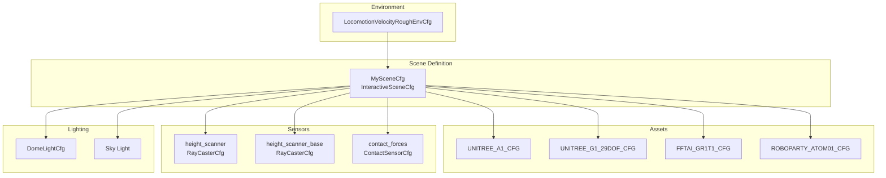
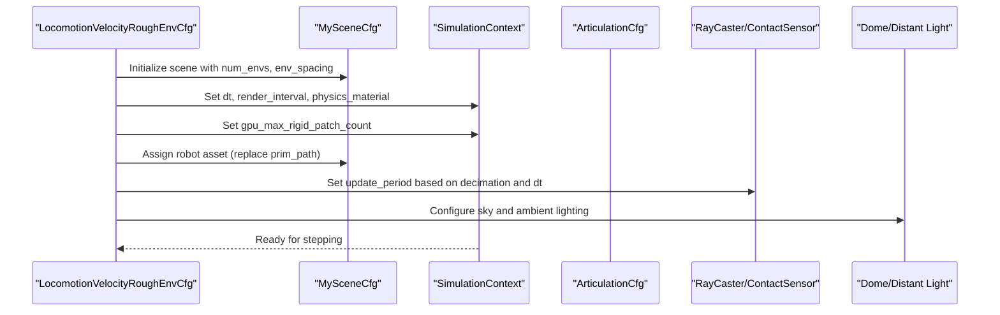
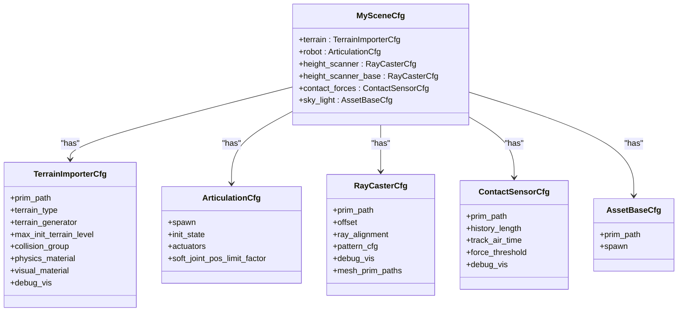
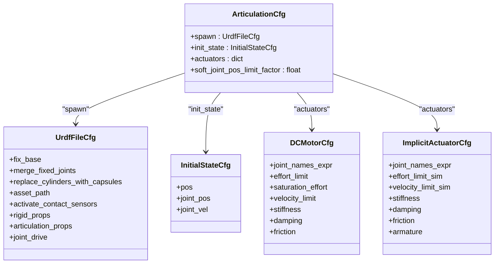
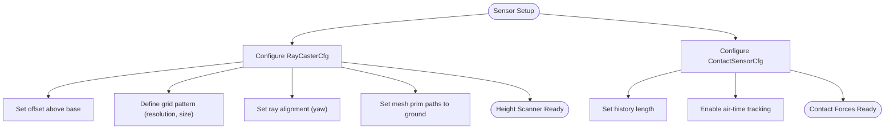
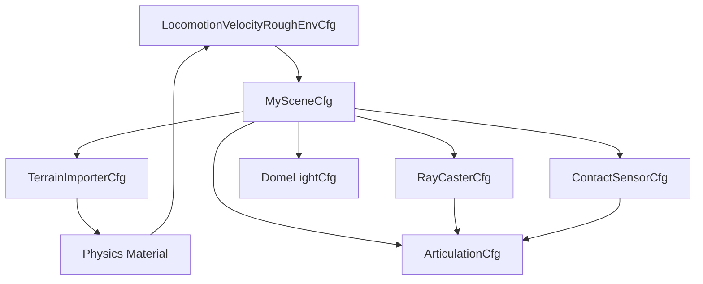

# Scene Configuration

<cite>
**Referenced Files in This Document**
- [velocity_env_cfg.py](file://source/robot_lab/robot_lab/tasks/manager_based/locomotion/velocity/velocity_env_cfg.py)
- [tracking_env_cfg.py](file://source/robot_lab/robot_lab/tasks/manager_based/beyondmimic/tracking_env_cfg.py)
- [unitree.py](file://source/robot_lab/robot_lab/assets/unitree.py)
- [fftai.py](file://source/robot_lab/robot_lab/assets/fftai.py)
- [roboparty.py](file://source/robot_lab/robot_lab/assets/roboparty.py)
- [rewards.py](file://source/robot_lab/robot_lab/tasks/manager_based/locomotion/velocity/mdp/rewards.py)
- [utils.py](file://source/robot_lab/robot_lab/tasks/manager_based/locomotion/velocity/mdp/utils.py)
- [motion_replayer.py](file://source/robot_lab/robot_lab/tasks/direct/g1_amp/motions/motion_replayer.py)
</cite>

## Table of Contents
1. [Introduction](#introduction)
2. [Project Structure](#project-structure)
3. [Core Components](#core-components)
4. [Architecture Overview](#architecture-overview)
5. [Detailed Component Analysis](#detailed-component-analysis)
6. [Dependency Analysis](#dependency-analysis)
7. [Performance Considerations](#performance-considerations)
8. [Troubleshooting Guide](#troubleshooting-guide)
9. [Conclusion](#conclusion)

## Introduction
This document explains the scene configuration system used in velocity-based locomotion tasks. It focuses on how scenes are defined, how terrain is generated and visualized, how robot assets are configured, and how sensors (height scanning and contact sensing) are integrated. It also covers initialization parameters, environment spacing, lighting, and performance tuning including GPU rigid patch count and render intervals.

## Project Structure
The scene configuration system centers around a scene configuration class that inherits from an interactive scene base. Robot assets are defined in dedicated asset modules, and sensor configurations are integrated into the scene. Environment-specific configurations compose the scene with assets and sensors.

**Diagram sources**
- [velocity_env_cfg.py](file://source/robot_lab/robot_lab/tasks/manager_based/locomotion/velocity/velocity_env_cfg.py#L42-L95)
- [unitree.py](file://source/robot_lab/robot_lab/assets/unitree.py#L19-L65)
- [fftai.py](file://source/robot_lab/robot_lab/assets/fftai.py#L24-L139)
- [roboparty.py](file://source/robot_lab/robot_lab/assets/roboparty.py#L16-L48)

**Section sources**
- [velocity_env_cfg.py](file://source/robot_lab/robot_lab/tasks/manager_based/locomotion/velocity/velocity_env_cfg.py#L42-L95)

## Core Components
- MySceneCfg: Defines the scene including terrain, robot asset, sensors, and lighting.
- ArticulationCfg: Describes robot asset properties, initial states, actuator configurations, and URDF loading options.
- Sensor configurations:
  - RayCasterCfg: Height scanning using grid patterns.
  - ContactSensorCfg: Force measurement and air-time tracking.
- Lighting: Distant and dome lights for illumination.

Key scene parameters:
- TerrainImporterCfg: Terrain type, generator, material, and visual material.
- Physics material properties: friction, restitution, combine modes.
- Visual materials: MDL textures and UV projection.
- Environment spacing and scene initialization parameters.

**Section sources**
- [velocity_env_cfg.py](file://source/robot_lab/robot_lab/tasks/manager_based/locomotion/velocity/velocity_env_cfg.py#L42-L95)
- [unitree.py](file://source/robot_lab/robot_lab/assets/unitree.py#L19-L65)
- [fftai.py](file://source/robot_lab/robot_lab/assets/fftai.py#L24-L139)
- [roboparty.py](file://source/robot_lab/robot_lab/assets/roboparty.py#L16-L48)

## Architecture Overview
The environment composes a scene configuration that defines the world geometry, robot assets, sensors, and lighting. The environment’s post-initialization routine sets simulation parameters, render intervals, and sensor update periods.

**Diagram sources**
- [velocity_env_cfg.py](file://source/robot_lab/robot_lab/tasks/manager_based/locomotion/velocity/velocity_env_cfg.py#L696-L727)
- [tracking_env_cfg.py](file://source/robot_lab/robot_lab/tasks/manager_based/beyondmimic/tracking_env_cfg.py#L320-L328)

## Detailed Component Analysis

### MySceneCfg: Scene Composition
- Terrain:
  - Type: plane or generator with a terrain generator.
  - Physics material: friction and restitution combine modes, values.
  - Visual material: MDL path, UV projection, texture scale.
- Robot:
  - ArticulationCfg placeholder (MISSING) replaced by environment-specific asset.
- Sensors:
  - Height scanner: Grid pattern with resolution and size; ray alignment yaw; offset above base; targets ground mesh.
  - Base height scanner: Finer grid pattern for close-range height.
  - Contact forces: History length, air-time tracking, optional debug visualization.
- Lighting:
  - Distant light and dome light with intensity and color/texture.

**Diagram sources**
- [velocity_env_cfg.py](file://source/robot_lab/robot_lab/tasks/manager_based/locomotion/velocity/velocity_env_cfg.py#L42-L95)

**Section sources**
- [velocity_env_cfg.py](file://source/robot_lab/robot_lab/tasks/manager_based/locomotion/velocity/velocity_env_cfg.py#L42-L95)

### Robot Asset Configuration
Robot assets are defined via ArticulationCfg with:
- URDF loading options: fix base, merge fixed joints, replace cylinders with capsules, activate contact sensors.
- Rigid body properties: gravity, damping, max velocities, penetration velocity.
- Articulation root properties: self-collision enablement, solver iteration counts.
- Actuator configurations: DCMotor or ImplicitActuator with per-joint stiffness/damping/effect limits.

Examples:
- Unitree A1, Go2, Go2W, B2, B2W, G1 29-DoF configurations.
- FFTAI GR1T1/GR1T2 humanoid configurations.
- Roboparty Atom01 quadruped configuration.

**Diagram sources**
- [unitree.py](file://source/robot_lab/robot_lab/assets/unitree.py#L19-L65)
- [fftai.py](file://source/robot_lab/robot_lab/assets/fftai.py#L24-L139)
- [roboparty.py](file://source/robot_lab/robot_lab/assets/roboparty.py#L16-L48)

**Section sources**
- [unitree.py](file://source/robot_lab/robot_lab/assets/unitree.py#L19-L65)
- [fftai.py](file://source/robot_lab/robot_lab/assets/fftai.py#L24-L139)
- [roboparty.py](file://source/robot_lab/robot_lab/assets/roboparty.py#L16-L48)

### Sensor Configurations
- RayCasterCfg:
  - Height scanning with grid patterns for terrain height estimation.
  - Offsets placed above the base to scan downward.
  - Mesh targets set to the ground to intersect rays.
- ContactSensorCfg:
  - Tracks contact forces across bodies.
  - History length and air-time tracking for gait analysis.

**Diagram sources**
- [velocity_env_cfg.py](file://source/robot_lab/robot_lab/tasks/manager_based/locomotion/velocity/velocity_env_cfg.py#L70-L86)

**Section sources**
- [velocity_env_cfg.py](file://source/robot_lab/robot_lab/tasks/manager_based/locomotion/velocity/velocity_env_cfg.py#L70-L86)

### Lighting Setup
- Sky light: Dome light with HDR texture for ambient illumination.
- Distant light: Directional light for shading and realism.

**Section sources**
- [velocity_env_cfg.py](file://source/robot_lab/robot_lab/tasks/manager_based/locomotion/velocity/velocity_env_cfg.py#L88-L94)

### Scene Initialization and Environment Spacing
- Scene initialization parameters:
  - num_envs: Number of environments.
  - env_spacing: Distance between environments.
- Environment composition:
  - Replaces robot prim path with environment namespace.
  - Sets sensor update periods based on decimation and simulation dt.

**Section sources**
- [velocity_env_cfg.py](file://source/robot_lab/robot_lab/tasks/manager_based/locomotion/velocity/velocity_env_cfg.py#L696-L727)

### Physics Simulation Settings
- Simulation parameters:
  - dt: Physics time step.
  - render_interval: Rendering cadence relative to decimation.
  - physics_material: Shared physics material from terrain.
  - gpu_max_rigid_patch_count: GPU rigid body patch budget for performance.

**Section sources**
- [velocity_env_cfg.py](file://source/robot_lab/robot_lab/tasks/manager_based/locomotion/velocity/velocity_env_cfg.py#L717-L720)
- [tracking_env_cfg.py](file://source/robot_lab/robot_lab/tasks/manager_based/beyondmimic/tracking_env_cfg.py#L325-L328)

### Terrain Generation and Material Properties
- TerrainImporterCfg:
  - Generator-based terrain with configurable difficulty and curriculum.
  - Physics material properties for friction and restitution.
  - Visual material with MDL textures and UV scaling.
- Utility helpers:
  - Terrain assignment checks for specific terrain types (e.g., pits, stairs).
  - Terrain column range computation for curriculum.

**Section sources**
- [velocity_env_cfg.py](file://source/robot_lab/robot_lab/tasks/manager_based/locomotion/velocity/velocity_env_cfg.py#L47-L66)
- [utils.py](file://source/robot_lab/robot_lab/tasks/manager_based/locomotion/velocity/mdp/utils.py#L15-L39)
- [utils.py](file://source/robot_lab/robot_lab/tasks/manager_based/locomotion/velocity/mdp/utils.py#L42-L126)

### Sensor Placement Strategies
- Height scanning:
  - Primary scanner: Coarse grid for far-field terrain height.
  - Base scanner: Fine grid for close-range height near the base.
- Contact sensing:
  - Full-body coverage via regex paths.
  - History and air-time tracking for gait metrics.

**Section sources**
- [velocity_env_cfg.py](file://source/robot_lab/robot_lab/tasks/manager_based/locomotion/velocity/velocity_env_cfg.py#L70-L86)

### Examples
- Flat vs rough terrain:
  - Flat environments switch to plane or road generator and remove height scans.
- Asset selection:
  - Unitree A1/Go2/G1 configurations are applied to the scene robot placeholder.

**Section sources**
- [velocity_env_cfg.py](file://source/robot_lab/robot_lab/tasks/manager_based/locomotion/velocity/velocity_env_cfg.py#L696-L727)
- [unitree.py](file://source/robot_lab/robot_lab/assets/unitree.py#L19-L65)

## Dependency Analysis
The environment composes the scene and sensors, which depend on shared physics materials and lighting. Sensors rely on the robot asset for ray casting and contact measurements.

**Diagram sources**
- [velocity_env_cfg.py](file://source/robot_lab/robot_lab/tasks/manager_based/locomotion/velocity/velocity_env_cfg.py#L42-L95)
- [velocity_env_cfg.py](file://source/robot_lab/robot_lab/tasks/manager_based/locomotion/velocity/velocity_env_cfg.py#L717-L720)

**Section sources**
- [velocity_env_cfg.py](file://source/robot_lab/robot_lab/tasks/manager_based/locomotion/velocity/velocity_env_cfg.py#L42-L95)
- [velocity_env_cfg.py](file://source/robot_lab/robot_lab/tasks/manager_based/locomotion/velocity/velocity_env_cfg.py#L717-L720)

## Performance Considerations
- GPU rigid patch count:
  - Set via simulation context property to balance stability and throughput.
- Render interval:
  - Controlled by environment decimation to reduce rendering overhead while maintaining control frequency.
- Sensor update periods:
  - Height scanners aligned to physics steps; contact sensors aligned to control steps.
- Solver settings:
  - Position and velocity iteration counts tuned for stability and speed.

Practical tips:
- Increase gpu_max_rigid_patch_count for dense scenes with many contacts.
- Tune render_interval to match desired visualization frequency without impacting control loops.
- Adjust solver iterations to balance accuracy and speed.

**Section sources**
- [velocity_env_cfg.py](file://source/robot_lab/robot_lab/tasks/manager_based/locomotion/velocity/velocity_env_cfg.py#L717-L720)
- [tracking_env_cfg.py](file://source/robot_lab/robot_lab/tasks/manager_based/beyondmimic/tracking_env_cfg.py#L325-L328)
- [motion_replayer.py](file://source/robot_lab/robot_lab/tasks/direct/g1_amp/motions/motion_replayer.py#L72-L91)

## Troubleshooting Guide
Common issues and resolutions:
- NaN or extreme ray hits in height scanning:
  - The reward module adjusts target height using mean ray hits; invalid hits fall back to root height.
- Terrain curriculum mismatch:
  - Ensure terrain generator curriculum flag is set appropriately when enabling curriculum terms.
- Sensor update timing:
  - Verify sensor update periods align with decimation and dt to avoid missed updates.

**Section sources**
- [rewards.py](file://source/robot_lab/robot_lab/tasks/manager_based/locomotion/velocity/mdp/rewards.py#L617-L637)
- [velocity_env_cfg.py](file://source/robot_lab/robot_lab/tasks/manager_based/locomotion/velocity/velocity_env_cfg.py#L721-L727)

## Conclusion
The scene configuration system provides a structured way to define terrain, assets, sensors, and lighting for velocity-based locomotion. By centralizing these definitions in MySceneCfg and composing them within environment configurations, the system supports flexible terrain generation, robust sensor setups, and performance-tuned simulation parameters. Proper configuration of physics materials, render intervals, and GPU patch budgets ensures stable and efficient simulations.