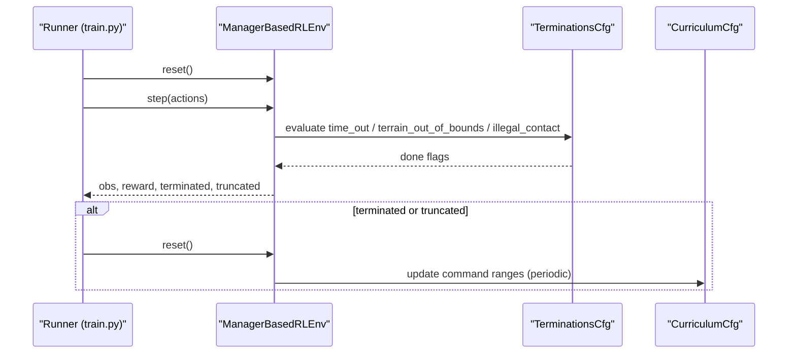
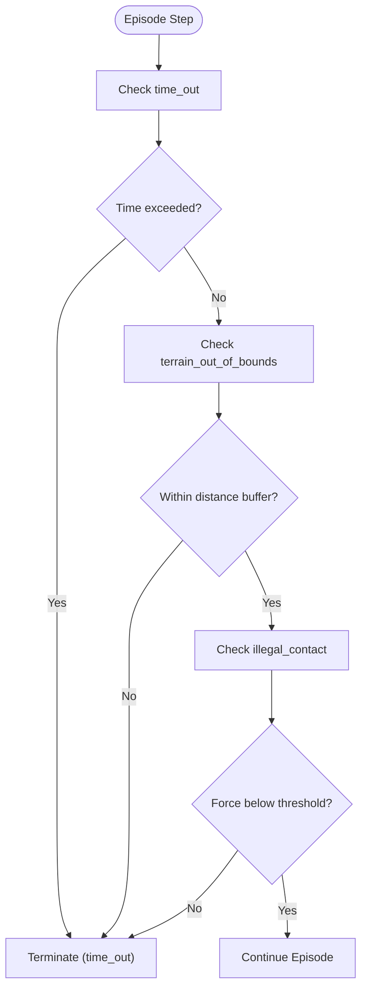
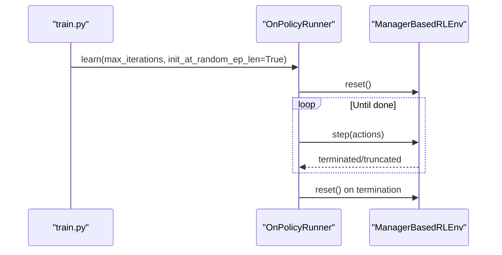
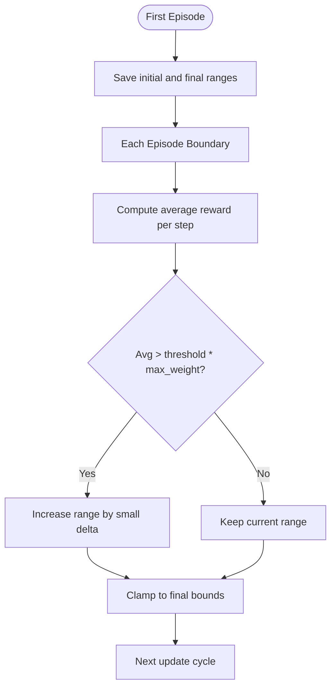
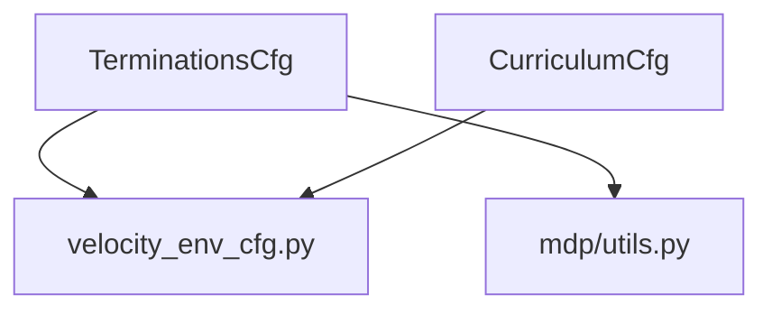

# Termination Conditions and Episode Management

<cite>
**Referenced Files in This Document**
- [velocity_env_cfg.py](file://source/robot_lab/robot_lab/tasks/manager_based/locomotion/velocity/velocity_env_cfg.py)
- [utils.py](file://source/robot_lab/robot_lab/tasks/manager_based/locomotion/velocity/mdp/utils.py)
- [curriculums.py](file://source/robot_lab/robot_lab/tasks/manager_based/locomotion/velocity/mdp/curriculums.py)
- [train.py](file://scripts/reinforcement_learning/rsl_rl/train.py)
</cite>

## Table of Contents
1. [Introduction](#introduction)
2. [Project Structure](#project-structure)
3. [Core Components](#core-components)
4. [Architecture Overview](#architecture-overview)
5. [Detailed Component Analysis](#detailed-component-analysis)
6. [Dependency Analysis](#dependency-analysis)
7. [Performance Considerations](#performance-considerations)
8. [Troubleshooting Guide](#troubleshooting-guide)
9. [Conclusion](#conclusion)

## Introduction
This document explains termination conditions and episode management for velocity-based locomotion tasks. It focuses on the TerminationsCfg class, detailing three termination mechanisms:
- Time-based termination (time_out)
- Terrain boundary conditions (terrain_out_of_bounds)
- Contact-based termination (illegal_contact)

It also covers episode length configuration, simulation step management, and integration with curriculum learning systems. Practical guidance is included for tuning termination thresholds, avoiding premature termination during early training, and stabilizing training.

## Project Structure
The relevant components are organized under the velocity-based locomotion task module:
- Environment configuration defines termination and curriculum terms
- MDP utilities provide terrain-aware helpers used by termination logic
- Curriculum functions manage adaptive command ranges
- Training script demonstrates episode length initialization and training loop integration

```mermaid
graph TB
EnvCfg["velocity_env_cfg.py<br/>TerminationsCfg, CurriculumCfg"]
Utils["mdp/utils.py<br/>terrain helpers"]
Curric["mdp/curriculums.py<br/>command_levels_lin_vel"]
Train["scripts/rsl_rl/train.py<br/>runner.learn(init_at_random_ep_len)"]
EnvCfg --> Utils
EnvCfg --> Curric
Train --> EnvCfg
```

**Diagram sources**
- [velocity_env_cfg.py](file://source/robot_lab/robot_lab/tasks/manager_based/locomotion/velocity/velocity_env_cfg.py#L647-L679)
- [utils.py](file://source/robot_lab/robot_lab/tasks/manager_based/locomotion/velocity/mdp/utils.py#L15-L127)
- [curriculums.py](file://source/robot_lab/robot_lab/tasks/manager_based/locomotion/velocity/mdp/curriculums.py#L20-L60)
- [train.py](file://scripts/reinforcement_learning/rsl_rl/train.py#L194-L231)

**Section sources**
- [velocity_env_cfg.py](file://source/robot_lab/robot_lab/tasks/manager_based/locomotion/velocity/velocity_env_cfg.py#L647-L679)
- [utils.py](file://source/robot_lab/robot_lab/tasks/manager_based/locomotion/velocity/mdp/utils.py#L15-L127)
- [curriculums.py](file://source/robot_lab/robot_lab/tasks/manager_based/locomotion/velocity/mdp/curriculums.py#L20-L60)
- [train.py](file://scripts/reinforcement_learning/rsl_rl/train.py#L194-L231)

## Core Components
- TerminationsCfg: Declares termination terms for the MDP
  - time_out: Ends episodes after a time limit; marked as time_out=True
  - terrain_out_of_bounds: Ends episodes when robots exit a designated terrain region; uses a distance buffer; marked as time_out=True
  - illegal_contact: Ends episodes when contact forces exceed a threshold; uses a contact sensor
- CurriculumCfg: Declares curriculum terms
  - terrain_levels: Terrain difficulty progression
  - command_levels_lin_vel: Adaptive command range for linear velocity based on reward performance

These configurations integrate with the manager-based RL environment to define episode boundaries and adaptive training difficulty.

**Section sources**
- [velocity_env_cfg.py](file://source/robot_lab/robot_lab/tasks/manager_based/locomotion/velocity/velocity_env_cfg.py#L647-L679)

## Architecture Overview
Termination conditions are evaluated each step via MDP terms configured in the environment. The training loop initializes episode lengths randomly and relies on termination signals to mark episode completion. Curriculum updates occur at episode boundaries to adjust task difficulty.

**Diagram sources**
- [velocity_env_cfg.py](file://source/robot_lab/robot_lab/tasks/manager_based/locomotion/velocity/velocity_env_cfg.py#L647-L679)
- [curriculums.py](file://source/robot_lab/robot_lab/tasks/manager_based/locomotion/velocity/mdp/curriculums.py#L20-L60)
- [train.py](file://scripts/reinforcement_learning/rsl_rl/train.py#L194-L231)

## Detailed Component Analysis

### TerminationsCfg: Criteria, Buffers, and Stability Impacts
- time_out
  - Purpose: Prevents infinite episodes by enforcing a hard time limit
  - Behavior: Marked as time_out=True; contributes to truncation semantics
  - Impact: Ensures training progress even if policy fails to reach a terminal state; prevents resource leaks
- terrain_out_of_bounds
  - Purpose: Detects when robots move outside a safe or intended terrain region
  - Mechanism: Uses a distance buffer to define a margin beyond which an episode terminates
  - Implementation hook: Leverages terrain-aware utilities to determine robot location and column ranges
  - Impact: Improves safety and stability by preventing exploration into undefined regions; reduces spurious failures due to extreme boundary excursions
- illegal_contact
  - Purpose: Detects unsafe contact conditions that indicate physical instability or collisions
  - Mechanism: Threshold-based evaluation of contact sensor readings
  - Impact: Prevents policies from exploiting unstable dynamics; improves robustness to contact noise

**Diagram sources**
- [velocity_env_cfg.py](file://source/robot_lab/robot_lab/tasks/manager_based/locomotion/velocity/velocity_env_cfg.py#L647-L679)
- [utils.py](file://source/robot_lab/robot_lab/tasks/manager_based/locomotion/velocity/mdp/utils.py#L42-L126)

**Section sources**
- [velocity_env_cfg.py](file://source/robot_lab/robot_lab/tasks/manager_based/locomotion/velocity/velocity_env_cfg.py#L647-L679)
- [utils.py](file://source/robot_lab/robot_lab/tasks/manager_based/locomotion/velocity/mdp/utils.py#L42-L126)

### Episode Length Configuration and Simulation Step Management
- Episode length is managed by the RL runner and environment integration
- The training script initializes episode lengths randomly at the start of learning, enabling diverse early behaviors while maintaining bounded computation
- Episode boundaries trigger curriculum updates and logging

**Diagram sources**
- [train.py](file://scripts/reinforcement_learning/rsl_rl/train.py#L194-L231)

**Section sources**
- [train.py](file://scripts/reinforcement_learning/rsl_rl/train.py#L194-L231)

### Curriculum Learning Integration
- Command ranges for linear velocity are adapted based on episode reward performance
- The curriculum function:
  - Initializes command ranges at the first episode
  - Periodically evaluates cumulative reward per episode against a threshold
  - Expands command ranges when performance exceeds a fraction of the maximum reward potential
  - Clamps ranges to predefined final bounds

**Diagram sources**
- [curriculums.py](file://source/robot_lab/robot_lab/tasks/manager_based/locomotion/velocity/mdp/curriculums.py#L20-L60)

**Section sources**
- [curriculums.py](file://source/robot_lab/robot_lab/tasks/manager_based/locomotion/velocity/mdp/curriculums.py#L20-L60)

## Dependency Analysis
Termination conditions depend on:
- Environment scene assets (robot, contact_forces sensor)
- Terrain generator configuration for terrain-aware checks
- Curriculum functions for adaptive command ranges

**Diagram sources**
- [velocity_env_cfg.py](file://source/robot_lab/robot_lab/tasks/manager_based/locomotion/velocity/velocity_env_cfg.py#L647-L679)
- [utils.py](file://source/robot_lab/robot_lab/tasks/manager_based/locomotion/velocity/mdp/utils.py#L15-L127)
- [curriculums.py](file://source/robot_lab/robot_lab/tasks/manager_based/locomotion/velocity/mdp/curriculums.py#L20-L60)

**Section sources**
- [velocity_env_cfg.py](file://source/robot_lab/robot_lab/tasks/manager_based/locomotion/velocity/velocity_env_cfg.py#L647-L679)
- [utils.py](file://source/robot_lab/robot_lab/tasks/manager_based/locomotion/velocity/mdp/utils.py#L15-L127)
- [curriculums.py](file://source/robot_lab/robot_lab/tasks/manager_based/locomotion/velocity/mdp/curriculums.py#L20-L60)

## Performance Considerations
- Termination evaluation cost: Terrain checks involve nearest-neighbor computations over terrain origins; ensure reasonable grid sizes and batch counts
- Contact sensor thresholds: Tune to balance sensitivity and noise robustness
- Curriculum update cadence: Updates occur at episode boundaries; align with training frequency to avoid excessive overhead
- Random episode length initialization: Helps diversify early exploration but may increase warm-up time

## Troubleshooting Guide
Common issues and strategies:
- Premature termination during early training
  - Symptom: Policies fail frequently due to strict illegal_contact or tight terrain_out_of_bounds
  - Strategies:
    - Increase distance buffer for terrain_out_of_bounds to allow more exploration near edges
    - Raise illegal_contact threshold gradually as training progresses
    - Reduce curriculum expansion rate or delay curriculum updates until later iterations
- Over-reliance on time_out
  - Symptom: Episodes end solely due to time limits, masking learning stagnation
  - Strategies:
    - Verify terrain_out_of_bounds and illegal_contact are functioning; inspect sensor readings and terrain configuration
    - Adjust episode length upper bound to reflect realistic task durations
- Unstable contact sensing
  - Symptom: Spurious illegal_contact triggers due to noise
  - Strategies:
    - Smooth contact sensor history or increase threshold slightly
    - Validate sensor body names and asset configuration
- Curriculum stalls
  - Symptom: Command ranges do not expand despite good performance
  - Strategies:
    - Confirm reward term name matches configuration
    - Lower the performance threshold or reduce delta_command magnitude
    - Ensure episode length is sufficient for meaningful reward accumulation

## Conclusion
Termination conditions and curriculum learning are tightly coupled to stabilize and accelerate velocity-based locomotion training. Properly tuned time_out, terrain_out_of_bounds, and illegal_contact thresholds ensure safe and meaningful episode boundaries. Integrating curriculum-driven command adaptation further improves sample efficiency by progressively increasing task difficulty. Start conservatively with generous buffers and thresholds, then iteratively refine based on observed training stability and performance.