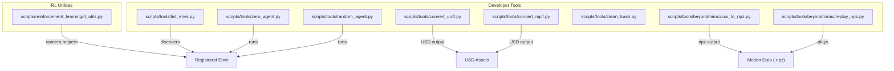
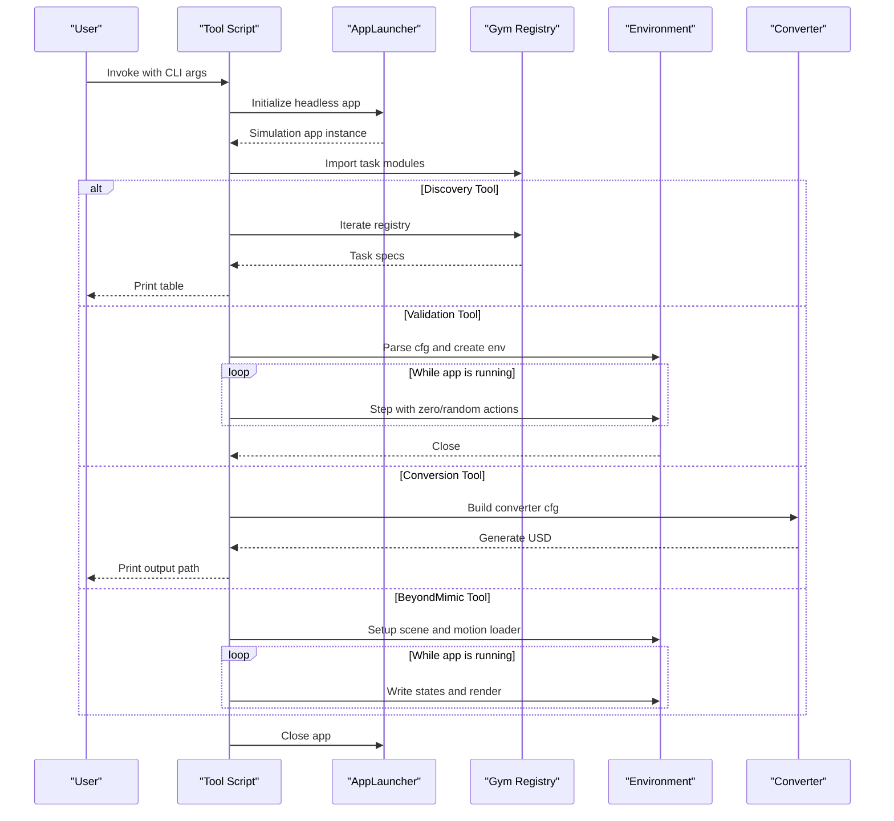
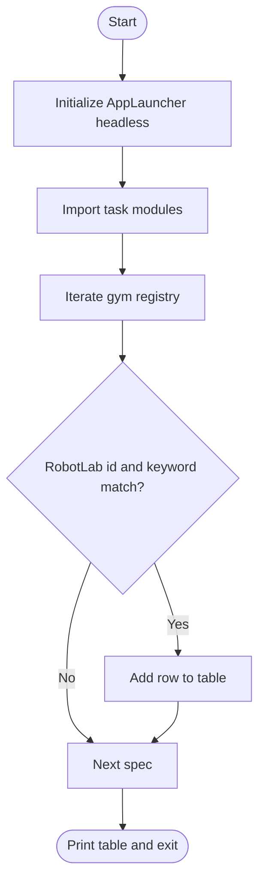
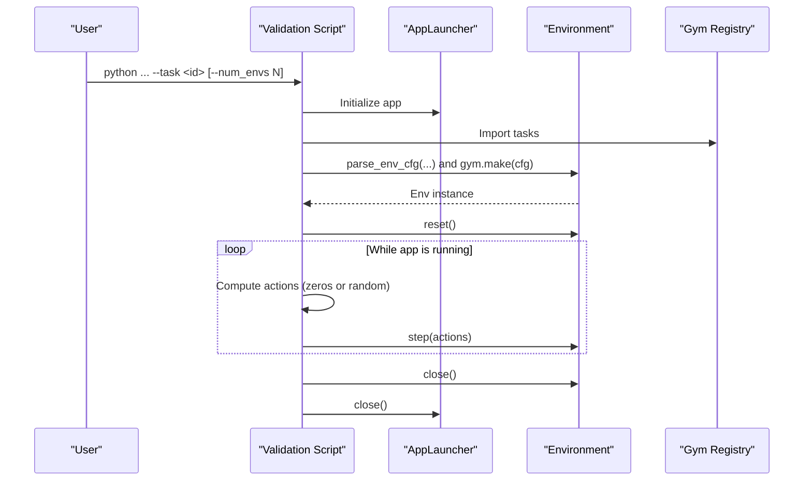
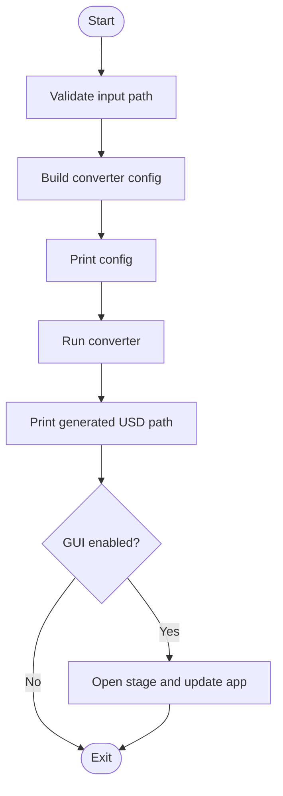
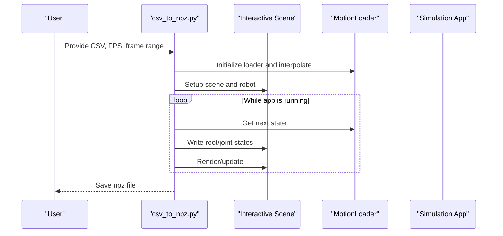
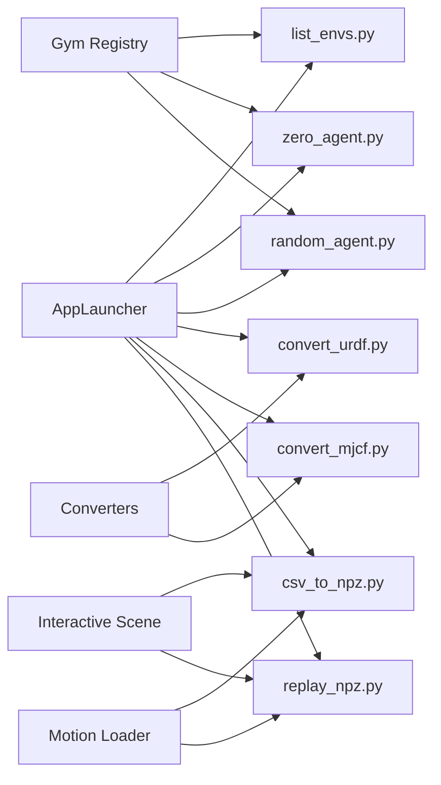

# Tools and Utilities

<cite>
**Referenced Files in This Document**
- [README.md](file://README.md)
- [list_envs.py](file://scripts/tools/list_envs.py)
- [zero_agent.py](file://scripts/tools/zero_agent.py)
- [random_agent.py](file://scripts/tools/random_agent.py)
- [convert_urdf.py](file://scripts/tools/convert_urdf.py)
- [convert_mjcf.py](file://scripts/tools/convert_mjcf.py)
- [clean_trash.py](file://scripts/tools/clean_trash.py)
- [csv_to_npz.py](file://scripts/tools/beyondmimic/csv_to_npz.py)
- [replay_npz.py](file://scripts/tools/beyondmimic/replay_npz.py)
- [rl_utils.py](file://scripts/reinforcement_learning/rl_utils.py)
</cite>

## Table of Contents
1. [Introduction](#introduction)
2. [Project Structure](#project-structure)
3. [Core Components](#core-components)
4. [Architecture Overview](#architecture-overview)
5. [Detailed Component Analysis](#detailed-component-analysis)
6. [Dependency Analysis](#dependency-analysis)
7. [Performance Considerations](#performance-considerations)
8. [Troubleshooting Guide](#troubleshooting-guide)
9. [Conclusion](#conclusion)
10. [Appendices](#appendices)

## Introduction
This document describes the comprehensive suite of development and debugging tools provided with Robot Lab. It covers environment validation tools (zero-action and random-agent scripts), model conversion utilities for URDF and MJCF formats, environment discovery via list_envs.py, asset validation and simulation debugging utilities, and data processing and motion replay tools for BeyondMimic. It also provides practical usage patterns, parameter configurations, integration workflows, customization tips, and guidelines for incorporating these tools into automated development pipelines and CI/CD processes.

## Project Structure
Robot Lab organizes its developer utilities primarily under scripts/tools and scripts/reinforcement_learning. The tools are thin CLI wrappers around the Isaac Lab runtime and converters, leveraging AppLauncher to initialize the Omniverse app and the simulation context. The BeyondMimic tools live under scripts/tools/beyondmimic and integrate with Robot Lab’s motion loaders and interactive scenes.

**Diagram sources**
- [list_envs.py](file://scripts/tools/list_envs.py#L45-L74)
- [zero_agent.py](file://scripts/tools/zero_agent.py#L47-L74)
- [random_agent.py](file://scripts/tools/random_agent.py#L47-L74)
- [convert_urdf.py](file://scripts/tools/convert_urdf.py#L95-L139)
- [convert_mjcf.py](file://scripts/tools/convert_mjcf.py#L77-L115)
- [csv_to_npz.py](file://scripts/tools/beyondmimic/csv_to_npz.py#L344-L358)
- [replay_npz.py](file://scripts/tools/beyondmimic/replay_npz.py#L102-L111)
- [rl_utils.py](file://scripts/reinforcement_learning/rl_utils.py#L9-L27)

**Section sources**
- [README.md](file://README.md#L74-L78)
- [list_envs.py](file://scripts/tools/list_envs.py#L19-L36)
- [convert_urdf.py](file://scripts/tools/convert_urdf.py#L35-L80)
- [convert_mjcf.py](file://scripts/tools/convert_mjcf.py#L33-L62)
- [csv_to_npz.py](file://scripts/tools/beyondmimic/csv_to_npz.py#L12-L50)
- [replay_npz.py](file://scripts/tools/beyondmimic/replay_npz.py#L12-L32)

## Core Components
- Environment discovery: list_envs.py enumerates all Robot Lab environments registered in the Gym registry, printing a formatted table with task name, entry point, and config entry point. It supports filtering by keyword and requires AppLauncher to initialize the app headlessly.
- Environment validation: zero_agent.py and random_agent.py run a selected environment with constant or random actions respectively. Both use parse_env_cfg to construct environment configurations and iterate until the simulation app exits.
- Model conversion: convert_urdf.py and convert_mjcf.py convert external robot descriptions (URDF/MJCF) into USD assets using Isaaclab converters. They accept CLI arguments to control base fixing, merging, joint drives, site importing, and instancing.
- Asset validation and cleanup: clean_trash.py scans logs for incomplete training artifacts and offers safe deletion of candidate directories.
- BeyondMimic data processing: csv_to_npz.py loads CSV motion data, interpolates to a target FPS, computes velocities, and saves an npz file suitable for replay. replay_npz.py replays the npz motion in simulation.
- Simulation debugging and camera: rl_utils.py provides a camera-follow utility to smoothly track the robot during playback.

**Section sources**
- [list_envs.py](file://scripts/tools/list_envs.py#L45-L74)
- [zero_agent.py](file://scripts/tools/zero_agent.py#L47-L74)
- [random_agent.py](file://scripts/tools/random_agent.py#L47-L74)
- [convert_urdf.py](file://scripts/tools/convert_urdf.py#L95-L139)
- [convert_mjcf.py](file://scripts/tools/convert_mjcf.py#L77-L115)
- [clean_trash.py](file://scripts/tools/clean_trash.py#L9-L56)
- [csv_to_npz.py](file://scripts/tools/beyondmimic/csv_to_npz.py#L344-L358)
- [replay_npz.py](file://scripts/tools/beyondmimic/replay_npz.py#L102-L111)
- [rl_utils.py](file://scripts/reinforcement_learning/rl_utils.py#L9-L27)

## Architecture Overview
The tools share a common initialization pattern: they import AppLauncher, add standard CLI arguments, parse arguments, and initialize the simulation app. After initialization, they import environment/task modules and run a loop controlled by the simulation app lifecycle. Conversion tools additionally construct converter configurations and produce USD assets. BeyondMimic tools construct interactive scenes and motion loaders to generate or replay motion data.

**Diagram sources**
- [list_envs.py](file://scripts/tools/list_envs.py#L45-L74)
- [zero_agent.py](file://scripts/tools/zero_agent.py#L47-L74)
- [random_agent.py](file://scripts/tools/random_agent.py#L47-L74)
- [convert_urdf.py](file://scripts/tools/convert_urdf.py#L95-L139)
- [convert_mjcf.py](file://scripts/tools/convert_mjcf.py#L77-L115)
- [csv_to_npz.py](file://scripts/tools/beyondmimic/csv_to_npz.py#L344-L358)
- [replay_npz.py](file://scripts/tools/beyondmimic/replay_npz.py#L102-L111)

## Detailed Component Analysis

### Environment Discovery: list_envs.py
Purpose:
- Enumerate all Robot Lab environments registered in the Gym registry and display them in a formatted table. Supports optional keyword filtering.

Key behaviors:
- Initializes AppLauncher headless.
- Imports task modules to populate the registry.
- Iterates gym.registry, filters by id containing “RobotLab” and optional keyword.
- Prints a PrettyTable with columns for index, task name, entry point, and config entry point.

Usage pattern:
- Typical invocation prints all environments; optional keyword filters by substring.

Integration workflow:
- Run after installing the package so tasks are discoverable.

**Diagram sources**
- [list_envs.py](file://scripts/tools/list_envs.py#L45-L74)

**Section sources**
- [list_envs.py](file://scripts/tools/list_envs.py#L25-L36)
- [list_envs.py](file://scripts/tools/list_envs.py#L45-L74)

### Environment Validation: zero_agent.py and random_agent.py
Purpose:
- Validate environment setup and rendering by stepping with zero or random actions.

Common configuration:
- Accepts task name, number of environments, and device selection via AppLauncher-provided CLI.
- Parses environment configuration using parse_env_cfg with device and num_envs.
- Creates environment via gym.make with cfg.
- Resets environment and steps in a loop controlled by simulation_app.is_running().
- Uses torch.inference_mode() for zero-agent to reduce overhead.

Differences:
- Actions: zero_agent computes zeros shaped like env.action_space; random_agent samples actions uniformly in [-1, 1].

Usage patterns:
- Run with --task to specify a Robot Lab environment id.
- Optionally set --num_envs for vectorized environments.
- Disable fabric via --disable_fabric to use USD I/O operations.

**Diagram sources**
- [zero_agent.py](file://scripts/tools/zero_agent.py#L47-L74)
- [random_agent.py](file://scripts/tools/random_agent.py#L47-L74)

**Section sources**
- [zero_agent.py](file://scripts/tools/zero_agent.py#L17-L30)
- [zero_agent.py](file://scripts/tools/zero_agent.py#L47-L74)
- [random_agent.py](file://scripts/tools/random_agent.py#L17-L30)
- [random_agent.py](file://scripts/tools/random_agent.py#L47-L74)

### Model Conversion: convert_urdf.py and convert_mjcf.py
Purpose:
- Convert external robot description formats (URDF, MJCF) into USD assets for simulation.

URDF conversion:
- Validates input file path and constructs UrdfConverterCfg with options for base fixing, merging fixed joints, and joint drive PD gains and target type.
- Prints the effective configuration and the generated USD path.
- Optionally opens the USD in the stage and updates the app while running if GUI is enabled.

MJCF conversion:
- Validates input file path and constructs MjcfConverterCfg with options for base fixing, importing sites, and making assets instanceable.
- Prints the effective configuration and the generated USD path.
- Optionally opens the USD in the stage and updates the app while running if GUI is enabled.

Usage patterns:
- Provide input and output paths; optionally tune joint drive parameters or import sites.
- Use AppLauncher CLI to control device and headless mode.

**Diagram sources**
- [convert_urdf.py](file://scripts/tools/convert_urdf.py#L95-L139)
- [convert_urdf.py](file://scripts/tools/convert_urdf.py#L141-L160)
- [convert_mjcf.py](file://scripts/tools/convert_mjcf.py#L77-L115)
- [convert_mjcf.py](file://scripts/tools/convert_mjcf.py#L117-L136)

**Section sources**
- [convert_urdf.py](file://scripts/tools/convert_urdf.py#L41-L75)
- [convert_urdf.py](file://scripts/tools/convert_urdf.py#L95-L139)
- [convert_urdf.py](file://scripts/tools/convert_urdf.py#L141-L160)
- [convert_mjcf.py](file://scripts/tools/convert_mjcf.py#L39-L57)
- [convert_mjcf.py](file://scripts/tools/convert_mjcf.py#L77-L115)
- [convert_mjcf.py](file://scripts/tools/convert_mjcf.py#L117-L136)

### BeyondMimic Data Processing: csv_to_npz.py and replay_npz.py
Purpose:
- csv_to_npz.py converts CSV motion files into npz files with interpolated poses, velocities, and joint states for replay.
- replay_npz.py plays back the npz motion in simulation using Robot Lab’s motion loader and interactive scene.

csv_to_npz.py:
- Loads CSV motion data, optionally within a frame range.
- Interpolates to target FPS using linear and spherical interpolation.
- Computes base linear/angular velocities and joint velocities via finite differences.
- Saves an npz with fps, joint_pos, joint_vel, body_pos_w, body_quat_w, body_lin_vel_w, body_ang_vel_w.

replay_npz.py:
- Loads npz motion data and sets robot root and joint states per time step.
- Updates the viewport camera to follow the robot.

Usage patterns:
- Provide input CSV and desired output name; set input and output FPS.
- Replay the resulting npz file in simulation.

**Diagram sources**
- [csv_to_npz.py](file://scripts/tools/beyondmimic/csv_to_npz.py#L226-L358)
- [replay_npz.py](file://scripts/tools/beyondmimic/replay_npz.py#L67-L111)

**Section sources**
- [csv_to_npz.py](file://scripts/tools/beyondmimic/csv_to_npz.py#L19-L44)
- [csv_to_npz.py](file://scripts/tools/beyondmimic/csv_to_npz.py#L226-L358)
- [replay_npz.py](file://scripts/tools/beyondmimic/replay_npz.py#L67-L111)

### Asset Validation and Cleanup: clean_trash.py
Purpose:
- Identify and safely remove training artifact directories that contain TensorFlow event files but lack sufficient model checkpoints, helping manage disk usage.

Behavior:
- Walks a target folder and matches directories containing events.out.* files and fewer than three model_.pt files.
- Lists candidates, prompts for confirmation, and deletes matching folders.

Usage pattern:
- Run against logs or outputs directories to prune incomplete runs.

**Section sources**
- [clean_trash.py](file://scripts/tools/clean_trash.py#L9-L56)

### Simulation Debugging and Camera: rl_utils.py
Purpose:
- Provide a camera-follow utility to smoothly track the robot during playback or evaluation.

Behavior:
- Maintains a moving average of recent camera positions to smooth motion.
- Uses the viewport camera controller to update the view.

Usage pattern:
- Call during evaluation loops to improve visualization quality.

**Section sources**
- [rl_utils.py](file://scripts/reinforcement_learning/rl_utils.py#L9-L27)

## Dependency Analysis
The tools depend on a shared initialization pattern and rely on:
- AppLauncher for headless or GUI initialization.
- Gym registry and environment creation via gym.make.
- Converter utilities for USD generation.
- Interactive scenes and motion loaders for BeyondMimic workflows.

**Diagram sources**
- [list_envs.py](file://scripts/tools/list_envs.py#L38-L42)
- [zero_agent.py](file://scripts/tools/zero_agent.py#L38-L44)
- [random_agent.py](file://scripts/tools/random_agent.py#L38-L44)
- [convert_urdf.py](file://scripts/tools/convert_urdf.py#L90-L92)
- [convert_mjcf.py](file://scripts/tools/convert_mjcf.py#L72-L74)
- [csv_to_npz.py](file://scripts/tools/beyondmimic/csv_to_npz.py#L62-L66)
- [replay_npz.py](file://scripts/tools/beyondmimic/replay_npz.py#L43-L46)

**Section sources**
- [list_envs.py](file://scripts/tools/list_envs.py#L38-L42)
- [zero_agent.py](file://scripts/tools/zero_agent.py#L38-L44)
- [random_agent.py](file://scripts/tools/random_agent.py#L38-L44)
- [convert_urdf.py](file://scripts/tools/convert_urdf.py#L90-L92)
- [convert_mjcf.py](file://scripts/tools/convert_mjcf.py#L72-L74)
- [csv_to_npz.py](file://scripts/tools/beyondmimic/csv_to_npz.py#L62-L66)
- [replay_npz.py](file://scripts/tools/beyondmimic/replay_npz.py#L43-L46)

## Performance Considerations
- Inference mode: zero_agent.py uses torch.inference_mode() to reduce overhead during environment stepping.
- Vectorized environments: Setting --num_envs increases throughput; ensure GPU memory and CPU resources are adequate.
- Headless vs GUI: Converting assets and running validations headless avoids GUI overhead and is recommended for automation.
- Motion interpolation: csv_to_npz.py interpolates to a target FPS; higher output FPS increases data size and replay cost.
- Camera smoothing: rl_utils.py maintains a rolling window for camera positions; adjust window size for smoother or more responsive tracking.

[No sources needed since this section provides general guidance]

## Troubleshooting Guide
- App fails to launch or exits immediately:
  - Ensure AppLauncher is invoked with appropriate device and headless flags.
  - Verify environment registration by running list_envs.py.
- Invalid file path errors during conversion:
  - Confirm absolute paths and existence of input files; the tools validate paths before conversion.
- Empty or incomplete training logs:
  - Use clean_trash.py to identify and remove directories with insufficient model checkpoints.
- Motion replay issues:
  - Ensure the CSV contains expected columns and the robot’s joint names match the motion loader’s expectations.
  - Confirm the npz was generated with compatible FPS and structure.

**Section sources**
- [list_envs.py](file://scripts/tools/list_envs.py#L77-L85)
- [convert_urdf.py](file://scripts/tools/convert_urdf.py#L96-L101)
- [convert_mjcf.py](file://scripts/tools/convert_mjcf.py#L78-L83)
- [clean_trash.py](file://scripts/tools/clean_trash.py#L19-L21)
- [csv_to_npz.py](file://scripts/tools/beyondmimic/csv_to_npz.py#L226-L228)

## Conclusion
Robot Lab’s tools provide a cohesive toolkit for environment discovery, validation, asset conversion, and motion data processing. By following the usage patterns and parameter configurations outlined here, developers can streamline environment setup, debug simulations, convert robot models efficiently, and manage experiment artifacts. Integrating these scripts into CI/CD pipelines enables reproducible validation and automated asset generation.

[No sources needed since this section summarizes without analyzing specific files]

## Appendices

### Usage Examples and Parameter Configurations
- Environment discovery:
  - python scripts/tools/list_envs.py
  - Optional: --keyword <substring>
- Environment validation:
  - python scripts/tools/zero_agent.py --task <ENV_ID> [--num_envs N]
  - python scripts/tools/random_agent.py --task <ENV_ID> [--num_envs N]
- Model conversion:
  - URDF: python scripts/tools/convert_urdf.py <input.urdf> <output.usd> [--merge-joints] [--fix-base] [--joint-stiffness FLOAT] [--joint-damping FLOAT] [--joint-target-type {position,velocity,none}]
  - MJCF: python scripts/tools/convert_mjcf.py <input.mjcf> <output.usd> [--fix-base] [--import-sites] [--make-instanceable]
- BeyondMimic:
  - CSV to npz: python scripts/tools/beyondmimic/csv_to_npz.py -f <input.csv> --input_fps 60 --output_fps 50 [--frame_range START END]
  - Replay npz: python scripts/tools/beyondmimic/replay_npz.py -f <motion.npz>
- Cleanup:
  - python scripts/tools/clean_trash.py

**Section sources**
- [README.md](file://README.md#L74-L78)
- [list_envs.py](file://scripts/tools/list_envs.py#L25-L29)
- [zero_agent.py](file://scripts/tools/zero_agent.py#L17-L28)
- [random_agent.py](file://scripts/tools/random_agent.py#L17-L28)
- [convert_urdf.py](file://scripts/tools/convert_urdf.py#L41-L70)
- [convert_mjcf.py](file://scripts/tools/convert_mjcf.py#L39-L52)
- [csv_to_npz.py](file://scripts/tools/beyondmimic/csv_to_npz.py#L19-L34)
- [replay_npz.py](file://scripts/tools/beyondmimic/replay_npz.py#L20-L27)
- [clean_trash.py](file://scripts/tools/clean_trash.py#L58-L62)

### Customization and Extension Guidelines
- Extend environment validation:
  - Create new scripts mirroring zero_agent.py or random_agent.py, adjusting action computation or environment parameters.
- Add conversion options:
  - Extend converter CLI parsers with new flags and map them to converter configurations.
- Integrate camera helpers:
  - Use rl_utils.camera_follow in evaluation scripts to improve visualization.
- Automation and CI/CD:
  - Wrap tools in shell scripts or Make targets.
  - Use headless mode for CI runners.
  - Cache USD assets to speed up repeated conversions.
  - Archive or upload logs and model checkpoints after successful runs.

[No sources needed since this section provides general guidance]