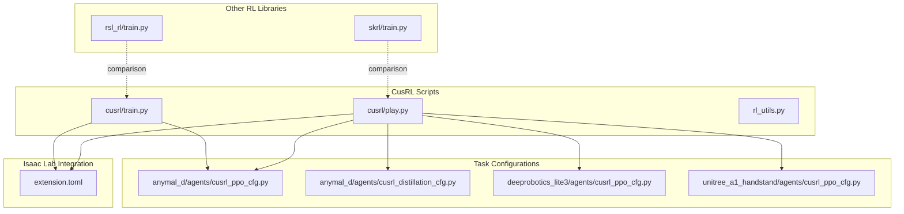
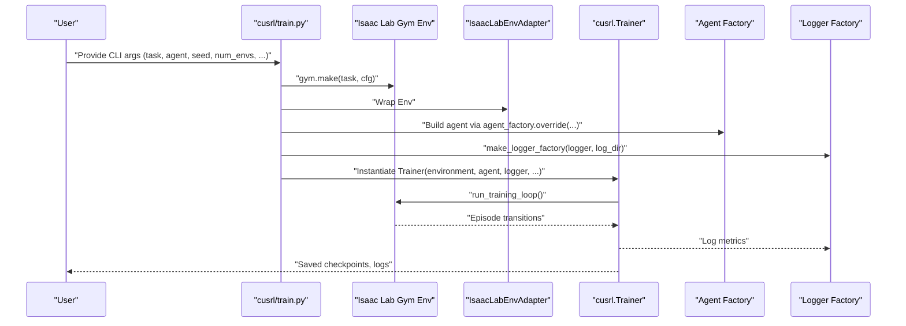
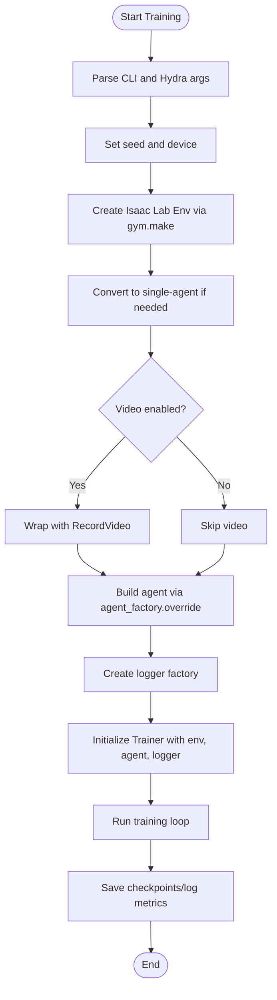
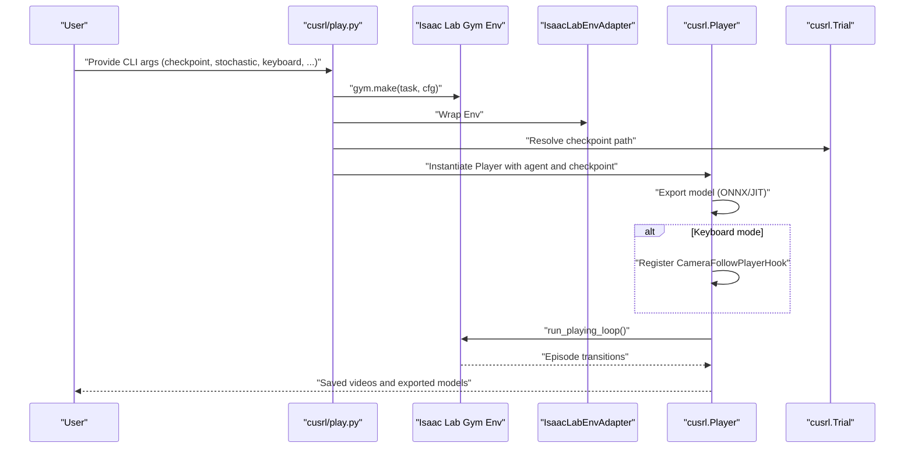
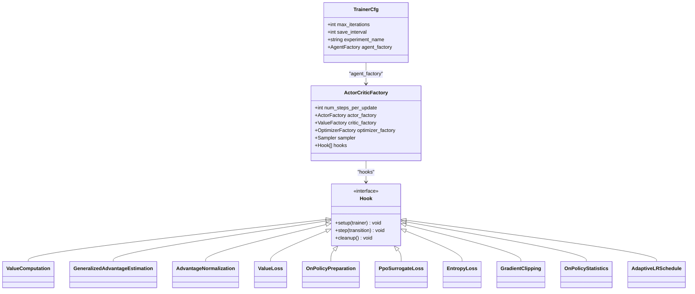
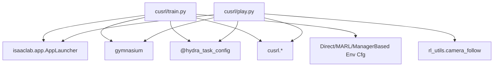

# CusRL Training System

<cite>
**Referenced Files in This Document**
- [train.py](file://scripts/reinforcement_learning/cusrl/train.py)
- [play.py](file://scripts/reinforcement_learning/cusrl/play.py)
- [rl_utils.py](file://scripts/reinforcement_learning/rl_utils.py)
- [cusrl_ppo_cfg.py](file://source/robot_lab/robot_lab/tasks/manager_based/locomotion/velocity/config/quadruped/anymal_d/agents/cusrl_ppo_cfg.py)
- [cusrl_distillation_cfg.py](file://source/robot_lab/robot_lab/tasks/manager_based/locomotion/velocity/config/quadruped/anymal_d/agents/cusrl_distillation_cfg.py)
- [cusrl_ppo_cfg.py (Deeprobotics Lite3)](file://source/robot_lab/robot_lab/tasks/manager_based/locomotion/velocity/config/quadruped/deeprobotics_lite3/agents/cusrl_ppo_cfg.py)
- [cusrl_ppo_cfg.py (Unitree A1 Handstand)](file://source/robot_lab/robot_lab/tasks/manager_based/locomotion/velocity/config/others/unitree_a1_handstand/agents/cusrl_ppo_cfg.py)
- [extension.toml](file://source/robot_lab/config/extension.toml)
- [rsl_rl/train.py](file://scripts/reinforcement_learning/rsl_rl/train.py)
- [skrl/train.py](file://scripts/reinforcement_learning/skrl/train.py)
</cite>

## Table of Contents
1. [Introduction](#introduction)
2. [Project Structure](#project-structure)
3. [Core Components](#core-components)
4. [Architecture Overview](#architecture-overview)
5. [Detailed Component Analysis](#detailed-component-analysis)
6. [Dependency Analysis](#dependency-analysis)
7. [Performance Considerations](#performance-considerations)
8. [Troubleshooting Guide](#troubleshooting-guide)
9. [Conclusion](#conclusion)
10. [Appendices](#appendices)

## Introduction
CusRL is a custom reinforcement learning (RL) training system integrated into the Isaac Lab ecosystem. It provides a flexible, modular framework for training and evaluating policies in Isaac Lab environments. Unlike standardized RL libraries, CusRL emphasizes:
- A compact, extensible training loop built around a Trainer and Player abstraction
- Configurable agent factories and hooks enabling rapid experimentation with on-policy and off-policy paradigms
- Tight integration with Isaac Lab environments and Hydra-based configuration
- Research-oriented capabilities such as policy distillation, adaptive learning rate scheduling, and gradient clipping

CusRL differs from standard RL libraries by offering:
- A unified training interface that adapts to environment types (single-agent, multi-agent)
- Built-in hooks for common RL techniques (advantage estimation, normalization, surrogate loss, entropy loss)
- Optional video recording and exporting models to ONNX/JIT for deployment
- Seamless integration with distributed training via environment/world size adjustments

## Project Structure
The CusRL system resides under the reinforcement learning scripts and integrates with task-specific configurations. Key areas:
- CusRL training and evaluation scripts
- Task configurations defining agent factories and hooks
- Utility functions for environment interaction (camera following)
- Integration with other RL frameworks (RSL-RL, SKRL) for comparative workflows

**Diagram sources**
- [train.py](file://scripts/reinforcement_learning/cusrl/train.py#L1-L146)
- [play.py](file://scripts/reinforcement_learning/cusrl/play.py#L1-L178)
- [rl_utils.py](file://scripts/reinforcement_learning/rl_utils.py#L1-L28)
- [cusrl_ppo_cfg.py](file://source/robot_lab/robot_lab/tasks/manager_based/locomotion/velocity/config/quadruped/anymal_d/agents/cusrl_ppo_cfg.py#L1-L42)
- [cusrl_distillation_cfg.py](file://source/robot_lab/robot_lab/tasks/manager_based/locomotion/velocity/config/quadruped/anymal_d/agents/cusrl_distillation_cfg.py#L1-L34)
- [cusrl_ppo_cfg.py (Deeprobotics Lite3)](file://source/robot_lab/robot_lab/tasks/manager_based/locomotion/velocity/config/quadruped/deeprobotics_lite3/agents/cusrl_ppo_cfg.py#L1-L42)
- [cusrl_ppo_cfg.py (Unitree A1 Handstand)](file://source/robot_lab/robot_lab/tasks/manager_based/locomotion/velocity/config/others/unitree_a1_handstand/agents/cusrl_ppo_cfg.py#L1-L42)
- [rsl_rl/train.py](file://scripts/reinforcement_learning/rsl_rl/train.py#L1-L232)
- [skrl/train.py](file://scripts/reinforcement_learning/skrl/train.py#L1-L250)
- [extension.toml](file://source/robot_lab/config/extension.toml#L1-L36)

**Section sources**
- [train.py](file://scripts/reinforcement_learning/cusrl/train.py#L1-L146)
- [play.py](file://scripts/reinforcement_learning/cusrl/play.py#L1-L178)
- [rl_utils.py](file://scripts/reinforcement_learning/rl_utils.py#L1-L28)
- [extension.toml](file://source/robot_lab/config/extension.toml#L1-L36)

## Core Components
- Training Script (CusRL): Orchestrates environment creation, video recording, trainer instantiation, and training loop execution. Supports CLI overrides for environment count, device, seed, iterations, logging, and optimization flags.
- Evaluation Script (CusRL): Loads checkpoints, exports models to ONNX/JIT, optionally records videos, and runs a playing loop with optional keyboard control and camera-follow hook.
- Task Configurations: Define agent factories, training hyperparameters, and hooks for specific robots and tasks (e.g., quadrupeds, humanoid, wheeled).
- Utilities: Provide helper functions such as camera-follow behavior for interactive viewing.

Key responsibilities:
- Environment lifecycle management and conversion to single-agent when needed
- Logger factory selection and directory management
- Distributed world-size-aware environment scaling
- Hook-driven training pipeline composition

**Section sources**
- [train.py](file://scripts/reinforcement_learning/cusrl/train.py#L79-L139)
- [play.py](file://scripts/reinforcement_learning/cusrl/play.py#L80-L171)
- [cusrl_ppo_cfg.py](file://source/robot_lab/robot_lab/tasks/manager_based/locomotion/velocity/config/quadruped/anymal_d/agents/cusrl_ppo_cfg.py#L10-L42)
- [cusrl_distillation_cfg.py](file://source/robot_lab/robot_lab/tasks/manager_based/locomotion/velocity/config/quadruped/anymal_d/agents/cusrl_distillation_cfg.py#L10-L34)

## Architecture Overview
CusRL’s architecture centers on a Trainer and Player abstractions that wrap an Isaac Lab environment adapter. The training and evaluation scripts serve as entry points that:
- Parse CLI arguments and environment/task configs
- Instantiate the environment and apply optional wrappers (video, single-agent conversion)
- Build the agent via a configurable factory and attach hooks
- Run the training or playing loop and export models when applicable

**Diagram sources**
- [train.py](file://scripts/reinforcement_learning/cusrl/train.py#L79-L139)

## Detailed Component Analysis

### Training Workflow (CusRL)
The training workflow composes environment creation, optional video recording, agent construction, and the training loop. It supports:
- Environment seeding and device configuration
- Automatic mixed precision and torch.compile flags
- Distributed training awareness via world size scaling
- TensorBoard logging and optional video capture

**Diagram sources**
- [train.py](file://scripts/reinforcement_learning/cusrl/train.py#L79-L139)

**Section sources**
- [train.py](file://scripts/reinforcement_learning/cusrl/train.py#L79-L139)

### Evaluation Workflow (CusRL)
The evaluation workflow loads a checkpoint, exports the model to ONNX/JIT, optionally records a video, and runs a playing loop. It supports:
- Deterministic vs stochastic inference modes
- Keyboard control for interactive playback
- Camera-follow hook for dynamic viewport

**Diagram sources**
- [play.py](file://scripts/reinforcement_learning/cusrl/play.py#L80-L171)

**Section sources**
- [play.py](file://scripts/reinforcement_learning/cusrl/play.py#L80-L171)

### Custom Algorithm Implementation Examples
CusRL enables custom algorithm implementations through:
- Agent factories: Compose actor, critic, optimizer, and sampler
- Hooks: Chain computation and updates (e.g., value computation, advantage estimation, surrogate loss, entropy loss, gradient clipping)
- Trainer configuration: Control iterations, save intervals, and experiment naming

Representative configurations:
- PPO-style agent with value computation, GAE, advantage normalization, value loss, on-policy preparation, PPO surrogate loss, entropy loss, gradient clipping, statistics, and adaptive LR schedule
- Distillation-style agent with ModuleInitialization, OnPolicyPreparation, PolicyDistillationLoss, and GradientClipping

**Diagram sources**
- [cusrl_ppo_cfg.py](file://source/robot_lab/robot_lab/tasks/manager_based/locomotion/velocity/config/quadruped/anymal_d/agents/cusrl_ppo_cfg.py#L10-L42)
- [cusrl_distillation_cfg.py](file://source/robot_lab/robot_lab/tasks/manager_based/locomotion/velocity/config/quadruped/anymal_d/agents/cusrl_distillation_cfg.py#L10-L34)

**Section sources**
- [cusrl_ppo_cfg.py](file://source/robot_lab/robot_lab/tasks/manager_based/locomotion/velocity/config/quadruped/anymal_d/agents/cusrl_ppo_cfg.py#L10-L42)
- [cusrl_distillation_cfg.py](file://source/robot_lab/robot_lab/tasks/manager_based/locomotion/velocity/config/quadruped/anymal_d/agents/cusrl_distillation_cfg.py#L10-L34)
- [cusrl_ppo_cfg.py (Deeprobotics Lite3)](file://source/robot_lab/robot_lab/tasks/manager_based/locomotion/velocity/config/quadruped/deeprobotics_lite3/agents/cusrl_ppo_cfg.py#L10-L42)
- [cusrl_ppo_cfg.py (Unitree A1 Handstand)](file://source/robot_lab/robot_lab/tasks/manager_based/locomotion/velocity/config/others/unitree_a1_handstand/agents/cusrl_ppo_cfg.py#L10-L42)

### Environment Integration Specifics
- Environment creation uses gym.make with Hydra task configuration
- Multi-agent environments are converted to single-agent when required by the RL algorithm
- Video recording is conditionally wrapped around the environment
- Camera-follow behavior is integrated for interactive viewing during evaluation

**Section sources**
- [train.py](file://scripts/reinforcement_learning/cusrl/train.py#L103-L121)
- [play.py](file://scripts/reinforcement_learning/cusrl/play.py#L132-L149)
- [rl_utils.py](file://scripts/reinforcement_learning/rl_utils.py#L9-L28)

## Dependency Analysis
CusRL integrates with:
- Isaac Lab app launcher and environment APIs
- Hydra-based task configuration resolution
- CusRL core modules (Trainer, Player, environment adapters, hooks, factories)
- Optional utilities for camera-follow behavior

**Diagram sources**
- [train.py](file://scripts/reinforcement_learning/cusrl/train.py#L57-L72)
- [play.py](file://scripts/reinforcement_learning/cusrl/play.py#L57-L72)

**Section sources**
- [train.py](file://scripts/reinforcement_learning/cusrl/train.py#L57-L72)
- [play.py](file://scripts/reinforcement_learning/cusrl/play.py#L57-L72)

## Performance Considerations
- Mixed precision and torch.compile can improve throughput; use with caution and validate numerical stability
- Distributed training adjusts environment counts per process; ensure workload distribution aligns with hardware resources
- Video recording adds overhead; limit frequency and length for long runs
- Hook ordering affects compute and memory; place heavy computations early and avoid redundant passes

[No sources needed since this section provides general guidance]

## Troubleshooting Guide
Common issues and remedies:
- Incorrect environment seed: Set seed before environment initialization to ensure reproducibility
- Device mismatch in distributed training: Ensure device assignment aligns with local rank
- Insufficient GPU memory: Reduce num_envs or enable mixed precision; adjust batch sizes via sampler configuration
- Video recording disabled unexpectedly: Verify CLI flags and main-process checks for video wrapping
- Keyboard control conflicts: Disable fabric and adjust command generation when using keyboard input

**Section sources**
- [train.py](file://scripts/reinforcement_learning/cusrl/train.py#L87-L91)
- [play.py](file://scripts/reinforcement_learning/cusrl/play.py#L108-L121)

## Conclusion
CusRL offers a streamlined yet powerful training system tailored for Isaac Lab environments. Its modular design—agent factories, hooks, and a unified Trainer/Player—enables rapid experimentation with on-policy and distillation-style methods. Compared to standard RL libraries, CusRL prioritizes simplicity, configurability, and tight integration with Isaac Lab, making it ideal for research and development workflows requiring fast iteration and deployment-ready model exports.

[No sources needed since this section summarizes without analyzing specific files]

## Appendices

### Configuration Options Reference
- Training script options:
  - --video, --video_length, --video_interval
  - --num_envs, --task, --agent
  - --seed, --run_name, --checkpoint
  - --logger, --max_iterations
  - --autocast, --compile
- Evaluation script options:
  - --video, --video_length
  - --disable_fabric, --num_envs, --task, --agent
  - --seed, --checkpoint
  - --stochastic, --keyboard

**Section sources**
- [train.py](file://scripts/reinforcement_learning/cusrl/train.py#L18-L36)
- [play.py](file://scripts/reinforcement_learning/cusrl/play.py#L18-L43)

### Comparative Notes with Other RL Libraries
- RSL-RL: Uses runners (OnPolicyRunner, DistillationRunner) and VecEnv wrappers; supports distributed training and IO descriptor export
- SKRL: Provides algorithm choices (PPO, IPPO, MAPPO, AMP) and ML framework selection; wraps environments via SkrlVecEnvWrapper

These libraries complement CusRL by offering alternative training pipelines and algorithmic choices.

**Section sources**
- [rsl_rl/train.py](file://scripts/reinforcement_learning/rsl_rl/train.py#L117-L225)
- [skrl/train.py](file://scripts/reinforcement_learning/skrl/train.py#L135-L242)