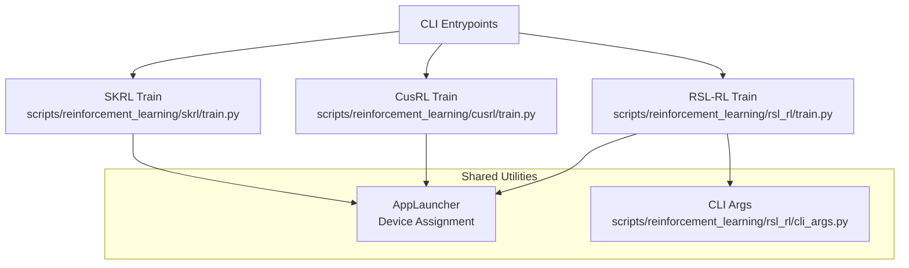
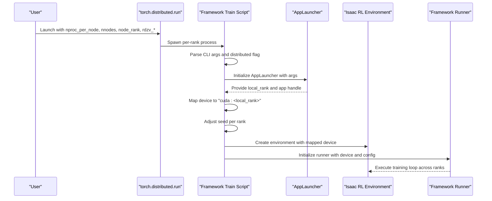
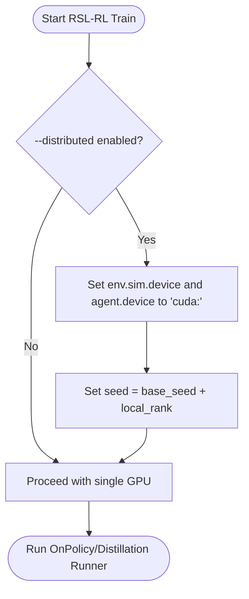
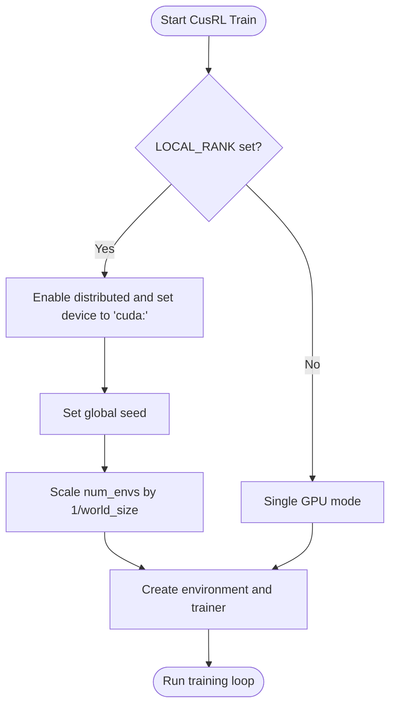
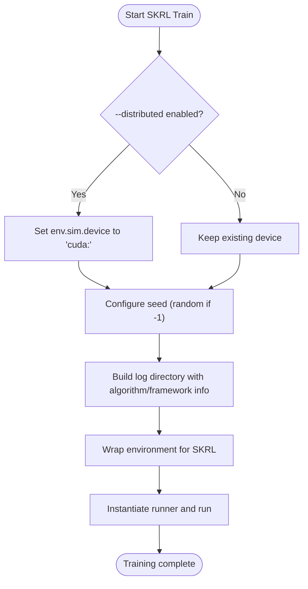
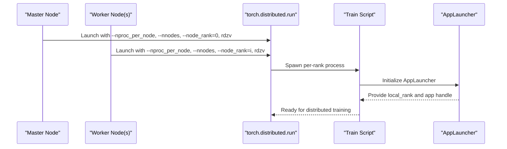
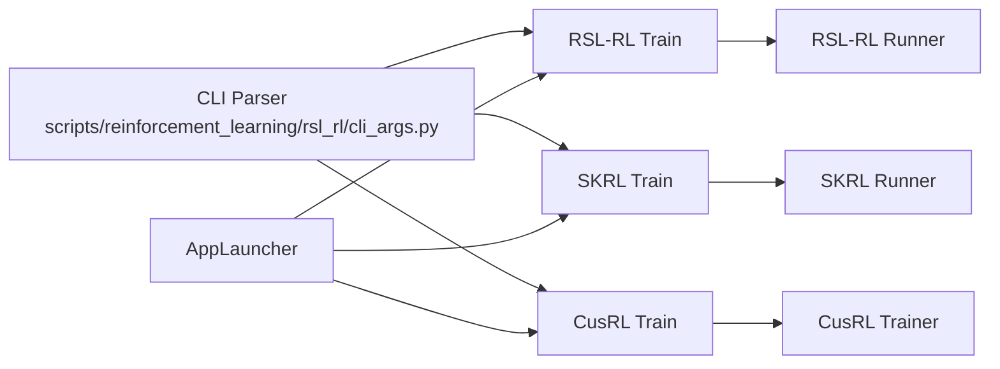

# Distributed Training Support

<cite>
**Referenced Files in This Document**
- [README.md](file://README.md)
- [scripts/reinforcement_learning/rsl_rl/train.py](file://scripts/reinforcement_learning/rsl_rl/train.py)
- [scripts/reinforcement_learning/rsl_rl/cli_args.py](file://scripts/reinforcement_learning/rsl_rl/cli_args.py)
- [scripts/reinforcement_learning/cusrl/train.py](file://scripts/reinforcement_learning/cusrl/train.py)
- [scripts/reinforcement_learning/skrl/train.py](file://scripts/reinforcement_learning/skrl/train.py)
</cite>

## Table of Contents
1. [Introduction](#introduction)
2. [Project Structure](#project-structure)
3. [Core Components](#core-components)
4. [Architecture Overview](#architecture-overview)
5. [Detailed Component Analysis](#detailed-component-analysis)
6. [Dependency Analysis](#dependency-analysis)
7. [Performance Considerations](#performance-considerations)
8. [Troubleshooting Guide](#troubleshooting-guide)
9. [Conclusion](#conclusion)

## Introduction
This document explains the distributed training architecture and multi-GPU/multi-node support in the repository. It covers distributed training configuration, device assignment strategies, seed management across processes, AppLauncher integration for multi-GPU setups, process coordination, and resource allocation. It also provides concrete examples for multi-node scenarios, performance optimization techniques, limitations, and troubleshooting guidance.

## Project Structure
The repository provides three RL frameworks integrated with distributed training:
- RSL-RL training script with explicit distributed flags and device mapping
- CusRL training script with AppLauncher and environment variable detection for distributed mode
- SKRL training script with distributed device mapping and seed handling

**Diagram sources**
- [scripts/reinforcement_learning/rsl_rl/train.py](file://scripts/reinforcement_learning/rsl_rl/train.py#L1-L232)
- [scripts/reinforcement_learning/cusrl/train.py](file://scripts/reinforcement_learning/cusrl/train.py#L1-L146)
- [scripts/reinforcement_learning/skrl/train.py](file://scripts/reinforcement_learning/skrl/train.py#L1-L250)
- [scripts/reinforcement_learning/rsl_rl/cli_args.py](file://scripts/reinforcement_learning/rsl_rl/cli_args.py#L1-L95)

**Section sources**
- [README.md](file://README.md#L328-L347)
- [scripts/reinforcement_learning/rsl_rl/train.py](file://scripts/reinforcement_learning/rsl_rl/train.py#L1-L232)
- [scripts/reinforcement_learning/cusrl/train.py](file://scripts/reinforcement_learning/cusrl/train.py#L1-L146)
- [scripts/reinforcement_learning/skrl/train.py](file://scripts/reinforcement_learning/skrl/train.py#L1-L250)
- [scripts/reinforcement_learning/rsl_rl/cli_args.py](file://scripts/reinforcement_learning/rsl_rl/cli_args.py#L1-L95)

## Core Components
- Distributed training flags and orchestration:
  - RSL-RL: Uses a dedicated distributed flag to enable multi-GPU/multi-node training.
  - CusRL: Detects distributed mode via environment variable and sets device accordingly.
  - SKRL: Supports distributed mode with device mapping and seed configuration.
- AppLauncher integration:
  - Provides local rank and device assignment for multi-GPU processes.
- Device assignment strategies:
  - Maps training devices to "cuda:<local_rank>" for each process.
- Seed management:
  - Adjusts seeds per process to ensure diversity across ranks.
- Process coordination:
  - Uses torch.distributed.run for multi-node coordination with rendezvous parameters.

**Section sources**
- [scripts/reinforcement_learning/rsl_rl/train.py](file://scripts/reinforcement_learning/rsl_rl/train.py#L127-L146)
- [scripts/reinforcement_learning/cusrl/train.py](file://scripts/reinforcement_learning/cusrl/train.py#L46-L50)
- [scripts/reinforcement_learning/skrl/train.py](file://scripts/reinforcement_learning/skrl/train.py#L149-L167)
- [README.md](file://README.md#L328-L347)

## Architecture Overview
The distributed training pipeline integrates CLI parsing, AppLauncher initialization, environment creation, and framework-specific runners. The key flow is:

**Diagram sources**
- [README.md](file://README.md#L328-L347)
- [scripts/reinforcement_learning/rsl_rl/train.py](file://scripts/reinforcement_learning/rsl_rl/train.py#L127-L146)
- [scripts/reinforcement_learning/cusrl/train.py](file://scripts/reinforcement_learning/cusrl/train.py#L46-L50)
- [scripts/reinforcement_learning/skrl/train.py](file://scripts/reinforcement_learning/skrl/train.py#L149-L167)

## Detailed Component Analysis

### RSL-RL Distributed Training
- Distributed flag and device mapping:
  - When distributed is enabled, the script assigns the simulation device and agent device to "cuda:<local_rank>" using AppLauncher’s local rank.
- Seed management:
  - The seed is offset by the local rank to ensure diversity across processes.
- CPU device restriction:
  - A guard prevents distributed training on CPU devices.

**Diagram sources**
- [scripts/reinforcement_learning/rsl_rl/train.py](file://scripts/reinforcement_learning/rsl_rl/train.py#L127-L146)

**Section sources**
- [scripts/reinforcement_learning/rsl_rl/train.py](file://scripts/reinforcement_learning/rsl_rl/train.py#L127-L146)

### CusRL Distributed Training
- Distributed detection:
  - If the LOCAL_RANK environment variable is present, distributed mode is enabled and the device is set to "cuda:<LOCAL_RANK>".
- Seed and environment configuration:
  - Global seed is set early; environment num_envs is divided by world size to balance environments across ranks.
- Video recording:
  - Video recording is restricted to the main process to avoid duplication.

**Diagram sources**
- [scripts/reinforcement_learning/cusrl/train.py](file://scripts/reinforcement_learning/cusrl/train.py#L46-L50)
- [scripts/reinforcement_learning/cusrl/train.py](file://scripts/reinforcement_learning/cusrl/train.py#L87-L91)

**Section sources**
- [scripts/reinforcement_learning/cusrl/train.py](file://scripts/reinforcement_learning/cusrl/train.py#L46-L50)
- [scripts/reinforcement_learning/cusrl/train.py](file://scripts/reinforcement_learning/cusrl/train.py#L87-L91)

### SKRL Distributed Training
- Distributed device mapping:
  - When distributed is enabled, the environment simulation device is mapped to "cuda:<local_rank>".
- Seed handling:
  - Seeds can be sampled randomly if set to a sentinel value; otherwise, the provided seed is used.
- Logger and experiment naming:
  - Experiment directory and run name are constructed with algorithm and framework identifiers.

**Diagram sources**
- [scripts/reinforcement_learning/skrl/train.py](file://scripts/reinforcement_learning/skrl/train.py#L149-L167)

**Section sources**
- [scripts/reinforcement_learning/skrl/train.py](file://scripts/reinforcement_learning/skrl/train.py#L149-L167)

### AppLauncher Integration and Process Coordination
- AppLauncher provides:
  - local_rank for device assignment
  - app handle for initializing the simulation environment
- Multi-node coordination:
  - The repository documentation demonstrates launching with torch.distributed.run, specifying nproc_per_node, nnodes, node_rank, rendezvous id/backend/endpoint, and passing the distributed flag to scripts.

**Diagram sources**
- [README.md](file://README.md#L338-L347)
- [scripts/reinforcement_learning/rsl_rl/train.py](file://scripts/reinforcement_learning/rsl_rl/train.py#L127-L146)
- [scripts/reinforcement_learning/cusrl/train.py](file://scripts/reinforcement_learning/cusrl/train.py#L46-L50)
- [scripts/reinforcement_learning/skrl/train.py](file://scripts/reinforcement_learning/skrl/train.py#L149-L167)

**Section sources**
- [README.md](file://README.md#L338-L347)
- [scripts/reinforcement_learning/rsl_rl/train.py](file://scripts/reinforcement_learning/rsl_rl/train.py#L127-L146)
- [scripts/reinforcement_learning/cusrl/train.py](file://scripts/reinforcement_learning/cusrl/train.py#L46-L50)
- [scripts/reinforcement_learning/skrl/train.py](file://scripts/reinforcement_learning/skrl/train.py#L149-L167)

## Dependency Analysis
- CLI argument handling:
  - RSL-RL defines its own CLI group for experiment, loading, and logging options.
- Framework-specific runners:
  - RSL-RL uses OnPolicyRunner or DistillationRunner with device mapping.
  - SKRL uses a generic Runner with environment wrappers.
  - CusRL uses a Trainer with environment adapter and logger factory.
- AppLauncher dependency:
  - All scripts depend on AppLauncher for device assignment and simulation app lifecycle.

**Diagram sources**
- [scripts/reinforcement_learning/rsl_rl/cli_args.py](file://scripts/reinforcement_learning/rsl_rl/cli_args.py#L19-L95)
- [scripts/reinforcement_learning/rsl_rl/train.py](file://scripts/reinforcement_learning/rsl_rl/train.py#L117-L206)
- [scripts/reinforcement_learning/skrl/train.py](file://scripts/reinforcement_learning/skrl/train.py#L224-L237)
- [scripts/reinforcement_learning/cusrl/train.py](file://scripts/reinforcement_learning/cusrl/train.py#L122-L132)

**Section sources**
- [scripts/reinforcement_learning/rsl_rl/cli_args.py](file://scripts/reinforcement_learning/rsl_rl/cli_args.py#L19-L95)
- [scripts/reinforcement_learning/rsl_rl/train.py](file://scripts/reinforcement_learning/rsl_rl/train.py#L117-L206)
- [scripts/reinforcement_learning/skrl/train.py](file://scripts/reinforcement_learning/skrl/train.py#L224-L237)
- [scripts/reinforcement_learning/cusrl/train.py](file://scripts/reinforcement_learning/cusrl/train.py#L122-L132)

## Performance Considerations
- Mixed precision and deterministic settings:
  - TF32 allowances and deterministic/benchmark toggles are configured in the scripts to balance speed and reproducibility.
- Environment scaling:
  - CusRL divides num_envs by world_size to distribute workload evenly across ranks.
- Logging and IO:
  - Separate log directories per run and optional IO descriptor exports are supported to facilitate monitoring and debugging.

**Section sources**
- [scripts/reinforcement_learning/rsl_rl/train.py](file://scripts/reinforcement_learning/rsl_rl/train.py#L111-L114)
- [scripts/reinforcement_learning/cusrl/train.py](file://scripts/reinforcement_learning/cusrl/train.py#L87-L91)
- [scripts/reinforcement_learning/rsl_rl/train.py](file://scripts/reinforcement_learning/rsl_rl/train.py#L160-L166)

## Troubleshooting Guide
- Distributed training on CPU:
  - A guard raises an error if distributed training is attempted with a CPU device. Use a GPU device for distributed training.
- Multi-node rendezvous:
  - Ensure consistent rendezvous id, backend, and endpoint across nodes. Ports must be reachable and free.
- Device mapping:
  - Confirm that local_rank corresponds to an available CUDA device index on each node.
- Seed collisions:
  - Seeds are offset by local_rank; verify that base seeds are set appropriately to avoid identical seeds across ranks.
- Environment count balancing:
  - For CusRL, ensure world_size is considered when setting num_envs to prevent uneven distribution.

**Section sources**
- [scripts/reinforcement_learning/rsl_rl/train.py](file://scripts/reinforcement_learning/rsl_rl/train.py#L131-L136)
- [README.md](file://README.md#L338-L347)
- [scripts/reinforcement_learning/cusrl/train.py](file://scripts/reinforcement_learning/cusrl/train.py#L87-L91)

## Conclusion
The repository provides robust distributed training support across RSL-RL, CusRL, and SKRL. AppLauncher integrates seamlessly to assign devices per rank, while scripts coordinate device mapping, seed management, and process orchestration. The provided examples demonstrate single-node multi-GPU and multi-node multi-GPU setups. Adhering to the outlined constraints and best practices ensures reliable distributed training performance and scalability.