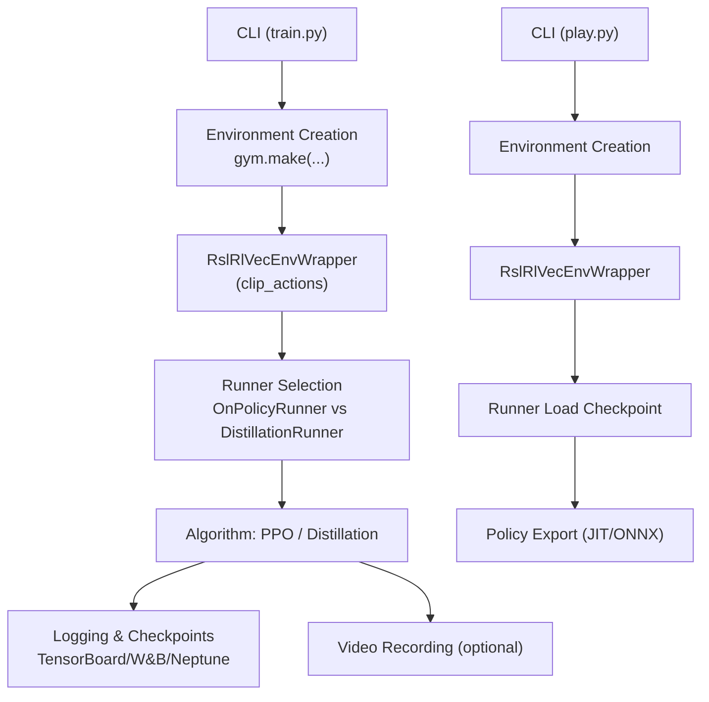
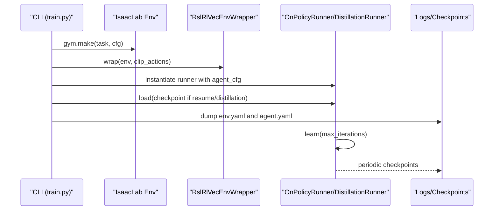
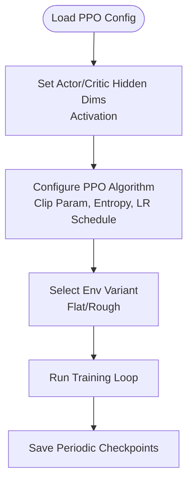
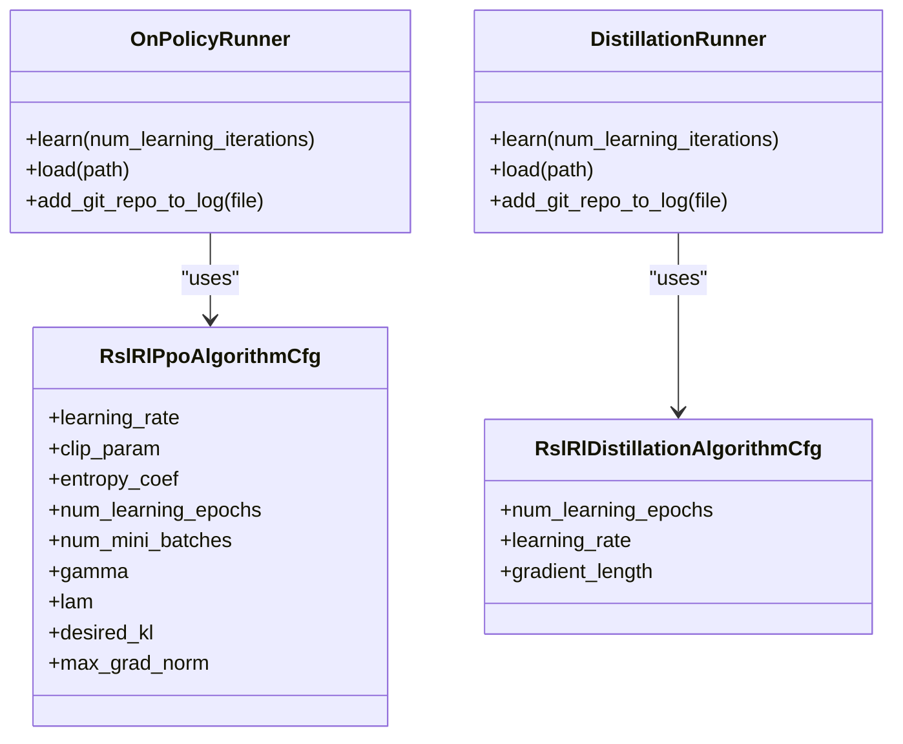
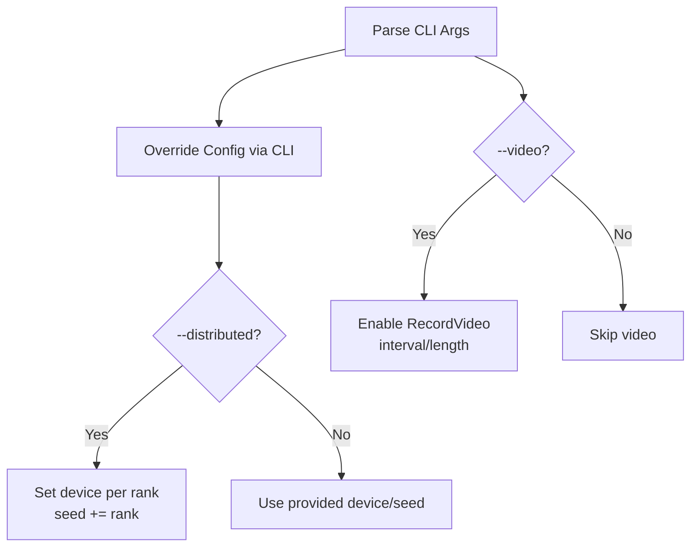
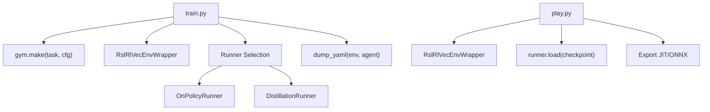

# RSL-RL Training System

<cite>
**Referenced Files in This Document**
- [README.md](file://README.md)
- [train.py](file://scripts/reinforcement_learning/rsl_rl/train.py)
- [play.py](file://scripts/reinforcement_learning/rsl_rl/play.py)
- [cli_args.py](file://scripts/reinforcement_learning/rsl_rl/cli_args.py)
- [rsl_rl_ppo_cfg.py](file://source/robot_lab/robot_lab/tasks/manager_based/locomotion/velocity/config/quadruped/anymal_d/agents/rsl_rl_ppo_cfg.py)
- [rsl_rl_distillation_cfg.py](file://source/robot_lab/robot_lab/tasks/manager_based/locomotion/velocity/config/quadruped/anymal_d/agents/rsl_rl_distillation_cfg.py)
- [flat_env_cfg.py](file://source/robot_lab/robot_lab/tasks/manager_based/locomotion/velocity/config/quadruped/anymal_d/flat_env_cfg.py)
</cite>

## Table of Contents
1. [Introduction](#introduction)
2. [Project Structure](#project-structure)
3. [Core Components](#core-components)
4. [Architecture Overview](#architecture-overview)
5. [Detailed Component Analysis](#detailed-component-analysis)
6. [Dependency Analysis](#dependency-analysis)
7. [Performance Considerations](#performance-considerations)
8. [Troubleshooting Guide](#troubleshooting-guide)
9. [Conclusion](#conclusion)
10. [Appendices](#appendices)

## Introduction
This document explains the RSL-RL training system implemented in the repository. It covers the Proximal Policy Optimization (PPO) algorithm configuration, the training pipeline, and the CLI argument system. It also documents the OnPolicyRunner and DistillationRunner classes, their differences and use cases, the environment wrapper system, action clipping, and video recording. Finally, it provides guidance on distributed training, experiment logging, checkpoint management, and common training issues.

## Project Structure
The RSL-RL training system is organized around three primary scripts and configuration modules:
- Training entry point: scripts/reinforcement_learning/rsl_rl/train.py
- Playback/inference entry point: scripts/reinforcement_learning/rsl_rl/play.py
- CLI argument helpers: scripts/reinforcement_learning/rsl_rl/cli_args.py
- Agent configuration templates: source/robot_lab/robot_lab/tasks/.../agents/rsl_rl_ppo_cfg.py and rsl_rl_distillation_cfg.py
- Environment configuration templates: source/robot_lab/robot_lab/tasks/.../flat_env_cfg.py and related rough variants

**Diagram sources**
- [train.py](file://scripts/reinforcement_learning/rsl_rl/train.py#L171-L224)
- [play.py](file://scripts/reinforcement_learning/rsl_rl/play.py#L158-L214)

**Section sources**
- [README.md](file://README.md#L193-L348)
- [train.py](file://scripts/reinforcement_learning/rsl_rl/train.py#L1-L232)
- [play.py](file://scripts/reinforcement_learning/rsl_rl/play.py#L1-L254)

## Core Components
- PPO Algorithm Configuration: The PPO configuration defines policy architecture, value loss coefficient, clipping parameters, entropy bonus, learning rate schedule, discount factor, GAE lambda, KL target, and gradient norm clipping. See [rsl_rl_ppo_cfg.py](file://source/robot_lab/robot_lab/tasks/manager_based/locomotion/velocity/config/quadruped/anymal_d/agents/rsl_rl_ppo_cfg.py#L12-L38).
- Distillation Configuration: Distillation runner configuration sets up a student-teacher architecture with shared observation groups and a distillation-specific algorithm configuration. See [rsl_rl_distillation_cfg.py](file://source/robot_lab/robot_lab/tasks/manager_based/locomotion/velocity/config/quadruped/anymal_d/agents/rsl_rl_distillation_cfg.py#L18-L38).
- Environment Wrapping and Action Clipping: The environment is wrapped with RslRlVecEnvWrapper and actions are clipped according to agent configuration. See [train.py](file://scripts/reinforcement_learning/rsl_rl/train.py#L196-L197) and [play.py](file://scripts/reinforcement_learning/rsl_rl/play.py#L177-L178).
- Video Recording: Optional video capture during training and playback using gym.wrappers.RecordVideo with configurable intervals and lengths. See [train.py](file://scripts/reinforcement_learning/rsl_rl/train.py#L182-L192) and [play.py](file://scripts/reinforcement_learning/rsl_rl/play.py#L165-L175).

**Section sources**
- [rsl_rl_ppo_cfg.py](file://source/robot_lab/robot_lab/tasks/manager_based/locomotion/velocity/config/quadruped/anymal_d/agents/rsl_rl_ppo_cfg.py#L12-L38)
- [rsl_rl_distillation_cfg.py](file://source/robot_lab/robot_lab/tasks/manager_based/locomotion/velocity/config/quadruped/anymal_d/agents/rsl_rl_distillation_cfg.py#L18-L38)
- [train.py](file://scripts/reinforcement_learning/rsl_rl/train.py#L182-L197)
- [play.py](file://scripts/reinforcement_learning/rsl_rl/play.py#L165-L178)

## Architecture Overview
The training pipeline integrates environment creation, optional video recording, environment wrapping, runner instantiation, checkpoint loading, and algorithm learning loops. The playback pipeline mirrors this with checkpoint loading and policy export.

**Diagram sources**
- [train.py](file://scripts/reinforcement_learning/rsl_rl/train.py#L171-L224)

## Detailed Component Analysis

### PPO Algorithm Implementation and Hyperparameters
- Policy architecture: Hidden layers and activation are configured per environment variant. See [rsl_rl_ppo_cfg.py](file://source/robot_lab/robot_lab/tasks/manager_based/locomotion/velocity/config/quadruped/anymal_d/agents/rsl_rl_ppo_cfg.py#L17-L24).
- Algorithm hyperparameters: Includes value loss coefficient, clipped value loss, clipping parameter, entropy coefficient, epochs, mini-batches, learning rate schedule, discount factor gamma, GAE lambda, desired KL divergence, and max gradient norm. See [rsl_rl_ppo_cfg.py](file://source/robot_lab/robot_lab/tasks/manager_based/locomotion/velocity/config/quadruped/anymal_d/agents/rsl_rl_ppo_cfg.py#L25-L38).
- Environment variants: Flat and Rough variants adjust terrain and reward terms. See [flat_env_cfg.py](file://source/robot_lab/robot_lab/tasks/manager_based/locomotion/velocity/config/quadruped/anymal_d/flat_env_cfg.py#L9-L29).

**Diagram sources**
- [rsl_rl_ppo_cfg.py](file://source/robot_lab/robot_lab/tasks/manager_based/locomotion/velocity/config/quadruped/anymal_d/agents/rsl_rl_ppo_cfg.py#L12-L38)
- [flat_env_cfg.py](file://source/robot_lab/robot_lab/tasks/manager_based/locomotion/velocity/config/quadruped/anymal_d/flat_env_cfg.py#L9-L29)

**Section sources**
- [rsl_rl_ppo_cfg.py](file://source/robot_lab/robot_lab/tasks/manager_based/locomotion/velocity/config/quadruped/anymal_d/agents/rsl_rl_ppo_cfg.py#L12-L38)
- [flat_env_cfg.py](file://source/robot_lab/robot_lab/tasks/manager_based/locomotion/velocity/config/quadruped/anymal_d/flat_env_cfg.py#L9-L29)

### OnPolicyRunner vs DistillationRunner
- OnPolicyRunner: Standard PPO training loop with policy and value networks, configured via PPO algorithm settings. Instantiated in [train.py](file://scripts/reinforcement_learning/rsl_rl/train.py#L200-L205).
- DistillationRunner: Student-teacher distillation training with separate student and teacher policies, specialized algorithm configuration, and observation groups. Defined in [rsl_rl_distillation_cfg.py](file://source/robot_lab/robot_lab/tasks/manager_based/locomotion/velocity/config/quadruped/anymal_d/agents/rsl_rl_distillation_cfg.py#L18-L38) and instantiated in [train.py](file://scripts/reinforcement_learning/rsl_rl/train.py#L202-L203).

**Diagram sources**
- [train.py](file://scripts/reinforcement_learning/rsl_rl/train.py#L200-L205)
- [rsl_rl_ppo_cfg.py](file://source/robot_lab/robot_lab/tasks/manager_based/locomotion/velocity/config/quadruped/anymal_d/agents/rsl_rl_ppo_cfg.py#L25-L38)
- [rsl_rl_distillation_cfg.py](file://source/robot_lab/robot_lab/tasks/manager_based/locomotion/velocity/config/quadruped/anymal_d/agents/rsl_rl_distillation_cfg.py#L34-L38)

**Section sources**
- [train.py](file://scripts/reinforcement_learning/rsl_rl/train.py#L200-L205)
- [rsl_rl_distillation_cfg.py](file://source/robot_lab/robot_lab/tasks/manager_based/locomotion/velocity/config/quadruped/anymal_d/agents/rsl_rl_distillation_cfg.py#L18-L38)

### CLI Argument System
Key CLI arguments for training and playback:
- Video recording: --video, --video_length, --video_interval
- Environment scaling: --num_envs
- Task selection: --task, --agent
- Seed and iterations: --seed, --max_iterations
- Distributed training: --distributed
- Export I/O descriptors: --export_io_descriptors
- RSL-RL specific: --experiment_name, --run_name, --resume, --load_run, --checkpoint, --logger, --log_project_name

See argument parsing and updates in [train.py](file://scripts/reinforcement_learning/rsl_rl/train.py#L22-L44) and [cli_args.py](file://scripts/reinforcement_learning/rsl_rl/cli_args.py#L19-L94).

**Diagram sources**
- [train.py](file://scripts/reinforcement_learning/rsl_rl/train.py#L120-L146)
- [train.py](file://scripts/reinforcement_learning/rsl_rl/train.py#L182-L192)
- [cli_args.py](file://scripts/reinforcement_learning/rsl_rl/cli_args.py#L19-L94)

**Section sources**
- [train.py](file://scripts/reinforcement_learning/rsl_rl/train.py#L22-L44)
- [cli_args.py](file://scripts/reinforcement_learning/rsl_rl/cli_args.py#L19-L94)

### Environment Wrapper and Action Clipping
- The environment is wrapped with RslRlVecEnvWrapper to adapt observations/actions for RSL-RL. See [train.py](file://scripts/reinforcement_learning/rsl_rl/train.py#L196-L197) and [play.py](file://scripts/reinforcement_learning/rsl_rl/play.py#L177-L178).
- Action clipping is controlled by agent_cfg.clip_actions and applied by the wrapper.

**Section sources**
- [train.py](file://scripts/reinforcement_learning/rsl_rl/train.py#L196-L197)
- [play.py](file://scripts/reinforcement_learning/rsl_rl/play.py#L177-L178)

### Video Recording Capabilities
- Training: Optional video recording with configurable interval and length. See [train.py](file://scripts/reinforcement_learning/rsl_rl/train.py#L182-L192).
- Playback: Single-frame trigger at episode start. See [play.py](file://scripts/reinforcement_learning/rsl_rl/play.py#L165-L175).

**Section sources**
- [train.py](file://scripts/reinforcement_learning/rsl_rl/train.py#L182-L192)
- [play.py](file://scripts/reinforcement_learning/rsl_rl/play.py#L165-L175)

### Distributed Training
- Single-node multi-GPU: Use torch.distributed.run with --nproc_per_node equal to the number of GPUs. See [README.md](file://README.md#L333-L347).
- Multi-node: Launch a process per node with --nnodes and --node_rank, and specify rendezvous endpoint and backend. See [README.md](file://README.md#L339-L347).
- Per-rank device assignment and seed increment are handled in the training script. See [train.py](file://scripts/reinforcement_learning/rsl_rl/train.py#L138-L146).

**Section sources**
- [README.md](file://README.md#L333-L347)
- [train.py](file://scripts/reinforcement_learning/rsl_rl/train.py#L138-L146)

### Experiment Logging and Checkpoint Management
- Logging directory: logs/rsl_rl/{experiment_name}/{timestamp}_{run_name}. See [train.py](file://scripts/reinforcement_learning/rsl_rl/train.py#L148-L158).
- Configuration dumps: env.yaml and agent.yaml saved under logs. See [train.py](file://scripts/reinforcement_learning/rsl_rl/train.py#L214-L216).
- Checkpoint loading: get_checkpoint_path resolves run/checkpoint; loaded by runner.load. See [train.py](file://scripts/reinforcement_learning/rsl_rl/train.py#L178-L212).
- Playback checkpoint resolution and export: JIT/ONNX export of policy and optional normalizer. See [play.py](file://scripts/reinforcement_learning/rsl_rl/play.py#L140-L213).

**Section sources**
- [train.py](file://scripts/reinforcement_learning/rsl_rl/train.py#L148-L216)
- [play.py](file://scripts/reinforcement_learning/rsl_rl/play.py#L140-L213)

### Concrete Examples
- Configure training runs: Select task and agent entry point, set seed and iterations, choose environment variant (Flat/Rough). See [README.md](file://README.md#L197-L216).
- Multi-GPU training: Use torch.distributed.run with --nproc_per_node=N for multi-GPU on a single node; extend to multiple nodes with --nnodes and --node_rank. See [README.md](file://README.md#L333-L347).
- Export model checkpoints: After loading a checkpoint in playback, the policy is exported to JIT and ONNX under the checkpoint’s exported/ directory. See [play.py](file://scripts/reinforcement_learning/rsl_rl/play.py#L210-L213).

**Section sources**
- [README.md](file://README.md#L197-L216)
- [README.md](file://README.md#L333-L347)
- [play.py](file://scripts/reinforcement_learning/rsl_rl/play.py#L210-L213)

## Dependency Analysis
The training and playback scripts depend on:
- Environment registration and configuration via task entry points
- RSL-RL runners (OnPolicyRunner, DistillationRunner)
- Environment wrapper (RslRlVecEnvWrapper)
- Logging and checkpoint utilities

**Diagram sources**
- [train.py](file://scripts/reinforcement_learning/rsl_rl/train.py#L171-L224)
- [play.py](file://scripts/reinforcement_learning/rsl_rl/play.py#L158-L213)

**Section sources**
- [train.py](file://scripts/reinforcement_learning/rsl_rl/train.py#L171-L224)
- [play.py](file://scripts/reinforcement_learning/rsl_rl/play.py#L158-L213)

## Performance Considerations
- Enable TF32 and disable deterministic CUDNN for speed on supported GPUs. See [train.py](file://scripts/reinforcement_learning/rsl_rl/train.py#L111-L114).
- Adjust num_envs to saturate devices; tune num_steps_per_env and num_mini_batches for throughput. See [rsl_rl_ppo_cfg.py](file://source/robot_lab/robot_lab/tasks/manager_based/locomotion/velocity/config/quadruped/anymal_d/agents/rsl_rl_ppo_cfg.py#L12-L15).
- Use --distributed for multi-GPU scaling; ensure seeds are offset per rank to avoid identical randomization. See [train.py](file://scripts/reinforcement_learning/rsl_rl/train.py#L138-L146).
- Reduce environment randomness during playback to stabilize evaluation. See [play.py](file://scripts/reinforcement_learning/rsl_rl/play.py#L117-L123).

[No sources needed since this section provides general guidance]

## Troubleshooting Guide
- Unsupported runner class: Ensure agent_cfg.class_name is OnPolicyRunner or DistillationRunner. See [train.py](file://scripts/reinforcement_learning/rsl_rl/train.py#L204-L205).
- Distributed training on CPU: Distributed training requires CUDA devices; the script raises an error if device is CPU with --distributed. See [train.py](file://scripts/reinforcement_learning/rsl_rl/train.py#L131-L136).
- Video recording not appearing: Ensure --video is enabled and enable_cameras is set; verify video_folder permissions. See [train.py](file://scripts/reinforcement_learning/rsl_rl/train.py#L46-L48) and [train.py](file://scripts/reinforcement_learning/rsl_rl/train.py#L182-L192).
- Pre-trained checkpoint availability: Playback supports retrieving published pretrained checkpoints; if unavailable, the script informs and exits gracefully. See [play.py](file://scripts/reinforcement_learning/rsl_rl/play.py#L143-L147).

**Section sources**
- [train.py](file://scripts/reinforcement_learning/rsl_rl/train.py#L131-L136)
- [train.py](file://scripts/reinforcement_learning/rsl_rl/train.py#L182-L192)
- [play.py](file://scripts/reinforcement_learning/rsl_rl/play.py#L143-L147)

## Conclusion
The RSL-RL training system integrates environment creation, optional video recording, environment wrapping, runner selection, and robust logging and checkpointing. PPO and distillation configurations are cleanly separated and templated per environment variant. The CLI system supports distributed training, experiment naming, and exporting trained policies. Following the examples and guidance herein enables efficient multi-GPU training, reproducible experiments, and reliable deployment of policies.

[No sources needed since this section summarizes without analyzing specific files]

## Appendices

### Appendix A: Environment Variants and Reward Adjustments
- Flat environments remove terrain height scanning and curriculum, simplifying reward computation. See [flat_env_cfg.py](file://source/robot_lab/robot_lab/tasks/manager_based/locomotion/velocity/config/quadruped/anymal_d/flat_env_cfg.py#L10-L29).

**Section sources**
- [flat_env_cfg.py](file://source/robot_lab/robot_lab/tasks/manager_based/locomotion/velocity/config/quadruped/anymal_d/flat_env_cfg.py#L10-L29)